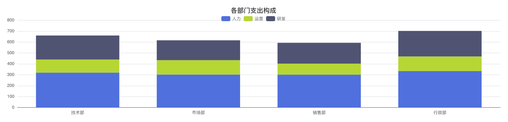
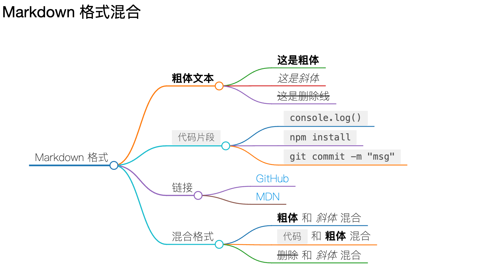
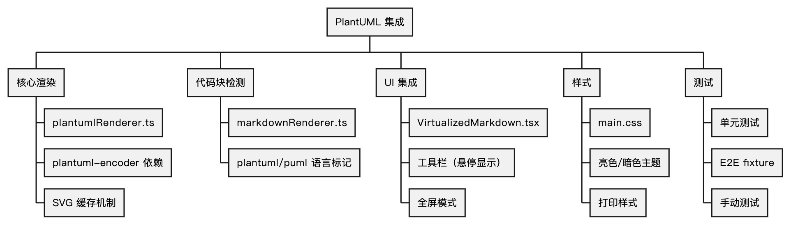
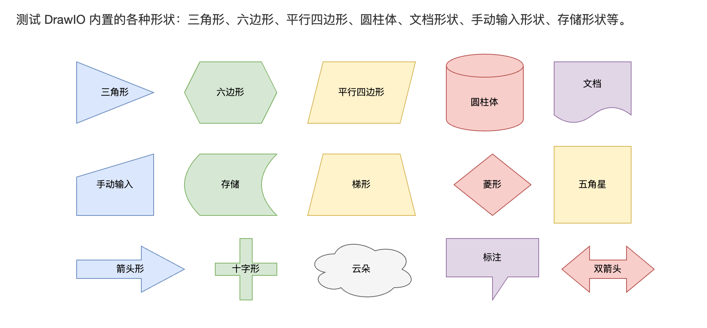

# MD Viewer

> 一个简洁、高效的桌面端 Markdown 预览工具

[](LICENSE)
[](https://github.com/wj2929/md-viewer/releases)
[](https://electronjs.org/)
[](https://react.dev/)
[](https://www.typescriptlang.org/)
[](https://github.com/wj2929/md-viewer)

---

## ✨ 特性

- 📁 **文件树浏览** - 递归显示文件夹中的所有 Markdown 文件
- 📑 **多标签预览** - 同时打开多个文件，Tab 右键菜单管理
- 📌 **标签页固定** - 右键固定常用标签，跨会话保持 (v1.3.6+)
- ⭐ **书签功能** - 侧边栏书签面板，拖拽排序，智能跳转容错 (v1.3.6+)
- 🕐 **最近文件** - 快速访问最近打开的文件 (v1.3.6+)
- 🔍 **页面内搜索** - Cmd+Shift+F 搜索当前文档，实时高亮匹配 (v1.4.0+)
- 🖥️ **全屏查看** - Cmd+F11 沉浸式阅读，ESC 退出 (v1.4.3+)
- 📌 **窗口置顶** - Cmd+Option+T 窗口固定在最上层 (v1.4.2+)
- 🔤 **字体大小调节** - Cmd+/-/0 调节预览字体大小 (v1.4.2+)
- 🖨️ **打印功能** - Cmd+P 打印当前文档 (v1.4.2+)
- ⌨️ **快捷键帮助** - 右键菜单查看所有快捷键 (v1.4.0+)
- 🎨 **完整 Markdown 支持** - 标题、列表、表格、引用等，GitHub 风格样式
- 💻 **代码高亮** - 支持 15+ 编程语言，GitHub 主题
- 📐 **数学公式** - KaTeX 渲染 LaTeX 公式
- 📊 **Mermaid 图表** - 支持流程图、时序图、甘特图、C4 架构图、思维导图等
- 📈 **ECharts 图表** - echarts/js/json 代码块智能检测，交互式图表渲染 (v1.5.0+)
- 📊 **AntV Infographic** - infographic 代码块渲染信息图，236 个内置模板 (v1.5.2+)
- 🖼️ **图片 Lightbox** - 点击图片全屏预览，支持缩放、拖拽平移、左右切换 (v1.5.1+)
- 🪟 **递归分屏** - N 面板水平/垂直分屏，拖拽标签页到面板边缘自动分屏 (v1.5.1+)
- 🔗 **内部链接跳转** - 点击 .md 链接 IPC 跳转，右键可在分屏中打开 (v1.5.1+)
- 📂 **全窗口拖拽** - 从 Finder/资源管理器拖拽 .md 文件或文件夹直接打开 (v1.5.1+)
- 🪟 **多窗口支持** - Cmd+N 新建窗口，书签跨窗口同步 (v1.5.2+)
- ⚙️ **设置面板** - 主题/字体/最近文件上限/导出署名等可配置 (v1.5.2+)
- 📌 **书签右键菜单** - 右键书签可分屏打开或删除 (v1.5.4+)
- 🗺️ **Markmap 思维导图** - markmap 代码块渲染交互式思维导图，支持缩放/拖拽/折叠 (v1.5.4+)
- 📐 **Graphviz DOT 图表** - dot/graphviz 代码块渲染有向图/无向图 (v1.5.4+)
- 🕐 **最近文件右键菜单** - 右键最近文件可分屏打开或从历史移除 (v1.5.4+)
- 📊 **DrawIO 图表** - drawio 代码块渲染 DrawIO 图表，支持缩放/全屏/下载 (v1.5.5+)
- 🎯 **图表工具栏悬停显示** - 6 种图表工具栏鼠标悬停时显示，视觉更干净 (v1.5.5+)
- 🌿 **PlantUML 图表** - plantuml 代码块渲染 UML 图表，服务器地址可配置 (v1.6.0+)
- ⚖️ **搜索结果公平分配** - 全部模式下每组保底展示，解决当前文件夹垄断问题 (v1.6.0+)
- 📜 **搜索历史记录** - 搜索历史持久化，跨会话保留 (v1.6.0+)
- 👀 **实时监听** - 文件修改自动刷新，无需手动重载
- 🔍 **强大搜索** - 文件名模糊搜索 + 全文搜索
- 💾 **导出功能** - 右键菜单导出 HTML 和 PDF（支持 Mermaid/ECharts 图表）
- 📑 **目录导航** - 点击目录跳转到对应章节，自动滚动到当前位置 (v1.4.4+)
- 🧭 **浮动导航** - 快速返回顶部/底部 + 目录大纲 (v1.3.5+)
- 🖱️ **系统右键菜单** - Finder/Explorer 中右键打开文件 (v1.3.4+)
- 🌓 **主题自适应** - 自动跟随系统明暗主题
- ⚡ **极速体验** - Vite 热重载，秒级启动
- 📋 **多文件选择** - Cmd+点击、Shift+点击、Cmd+A 全选
- 🔄 **跨应用剪贴板** - 与 Finder 互通复制粘贴
- 🔒 **安全加固** - 45+ 路径保护规则，沙箱隔离

---

## 🖼️ 截图


---

## 📊 图表渲染展示

MD Viewer 支持 **8 种图表/公式渲染**，在 Markdown 代码块中直接编写即可实时预览，导出 HTML/PDF 时完整保留。

|  Mermaid 流程图/时序图/类图  |  ECharts 交互式图表  |
| :---: | :---: |
|  |  |
| 支持 15+ 图表类型：流程图、时序图、甘特图、饼图、C4 架构图等 | 智能检测 echarts/js/json 代码块，自动渲染交互式图表 |

|  Markmap 思维导图  |  Graphviz 有向图  |
| :---: | :---: |
|  |  |
| 交互式 SVG，支持缩放/拖拽/折叠节点 | WASM 渲染 DOT 语言，支持有向图/无向图/子图 |

|  PlantUML UML 图  |  DrawIO 图表  |
| :---: | :---: |
|  |  |
| 服务器地址可配置，支持类图/时序图/用例图等 | 本地 WASM 渲染，支持缩放/全屏/SVG 下载 |

|  AntV Infographic 信息图  |  KaTeX 数学公式  |
| :---: | :---: |
|  |  |
| 236 个内置模板，自定义缩进语法 | LaTeX 公式渲染，行内 `$...$` 和块级 `$$...$$` |

---

## 📦 下载

### macOS

**下载：**
- [MD Viewer-1.6.0-arm64.dmg](https://github.com/wj2929/md-viewer/releases/tag/v1.6.0) (Apple Silicon M1/M2/M3)
- [MD Viewer-1.6.0.dmg](https://github.com/wj2929/md-viewer/releases/tag/v1.6.0) (Intel Mac)

⚠️ **首次安装说明**

由于本项目为开源软件，未经过 Apple 公证。首次打开时可能提示"已损坏"或"无法验证开发者"，这是正常的安全提示。

**方法 1：右键打开（macOS Catalina / Big Sur 推荐）**
1. 右键点击应用图标
2. 选择"打开"
3. 在弹出的对话框中点击"打开"

**方法 2：命令行移除隔离属性（macOS Monterey+ 推荐）**
```bash
xattr -cr /Applications/MD\ Viewer.app
```

如果上述命令后仍提示"已损坏"（macOS Ventura 13+），再执行：
```bash
xattr -d com.apple.provenance /Applications/MD\ Viewer.app
```

**方法 3：系统设置允许（通用）**
1. 打开"系统设置" → "隐私与安全性"
2. 在"安全性"部分找到被阻止的应用
3. 点击"仍要打开"

### Windows
- [MD Viewer Setup 1.6.0.exe](https://github.com/wj2929/md-viewer/releases/tag/v1.6.0)

首次运行安装程序时，SmartScreen 可能显示"Windows 已保护你的电脑"：
1. 点击"更多信息"
2. 点击"仍要运行"

> Windows 11 用户：如果启用了 Smart App Control（SAC），应用可能被阻止安装。
> 可以在"Windows 安全中心 → 应用和浏览器控制"中查看被阻止的应用并选择"仍要运行"。

### Linux
- [MD Viewer-1.6.0.AppImage](https://github.com/wj2929/md-viewer/releases/tag/v1.6.0)

**AppImage 用户**（Ubuntu 22.04+ / Debian 12+ / Fedora 38+）需要先安装 libfuse2：
```bash
# Ubuntu / Debian
sudo apt install libfuse2

# Fedora
sudo dnf install fuse

# Arch
sudo pacman -S fuse2
```

```bash
chmod +x MD-Viewer-1.6.0.AppImage
./MD-Viewer-1.6.0.AppImage
```

如果不想安装 FUSE，可以用提取模式运行：
```bash
./MD-Viewer-1.6.0.AppImage --appimage-extract-and-run
```

---

## 🚀 快速开始

### 安装

```bash
# 克隆仓库
git clone https://github.com/wj2929/md-viewer.git

# 进入目录
cd md-viewer

# 安装依赖
npm install

# 启动开发服务器
npm run dev
```

### 使用

1. 点击「打开文件夹」选择包含 Markdown 文件的目录
2. 在左侧文件树中点击文件即可预览
3. 使用 `⌘K` (macOS) 或 `Ctrl+K` (Windows/Linux) 快速搜索文件

---

## 🛠️ 技术栈

### 核心框架
- **[Electron](https://electronjs.org/)** - 跨平台桌面应用框架
- **[React](https://react.dev/)** - UI 框架
- **[TypeScript](https://www.typescriptlang.org/)** - 类型安全
- **[Vite](https://vitejs.dev/)** - 构建工具

### Markdown 渲染
- **[markdown-it](https://github.com/markdown-it/markdown-it)** - Markdown 解析器
- **[Prism.js](https://prismjs.com/)** - 代码高亮
- **[KaTeX](https://katex.org/)** - 数学公式渲染
- **[Mermaid](https://mermaid.js.org/)** - 图表渲染 (v1.1+)
- **[ECharts](https://echarts.apache.org/)** - 交互式图表渲染 (v1.5+)
- **[Markmap](https://markmap.js.org/)** - 思维导图渲染 (v1.5.4+)
- **[Graphviz](https://graphviz.org/)** - DOT 有向图渲染 (v1.5.4+)
- **DrawIO (mxGraph)** - DrawIO 图表渲染 (v1.5.5+)
- **[PlantUML](https://plantuml.com/)** - UML 图表渲染 (v1.6.0+)

### 其他库
- **[Fuse.js](https://fusejs.io/)** - 模糊搜索
- **[Zustand](https://zustand-demo.pmnd.rs/)** - 状态管理
- **[chokidar](https://github.com/paulmillr/chokidar)** - 文件监听 (v1.1+)
- **[electron-store](https://github.com/sindresorhus/electron-store)** - 状态持久化

---

## 📚 功能文档

### Markdown 支持

#### 基础语法
- 标题（H1-H6）
- 粗体、斜体、删除线
- 链接、图片
- 有序列表、无序列表
- 引用块
- 水平分隔线

#### 扩展语法
- 表格
- 任务列表
- 代码块（支持语法高亮）
- 行内代码

#### 代码高亮

支持的语言：
```
JavaScript, TypeScript, JSX, TSX
Python, Java, Go, Rust
Bash, JSON, YAML
CSS, Markdown
```

#### 数学公式

**行内公式：**
```markdown
这是一个行内公式：$E = mc^2$
```

**块级公式：**
```markdown
$$
\frac{-b \pm \sqrt{b^2 - 4ac}}{2a}
$$
```

#### Mermaid 图表 (v1.1+)

**流程图：**
```markdown
\`\`\`mermaid
graph TD
    A[Start] --> B{Decision}
    B -->|Yes| C[OK]
    B -->|No| D[End]
\`\`\`
```

**时序图：**
```markdown
\`\`\`mermaid
sequenceDiagram
    Alice->>Bob: Hello Bob!
    Bob-->>Alice: Hi Alice!
\`\`\`
```

支持的图表类型：流程图、时序图、类图、状态图、甘特图、饼图、思维导图、C4 架构图等。

### ECharts 图表 (v1.5+)

在 Markdown 中使用 ECharts JSON 配置即可渲染交互式图表：

````markdown
```echarts
{
  "title": { "text": "示例图表" },
  "xAxis": { "data": ["A", "B", "C"] },
  "yAxis": {},
  "series": [{ "type": "bar", "data": [10, 20, 30] }]
}
```
````

- 支持语言标记：`echarts`（直接渲染）、`javascript`/`js`/`json`（智能检测）
- 自动检测 ECharts 配置特征键（title、series、xAxis 等，匹配 2+ 即渲染）
- 自动修复 title/legend 重叠布局问题
- 导出 HTML/PDF 时保留图表

### 搜索功能

#### 文件名搜索
- 按 `⌘K` / `Ctrl+K` 打开搜索
- 输入文件名关键词
- 支持模糊匹配

#### 全文搜索
- 切换到「全文」模式
- 搜索所有 Markdown 文件内容
- 显示匹配片段

### 快捷键

| 快捷键 | 功能 |
|--------|------|
| `⌘⇧F` / `Ctrl+Shift+F` | 页面内搜索 |
| `⌘G` / `Ctrl+G` | 下一个匹配 |
| `⌘⇧G` / `Ctrl+Shift+G` | 上一个匹配 |
| `⌘⌥T` / `Ctrl+Alt+T` | 窗口置顶切换 |
| `⌘+` / `Ctrl++` | 放大字体 |
| `⌘-` / `Ctrl+-` | 缩小字体 |
| `⌘0` / `Ctrl+0` | 重置字体大小 |
| `⌘P` / `Ctrl+P` | 打印 |
| `⌘F11` / `Ctrl+F11` | 全屏查看 |
| `⌘K` / `Ctrl+K` | 打开搜索 |
| `Esc` | 关闭搜索 / 清除选择 / 退出全屏 |
| `⌘W` / `Ctrl+W` | 关闭当前标签 |
| `⌘E` / `Ctrl+E` | 导出 HTML |
| `⌘⇧E` / `Ctrl+Shift+E` | 导出 PDF |
| `⌘A` / `Ctrl+A` | 全选文件 |
| `⌘C` / `Ctrl+C` | 复制选中文件 |
| `⌘V` / `Ctrl+V` | 粘贴文件 |

---

## 🏗️ 开发

### 项目结构

```
md-viewer/
├── src/
│   ├── main/              # 主进程
│   │   ├── index.ts           # 主入口（窗口、菜单、IPC、导出）
│   │   ├── clipboardManager.ts    # 剪贴板管理
│   │   ├── contextMenuHandler.ts  # 右键菜单
│   │   └── tabMenuHandler.ts      # 标签菜单
│   ├── preload/           # 预加载脚本
│   └── renderer/          # 渲染进程
│       └── src/
│           ├── components/    # React 组件
│           ├── stores/        # Zustand 状态管理
│           ├── hooks/         # 自定义 Hooks
│           ├── utils/         # 工具函数（Markdown/Mermaid/ECharts 渲染）
│           ├── assets/        # 样式文件
│           ├── App.tsx
│           └── main.tsx
├── resources/             # 资源文件（图标、DOCX 模板、Lua 过滤器）
├── e2e/                   # E2E 测试
├── scripts/               # 构建/检测脚本
├── package.json
├── electron.vite.config.ts
└── tsconfig.json
```

### 可用脚本

```bash
# 开发模式（热重载）
npm run dev

# 构建应用
npm run build

# 类型检查
npm run typecheck

# 打包（macOS）
npm run build:mac

# 打包（Windows）
npm run build:win

# 打包（Linux）
npm run build:linux
```

### 贡献指南

欢迎贡献！请遵循以下步骤：

1. Fork 本仓库
2. 创建特性分支 (`git checkout -b feature/AmazingFeature`)
3. 提交更改 (`git commit -m 'Add some AmazingFeature'`)
4. 推送到分支 (`git push origin feature/AmazingFeature`)
5. 开启 Pull Request

### 发布流程

**发布新版本前，必须运行发布检查脚本：**

```bash
# 运行发布检查
./scripts/release-check.sh
```

**检查脚本会验证：**
- ✅ package.json 版本号与 Git tag 匹配
- ✅ 工作区干净（无未提交修改）
- ✅ 本地与远程同步
- ✅ GitHub Release 已发布（非 Draft）
- ✅ Git tag 已推送到远程

**只有所有检查通过后，才能标记为"已发布"！**

**完整发布流程：**

1. **更新版本号**
   ```bash
   # 手动编辑 package.json，更新 version 字段
   vim package.json
   ```

2. **提交并打 tag**
   ```bash
   git add package.json
   git commit -m "chore: 更新版本号到 x.x.x"
   git tag -a vx.x.x -m "vx.x.x"
   git push origin main
   git push origin vx.x.x
   ```

3. **创建 GitHub Release**
   ```bash
   gh release create vx.x.x --title "vx.x.x" --notes "Release notes"
   ```

4. **发布 Release**
   ```bash
   gh release edit vx.x.x --draft=false --latest
   ```

5. **运行发布检查**
   ```bash
   ./scripts/release-check.sh
   ```

6. **检查通过后，更新文档**
   - 更新 `PROGRESS.md` 标记为"已发布"
   - 更新 `CONTEXT-RECOVERY.md` 最新状态

---

## 📋 路线图

### v1.0 ✅
- [x] 文件树浏览
- [x] 多标签预览
- [x] Markdown 渲染
- [x] 代码高亮
- [x] 数学公式
- [x] 文件名搜索
- [x] 全文搜索
- [x] HTML 导出
- [x] PDF 导出
- [x] 窗口状态记忆
- [x] 会话恢复

### v1.1 ✅
- [x] Mermaid 图表支持
- [x] 文件监听与自动刷新
- [x] CI/CD 自动化

### v1.2 ✅
- [x] 安全加固（路径校验 + 沙箱）
- [x] 右键菜单系统
- [x] 应用内剪贴板
- [x] 主题切换

### v1.3 ✅
- [x] Tab 右键菜单（关闭当前/其他/所有/左侧/右侧）
- [x] Markdown 右键菜单（导出/复制）
- [x] 多文件选择（Cmd+点击、Shift+点击、Cmd+A）
- [x] 跨应用剪贴板（Finder ↔ MD Viewer）
- [x] 可调侧边栏宽度（拖拽分隔条）
- [x] MPE GitHub 主题样式
- [x] 目录锚点跳转（预览 + 导出 HTML/PDF）
- [x] PDF 边距优化（10mm）
- [x] 搜索性能优化（Web Worker + 防抖 300ms）
- [x] 系统右键菜单集成（Finder/Explorer 直接打开）(v1.3.4)
- [x] 浮动导航栏（到顶/到底/目录大纲）(v1.3.5)
- [x] HTML/PDF 导出 Mermaid 图表支持 (v1.3.5)
- [x] C4 架构图支持 (v1.3.5)
- [x] 书签系统 + 标签页固定 + 最近文件 (v1.3.6)
- [x] 右键添加书签 (v1.3.7)
- [x] 测试覆盖率 71.71%

### v1.4 ✅
- [x] 页面内搜索（Cmd+Shift+F）
- [x] 实时高亮匹配文本
- [x] 智能排除（代码块、KaTeX、Mermaid 不高亮）
- [x] 大小写搜索切换（Aa 按钮）
- [x] 右键菜单增强（页面内搜索入口 + 快捷键帮助）
- [x] ShortcutsHelpDialog 快捷键帮助弹窗
- [x] Intel Mac 支持 (v1.4.1)
- [x] 窗口置顶（Cmd+Option+T）(v1.4.2)
- [x] 字体大小调节（Cmd+/-/0）(v1.4.2)
- [x] 打印功能（Cmd+P）(v1.4.2)
- [x] 跨文件夹书签（自动切换目录）(v1.4.2)
- [x] Zustand 状态管理架构升级 (v1.4.2)
- [x] 右键菜单图标统一 (v1.4.2)
- [x] 全屏查看模式（Cmd+F11）(v1.4.3)
- [x] macOS 原生全屏支持 (v1.4.3)
- [x] 目录面板自动滚动到当前章节 (v1.4.4)
- [x] XSS 防护（CSS.escape 转义）(v1.4.4)
- [x] 性能优化：全屏轮询修复 (v1.4.5)
- [x] Markdown 渲染修复 + 安全增强 (v1.4.6)
- [x] 导出 HTML 所见即所得（与预览 100% 一致）(v1.4.7)
- [x] 文件监听器安全修复 (v1.4.7)

### v1.5 ✅
- [x] ECharts 交互式图表支持（echarts/js/json 智能检测）
- [x] ECharts 标题/图例重叠自动修复
- [x] 导出 HTML KaTeX 样式修复（CDN 降级方案）
- [x] Toast 通知增强（info 类型 + onClose 回调）
- [x] Mermaid 图表复制代码按钮
- [x] 剪贴板安全增强
- [x] UI 微调（导航栏、搜索栏、设置面板）
- [x] 跨平台兼容性修复（Windows/Linux）
- [x] 递归分屏（N 面板水平/垂直分屏）
- [x] 图片 Lightbox（缩放、拖拽平移、左右切换）
- [x] 内部 .md 链接跳转 + 全窗口拖拽
- [x] AntV Infographic 信息图支持（236 模板）
- [x] 架构重构（4 个 Zustand store，App.tsx -52%）
- [x] 多窗口支持（Cmd+N + 书签跨窗口同步）
- [x] 设置面板 Tab 化（通用 / 关于）
- [x] 书签右键菜单（分屏打开 + 删除）
- [x] 导出署名开关
- [x] Mermaid 串行渲染（修复并发状态污染）
- [x] 分屏模式导出修复 + 全屏分屏布局修复
- [x] Markmap 思维导图（交互式 SVG，支持缩放/拖拽/折叠）
- [x] Graphviz DOT 图表（WASM 渲染有向图/无向图）
- [x] 最近文件右键菜单（分屏打开 + 从历史移除）
- [x] DrawIO 图表支持（drawio 代码块渲染）
- [x] 图表工具栏悬停显示（6 种图表，右上角紧凑按钮组）

### v1.6 ✅
- [x] PlantUML 图表支持（服务器地址可配置）
- [x] 主进程 IPC 模块化（index.ts 拆分为 6 个模块）
- [x] 图表渲染 Hooks 拆分（7 种图表独立 hook）
- [x] 搜索结果公平分配（每组保底 3 条，解决当前文件夹垄断）
- [x] 搜索历史记录（持久化 electron-store）
- [x] 图表下载图片裁剪优化（getBBox 裁剪空白）
- [x] ECharts SVG 渲染器下载兼容修复

### v2.0 (计划中)
- [ ] 拖拽排序文件
- [ ] 插件系统
- [ ] 简单编辑功能
- [ ] 多语言支持

---

## 🐛 已知问题

1. **大文件渲染可能卡顿** - 已添加 10000 行截断保护
2. **虚拟滚动暂时禁用** - 分段渲染存在兼容问题，后续版本修复
3. **Mermaid quadrantChart/xychart-beta 无法渲染** - Lexical error，后续版本修复

---

## 📄 许可证

本项目采用 MIT 许可证 - 详见 [LICENSE](LICENSE) 文件

---

## 🙏 致谢

- [Electron](https://electronjs.org/)
- [React](https://react.dev/)
- [markdown-it](https://github.com/markdown-it/markdown-it)
- [Prism.js](https://prismjs.com/)
- [KaTeX](https://katex.org/)
- [Mermaid](https://mermaid.js.org/)
- [ECharts](https://echarts.apache.org/)
- [Markmap](https://markmap.js.org/)
- [Graphviz (hpcc-js)](https://github.com/nicedoc/hpcc-js-wasm-graphviz)
- [DrawIO (mxGraph)](https://github.com/jgraph/mxgraph)
- [PlantUML](https://plantuml.com/)
- [Zustand](https://zustand-demo.pmnd.rs/)
- [Fuse.js](https://fusejs.io/)

---

## 📞 联系方式

- 问题反馈：[GitHub Issues](https://github.com/wj2929/md-viewer/issues)
- 邮箱：wj2929@gmail.com

---

**Made with ❤️ by [wj2929](https://github.com/wj2929)**
