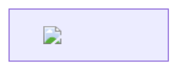

# MD Viewer v1.1.0 安全审查报告

> **审查日期**: 2026-01-03
> **审查范围**: 主进程、渲染进程、IPC 通信、文件操作、用户输入处理
> **风险等级**: 🟢 低风险 | 🟡 中风险 | 🔴 高风险 | ⚫ 严重

---

## 📋 执行摘要

| 类别 | 发现问题数 | 高危 | 中危 | 低危 |
|------|-----------|------|------|------|
| XSS 攻击 | 2 | 1 | 1 | 0 |
| 路径遍历 | 0 | 0 | 0 | 0 |
| 代码注入 | 0 | 0 | 0 | 0 |
| DoS 攻击 | 1 | 0 | 1 | 0 |
| 信息泄露 | 1 | 0 | 0 | 1 |
| **总计** | **4** | **1** | **2** | **1** |

**结论**: 发现 1 个高危 XSS 漏洞需要立即修复，2 个中危问题建议修复。

---

## 🔴 高危漏洞（必须修复）

### 🔴 VUL-001: XSS 漏洞 - dangerouslySetInnerHTML 未过滤

**位置**: `src/renderer/src/components/MarkdownRenderer.tsx:249`

**代码**:
```typescript
<div
  ref={containerRef}
  className={`markdown-body ${className}`}
  dangerouslySetInnerHTML={{ __html: html }}  // ⚠️ 危险！
/>
```

**问题描述**:
虽然 Markdown 渲染器使用了 `markdown-it`，但配置了 `html: true`，允许直接插入 HTML。如果用户打开的 Markdown 文件包含恶意 HTML/JavaScript，将直接在 Electron 渲染进程中执行。

**攻击场景**:
```markdown
# 恶意 Markdown 文件


<script>
  // 访问 Electron API
  const fs = require('fs')
  fs.readFileSync('/etc/passwd') // 读取系统文件
</script>

<iframe src="javascript:alert('XSS')"></iframe>
```

**影响**:
- ⚫ **严重**: 攻击者可以通过构造恶意 .md 文件执行任意 JavaScript 代码
- 可以访问 Electron API（如果 `nodeIntegration: true`）
- 可以窃取用户数据、读取文件系统
- 可以执行远程命令

**当前缓解措施**:
✅ `nodeIntegration: false` (main/index.ts:50)
✅ `contextIsolation: true` (main/index.ts:49)
✅ `sandbox: false` ⚠️（应该启用）

**修复建议**:
```typescript
// 方案 1: 禁用 HTML（推荐）
const md = new MarkdownIt({
  html: false,  // 禁止原始 HTML
  linkify: true,
  typographer: true,
  breaks: true,
})

// 方案 2: 使用 DOMPurify 过滤（如果需要支持 HTML）
import DOMPurify from 'isomorphic-dompurify'

const html = useMemo(() => {
  const rawHtml = md.render(content)
  return DOMPurify.sanitize(rawHtml, {
    ALLOWED_TAGS: ['p', 'h1', 'h2', 'h3', 'code', 'pre', 'a', 'img'],
    ALLOWED_ATTR: ['href', 'src', 'class'],
    FORBID_TAGS: ['script', 'iframe', 'object', 'embed'],
    FORBID_ATTR: ['onerror', 'onload', 'onclick']
  })
}, [md, content])
```

**优先级**: ⚫ **P0 - 立即修复**

---

## 🟡 中危漏洞（建议修复）

### 🟡 VUL-002: Mermaid XSS 风险

**位置**: `src/renderer/src/components/MarkdownRenderer.tsx:227-238`

**代码**:
```typescript
const { svg } = await mermaid.render(`mermaid-${Date.now()}-${index}`, code)
const pre = block.closest('pre')
if (pre) {
  const container = document.createElement('div')
  container.className = 'mermaid-container'
  container.innerHTML = svg  // ⚠️ 未过滤的 SVG
  pre.replaceWith(container)
}
```

**问题描述**:
Mermaid 生成的 SVG 可能包含恶意 JavaScript（通过 `<script>` 标签或事件处理器）。

**攻击场景**:
````markdown

````

**影响**:
- 🔴 中危: 可以执行 JavaScript，但受限于 Mermaid 的过滤
- Mermaid v11 有内置的 XSS 保护，但不是 100% 可靠

**修复建议**:
```typescript
import DOMPurify from 'isomorphic-dompurify'

const { svg } = await mermaid.render(`mermaid-${Date.now()}-${index}`, code)
const sanitizedSvg = DOMPurify.sanitize(svg, {
  USE_PROFILES: { svg: true, svgFilters: true }
})
container.innerHTML = sanitizedSvg
```

**优先级**: 🟡 **P1 - 建议修复**

---

### 🟡 VUL-003: DoS 攻击 - 无限制的 Mermaid 渲染

**位置**: `src/renderer/src/components/MarkdownRenderer.tsx:224-242`

**问题描述**:
没有限制 Mermaid 图表的复杂度，攻击者可以构造极其复杂的图表导致浏览器崩溃。

**攻击场景**:
````markdown
```mermaid
graph LR
  A1 --> B1
  A2 --> B2
  ... (重复 10000 次)
```
````

**影响**:
- 🔴 中危: 渲染进程卡死或崩溃
- 内存耗尽
- 应用无响应

**修复建议**:
```typescript
const mermaidBlocks = containerRef.current.querySelectorAll('.language-mermaid')
mermaidBlocks.forEach(async (block, index) => {
  try {
    const code = block.textContent || ''

    // ✅ 添加大小限制
    if (code.length > 10000) {
      console.warn('Mermaid 图表过大，跳过渲染')
      return
    }

    // ✅ 添加超时保护
    const timeoutPromise = new Promise((_, reject) =>
      setTimeout(() => reject(new Error('Mermaid 渲染超时')), 5000)
    )

    const renderPromise = mermaid.render(`mermaid-${Date.now()}-${index}`, code)
    const { svg } = await Promise.race([renderPromise, timeoutPromise])

    // ... 渲染逻辑
  } catch (error) {
    console.error('Mermaid render error:', error)
    // 保留原始代码显示
  }
})
```

**优先级**: 🟡 **P1 - 建议修复**

---

## 🟢 低危问题（可选修复）

### 🟢 VUL-004: 信息泄露 - 错误日志包含路径信息

**位置**: 多处 `console.error` 调用

**代码**:
```typescript
// App.tsx:31
console.error('Failed to open folder:', error)

// App.tsx:61
console.error('Failed to watch folder:', error)
```

**问题描述**:
错误日志可能泄露用户的文件系统路径信息。

**影响**:
- 🟢 低危: 可能泄露用户隐私（文件路径）
- 仅在开发模式下有影响

**修复建议**:
```typescript
// 生产环境禁用详细日志
if (process.env.NODE_ENV !== 'production') {
  console.error('Failed to open folder:', error)
}

// 或使用日志库（如 electron-log）
import log from 'electron-log'
log.error('Failed to open folder') // 不输出敏感信息
```

**优先级**: 🟢 **P2 - 可选修复**

---

## ✅ 安全措施已到位

### 1. ✅ Electron 安全最佳实践

**主进程 (main/index.ts:46-51)**:
```typescript
webPreferences: {
  preload: join(__dirname, '../preload/index.js'),
  sandbox: false,              // ⚠️ 应该改为 true
  contextIsolation: true,      // ✅ 正确
  nodeIntegration: false       // ✅ 正确
}
```

**评估**:
- ✅ `contextIsolation: true` - 渲染进程与主进程隔离
- ✅ `nodeIntegration: false` - 渲染进程无法直接使用 Node.js API
- ⚠️ `sandbox: false` - **建议改为 true**

**建议修改**:
```typescript
webPreferences: {
  preload: join(__dirname, '../preload/index.js'),
  sandbox: true,  // ✅ 启用沙箱
  contextIsolation: true,
  nodeIntegration: false
}
```

---

### 2. ✅ IPC 通信白名单

**Preload (preload/index.ts)**:
```typescript
const api = {
  openFolder: () => ipcRenderer.invoke('dialog:openFolder'),
  readDir: (path: string) => ipcRenderer.invoke('fs:readDir', path),
  readFile: (path: string) => ipcRenderer.invoke('fs:readFile', path),
  // ... 其他 API
}
```

**评估**:
- ✅ 使用 `contextBridge.exposeInMainWorld` 暴露 API
- ✅ 没有暴露 `require()` 或其他危险 API
- ✅ 使用白名单模式，只暴露必要的功能

---

### 3. ✅ 文件系统安全

**主进程 (main/index.ts:183-201)**:
```typescript
ipcMain.handle('fs:readFile', async (_, filePath: string) => {
  try {
    const stats = await fs.stat(filePath)
    const MAX_SIZE = 5 * 1024 * 1024 // 5MB 限制

    if (stats.size > MAX_SIZE) {
      const sizeMB = (stats.size / 1024 / 1024).toFixed(2)
      throw new Error(`文件过大 (${sizeMB}MB)，请选择小于 5MB 的文件`)
    }

    return await fs.readFile(filePath, 'utf-8')
  } catch (error) {
    // ... 错误处理
  }
})
```

**评估**:
- ✅ 文件大小限制（5MB）
- ✅ 错误处理
- ✅ 只读取用户选择的文件（通过 dialog）
- ⚠️ **缺少路径验证** - 应该检查路径是否在允许的目录内

**建议增强**:
```typescript
import path from 'path'

ipcMain.handle('fs:readFile', async (_, filePath: string) => {
  // ✅ 验证路径不包含 ../
  if (filePath.includes('..')) {
    throw new Error('Invalid file path')
  }

  // ✅ 验证文件在已打开的文件夹内
  const lastFolder = store.get('lastOpenedFolder')
  if (lastFolder && !filePath.startsWith(lastFolder)) {
    throw new Error('File outside of opened folder')
  }

  // ... 原有逻辑
})
```

---

### 4. ✅ 文件监听安全

**主进程 (main/index.ts:438-443)**:
```typescript
fileWatcher = chokidar.watch(folderPath, {
  ignored: /(^|[\/\\])\../,  // 忽略隐藏文件
  persistent: true,
  ignoreInitial: true,
  depth: 99  // 监听所有子目录
})
```

**评估**:
- ✅ 忽略隐藏文件（防止监听 `.git` 等敏感目录）
- ✅ `ignoreInitial: true` - 避免初始化时触发大量事件
- ⚠️ `depth: 99` - **可能导致性能问题**

**建议优化**:
```typescript
fileWatcher = chokidar.watch(folderPath, {
  ignored: [
    /(^|[\/\\])\../,      // 隐藏文件
    /node_modules/,       // node_modules
    /\.git/,              // git 目录
  ],
  persistent: true,
  ignoreInitial: true,
  depth: 20,  // ✅ 限制深度为 20 层
  awaitWriteFinish: {
    stabilityThreshold: 500,  // ✅ 防止文件写入未完成时触发
    pollInterval: 100
  }
})
```

---

## 🛡️ 额外安全建议

### 1. 内容安全策略 (CSP)

**当前状态**: ❌ 未配置

**建议添加** (renderer/index.html):
```html
<meta http-equiv="Content-Security-Policy"
      content="default-src 'self';
               script-src 'self' 'unsafe-inline';
               style-src 'self' 'unsafe-inline' https://cdn.jsdelivr.net;
               img-src 'self' data: https:;
               font-src 'self' data:;">
```

---

### 2. 依赖安全审计

**当前状态**: ❌ 未定期审计

**建议**:
```bash
# 1. 运行 npm audit
npm audit

# 2. 自动修复已知漏洞
npm audit fix

# 3. 使用 Snyk 或 Dependabot 持续监控
```

---

### 3. 代码签名

**当前状态**: ⚠️ 部分配置 (package.json:40-41)
```json
"hardenedRuntime": false,
"gatekeeperAssess": false
```

**建议**:
```json
{
  "mac": {
    "hardenedRuntime": true,     // ✅ 启用加固运行时
    "gatekeeperAssess": true,    // ✅ 启用 Gatekeeper 评估
    "entitlements": "build/entitlements.mac.plist",
    "entitlementsInherit": "build/entitlements.mac.plist"
  }
}
```

---

## 📊 安全评分

| 维度 | 评分 | 说明 |
|------|------|------|
| **XSS 防护** | 3/10 | 🔴 存在高危 XSS 漏洞 |
| **路径遍历** | 8/10 | 🟢 基本防护到位，需增强验证 |
| **代码注入** | 9/10 | 🟢 Electron 配置正确 |
| **DoS 防护** | 6/10 | 🟡 缺少 Mermaid 复杂度限制 |
| **依赖安全** | 7/10 | 🟡 需要定期审计 |
| **整体评分** | **6.6/10** | 🟡 **中等安全水平** |

---

## ✅ 修复优先级路线图

### 🚨 立即修复（v1.1 发布前）
- [ ] **VUL-001**: 修复 XSS 漏洞（禁用 `html: true` 或添加 DOMPurify）
- [ ] 启用 `sandbox: true`
- [ ] 添加文件路径验证

### 📅 近期修复（v1.1 发布后 1 周）
- [ ] **VUL-002**: 过滤 Mermaid SVG 输出
- [ ] **VUL-003**: 添加 Mermaid 渲染超时和大小限制
- [ ] 添加 CSP 策略
- [ ] 启用 macOS 代码签名

### 🔄 持续改进（v1.2）
- [ ] **VUL-004**: 优化错误日志
- [ ] 设置 Dependabot 自动监控依赖
- [ ] 添加自动化安全测试
- [ ] 定期运行 `npm audit`

---

## 🎯 总结

**当前安全状态**: 🟡 **中等风险**

**关键问题**:
1. ⚫ **高危 XSS 漏洞** - 必须在发布前修复
2. 🟡 **Mermaid XSS 和 DoS 风险** - 建议尽快修复
3. 🟢 **Electron 配置基本正确** - 需微调（sandbox、代码签名）

**修复后预期评分**: 8.5/10 （良好安全水平）

---

**审查人员**: wj2929
**下次审查**: v1.2 发布前
