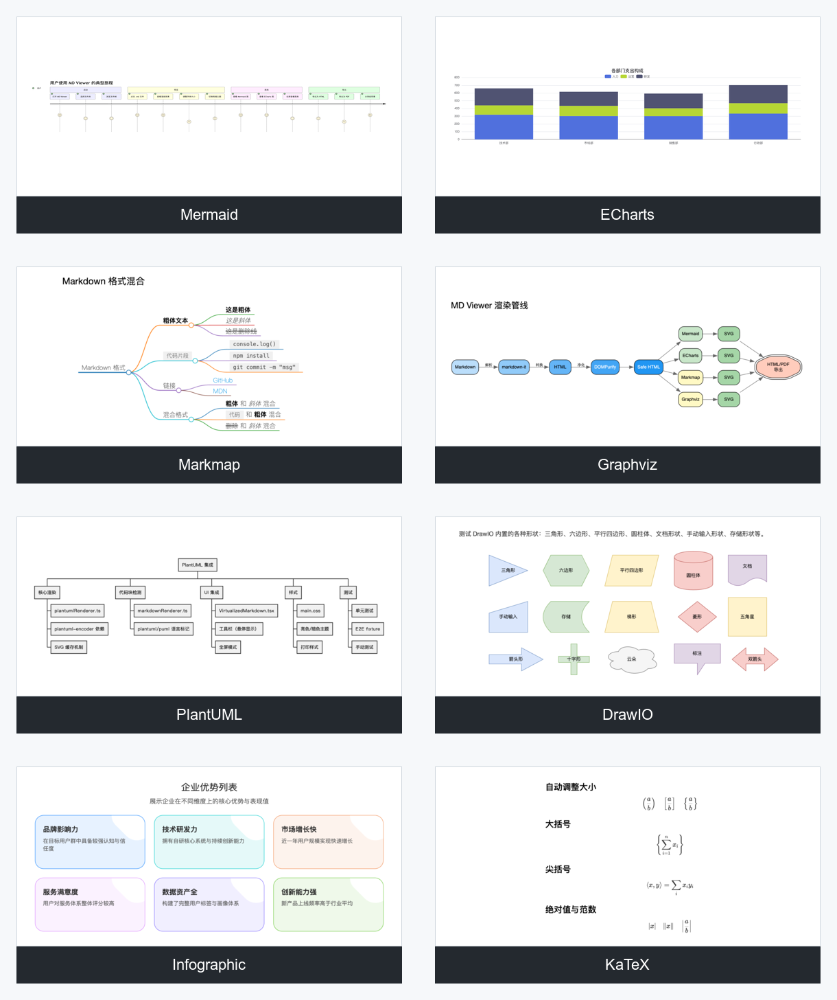

# 图表样例库

本文档用于快速了解 MD Viewer 支持的图表类型、适用场景和测试样例位置。完整语法请以各图表引擎官方文档为准，本文侧重 MD Viewer 中的使用方式。

## 如何选择图表

| 目标 | 推荐类型 | 说明 |
| --- | --- | --- |
| 流程图、时序图、状态图 | Mermaid | 写法轻量，适合大多数技术文档 |
| 统计图、仪表盘、3D 图表 | ECharts / Plotly / Vega-Lite | 适合数据分析、报表和 PPT 风格图表 |
| 架构图、依赖图、关系图 | Graphviz / D2 / C4-PlantUML / Structurizr | 适合系统架构、服务依赖和 C4 建模 |
| 思维导图 | Markmap | 直接把 Markdown 列表渲染为导图 |
| UML 与建模 | PlantUML / C4-PlantUML / Structurizr | PlantUML 和 Kroki 可能依赖服务或网络配置 |
| 业务流程 | BPMN | 适合标准 BPMN XML 或 `.bpmn` 文件 |
| 数据库 ERD | DBML | 适合数据库表结构说明 |
| 知识图谱、拓扑图 | AntV G6 | 适合复杂节点关系、网络拓扑 |
| 数字时序 | WaveDrom | 适合硬件、协议、时钟信号说明 |
| 长尾格式 | Kroki | 统一接入 `nomnoml`、`pikchr`、`svgbob`、`bytefield`、`tikz` 等格式 |
| 手绘风画板 | Excalidraw | 适合预览已有 `.excalidraw` 内容，不提供内置编辑器 |
| diagrams.net 图表 | DrawIO | 适合复用 diagrams.net / draw.io 产物 |
| 数学公式 | KaTeX | 适合行内公式和块级公式 |
| 信息图 | Infographic | 适合轻量展示卡片、列表、指标说明 |

## 样例文件

仓库的 `e2e/fixtures/` 中放有可直接打开的测试文档，适合验证预览、全屏、导出 HTML/PDF/DOCX 和批量下载图表。

| 类型 | 样例文件 |
| --- | --- |
| 全量混合图表 | [`e2e/fixtures/test-all-charts.md`](../e2e/fixtures/test-all-charts.md) |
| Mermaid | [`e2e/fixtures/test-mermaid.md`](../e2e/fixtures/test-mermaid.md) |
| ECharts | [`e2e/fixtures/test-echarts.md`](../e2e/fixtures/test-echarts.md) |
| Markmap | [`e2e/fixtures/test-markmap.md`](../e2e/fixtures/test-markmap.md) |
| Graphviz | [`e2e/fixtures/test-graphviz.md`](../e2e/fixtures/test-graphviz.md) |
| PlantUML | [`e2e/fixtures/test-plantuml.md`](../e2e/fixtures/test-plantuml.md) |
| DrawIO | [`e2e/fixtures/test-drawio.md`](../e2e/fixtures/test-drawio.md) |
| Infographic | [`e2e/fixtures/test-infographic.md`](../e2e/fixtures/test-infographic.md) |
| KaTeX | [`e2e/fixtures/test-katex.md`](../e2e/fixtures/test-katex.md) |
| Excalidraw | [`e2e/fixtures/test-excalidraw.md`](../e2e/fixtures/test-excalidraw.md) |
| Vega-Lite | [`e2e/fixtures/test-vega-lite.md`](../e2e/fixtures/test-vega-lite.md) |
| D2 | [`e2e/fixtures/test-d2.md`](../e2e/fixtures/test-d2.md) |
| BPMN | [`e2e/fixtures/test-bpmn.md`](../e2e/fixtures/test-bpmn.md) |
| WaveDrom | [`e2e/fixtures/test-wavedrom.md`](../e2e/fixtures/test-wavedrom.md) |
| C4-PlantUML | [`e2e/fixtures/test-c4plantuml.md`](../e2e/fixtures/test-c4plantuml.md) |
| Structurizr | [`e2e/fixtures/test-structurizr.md`](../e2e/fixtures/test-structurizr.md) |
| Plotly | [`e2e/fixtures/test-plotly.md`](../e2e/fixtures/test-plotly.md) |
| DBML | [`e2e/fixtures/test-dbml.md`](../e2e/fixtures/test-dbml.md) |
| AntV G6 | [`e2e/fixtures/test-antv-g6.md`](../e2e/fixtures/test-antv-g6.md) |
| Kroki | [`e2e/fixtures/test-kroki.md`](../e2e/fixtures/test-kroki.md) |

## 导出与排查

- 预览正常但导出异常时，优先查看导出任务详情中的 warning。
- 复杂图表导出 DOCX 时建议启动 `md-viewer-docx-service`，并确认服务版本与客户端版本匹配。
- PlantUML、Kroki、TikZ 等依赖外部渲染能力的格式，在离线或网络受限环境下可能失败。
- 如果图表过大、过小或截断，先在预览区使用全屏和适应大小确认原始渲染，再分别测试 HTML/PDF/DOCX 导出。
- 用于发布前回归时，优先打开 `test-all-charts.md`，再按问题类型补测单独 fixture。
