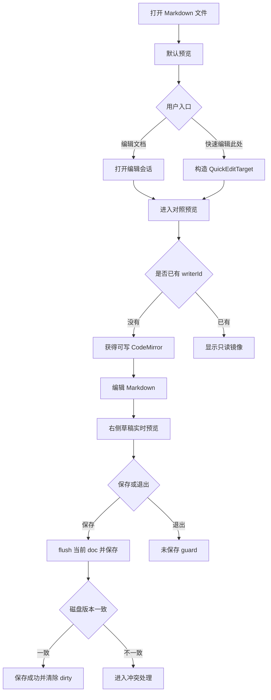
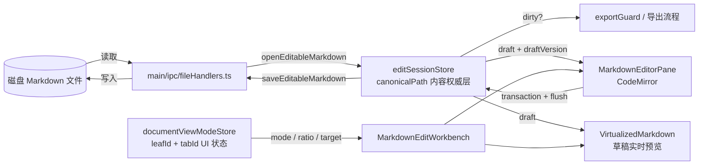
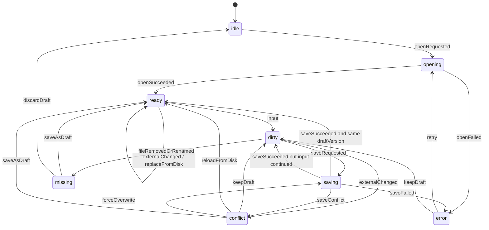
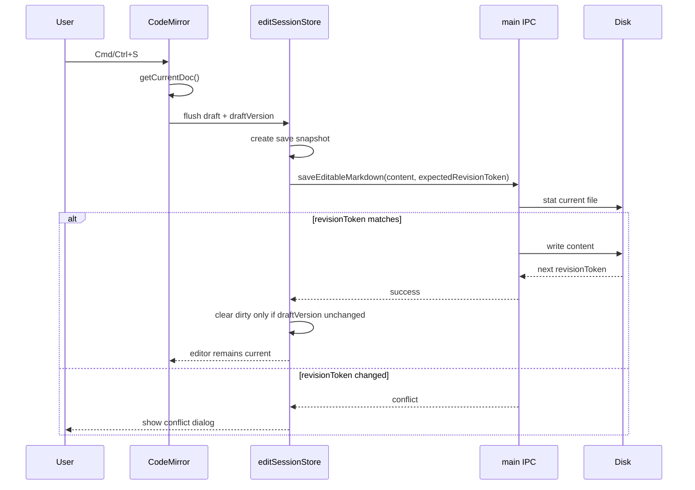

# Markdown 编辑模式设计方案

## 背景

MD Viewer 当前定位是 Markdown 预览、图表渲染和导出工具。已有“快速编辑”能力可以从预览区右键打开抽屉，并通过 `textarea` 修改源码、保存文件、草稿预览和处理保存冲突。但当用户需要连续修改多处内容时，抽屉式 `textarea` 与 Zettlr 这类成熟 Markdown 编辑器相比，主要差距在编辑体验、定位反馈、快捷操作、滚动上下文和实时预览协同。

本方案参考 Zettlr 的设计思路，但不复制 Zettlr 代码。Zettlr 使用 GPL-3.0，MD Viewer 使用 MIT，因此只能借鉴“编辑器封装、文档权威层、面板状态、扩展集合”的架构原则，并在本项目内重新实现。

## 评审修订摘要

本版根据架构、UX、Claude CLI、Codex CLI 与 MCP 思考模式评审做以下修订：

- Phase 1 从“完整三态编辑器”收敛为“单写编辑会话 + 对照预览 + 保存/关闭安全闭环”。
- 同一 `canonicalPath` 首版只允许一个可写 CodeMirror 实例，其他面板显示只读镜像或草稿预览，避免多编辑器互相覆盖。
- 保存动作必须从 CodeMirror 当前 doc 读取，或先 flush 防抖中的 draft，再携带 `draftVersion` 保存。
- 未保存关闭保护、导出保护、保存竞态处理前移到 Phase 1。
- `DocumentViewMode` 状态不只按 `leafId` 记录，需绑定 `leafId + tabId`，避免切换 tab 继承错误模式。
- 增加 Store 到 CodeMirror 的反向同步契约，用命令式 `editor.dispatch` 处理重新载入、外部变更和保存后的状态同步。
- UX 文案从实现名改为用户语言：`编辑文档`、`仅编辑`、`对照预览`、`草稿预览，未保存到磁盘`。
- 实时预览补充渲染状态、重型图表预算和过期任务丢弃要求。

## 目标

- 保持默认打开仍是预览模式，避免改变 MD Viewer 的核心产品定位。
- 提供清晰的“编辑文档”入口，让用户可从预览进入可持续编辑工作区。
- 编辑入口默认进入对照预览，左侧编辑 Markdown，右侧实时预览草稿。
- 用 CodeMirror 6 替换长期方向上的 `textarea`，提供更稳定的 Markdown 编辑体验。
- 复用现有打开、保存、草稿、冲突检测和导出保护能力，控制改造范围。

## 非目标

- 不把 MD Viewer 改造成完整写作 IDE。
- 不实现 Zettlr 的项目管理、引用管理、文献工作流和插件体系。
- 不复制 Zettlr 的 GPL-3.0 代码、主题或扩展实现。
- 不在第一阶段实现多人协作、多编辑器协同写入、Git 管理、所见即所得编辑或完整 Markdown 语言服务。

## Zettlr 参考结论

Zettlr 的核心价值不是某一个按钮，而是“编辑器实例 + 文档权威层 + 面板状态 + 扩展集合”的组合：

- `source/common/modules/markdown-editor/index.ts`：把 CodeMirror 封装为稳定的 Markdown 编辑器模块。
- `source/common/modules/markdown-editor/editor-extension-sets.ts`：集中管理 Markdown 语法、高亮、快捷键和交互扩展。
- `source/common/modules/markdown-editor/plugins/remote-doc.ts`：用协作式文档模型同步编辑器变更与文档状态。
- `source/app/service-providers/documents/index.ts`：主进程维护文档权威状态、版本、保存和外部变更。
- `source/win-main/MainEditor.vue` 与 `EditorPane.vue`：每个编辑面板拥有独立视图状态，但文档内容由共享文档层管理。
- `source/common/modules/markdown-editor/tooltips/formatting-toolbar.ts`：通过浮动工具条降低 Markdown 语法记忆成本。

MD Viewer 只吸收原则：编辑器组件独立封装，编辑状态按规范路径共享，视图状态按面板隔离，保存仍由主进程做安全校验。

## 核心产品决策

文档视图保留三态模型：

```ts
type DocumentViewMode = 'preview' | 'edit' | 'compare'
```

UI 文案使用用户语言：

- `preview`：显示为 `预览`，默认模式，只展示现有 Markdown 预览。
- `edit`：显示为 `仅编辑`，主体为 CodeMirror。Phase 1 可实现为对照预览的“预览折叠状态”，不必单独做完整布局。
- `compare`：显示为 `对照预览`，左侧 CodeMirror，右侧复用现有 MD Viewer 实时预览。

推荐默认策略：

- 打开 Markdown 文件时始终进入 `preview`。
- 顶部主按钮显示为 `编辑文档`，点击后默认进入 `compare`，避免“点击编辑却选中对照”的心智冲突。
- 进入编辑工作区后再显示分段控件：`预览 / 仅编辑 / 对照预览`。
- 用户退出编辑回到 `预览` 时，未保存草稿继续保留，并显示 `草稿预览，未保存到磁盘`。

## 用户交互设计

### 主流程

```text
打开 Markdown 文件
  -> 默认预览
  -> 点击“编辑文档”
  -> 打开编辑会话
  -> 进入“对照预览”
  -> 输入内容，右侧显示草稿实时预览
  -> 保存或退出时处理未保存草稿
```

状态反馈要求：

- 打开编辑会话中：编辑区显示加载态，工具栏保存按钮禁用。
- 打开失败：显示具体原因，例如文件不存在、权限不足、文件过大、非 Markdown、只读不可写。
- 未保存：标签和预览区都显示未保存标记，文案为 `草稿预览，未保存到磁盘`。
- 保存中：保存按钮显示进行中并禁止重复保存。
- 保存成功：短暂显示 `已保存到磁盘`。
- 保存失败：保留草稿，提供重试、复制草稿、另存草稿。
- 外部变更：无脏草稿时自动刷新并轻提示；有脏草稿时进入冲突状态。

### “快速编辑此处”

现有右键菜单不删除，但长期行为从“打开 `textarea` 抽屉”升级为“进入对照预览并定位源码”。

相关文件：

- `src/renderer/src/components/VirtualizedMarkdown.tsx`：收集选区、`data-source-line` 和滚动比例。
- `src/main/ipc/menuHandlers.ts`：构造 `QuickEditTarget` 并展示“快速编辑此处”。
- `src/renderer/src/components/QuickEditDrawer.tsx`：当前 `textarea` 编辑界面，过渡期保留。
- `src/renderer/src/stores/editSessionStore.ts`：草稿、脏状态和保存状态。
- `src/renderer/src/stores/quickEditPlacementStore.ts`：当前面板级打开位置，后续需要与视图模式状态合并或明确迁移。
- `src/main/ipc/fileHandlers.ts`：`openEditableMarkdown` 与 `saveEditableMarkdown`。

定位策略按优先级降级：

1. 使用 `QuickEditTarget.sourceLine` 定位到 CodeMirror 对应行。
2. 有选中文本时，在 `sourceLine` 附近窗口内搜索，不做全文首个匹配。
3. 没有可信 `sourceLine` 时，结合滚动比例估算附近行，再做模糊匹配。
4. 仍失败时保持编辑器当前位置或跳到文件顶部，并提示 `未能精确定位，已打开编辑器`。

定位成功后左侧 CodeMirror 聚焦，目标行高亮 1 到 2 秒；右侧预览保留原上下文，或滚动到对应块附近。用户应能看到 `已定位到源码附近` 的轻提示。

## 对照模式布局

对照预览是主推荐体验：

```text
┌──────────────────────────────────────────────────────────────┐
│ 工具栏：预览 | 仅编辑 | 对照预览       保存  撤销  重做  更多 │
├──────────────────────────────┬───────────────────────────────┤
│ CodeMirror Markdown 编辑器    │ 草稿实时预览                   │
│ - Markdown 高亮               │ - 复用 VirtualizedMarkdown      │
│ - 保存/撤销/重做/查找          │ - 复用图表渲染与导出样式         │
│ - 目标行定位                  │ - 显示渲染状态与未保存状态       │
└──────────────────────────────┴───────────────────────────────┘
```

布局规则：

- 编辑器与预览之间使用可拖拽分隔条，默认比例 `50:50`。
- 对照分隔条是 leaf 内部布局，必须与外层 `splitTree` 分隔条隔离事件。
- 单 leaf 宽度 `< 900px` 时对照改为上下布局。
- 单 leaf 宽度 `< 680px` 时默认进入 `仅编辑`，预览作为可切换 pane。
- 任一 pane 不得小于最小可用宽度，避免编辑器或预览被拖到不可操作。
- 用户手动调整的对照比例按 `leafId + tabId` 持久化。

## 实现效果展示

本节用于说明目标界面和核心流程。ASCII 线框图是布局规格，不代表最终视觉样式；最终实现应沿用 MD Viewer 现有主题、按钮、面板和分屏风格。

### 默认预览模式

默认仍是预览优先。用户打开 Markdown 文件后不进入编辑器，顶部只提供明确的 `编辑文档` 入口。

```text
+--------------------------------------------------------------------------------+
| MD Viewer                                      [编辑文档] [导出] [设置] [更多] |
+----------------------+---------------------------------------------------------+
| 文件树               | 标签栏: report.md                                      |
|                      +---------------------------------------------------------+
| docs/                |                                                         |
|   report.md          |  # 报告标题                                             |
|   summary.md         |                                                         |
|                      |  正文预览内容                                           |
|                      |                                                         |
|                      |  [Mermaid 图表]  [ECharts 图表]  [代码块]               |
|                      |                                                         |
|                      |  状态: 磁盘内容预览                                     |
+----------------------+---------------------------------------------------------+
```

设计要点：

- `编辑文档` 是主入口，点击后进入 `对照预览`。
- 预览模式不显示 CodeMirror，不影响当前阅读、图表渲染和导出体验。
- 有未保存草稿时，预览区状态改为 `草稿预览，未保存到磁盘`。

### 对照预览模式

对照预览是进入编辑后的默认布局。左侧是 CodeMirror，右侧复用现有 Markdown 预览链路。

```text
+--------------------------------------------------------------------------------+
| report.md     [预览] [仅编辑] [对照预览*]       [保存] [撤销] [重做] [更多]     |
+--------------------------------------+-----------------------------------------+
| CodeMirror Markdown 编辑器            | 草稿实时预览                            |
|                                      | 状态: 草稿预览，未保存到磁盘            |
|  001  # 报告标题                     |                                         |
|  002                                |  # 报告标题                             |
|  003  这里是正在编辑的段落。          |                                         |
|  004                                |  这里是正在编辑的段落。                 |
|  005  ```mermaid                    |                                         |
|  006  graph TD                      |  [图表渲染中...]                        |
|  007  A --> B                       |                                         |
|  008  ```                           |                                         |
|                                      |                                         |
| 底部状态: 第 3 行 | 已修改 | 正在更新预览... | 最近保存: 22:10             |
+--------------------------------------+-----------------------------------------+
```

设计要点：

- `对照预览*` 中的星号表示该文件有未保存草稿。
- 保存按钮必须读取当前 CodeMirror doc，不依赖可能滞后的防抖 store。
- 预览 pane 可以显示 `正在更新...`、`图表渲染中...`、`预览可能滞后` 等状态。
- 左右分隔条属于 leaf 内部布局，不影响外层 `splitTree` 分屏。

### 快速编辑此处

右键预览内容选择“快速编辑此处”后，系统进入对照预览并定位到源码附近。

```text
+--------------------------------------------------------------------------------+
| report.md     [预览] [仅编辑] [对照预览*]       [保存] [撤销] [重做] [更多]     |
+--------------------------------------+-----------------------------------------+
| CodeMirror Markdown 编辑器            | 草稿实时预览                            |
|                                      |                                         |
|  018  ## 结论                         |  ## 结论                                |
|  019                                |                                         |
|> 020  需要修订的这一段内容。          |  需要修订的这一段内容。                 |
|  021                                |                                         |
|  022  下一段内容。                    |  下一段内容。                           |
|                                      |                                         |
| Toast: 已定位到源码附近               |  预览保持原上下文                       |
+--------------------------------------+-----------------------------------------+
```

定位失败时的降级反馈：

```text
+--------------------------------------------------------------------------------+
| Toast: 未能精确定位，已打开编辑器                                               |
+--------------------------------------+-----------------------------------------+
| CodeMirror Markdown 编辑器            | 草稿实时预览                            |
|  001  # 报告标题                     |  保持当前预览位置                       |
+--------------------------------------+-----------------------------------------+
```

### 窄屏与仅编辑模式

当 leaf 宽度不足时，不强行左右对照，避免编辑器和预览都不可用。

```text
+--------------------------------------------------------------+
| report.md        [预览] [仅编辑*] [对照预览]        [保存]    |
+--------------------------------------------------------------+
| CodeMirror Markdown 编辑器                                    |
|                                                              |
|  001  # 报告标题                                             |
|  002                                                        |
|  003  正文内容...                                            |
|                                                              |
| 状态: 草稿预览，未保存到磁盘 | 预览可从顶部模式切换查看       |
+--------------------------------------------------------------+
```

宽度规则：

- `< 900px`：对照预览改为上下布局。
- `< 680px`：默认进入 `仅编辑`，预览通过模式切换查看。
- 用户手动调整比例时，仍保证任一 pane 不小于最小可用宽度。

### 同一文件只读镜像

Phase 1 只允许一个可写编辑器。其他面板打开同一文件时显示只读镜像，避免多个 CodeMirror 实例同时写入同一 draft。

```text
+--------------------------------------+-----------------------------------------+
| leaf-a: report.md                     | leaf-b: report.md                        |
| [对照预览*] [保存]                    | [预览] [只读镜像]                        |
+--------------------------------------+-----------------------------------------+
| 可写 CodeMirror                       | 草稿预览                                |
| writerId = leaf-a:tab-1               | 状态: 此文件已在另一个面板编辑           |
|                                      | [切换到编辑面板]                         |
|  010  正在编辑的内容                  |                                         |
+--------------------------------------+-----------------------------------------+
```

### 保存冲突弹窗

冲突弹窗优先引导用户保留草稿或查看差异，危险操作不作为默认操作。

```text
+--------------------------------------------------------------+
| 保存冲突                                                     |
+--------------------------------------------------------------+
| 磁盘文件已被外部修改，当前草稿尚未保存。                     |
|                                                              |
| 当前草稿: 来自 MD Viewer 编辑器                              |
| 磁盘版本: 已被外部程序修改                                   |
|                                                              |
| 推荐操作:                                                    |
| [查看差异] [保留草稿继续编辑] [另存草稿]                     |
|                                                              |
| 危险操作:                                                    |
| [覆盖磁盘版本]                                               |
+--------------------------------------------------------------+
```

### 鱼骨图：编辑体验优化目标

```text
                                  编辑体验接近 Zettlr,
                                  但保持 MD Viewer 预览优先
                                                ^
                                                |
编辑器能力 -------------------------------------+
  - CodeMirror 6
  - Markdown 高亮
  - 保存/撤销/查找
  - 行定位

状态安全 ---------------------------------------+
  - 单写 writerId
  - draftVersion
  - 保存前 flush
  - 关闭 guard

实时预览 ---------------------------------------+
  - 短防抖
  - 重型图表长防抖
  - previewVersion
  - 过期渲染丢弃

分屏多标签 -------------------------------------+
  - leafId + tabId
  - canonicalPath 共享草稿
  - 只读镜像
  - 未保存标记同步

UX 反馈 ----------------------------------------+
  - 草稿预览状态
  - 定位成功/失败 toast
  - 冲突推荐操作
  - 窄屏降级

安全边界 ---------------------------------------+
  - main IPC 保存
  - revisionToken
  - content hash fallback
  - 不复制 GPL 代码
```

### Mermaid：用户路径



### Mermaid：架构数据流



### Mermaid：编辑会话状态机



### Mermaid：保存时序



## 架构设计

### 模块边界

新增或调整的前端模块建议如下：

- `src/renderer/src/components/editor/MarkdownEditorPane.tsx`：CodeMirror 编辑器封装，负责编辑器创建、扩展配置、内容变更、保存前取值和定位 API。
- `src/renderer/src/components/editor/MarkdownEditWorkbench.tsx`：组合编辑器、实时预览、工具栏和分隔布局。
- `src/renderer/src/components/editor/DocumentModeSwitch.tsx`：三态模式切换控件。
- `src/renderer/src/stores/documentViewModeStore.ts`：只保存 UI 状态，key 至少包含 `leafId + tabId`，记录 `DocumentViewMode`、对照比例、最近定位目标和只读镜像状态。
- `src/renderer/src/stores/editSessionStore.ts`：内容权威层，继续按 `canonicalPath` 管理 `draft`、`original`、`revisionToken`、`dirty`、`draftVersion`、`writerId` 和保存状态。
- `src/renderer/src/hooks/useMarkdownEditSession.ts`：封装打开编辑会话、保存、冲突处理、外部变更和关闭保护。

`documentViewModeStore` 不保存 `draft`；`editSessionStore` 不保存布局比例。避免两个 store 对内容或 placement 双写。

### 数据流

```text
磁盘文件
  │
  ▼
main/ipc/fileHandlers.ts
  │ openEditableMarkdown / saveEditableMarkdown
  ▼
editSessionStore(canonicalPath)
  │ draft / draftVersion / revisionToken / dirty
  ├──────────────► MarkdownEditorPane(CodeMirror)
  │                ▲
  │                └─ Store 变更通过 editor.dispatch 命令式同步
  │
  └──────────────► VirtualizedMarkdown(草稿实时预览)
```

设计边界：

- CodeMirror 只存在于 renderer，不能绕过主进程直接读写磁盘。
- 保存统一经过 `saveEditableMarkdown`，并传入 `expectedRevisionToken`。
- 保存动作必须从当前可写 CodeMirror doc 读取，或先 flush pending draft。
- 导出仍经过已有 `exportGuard`，存在未保存草稿时要求用户先保存或取消。
- 草稿内容是预览输入源，但不是磁盘权威内容。

### 同一文件多面板策略

Phase 1 采用单写策略：

- 同一 `canonicalPath` 只允许一个可写 CodeMirror 实例。
- 首个进入编辑的 workbench 获得 `writerId`。
- 其他 leaf 打开同一文件时，可以进入预览或只读对照镜像，但不能直接编辑。
- 只读镜像显示 `此文件已在另一个面板编辑`，可提供“切换到编辑面板”。
- 保存、重新载入、冲突处理只由持有 `writerId` 的实例触发。

后续如果要支持多编辑器同时写入，需要单独设计 CodeMirror transaction 合并、撤销栈隔离和落后提交拒绝。本方案首版不做。

### CodeMirror 同步模型

CodeMirror 使用非受控实例。React 不把全文 `value` 每次重新传入编辑器。

同步规则：

- 编辑器输入：CodeMirror transaction 更新本地 doc，同步递增 `draftVersion`，再防抖写入 `editSessionStore`。
- 保存前：调用 `getCurrentDoc()` 取得当前 doc，立即写入 store，生成保存快照 `{ content, draftVersion, baseRevisionToken }`。
- Store 到编辑器：当 `replaceFromDisk`、外部刷新、保存成功或冲突解决导致 `draft` 被替换时，通过 `editor.dispatch` 更新 doc。
- 落后提交：如果防抖回写携带的 `draftVersion` 低于 store 当前版本，直接丢弃。
- 保存返回：如果当前 `draftVersion` 等于保存快照版本，清除 dirty；如果保存期间继续输入，只更新 `baseRevisionToken`，保留 dirty。
- 中文输入法组合输入期间暂停反向定位和预览驱动的滚动同步，只记录文本变更。

换行符策略：

- 打开文件时记录原始换行风格。
- 内部 draft 统一为 `\n`。
- 保存时按原始换行风格或项目默认策略写回。
- dirty 判断基于规范化后的内容，避免打开后未修改就显示未保存。

## 编辑会话状态机

`editSessionStore` 需要显式表达状态，避免布尔值组合失控：

| 状态 | 说明 | 主要事件 |
| --- | --- | --- |
| `idle` | 尚未打开编辑会话 | `openRequested` |
| `opening` | 正在调用 `openEditableMarkdown` | `openSucceeded` / `openFailed` |
| `ready` | 已打开且未修改 | `input` / `externalChanged` / `close` |
| `dirty` | 有未保存草稿 | `saveRequested` / `externalChanged` / `closeRequested` |
| `saving` | 正在保存快照 | `saveSucceeded` / `saveConflict` / `saveFailed` / `input` |
| `conflict` | 磁盘版本与草稿冲突 | `keepDraft` / `reloadFromDisk` / `saveAsDraft` / `forceOverwrite` |
| `error` | 打开、保存或重载失败 | `retry` / `copyDraft` / `closeRequested` |
| `missing` | 文件被删除或重命名且草稿仍在 | `saveAsDraft` / `discardDraft` |

外部变更处理：

- `dirty=false + externalChanged`：读取磁盘新内容，调用 `replaceFromDisk`，更新 `draft/original/baseRevisionToken`，并用 `editor.dispatch` 替换编辑器内容。
- `dirty=true + externalChanged`：进入 `conflict`，保留草稿，不自动覆盖编辑器内容。
- `missing/renamed + dirty=true`：保留草稿，提示另存或丢弃。
- `missing/renamed + dirty=false`：关闭或更新对应 tab，并提示文件已变更。

## 保存与冲突处理

继续沿用现有安全模型，并补充保存快照契约：

- 打开编辑会话时由主进程返回 `canonicalPath` 和 `revisionToken`。
- 保存前从 CodeMirror 当前 doc 取值，生成保存快照。
- 保存时提交 `canonicalPath`、`content`、`expectedRevisionToken` 和保存快照的 `draftVersion`。
- 主进程比较磁盘当前版本与 `expectedRevisionToken`，不一致时拒绝静默覆盖。
- Phase 2 起在 `revisionToken` 基础上增加 content hash fallback，降低文件系统时间精度导致的误判。
- 保存失败时保留草稿，不清空编辑器内容。

冲突弹窗的信息架构：

```text
磁盘文件已被外部修改，当前草稿尚未保存。

推荐操作：
[查看差异] [保留草稿继续编辑] [另存草稿]

危险操作：
[覆盖磁盘版本]
```

`覆盖磁盘版本` 必须二次确认，并明确会覆盖外部修改。`重新载入磁盘版本` 必须说明会丢弃当前草稿。

## 实时预览策略

实时预览必须复用现有渲染链路，不能另造一套 Markdown renderer。

策略：

- 普通 Markdown 输入使用短防抖，例如 `120ms` 到 `200ms`。
- 包含 Mermaid、ECharts、DrawIO、PlantUML、Graphviz、Markmap、Infographic、Excalidraw 等重型块时使用更长防抖，例如 `400ms` 到 `800ms`。
- 每次预览渲染携带 `previewVersion`，异步图表渲染完成后只提交最新版本，丢弃过期结果。
- 重型图表进入延迟队列，输入频繁时显示上一版预览和 `图表渲染中`，不阻塞编辑输入。
- 如果渲染超过预算，显示 `预览可能滞后`，继续保留可编辑状态。
- 图表局部失败时显示 `部分图表渲染失败`，不弹窗打断输入。
- 输入过程中预览区保持稳定滚动位置，不因整页重新渲染突然跳到顶部。
- 对照模式可提供可选“同步当前面板”，但默认不强制双向同步。

预览状态文案：

- `正在更新...`
- `预览已更新`
- `图表渲染中...`
- `预览可能滞后`
- `部分图表渲染失败`

## 分屏与多标签规则

- `DocumentViewMode` 按 `leafId + tabId` 隔离：同一文件在不同面板可以一个预览、一个对照。
- 草稿按 `canonicalPath` 共享：同一文件无论从哪个 tab 或 leaf 打开，都看到同一份未保存内容。
- Phase 1 只允许一个可写编辑器；其他面板显示只读镜像或草稿预览。
- 未保存标记出现在所有打开同一 `canonicalPath` 的标签上。
- 保存成功后，所有相关面板同步刷新为已保存内容。
- 外部文件变更时，如果存在脏草稿，显示冲突提示；如果没有脏草稿，正常刷新并轻提示。
- 关闭 tab、关闭 leaf、切换文件夹、退出应用、导出前，都必须走同一套未保存 guard，避免重复弹窗。

## 键盘与可访问性

- `Cmd/Ctrl+S` 保存当前可写编辑器。
- 模式切换控件支持 Tab 聚焦与方向键切换。
- 右键“快速编辑此处”必须有键盘等价入口，例如菜单键、`Shift+F10` 或工具栏按钮。
- 对照分隔条支持键盘箭头调整。
- 冲突弹窗初始焦点落在推荐操作，危险操作不作为默认焦点。
- 状态提示使用 `role="status"` 或等价语义，屏幕阅读器可感知保存、冲突和预览更新状态。
- `Esc` 不丢弃草稿，只关闭非破坏性浮层或返回上一级焦点。

## 分阶段实施计划

### Phase 1a：单写编辑会话与对照预览

- 引入 CodeMirror 6 依赖，新增 `MarkdownEditorPane`。
- 新增 `MarkdownEditWorkbench`，实现 `preview -> compare` 主路径。
- `DocumentViewMode` 以 `leafId + tabId` 为 key，默认 `preview`。
- `editSessionStore` 增加 `draftVersion`、`writerId` 和显式状态。
- 同一 `canonicalPath` 只允许一个可写编辑器，其他面板只读镜像。
- 保存前从 CodeMirror 当前 doc 取值，flush pending draft。
- 关闭 tab、关闭 leaf、切换文件夹、退出应用、导出前全部接入未保存 guard。

### Phase 1b：快速编辑此处迁移

- 右键“快速编辑”进入当前 leaf 的 `compare`。
- 右键“快速编辑此处”进入 `compare` 后执行四级定位降级策略。
- 定位成功高亮目标行，失败时给出 toast。
- 保留 `QuickEditDrawer` 作为过渡入口，但不再作为长期方向。

### Phase 1c：保存冲突与外部变更闭环

- 完成编辑会话状态机。
- 实现 `dirty=false + externalChanged` 的自动 `replaceFromDisk` 与 CodeMirror 反向同步。
- 实现 `dirty=true + externalChanged` 的冲突弹窗。
- 保存返回时按 `draftVersion` 判断是否清 dirty。
- 保存失败保留草稿并提供复制草稿。

### Phase 2：布局完善与保存模型增强

- 增加完整 `预览 / 仅编辑 / 对照预览` 模式切换。
- 支持可拖拽对照比例，并按 `leafId + tabId` 持久化。
- 定义窄屏降级与最小 pane 尺寸。
- 将 content hash fallback 纳入 `revisionToken` 策略。
- 梳理 `quickEditPlacementStore` 与 `documentViewModeStore` 的迁移关系，避免状态双写。

### Phase 3：Zettlr 式编辑增强

- 集中管理 Markdown CodeMirror 扩展集合。
- 增加浮动格式工具条和常用 Markdown 命令。
- 增加搜索替换、Markdown 片段和链接辅助。
- 根据既有同步滚动方案加入可选“同步当前面板”。
- 完善主题、字体和可访问性细节。

### Phase 4：草稿恢复与体验完善

- 增加应用异常退出后的草稿恢复能力。
- 增加更清晰的外部变更 diff 提示。
- 梳理导出、预览和编辑三条链路的统一状态提示。
- 评估是否需要支持多 CodeMirror 实例协同写入；没有明确需求前不实现。

## 测试建议

以下测试文件为待创建或待扩展，不代表当前已经存在完整覆盖。

建议覆盖：

- 默认打开 Markdown 文件时处于 `preview`。
- 点击 `编辑文档` 后进入 `对照预览`，并成功加载 `draft`。
- 同一 `canonicalPath` 只允许一个可写编辑器，其他面板只读镜像。
- 输入后立即保存，保存内容必须包含最后一次输入。
- 保存期间继续输入，保存返回不得错误清除新的 dirty 状态。
- `dirty=false + externalChanged` 自动刷新编辑器 doc 和 `baseRevisionToken`。
- `dirty=true + externalChanged` 进入冲突状态并保留草稿。
- “快速编辑此处”能根据 `QuickEditTarget` 定位；定位失败时给出降级提示。
- 关闭 tab、关闭 leaf、切换文件夹、退出应用、导出前都会拦截未保存草稿。
- 中文输入法组合输入期间不会触发错误同步、重复提交或跳光标。
- 重型图表输入时编辑器不被预览渲染阻塞，并显示预览状态。

建议命令：

```bash
npm test -- --run src/renderer/test/stores/editSessionStore.test.ts
npm test -- --run src/renderer/test/components/MarkdownEditWorkbench.test.tsx
npm test -- --run src/renderer/test/components/MarkdownEditorPane.test.tsx
npm test -- --run src/renderer/test/components/SplitPanel.editing.test.tsx
npm test -- --run src/main/__tests__/fileHandlers.editing.test.ts
npm test -- --run src/main/__tests__/previewContextMenu.editing.test.ts
```

## 验收标准

- 默认预览体验不退化，未进入编辑模式时 UI 与当前行为保持一致。
- 用户能从预览模式明确进入 `编辑文档`，默认看到对照预览。
- 对照预览中左侧编辑、右侧实时预览稳定可用，并有明确预览状态反馈。
- 右键“快速编辑此处”不再只是打开抽屉，而是进入可持续编辑的对照工作区。
- 同一文件多面板不会出现多个可写编辑器互相覆盖。
- 保存前不会丢失最后一次输入；保存期间继续输入不会被误标为已保存。
- 外部变更、文件删除、重命名、关闭、导出都不会静默丢草稿。
- 保存、冲突、未保存提示和导出保护全部沿用现有安全边界。
- 不引入 Zettlr GPL-3.0 代码。
- 文档、测试和后续实现都明确 MD Viewer 仍是预览优先产品。
