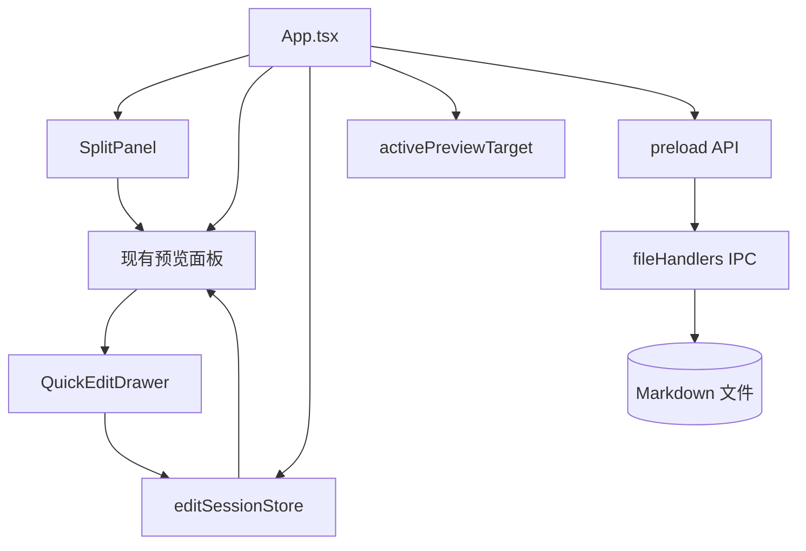
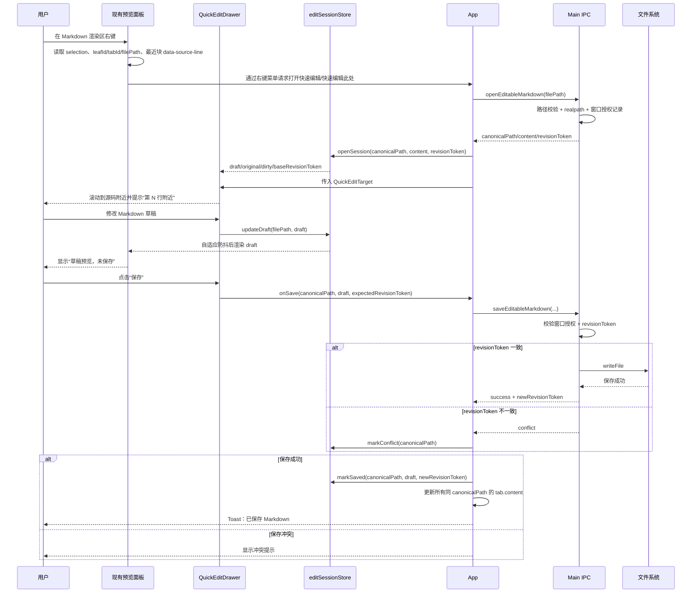
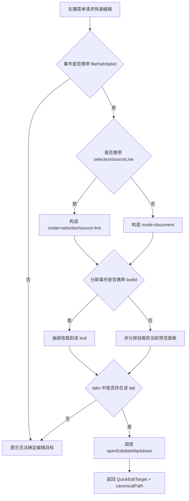
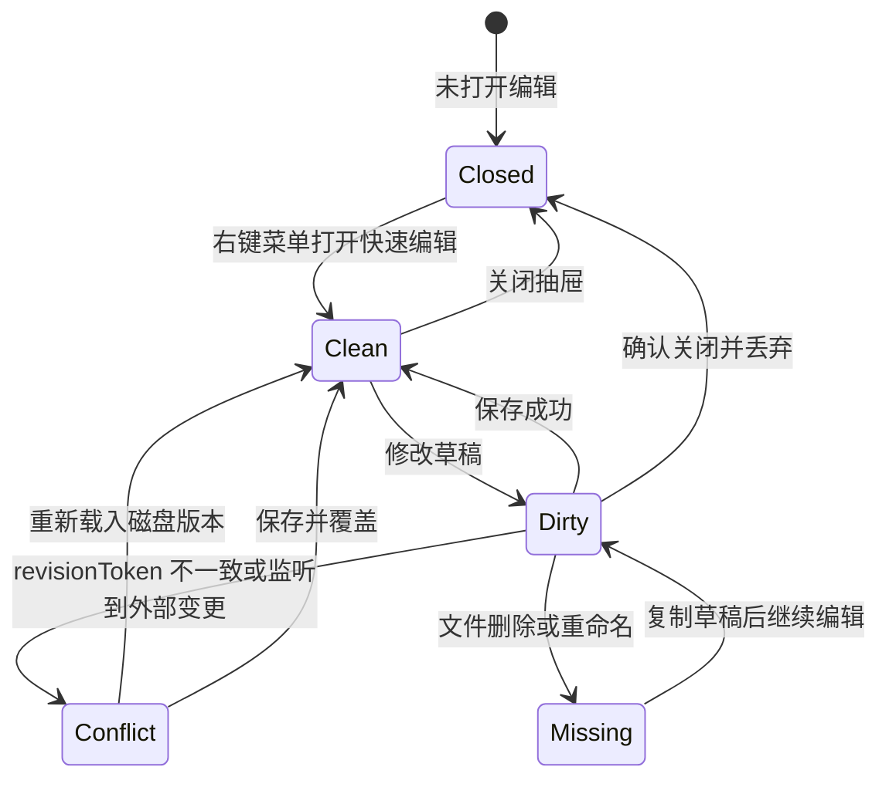

# 轻量 Markdown 编辑功能实施计划

> **给执行代理的要求：** 实施本计划时必须使用 `superpowers:subagent-driven-development`（推荐）或 `superpowers:executing-plans`，并按任务逐项执行。每个步骤使用复选框跟踪。

**目标：** 为 MD Viewer 增加“少量编辑”能力，同时保持产品定位为预览导出工具，而不是完整 Markdown 编辑器。

**架构：** 采用分阶段 A1 + C 方案：MVP 只做预览区右键菜单入口、面板局部快速编辑抽屉、草稿实时预览、快速编辑此处、保存安全校验、脏状态保护和冲突提示；第二阶段再做外部编辑器入口。编辑草稿按主进程返回的 `canonicalPath` 共享，保存冲突使用 `revisionToken` 校验，导出统一经过 `exportGuard`，避免分屏、多标签、软链和路径大小写差异造成状态割裂。

**技术栈：** Electron IPC、React 19、TypeScript 5.9、Zustand、Vitest、Testing Library。

---

## 零、方案阅读说明

本文档是“规范方案 + 实施计划”的混合文档。前半部分定义产品边界、交互规范、界面线框图、状态流和风险分析；后半部分再拆解到文件和任务。

为避免方案阶段过早陷入代码实现，文档中的代码块只用于说明接口形态、状态结构和关键路径，不代表必须逐字照搬。最终实现应以现有代码风格、类型检查和测试结果为准。

## 一、产品边界

MD Viewer 继续聚焦“预览、图表渲染、导出”。本功能只覆盖以下少量编辑场景：

- 在 Markdown 渲染区右键菜单中打开快速编辑抽屉。
- 在 Markdown 渲染区右键选择“快速编辑此处”，抽屉自动定位到对应源码附近。
- 在抽屉中编辑 Markdown 源码。
- 编辑草稿时，当前预览区轻量实时渲染草稿内容，便于像 VSCode 一样边改边看。
- 通过主进程安全保存文件，并在保存前校验磁盘文件是否已被外部修改。
- 关闭抽屉或标签前提示未保存修改。
- 脏草稿存在时，检测外部文件变更并提示冲突。
- 第二阶段支持用系统默认外部编辑器打开当前面板文件。

明确不做：

- 所见即所得编辑。
- Markdown 自动补全。
- 插件式编辑能力。
- 多人协作。
- Git 管理。
- 引入 CodeMirror 或 Monaco。
- 编辑器级实时同步滚动。
- 默认双向强同步滚动。
- 对所有重型图表做逐字符即时重渲染。
- 第一阶段不做顶部导航栏外部编辑按钮。

---

## 二、评审修订摘要

本方案已根据架构与 UX 评审做以下修订：

### 1. MVP 收敛

第一阶段只做最小闭环：

- 预览区右键菜单入口。
- “快速编辑此处”源码定位入口。
- 面板内快速编辑抽屉。
- 主进程打开可编辑文件并返回规范路径与版本信息。
- 主进程保存时做 `revisionToken` 校验，`revisionToken` 至少包含 `mtimeMs + size`，必要时可追加内容 hash。
- 脏草稿关闭保护。
- 外部变更、删除、重命名冲突提示。

以下内容移到第二阶段：

- 顶部导航栏外部编辑按钮。
- 面板内“外部编辑”按钮。
- 抽出通用 `MarkdownPreviewPane` 的大重构。
- 更复杂的编辑器能力。

### 2. 安全模型修订

原方案只使用全局 `allowedBasePath` 做保存校验。评审指出这在多窗口场景下存在风险，因为当前主进程授权目录是全局状态。

修订后：

- 新增按窗口维度的编辑授权记录。
- 打开编辑会话时由主进程返回 `canonicalPath`。
- 保存时使用 `canonicalPath`，并校验该路径属于当前窗口已授权编辑的文件。
- 保存前检查 `expectedRevisionToken`，避免静默覆盖外部修改。
- `revisionToken` 语义是“尽量稳定的磁盘版本标识”，MVP 至少由 `mtimeMs + size` 组成；如后续发现文件系统时间精度不足，再追加内容 hash。

### 3. 状态 key 修订

原方案使用 `filePath` 作为编辑会话 key。评审指出软链、大小写、最近文件路径等入口可能导致同一文件多个 key。

修订后：

- store 使用 `canonicalPath` 作为 key。
- UI 仍展示用户熟悉的文件名和原路径。
- 同一文件在多个面板中打开时，统一映射到同一个 `canonicalPath`。

### 4. UX 规则补充

修订后明确：

- 活跃面板必须可见。
- 同一文件多个面板必须显示统一未保存标记。
- 打开快速编辑后，预览区应优先渲染草稿内容，并用轻量提示标明“草稿预览，未保存”。
- 草稿预览需要做自适应防抖，普通 Markdown 使用短防抖，Mermaid、ECharts、DrawIO、PlantUML 等重型图表使用更长防抖或跳过过期渲染任务，避免逐字符重渲染造成卡顿。
- 右键预览块时应尽量携带源码行信息；选择文本时优先用选中文本在 `draft` 中定位。
- 编辑区定位后需要给出短暂定位反馈，帮助用户确认“正在编辑这里”；原生 `textarea` 不强制要求逐行高亮。
- 导出 HTML/PDF/DOCX 前，如果目标文件存在未保存草稿，应提示先保存或取消导出，避免“预览是草稿、导出是磁盘旧版本”的认知冲突。
- 保存失败时保留草稿，并提供重试、复制草稿、继续编辑。
- 外部变更冲突中的“重新载入磁盘版本”和“保存并覆盖”都是高风险动作，需要明确文案。

### 5. 二次评审后的阻断项修订

本方案经架构、UX、Claude CLI、Codex CLI 复核后，新增以下强约束：

- 快速编辑目标必须使用结构化 `QuickEditTarget`，右键事件必须携带右键所在 `leafId` / `tabId` / `filePath`，不能依赖全局 `activeLeafId` 猜测目标。
- 编辑会话状态与抽屉摆放位置拆开：`editSessionStore` 只负责 `canonicalPath` 草稿；抽屉打开在哪个面板由独立 placement 状态负责。
- “快速编辑此处”只承诺附近定位，不承诺编辑器级精确定位；`textarea` 下验收标准为目标附近约 ±3～5 行。
- selection 定位不能只找全文首个匹配，必须结合右键块的 `sourceLine` 或滚动比例限定搜索范围。
- 导出 HTML/PDF/DOCX 必须统一经过 `exportGuard(canonicalPath)`，不允许各入口各自散落判断。
- 保存冲突不再只依赖 `mtimeMs`，统一改为 `revisionToken`。
- 重型图表草稿预览必须支持“自适应防抖 + 过期渲染丢弃”，避免输入时渲染队列堆积。
- 键盘可访问性必须覆盖 `Shift+F10` / 菜单键触发上下文菜单，不能让右键成为唯一可达入口。

---

## 三、用户目标与使用场景

### 1. 目标用户

目标用户不是“长期写作用户”，而是已经在 MD Viewer 中查看、校对、导出 Markdown 文档的人。他们需要在预览和导出前临时修正少量内容。

典型用户动作：

- 预览文档时发现错别字。
- 导出 DOCX 前需要改标题、日期、署名或少量段落。
- 发现链接、图片路径或图表代码有小错误。
- 不想切换到完整编辑器，只想快速改完继续预览和导出。

### 2. 成功标准

该功能成功的标志不是“编辑器能力完整”，而是：

- 用户能在当前面板内明确知道自己正在编辑哪个文件。
- 用户能安全保存少量修改。
- 用户不会因为分屏、多标签、文件监听而误覆盖内容。
- 用户仍然把 MD Viewer 理解为预览导出工具，而不是写作 IDE。

### 3. 非目标

以下诉求即使合理，也不进入本阶段：

- 长文写作体验。
- 复杂快捷键体系。
- Markdown 语法补全。
- 实时左右同步滚动编辑。
- 默认启用双向强同步滚动。
- 编辑器主题、字体、缩进、格式化等高级设置。

---

## 四、核心设计决策

### 1. 分屏策略

现有分屏模型是递归树：

- 每个叶子面板对应一个 `leafId`。
- 每个叶子面板绑定一个 `tabId`。
- 当前活跃面板由 `splitState.activeLeafId` 表示。

因此编辑设计必须遵守：

- 编辑入口绑定右键所在面板：用户在哪个 Markdown 渲染区右键选择“快速编辑”，抽屉就出现在该面板内。
- 编辑状态绑定规范路径：草稿、脏状态、保存状态按 `canonicalPath` 存储。
- 同一文件出现在多个分屏面板时，共享同一份草稿和脏状态。

### 分屏绑定关系示意图

```text
┌──────────────────────────── splitState ────────────────────────────┐
│                                                                     │
│  root                                                               │
│   │                                                                 │
│   ├─ leaf-a ── tab-a ── /docs/report.md                             │
│   │                                                                 │
│   └─ leaf-b ── tab-b ── /docs/summary.md                            │
│                                                                     │
│  activeLeafId = leaf-b                                              │
│                                                                     │
└─────────────────────────────────────────────────────────────────────┘

预览区右键菜单“快速编辑”目标：
用户在哪个 leaf 的 Markdown 渲染区右键选择，就编辑该 leaf 当前绑定的 tab/file

第二阶段顶部“外部编辑”按钮目标：
activeLeafId → leaf-b → tab-b → canonicalPath
```

### 2. 快速编辑抽屉

快速编辑抽屉是面板局部组件，不是全局右侧面板。

原因：

- 分屏下全局抽屉会让用户不清楚正在编辑哪个文件。
- 面板内抽屉能保持“所见面板即编辑对象”的直觉。
- 未来如果需要更强编辑能力，也可以局部替换为更强编辑器组件。

### 3. 草稿实时预览

草稿实时预览是 MVP 增强项，但仍保持“少量编辑”的边界。

规则：

- 用户打开快速编辑抽屉后，当前预览区渲染 `draft`，而不是继续渲染旧的 `tab.content`。
- 用户输入时，普通 Markdown 预览使用短防抖，重型图表块使用长防抖或跳过过期渲染任务，兼顾“所改即所见”和图表渲染性能。
- 预览区需要显示轻量状态提示，例如“草稿预览，未保存”，避免用户误以为内容已写入磁盘。
- 保存成功后，`draft`、`original`、`tab.content` 和文件磁盘内容同步，提示消失或变为“已同步”。
- 取消/关闭并丢弃草稿后，预览区恢复磁盘版本。
- 同一 `canonicalPath` 出现在多个分屏面板时，多个面板都显示同一份草稿预览和未保存标记。
- 导出前必须检查目标文件是否存在脏草稿；有脏草稿时提示先保存，不直接导出磁盘旧版本。

不做：

- 不做编辑区与预览区的实时同步滚动。
- 不做编辑器级 Markdown AST 增量渲染。
- 不引入 CodeMirror 或 Monaco。

### 4. 快速编辑此处与滚动策略

“快速编辑此处”参考 Chrome 右键菜单“检查”的心智：用户在预览区某个位置右键，不只是打开编辑抽屉，还要把源码编辑区定位到对应 Markdown 源码附近。

入口：

- 预览区右键菜单保留弱入口“快速编辑”。
- 当右键目标能定位到具体块时，菜单项文案可显示为“快速编辑此处”。
- 如果用户已选中文本，优先使用选中文本定位；否则使用右键所在块的源码行定位；仍无法定位时退化为打开抽屉顶部。

结构化目标：

```typescript
type QuickEditTarget = {
  filePath: string
  tabId: string
  leafId?: string
  canonicalPath?: string
  targetText?: string
  targetLine?: number
  sourceLine?: number
  scrollRatio?: number
  mode: 'document' | 'selection' | 'source-line' | 'scroll-ratio'
}
```

规则：

- `filePath`、`tabId` 是必填项。
- 分屏场景中，右键所在面板必须提供 `leafId`。
- `mode = 'document'` 时只打开抽屉，不承诺源码定位。
- `mode = 'selection' | 'source-line' | 'scroll-ratio'` 时菜单文案可显示“快速编辑此处”。
- 渲染进程收到目标后，只能使用事件携带的 `leafId` / `tabId` / `filePath` 解析编辑对象，不能临时读取全局 `activeLeafId` 作为替代。

定位优先级：

1. 选中文本定位：读取当前 selection 文本，并结合右键块 `sourceLine` 附近窗口搜索，避免重复文本命中全文首个匹配。
2. 块级源码行定位：渲染时优先为标题、段落、代码块、表格、blockquote、图表外层容器标记 `data-source-line`；列表和复杂嵌套节点允许先降级。
3. 滚动比例兜底：无法获得源码行时，按预览区滚动比例估算源码行。

编辑区行为：

- `QuickEditDrawer` 接收 `targetLine` 或 `targetText`。
- 抽屉打开后滚动 `textarea` 到目标行附近，并显示“已定位到第 N 行附近”提示。
- 如果目标来自选中文本，优先选中对应文本片段；若浏览器 textarea 选区计算不稳定，则只滚动并显示定位提示。
- 目标定位只发生在用户主动选择“快速编辑此处”时，不在用户普通滚动时频繁打断编辑区。
- 由于原生 `textarea` 无法可靠实现逐行高亮，MVP 验收只要求定位到目标附近约 ±3～5 行；不承诺 VSCode 级别精确同步。

滚动同步策略：

- MVP 不做默认双向强同步滚动。
- 可做轻量单向辅助：预览区滚动时，编辑区显示“当前位置约第 N 行”或在用户停滚后轻微同步到对应行。
- 编辑区滚动不强制驱动预览区，避免用户正在写字时预览区跳动。
- 第二阶段可增加“同步滚动”开关，默认关闭；开启后再做预览区与编辑区双向节流同步。

### 5. 外部编辑器入口

外部编辑器入口不进入 MVP，放到第二阶段。

外部编辑器入口有两类：

- 面板内入口：打开该面板对应文件。
- 顶部导航栏入口：打开当前活跃面板对应文件。

顶部入口属于第二阶段；届时必须使用 `activeLeafId` 解析目标，不能简单使用 `activeTabId`，否则分屏模式下会打开错误文件。MVP 的右键入口不能用 `activeLeafId` 猜测目标，必须使用右键事件携带的 `leafId`。

### 6. 主进程保存安全模型

保存文件是本功能风险最高的部分，必须由主进程集中处理。

MVP 新增两个主进程接口：

```typescript
openEditableMarkdown(filePath) -> {
  canonicalPath,
  displayPath,
  fileName,
  content,
  mtimeMs,
  size,
  revisionToken
}

saveEditableMarkdown({
  canonicalPath,
  content,
  expectedRevisionToken,
  force
}) -> {
  success,
  mtimeMs,
  size,
  revisionToken,
  conflict?: {
    reason,
    diskRevisionToken
  }
}
```

关键规则：

- `openEditableMarkdown` 必须校验路径安全，并把 `canonicalPath` 记录到当前窗口的可编辑授权集合。
- `saveEditableMarkdown` 只接受当前窗口已授权的 `canonicalPath`。
- 保存前必须读取当前磁盘版本并计算 `revisionToken`。
- `expectedRevisionToken` 与磁盘不一致时，默认返回冲突，不直接写入。
- 只有用户明确选择“保存并覆盖”时，才允许 `force: true`。
- 保存成功后返回新的 `revisionToken`，渲染进程用它更新编辑会话基线。

### 7. 文件监听冲突规则

MVP 不再假设文件监听可靠。文件监听只作为提示来源，最终保存仍以 `revisionToken` 校验为准。

监听事件处理规则：

- `changed` / `add`：如果对应 `canonicalPath` 有脏草稿，只标记“外部变更”，不覆盖草稿。
- `removed`：如果有脏草稿，标记“磁盘文件已删除”，不关闭抽屉、不丢草稿。
- `renamed`：如果有脏草稿，标记“文件路径已变更”，保留草稿并提示用户另存或复制草稿。
- 没有脏草稿时，沿用现有自动刷新逻辑。

---

## 五、界面规范与 ASCII 线框图

### 1. 非分屏模式：单文件预览 + 右键快速编辑

```text
┌──────────────────────────────────────────────────────────────────────┐
│ 📝 MD Viewer    📂 docs        [搜索框]                📄 📌 ⚙️ 🌓  │
├──────────────────────────────────────────────────────────────────────┤
│ 标签栏： report.md                                                   │
├───────────────┬──────────────────────────────────────────────────────┤
│ 文件树         │ 预览面板                                             │
│               │ ┌──────────────────────────────────────────────────┐ │
│ docs/         │ │ # 调研报告                                       │ │
│ ├ report.md   │ │                                                  │ │
│ └ readme.md   │ │ ## 摘要                                          │ │
│               │ │ 正文、表格、图表、目录、导出效果预览              │ │
│               │ │                                                  │ │
│               │ │ 右键菜单：                                      │ │
│               │ │ ┌────────────────────┐                         │ │
│               │ │ │ 复制               │                         │ │
│               │ │ │ 复制为 Markdown    │                         │ │
│               │ │ │ ✏️ 快速编辑        │                         │ │
│               │ │ │ 🎯 快速编辑此处    │                         │ │
│               │ │ └────────────────────┘                         │ │
│               │ └──────────────────────────────────────────────────┘ │
└───────────────┴──────────────────────────────────────────────────────┘
```

说明：MVP 不在正文区、面板头部或顶部导航栏放置显式“快速编辑”按钮；入口只放在 Markdown 渲染区右键菜单中，符合“弱需求、弱入口”的定位。`[🎯 快速编辑此处]` 在能获得 selection 或源码行定位时显示；`[↗ 外部编辑]` 属于第二阶段入口，MVP 中不显示。

用户在 Markdown 渲染区右键选择“快速编辑”后：

```text
┌───────────────┬──────────────────────────────────────────────────────┐
│ 文件树         │ 预览面板                                             │
│               │ ┌──────────────────────────────┬───────────────────┐ │
│ docs/         │ │ 预览区：草稿预览，未保存         │ 快速编辑           │ │
│ ├ report.md   │ │                              │ report.md          │ │
│ └ readme.md   │ │ # 调研报告                   │ 第 42 行附近       │ │
│               │ │                              │ ┌───────────────┐ │ │
│               │ │ 正文、表格、图表实时预览       │ │# 调研报告     │ │ │
│               │ │                              │ │...            │ │ │
│               │ │                              │ │>> 第 42 行附近│ │ │
│               │ │                              │ │正文草稿...    │ │ │
│               │ │                              │ └───────────────┘ │ │
│               │ │                              │ 未保存            │ │
│               │ │                              │ [取消] [保存]     │ │
│               │ └──────────────────────────────┴───────────────────┘ │
└───────────────┴──────────────────────────────────────────────────────┘
```

设计要点：

- 抽屉只占用当前预览面板空间，不覆盖文件树和全局导航。
- 预览区显示草稿渲染结果，并提示“草稿预览，未保存”。
- 从“快速编辑此处”打开时，抽屉滚动到目标源码行附近，并显示短暂定位提示。
- 保存按钮只在草稿变脏后可用。
- 取消和关闭按钮在脏状态下必须二次确认。
- 保存成功后草稿预览转为磁盘版本预览，抽屉建议保持打开，方便用户连续小修。

### 2. 左右分屏模式：右键哪个面板，抽屉属于哪个面板

```text
┌──────────────────────────────────────────────────────────────────────────────┐
│ 📝 MD Viewer    📂 docs        [搜索框]                           📄 📌 ⚙️ │
├──────────────────────────────────────────────────────────────────────────────┤
│ 标签栏： report.md | summary.md                                              │
├──────────────┬───────────────────────────────┬───────────────────────────────┤
│ 文件树        │ 左面板：report.md              │ 右面板：summary.md  ◀ 活跃     │
│              │ ┌───────────────────────────┐ │ ┌═══════════════════════════┐ │
│ docs/        │ │ # 调研报告                 │ │ ║ # 摘要                    ║ │
│ ├ report.md  │ │                           │ │ ║                           ║ │
│ └ summary.md │ │ report.md 正文预览         │ │ ║ summary.md 正文预览       ║ │
│              │ │                           │ │ │                           │ │
│              │ │ 右键菜单含：✏️ 快速编辑    │ │ ║ 右键菜单含：✏️ 快速编辑   ║ │
│              │ └───────────────────────────┘ │ └═══════════════════════════┘ │
└──────────────┴───────────────────────────────┴───────────────────────────────┘
```

在左面板 Markdown 渲染区右键选择“快速编辑”：

```text
┌──────────────┬───────────────────────────────┬───────────────────────────────┐
│ 文件树        │ 左面板：report.md              │ 右面板：summary.md             │
│              │ ┌───────────────┬───────────┐ │ ┌───────────────────────────┐ │
│ docs/        │ │ 草稿预览       │ 快速编辑   │ │ │ summary 预览              │ │
│ ├ report.md  │ │               │ report.md  │ │ │                           │ │
│ └ summary.md │ │               │ 草稿文本    │ │ │ 右侧面板不受影响           │ │
│              │ │               │ 未保存      │ │ │                           │ │
│              │ │               │ [保存]      │ │ │                           │ │
│              │ └───────────────┴───────────┘ │ └───────────────────────────┘ │
└──────────────┴───────────────────────────────┴───────────────────────────────┘
```

设计要点：

- 抽屉不能出现在全局最右侧，否则用户会误以为它属于右面板。
- 面板宽度 ≥ 720px 时使用左右布局；600～719px 可使用上下布局；小于 600px 时抽屉改为当前面板覆盖模式，避免预览和编辑同时不可用。
- 当前活跃面板需保留原有高亮边框；第二阶段如果加入顶部 `↗` 按钮，按钮旁必须显示目标文件名。
- 右键 Markdown 渲染区时，菜单事件携带当前文件路径、selection 文本或最近块的 `data-source-line`；渲染进程据此定位对应 tab、面板和源码位置，不依赖正文区显式按钮。
- 键盘用户聚焦预览区后，可通过 `Shift+F10` 或菜单键打开同一上下文菜单；该入口不增加正文区可见按钮，不破坏“弱需求、弱入口”的定位。

### 3. 同一文件双面板：状态共享

```text
┌───────────────────────────────┬───────────────────────────────┐
│ 左面板：report.md              │ 右面板：report.md              │
│ ┌───────────────┬───────────┐ │ ┌───────────────────────────┐ │
│ │ 草稿预览       │ 快速编辑   │ │ │ 同一文件的草稿预览          │ │
│ │               │ 草稿 A     │ │ │                           │ │
│ │               │ 未保存 ●   │ │ │ 未保存 ●                   │ │
│ └───────────────┴───────────┘ │ └───────────────────────────┘ │
└───────────────────────────────┴───────────────────────────────┘

状态归属：
/real/path/report.md  (canonicalPath)
  ├─ draft = 草稿 A
  ├─ dirty = true
  └─ 被所有 report.md 面板共享
```

编辑草稿时：

```text
修改 draft
  ↓
普通文本短防抖，重型图表长防抖或丢弃过期渲染
  ↓
所有 canonicalPath 相同的预览面板渲染 draft
  ↓
显示“草稿预览，未保存”
```

保存后：

```text
保存 canonicalPath
  ↓
主进程校验 expectedRevisionToken
  ↓
更新 editSessionStore
  ↓
更新所有 canonicalPath 相同的 tab.content
  ↓
左右面板预览进入已同步状态
```

### 4. 外部变更冲突提示

```text
┌────────────────────────────────────────────────────────────────────┐
│ 快速编辑：report.md                                             × │
├────────────────────────────────────────────────────────────────────┤
│ ⚠️ 文件已在外部变更                                               │
│    当前草稿尚未保存。继续保存会覆盖磁盘版本。                    │
│                                                                    │
│    [重新载入磁盘版本（丢弃本地草稿）]                              │
├────────────────────────────────────────────────────────────────────┤
│ # 本地草稿                                                         │
│ ...                                                                │
├────────────────────────────────────────────────────────────────────┤
│ 未保存                         [复制草稿] [继续编辑] [保存并覆盖]  │
└────────────────────────────────────────────────────────────────────┘
```

设计要点：

- 脏草稿存在时，文件监听事件不直接覆盖草稿。
- 用户必须主动选择“重新载入磁盘版本”或“保存并覆盖”。
- “重新载入磁盘版本”会丢弃本地草稿，必须明确说明。
- “保存并覆盖”必须二次确认，并使用危险色或危险文案。
- 二次确认文案模板：`磁盘版本已被外部修改。继续保存将覆盖外部修改，此操作不可撤销。建议先复制草稿备份。`
- 默认不丢弃用户正在编辑的草稿。

### 5. 保存失败提示

```text
┌────────────────────────────────────────────────────────────────────┐
│ 快速编辑：report.md                                             × │
├────────────────────────────────────────────────────────────────────┤
│ ❌ 保存失败：权限不足或文件被占用                                  │
│    草稿已保留，可继续编辑或复制草稿。                              │
│                                                                    │
│    [复制草稿] [重试保存]                                           │
├────────────────────────────────────────────────────────────────────┤
│ # 本地草稿                                                         │
│ ...                                                                │
├────────────────────────────────────────────────────────────────────┤
│ 未保存                                      [取消] [保存]          │
└────────────────────────────────────────────────────────────────────┘
```

### 6. 删除与重命名冲突提示

```text
┌────────────────────────────────────────────────────────────────────┐
│ 快速编辑：report.md                                             × │
├────────────────────────────────────────────────────────────────────┤
│ ⚠️ 磁盘文件已删除或路径已变更                                      │
│    当前草稿仍保留在内存中，但无法直接保存到原路径。                │
│                                                                    │
│    [复制草稿] [继续编辑]                                           │
├────────────────────────────────────────────────────────────────────┤
│ # 本地草稿                                                         │
│ ...                                                                │
└────────────────────────────────────────────────────────────────────┘
```

---

## 六、鱼骨图：为什么只做轻量编辑

```text
                                      ┌─ 完整编辑器会模糊产品定位
                                      ├─ 用户主要任务仍是预览和导出
                  ┌─ 产品定位 ───────┤
                  │                   └─ 与 Typora / Obsidian / VS Code 正面竞争
                  │
                  │                   ┌─ 分屏、多标签、文件监听已有复杂状态
                  │                   ├─ 完整编辑器会引入同步滚动和大编辑器依赖
  只做轻量编辑 ───┼─ 技术复杂度 ─────┤
                  │                   └─ 保存冲突和脏状态才是当前最小必要能力
                  │
                  │                   ┌─ 用户常见需求是改错字、标题、链接
                  │                   ├─ 抽屉编辑比跳转外部工具更顺手
                  ├─ 用户体验 ───────┤
                  │                   └─ 面板局部抽屉能降低分屏歧义
                  │
                  │                   ┌─ 主进程统一保存，保留路径安全校验
                  │                   ├─ 脏草稿遇外部变更时不自动覆盖
                  └─ 安全可靠性 ─────┤
                                      └─ 不引入复杂编辑器，降低回归风险
```

---

## 七、Mermaid 图表

### 1. 组件关系图



### 2. 快速编辑保存流程



### 3. 分屏目标解析流程



### 4. 脏草稿与外部变更状态机



---

## 八、交互状态规范

| 状态 | 触发条件 | 用户可见反馈 | 允许操作 |
|---|---|---|---|
| 未编辑 | 没有编辑会话 | 只显示预览内容，右键菜单提供弱入口 | 右键菜单打开快速编辑 |
| 干净编辑 | 打开抽屉但未修改 | 显示“已同步” | 编辑、关闭 |
| 定位编辑 | 从“快速编辑此处”打开抽屉 | 编辑区滚到目标源码附近，显示“第 N 行附近”提示 | 继续编辑、保存、关闭 |
| 脏编辑 | 草稿不同于原始内容 | 显示“草稿预览，未保存”，保存按钮可用 | 保存、取消、关闭确认 |
| 保存中 | 点击保存后等待 IPC | 保存按钮显示“保存中…” | 禁用重复保存 |
| 保存失败 | IPC 抛错或返回失败 | 显示错误信息，草稿保留 | 继续编辑、重试保存、复制草稿、关闭确认 |
| 外部变更冲突 | 脏草稿存在时文件监听到变更，或保存时 `revisionToken` 不一致 | 显示冲突警告 | 重新载入磁盘版本、复制草稿、保存并覆盖 |
| 文件缺失冲突 | 脏草稿存在时文件被删除或重命名 | 显示文件缺失提示，草稿保留 | 复制草稿、继续编辑、关闭确认 |

---

## 九、文件变更地图

- 新建：`src/renderer/src/utils/activePreviewTarget.ts`
  - 负责从 `tabs`、`activeTabId`、`splitState` 中解析当前可编辑目标。
- 新建测试：`src/renderer/test/utils/activePreviewTarget.test.ts`
  - 覆盖非分屏、分屏活跃面板、活跃面板丢失、目标标签不存在。
- 修改：`src/main/ipc/fileHandlers.ts`
  - 增加打开可编辑 Markdown、保存 Markdown、窗口级授权、`revisionToken` 冲突校验。
- 修改：`src/preload/index.ts`
  - 暴露 `openEditableMarkdown`、`saveEditableMarkdown` 和预览区右键菜单触发的快速编辑事件监听；事件参数支持 `targetLine`、`targetText`。
- 修改：`src/preload/index.d.ts`
  - 增加渲染进程可见类型。
- 新建测试：`src/main/__tests__/fileHandlers.editing.test.ts`
  - 覆盖窗口级授权、规范路径、扩展名校验、保存成功、`revisionToken` 冲突、强制覆盖。
- 新建：`src/renderer/src/stores/editSessionStore.ts`
  - 负责按 `canonicalPath` 存储草稿、脏状态、保存状态、错误、外部变更标记。
- 修改：`src/renderer/src/stores/index.ts`
  - 导出编辑状态 store。
- 新建测试：`src/renderer/test/stores/editSessionStore.test.ts`
  - 覆盖打开会话、修改草稿、保存成功、外部变更标记。
- 新建：`src/renderer/src/stores/quickEditPlacementStore.ts`
  - 负责记录哪个 `leafId` / `tabId` 打开抽屉，以及对应的 `QuickEditTarget`。
- 新建测试：`src/renderer/test/stores/quickEditPlacementStore.test.ts`
  - 覆盖分屏左/右面板抽屉归属、关闭抽屉、同一文件多面板共享草稿但不共享抽屉位置。
- 新建：`src/renderer/src/components/QuickEditDrawer.tsx`
  - 面板内快速编辑抽屉；支持按 `targetLine` 或 `targetText` 滚动到源码附近并显示定位提示。
- 新建：`src/renderer/src/components/QuickEditDrawer.css`
  - 抽屉布局、脏状态、冲突提示、窄屏布局。
- 新建测试：`src/renderer/test/components/QuickEditDrawer.test.tsx`
  - 覆盖编辑、保存、脏状态关闭确认、外部变更提示。
- 修改：`src/main/ipc/menuHandlers.ts`
  - 在 Markdown 预览区右键菜单中增加“快速编辑/快速编辑此处”菜单项，并向渲染进程发送目标文件路径与定位信息。
- 新建测试：`src/main/__tests__/previewContextMenu.editing.test.ts`
  - 覆盖右键菜单项存在，以及点击后发送 `markdown:quick-edit` 事件。
- 修改：`src/renderer/src/components/SplitPanel.tsx`
  - MVP 中仅在叶子面板内渲染已打开的快速编辑抽屉，不在面板头部或正文区增加入口，不抽公共预览组件。
- 修改：`src/renderer/src/App.tsx`
  - 监听预览区右键菜单的快速编辑事件，接入打开编辑、源码定位、草稿实时预览、导出前脏草稿拦截、保存、脏状态关闭保护、外部变更/删除/重命名冲突。
- 新建：`src/renderer/src/utils/exportGuard.ts`
  - 提供统一 `exportGuard(canonicalPath)`，所有 HTML/PDF/DOCX 导出入口必须调用。
- 新建测试：`src/renderer/test/utils/exportGuard.test.ts`
  - 覆盖脏草稿拦截、干净草稿放行、未知 `canonicalPath` 放行、保存并继续导出流程。
- 修改：`src/renderer/src/components/VirtualizedMarkdown.tsx`
  - 渲染必要块级 `data-source-line`，右键时提取 selection、最近块行号、滚动比例和所在面板信息，用于构造 `QuickEditTarget`。
- 修改：`src/renderer/src/components/index.ts`
  - 导出新组件。
- 修改：`README.md`
  - 增加轻量编辑功能说明。
- 修改：`../PROGRESS.md`
  - 增加规划或实现进度记录。

---

## 十、任务拆分

> 说明：本节以 MVP 为主，不再要求第一阶段抽出 `MarkdownPreviewPane`，也不实现外部编辑入口。这样可以先验证最小编辑闭环，降低对现有预览、分屏、导出路径的影响。

### MVP-1：主进程编辑授权与规范路径

**涉及文件：**

- 修改：`src/main/ipc/fileHandlers.ts`
- 修改：`src/preload/index.ts`
- 修改：`src/preload/index.d.ts`
- 新建测试：`src/main/__tests__/fileHandlers.editing.test.ts`

**目标：**

建立安全的编辑读写入口，避免多窗口共享 `allowedBasePath` 带来的保存授权风险。

**接口规范：**

```typescript
openEditableMarkdown(filePath) -> {
  canonicalPath,
  displayPath,
  fileName,
  content,
  mtimeMs,
  size,
  revisionToken
}

saveEditableMarkdown({
  canonicalPath,
  content,
  expectedRevisionToken,
  force
}) -> {
  success,
  mtimeMs,
  size,
  revisionToken,
  conflict?: {
    reason,
    diskRevisionToken
  }
}
```

**实现要求：**

- `openEditableMarkdown` 由主进程执行 `realpath` 或等价规范化，返回 `canonicalPath`。
- `realpath` 必须 try-catch；失败时降级为 `path.resolve`，并把 `canonicalPath` 视为 best-effort canonical。
- 主进程维护 `webContents.id -> Set<canonicalPath>` 的可编辑授权集合。
- `saveEditableMarkdown` 只允许保存当前窗口已授权的 `canonicalPath`。
- 保存前读取磁盘版本并计算 `revisionToken`；与 `expectedRevisionToken` 不一致时返回冲突。
- `force: true` 只允许在用户确认“保存并覆盖”后使用。
- 仍保留现有受保护路径校验和 5MB 文件大小限制。
- 保存期间使用本次提交的 `draft` 快照；保存成功后如果当前 `draft` 已继续变化，编辑会话仍保持脏状态。

**测试重点：**

- 未调用 `openEditableMarkdown` 的路径不能保存。
- 窗口 A 授权的路径，窗口 B 不能直接保存。
- 同一文件经不同路径进入时，返回同一个 `canonicalPath`。
- `expectedRevisionToken` 不一致时返回冲突，不写文件。
- `force: true` 时允许覆盖并返回新的 `revisionToken`。

---

### MVP-2：解析活跃面板与打开编辑会话

**涉及文件：**

- 新建：`src/renderer/src/utils/activePreviewTarget.ts`
- 新建测试：`src/renderer/test/utils/activePreviewTarget.test.ts`
- 修改：`src/renderer/src/App.tsx`
- 修改：`src/renderer/src/components/SplitPanel.tsx`

**目标：**

确保“快速编辑”始终作用于用户右键的 Markdown 渲染区所在面板，而不是误用全局 `activeTabId`。

**实现要求：**

- 非分屏时，预览区右键菜单携带当前文件路径，渲染进程据此找到对应 tab。
- 分屏时，右键哪个叶子面板的预览区，就用该预览区对应的文件路径定位 tab 和编辑会话。
- 右键菜单事件必须构造 `QuickEditTarget`；有定位信息时打开“快速编辑此处”，没有定位信息时打开“快速编辑文档”。
- `targetText` 定位必须结合 `sourceLine` 或 `scrollRatio` 限定搜索范围，不能全文首个匹配直接命中。
- 不在正文区、面板头部或工具条增加显式快速编辑按钮。
- 打开编辑时调用 `openEditableMarkdown(tab.file.path)`，用返回的 `canonicalPath` 创建编辑会话。

**测试重点：**

- 分屏左/右面板分别通过右键菜单打开“快速编辑”时，打开各自面板文件。
- 从标题、段落、代码块、表格区域右键“快速编辑此处”时，抽屉定位到对应源码附近。
- 有选中文本时，优先定位到选中文本所在源码行。
- 重复文本场景下，优先命中右键块附近的匹配，而不是全文首个匹配。
- 活跃面板变化不影响已经打开的面板内抽屉归属。
- 找不到 tab 时不打开抽屉，并给出轻量提示。

---

### MVP-2.5：抽屉摆放状态拆分

**涉及文件：**

- 新建：`src/renderer/src/stores/quickEditPlacementStore.ts`
- 新建测试：`src/renderer/test/stores/quickEditPlacementStore.test.ts`
- 修改：`src/renderer/src/components/SplitPanel.tsx`

**目标：**

把“哪份文件的草稿是什么”和“哪个面板正在打开抽屉”拆开，避免同一文件双面板时抽屉漂移。

**实现要求：**

- `editSessionStore` 只按 `canonicalPath` 保存内容状态。
- `quickEditPlacementStore` 按 `leafId` 或单面板 key 保存抽屉打开状态。
- 同一 `canonicalPath` 可被多个面板预览共享草稿，但默认只在触发右键的面板打开抽屉。
- 关闭某个面板抽屉只清理 placement，不清理脏草稿。

**测试重点：**

- 左面板打开抽屉后，右面板不会出现抽屉。
- 同一文件左右双面板时，修改左侧抽屉草稿，右侧预览显示草稿但不自动打开抽屉。
- 关闭左侧抽屉后，脏草稿仍保留，导出仍被拦截。

---

### MVP-3：编辑会话状态模型

**涉及文件：**

- 新建：`src/renderer/src/stores/editSessionStore.ts`
- 修改：`src/renderer/src/stores/index.ts`
- 新建测试：`src/renderer/test/stores/editSessionStore.test.ts`

**状态字段：**

```typescript
EditSession {
  canonicalPath
  displayPath
  fileName
  original
  draft
  dirty
  saving
  error
  baseRevisionToken
  lastKnownDiskRevisionToken
  conflictReason
}
```

**实现要求：**

- store key 使用 `canonicalPath`。
- `dirty` 由 `draft !== original` 计算或同步维护。
- 保存成功后更新 `original`、`draft`、`baseRevisionToken`，并清空冲突。
- 外部变更只更新 `conflictReason` 和 `lastKnownDiskRevisionToken`，不覆盖 `draft`。
- 文件删除或重命名时保留草稿，设置 `conflictReason = 'missing' | 'renamed'`。
- 状态层可存储 `dirty` 以便 UI 快速读取，但任何保存、关闭和导出判断必须以 `draft !== original` 或统一 selector 为准，避免状态漂移。
- 关闭最后一个引用该 `canonicalPath` 的面板或标签时：若未变脏则清理会话；若变脏则必须弹出确认，用户确认丢弃后再清理。

**测试重点：**

- 同一 `canonicalPath` 只创建一个会话。
- 修改草稿后变脏。
- 保存成功后变干净并更新 `baseRevisionToken`。
- 外部变更、删除、重命名都不会丢草稿。

---

### MVP-4：面板内快速编辑抽屉

**涉及文件：**

- 新建：`src/renderer/src/components/QuickEditDrawer.tsx`
- 新建：`src/renderer/src/components/QuickEditDrawer.css`
- 修改：`src/renderer/src/components/index.ts`
- 新建测试：`src/renderer/test/components/QuickEditDrawer.test.tsx`

**实现要求：**

- 抽屉嵌入当前预览面板内部。
- 支持 `targetLine`：打开后滚动 textarea 到对应源码行附近。
- 支持 `targetText`：优先在草稿中搜索文本，匹配成功后定位到匹配行。
- 如果 textarea 无法逐行高亮，则显示轻量定位提示“已定位到第 N 行附近”。
- 显示文件名、同步状态、错误、冲突提示。
- 提供“保存”“取消/关闭”“复制草稿”“重试保存”。
- 冲突态提供“重新载入磁盘版本（丢弃本地草稿）”和“保存并覆盖”。
- “保存并覆盖”必须二次确认，文案包含“磁盘版本已被外部修改，继续保存将覆盖外部修改，此操作不可撤销”。
- “重新载入磁盘版本（丢弃本地草稿）”不得默认聚焦，避免误按回车丢草稿。
- `Cmd/Ctrl+S` 保存当前抽屉。
- `Esc` 尝试关闭抽屉；脏状态下必须确认。
- `Shift+F10` / 菜单键应能打开预览区上下文菜单，保证键盘用户也能触达快速编辑入口。
- `role="alert"` 用于保存失败和冲突提示。
- 保存中禁用重复保存，并通过 `aria-live` 播报状态。

**测试重点：**

- 修改草稿后保存按钮可用。
- 从“快速编辑此处”打开时滚动到目标源码附近。
- `targetText` 匹配优先于滚动比例兜底。
- 保存中按钮禁用。
- 保存失败保留草稿。
- 脏状态关闭需要确认。
- 冲突态“保存并覆盖”触发二次确认。
- 键盘保存和关闭行为符合预期。

---

### MVP-5：最小接入现有预览路径

**涉及文件：**

- 修改：`src/renderer/src/components/SplitPanel.tsx`
- 修改：`src/renderer/src/App.tsx`
- 新建：`src/renderer/src/utils/exportGuard.ts`
- 修改相关 CSS 文件。

**实现要求：**

- 不在 MVP 抽出 `MarkdownPreviewPane`。
- 非分屏模式通过预览区右键菜单打开快速编辑抽屉，抽屉仍在现有 `preview-container` 附近渲染。
- 分屏模式通过叶子面板预览区右键菜单打开快速编辑抽屉，`SplitPanel` 只负责在对应叶子面板内渲染抽屉。
- 预览渲染为主要块级元素添加源码行标记；无法精确映射时允许退化为滚动比例估算。
- 有编辑会话时，预览内容优先使用该 `canonicalPath` 的 `draft`，并通过自适应防抖更新。
- 普通 Markdown 文本使用短防抖；包含 Mermaid、ECharts、DrawIO、PlantUML 等重型图表时使用 800～1000ms 防抖，或丢弃过期渲染任务。
- 预览区需要显示轻量提示“草稿预览，未保存”，保存成功或丢弃草稿后恢复正常预览状态。
- 同一 `canonicalPath` 在多个面板出现时，所有面板显示统一未保存标记。
- 保存成功后，更新所有同 `canonicalPath` 的 tab 内容。
- 如果当前 tab 尚未记录 `canonicalPath`，打开编辑时补充映射。
- HTML/PDF/DOCX 导出前必须统一调用 `exportGuard(canonicalPath)`；存在脏草稿时提示先保存，不直接导出磁盘旧版本。
- `exportGuard` 必须覆盖菜单、快捷键、按钮和 IPC 触发的所有导出路径。
- 导出提示提供“保存并继续导出”和“取消导出”；保存失败时不继续导出，草稿保留。

**测试重点：**

- 非分屏可通过右键菜单打开、保存、关闭抽屉。
- 分屏左/右面板抽屉互不漂移。
- 编辑草稿时预览区在防抖后显示草稿内容。
- 右键预览块“快速编辑此处”能定位到对应源码附近。
- 同一文件双面板显示统一草稿预览和未保存标记。
- 保存后同一文件的所有面板刷新。
- 有未保存草稿时导出被拦截并提示先保存。
- 选择“保存并继续导出”时，先保存当前草稿，保存成功后继续原导出动作。
- 菜单、快捷键、按钮触发导出时都走同一个 `exportGuard`。

---

### MVP-6：文件监听冲突接入

**涉及文件：**

- 修改：`src/renderer/src/App.tsx`
- 新增或扩展相关测试。

**实现要求：**

- `changed` / `add`：有脏草稿时只标记外部变更；无脏草稿时沿用自动刷新。
- `removed`：有脏草稿时标记文件缺失；无脏草稿时沿用关闭 tab / 刷新文件树逻辑。
- `renamed`：有脏草稿时标记路径变更；无脏草稿时沿用现有路径更新逻辑。
- `folderRemoved`：如果影响脏草稿，标记文件缺失，不直接删除草稿。
- 保存时再次依赖 `expectedRevisionToken` 做最终冲突判断。

**测试重点：**

- 脏草稿遇 `changed` 不被覆盖。
- 脏草稿遇 `removed` 不被删除。
- 脏草稿遇 `renamed` 保留草稿并显示路径变更。
- 无脏草稿时现有自动刷新行为不回退。

---

### MVP-7：文档与验证

**涉及文件：**

- 修改：`README.md`
- 修改：`../PROGRESS.md`

**README 文案：**

```markdown
- **轻量 Markdown 编辑** - 右键打开面板内快速编辑，支持快速编辑此处、草稿实时预览，保存后继续导出
```

**PROGRESS 文案：**

```markdown
### 🚧 轻量 Markdown 编辑（规划中）

- 定位：预览导出工具 + 少量编辑，不转型为完整编辑器
- MVP：预览区右键菜单入口 + 快速编辑此处 + 面板局部快速编辑 + 草稿实时预览 + 主进程安全保存 + revisionToken 冲突校验 + 统一 exportGuard
- 分屏策略：右键菜单入口绑定 leaf/面板，编辑状态按 canonicalPath 共享，抽屉位置按 leaf 独立管理
- 定位策略：selection + data-source-line + scrollRatio 逐级降级，只承诺源码附近定位
```

**聚焦验证：**

```bash
npm test -- --run \
  src/main/__tests__/fileHandlers.editing.test.ts \
  src/renderer/test/utils/activePreviewTarget.test.ts \
  src/renderer/test/utils/exportGuard.test.ts \
  src/renderer/test/stores/editSessionStore.test.ts \
  src/renderer/test/stores/quickEditPlacementStore.test.ts \
  src/renderer/test/components/QuickEditDrawer.test.tsx
```

**完整验证：**

```bash
npm run typecheck
npm test -- --run
```

**手动验证清单：**

1. 启动：`npm run dev`。
2. 非分屏打开 `a.md`，在 Markdown 渲染区右键打开快速编辑，修改一行并保存。
3. 分屏打开两个不同文件，分别在左右预览区右键打开编辑抽屉，确认抽屉归属正确。
4. 在预览区标题、段落、代码块、表格处右键“快速编辑此处”，确认抽屉定位到对应源码附近。
5. 选中一段预览文本后右键“快速编辑此处”，确认优先定位到选中文本所在源码行。
6. 输入草稿后确认预览区在自适应防抖后渲染草稿，并显示“草稿预览，未保存”。
7. 同一文件双面板打开，修改草稿，确认两个面板都显示草稿预览和未保存标记。
8. 有未保存草稿时尝试导出 HTML/PDF/DOCX，确认提示先保存且不直接导出旧磁盘版本。
9. 保存后确认同一文件所有面板进入已同步状态。
10. 有脏草稿时从外部修改文件，确认显示外部变更冲突。
11. 有脏草稿时删除或重命名文件，确认草稿保留并显示文件缺失/路径变更。
12. 模拟 `revisionToken` 不一致，确认保存被拦截并显示冲突。
13. 验证 `Cmd/Ctrl+S`、`Esc`、焦点顺序、屏幕阅读器提示。
14. 聚焦预览区后按 `Shift+F10` 或菜单键，确认可打开含“快速编辑”的上下文菜单。
15. 使用包含 Mermaid/ECharts/PlantUML 的文档连续输入，确认预览不会持续卡死或堆积过期渲染。
16. 在重复文本段落中右键“快速编辑此处”，确认优先定位到右键块附近，而不是全文首个重复段落。
17. 将分屏面板宽度缩小到 600px 以下，确认快速编辑抽屉切换为面板覆盖模式。

**上线验收矩阵：**

| 类别 | 必测场景 | 通过标准 |
|---|---|---|
| 目标归属 | 左右分屏分别右键打开快速编辑 | 抽屉只出现在右键所在面板 |
| 草稿共享 | 同一文件双面板编辑 | 两侧预览共享草稿和未保存标记 |
| 保存安全 | `revisionToken` 不一致 | 不写文件，显示冲突提示 |
| 导出安全 | 脏草稿下导出 HTML/PDF/DOCX | 统一拦截，不导出旧磁盘版本 |
| 定位精度 | selection/sourceLine/scrollRatio | 目标在约 ±3～5 行内，失败时提示“不精确” |
| 性能 | 重型图表文档连续输入 | 不堆积过期渲染，不持续阻塞交互 |
| 可访问性 | 键盘触发上下文菜单和保存 | `Shift+F10`、菜单键、`Cmd/Ctrl+S` 可用 |
| 窄面板 | 面板宽度小于 600px | 抽屉覆盖当前面板，内容仍可编辑 |

---

## 十一、后续阶段

### 阶段 2：外部编辑器入口

阶段 2 再加入 C 方案：

- 面板内“外部编辑”入口。
- 顶部导航栏“外部编辑：文件名”入口。
- 顶部入口必须使用 `activeLeafId -> tabId -> canonicalPath`。
- 顶部按钮旁必须显示目标文件名，避免分屏误解。

### 阶段 3：结构整理

MVP 稳定后再评估是否抽出 `MarkdownPreviewPane`：

- 如果分屏和非分屏重复逻辑明显增加，再抽公共组件。
- 如果重复可控，保持局部接入，避免无必要重构。

---

## 十二、自检结论

- 产品定位已覆盖：该方案只做少量编辑，不转型完整编辑器。
- MVP 已收敛：第一阶段不做顶部外部编辑入口，不抽公共预览组件；草稿实时预览只做防抖渲染，不做完整编辑器能力。
- 分屏已覆盖：右键菜单入口绑定具体面板，状态按 `canonicalPath` 共享。
- 实时预览已覆盖：编辑草稿时预览区渲染 `draft`，导出前脏草稿必须先保存。
- 快速定位已覆盖：右键“快速编辑此处”优先通过 selection 和 `data-source-line` 定位源码，只承诺附近定位，不默认启用双向强同步滚动。
- 安全边界已覆盖：保存由主进程处理，使用窗口级授权和 `revisionToken` 冲突校验。
- 导出边界已覆盖：所有导出入口统一经过 `exportGuard(canonicalPath)`，避免草稿预览导出旧磁盘版本。
- 路径一致性已覆盖：编辑会话 key 使用主进程返回的 `canonicalPath`。
- 状态职责已覆盖：`editSessionStore` 管草稿内容，`quickEditPlacementStore` 管抽屉位置。
- 冲突场景已覆盖：外部变更、删除、重命名都保留草稿，不静默覆盖。
- UX 状态已覆盖：保存失败、保存中、冲突、文件缺失、键盘和可访问性都有规则。

---

## 十三、执行建议

推荐按以下顺序实施：

1. 先做主进程 `openEditableMarkdown` / `saveEditableMarkdown`，解决授权、`canonicalPath`、`revisionToken`。
2. 再做 `editSessionStore`，把内容状态 key 固定为 `canonicalPath`。
3. 再做 `quickEditPlacementStore`，把抽屉位置绑定到右键所在面板。
4. 再做 `QuickEditDrawer`，先在非分屏模式打通编辑体验。
5. 再接入分屏、`QuickEditTarget`、附近定位和键盘上下文菜单。
6. 再接入草稿实时预览、自适应防抖和重型图表过期渲染丢弃。
7. 再接入统一 `exportGuard`，覆盖 HTML/PDF/DOCX 所有导出入口。
8. 最后补文档、手动验证和全量测试。
4. 再接入 `SplitPanel`，处理分屏归属和同文件多面板标记。
5. 再接入文件监听冲突，覆盖 changed/add/removed/renamed/folderRemoved。
6. 最后补文档、手动验证和全量测试。

实施前不引入 CodeMirror 或 Monaco；先用原生 `textarea` 验证“少量编辑”的真实使用频率和反馈。
