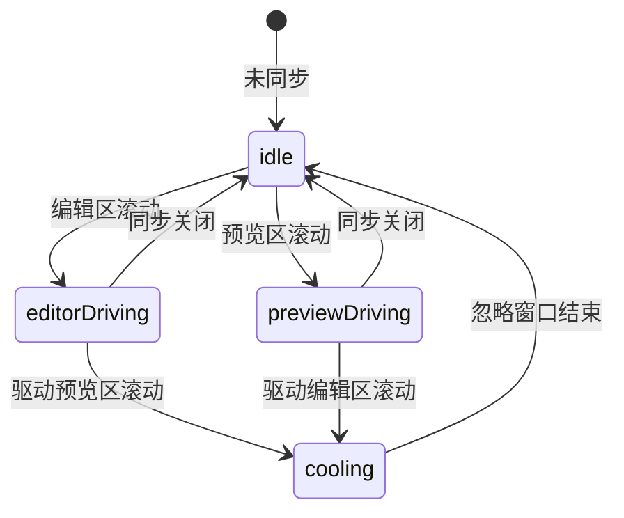
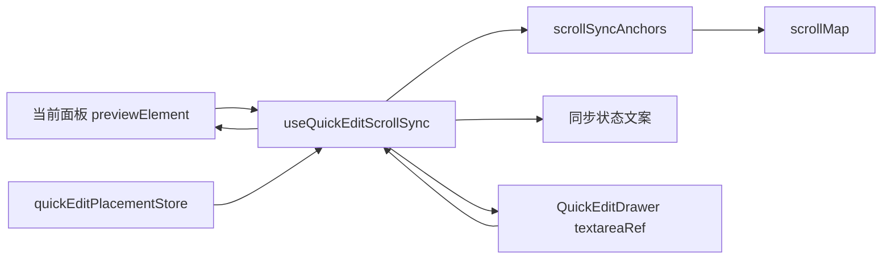

# 快速编辑双向同步滚动规划方案

> **给执行代理的要求：** 后续实施本方案时，必须使用 `superpowers:subagent-driven-development`（推荐）或 `superpowers:executing-plans`，并按任务逐项执行。步骤使用复选框语法跟踪。

**目标：** 在 MD Viewer 的快速编辑抽屉中增加可选“双向同步滚动”，让 Markdown 源码编辑区与当前面板预览区能够相互跟随，同时保持产品定位为“预览导出工具 + 少量编辑”。

**架构：** 参考 Markdown Preview Enhanced / Crossnote 的源码思路，采用“源码行锚点 + 全量 `scrollMap` 插值 + 二分反查 + 比例兜底 + 事务化防循环”的轻量同步方案。同步只绑定当前快速编辑所在面板，按 `leafId` 或 `single` 隔离，不做全局同步，不引入 CodeMirror 或 Monaco，不承诺编辑器级像素精确。

**技术栈：** Electron、React 19、TypeScript 5.9、Zustand、原生 `textarea`、DOM `data-source-line`、Vitest、Testing Library。

---

## 一、背景与修订结论

当前快速编辑已经完成以下能力：

- Markdown 渲染区右键菜单打开快速编辑。
- “快速编辑此处”能根据选中文本、源码行或滚动比例定位到源码附近。
- 快速编辑抽屉内编辑草稿，预览区实时渲染草稿。
- 分屏模式下，右键哪个面板就打开哪个面板的快速编辑抽屉。

但长文档编辑仍存在体验断点：

- 用户在编辑区滚动源码时，预览区不会跟随，难以确认当前位置的渲染效果。
- 用户在预览区滚动检查内容时，编辑区不会跟随，难以快速回到对应源码。
- 当前“快速编辑此处”只解决一次性定位，不解决持续编辑时的上下文同步。

本次修订结论：

- **应该添加双向同步滚动。**
- **不能只做简单比例同步。**
- **不能默认开启强同步。**
- **应采用锚点优先的算法优化，复杂块降级为附近同步。**

### 评审后修订摘要

本方案经架构、UX、Codex、Claude CLI 和思考模式评审后，新增以下约束：

- 锚点能力必须分级，不把现有 `data-source-line` 视为天然稳定。
- 锚点重采集必须覆盖 `draft/content` 变化、预览 HTML 更新、图表异步渲染、图片加载、`previewElement` 重挂载。
- 防循环必须从“时间窗忽略”升级为“同步事务 + 方向锁 + 反向忽略窗口”。
- 输入法组合输入期间必须暂停“预览区 → 编辑区”反向同步，恢复以 `compositionend` 为准。
- 分屏绑定必须明确为 `placementKey + previewElement + drawerInstanceId`，卸载、换 tab、关面板时必须解绑。
- 面向用户的文案必须少用“锚点、比例”等技术词，主界面只表达“当前面板同步”和“大致同步”。

## 二、产品边界

### 1. 做什么

- 在快速编辑抽屉中增加“同步滚动”开关。
- 开关默认关闭，由用户主动开启。
- 开启后，当前面板的预览区与该面板快速编辑抽屉内 `textarea` 双向跟随。
- 分屏时只同步当前 `leafId` 对应面板，不影响其他面板。
- 同一文件多面板打开时，每个面板是否同步由该面板自己的开关决定。

### 2. 不做什么

- 不把 MD Viewer 改造成完整 Markdown 编辑器。
- 不引入 CodeMirror、Monaco 或 AST 增量编辑引擎。
- 不默认开启同步滚动。
- 不承诺 VSCode 级逐像素精确同步。
- 不在正文区新增显式编辑按钮。
- 不跨分屏面板同步滚动。

## 三、推荐交互

### 1. 非分屏界面线框图

```text
┌──────────────────────────────────────────────────────────────────────┐
│ MD Viewer                                              导出  设置     │
├───────────────┬──────────────────────────────────────────────────────┤
│ 文件树        │ 预览区：草稿预览，未保存                              │
│ docs/         │ ┌──────────────────────────────┬───────────────────┐ │
│  report.md    │ │ # 报告标题                    │ 快速编辑          │ │
│               │ │                              │ report.md         │ │
│               │ │ 正文渲染内容                  │ [ ] 同步当前面板  │ │
│               │ │                              │ ┌───────────────┐ │ │
│               │ │ 图表 / 表格 / 代码块           │ │ # 报告标题     │ │ │
│               │ │                              │ │ 正文源码...    │ │ │
│               │ │                              │ │ ```mermaid    │ │ │
│               │ │                              │ │ ...           │ │ │
│               │ │                              │ └───────────────┘ │ │
│               │ │                              │ 已定位到第 N 行附近│ │
│               │ └──────────────────────────────┴───────────────────┘ │
└───────────────┴──────────────────────────────────────────────────────┘
```

说明：

- “同步滚动”放在快速编辑抽屉内部，属于编辑辅助能力。
- 默认未勾选，不改变现有快速编辑体验。
- 开启后，主界面只提示“同步当前预览与快速编辑”；当复杂内容只能近似对齐时，用轻量说明显示“大致同步”，不在主界面暴露“锚点、比例”等技术词。

### 2. 分屏界面线框图

```text
┌──────────────────────────────────────────────────────────────────────────────┐
│ MD Viewer                                                                    │
├──────────────────────────────────────┬───────────────────────────────────────┤
│ 左面板 leaf-a                        │ 右面板 leaf-b                         │
│ report.md                            │ summary.md                            │
│ ┌────────────────────┬─────────────┐ │ ┌───────────────────────────────────┐ │
│ │ 左侧预览            │ 快速编辑     │ │ │ 右侧预览                           │ │
│ │ data-source-line    │ [x] 同步当前│ │ │ 右键菜单仍可打开自己的快速编辑       │ │
│ │ 只和左侧抽屉同步     │ textarea    │ │ │ 不被 leaf-a 的滚动影响              │ │
│ └────────────────────┴─────────────┘ │ └───────────────────────────────────┘ │
└──────────────────────────────────────┴───────────────────────────────────────┘
```

分屏规则：

- `leaf-a` 开启同步，只影响 `leaf-a` 的预览容器和抽屉。
- `leaf-b` 即使显示同一个文件，也不被 `leaf-a` 的滚动事件驱动。
- 抽屉打开位置仍由 `quickEditPlacementStore` 管理。

## 四、同步算法设计

### 0. Markdown Preview Enhanced / Crossnote 源码参考

本方案参考 `markdown-preview-enhanced` VSCode 插件及其核心包 `crossnote` 的同步滚动设计，但不会照搬其完整编辑器能力。

可借鉴点：

- VSCode 插件层提供 `scrollSync` 配置和 `syncPreview` 命令，预览端只在开启同步或强制同步时响应编辑器行号变化。
- Crossnote 在 Markdown 渲染阶段为可映射块写入 `data-source-line`，不是滚动时临时全文搜索。
- Crossnote 会构建 `scrollMap`：数组下标是源码行号，值是该源码行在预览区中的垂直位置；没有直接锚点的源码行通过相邻锚点线性插值补齐。
- 预览滚动反向定位源码时，Crossnote 使用当前视口中部位置，在 `scrollMap` 中二分查找最接近的源码行，再通知 VSCode `revealLine`。
- 编辑器滚动驱动预览时，Crossnote 使用源码行在 `scrollMap` 中的位置，并用 `topRatio` 保持该行在视口中的相对位置。
- 程序滚动期间，Crossnote 通过动画标记、延迟窗口和取消待执行滚动，避免程序滚动被当作用户滚动反向同步。

MD Viewer 的取舍：

- 保留 `scrollMap` 与二分反查，这是比“最近锚点”更稳定的核心算法。
- 不采用 VSCode 默认开启同步的策略；MD Viewer 中仍默认关闭，由用户在快速编辑抽屉内开启。
- 不引入 Crossnote 的完整 Markdown 编辑器、演示模式、任务列表编辑、代码块执行等能力。
- 不使用全局 `window` 滚动作为唯一容器；必须限定当前 `previewElement`，以兼容 MD Viewer 分屏。

### 1. 总体策略

同步算法分阶段落地。

第一阶段必须交付：

- 锚点优先。
- `scrollMap` 插值同步。
- 二分反查源码行。
- 比例兜底。
- 事务化防循环。
- 分屏隔离。
- 输入法保护。

第二阶段再启用：

- 图表 hooks 主动通知锚点重采集。
- 更细粒度的块级同步状态说明。
- “同步一次”弱入口，用于不想持续同步但偶尔需要对齐位置的用户。

算法分层如下：

```text
用户滚动
   │
   ▼
识别滚动来源：editor 或 preview
   │
   ▼
锚点同步：data-source-line 可用时优先
   │
   ├─ 成功：滚动到对应源码行或渲染块附近
   │
   └─ 失败：进入 scrollMap、最近锚点或比例兜底
          │
          ├─ scrollMap 插值：为每个源码行估算预览位置
          │
          ├─ 最近锚点同步：锚点过少时滚到最近块附近
          │
          └─ 比例兜底：按 scrollTop / 可滚动高度同步
```

核心原则：

- 能用源码行锚点就不用纯比例。
- 能构建 `scrollMap` 就不用最近锚点。
- 锚点不足以构建 `scrollMap` 时，使用最近锚点。
- 只有没有可用锚点时，才退化为滚动比例。
- 所有同步都允许“附近”，不追求像素级完全一致。

### 2. 预览区锚点采集

预览区已有 `data-source-line` 基础，应继续强化为同步锚点。

锚点可用性分级：

| 等级 | 条件 | 同步策略 |
| --- | --- | --- |
| 稳定锚点 | 标题、普通段落、代码块外层、表格外层具备可信 `sourceLine` | 第一阶段可用于锚点同步 |
| 近似锚点 | 图表外层、复杂列表、引用块只知道块起始行 | 滚到块附近，不进入块内部 |
| 不稳定锚点 | 重复文本反查得到的行号、缺少源码行的复杂嵌套 | 不用于强同步，只作为比例兜底参考 |
| 无锚点 | 预览容器内没有有效 `data-source-line` | 只使用滚动比例 |

锚点来源：

- 标题：`h1` 到 `h6`。
- 段落：`p`。
- 代码块：`pre` 或代码块外层容器。
- 表格：`table`。
- 引用：`blockquote`。
- 图表：Mermaid、ECharts、DrawIO、PlantUML、Graphviz、Markmap、Infographic 外层容器。
- 列表：优先标记列表外层，复杂嵌套允许降级。

锚点结构：

```typescript
interface ScrollAnchor {
  sourceLine: number
  offsetTop: number
  height: number
  element: HTMLElement
}

interface ScrollMap {
  lineToTop: number[]
  anchorLines: number[]
  totalLines: number
  scrollHeight: number
  mode: 'precise' | 'approximate' | 'ratio'
}
```

采集规则：

- 只在当前面板预览容器内查询 `[data-source-line]`。
- 不使用 `document.querySelector('.preview')` 这类全局查询。
- 按 `sourceLine` 升序去重。
- 同一源码行对应多个 DOM 节点时，保留距离预览顶部最近的主节点。
- 重复文本反查得到的行号不能直接标记为稳定锚点；只有渲染块本身携带的 `data-source-line` 才能进入锚点集合。
- 草稿重新渲染后重新采集锚点。

重采集触发：

- 同步开关从关闭变为开启。
- `draft/content` 内容变化并完成预览 HTML 更新后。
- `placementKey`、`canonicalPath`、`previewElement`、`drawerInstanceId` 变化。
- `MutationObserver` 观察到当前预览容器子树变化。
- `ResizeObserver` 观察到预览容器、图片、图表或 `[data-source-line]` 块高度变化。
- 图片 `load` 事件或图表容器高度从 `0` 变为非零。
- 关闭同步或抽屉卸载时，断开所有 observer 和事件监听。

重采集必须防抖，建议 80ms 到 120ms，避免图表连续更新造成频繁扫描。

### 2.1 `scrollMap` 构建

`scrollMap` 是本方案从 Markdown Preview Enhanced / Crossnote 借鉴的核心结构。

构建方式：

1. 初始化长度为 `totalLines` 的 `lineToTop`，未知行先填 `-1`。
2. 写入首行：`lineToTop[0] = 0`。
3. 遍历当前 `previewElement` 内的稳定或近似锚点，将 `sourceLine -> offsetTop` 写入 `lineToTop`。
4. 写入末尾虚拟锚点：`lineToTop[totalLines] = previewScrollHeight`。
5. 对相邻两个已知锚点之间的未知行做线性插值。
6. 如果有效锚点不足，则返回 `mode = 'ratio'`，不强行伪造精确映射。

插值公式：

```typescript
const interpolatedTop =
  (nextTop * (line - previousLine) + previousTop * (nextLine - line)) /
  Math.max(1, nextLine - previousLine)
```

设计约束：

- `scrollMap` 只对当前 `previewElement` 有效，不能跨面板复用。
- `scrollMap` 在预览内容、容器尺寸、图表高度、图片加载、字体缩放变化后失效。
- `scrollMap` 允许用近似锚点参与插值，但输出状态应标记为 `approximate`。
- `scrollMap` 不应由重复文本搜索结果生成。
- 超过 `MAX_LINES_FOR_ANCHOR_SYNC` 或 `MAX_ANCHORS` 时，可以直接降级为比例同步。

### 3. 预览区滚动到编辑区

流程：

```text
预览区 scroll
   │
   ▼
找到视口顶部附近的可见锚点
   │
   ├─ 有 scrollMap：用视口中部位置二分反查 sourceLine
   │        │
   │        ▼
   │   textarea 滚动到 sourceLine 对应位置
   │
   └─ 无 scrollMap：读取预览滚动比例
            │
            ▼
       textarea 按比例滚动
```

预览区反查源码行：

```typescript
const viewportProbeTop = previewScrollTop + previewClientHeight / 2
const sourceLine = findNearestLineByTop(scrollMap.lineToTop, viewportProbeTop)
```

二分规则：

- 优先比较 `viewportProbeTop` 与 `lineToTop[mid]`。
- 找不到精确值时，返回距离最近的源码行。
- 顶部位置直接返回第 1 行。
- 底部位置直接返回最后一行。

源码行到 `textarea` 的估算：

```typescript
const estimatedLineHeight = textarea.scrollHeight / Math.max(1, lineCount)
const targetTop = Math.max(0, (sourceLine - 1) * estimatedLineHeight - 48)
```

优化规则：

- 优先使用 `textarea.scrollHeight / lineCount` 估算整体行高。
- 当 `getComputedStyle(textarea).lineHeight` 是有效像素值时，可与整体估算做平均，降低软换行误差。
- 如果用户正在输入或正在中文输入法组合输入，暂停“预览区 → 编辑区”同步，避免光标被拉走。
- 组合输入以 `compositionstart` 开始，以 `compositionend` 结束；`compositionend` 后延迟 200ms 到 300ms 恢复反向同步。
- 普通输入可用短暂停顿窗口保护光标，但只阻止“预览区 → 编辑区”，不阻止“编辑区 → 预览区”。
- 最小滚动差不要写死为固定像素，应使用相对值，例如当前可视高度的 2% 到 3%，并设置最小下限。

### 4. 编辑区滚动到预览区

流程：

```text
编辑区 scroll
   │
   ▼
估算 textarea 当前视口中部源码行
   │
   ▼
在 scrollMap 中查找目标源码行对应预览位置
   │
   ├─ 有 scrollMap：滚动到 lineToTop[targetLine]
   │
   ├─ 无 scrollMap 但有锚点：滚动到最近锚点附近
   │
   └─ 无锚点：按编辑区滚动比例同步预览区
```

`scrollMap` 插值示意：

```text
源码行：      10                 20
              │                  │
预览锚点：  anchorA ─────────── anchorB
              │        ▲         │
              │      第 15 行     │
              ▼        │         ▼
DOM 位置：  topA ─── 插值位置 ─── topB
```

`scrollMap` 查询：

```typescript
const targetTop = scrollMap.lineToTop[targetLine] ?? fallbackTop
```

降级规则：

- 如果目标行落在大型图表或大表格内部，允许滚到该块外层容器顶部附近。
- 如果 `scrollMap` 缺失或目标行没有有效位置，使用最近锚点。
- 如果没有锚点，使用滚动比例兜底。
- 预览容器滚动目标与当前值差异小于“可视高度的 2% 到 3%”时不滚动。
- 编辑区行号建议用视口中部行，而不是只用顶部行，减少长段落和软换行导致的跳动。

### 5. 防循环设计

双向同步必须避免 A 滚动触发 B，B 又反向触发 A。

状态机：



防循环规则：

- 使用 `syncSourceRef` 记录当前驱动源：`editor`、`preview` 或 `null`。
- 使用 `syncTokenRef` 记录本次程序滚动事务标识。
- 使用 `ignoreUntilRef` 记录忽略反向滚动的截止时间。
- 同源连续滚动可以续期；反向滚动在忽略窗口内丢弃。
- 忽略窗口结束后，用户主动滚动另一侧可以接管驱动源。
- 程序滚动后，在短窗口内忽略另一侧由程序滚动引发的 scroll 事件。
- 如果用户在另一侧主动滚动，应取消当前待执行的平滑滚动任务，让用户操作优先。
- 使用 `requestAnimationFrame` 合并同一帧内多次滚动。
- 使用 80ms 到 120ms 节流，避免滚轮连续事件造成重算过密。
- 关闭同步开关、抽屉卸载、面板关闭或 `previewElement` 变化时，取消未执行的 `requestAnimationFrame` 并解绑监听。

建议常量：

```typescript
const SYNC_THROTTLE_MS = 100
const SYNC_IGNORE_MS = 140
const COMPOSITION_RESUME_DELAY_MS = 250
const MIN_SCROLL_DELTA_RATIO = 0.025
const MIN_SCROLL_DELTA_PX = 16
const MAX_ANCHORS = 3000
const MAX_LINES_FOR_ANCHOR_SYNC = 10000
const DEFAULT_TOP_RATIO = 0.372
```

`DEFAULT_TOP_RATIO` 参考 Markdown Preview Enhanced / Crossnote 的经验值：编辑器行号驱动预览时，不把目标行贴到视口顶部，而是放在视口上方约 37.2% 的位置，减少上下文丢失。

伪代码：

```typescript
function runSync(source: 'editor' | 'preview') {
  const now = performance.now()
  if (syncSourceRef.current && syncSourceRef.current !== source && now < ignoreUntilRef.current) {
    return
  }

  const token = crypto.randomUUID()
  syncSourceRef.current = source
  syncTokenRef.current = token
  ignoreUntilRef.current = now + SYNC_IGNORE_MS

  cancelAnimationFrame(frameRef.current)
  frameRef.current = requestAnimationFrame(() => {
    if (syncTokenRef.current !== token) return

    if (source === 'editor') {
      syncPreviewFromEditor()
    } else {
      syncEditorFromPreview()
    }

    window.setTimeout(() => {
      if (syncTokenRef.current === token && performance.now() >= ignoreUntilRef.current) {
        syncSourceRef.current = null
        syncTokenRef.current = null
      }
    }, SYNC_IGNORE_MS + 20)
  })
}
```

## 五、偏差来源与优化策略

### 1. 鱼骨图

```text
                           ┌─ 标题、段落高度不同
                           ├─ 图片加载后高度变化
                           ├─ 表格横向/纵向尺寸不可预测
同步偏差 ───────────────────┼─ 图表异步渲染导致高度延迟变化
                           ├─ 代码块行高与 textarea 行高不同
                           ├─ Markdown 列表嵌套映射不稳定
                           └─ textarea 软换行影响源码行高度估算
```

### 2. 优化措施

| 偏差来源 | 优化方案 | 降级行为 |
| --- | --- | --- |
| 图表异步渲染 | 图表容器标记 `data-source-line`，用 `MutationObserver` / `ResizeObserver` 触发重采集 | 滚到图表容器附近 |
| 大表格 | `table` 外层作为块级锚点 | 不进入单元格级定位 |
| 代码块 | `pre` 外层作为锚点，源码行指向代码围栏起始行 | 滚到代码块顶部附近 |
| 软换行 | 使用 `textarea.scrollHeight / lineCount` 估算 | 允许附近偏移 |
| 锚点不足 | 最近锚点或比例兜底 | 对用户显示“大致同步” |
| 重复文本 | 同步滚动不依赖文本搜索 | 仅“快速编辑此处”使用文本搜索 |

## 六、状态与模块设计

### 1. 状态归属

同步开关属于“抽屉摆放位置”的交互状态，而不是文件内容状态。

建议扩展 `quickEditPlacementStore`：

```typescript
interface QuickEditPlacementState {
  placements: Record<string, QuickEditTarget>
  scrollSyncEnabled: Record<string, boolean>
  setScrollSyncEnabled: (placementKey: string, enabled: boolean) => void
}
```

原因：

- 同一文件可以出现在多个分屏面板。
- 每个面板是否开启同步应独立。
- 关闭某个面板抽屉时，可以清理该面板同步状态。
- 同步开关可以放在 `quickEditPlacementStore`，但滚动位置、锚点缓存、observer、事务 token、驱动源必须留在 Hook 局部状态，不能进入全局 store。
- `editSessionStore` 只负责 `canonicalPath` 草稿、保存、冲突，不保存同步状态；同一文件多面板共享草稿，但不共享同步开关。

### 2. 建议新增模块

```text
src/renderer/src/utils/scrollSyncAnchors.ts
  ├─ collectPreviewAnchors()
  ├─ buildScrollMap()
  ├─ findNearestLineByTop()
  ├─ findVisibleAnchor()
  ├─ findInterpolatedPreviewTop()
  ├─ estimateEditorLine()
  └─ clampScrollTop()

src/renderer/src/hooks/useQuickEditScrollSync.ts
  ├─ 绑定 previewElement 与 textareaRef
  ├─ 监听 editor / preview scroll
  ├─ 管理 syncSourceRef / syncTokenRef / ignoreUntilRef
  ├─ 管理 composition 输入暂停窗口
  ├─ 管理 MutationObserver / ResizeObserver
  └─ 暴露 syncStatus 给 UI 展示
```

建议 `syncStatus` 枚举：

```typescript
type ScrollSyncStatus =
  | 'idle'
  | 'precise'
  | 'approximate'
  | 'paused'
  | 'unavailable'
```

UI 文案由枚举映射，不直接暴露算法术语。

### 3. 组件接入关系



建议接入点：

- `SplitPanel.tsx`：分屏叶子面板已有预览容器，需要以 callback ref 或节点状态形式传给 `QuickEditDrawer`，确保 DOM 节点重挂载时 Hook 可解绑重绑。
- `App.tsx`：非分屏模式同样以 callback ref 或节点状态传递当前预览容器。
- `QuickEditDrawer.tsx`：持有 `textareaRef`，渲染开关和同步状态。
- `VirtualizedMarkdown.tsx`：继续保证关键块级元素带 `data-source-line`。

绑定契约：

- Hook 的唯一绑定身份是 `placementKey + canonicalPath + drawerInstanceId + previewElement`。
- 任一身份变化，都必须解绑旧监听、取消旧 observer、取消旧 rAF、清空旧 token。
- 面板关闭、换 tab、抽屉关闭、文件路径不匹配时，必须关闭或禁用该 placement 的同步。

## 七、用户体验细节

### 1. 开关文案

建议文案：

```text
[ ] 同步当前预览与快速编辑
```

开启后状态：

```text
[x] 同步当前预览与快速编辑
```

降级时状态：

```text
[x] 同步当前预览与快速编辑 · 大致同步
```

暂停时状态：

```text
[x] 同步当前预览与快速编辑 · 输入中暂停反向同步
```

界面说明：

- 主开关文案强调“当前预览”，避免用户误以为会同步其他分屏面板。
- “精确同步 / 大致同步”可以放在 `title`、帮助提示或轻量状态中，不建议滚动时频繁变化。
- 文件名已在抽屉头部展示；分屏场景下可补充“当前面板”提示，降低跨面板误解。

### 2. 可访问性

- 开关使用原生 `checkbox` 或 `button role="switch"`。
- `aria-label` 使用“同步当前预览区与快速编辑区滚动”。
- 状态文案使用 `aria-live="polite"`，但只在开启、关闭、降级、暂停、不可用时播报；不能随每次滚动播报。
- 开关必须可键盘聚焦和切换。

### 3. 性能限制

- 单次滚动计算只查询当前面板容器，不扫描全局 DOM。
- 锚点采集在内容变化、预览重渲染、同步开启时执行，不在每个滚动事件中完整重采集。
- 滚动事件中只做轻量查找和计算。
- 文档超过 `MAX_LINES_FOR_ANCHOR_SYNC` 或预览锚点超过 `MAX_ANCHORS` 时，允许降级为比例同步，避免卡顿。

## 八、实施计划

实施顺序以“锚点稳定性 → 工具函数 → Hook → Store → UI 接入 → 容器接入 → 集成验证”为准。不要先写同步 Hook 再回头补锚点，否则测试会建立在不稳定前提上。

### 任务 1：强化预览锚点稳定性

**文件：**

- 修改：`src/renderer/src/components/VirtualizedMarkdown.tsx`
- 修改：`src/renderer/test/components/VirtualizedMarkdown.test.tsx`

- [ ] 确认标题、段落、代码块、表格、引用、图表外层容器具备稳定 `data-source-line`。
- [ ] 测试右键定位与同步锚点共用同一套 `data-source-line` 语义。
- [ ] 测试重复文本反查结果不能被当作稳定同步锚点。
- [ ] 测试没有源码行的复杂嵌套节点不会破坏渲染。
- [ ] 运行：

```bash
npx vitest --run src/renderer/test/components/VirtualizedMarkdown.test.tsx
```

预期：Markdown 渲染测试全部通过。

### 任务 2：补齐同步工具测试与工具函数

**文件：**

- 新增：`src/renderer/src/utils/scrollSyncAnchors.ts`
- 新增：`src/renderer/test/utils/scrollSyncAnchors.test.ts`

- [ ] 编写 `collectPreviewAnchors` 测试：只采集当前容器内 `[data-source-line]`，过滤无效行号，按源码行排序。
- [ ] 编写锚点分级测试：稳定、近似、不稳定、无锚点分别返回预期同步能力。
- [ ] 编写 `buildScrollMap` 测试：首行、末尾虚拟锚点、相邻锚点之间的未知源码行都能被线性插值补齐。
- [ ] 编写 `findNearestLineByTop` 测试：根据预览视口中部位置在 `scrollMap` 中二分反查源码行。
- [ ] 编写 `findVisibleAnchor` 测试：选择距离容器顶部最近且不超过顶部偏移阈值的锚点。
- [ ] 编写 `findNearestAnchor` 测试：`scrollMap` 不可用时返回最近锚点。
- [ ] 编写 `findInterpolatedPreviewTop` 测试：目标行位于两个锚点之间时使用线性插值。
- [ ] 编写 `estimateEditorLine` 测试：根据 `textarea.scrollTop`、`scrollHeight`、源码行数估算当前顶部行。
- [ ] 编写阈值测试：最小滚动差使用 `MIN_SCROLL_DELTA_RATIO` 和 `MIN_SCROLL_DELTA_PX`。
- [ ] 实现工具函数并运行：

```bash
npx vitest --run src/renderer/test/utils/scrollSyncAnchors.test.ts
```

预期：新增测试全部通过。

### 任务 3：新增同步 Hook

**文件：**

- 新增：`src/renderer/src/hooks/useQuickEditScrollSync.ts`
- 新增：`src/renderer/test/hooks/useQuickEditScrollSync.test.tsx`

- [ ] 测试默认关闭时不绑定同步行为。
- [ ] 测试编辑区滚动时调用预览区滚动。
- [ ] 测试预览区滚动时调用编辑区滚动。
- [ ] 测试编辑区滚动驱动预览时使用 `DEFAULT_TOP_RATIO` 保留上下文。
- [ ] 测试预览区滚动反向定位时使用预览视口中部位置二分反查源码行。
- [ ] 测试 `syncTokenRef`、`syncSourceRef` 和 `ignoreUntilRef` 能阻止程序滚动反向循环。
- [ ] 测试同源连续滚动可续期，忽略窗口结束后用户反向滚动可接管。
- [ ] 测试用户主动滚动另一侧时取消待执行的平滑滚动任务。
- [ ] 测试 `compositionstart` 到 `compositionend` 期间暂停“预览区 → 编辑区”同步。
- [ ] 测试 `compositionend` 后延迟 `COMPOSITION_RESUME_DELAY_MS` 恢复反向同步。
- [ ] 测试 `MutationObserver` / `ResizeObserver` 触发锚点重采集，并在卸载时断开。
- [ ] 测试 `previewElement` 或 `drawerInstanceId` 变化时解绑旧监听并绑定新节点。
- [ ] 实现 Hook，并运行：

```bash
npx vitest --run src/renderer/test/hooks/useQuickEditScrollSync.test.tsx
```

预期：Hook 行为测试全部通过。

### 任务 4：扩展快速编辑摆放状态

**文件：**

- 修改：`src/renderer/src/stores/quickEditPlacementStore.ts`
- 修改：`src/renderer/test/stores/quickEditPlacementStore.test.ts`

- [ ] 测试每个 `placementKey` 可独立保存同步开关状态。
- [ ] 测试关闭 placement 时清理对应同步开关状态。
- [ ] 测试面板关闭、换 tab 或文件不匹配时可关闭或禁用该 placement 同步。
- [ ] 测试 `reset()` 同时清理 placement 与同步状态。
- [ ] 实现 `scrollSyncEnabled` 与 `setScrollSyncEnabled`。
- [ ] 运行：

```bash
npx vitest --run src/renderer/test/stores/quickEditPlacementStore.test.ts
```

预期：原有测试与新增测试全部通过。

### 任务 5：接入快速编辑抽屉界面

**文件：**

- 修改：`src/renderer/src/components/QuickEditDrawer.tsx`
- 修改：`src/renderer/src/components/QuickEditDrawer.css`
- 修改：`src/renderer/test/components/QuickEditDrawer.test.tsx`

- [ ] 给 `QuickEditDrawer` 增加 `placementKey`、`previewElement` 和 `drawerInstanceId`。
- [ ] 在抽屉头部或定位提示附近增加“同步当前预览与快速编辑”开关。
- [ ] 调用 `useQuickEditScrollSync` 绑定 `textareaRef` 和当前面板 `previewElement`。
- [ ] 展示用户可理解的同步状态文案：开启、关闭、大致同步、输入中暂停、不可用。
- [ ] 测试默认关闭。
- [ ] 测试点击开关后状态变更。
- [ ] 测试没有 `previewElement` 时不报错并显示不可同步状态。
- [ ] 测试状态文案只在状态变化时 `aria-live` 播报，不随滚动频繁播报。
- [ ] 运行：

```bash
npx vitest --run src/renderer/test/components/QuickEditDrawer.test.tsx
```

预期：抽屉组件测试全部通过。

### 任务 6：接入非分屏与分屏容器

**文件：**

- 修改：`src/renderer/src/App.tsx`
- 修改：`src/renderer/src/components/SplitPanel.tsx`
- 修改：`src/renderer/test/App.test.tsx`
- 修改：`src/renderer/test/components/SplitPanel.editing.test.tsx`

- [ ] 非分屏模式向 `QuickEditDrawer` 传入 `placementKey="single"` 和当前 `previewElement`。
- [ ] 分屏模式向 `QuickEditDrawer` 传入当前 `leafId` 和该叶子面板 `previewElement`。
- [ ] 使用 callback ref 或节点状态传递 DOM 节点，确保重挂载时 Hook 可解绑重绑。
- [ ] 测试非分屏开启同步不影响分屏状态。
- [ ] 测试分屏左面板开启同步不影响右面板。
- [ ] 测试同一文件双面板打开时，每个面板开关独立。
- [ ] 测试面板关闭、换 tab、抽屉卸载后旧监听不会继续触发。
- [ ] 运行：

```bash
npx vitest --run src/renderer/test/App.test.tsx src/renderer/test/components/SplitPanel.editing.test.tsx
```

预期：相关组件测试全部通过。

### 任务 7：集成验证

**文件：**

- 修改：必要时更新 `docs/superpowers/plans/2026-04-25-lightweight-editing.md` 的滚动策略摘要。

- [ ] 运行类型检查：

```bash
npm run typecheck
```

- [ ] 运行渲染器测试：

```bash
npm test -- --run
```

- [ ] 运行空白检查：

```bash
git diff --check
```

预期：

- 类型检查通过。
- 渲染器测试通过。
- 没有空白错误。

## 九、验收标准

### 1. 基础验收

- 快速编辑抽屉默认不启用同步滚动。
- 用户开启“同步滚动”后，编辑区滚动会驱动当前面板预览区滚动。
- 用户开启“同步滚动”后，预览区滚动会驱动当前面板编辑区滚动。
- 关闭开关后，两侧滚动互不影响。
- 关闭抽屉后，对应面板同步状态被清理。
- 中文输入法组合输入期间，预览区滚动不会拉动编辑区或移动光标附近位置。
- `previewElement` 重挂载后，同步能重新绑定新节点，不残留旧监听。

### 2. 分屏验收

- 左面板开启同步，不影响右面板。
- 右面板开启同步，不影响左面板。
- 同一文件在左右面板同时打开时，同步开关状态按面板独立。
- 右键哪个面板打开快速编辑，就只同步那个面板。
- 左右面板同时开启同步时，各自只驱动自己的预览容器和抽屉。
- 面板关闭、换 tab、拖拽替换面板内容后，旧同步关系失效。

### 3. 算法验收

- 标题、普通段落、代码块附近能稳定同步到对应区域。
- 表格、图表、大代码块允许滚到块级容器附近。
- `scrollMap` 能为没有直接锚点的普通源码行提供插值位置。
- 预览滚动反向定位源码时，使用视口中部位置反查源码行，避免顶部空白或大块内容导致偏移。
- 锚点缺失时能比例兜底，不报错、不抖动。
- 连续滚轮滚动时无明显循环拉扯。
- 用户主动滚动另一侧时，待执行的程序滚动会取消，用户操作优先。
- 输入文字时，预览区不会反向把编辑光标附近滚走。
- 图表或图片加载导致高度二次变化后，锚点会重新采集，后续同步仍能到块级附近。
- 程序滚动触发的 scroll 事件不会在忽略窗口内反向触发另一轮同步。

### 4. 性能验收

- 普通文档滚动同步无明显卡顿。
- 含 Mermaid、ECharts、DrawIO、PlantUML 等图表的文档不会因同步滚动频繁重渲染。
- 长文档允许降级为比例同步，但不能阻塞界面。

## 十、实施风险与应对

| 风险 | 影响 | 应对 |
| --- | --- | --- |
| `data-source-line` 覆盖不足 | 同步不准 | 锚点不足时比例兜底，并逐步增强块级标记 |
| 图表异步改变高度 | 滚动位置漂移 | 图表外层作为锚点，通过 observer 或图表回调重新采集 |
| 双向循环 | 页面抖动 | `syncTokenRef`、`syncSourceRef`、`ignoreUntilRef`、节流、相对最小滚动差 |
| 输入时反向滚动 | 打断编辑 | `compositionstart/end` 期间暂停“预览区 → 编辑区”，结束后延迟恢复 |
| 分屏误同步 | 用户编辑错位 | 所有查询限定在当前 `previewElement`、`placementKey`、`drawerInstanceId` |
| DOM 重挂载旧监听残留 | 跨面板误同步或内存泄漏 | Hook 身份变化时强制解绑旧监听、observer 和 rAF |
| 测试环境缺少真实布局 | DOM 高度为 0 | 工具函数支持注入锚点数据，Hook 测试使用可控 mock |

## 十一、与旧方案的关系

旧方案 `docs/superpowers/plans/2026-04-25-lightweight-editing.md` 将双向同步滚动放在第二阶段，并偏向“默认不做”。本方案是在快速编辑 MVP 已完成后的独立增强方案，修订为：

- 保留默认关闭。
- 参考 Markdown Preview Enhanced / Crossnote，将“简单比例同步”升级为“源码行锚点 + `scrollMap` 插值 + 二分反查 + 比例兜底”。
- 将“防循环”从风险提示升级为“事务化防循环”必做算法模块。
- 将分屏隔离作为验收硬约束。

## 十二、自检清单

- 本方案没有要求引入完整编辑器内核。
- 本方案没有要求默认开启双向强同步。
- 本方案没有把快速编辑入口放到正文区。
- 本方案明确了分屏面板隔离。
- 本方案明确了 Markdown Preview Enhanced / Crossnote 可借鉴点与不照搬范围。
- 本方案明确了锚点分级、`scrollMap` 构建、二分反查、重采集生命周期、降级算法和事务化防循环算法。
- 本方案明确了输入法组合输入保护和 `aria-live` 播报边界。
- 本方案包含测试、类型检查和空白检查命令。
