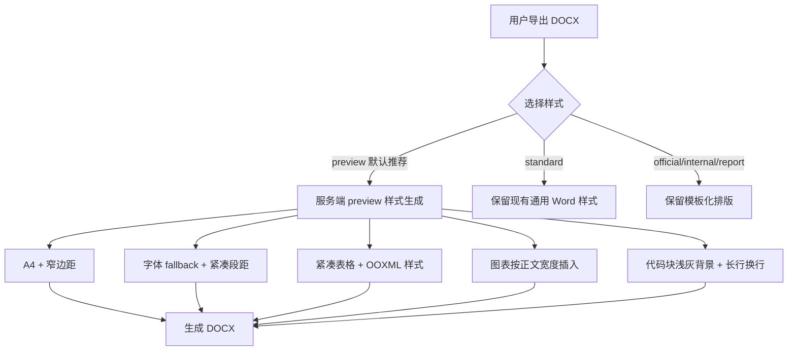

# DOCX 预览一致样式实施方案

> **供 agent 执行时使用：**必须按任务逐项执行。推荐使用 `superpowers:subagent-driven-development`，也可以使用 `superpowers:executing-plans`。每个任务完成后都要运行对应验证命令。

**目标：**新增一个面向“预览一致导出”的 DOCX 样式 `preview`，让 DOCX 在文字密度、页面尺寸、表格排版、代码块、图表宽度和分页节奏上尽量接近 MD Viewer 的 PDF/预览导出。

**架构：**保留现有 `standard / official / internal / report` 的语义，不直接破坏用户已选择的模板。`preview` 作为新的默认推荐样式，但只对“没有主动选择过 DOCX 样式”的用户生效；旧用户显式选择过的样式不迁移。服务端以 `VALID_STYLES` 和固定顺序 `STYLE_ORDER` 作为样式单一事实源，客户端通过本地类型和 `/healthz.styles` 做兼容校验。

**技术栈：**Electron 39、React 19、TypeScript 5.9、FastAPI、python-docx、LibreOffice headless、Playwright Electron E2E、Poppler/ImageMagick 视觉验证。

---

## 一、结论与取舍

### 推荐：新增 `preview`，不要直接修 `standard`

原因：

1. `standard` 已经被用户理解为“通用 Word 模板”，直接改为 PDF-like 会改变已有导出预期。
2. `official / internal / report` 是公文/报告语义模板，本来就不应该追求和 PDF 预览一致。
3. MD Viewer 的定位是“预览导出工具 + 少量编辑”，应提供一个明确的“预览一致 DOCX”出口。
4. v1.7.0 尚未发布，可以把无保存设置的新用户默认 DOCX 样式从 `standard` 调整为 `preview`，但保留 `standard` 可选，降低破坏面。

建议命名：

- API 值：`preview`
- 中文显示：`预览一致`
- UI 描述：`接近 Markdown 预览与 PDF 导出的页面节奏，适合所见即所得式交付`

不建议命名为 `pdf-like`：

- 它描述的是实现参照，不是用户目标。
- 用户更关心“像预览一样”，不是“像 PDF 一样”。
- `preview` 更适合和 MD Viewer 产品定位绑定。

### 样式定位图

```text
DOCX 样式
├─ preview   预览一致：接近 PDF / Markdown 预览，默认推荐
├─ standard  通用 Word：保留现有兼容行为
├─ official  正式公文：GB/T 公文排版
├─ internal  机关内部：内部文件模板
└─ report    调研报告：报告类模板
```

### 当前差距证据

基准文件：

```text
/private/tmp/mdv-cce-mode-b-docker-docx-quality/CCE集群外挂存储详情.pdf
```

现状对比：

| 文件 | 页面 | 页数 | 主要问题 |
| --- | --- | ---: | --- |
| PDF 基准 | A4 | 28 | 浏览器预览打印样式，密度合理 |
| cce-standard.docx 转 PDF | Letter | 33 | 页面尺寸、边距、表格、标题风格不一致 |
| cce-report.docx 转 PDF | Letter | 43 | 字号/行距更大，页数明显增加 |
| cce-official.docx 转 PDF | Letter | 55 | 公文模板，与预览一致目标冲突 |
| cce-internal.docx 转 PDF | Letter | 57 | 内部文件模板，与预览一致目标冲突 |

视觉对比图：

```text
/private/tmp/mdv-docx-visual-compare/pairs/page-01-source-vs-docx.png
/private/tmp/mdv-docx-visual-compare/pairs/page-03-source-vs-docx.png
/private/tmp/mdv-docx-visual-compare/pairs/page-04-source-vs-docx.png
```

---

## 二、目标效果

### 页面结构

```text
+--------------------------------------------------+
| A4 页面，10mm ~ 12mm 页边距                       |
|                                                  |
| 华为云 CCE 集群外挂存储与工作负载详情             |
|                                                  |
| [浅灰信息块：生成日期 / 数据来源 / 集群地址]       |
|                                                  |
| 目录                                             |
| • 一、存储总览                                   |
| • 二、系统全景                                   |
|                                                  |
| 一、存储总览                                     |
| 1.1 存储类型分布                                 |
| +----------------------------------------------+ |
| | 浅灰表头 / 细边框 / 紧凑单元格                 | |
| +----------------------------------------------+ |
|                                                  |
| [图表宽度接近正文宽度，居中，不被过度缩小]        |
+--------------------------------------------------+
```

### 视觉原则

```text
预览一致 DOCX
  |
  +-- 页面：A4、窄边距、正文宽度接近 PDF
  +-- 字体：显式 fallback，优先系统无衬线，字号偏紧凑
  +-- 标题：左对齐，层级清晰，不过度公文化
  +-- 表格：浅灰表头、细边框、紧凑 padding、按页面宽度分配列宽
  +-- 代码：等宽字体、浅灰背景、允许长行换行
  +-- 图表：按正文可用宽度插入，保持比例
  +-- 分页：避免标题孤行，表格行尽量不跨页
```

### Mermaid 流程



---

## 三、关键架构约束

### 1. 样式单一事实源

服务端必须新增：

```python
STYLE_ORDER = ("preview", "standard", "official", "internal", "report")
VALID_STYLES = frozenset(STYLE_ORDER)
```

`/healthz.styles` 必须按 `STYLE_ORDER` 返回：

```json
["preview", "standard", "official", "internal", "report"]
```

`ConvertRequest.style` 不应长期维护手写正则。短期可用 `Literal` 或 Pydantic validator，要求只引用 `VALID_STYLES`，避免新增样式时漏改。

### 2. 旧服务端兼容

客户端默认使用 `preview` 后，必须处理旧 DOCX 服务不支持 `preview` 的情况：

```text
客户端连接服务端
  |
  +-- /healthz.styles 包含 preview -> 正常使用 preview
  |
  +-- /healthz.styles 不包含 preview
        |
        +-- 用户未主动选择 style -> 回退 standard，并在导出任务中提示
        |
        +-- 用户主动选择 preview -> 阻止导出或提示升级服务端，不静默生成 standard
```

任务面板提示建议：

```text
当前 DOCX 服务不支持“预览一致”，已临时使用“通用 Word”导出。建议升级 md-viewer-docx-service。
```

### 3. 默认值迁移

必须区分三种用户状态：

| 状态 | 存储值 | 行为 |
| --- | --- | --- |
| 全新安装 | 无设置 | 默认 `preview` |
| 升级用户从未主动选择 DOCX 样式 | `style` 缺失 | 默认 `preview` |
| 升级用户主动选择过样式 | `standard / official / internal / report / preview` | 保留原选择 |

实现时应增加一个标志位，例如：

```ts
docxExport: {
  style: 'preview',
  styleTouched: false
}
```

如果不想新增字段，也必须用“设置对象是否存在”和“style 字段是否存在”区分，不能再用 `style || 'standard'`。

### 4. 字体 fallback

不能依赖 Word/LibreOffice 自行替换字体。preview 必须在服务端生成时选择可用字体。

字体链：

```python
PREVIEW_FONT_CHAIN = (
    "PingFang SC",
    "Noto Sans CJK SC",
    "Microsoft YaHei",
    "SimHei",
    "Arial Unicode MS",
)

PREVIEW_MONO_FONT_CHAIN = (
    "Menlo",
    "Sarasa Mono SC",
    "Noto Sans Mono CJK SC",
    "Consolas",
    "Courier New",
)
```

检测策略：

- macOS/开发机：允许命中 `PingFang SC`。
- Docker full：预期命中 `Noto Sans CJK SC`。
- 如果 `fc-list` 不存在，使用链表第一个值，但在 warnings 中记录。

### 5. 表格与图表宽度

preview 页面正文宽度：

```text
A4 宽度 21.0cm - 左右边距 1.0cm * 2 = 19.0cm
```

图表宽度策略：

- preview 下服务端注入图片时，目标 `widthCm = min(image.widthCm, content_width_cm)`。
- 如果客户端传来的 `widthCm` 小于 `18.0`，preview 可提升到 `18.5`，但不得超过 `19.0`。
- 非 preview 样式保持原行为。

表格策略：

- 总宽接近正文宽度。
- 表头浅灰 `F6F8FA`。
- 边框浅灰 `D0D7DE`，不要使用默认黑色粗线。
- 单元格 margin/padding 紧凑。
- 表格行尽量不跨页。
- 长路径、URL、代码、英文 token 允许换行。

### 6. 视觉验收边界

`preview` 目标是“视觉密度和排版节奏接近”，不是逐像素一致。

自动化验收是底线：

- A4 页面。
- 页边距 <= 1.3cm。
- CCE 文档 preview 转 PDF 页数 <= 32。
- 图片数量 25，fallback 0。
- 表头存在 `F6F8FA` shading。
- DOCX 转 PDF 页面尺寸为 A4。

人工视觉验收是发布前抽检：

- 第一页应容纳目录和“存储类型分布”表格的大部分内容。
- 第三页/第四页的表格、图表、段落密度不应再明显松散。
- Word/WPS/Pages 至少抽样打开 `preview` 一份。

---

## 四、涉及文件

### 服务端 `md-viewer-docx-service`

- 修改：`app/presets.py`
  - 新增 `STYLE_ORDER`。
  - 将 `VALID_STYLES` 改为 `frozenset(STYLE_ORDER)`。
  - 增加 `preview` 样式元数据。

- 修改：`app/main.py`
  - `ConvertRequest.style` 校验引用 `VALID_STYLES`。
  - `/healthz.styles` 返回 `list(STYLE_ORDER)`。

- 修改：`app/generator.py`
  - 新增 preview 布局参数或 `_generate_preview_from_content(...)`。
  - 新增字体检测与 fallback。
  - 新增 preview 专用页面设置、段落设置、表格样式、代码块样式。
  - 在 `generate_docx_from_content(...)` 中于读取 `DOCX_PRESETS[style]` 前分发 `style == "preview"`。
  - 扩展 `_render_blocks(...)` / `_add_table(...)` 时必须保留默认参数，避免影响现有四种样式。

- 修改：`app/image_injector.py`
  - 支持 preview 下按正文宽度覆盖或 clamp 图片宽度。
  - 非 preview 样式保持原行为。

- 修改：`tests/test_generator.py`
  - 增加 preview 样式结构测试。
  - 增加 A4、页边距、表格底色、代码块、字体 fallback 测试。

- 修改：`tests/test_main.py`
  - 增加 `/convert` 支持 `preview`。
  - 增加 `/healthz.styles` 固定顺序测试。

- 新增：`tests/test_preview_style_visual_metrics.py`
  - 用夹具或真实 Markdown 导出 preview DOCX。
  - 解包 `word/document.xml` 检查页面尺寸、页边距、表格底色、图片数量。
  - 如环境有 `soffice/pdfinfo`，额外检查转 PDF 页数。

### 客户端 `md-viewer`

- 修改：`src/renderer/src/components/DocxStyleCards.tsx`
  - 增加 `preview` 模板卡。
  - 排在第一位并标记推荐。
  - 文案避免“完全一致”承诺。

- 修改：`src/renderer/src/components/DocxStyleCards.css`
  - 5 张卡片响应式布局。
  - 明确 selected / hover / focus-visible / disabled 状态。

- 修改：`src/renderer/src/components/SettingsPanel.tsx`
  - 默认 DOCX 样式改为 `preview`。
  - 已保存为其他样式的用户不强制覆盖。
  - 旧服务端不支持 `preview` 时禁用或提示。

- 修改：`src/main/appDataManager.ts`
  - 增加统一默认 DOCX 导出设置。
  - 区分“未设置 style”和“用户主动选择 style”。

- 修改：`src/main/ipc/exportHandlers.ts`
  - DOCX 远程导出默认 style 使用统一默认设置。
  - 服务端不支持 `preview` 时按兼容策略处理。
  - 测试保存路径模板继续支持 `{style}`。

- 修改：`src/main/remoteDocxExporter.ts`
  - 读取 `/healthz.styles` 并暴露兼容信息。
  - 避免对 `preview` 失败静默 fallback。

- 修改：`src/preload/index.d.ts` 或相关设置类型文件
  - 扩展 `DocxStyle` 联合类型，加入 `preview`。

- 修改：`e2e/cce-docx-real-export.spec.ts`
  - 将样式集合扩展为 `preview / standard / official / internal / report`。
  - 对 `preview` 增加更严格的质量断言。

- 新增：`scripts/compare-docx-pdf-visual.sh`
  - 生成 DOCX 转 PDF 与基准 PDF 的并排截图。

---

## 五、实施任务

### 任务 0：影响面确认

**文件：**

- 只读：`/Users/mac/Documents/test/testmd/md-viewer-docx-service/app/generator.py`
- 只读：`/Users/mac/Documents/test/testmd/md-viewer/src/main/appDataManager.ts`
- 只读：`/Users/mac/Documents/test/testmd/md-viewer/src/main/remoteDocxExporter.ts`
- 只读：`/Users/mac/Documents/test/testmd/md-viewer/src/main/ipc/exportHandlers.ts`

- [ ] 步骤 1：列出服务端渲染函数调用点

```bash
cd /Users/mac/Documents/test/testmd/md-viewer-docx-service
rg -n "_render_blocks\\(|_add_table\\(|generate_docx_from_content\\(" app tests
```

预期：明确所有调用点。修改 `_render_blocks(...)` 和 `_add_table(...)` 时必须保持默认参数，现有 `standard / official / internal / report` 行为不变。

- [ ] 步骤 2：列出客户端 DOCX style 默认值与类型定义

```bash
cd /Users/mac/Documents/test/testmd/md-viewer
rg -n "docxExport|DocxStyle|standard|official|internal|report|remoteDocx" src e2e
```

预期：找到所有需要同步加入 `preview` 的位置，避免多处遗漏。

---

### 任务 1：服务端样式枚举单一事实源

**文件：**

- 修改：`/Users/mac/Documents/test/testmd/md-viewer-docx-service/app/presets.py`
- 修改：`/Users/mac/Documents/test/testmd/md-viewer-docx-service/app/main.py`
- 测试：`/Users/mac/Documents/test/testmd/md-viewer-docx-service/tests/test_main.py`

- [ ] 步骤 1：写失败测试

在 `tests/test_main.py` 增加：

```python
def test_healthz_styles_are_ordered_and_include_preview(client):
    res = client.get("/healthz")
    assert res.status_code == 200
    assert res.json()["styles"] == ["preview", "standard", "official", "internal", "report"]


def test_convert_accepts_preview_style(client):
    res = client.post("/convert", json={
        "markdown": "# 标题\n\n正文\n\n| A | B |\n|---|---|\n| 1 | 2 |",
        "style": "preview",
    })
    assert res.status_code == 200
    assert res.headers["content-type"].startswith(
        "application/vnd.openxmlformats-officedocument.wordprocessingml.document"
    )
```

- [ ] 步骤 2：运行测试确认失败

```bash
cd /Users/mac/Documents/test/testmd/md-viewer-docx-service
.venv/bin/python -m pytest tests/test_main.py::test_healthz_styles_are_ordered_and_include_preview tests/test_main.py::test_convert_accepts_preview_style -q
```

预期：失败，原因是 `preview` 还不是合法 style，且 `/healthz.styles` 顺序未定义。

- [ ] 步骤 3：修改 `app/presets.py`

增加：

```python
STYLE_ORDER = ("preview", "standard", "official", "internal", "report")
VALID_STYLES = frozenset(STYLE_ORDER)
```

`DOCX_PRESETS` 增加 `preview` 元数据：

```python
    "preview": {
        "display_name": "预览一致",
        "page_margins": {"top": 1.0, "bottom": 1.0, "left": 1.0, "right": 1.0},
        "title_font": "auto", "title_size": 18,
        "body_font": "auto", "body_size": 10,
        "mono_font": "auto",
        "line_spacing_multiple": 1.45,
        "first_line_indent": 0,
        "align": "left",
        "content_width_cm": 19.0,
    },
```

说明：

- `preview` 可以存在于 `DOCX_PRESETS` 中用于元数据、健康检查和默认配置。
- 实际生成路径在 `generator.py` 中单独分发，避免复用公文模板管线。

- [ ] 步骤 4：修改 `app/main.py`

从 `app.presets` 引入 `STYLE_ORDER`。

将 style 字段改为普通字符串：

```python
style: str = Field(default="standard", max_length=20)
```

在 `convert(...)` 中保留：

```python
if req.style not in VALID_STYLES:
    raise HTTPException(400, detail={"error": f"Invalid style: {req.style}", "code": "STYLE_INVALID"})
```

将 `/healthz` 的 styles 改为：

```python
"styles": list(STYLE_ORDER),
```

- [ ] 步骤 5：运行测试确认通过

```bash
cd /Users/mac/Documents/test/testmd/md-viewer-docx-service
.venv/bin/python -m pytest tests/test_main.py -q
```

预期：全部通过。

---

### 任务 2：preview 字体 fallback 与页面结构

**文件：**

- 修改：`/Users/mac/Documents/test/testmd/md-viewer-docx-service/app/generator.py`
- 测试：`/Users/mac/Documents/test/testmd/md-viewer-docx-service/tests/test_generator.py`

- [ ] 步骤 1：写结构测试

在 `tests/test_generator.py` 增加：

```python
def test_preview_uses_a4_and_narrow_margins(tmp_path):
    from docx import Document
    from app.generator import generate_docx_from_content

    out = tmp_path / "preview.docx"
    generate_docx_from_content(
        content="# 标题\n\n## 小节\n\n正文",
        output_path=str(out),
        style="preview",
    )

    doc = Document(str(out))
    section = doc.sections[0]
    assert round(section.page_width.cm, 1) == 21.0
    assert round(section.page_height.cm, 1) == 29.7
    assert section.left_margin.cm <= 1.3
    assert section.right_margin.cm <= 1.3
    assert section.top_margin.cm <= 1.3
    assert section.bottom_margin.cm <= 1.3


def test_preview_font_fallback_returns_non_empty_font():
    from app.generator import _resolve_preview_fonts

    body_font, mono_font = _resolve_preview_fonts()
    assert isinstance(body_font, str)
    assert isinstance(mono_font, str)
    assert body_font
    assert mono_font
```

- [ ] 步骤 2：运行测试确认失败

```bash
cd /Users/mac/Documents/test/testmd/md-viewer-docx-service
.venv/bin/python -m pytest tests/test_generator.py::test_preview_uses_a4_and_narrow_margins tests/test_generator.py::test_preview_font_fallback_returns_non_empty_font -q
```

- [ ] 步骤 3：新增字体 fallback

在 `app/generator.py` 增加：

```python
PREVIEW_FONT_CHAIN = (
    "PingFang SC",
    "Noto Sans CJK SC",
    "Microsoft YaHei",
    "SimHei",
    "Arial Unicode MS",
)

PREVIEW_MONO_FONT_CHAIN = (
    "Menlo",
    "Sarasa Mono SC",
    "Noto Sans Mono CJK SC",
    "Consolas",
    "Courier New",
)


def _available_font_families() -> set[str]:
    try:
        result = subprocess.run(
            ["fc-list", "--format=%{family}\n"],
            capture_output=True,
            text=True,
            timeout=5,
        )
        families: set[str] = set()
        for line in result.stdout.splitlines():
            for family in line.split(","):
                family = family.strip()
                if family:
                    families.add(family)
        return families
    except Exception:
        return set()


def _pick_font(candidates: tuple[str, ...], available: set[str]) -> str:
    if not available:
        return candidates[0]
    available_lower = {font.lower(): font for font in available}
    for candidate in candidates:
        if candidate.lower() in available_lower:
            return available_lower[candidate.lower()]
    return candidates[-1]


def _resolve_preview_fonts() -> tuple[str, str]:
    available = _available_font_families()
    return (
        _pick_font(PREVIEW_FONT_CHAIN, available),
        _pick_font(PREVIEW_MONO_FONT_CHAIN, available),
    )
```

如果 `subprocess` 尚未 import，需要补：

```python
import subprocess
```

- [ ] 步骤 4：实现 preview 分发和页面设置

在 `generate_docx_from_content(...)` 中，必须在 `preset = DOCX_PRESETS[style]` 之前加入：

```python
if style == "preview":
    return _generate_preview_from_content(
        content=content,
        output_path=output_path,
        title=title,
        footer_text=footer_text,
        references=references,
        ref_id_to_index=ref_id_to_index,
        reference_docx_path=reference_docx_path,
    )
```

新增 `_generate_preview_from_content(...)`，核心逻辑：

```python
def _generate_preview_from_content(
    content: str,
    output_path: str,
    title: str = None,
    footer_text: str = "由 MD Viewer 生成",
    references: Optional[List[dict]] = None,
    ref_id_to_index: Optional[Dict[str, int]] = None,
    reference_docx_path: Optional[str] = None,
):
    doc = Document(reference_docx_path) if reference_docx_path else Document()

    section = doc.sections[0]
    section.page_width = Cm(21.0)
    section.page_height = Cm(29.7)
    section.top_margin = Cm(1.0)
    section.bottom_margin = Cm(1.0)
    section.left_margin = Cm(1.0)
    section.right_margin = Cm(1.0)

    body_font, mono_font = _resolve_preview_fonts()
    body_size = Pt(10)

    if not title:
        for line in content.split("\n"):
            stripped = line.strip()
            if stripped.startswith("# "):
                title = stripped.lstrip("#").strip()
                break

    if title:
        title_para = doc.add_paragraph()
        title_para.alignment = WD_ALIGN_PARAGRAPH.LEFT
        title_run = title_para.add_run(title)
        title_run.font.name = body_font
        title_run._element.rPr.rFonts.set(qn("w:eastAsia"), body_font)
        title_run.font.size = Pt(18)
        title_run.bold = False
        _set_paragraph_spacing(title_para, before=Pt(0), after=Pt(10))

    blocks = parse_markdown(content, ref_id_to_index)
    if blocks and blocks[0].type == BlockType.HEADING and blocks[0].level == 1:
        blocks = blocks[1:]

    _render_blocks(
        doc,
        blocks,
        font_name=body_font,
        body_size=body_size,
        heading_font=body_font,
        line_spacing=1.45,
        first_line_indent=None,
        ref_id_to_index=ref_id_to_index,
        heading_styles={
            1: HeadingStyleDef(body_font, 18, False),
            2: HeadingStyleDef(body_font, 15, True),
            3: HeadingStyleDef(body_font, 13, True),
            4: HeadingStyleDef(body_font, 11, True),
        },
        table_mode="preview",
        code_mode="preview",
        mono_font=mono_font,
    )

    if references:
        _add_reference_list(doc, references, font_name=body_font, body_size=body_size)

    if footer_text:
        footer_para = doc.add_paragraph()
        footer_para.alignment = WD_ALIGN_PARAGRAPH.CENTER
        footer_run = footer_para.add_run(footer_text)
        footer_run.font.name = body_font
        footer_run._element.rPr.rFonts.set(qn("w:eastAsia"), body_font)
        footer_run.font.size = Pt(8)
        footer_run.font.color.rgb = RGBColor(0x99, 0x99, 0x99)

    doc.save(output_path)
```

注意：

- `_render_blocks(...)` 当前 `line_spacing` 类型标注可保留 `Optional[Pt]`，但实际已使用浮点倍数。修订类型为 `Optional[Pt | float]` 或去掉窄类型，避免误导。
- 增加新参数必须提供默认值，保证旧调用点不变。

- [ ] 步骤 5：运行测试

```bash
cd /Users/mac/Documents/test/testmd/md-viewer-docx-service
.venv/bin/python -m pytest tests/test_generator.py -q
```

---

### 任务 3：preview 表格、代码块与图表宽度

**文件：**

- 修改：`/Users/mac/Documents/test/testmd/md-viewer-docx-service/app/generator.py`
- 修改：`/Users/mac/Documents/test/testmd/md-viewer-docx-service/app/image_injector.py`
- 测试：`/Users/mac/Documents/test/testmd/md-viewer-docx-service/tests/test_generator.py`
- 测试：`/Users/mac/Documents/test/testmd/md-viewer-docx-service/tests/test_image_injector.py`

- [ ] 步骤 1：写表格与代码块结构测试

在 `tests/test_generator.py` 增加：

```python
def test_preview_table_has_header_shading(tmp_path):
    import zipfile
    from app.generator import generate_docx_from_content

    out = tmp_path / "preview-table.docx"
    generate_docx_from_content(
        content="| A | B | C |\n|---|---|---|\n| 1 | 2 | 3 |",
        output_path=str(out),
        style="preview",
    )

    with zipfile.ZipFile(out) as zf:
        xml = zf.read("word/document.xml").decode("utf-8")
    assert 'w:fill="F6F8FA"' in xml
    assert 'w:tcMar' in xml


def test_preview_code_block_has_shading(tmp_path):
    import zipfile
    from app.generator import generate_docx_from_content

    out = tmp_path / "preview-code.docx"
    generate_docx_from_content(
        content="```bash\nkubectl get pvc --all-namespaces\n```",
        output_path=str(out),
        style="preview",
    )

    with zipfile.ZipFile(out) as zf:
        xml = zf.read("word/document.xml").decode("utf-8")
    assert 'w:fill="F6F8FA"' in xml
```

- [ ] 步骤 2：写图片宽度测试

在 `tests/test_image_injector.py` 增加：

```python
def test_preview_clamps_image_width_to_content_width():
    from app.image_injector import resolve_image_width_cm

    assert resolve_image_width_cm(15.5, style="preview") == 18.5
    assert resolve_image_width_cm(20.0, style="preview") == 19.0
    assert resolve_image_width_cm(15.5, style="standard") == 15.5
```

- [ ] 步骤 3：运行测试确认失败

```bash
cd /Users/mac/Documents/test/testmd/md-viewer-docx-service
.venv/bin/python -m pytest tests/test_generator.py::test_preview_table_has_header_shading tests/test_generator.py::test_preview_code_block_has_shading tests/test_image_injector.py::test_preview_clamps_image_width_to_content_width -q
```

- [ ] 步骤 4：实现表格 OOXML 工具函数

在 `app/generator.py` 增加：

```python
def _set_cell_shading(cell, fill: str):
    tc_pr = cell._tc.get_or_add_tcPr()
    shd = OxmlElement("w:shd")
    shd.set(qn("w:fill"), fill)
    tc_pr.append(shd)


def _set_cell_margins(cell, top: int = 60, start: int = 80, bottom: int = 60, end: int = 80):
    tc_pr = cell._tc.get_or_add_tcPr()
    tc_mar = tc_pr.first_child_found_in("w:tcMar")
    if tc_mar is None:
        tc_mar = OxmlElement("w:tcMar")
        tc_pr.append(tc_mar)
    for edge, value in (("top", top), ("start", start), ("bottom", bottom), ("end", end)):
        node = tc_mar.find(qn(f"w:{edge}"))
        if node is None:
            node = OxmlElement(f"w:{edge}")
            tc_mar.append(node)
        node.set(qn("w:w"), str(value))
        node.set(qn("w:type"), "dxa")


def _set_row_cant_split(row):
    tr_pr = row._tr.get_or_add_trPr()
    cant_split = OxmlElement("w:cantSplit")
    tr_pr.append(cant_split)
```

如果尚未 import：

```python
from docx.oxml import OxmlElement
```

- [ ] 步骤 5：扩展 `_add_table(...)`

新增参数：

```python
mode: str = "default",
```

preview 模式：

```python
if mode == "preview":
    table.autofit = False
    table.alignment = WD_TABLE_ALIGNMENT.LEFT
```

单元格处理：

```python
if mode == "preview":
    _set_cell_margins(cell)
    p.paragraph_format.space_before = Pt(0)
    p.paragraph_format.space_after = Pt(0)
    p.paragraph_format.line_spacing = 1.25
    if i == 0:
        _set_cell_shading(cell, "F6F8FA")
```

每行处理：

```python
if mode == "preview":
    _set_row_cant_split(table.rows[i])
```

- [ ] 步骤 6：扩展 `_render_blocks(...)` 的表格和代码块参数

新增默认参数：

```python
table_mode: str = "default",
code_mode: str = "default",
mono_font: str = "Courier New",
```

表格调用：

```python
_add_table(
    doc,
    block.rows,
    font_name=font_name,
    font_size=Pt(body_size.pt - 1 if table_mode == "preview" else body_size.pt - 1.5),
    ref_id_to_index=ref_id_to_index,
    mode=table_mode,
)
```

代码块 preview 处理：

```python
code_font = mono_font if code_mode == "preview" else "Courier New"
CODE_BLOCK_FONT_SIZE = Pt(8.5 if code_mode == "preview" else 9)
```

代码块段落增加浅灰底纹：

```python
if code_mode == "preview":
    p_pr = para._element.get_or_add_pPr()
    shd = OxmlElement("w:shd")
    shd.set(qn("w:fill"), "F6F8FA")
    p_pr.append(shd)
```

- [ ] 步骤 7：实现图片宽度解析

在 `app/image_injector.py` 增加：

```python
def resolve_image_width_cm(width_cm: float, style: str = "standard") -> float:
    if style != "preview":
        return width_cm
    if width_cm < 18.0:
        return 18.5
    return min(width_cm, 19.0)
```

在注入图片时使用：

```python
width_cm = resolve_image_width_cm(image.width_cm, style=style)
```

如果当前 `inject_images(...)` 没有 `style` 参数，新增默认参数：

```python
def inject_images(docx_path: str, image_map: dict, style: str = "standard") -> int:
```

并在 `app/main.py` 调用时传入：

```python
inject_images(tmp_path, image_map, style=req.style)
```

- [ ] 步骤 8：运行测试

```bash
cd /Users/mac/Documents/test/testmd/md-viewer-docx-service
.venv/bin/python -m pytest tests/test_generator.py tests/test_image_injector.py tests/test_main.py -q
```

---

### 任务 4：客户端 `preview` 样式卡、默认值与旧服务端兼容

**文件：**

- 修改：`/Users/mac/Documents/test/testmd/md-viewer/src/renderer/src/components/DocxStyleCards.tsx`
- 修改：`/Users/mac/Documents/test/testmd/md-viewer/src/renderer/src/components/DocxStyleCards.css`
- 修改：`/Users/mac/Documents/test/testmd/md-viewer/src/renderer/src/components/SettingsPanel.tsx`
- 修改：`/Users/mac/Documents/test/testmd/md-viewer/src/main/appDataManager.ts`
- 修改：`/Users/mac/Documents/test/testmd/md-viewer/src/main/remoteDocxExporter.ts`
- 修改：`/Users/mac/Documents/test/testmd/md-viewer/src/main/ipc/exportHandlers.ts`
- 修改：`/Users/mac/Documents/test/testmd/md-viewer/src/preload/index.d.ts`
- 测试：对应现有测试文件

- [ ] 步骤 1：扩展样式类型

将 DOCX 样式联合类型从：

```ts
type DocxStyle = 'standard' | 'official' | 'internal' | 'report'
```

扩展为：

```ts
type DocxStyle = 'preview' | 'standard' | 'official' | 'internal' | 'report'
```

如果多个文件重复定义，优先抽为共享类型或统一常量：

```ts
export const DOCX_STYLE_ORDER = ['preview', 'standard', 'official', 'internal', 'report'] as const
export type DocxStyle = typeof DOCX_STYLE_ORDER[number]
```

- [ ] 步骤 2：新增卡片

卡片文案：

```ts
{
  id: 'preview',
  title: '预览一致',
  description: '接近 Markdown 预览与 PDF 导出的页面节奏，适合所见即所得式交付',
  badge: '推荐',
}
```

`standard` 的中文显示建议调整为：

```ts
{
  id: 'standard',
  title: '通用 Word',
  description: '适合后续编辑的常规 Word 排版',
}
```

- [ ] 步骤 3：补充卡片 UI 状态

CSS 要覆盖：

```text
selected
hover
focus-visible
disabled
recommended badge
5 张卡片在窄屏下自动换行
```

不要新增弹窗提醒；旧用户只通过“推荐”徽标和卡片顺序发现新选项。

- [ ] 步骤 4：实现默认值策略

统一默认：

```ts
const DEFAULT_DOCX_EXPORT_SETTINGS = {
  remoteEnabled: false,
  serverUrl: 'http://127.0.0.1:3179',
  style: 'preview' as DocxStyle,
  styleTouched: false,
  timeoutMs: 180000,
  embedFont: false,
  localFallbackEnabled: true,
}
```

用户点击卡片后：

```ts
styleTouched: true
```

读取设置时：

```ts
const style = settings.docxExport?.style ?? 'preview'
```

不得再使用：

```ts
settings.docxExport?.style || 'standard'
```

- [ ] 步骤 5：旧服务端兼容

连接检测后：

```ts
const supportsPreview = health.styles?.includes('preview') === true
```

导出时：

```ts
if (selectedStyle === 'preview' && !supportsPreview) {
  if (settings.docxExport?.styleTouched) {
    throw new Error('当前 DOCX 服务不支持“预览一致”，请升级 md-viewer-docx-service。')
  }
  effectiveStyle = 'standard'
  warning = '当前 DOCX 服务不支持“预览一致”，已临时使用“通用 Word”导出。'
}
```

警告必须显示在 `ExportTaskView` 或导出结果提示中。

- [ ] 步骤 6：运行客户端测试

```bash
cd /Users/mac/Documents/test/testmd/md-viewer
npm run typecheck
npm test -- --run
```

---

### 任务 5：真实 CCE 文档导出回归

**文件：**

- 修改：`/Users/mac/Documents/test/testmd/md-viewer/e2e/cce-docx-real-export.spec.ts`
- 新增：`/Users/mac/Documents/test/testmd/md-viewer/e2e/cce-docx-preview-visual.spec.ts`

- [ ] 步骤 1：扩展样式集合

```ts
const STYLES = ['preview', 'standard', 'official', 'internal', 'report'] as const
```

- [ ] 步骤 2：preview 增加质量断言

```ts
expect(info.length, 'preview 应包含全部图表图片').toBe(25)
expect(realRendered.length, 'preview 不应有源码 fallback 图').toBe(25)
```

- [ ] 步骤 3：新增 preview 视觉指标 E2E

`cce-docx-preview-visual.spec.ts` 要做：

```text
1. 导出 cce-preview.docx。
2. 使用 soffice 转 PDF。
3. 使用 pdfinfo 读取页数和页面尺寸。
4. 断言页数 <= 32。
5. 断言页面尺寸为 A4。
```

测试可在缺少 `soffice/pdfinfo` 时 skip，但本机发布验收必须运行。

- [ ] 步骤 4：运行 Electron E2E

```bash
cd /Users/mac/Documents/test/testmd/md-viewer
MD_VIEWER_DOCX_SERVICE_URL=http://127.0.0.1:3184 \
MD_VIEWER_CCE_DOCX_OUT=/tmp/mdv-cce-preview-docx-quality \
npx playwright test e2e/cce-docx-real-export.spec.ts e2e/cce-docx-preview-visual.spec.ts --project=electron
```

预期：

- 生成 5 个 DOCX。
- `cce-preview.docx` 包含 25 张真实图，fallback 为 0。
- `cce-preview.docx` 转 PDF 页数 <= 32。
- `cce-preview.docx` 转 PDF 页面为 A4。

---

### 任务 6：视觉验收脚本

**文件：**

- 新增：`/Users/mac/Documents/test/testmd/md-viewer/scripts/compare-docx-pdf-visual.sh`

脚本内容：

```bash
#!/usr/bin/env bash
set -euo pipefail

SOURCE_PDF="$1"
DOCX_FILE="$2"
OUT_DIR="${3:-/tmp/mdv-docx-visual-compare}"

rm -rf "$OUT_DIR"
mkdir -p "$OUT_DIR/renders" "$OUT_DIR/pairs"

soffice --headless --convert-to pdf --outdir "$OUT_DIR" "$DOCX_FILE"
DOCX_PDF="$OUT_DIR/$(basename "${DOCX_FILE%.docx}.pdf")"

echo "=== source pdf ==="
pdfinfo "$SOURCE_PDF" | grep -E 'Pages|Page size|File size'

echo "=== docx converted pdf ==="
pdfinfo "$DOCX_PDF" | grep -E 'Pages|Page size|File size'

pdftoppm -png -r 120 -f 1 -l 8 "$SOURCE_PDF" "$OUT_DIR/renders/source"
pdftoppm -png -r 120 -f 1 -l 8 "$DOCX_PDF" "$OUT_DIR/renders/docx"

for n in 01 02 03 04 05 06 07 08; do
  magick "$OUT_DIR/renders/source-${n}.png" -resize 900x \
    "$OUT_DIR/renders/docx-${n}.png" -resize 900x \
    +append "$OUT_DIR/pairs/page-${n}-source-vs-docx.png"
done

echo "视觉对比图：$OUT_DIR/pairs"
```

- [ ] 步骤 1：加执行权限

```bash
chmod +x /Users/mac/Documents/test/testmd/md-viewer/scripts/compare-docx-pdf-visual.sh
```

- [ ] 步骤 2：运行视觉对比

```bash
/Users/mac/Documents/test/testmd/md-viewer/scripts/compare-docx-pdf-visual.sh \
  /private/tmp/mdv-cce-mode-b-docker-docx-quality/CCE集群外挂存储详情.pdf \
  /tmp/mdv-cce-preview-docx-quality/cce-preview.docx \
  /tmp/mdv-cce-preview-visual-compare
```

发布前人工检查：

- 第一页应容纳目录和“存储类型分布”表格的大部分内容。
- 第三页/第四页的表格、图表、段落密度不应再明显松散。
- 表格应为浅灰表头、细边框、紧凑排版。
- 图表宽度应接近正文区域，不应明显小于 PDF 基准。

---

## 六、验收清单

### 服务端

```bash
cd /Users/mac/Documents/test/testmd/md-viewer-docx-service
.venv/bin/python -m pytest -q
```

预期：全部通过。

```bash
curl -s http://127.0.0.1:3184/healthz
```

预期：

```json
{
  "mode": "full",
  "chartRenderersAvailable": ["mermaid", "echarts", "markmap", "plantuml", "dot"],
  "styles": ["preview", "standard", "official", "internal", "report"]
}
```

### 客户端

```bash
cd /Users/mac/Documents/test/testmd/md-viewer
npm run typecheck
npm test -- --run
npm run build
```

预期：全部通过。

### 真实文档

```bash
MD_VIEWER_DOCX_SERVICE_URL=http://127.0.0.1:3184 \
MD_VIEWER_CCE_DOCX_OUT=/tmp/mdv-cce-preview-docx-quality \
npx playwright test e2e/cce-docx-real-export.spec.ts e2e/cce-docx-preview-visual.spec.ts --project=electron
```

预期：

- `cce-preview.docx` 包含 25 张真实图，fallback 为 0。
- `cce-preview.docx` 转 PDF 后页数 <= 32。
- `cce-preview.docx` 转 PDF 为 A4。
- `word/document.xml` 中存在 preview 表头 `F6F8FA`。
- 视觉对比图中第一页、第三页、第四页不再出现当前这种明显密度差。

---

## 七、风险与边界

1. DOCX 不可能做到和 Chromium PDF 完全像素一致，因为 Word 布局引擎不同。
2. preview 的目标是“视觉密度和排版节奏接近”，不是逐像素一致。
3. `official/internal/report` 不纳入 preview 视觉验收，它们是模板化文档。
4. DrawIO 仍属于客户端预渲染模式 B；服务端模式 A 不单独渲染 DrawIO。
5. LibreOffice 转 PDF 与 Word/WPS/Pages 仍可能存在差异，发布前需要抽样打开检查。
6. preview 更适合交付和阅读，不一定是最适合二次编辑的 DOCX 样式；二次编辑优先推荐“通用 Word”。
7. 如果旧服务端不支持 `preview`，客户端不能静默失败，必须提示或按未主动选择策略临时回退。

---

## 八、提交建议

建议拆成 4 次提交：

```bash
git -C /Users/mac/Documents/test/testmd/md-viewer-docx-service add app tests
git -C /Users/mac/Documents/test/testmd/md-viewer-docx-service commit -m "feat: add preview docx style contract"
```

```bash
git -C /Users/mac/Documents/test/testmd/md-viewer-docx-service add app tests
git -C /Users/mac/Documents/test/testmd/md-viewer-docx-service commit -m "feat: implement preview docx layout"
```

```bash
git -C /Users/mac/Documents/test/testmd/md-viewer add src e2e
git -C /Users/mac/Documents/test/testmd/md-viewer commit -m "feat: expose preview docx style"
```

```bash
git -C /Users/mac/Documents/test/testmd/md-viewer add scripts docs/superpowers/plans/2026-04-28-docx-preview-style-parity.md
git -C /Users/mac/Documents/test/testmd/md-viewer commit -m "test: add docx preview visual checks"
```

---

## 九、自检

- 已覆盖“修 standard 还是新增 preview”的取舍：选择新增 preview，保留 standard。
- 已补充样式单一事实源与 `/healthz.styles` 固定顺序。
- 已补充旧服务端不支持 `preview` 时的提示/回退策略。
- 已补充默认值迁移：区分无设置、未主动选择、主动选择。
- 已补充字体 fallback，不依赖 Office 自行替换字体。
- 已补充表格 OOXML、代码块、图表宽度策略。
- 已补充自动化视觉验收：A4、页边距、页数、图片数量、fallback、表头底色。
- 未把 `official/internal/report` 强行纳入 preview 视觉目标，避免破坏模板语义。
