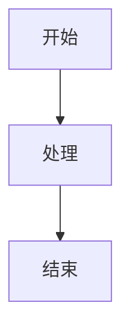

# Excalidraw Rendering Implementation Plan

> **For agentic workers:** REQUIRED SUB-SKILL: Use superpowers:subagent-driven-development (recommended) or superpowers:executing-plans to implement this plan task-by-task. Steps use checkbox (`- [ ]`) syntax for tracking.

**Goal:** 在 MD Viewer 中支持 Excalidraw 只读渲染，覆盖 Markdown 代码块、本地 `.excalidraw` 文件引用、预览、HTML/PDF/DOCX 导出和回归 fixture。

**Architecture:** 采用静态 SVG 渲染器，不挂载 Excalidraw 编辑器组件。renderer 进程负责解析 JSON、调用官方 `exportToSvg` 生成 SVG、渲染工具栏和导出 HTML；main 进程只提供受限的 `.excalidraw` 文件读取 IPC。导出链路通过 `markdownFilePath` 上下文保证相对路径解析一致。

**Tech Stack:** Electron、React、TypeScript、markdown-it、DOMPurify、Vitest、Playwright、`@excalidraw/excalidraw`。

---

## 文件边界

- 修改 `package.json`、`package-lock.json`：新增 `@excalidraw/excalidraw` 运行依赖。
- 修改 `src/renderer/src/utils/markdownRenderer.ts`：识别 `excalidraw` / `excalidraw-json`，补 DOMPurify class / data 属性白名单。
- 新建 `src/renderer/src/utils/excalidrawRenderer.ts`：解析、校验、限流、调用 `exportToSvg`、清理 SVG、返回结构化结果。
- 新建 `src/renderer/test/utils/excalidrawRenderer.test.ts`：覆盖合法、错误、空画布、大小限制、缺图 warning、对象参数调用。
- 修改 `src/main/ipc/fileHandlers.ts`：新增 `fs:readExcalidrawFile`。
- 修改 `src/preload/index.ts`、`src/preload/index.d.ts`：暴露 `readExcalidrawFile`。
- 新建 `src/main/__tests__/fileHandlers.excalidraw.test.ts`：覆盖扩展名、相对路径、越界、符号链接、目录、大小限制。
- 新建 `src/renderer/src/components/charts/useExcalidrawChart.ts`，修改 `src/renderer/src/components/charts/index.ts`、`src/renderer/src/components/VirtualizedMarkdown.tsx`：接入预览渲染、文件占位、工具栏、错误状态、复制。
- 修改 `src/renderer/src/assets/main.css`：补 `.excalidraw-*` 样式。
- 修改 `src/renderer/src/utils/exportHtml.ts`、`src/renderer/src/hooks/useExport.ts`、`src/renderer/src/hooks/useIPC.ts`：HTML/PDF 导出传入 `markdownFilePath` 并处理 Excalidraw。
- 修改 `src/renderer/src/utils/docxChartRenderer.ts`、`src/renderer/src/hooks/useExport.ts`：DOCX 图表管线支持 `excalidraw` 和 `.excalidraw` 文件引用。
- 新增 `e2e/fixtures/test-excalidraw.md` 与 `e2e/fixtures/excalidraw/*.excalidraw`：提供人工和自动化渲染用例。
- 新建或修改相关测试：`src/renderer/test/utils/markdownRenderer.test.ts`、`src/renderer/test/utils/exportHtml.responsive.test.ts`、`src/renderer/test/export-paths-consistency.test.ts`、`e2e/03-markdown-rendering.spec.ts`。

---

### Task 1: 依赖、Markdown 识别和安全白名单

**Files:**
- Modify: `package.json`
- Modify: `package-lock.json`
- Modify: `src/renderer/src/utils/markdownRenderer.ts`
- Modify: `src/renderer/test/utils/markdownRenderer.test.ts`

- [ ] **Step 1: 安装 Excalidraw 依赖**

Run:

```bash
npm install @excalidraw/excalidraw
```

Expected: `package.json` 的 `dependencies` 出现 `@excalidraw/excalidraw`，`package-lock.json` 更新。

- [ ] **Step 2: 写 Markdown 语言识别失败测试**

在 `src/renderer/test/utils/markdownRenderer.test.ts` 增加：

```ts
it('把 excalidraw 代码块输出为 language-excalidraw', () => {
  const md = createMarkdownRenderer()
  const html = md.render('```excalidraw\n{"type":"excalidraw","elements":[]}\n```')
  expect(html).toContain('pre class="language-excalidraw"')
  expect(html).toContain('code class="language-excalidraw"')
})

it('把 excalidraw-json 代码块归一为 language-excalidraw', () => {
  const md = createMarkdownRenderer()
  const html = md.render('```excalidraw-json\n{"type":"excalidraw","elements":[]}\n```')
  expect(html).toContain('pre class="language-excalidraw"')
  expect(html).not.toContain('language-excalidraw-json')
})
```

- [ ] **Step 3: 运行测试确认失败**

Run:

```bash
npm test -- src/renderer/test/utils/markdownRenderer.test.ts --run
```

Expected: 新增两个测试失败，原因是 `language-excalidraw` 未输出。

- [ ] **Step 4: 实现 Markdown 语言识别和 DOMPurify 白名单**

在 `createMarkdownRenderer()` 的 `highlight` 中，放在 Graphviz / DrawIO 分支附近：

```ts
if (lang === 'excalidraw' || lang === 'excalidraw-json') {
  return `<pre class="language-excalidraw"><code class="language-excalidraw">${md.utils.escapeHtml(str)}</code></pre>`
}
```

在 `DOMPURIFY_CONFIG.ALLOWED_ATTR` 增加：

```ts
'data-excalidraw-code',
'data-excalidraw-src',
'data-excalidraw-alt',
'data-excalidraw-source-kind',
'data-excalidraw-source-label',
```

在 `setupDOMPurifyHooks()` 的 `ALLOWED_CLASSES` 增加：

```ts
'language-excalidraw',
'excalidraw-wrapper',
'excalidraw-toggle-bar',
'excalidraw-action-btn',
'excalidraw-container',
'excalidraw-code-view',
'excalidraw-back-btn',
'excalidraw-error',
'excalidraw-warning',
'excalidraw-loading',
'excalidraw-empty',
'excalidraw-file-placeholder',
```

- [ ] **Step 5: 运行测试确认通过并提交**

Run:

```bash
npm test -- src/renderer/test/utils/markdownRenderer.test.ts --run
npm run typecheck
```

Expected: 测试通过，类型检查通过。

Commit:

```bash
git add package.json package-lock.json src/renderer/src/utils/markdownRenderer.ts src/renderer/test/utils/markdownRenderer.test.ts
git commit -m "feat: recognize excalidraw markdown blocks"
```

---

### Task 2: Excalidraw 静态 SVG 渲染器

**Files:**
- Create: `src/renderer/src/utils/excalidrawRenderer.ts`
- Create: `src/renderer/test/utils/excalidrawRenderer.test.ts`

- [ ] **Step 1: 写渲染器测试骨架**

Create `src/renderer/test/utils/excalidrawRenderer.test.ts`:

```ts
import { describe, expect, it, vi } from 'vitest'
import {
  EXCALIDRAW_LIMITS,
  renderExcalidrawToSvg,
  validateExcalidrawSource,
} from '../../src/utils/excalidrawRenderer'

vi.mock('@excalidraw/excalidraw', () => ({
  exportToSvg: vi.fn(async () => {
    const svg = document.createElementNS('http://www.w3.org/2000/svg', 'svg')
    svg.setAttribute('viewBox', '0 0 100 50')
    svg.innerHTML = '<rect width="100" height="50"></rect>'
    return svg
  }),
}))

describe('excalidrawRenderer', () => {
  it('合法 Excalidraw JSON 能生成 SVG', async () => {
    const result = await renderExcalidrawToSvg(JSON.stringify({
      type: 'excalidraw',
      elements: [{ id: 'r1', type: 'rectangle', x: 0, y: 0, width: 100, height: 50, version: 1, versionNonce: 1, isDeleted: false }],
      appState: {},
      files: {},
    }), { sourceKind: 'code-block' })

    expect(result.ok).toBe(true)
    if (result.ok) {
      expect(result.svg).toContain('<svg')
      expect(result.width).toBe(100)
      expect(result.height).toBe(50)
    }
  })

  it('非 JSON 返回明确错误', async () => {
    const result = await renderExcalidrawToSvg('{bad', { sourceKind: 'code-block' })
    expect(result.ok).toBe(false)
    if (!result.ok) expect(result.error).toContain('JSON')
  })

  it('缺少 elements 返回明确错误', () => {
    const validation = validateExcalidrawSource(JSON.stringify({ type: 'excalidraw' }))
    expect(validation.ok).toBe(false)
    if (!validation.ok) expect(validation.error).toContain('elements')
  })

  it('超过大小限制时拒绝渲染', () => {
    const oversized = 'x'.repeat(EXCALIDRAW_LIMITS.maxSourceBytes + 1)
    const validation = validateExcalidrawSource(oversized)
    expect(validation.ok).toBe(false)
    if (!validation.ok) expect(validation.error).toContain('1MB')
  })

  it('缺失图片文件时返回 warning 但不整体失败', async () => {
    const result = await renderExcalidrawToSvg(JSON.stringify({
      type: 'excalidraw',
      elements: [{ id: 'i1', type: 'image', fileId: 'missing', x: 0, y: 0, width: 10, height: 10, version: 1, versionNonce: 1, isDeleted: false }],
      files: {},
    }), { sourceKind: 'code-block' })
    expect(result.warnings.join('\n')).toContain('图片资源缺失')
  })
})
```

- [ ] **Step 2: 运行测试确认失败**

Run:

```bash
npm test -- src/renderer/test/utils/excalidrawRenderer.test.ts --run
```

Expected: 失败，原因是 `excalidrawRenderer.ts` 不存在。

- [ ] **Step 3: 实现渲染器**

Create `src/renderer/src/utils/excalidrawRenderer.ts`:

```ts
export const EXCALIDRAW_LIMITS = {
  maxSourceBytes: 1024 * 1024,
  maxElements: 2000,
  maxFilesBytes: 10 * 1024 * 1024,
}

export interface ExcalidrawRenderContext {
  sourceKind: 'code-block' | 'file-reference'
  sourceLabel?: string
  rawCode?: string
}

export type ExcalidrawRenderResult =
  | { ok: true; svg: string; width: number; height: number; warnings: string[]; sourceKind: 'code-block' | 'file-reference'; sourceLabel?: string; rawCode?: string }
  | { ok: false; error: string; warnings: string[]; sourceKind: 'code-block' | 'file-reference'; sourceLabel?: string; rawCode?: string }

type ValidationResult =
  | { ok: true; data: { type?: string; elements: any[]; appState?: Record<string, unknown>; files?: Record<string, any> }; warnings: string[] }
  | { ok: false; error: string; warnings: string[] }

function byteLength(value: string): number {
  return new TextEncoder().encode(value).length
}

function readSvgSize(svg: SVGSVGElement): { width: number; height: number } {
  const viewBox = svg.getAttribute('viewBox')
  if (viewBox) {
    const parts = viewBox.trim().split(/[\s,]+/).map(Number)
    if (parts.length === 4 && parts[2] > 0 && parts[3] > 0) {
      return { width: parts[2], height: parts[3] }
    }
  }
  return {
    width: Number.parseFloat(svg.getAttribute('width') || '') || 800,
    height: Number.parseFloat(svg.getAttribute('height') || '') || 600,
  }
}

function estimateFilesBytes(files: Record<string, any>): number {
  return Object.values(files).reduce((sum, file) => {
    const dataURL = typeof file?.dataURL === 'string' ? file.dataURL : ''
    return sum + byteLength(dataURL)
  }, 0)
}

function collectWarnings(elements: any[], files: Record<string, any>): string[] {
  const warnings: string[] = []
  const missing = elements.filter(el => el?.type === 'image' && el.fileId && !files[el.fileId]).length
  if (missing > 0) warnings.push(`有 ${missing} 个图片资源缺失，已渲染其余元素`)
  return warnings
}

export function validateExcalidrawSource(source: string): ValidationResult {
  if (byteLength(source) > EXCALIDRAW_LIMITS.maxSourceBytes) {
    return { ok: false, error: 'Excalidraw 内容超过 1MB，未渲染', warnings: [] }
  }

  let data: any
  try {
    data = JSON.parse(source)
  } catch {
    return { ok: false, error: 'Excalidraw JSON 格式错误', warnings: [] }
  }

  if (!data || typeof data !== 'object' || Array.isArray(data)) {
    return { ok: false, error: 'Excalidraw 内容必须是 JSON 对象', warnings: [] }
  }
  if (!Array.isArray(data.elements)) {
    return { ok: false, error: 'Excalidraw JSON 缺少 elements 数组', warnings: [] }
  }
  if (data.elements.length > EXCALIDRAW_LIMITS.maxElements) {
    return { ok: false, error: `Excalidraw 元素超过 ${EXCALIDRAW_LIMITS.maxElements} 个，未渲染`, warnings: [] }
  }

  const files = data.files && typeof data.files === 'object' ? data.files : {}
  if (estimateFilesBytes(files) > EXCALIDRAW_LIMITS.maxFilesBytes) {
    return { ok: false, error: 'Excalidraw 图片资源超过 10MB，未渲染', warnings: [] }
  }

  const warnings = collectWarnings(data.elements, files)
  if (data.type !== 'excalidraw') warnings.push('未声明 type: excalidraw，已按兼容模式渲染')

  return {
    ok: true,
    data: {
      type: data.type,
      elements: data.elements,
      appState: data.appState && typeof data.appState === 'object' ? data.appState : {},
      files,
    },
    warnings,
  }
}

export function sanitizeExcalidrawSvg(svg: SVGSVGElement): string {
  const cloned = svg.cloneNode(true) as SVGSVGElement
  cloned.querySelectorAll('foreignObject').forEach(el => el.remove())
  cloned.querySelectorAll('*').forEach(el => {
    for (const attr of Array.from(el.attributes)) {
      const name = attr.name.toLowerCase()
      const value = attr.value
      if (name.startsWith('on') || /^https?:\/\//i.test(value) || /^javascript:/i.test(value)) {
        el.removeAttribute(attr.name)
      }
    }
  })
  cloned.removeAttribute('width')
  cloned.removeAttribute('height')
  cloned.setAttribute('preserveAspectRatio', 'xMidYMid meet')
  cloned.setAttribute('style', 'max-width: 100%; height: auto; display: block; margin: 0 auto;')
  return new XMLSerializer().serializeToString(cloned)
}

export async function renderExcalidrawToSvg(source: string, context: ExcalidrawRenderContext): Promise<ExcalidrawRenderResult> {
  const validation = validateExcalidrawSource(source)
  if (!validation.ok) {
    return { ok: false, error: validation.error, warnings: validation.warnings, sourceKind: context.sourceKind, sourceLabel: context.sourceLabel, rawCode: context.rawCode ?? source }
  }

  try {
    const { exportToSvg } = await import('@excalidraw/excalidraw')
    const svg = await exportToSvg({
      elements: validation.data.elements as any,
      appState: validation.data.appState as any,
      files: validation.data.files as any,
      exportPadding: 16,
      renderEmbeddables: false,
      skipInliningFonts: true,
    })
    const size = readSvgSize(svg)
    return { ok: true, svg: sanitizeExcalidrawSvg(svg), width: size.width, height: size.height, warnings: validation.warnings, sourceKind: context.sourceKind, sourceLabel: context.sourceLabel, rawCode: context.rawCode ?? source }
  } catch (error) {
    return { ok: false, error: error instanceof Error ? error.message : 'Excalidraw 渲染失败', warnings: validation.warnings, sourceKind: context.sourceKind, sourceLabel: context.sourceLabel, rawCode: context.rawCode ?? source }
  }
}
```

- [ ] **Step 4: 运行测试并提交**

Run:

```bash
npm test -- src/renderer/test/utils/excalidrawRenderer.test.ts --run
npm run typecheck
```

Expected: 测试通过，类型检查通过。

Commit:

```bash
git add src/renderer/src/utils/excalidrawRenderer.ts src/renderer/test/utils/excalidrawRenderer.test.ts
git commit -m "feat: add excalidraw svg renderer"
```

---

### Task 3: 专用 `.excalidraw` 文件读取 IPC

**Files:**
- Modify: `src/main/ipc/fileHandlers.ts`
- Modify: `src/preload/index.ts`
- Modify: `src/preload/index.d.ts`
- Create: `src/main/__tests__/fileHandlers.excalidraw.test.ts`

- [ ] **Step 1: 写 IPC 测试**

Create `src/main/__tests__/fileHandlers.excalidraw.test.ts`:

```ts
import { beforeEach, describe, expect, it, vi } from 'vitest'
import { ipcMain } from 'electron'
import * as fs from 'fs-extra'
import { registerFileHandlers } from '../ipc/fileHandlers'
import { resetSecurity, setAllowedBasePath } from '../security'

vi.mock('electron', () => ({
  ipcMain: { handle: vi.fn() },
  BrowserWindow: { getAllWindows: vi.fn(() => []) },
  dialog: { showOpenDialog: vi.fn() },
}))

vi.mock('chokidar', () => ({ default: { watch: vi.fn(() => ({ on: vi.fn().mockReturnThis(), close: vi.fn(), getWatched: vi.fn(() => ({})) })) } }))

vi.mock('fs-extra', async () => {
  const actual = await vi.importActual<typeof import('fs-extra')>('fs-extra')
  return { ...actual, stat: vi.fn(), readFile: vi.fn(), realpath: vi.fn() }
})

const ctx = { store: { set: vi.fn() }, folderHistoryManager: { addFolder: vi.fn() } }

function handler<T extends (...args: any[]) => any>(channel: string): T {
  const found = vi.mocked(ipcMain.handle).mock.calls.find(([name]) => name === channel)
  if (!found) throw new Error(`Missing handler: ${channel}`)
  return found[1] as T
}

describe('fs:readExcalidrawFile', () => {
  beforeEach(() => {
    vi.clearAllMocks()
    resetSecurity()
    setAllowedBasePath('/docs')
    registerFileHandlers(ctx as any)
  })

  it('基于 Markdown 文件目录读取相对 .excalidraw 文件', async () => {
    vi.mocked(fs.realpath as any).mockResolvedValue('/docs/diagrams/a.excalidraw')
    vi.mocked(fs.stat as any).mockResolvedValue({ isFile: () => true, size: 20 })
    vi.mocked(fs.readFile as any).mockResolvedValue('{"type":"excalidraw","elements":[]}')

    const read = handler<(event: any, payload: { markdownFilePath: string; refPath: string }) => Promise<any>>('fs:readExcalidrawFile')
    await expect(read({}, { markdownFilePath: '/docs/page.md', refPath: './diagrams/a.excalidraw' })).resolves.toEqual({
      content: '{"type":"excalidraw","elements":[]}',
      resolvedPath: '/docs/diagrams/a.excalidraw',
    })
  })

  it('拒绝非 .excalidraw 扩展名', async () => {
    const read = handler<(event: any, payload: { markdownFilePath: string; refPath: string }) => Promise<any>>('fs:readExcalidrawFile')
    await expect(read({}, { markdownFilePath: '/docs/page.md', refPath: './a.json' })).rejects.toThrow('.excalidraw')
  })

  it('拒绝 URL 引用', async () => {
    const read = handler<(event: any, payload: { markdownFilePath: string; refPath: string }) => Promise<any>>('fs:readExcalidrawFile')
    await expect(read({}, { markdownFilePath: '/docs/page.md', refPath: 'https://example.com/a.excalidraw' })).rejects.toThrow('URL')
  })

  it('拒绝 realpath 后逃逸 allowedBasePath 的符号链接', async () => {
    vi.mocked(fs.realpath as any).mockResolvedValue('/tmp/outside.excalidraw')
    const read = handler<(event: any, payload: { markdownFilePath: string; refPath: string }) => Promise<any>>('fs:readExcalidrawFile')
    await expect(read({}, { markdownFilePath: '/docs/page.md', refPath: './link.excalidraw' })).rejects.toThrow('安全错误')
  })

  it('拒绝目录和超过 1MB 的文件', async () => {
    vi.mocked(fs.realpath as any).mockResolvedValue('/docs/a.excalidraw')
    vi.mocked(fs.stat as any).mockResolvedValue({ isFile: () => false, size: 0 })
    const read = handler<(event: any, payload: { markdownFilePath: string; refPath: string }) => Promise<any>>('fs:readExcalidrawFile')
    await expect(read({}, { markdownFilePath: '/docs/page.md', refPath: './a.excalidraw' })).rejects.toThrow('普通文件')

    vi.mocked(fs.stat as any).mockResolvedValue({ isFile: () => true, size: 1024 * 1024 + 1 })
    await expect(read({}, { markdownFilePath: '/docs/page.md', refPath: './a.excalidraw' })).rejects.toThrow('1MB')
  })
})
```

- [ ] **Step 2: 运行测试确认失败**

Run:

```bash
npm test -- src/main/__tests__/fileHandlers.excalidraw.test.ts --run
```

Expected: 失败，原因是 `fs:readExcalidrawFile` handler 不存在。

- [ ] **Step 3: 实现 IPC**

在 `src/main/ipc/fileHandlers.ts` 的 `fs:readFile` 后增加：

```ts
ipcMain.handle('fs:readExcalidrawFile', async (_, payload: { markdownFilePath: string; refPath: string }) => {
  const markdownFilePath = payload?.markdownFilePath
  const refPath = payload?.refPath
  if (!markdownFilePath || !refPath) throw new Error('缺少 Excalidraw 文件读取参数')
  if (/^[a-z][a-z0-9+.-]*:\/\//i.test(refPath)) throw new Error('不支持 URL 形式的 .excalidraw 文件')

  validateSecurePath(markdownFilePath)

  const markdownDir = path.dirname(markdownFilePath)
  const candidatePath = path.isAbsolute(refPath)
    ? path.resolve(refPath)
    : path.resolve(markdownDir, refPath)

  if (path.extname(candidatePath).toLowerCase() !== '.excalidraw') {
    throw new Error('只能读取 .excalidraw 文件')
  }

  const resolvedPath = await fs.realpath(candidatePath)
  validateSecurePath(resolvedPath)

  const stats = await fs.stat(resolvedPath)
  if (!stats.isFile()) throw new Error('目标不是普通文件')
  if (stats.size > 1024 * 1024) throw new Error('Excalidraw 文件超过 1MB，未读取')

  return {
    content: await fs.readFile(resolvedPath, 'utf-8'),
    resolvedPath,
  }
})
```

在 `src/preload/index.ts` 的文件系统 API 区增加：

```ts
readExcalidrawFile: (payload: { markdownFilePath: string; refPath: string }) =>
  ipcRenderer.invoke('fs:readExcalidrawFile', payload) as Promise<{ content: string; resolvedPath: string }>,
```

在 `src/preload/index.d.ts` 的 `Window.api` 增加：

```ts
readExcalidrawFile: (payload: { markdownFilePath: string; refPath: string }) => Promise<{ content: string; resolvedPath: string }>
```

- [ ] **Step 4: 运行测试并提交**

Run:

```bash
npm test -- src/main/__tests__/fileHandlers.excalidraw.test.ts --run
npm run typecheck
```

Expected: 测试通过，类型检查通过。

Commit:

```bash
git add src/main/ipc/fileHandlers.ts src/preload/index.ts src/preload/index.d.ts src/main/__tests__/fileHandlers.excalidraw.test.ts
git commit -m "feat: add secure excalidraw file ipc"
```

---

### Task 4: 预览渲染 Hook、文件占位和复制集成

**Files:**
- Create: `src/renderer/src/components/charts/useExcalidrawChart.ts`
- Modify: `src/renderer/src/components/charts/index.ts`
- Modify: `src/renderer/src/components/VirtualizedMarkdown.tsx`
- Modify: `src/renderer/src/assets/main.css`
- Modify: `src/renderer/test/components/VirtualizedMarkdown.test.tsx`

- [ ] **Step 1: 写预览测试**

在 `src/renderer/test/components/VirtualizedMarkdown.test.tsx` 增加两个测试：

```tsx
it('把 .excalidraw 图片引用替换为文件占位而不是 local-image', async () => {
  render(<VirtualizedMarkdown content={''} filePath="/docs/a.md" renderDebounceMs={0} />)
  await waitFor(() => {
    expect(document.querySelector('.excalidraw-file-placeholder')).toBeTruthy()
  })
  expect(document.querySelector('img[src^="local-image://"]')).toBeFalsy()
})

it('复制按钮能识别 Excalidraw 代码视图', async () => {
  const wrapper = document.createElement('div')
  wrapper.className = 'excalidraw-wrapper'
  wrapper.dataset.excalidrawCode = btoa(unescape(encodeURIComponent('{"type":"excalidraw","elements":[]}')))
  wrapper.innerHTML = '<div class="excalidraw-code-view"><button class="copy-btn">复制</button></div>'
  document.body.appendChild(wrapper)
  expect(wrapper.dataset.excalidrawCode).toBeTruthy()
  wrapper.remove()
})
```

- [ ] **Step 2: 实现文件占位和 Hook 接入**

在 `VirtualizedMarkdown.tsx` 导入列表增加：

```ts
useExcalidrawChart,
```

在本地图片路径转换 effect 中，普通图片转换前增加：

```ts
if (/\.excalidraw(?:[?#].*)?$/i.test(src)) {
  const placeholder = document.createElement('div')
  placeholder.className = 'excalidraw-file-placeholder'
  placeholder.dataset.excalidrawSrc = src
  placeholder.dataset.excalidrawAlt = img.getAttribute('alt') || ''
  img.replaceWith(placeholder)
  return
}
```

在图表 hook 调用区增加：

```ts
useExcalidrawChart(combinedRef, html, { markdownFilePath: filePath })
```

在复制按钮分支中，在 PlantUML 分支前加入：

```ts
} else if (target.closest('.excalidraw-code-view')) {
  const wrapper = target.closest('.excalidraw-wrapper')
  const base64Code = wrapper?.getAttribute('data-excalidraw-code')
  if (base64Code) {
    try {
      textToCopy = decodeURIComponent(escape(atob(base64Code)))
    } catch {
      textToCopy = ''
    }
  }
```

在普通复制按钮排除选择器中增加：

```ts
:not(.language-excalidraw)
```

并在 `pre.closest` 排除列表增加：

```ts
pre.closest('.excalidraw-code-view')
```

- [ ] **Step 3: 实现 `useExcalidrawChart`**

Create `src/renderer/src/components/charts/useExcalidrawChart.ts`:

```ts
import { useEffect } from 'react'
import { downloadSvgAsPng } from '../../utils/chartUtils'
import { renderExcalidrawToSvg } from '../../utils/excalidrawRenderer'

interface UseExcalidrawChartOptions {
  markdownFilePath?: string
}

let excalidrawQueue: Promise<void> = Promise.resolve()

function queueExcalidrawRender<T>(task: () => Promise<T>): Promise<T> {
  const run = excalidrawQueue.then(task, task)
  excalidrawQueue = run.then(() => undefined, () => undefined)
  return run
}

function encodeCode(code: string): string {
  return btoa(unescape(encodeURIComponent(code)))
}

function createErrorBlock(message: string, rawCode: string, sourceLabel?: string): HTMLDivElement {
  const wrapper = document.createElement('div')
  wrapper.className = 'excalidraw-wrapper'
  wrapper.dataset.excalidrawCode = encodeCode(rawCode)
  wrapper.dataset.excalidrawSourceLabel = sourceLabel || ''
  wrapper.innerHTML = `
    <div class="excalidraw-error" role="alert">
      <div class="error-title">Excalidraw 渲染失败</div>
      <div class="error-message"></div>
      <button class="excalidraw-action-btn no-export" data-action="toggleCode" aria-label="查看 Excalidraw 源码">查看源码</button>
    </div>
    <div class="excalidraw-code-view" data-view="code" style="display:none">
      <button class="excalidraw-back-btn no-export">图表</button>
      <button class="copy-btn no-export">复制</button>
      <pre class="language-json"><code></code></pre>
    </div>
  `
  wrapper.querySelector('.error-message')!.textContent = sourceLabel ? `${sourceLabel}: ${message}` : message
  wrapper.querySelector('code')!.textContent = rawCode
  return wrapper
}

function createWrapper(svg: string, rawCode: string, warnings: string[], label: string): HTMLDivElement {
  const wrapper = document.createElement('div')
  wrapper.className = 'excalidraw-wrapper'
  wrapper.dataset.excalidrawCode = encodeCode(rawCode)
  wrapper.innerHTML = `
    <div class="excalidraw-warning" role="status" ${warnings.length ? '' : 'hidden'}></div>
    <div class="excalidraw-toggle-bar no-export" role="toolbar" aria-label="Excalidraw 图表工具栏">
      <button class="excalidraw-action-btn" data-action="toggleCode" title="查看代码" aria-label="查看 Excalidraw 源码">💻</button>
      <button class="excalidraw-action-btn" data-action="zoomIn" title="放大" aria-label="放大 Excalidraw 图表">🔍+</button>
      <button class="excalidraw-action-btn" data-action="zoomOut" title="缩小" aria-label="缩小 Excalidraw 图表">🔍−</button>
      <button class="excalidraw-action-btn" data-action="fit" title="适应大小" aria-label="适应 Excalidraw 图表大小">⊡</button>
      <button class="excalidraw-action-btn" data-action="download" title="下载图片" aria-label="下载 Excalidraw 图片">💾</button>
      <button class="excalidraw-action-btn" data-action="fullscreen" title="全屏查看" aria-label="全屏查看 Excalidraw 图表">⛶</button>
    </div>
    <div class="excalidraw-container" data-view="chart">${svg}</div>
    <div class="excalidraw-code-view" data-view="code" style="display:none">
      <button class="excalidraw-back-btn no-export">图表</button>
      <button class="copy-btn no-export">复制</button>
      <pre class="language-json"><code></code></pre>
    </div>
  `
  wrapper.querySelector('.excalidraw-warning')!.textContent = warnings.join('；')
  const svgEl = wrapper.querySelector('svg')
  svgEl?.setAttribute('role', 'img')
  svgEl?.setAttribute('aria-label', label || 'Excalidraw 图表')
  wrapper.querySelector('code')!.textContent = rawCode
  return wrapper
}

export function useExcalidrawChart(ref: React.RefObject<HTMLElement>, html: string, options: UseExcalidrawChartOptions = {}): void {
  useEffect(() => {
    if (!ref.current) return
    const blocks = Array.from(ref.current.querySelectorAll('pre.language-excalidraw, .excalidraw-file-placeholder'))
    if (blocks.length === 0) return
    const abortController = new AbortController()

    ;(async () => {
      for (const block of blocks.slice(0, 20)) {
        if (abortController.signal.aborted) break
        let rawCode = ''
        let label = 'Excalidraw 图表'
        try {
          if (block.classList.contains('excalidraw-file-placeholder')) {
            const refPath = (block as HTMLElement).dataset.excalidrawSrc || ''
            label = (block as HTMLElement).dataset.excalidrawAlt || refPath
            if (!options.markdownFilePath) throw new Error('缺少 Markdown 文件路径，无法读取 Excalidraw 文件引用')
            const file = await window.api.readExcalidrawFile({ markdownFilePath: options.markdownFilePath, refPath })
            rawCode = file.content
          } else {
            rawCode = block.textContent || ''
          }
          const result = await queueExcalidrawRender(() => renderExcalidrawToSvg(rawCode, { sourceKind: block.classList.contains('excalidraw-file-placeholder') ? 'file-reference' : 'code-block', sourceLabel: label }))
          if (abortController.signal.aborted) break
          block.replaceWith(result.ok ? createWrapper(result.svg, rawCode, result.warnings, label) : createErrorBlock(result.error, rawCode, label))
        } catch (error) {
          block.replaceWith(createErrorBlock(error instanceof Error ? error.message : 'Excalidraw 渲染失败', rawCode, label))
        }
      }
    })()

    return () => abortController.abort()
  }, [html, options.markdownFilePath])

  useEffect(() => {
    if (!ref.current) return
    const onClick = (e: MouseEvent) => {
      const target = e.target as HTMLElement
      const backBtn = target.closest('.excalidraw-back-btn')
      if (backBtn) {
        const wrapper = backBtn.closest('.excalidraw-wrapper') as HTMLElement
        ;(wrapper.querySelector('[data-view="chart"]') as HTMLElement).style.display = ''
        ;(wrapper.querySelector('[data-view="code"]') as HTMLElement).style.display = 'none'
        const bar = wrapper.querySelector('.excalidraw-toggle-bar') as HTMLElement | null
        if (bar) bar.style.display = ''
        return
      }
      const actionBtn = target.closest('.excalidraw-action-btn')
      if (!actionBtn) return
      const action = actionBtn.getAttribute('data-action')
      const wrapper = actionBtn.closest('.excalidraw-wrapper') as HTMLElement
      const container = wrapper?.querySelector('.excalidraw-container') as HTMLElement | null
      if (action === 'toggleCode') {
        const chart = wrapper.querySelector('[data-view="chart"]') as HTMLElement | null
        const code = wrapper.querySelector('[data-view="code"]') as HTMLElement | null
        if (chart) chart.style.display = 'none'
        if (code) code.style.display = ''
        const bar = wrapper.querySelector('.excalidraw-toggle-bar') as HTMLElement | null
        if (bar) bar.style.display = 'none'
        return
      }
      const svg = container?.querySelector('svg') as SVGSVGElement | null
      if (!svg && action !== 'fullscreen') return
      const level = Number(container?.dataset.zoomLevel || '100')
      if (action === 'zoomIn' && container) container.style.width = `${Math.min(level + 20, 300)}%`
      if (action === 'zoomOut' && container) container.style.width = `${Math.max(level - 20, 30)}%`
      if (action === 'fit' && container) container.style.width = '100%'
      if ((action === 'zoomIn' || action === 'zoomOut') && container) container.dataset.zoomLevel = String(action === 'zoomIn' ? Math.min(level + 20, 300) : Math.max(level - 20, 30))
      if (action === 'download' && svg) downloadSvgAsPng(svg, `excalidraw-${Date.now()}`)
      if (action === 'fullscreen') document.fullscreenElement ? document.exitFullscreen?.() : wrapper.requestFullscreen?.()
    }
    ref.current.addEventListener('click', onClick)
    return () => ref.current?.removeEventListener('click', onClick)
  }, [html])
}
```

在 `src/renderer/src/components/charts/index.ts` 导出：

```ts
export { useExcalidrawChart } from './useExcalidrawChart'
```

- [ ] **Step 4: 加样式**

在 `src/renderer/src/assets/main.css` 的图表样式区增加 `.excalidraw-*`，并把通用 hover/focus/fullscreen 选择器补上 `excalidraw`：

```css
.excalidraw-wrapper {
  position: relative;
  margin: 1.5em 0;
  overflow-x: auto;
}

.excalidraw-container {
  width: 100%;
  min-height: 120px;
  text-align: center;
}

.excalidraw-container svg {
  max-width: 100%;
  height: auto;
}

.excalidraw-warning {
  margin-bottom: 8px;
  padding: 8px 10px;
  border: 1px solid #facc15;
  border-radius: 6px;
  color: #854d0e;
  background: #fef9c3;
}

.excalidraw-error,
.excalidraw-empty,
.excalidraw-loading {
  padding: 12px;
  border: 1px dashed #d1d5db;
  border-radius: 6px;
  color: #6b7280;
  background: #f9fafb;
}

.excalidraw-toggle-bar {
  position: absolute;
  top: 8px;
  right: 8px;
  z-index: 5;
  display: none;
  gap: 4px;
}

.excalidraw-wrapper:hover .excalidraw-toggle-bar,
.excalidraw-wrapper:focus-within .excalidraw-toggle-bar {
  display: flex;
}

.excalidraw-action-btn,
.excalidraw-back-btn {
  border: 1px solid var(--border-color);
  border-radius: 4px;
  background: var(--bg-primary);
  color: var(--text-primary);
  cursor: pointer;
}

.excalidraw-code-view {
  position: relative;
}
```

- [ ] **Step 5: 运行测试并提交**

Run:

```bash
npm test -- src/renderer/test/components/VirtualizedMarkdown.test.tsx --run
npm run typecheck
```

Expected: 测试通过，类型检查通过。

Commit:

```bash
git add src/renderer/src/components/charts/useExcalidrawChart.ts src/renderer/src/components/charts/index.ts src/renderer/src/components/VirtualizedMarkdown.tsx src/renderer/src/assets/main.css src/renderer/test/components/VirtualizedMarkdown.test.tsx
git commit -m "feat: render excalidraw in preview"
```

---

### Task 5: HTML/PDF 导出支持

**Files:**
- Modify: `src/renderer/src/utils/exportHtml.ts`
- Modify: `src/renderer/src/hooks/useExport.ts`
- Modify: `src/renderer/src/hooks/useIPC.ts`
- Modify: `src/renderer/test/utils/exportHtml.responsive.test.ts`
- Modify: `src/renderer/test/export-paths-consistency.test.ts`

- [ ] **Step 1: 写导出上下文测试**

在 `src/renderer/test/utils/exportHtml.responsive.test.ts` 增加：

```ts
it('HTML 导出渲染 excalidraw 代码块为容器 SVG', async () => {
  const out = await buildExportHtmlContent('```excalidraw\n{"type":"excalidraw","elements":[]}\n```')
  expect(out).toContain('excalidraw-container')
  expect(out).toContain('<svg')
})

it('缺少 markdownFilePath 时 .excalidraw 文件引用导出为可见错误', async () => {
  const out = await buildExportHtmlContent('')
  expect(out).toContain('Excalidraw 渲染失败')
  expect(out).toContain('./a.excalidraw')
})
```

- [ ] **Step 2: 改导出函数签名和调用点**

在 `exportHtml.ts` 增加：

```ts
export interface ExportHtmlOptions {
  markdownFilePath?: string
}
```

把签名改为：

```ts
export async function buildExportHtmlContent(markdown: string, options: ExportHtmlOptions = {}): Promise<string> {
```

在 `useExport.ts` 两处 HTML/PDF 调用改为：

```ts
const htmlContent = await buildExportHtmlContent(exportContent, { markdownFilePath: exportTab.file.path })
```

在 `useIPC.ts` 文件树右键导出调用改为：

```ts
const htmlContent = await buildExportHtmlContent(content, { markdownFilePath: data.path })
```

- [ ] **Step 3: 实现 `processExcalidrawInHtml`**

在 `exportHtml.ts` 导入：

```ts
import { renderExcalidrawToSvg } from './excalidrawRenderer'
```

加入函数：

```ts
async function readExcalidrawForExport(markdownFilePath: string | undefined, refPath: string): Promise<string> {
  if (!markdownFilePath) throw new Error('缺少 Markdown 文件路径，无法导出 Excalidraw 文件引用')
  if (!window.api?.readExcalidrawFile) throw new Error('当前环境不支持读取 Excalidraw 文件')
  const result = await window.api.readExcalidrawFile({ markdownFilePath, refPath })
  return result.content
}

function excalidrawErrorHtml(message: string, label: string): string {
  const safeMessage = message.replace(/[&<>"']/g, c => ({ '&': '&amp;', '<': '&lt;', '>': '&gt;', '"': '&quot;', "'": '&#39;' }[c] || c))
  const safeLabel = label.replace(/[&<>"']/g, c => ({ '&': '&amp;', '<': '&lt;', '>': '&gt;', '"': '&quot;', "'": '&#39;' }[c] || c))
  return `<div class="excalidraw-error" role="alert"><div class="error-title">Excalidraw 渲染失败</div><div class="error-message">${safeLabel}: ${safeMessage}</div></div>`
}

export async function processExcalidrawInHtml(html: string, options: ExportHtmlOptions = {}): Promise<string> {
  const parser = new DOMParser()
  const doc = parser.parseFromString(`<div id="root">${html}</div>`, 'text/html')
  const root = doc.getElementById('root')!

  const blocks = Array.from(root.querySelectorAll('pre.language-excalidraw'))
  for (const block of blocks) {
    const code = block.textContent || ''
    const result = await renderExcalidrawToSvg(code, { sourceKind: 'code-block' })
    const holder = doc.createElement('div')
    holder.className = result.ok ? 'excalidraw-container' : 'excalidraw-error'
    holder.setAttribute('style', 'width:100%; text-align:center; margin:1.5em 0;')
    holder.innerHTML = result.ok ? result.svg : excalidrawErrorHtml(result.error, '代码块')
    block.replaceWith(holder)
  }

  const imgs = Array.from(root.querySelectorAll('img')).filter(img => /\.excalidraw(?:[?#].*)?$/i.test(img.getAttribute('src') || ''))
  for (const img of imgs) {
    const src = img.getAttribute('src') || ''
    const alt = img.getAttribute('alt') || src
    const holder = doc.createElement('div')
    holder.className = 'excalidraw-container'
    holder.setAttribute('style', 'width:100%; text-align:center; margin:1.5em 0;')
    try {
      const code = await readExcalidrawForExport(options.markdownFilePath, src)
      const result = await renderExcalidrawToSvg(code, { sourceKind: 'file-reference', sourceLabel: alt })
      holder.innerHTML = result.ok ? result.svg : excalidrawErrorHtml(result.error, src)
    } catch (error) {
      holder.innerHTML = excalidrawErrorHtml(error instanceof Error ? error.message : '读取失败', src)
    }
    img.replaceWith(holder)
  }

  return root.innerHTML
}
```

在 `buildExportHtmlContent()` 的 Graphviz 后或 DrawIO 前加入：

```ts
html = await processExcalidrawInHtml(html, options)
```

在 `makeSvgsResponsiveInContainers()` 列表增加：

```ts
'excalidraw-container',
```

- [ ] **Step 4: 运行测试并提交**

Run:

```bash
npm test -- src/renderer/test/utils/exportHtml.responsive.test.ts src/renderer/test/export-paths-consistency.test.ts --run
npm run typecheck
```

Expected: 测试通过，类型检查通过。

Commit:

```bash
git add src/renderer/src/utils/exportHtml.ts src/renderer/src/hooks/useExport.ts src/renderer/src/hooks/useIPC.ts src/renderer/test/utils/exportHtml.responsive.test.ts src/renderer/test/export-paths-consistency.test.ts
git commit -m "feat: export excalidraw to html and pdf"
```

---

### Task 6: DOCX 图表管线支持

**Files:**
- Modify: `src/renderer/src/utils/docxChartRenderer.ts`
- Modify: `src/renderer/src/hooks/useExport.ts`
- Modify: `src/renderer/test/utils/docxChartRenderer.safe-padding.test.ts`

- [ ] **Step 1: 写 DOCX 识别测试**

在 `src/renderer/test/utils/docxChartRenderer.safe-padding.test.ts` 增加：

```ts
it('DOCX 图表管线识别 excalidraw 代码块并生成占位图片', async () => {
  const result = await renderChartsForDocx('```excalidraw\n{"type":"excalidraw","elements":[]}\n```')
  expect(result.modifiedMarkdown).toMatch(/!\[\]\(mdv__chart__/)
  expect(result.images.length).toBe(1)
})

it('DOCX 文件引用缺少 markdownFilePath 时产生 warning', async () => {
  const result = await renderChartsForDocx('')
  expect(result.warnings.join('\n')).toContain('markdownFilePath')
})
```

- [ ] **Step 2: 扩展类型、语言集合和签名**

在 `docxChartRenderer.ts` 中修改：

```ts
type ChartType = 'echarts' | 'mermaid' | 'dot' | 'graphviz' | 'markmap' | 'plantuml' | 'drawio' | 'excalidraw'

export interface DocxChartRenderOptions {
  markdownFilePath?: string
  onProgress?: (current: number, total: number, type: string) => void
}
```

把 `CHART_LANGS` 增加：

```ts
'excalidraw', 'excalidraw-json',
```

把 `CONTAINER_CLASS_MAP` 增加：

```ts
excalidraw: 'excalidraw-container',
```

把函数签名改为：

```ts
export async function renderChartsForDocx(
  markdown: string,
  optionsOrProgress?: DocxChartRenderOptions | ((current: number, total: number, type: string) => void)
): Promise<ChartRenderResult> {
  const options: DocxChartRenderOptions = typeof optionsOrProgress === 'function'
    ? { onProgress: optionsOrProgress }
    : optionsOrProgress || {}
```

- [ ] **Step 3: 接入 Excalidraw 渲染分支和文件引用扫描**

在 `renderChartCodeToPng()` 的 switch 增加：

```ts
case 'excalidraw': {
  const { renderExcalidrawToSvg } = await import('./excalidrawRenderer')
  const result = await renderExcalidrawToSvg(code, { sourceKind: 'code-block' })
  svgString = result.ok ? result.svg : null
  break
}
```

把 `excalidraw-json` 归一为 `excalidraw`：

```ts
const key = block.lang === 'graphviz' ? 'dot' : block.lang === 'excalidraw-json' ? 'excalidraw' : block.lang
```

在代码块处理后扫描图片引用：

```ts
const imageRefRe = /!\[([^\]]*)\]\(([^)]+\.excalidraw)\)/gi
let imageMatch: RegExpExecArray | null
while ((imageMatch = imageRefRe.exec(markdown)) !== null) {
  const [, alt, refPath] = imageMatch
  if (!options.markdownFilePath) {
    warnings.push(`excalidraw file reference ${refPath} missing markdownFilePath`)
    continue
  }
  try {
    const file = await window.api.readExcalidrawFile({ markdownFilePath: options.markdownFilePath, refPath })
    const png = await renderChartCodeToPng('excalidraw', file.content, images.length, 0)
    if (!png) {
      warnings.push(`excalidraw file reference ${refPath} render failed`)
      continue
    }
    const placeholderId = generatePlaceholderId()
    images.push({ id: placeholderId, pngBase64: png.pngBase64, widthCm: 15.5 })
    modifiedMarkdown = modifiedMarkdown.replace(imageMatch[0], ``)
  } catch (error) {
    warnings.push(`excalidraw file reference ${refPath} failed: ${error instanceof Error ? error.message : String(error)}`)
  }
}
```

在 `svgToPngBase64()` 中限制最大输出像素：

```ts
const maxPixels = 8_000_000
if (canvasW * canvasH > maxPixels) {
  throw new Error('DOCX Excalidraw 图片超过最大像素限制')
}
```

- [ ] **Step 4: 修改调用点**

在 `useExport.ts` 远程 DOCX 分支中把调用改为：

```ts
const chartResult = await renderChartsForDocx(exportContent, {
  markdownFilePath: exportTab.file.path,
  onProgress: (current, total, type) => {
    if (cancelledRef.current) return
    useExportTaskStore.getState().updateChartProgress(current, total, type)
  },
})
```

- [ ] **Step 5: 运行测试并提交**

Run:

```bash
npm test -- src/renderer/test/utils/docxChartRenderer.safe-padding.test.ts --run
npm run typecheck
```

Expected: 测试通过，类型检查通过。

Commit:

```bash
git add src/renderer/src/utils/docxChartRenderer.ts src/renderer/src/hooks/useExport.ts src/renderer/test/utils/docxChartRenderer.safe-padding.test.ts
git commit -m "feat: export excalidraw charts to docx"
```

---

### Task 7: Excalidraw fixture 和 E2E 覆盖

**Files:**
- Create: `e2e/fixtures/test-excalidraw.md`
- Create: `e2e/fixtures/excalidraw/basic-flow.excalidraw`
- Create: `e2e/fixtures/excalidraw/embedded-image.excalidraw`
- Create: `e2e/fixtures/excalidraw/empty.excalidraw`
- Create: `e2e/fixtures/excalidraw/invalid-json.excalidraw`
- Modify: `e2e/03-markdown-rendering.spec.ts`

- [ ] **Step 1: 新增 fixture**

Create `e2e/fixtures/excalidraw/basic-flow.excalidraw`:

```json
{
  "type": "excalidraw",
  "version": 2,
  "source": "md-viewer-fixture",
  "elements": [
    { "id": "start", "type": "rectangle", "x": 0, "y": 0, "width": 120, "height": 56, "angle": 0, "strokeColor": "#1e1e1e", "backgroundColor": "#d5e8d4", "fillStyle": "solid", "strokeWidth": 2, "strokeStyle": "solid", "roughness": 1, "opacity": 100, "groupIds": [], "frameId": null, "roundness": { "type": 3 }, "seed": 1, "version": 1, "versionNonce": 1, "isDeleted": false, "boundElements": null, "updated": 1, "link": null, "locked": false },
    { "id": "label", "type": "text", "x": 25, "y": 18, "width": 70, "height": 20, "angle": 0, "strokeColor": "#1e1e1e", "backgroundColor": "transparent", "fillStyle": "solid", "strokeWidth": 1, "strokeStyle": "solid", "roughness": 1, "opacity": 100, "groupIds": [], "frameId": null, "roundness": null, "seed": 2, "version": 1, "versionNonce": 2, "isDeleted": false, "boundElements": null, "updated": 1, "link": null, "locked": false, "text": "开始", "fontSize": 20, "fontFamily": 5, "textAlign": "center", "verticalAlign": "middle", "containerId": null, "originalText": "开始", "lineHeight": 1.25 }
  ],
  "appState": { "viewBackgroundColor": "#ffffff" },
  "files": {}
}
```

Create `e2e/fixtures/excalidraw/empty.excalidraw`:

```json
{ "type": "excalidraw", "version": 2, "elements": [], "appState": {}, "files": {} }
```

Create `e2e/fixtures/excalidraw/invalid-json.excalidraw`:

```text
{ invalid excalidraw json
```

Create `e2e/fixtures/excalidraw/embedded-image.excalidraw`:

```json
{
  "type": "excalidraw",
  "version": 2,
  "source": "md-viewer-fixture",
  "elements": [
    { "id": "image-1", "type": "image", "x": 0, "y": 0, "width": 64, "height": 64, "angle": 0, "strokeColor": "transparent", "backgroundColor": "transparent", "fillStyle": "solid", "strokeWidth": 1, "strokeStyle": "solid", "roughness": 0, "opacity": 100, "groupIds": [], "frameId": null, "roundness": null, "seed": 10, "version": 1, "versionNonce": 10, "isDeleted": false, "boundElements": null, "updated": 1, "link": null, "locked": false, "status": "saved", "fileId": "file-1", "scale": [1, 1], "crop": null }
  ],
  "appState": { "viewBackgroundColor": "#ffffff" },
  "files": {
    "file-1": {
      "id": "file-1",
      "mimeType": "image/png",
      "dataURL": "data:image/png;base64,iVBORw0KGgoAAAANSUhEUgAAAAEAAAABCAQAAAC1HAwCAAAAC0lEQVR42mP8/x8AAwMCAO+/p9sAAAAASUVORK5CYII=",
      "created": 1,
      "lastRetrieved": 1
    }
  }
}
```

Create `e2e/fixtures/test-excalidraw.md`:

````md
# Excalidraw 渲染测试

## 1. 基础代码块

```excalidraw
{ "type": "excalidraw", "version": 2, "elements": [], "appState": {}, "files": {} }
```

## 2. 文件引用


## 3. 空画布


## 4. 错误文件


## 5. 文件不存在


## 6. 与 Mermaid 对比


````

- [ ] **Step 2: 写 E2E 测试**

在 `e2e/03-markdown-rendering.spec.ts` 增加：

```ts
test('Excalidraw fixture renders wrappers, svg, warnings and errors', async ({ page }) => {
  await page.evaluate(async () => {
    await window.api.testOpenMarkdownFile?.('e2e/fixtures/test-excalidraw.md')
  })
  await expect(page.locator('.excalidraw-wrapper').first()).toBeVisible()
  await expect(page.locator('.excalidraw-container svg').first()).toBeVisible()
  await expect(page.locator('.excalidraw-error').first()).toBeVisible()
  await expect(page.locator('.excalidraw-action-btn[data-action="toggleCode"]').first()).toBeVisible()
})
```

- [ ] **Step 3: 运行 E2E 并提交**

Run:

```bash
npm run test:e2e -- e2e/03-markdown-rendering.spec.ts
```

Expected: Excalidraw 相关测试通过，原 Markdown 渲染测试不回退。

Commit:

```bash
git add e2e/fixtures/test-excalidraw.md e2e/fixtures/excalidraw e2e/03-markdown-rendering.spec.ts
git commit -m "test: add excalidraw rendering fixtures"
```

---

### Task 8: 全量验证和收口

**Files:**
- Modify only if verification reveals issues in files touched by Tasks 1-7.

- [ ] **Step 1: 运行核心单元测试**

Run:

```bash
npm test -- src/renderer/test/utils/markdownRenderer.test.ts src/renderer/test/utils/excalidrawRenderer.test.ts src/main/__tests__/fileHandlers.excalidraw.test.ts src/renderer/test/utils/exportHtml.responsive.test.ts src/renderer/test/utils/docxChartRenderer.safe-padding.test.ts --run
```

Expected: 全部通过。

- [ ] **Step 2: 运行类型检查**

Run:

```bash
npm run typecheck
```

Expected: `tsc --noEmit` 无错误。

- [ ] **Step 3: 运行构建**

Run:

```bash
npm run build
```

Expected: Electron Vite build 成功。

- [ ] **Step 4: 运行目标 E2E**

Run:

```bash
npm run test:e2e -- e2e/03-markdown-rendering.spec.ts e2e/05-export-features.spec.ts
```

Expected: Markdown 渲染和导出相关 E2E 通过。

- [ ] **Step 5: 提交验证修复**

如果 Step 1-4 发现问题，只提交相关修复：

```bash
git add package.json package-lock.json \
  src/main/ipc/fileHandlers.ts src/preload/index.ts src/preload/index.d.ts \
  src/renderer/src/utils/markdownRenderer.ts src/renderer/src/utils/excalidrawRenderer.ts \
  src/renderer/src/utils/exportHtml.ts src/renderer/src/utils/docxChartRenderer.ts \
  src/renderer/src/hooks/useExport.ts src/renderer/src/hooks/useIPC.ts \
  src/renderer/src/components/VirtualizedMarkdown.tsx src/renderer/src/components/charts/index.ts \
  src/renderer/src/components/charts/useExcalidrawChart.ts src/renderer/src/assets/main.css \
  src/main/__tests__/fileHandlers.excalidraw.test.ts \
  src/renderer/test/utils/markdownRenderer.test.ts src/renderer/test/utils/excalidrawRenderer.test.ts \
  src/renderer/test/utils/exportHtml.responsive.test.ts src/renderer/test/utils/docxChartRenderer.safe-padding.test.ts \
  src/renderer/test/components/VirtualizedMarkdown.test.tsx src/renderer/test/export-paths-consistency.test.ts \
  e2e/fixtures/test-excalidraw.md e2e/fixtures/excalidraw e2e/03-markdown-rendering.spec.ts
git commit -m "fix: stabilize excalidraw rendering"
```

如果没有修复文件，不创建空提交。

---

## 自查清单

- 设计目标覆盖：代码块、文件引用、`files` 图片元素、预览、HTML/PDF、DOCX、只读非编辑均有任务覆盖。
- 路径上下文覆盖：`buildExportHtmlContent(markdown, { markdownFilePath })`、`renderChartsForDocx(markdown, { markdownFilePath, onProgress })`、`useExcalidrawChart(ref, html, { markdownFilePath })` 均在计划中。
- 安全覆盖：专用 IPC、扩展名限制、URL 禁止、realpath 二次校验、1MB 限制、普通文件校验、SVG 清理均有任务覆盖。
- UX 覆盖：工具栏、源码视图、复制、下载、缩放、全屏、错误块、warning、`focus-within` 样式均有任务覆盖。
- 测试覆盖：renderer 单元、main IPC 单元、DOCX 单元、HTML 导出单元、E2E fixture 均有任务覆盖。
