# MD Viewer 使用手册

适用版本：MD Viewer v2.3.0 及以上。具体能力以当前 Release 和应用内界面为准。

本文档面向日常使用 MD Viewer 的用户，说明如何安装、浏览 Markdown、编辑文档、渲染图表以及导出文件。

v2.3.0 重点收口稳定性与一致性，覆盖文件树滚动保持、编辑模式草稿保护、图表全屏工具栏、图表打包下载和 HTML/PDF/DOCX 导出边界。

## 1. 快速开始

### MD Viewer 是什么

MD Viewer 是跨平台桌面端 Markdown 预览工具，适合阅读本地知识库、技术文档、会议材料、方案文档和图表密集型 Markdown 文件。它默认以预览为主，同时提供编辑模式、搜索、书签、分屏、图表渲染和 HTML / PDF / DOCX 导出。


### 下载与安装

请从 [GitHub Releases](https://github.com/wj2929/md-viewer/releases/latest) 下载最新版本。

| 系统 | 推荐安装包 | 说明 |
| --- | --- | --- |
| macOS | `dmg` 或 `zip` | 支持 Apple Silicon 和 Intel Mac |
| Windows | `exe` 或 `zip` | 首次运行可能出现 SmartScreen 提示 |
| Linux | `AppImage` 或 `deb` | AppImage 可能需要 FUSE |

Windows 首次运行如果提示“Windows 已保护你的电脑”，点击“更多信息”，再选择“仍要运行”。

Linux AppImage 用户可先赋予执行权限：

```bash
chmod +x MD-Viewer-*.AppImage
./MD-Viewer-*.AppImage
```

### 首次打开异常处理

macOS 首次打开如果提示“已损坏”“无法验证开发者”或“Apple 无法检查其是否包含恶意软件”，通常是未公证开源应用的 Gatekeeper 提示。请先确认应用来自本项目 Release，并已拖入 `/Applications`，再执行：

```bash
APP="/Applications/MD Viewer.app"; if [ -d "$APP" ]; then xattr -dr com.apple.quarantine "$APP" 2>/dev/null || sudo xattr -dr com.apple.quarantine "$APP"; xattr -d com.apple.provenance "$APP" 2>/dev/null || true; else echo "未找到 $APP，请先把 MD Viewer.app 拖到 /Applications"; fi
```

如果仍无法打开，可继续执行：

```bash
APP="/Applications/MD Viewer.app"; xattr -cr "$APP" 2>/dev/null || sudo xattr -cr "$APP"
```

也可以在“系统设置 -> 隐私与安全性”中选择“仍要打开”。

### 常用场景速查

| 我想做什么 | 去哪里看 |
| --- | --- |
| 打开一个 Markdown 文件夹 | [浏览 Markdown 文档](#2-浏览-markdown-文档) |
| 快速找到文件或内容 | [搜索与定位](#3-搜索与定位) |
| 修改 Markdown | [编辑 Markdown](#4-编辑-markdown) |
| 查看或下载图表 | [图表与公式](#5-图表与公式) |
| 导出 PDF 或 Word | [导出文件](#6-导出文件) |
| 调整阅读窗口 | [阅读与窗口管理](#7-阅读与窗口管理) |
| 查看快捷键 | [快捷键速查](#9-快捷键速查) |
| 排查问题 | [常见问题与故障排查](#11-常见问题与故障排查) |

## 2. 浏览 Markdown 文档

### 打开文件夹

启动后点击“打开文件夹”，选择包含 Markdown 文件的目录。左侧会显示文件树，右侧显示当前 Markdown 预览。

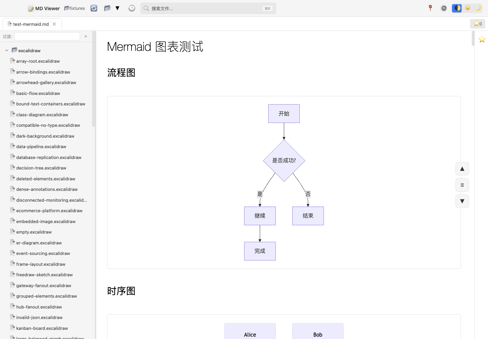

你应该看到左侧文件树、上方标签页和右侧 Markdown 预览区。点击任意 `.md` 文件即可打开。

### 文件树、过滤与折叠状态

文件树支持展开、折叠和文件过滤。过滤框可按文件名、相对路径或完整路径匹配文件；清空过滤后会恢复正常文件树。

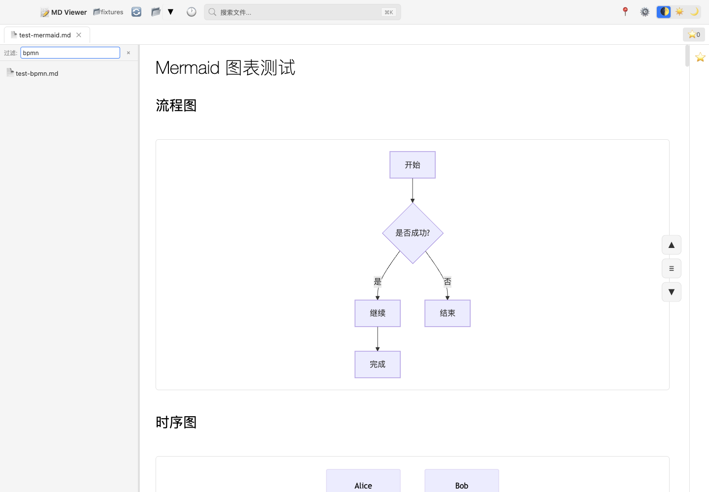

MD Viewer 会按根目录保存文件树折叠状态。重新打开常用目录时，之前整理过的展开和折叠状态会尽量保留。

### 最近文件、最近文件夹与书签

MD Viewer 会记录最近打开的文件夹和文件，方便快速回到常用文档。你也可以把当前文件或标题加入书签，后续从书签栏或书签面板打开。

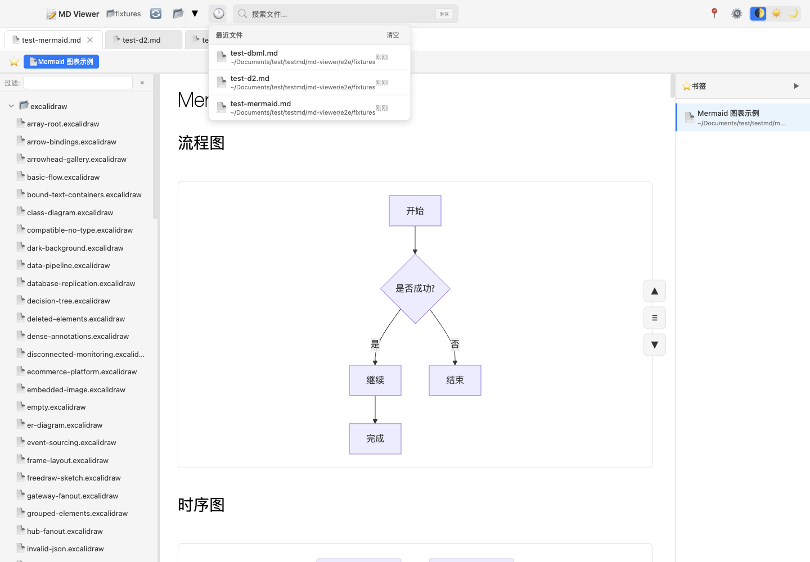

常见入口包括标签页右键、文件树右键和 Markdown 预览区右键。跨文件夹书签会在打开时自动切换到对应目录。

### 图片预览与 Lightbox

Markdown 中的图片可以直接预览。点击图片会进入 Lightbox 预览，适合查看大图、截图或设计稿。


Lightbox 中可关闭预览；如果有多张图片，可使用界面按钮或键盘方向键切换。

## 3. 搜索与定位

### 全局搜索

全局搜索用于快速打开文件。当前搜索按钮和快捷键帮助中显示为 `Cmd/Ctrl+K`。输入关键词后，MD Viewer 会按文件名、路径和历史记录返回匹配项。

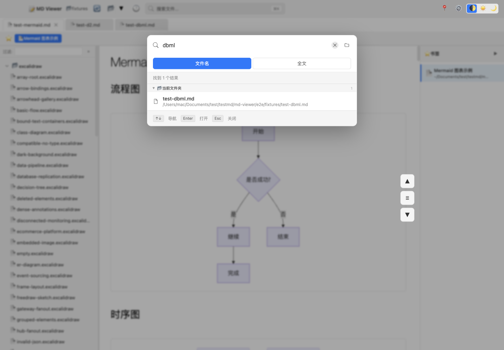

如果当前界面显示的快捷键和本文档不一致，请以当前应用内的快捷键帮助为准。

### 全文搜索

全文搜索用于在当前文件夹内查找文档内容。适合查找某个术语、项目名或会议主题。搜索结果较多时，优先查看文件名、路径和命中片段。

### 页面内搜索

页面内搜索用于在当前 Markdown 文档里定位内容。当前快捷键帮助中显示为 `Cmd/Ctrl+Shift+F`。搜索框会显示匹配计数，并支持跳到上一个或下一个匹配。

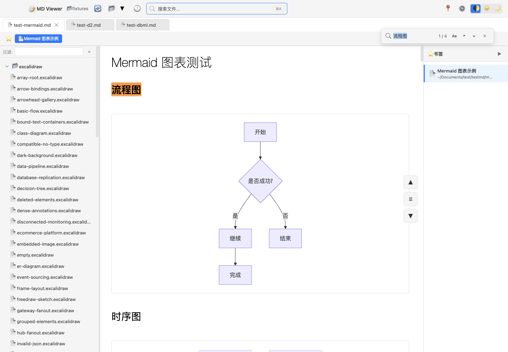

如果搜索不到内容，先确认你使用的是全局搜索、全文搜索还是页面内搜索。三者范围不同。

### 目录导航

文档中存在标题时，MD Viewer 会提供目录导航和当前位置提示。长文档阅读时可以用目录快速跳转到某个章节。

## 4. 编辑 Markdown

### 进入与退出编辑模式

MD Viewer 默认以预览模式打开 Markdown。只有进入编辑模式后，文档内容才可以修改。编辑入口以当前界面显示为准，通常位于当前文档工具区或更多菜单中。

退出编辑模式前，如果存在未保存修改，MD Viewer 会提示你保存或放弃草稿，避免静默丢失内容。

### 源码编辑

源码编辑适合修改 Markdown 语法、图表代码、复杂表格和代码块。编辑器支持 Markdown 高亮、基础格式工具和常用编辑快捷操作。

### 渲染区直接编辑

进入编辑模式后，部分渲染区内容可以直接编辑，例如常见段落、标题、列表、引用、代码块和表格单元格。复杂图表、嵌入式组件、特殊 HTML 或非标准 Markdown 建议使用源码编辑。

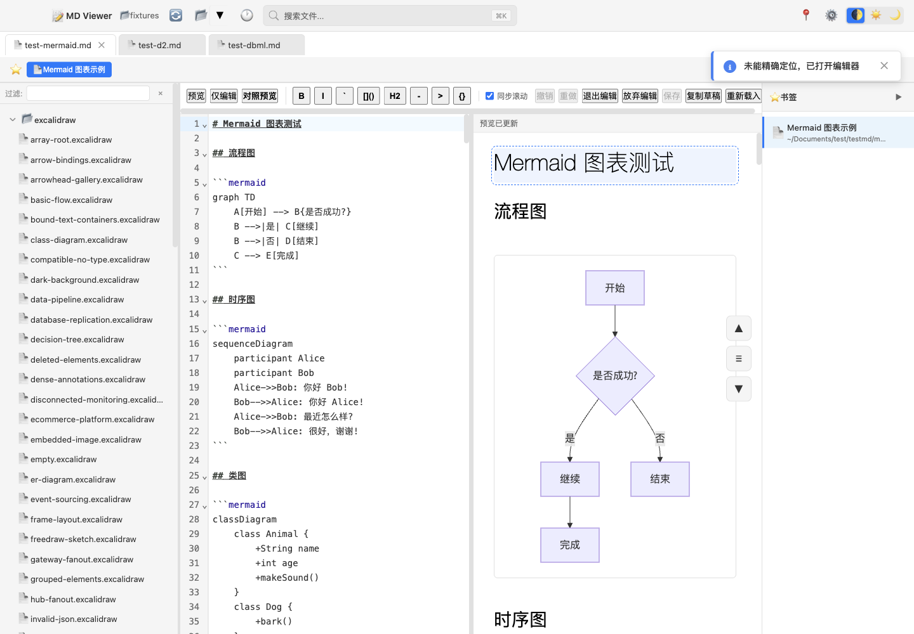

如果某个块无法直接编辑，切换到源码编辑通常更稳定。

### 对照预览

对照预览适合连续修改文档：左侧编辑 Markdown，右侧实时显示草稿预览。

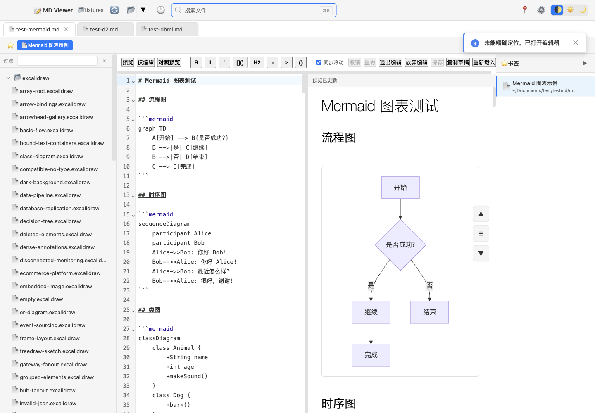

图表密集型文档在实时预览时可能出现短暂“渲染中”。编辑时以输入流畅为优先，预览可能略有延迟。

### 保存、放弃与草稿恢复

编辑后可以保存到磁盘，也可以放弃未保存修改并回到磁盘版本。异常关闭后再次打开同一文档时，MD Viewer 可能提示恢复草稿。

导出前如果存在未保存草稿，应用会要求先保存或取消导出，避免导出内容和你看到的草稿不一致。

### 编辑限制与冲突处理

同一文件在多个分屏面板中打开时，当前版本会尽量避免多个可写编辑器同时修改同一个草稿。外部编辑器修改同一文件时，如果本地存在未保存草稿，MD Viewer 会保留草稿并提示处理冲突。

## 5. 图表与公式

### 支持类型总览

| 类型 | 写法 | 典型用途 | 导出说明 |
| --- | --- | --- | --- |
| Mermaid | <code>```mermaid</code> | 流程图、时序图、类图、状态图、甘特图等 | 支持预览和导出 |
| ECharts | <code>```echarts</code> | 交互式统计图、仪表板图表 | 支持预览和导出 |
| Markmap | <code>```markmap</code> | Markdown 思维导图 | 支持预览和导出 |
| Graphviz | <code>```dot</code> / <code>```graphviz</code> | DOT 图、依赖关系图 | 支持预览和导出 |
| PlantUML | <code>```plantuml</code> | UML、C4、时序图、用例图 | 依赖 PlantUML 服务配置 |
| DrawIO | <code>```drawio</code> | diagrams.net 图表 | 预览效果最好，导出依赖已渲染内容 |
| Infographic | <code>```infographic</code> | 信息图 | 支持预览和导出 |
| KaTeX | `$...$` / `$$...$$` | 行内公式和块级公式 | 支持预览和导出 |
| Excalidraw | <code>```excalidraw</code> / `.excalidraw` | 静态画板预览 | 不提供 Excalidraw 编辑 |
| Vega-Lite | <code>```vega-lite</code> | 声明式统计图 | 支持预览和导出 |
| D2 | <code>```d2</code> | 架构图、流程图 | 支持预览和导出 |
| BPMN | <code>```bpmn</code> / `.bpmn` | 业务流程建模 | 支持预览和导出 |
| WaveDrom | <code>```wavedrom</code> | 数字时序图 | 支持预览和导出 |
| C4-PlantUML | <code>```c4</code> / <code>```c4plantuml</code> | C4 架构图 | 支持预览和导出 |
| Structurizr | <code>```structurizr</code> | Structurizr DSL 架构模型 | 支持预览和导出 |
| Plotly | <code>```plotly</code> | 复杂图表、统计图、3D 图表 | 支持预览和导出 |
| DBML | <code>```dbml</code> | 数据库 ERD | 支持预览和导出 |
| AntV G6 | <code>```antv-g6</code> | 关系图、拓扑图、知识图谱 | 支持预览和导出 |
| Kroki | <code>```kroki</code> / <code>```nomnoml</code> 等 | 长尾图表格式 | 具体格式和网络策略以当前实现为准 |

Kroki 常见子格式包括 `nomnoml`、`pikchr`、`svgbob`、`bytefield`、`tikz`。PlantUML 或 Kroki 如果依赖远程服务，网络不可用时可能渲染失败。

### 常用图表示例

Mermaid：

````markdown

````

KaTeX：

```markdown
行内公式：$E = mc^2$

块级公式：
$$
\frac{-b \pm \sqrt{b^2 - 4ac}}{2a}
$$
```

BPMN 文件引用：

```markdown

```

Excalidraw 文件引用：

```markdown

```

### 图表工具栏

多数图表支持工具栏操作：查看源码、放大、缩小、适应大小、下载图片和全屏查看。

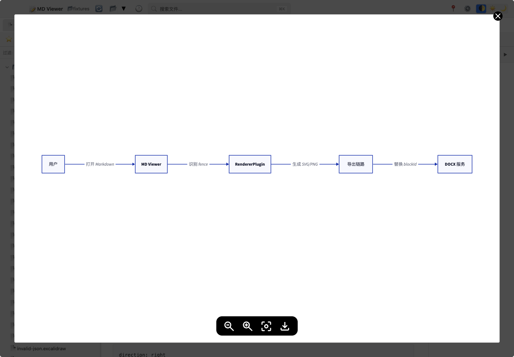

不同图表类型的按钮可能略有差异。以当前图表上显示的工具栏为准。

### 全屏、缩放、源码与下载

图表全屏适合查看大图、架构图和流程图。进入全屏后可以缩放、适应大小或关闭全屏。查看源码用于检查图表语法，下载图片用于把当前图表保存为 PNG。

### 批量打包下载图表

在预览区右键，选择“打包下载图表”。MD Viewer 会把当前文档中可导出的图表保存为 ZIP，解压后图表位于同名文件夹中。

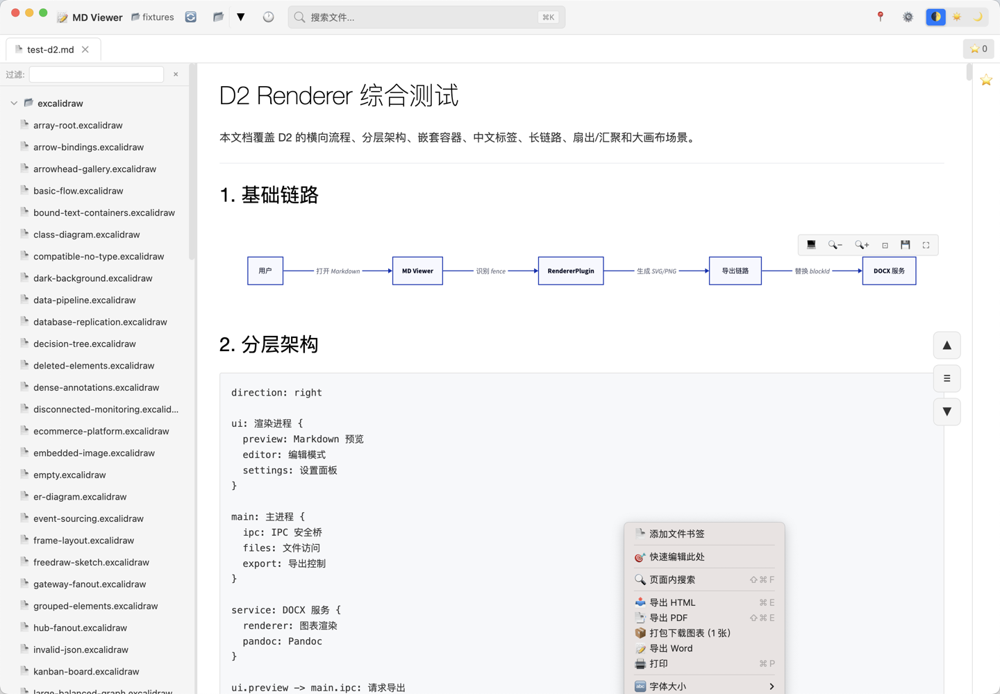

该菜单通常只在当前文档存在可导出图表时显示。如果图表渲染失败，导出结果可能不完整。

### 图表故障排查

图表不显示时，先切换到源码视图检查语法。再确认是否需要外部服务，例如 PlantUML 服务地址、Kroki 网络访问或 DOCX 服务端图表截图能力。

## 6. 导出文件

### 导出 HTML

HTML 适合浏览器打开、离线归档和分享给需要保留 Markdown 样式的人。HTML 导出不需要 DOCX 服务。

### 导出 PDF

PDF 适合发送、打印和定稿阅读。PDF 导出不需要 DOCX 服务。

### 导出 DOCX

DOCX 适合继续用 Word 编辑。高质量 DOCX，尤其是图表密集型文档，建议配置 `md-viewer-docx-service`。

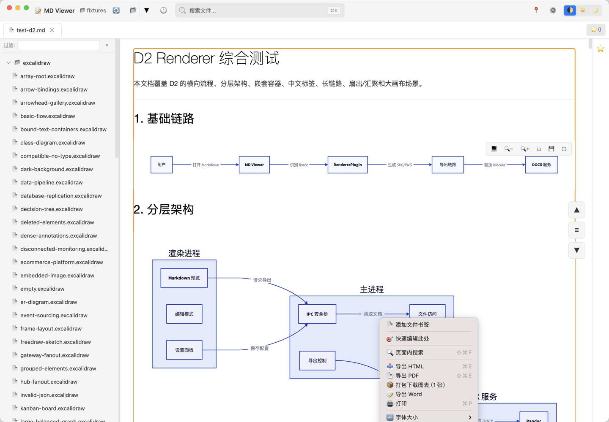

如果只导出 HTML 或 PDF，不需要启动 DOCX 服务。只有需要高质量 DOCX 时，才需要配置 DOCX 服务。

### DOCX 模板样式

DOCX 支持多种模板样式：

| 样式 | 适合场景 |
| --- | --- |
| 预览一致 | 接近 Markdown 预览与 PDF 的页面节奏 |
| 通用 Word | 适合后续编辑的常规 Word 排版 |
| 正式公文 | 政府机关公文（GB/T 9704） |
| 机关内部 | 内部行文、通知 |
| 调研报告 | 研究分析、学术报告 |


如果当前 DOCX 服务不支持某个样式，界面会禁用或在导出时临时回退到可用样式。

### DOCX 服务配置

进入设置面板，找到“DOCX 导出服务”。启用后填写服务器地址，默认示例通常是 `http://localhost:3179`。如服务配置了 API Key，需要在高级选项里填写。


设置面板会显示连接状态、服务版本、可用样式、字体和图表渲染能力。

### 导出结果与失败处理

导出时会显示任务状态。成功后可以打开位置；如果有 warning，请查看导出详情或检查源文档中的图表。


常见失败原因包括输出路径不可写、DOCX 服务未启动、API Key 不匹配、服务版本不兼容或图表渲染失败。

## 7. 阅读与窗口管理

### 分屏

分屏适合对比多个文档或一边读文档一边查看参考材料。常见入口包括标签页右键、文件树右键和分屏按钮。

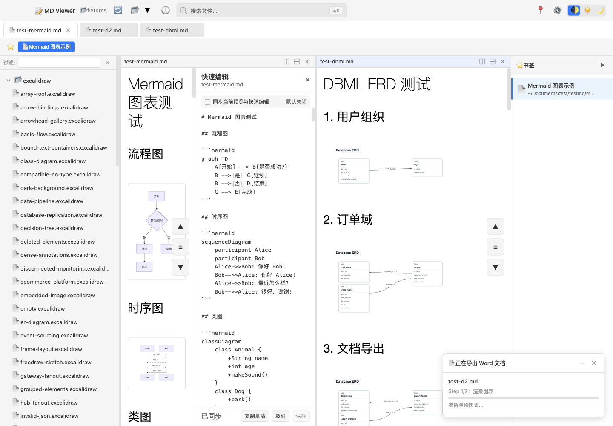

可以向右或向下分屏，并拖拽分隔线调整比例。

### 多窗口

多窗口适合同时查看不同目录或不同项目。书签等部分数据会在窗口之间同步。

### 全屏阅读

全屏阅读会隐藏部分界面元素，让当前文档占据更多空间。退出方式以系统全屏和应用当前提示为准。

### 字体大小

可以通过快捷键或右键菜单调整预览字体大小。常用快捷键见 [快捷键速查](#9-快捷键速查)。

### 窗口置顶

窗口置顶适合会议记录、边看边写或对照其它应用。当前快捷键帮助中显示为 `Cmd/Ctrl+Alt+T`。

### 打印

当前文档可通过打印入口打开系统打印对话框。当前快捷键帮助中显示为 `Cmd/Ctrl+P`。

### 主题设置

设置面板支持浅色、深色和跟随系统主题。截图和导出样式可能与当前主题不同，导出通常会使用适合阅读的静态样式。

## 8. 系统集成

### macOS 右键打开

设置面板提供右键菜单集成。macOS 需要安装快速操作或 Finder 扩展，并在“系统设置 -> 隐私与安全性 -> 扩展 -> Finder 扩展”中启用。

### Windows 右键打开

Windows 可通过设置面板安装 Explorer 右键菜单，用于从文件管理器中直接用 MD Viewer 打开 Markdown 文件或文件夹。

### Linux 文件关联

Linux 可通过 `.desktop` 文件或系统文件关联实现右键打开。具体行为取决于发行版和桌面环境。

### 设置面板中的右键菜单管理

设置面板会显示右键菜单集成状态，并提供安装、卸载或打开系统设置等操作。卸载后如果系统仍显示灰色菜单项，请检查系统扩展或文件关联缓存。

## 9. 快捷键速查

以当前应用的“快捷键参考”弹窗为准。

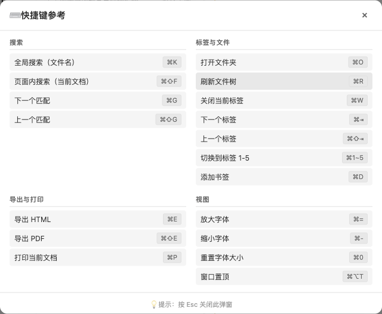

| 分组 | 功能 | 快捷键 |
| --- | --- | --- |
| 搜索 | 全局搜索（文件名） | `Cmd/Ctrl+K` |
| 搜索 | 页面内搜索（当前文档） | `Cmd/Ctrl+Shift+F` |
| 搜索 | 下一个匹配 | `Cmd/Ctrl+G` |
| 搜索 | 上一个匹配 | `Cmd/Ctrl+Shift+G` |
| 标签与文件 | 打开文件夹 | `Cmd/Ctrl+O` |
| 标签与文件 | 刷新文件树 | `Cmd/Ctrl+R` |
| 标签与文件 | 关闭当前标签 | `Cmd/Ctrl+W` |
| 标签与文件 | 下一个标签 | `Cmd/Ctrl+Tab` |
| 标签与文件 | 上一个标签 | `Cmd/Ctrl+Shift+Tab` |
| 标签与文件 | 切换到标签 1-5 | `Cmd/Ctrl+1~5` |
| 标签与文件 | 添加书签 | `Cmd/Ctrl+D` |
| 导出与打印 | 导出 HTML | `Cmd/Ctrl+E` |
| 导出与打印 | 导出 PDF | `Cmd/Ctrl+Shift+E` |
| 导出与打印 | 打印当前文档 | `Cmd/Ctrl+P` |
| 视图 | 放大字体 | `Cmd/Ctrl+=` |
| 视图 | 缩小字体 | `Cmd/Ctrl+-` |
| 视图 | 重置字体大小 | `Cmd/Ctrl+0` |
| 视图 | 窗口置顶 | `Cmd/Ctrl+Alt+T` |

## 10. 隐私、本地文件与外部服务

MD Viewer 主要处理本地文件。打开文件夹、预览 Markdown、HTML/PDF 导出通常在本机完成。

以下能力可能涉及外部或本地服务：

- DOCX 高质量导出会连接你配置的 `md-viewer-docx-service`。
- PlantUML 图表可能连接配置的 PlantUML 服务。
- Kroki 相关格式可能依赖当前实现配置的渲染服务。

不要在公开截图、Issue 或 Release 文档中暴露 API Key、私有文档路径、内网服务地址或业务敏感内容。

## 11. 常见问题与故障排查

### 常见问题

| 问题 | 回答 |
| --- | --- |
| 为什么默认不能直接编辑？ | MD Viewer 的核心定位是预览。进入编辑模式后才允许修改 Markdown。 |
| 什么时候需要 DOCX 服务？ | 只导出 HTML/PDF 不需要。需要高质量 Word，尤其是图表密集型文档时建议启用。 |
| 图表能否批量下载？ | 可以。在预览区右键，选择“打包下载图表”。 |
| `.excalidraw` 文件能否预览？ | 可以静态预览和导出，但不提供 Excalidraw 编辑能力。 |
| `.bpmn` 文件能否预览？ | 可以通过代码块或 Markdown 图片引用预览。 |

### 故障排查

| 现象 | 可能原因 | 处理步骤 |
| --- | --- | --- |
| 应用打不开 | macOS Gatekeeper、未拖入 `/Applications`、下载来源不可信 | 确认来自 Release，拖入 `/Applications`，必要时执行 `xattr` |
| 文件树为空 | 目录无 Markdown、权限不足、路径不可访问 | 换目录，检查权限，刷新文件树 |
| 搜索不到内容 | 搜索入口用错、过滤条件未清空、文件未被索引 | 区分全局搜索、全文搜索和页面内搜索 |
| 图片不显示 | 相对路径错误、图片文件缺失、格式不支持 | 检查 Markdown 图片路径和实际文件 |
| 图表不渲染 | 语法错误、依赖服务不可用、源码过大 | 查看源码、简化图表、检查 PlantUML/Kroki 等服务 |
| 导出失败 | 文件权限、输出路径不可写、图表渲染失败 | 换保存位置，查看错误详情 |
| DOCX 服务连接失败 | 服务未启动、地址错误、API Key 错误、版本不兼容 | 检查设置面板、服务地址和 `/readyz` |
| 保存失败 | 文件只读、外部修改冲突、权限不足 | 保留草稿，另存或处理冲突 |
| 大文件卡顿 | 文档过大、图表过多、图片过多 | 关闭不必要面板，拆分文档，减少同时渲染 |

## 12. 示例文件与进一步测试

仓库中的 `e2e/fixtures/` 提供了大量测试 Markdown，可用于了解图表写法和复杂文档效果。常用示例包括：

- `e2e/fixtures/test-all-charts.md`
- `e2e/fixtures/test-mermaid.md`
- `e2e/fixtures/test-d2.md`
- `e2e/fixtures/test-dbml.md`
- `e2e/fixtures/test-excalidraw.md`
- `e2e/fixtures/test-kroki.md`

这些文件主要用于测试和示例，不是日常用户必须阅读的文档。
