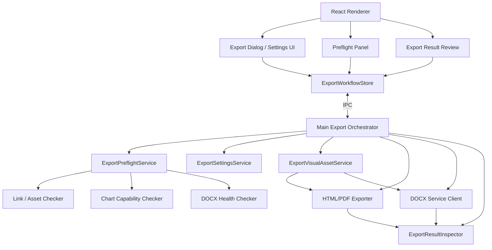
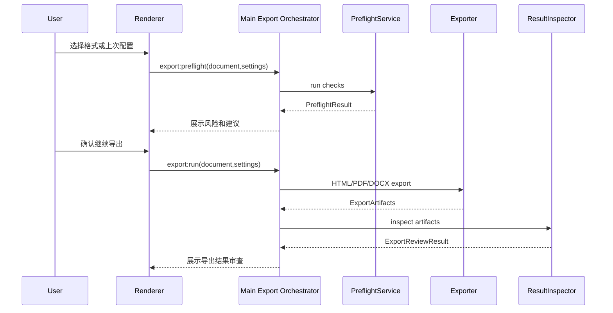
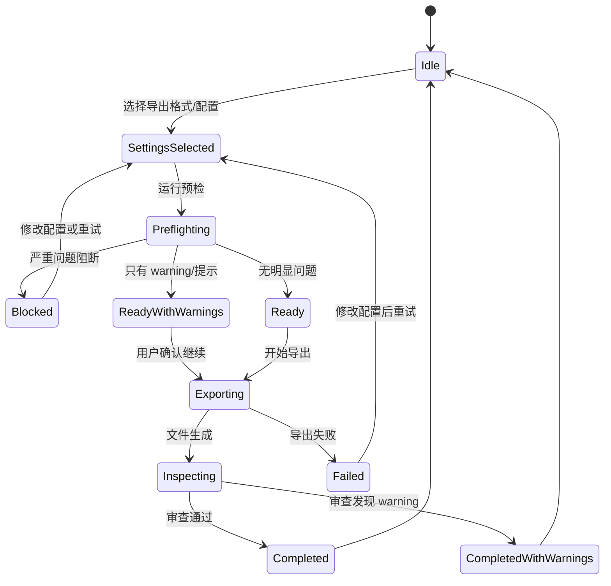

# MD Viewer v2.6.0 Roadmap

> 日期：2026-06-22  
> 推荐主题：导出交付增强与质量预检  
> 核心目标：让用户把 Markdown 稳定、漂亮、可控地导出为 HTML、PDF、DOCX，并在导出前后明确知道风险、结果和处理建议。

## 方向修订说明

此前评估过“文档工作台 / 知识库能力”，包含项目索引、快速跳转、反向链接、大纲增强和工作区恢复。重新评估后，该方向对 md-viewer 的真实高频场景不够硬，且会把产品推向 Obsidian / VS Code 式知识库工具。

v2.6.0 应回到 md-viewer 最有差异化的主路径：

> Markdown 复杂内容预览 → 图表稳定渲染 → HTML / PDF / DOCX 可靠导出 → 可交付文件。

因此 v2.6.0 不以知识库管理为主线，而以“导出交付质量”为主线。

## 背景

v2.2 扩展了图表体系，v2.4 修复了大量 HTML/PDF/DOCX 导出一致性问题，v2.5 增加 CLI 自动化能力。真实使用中仍暴露出几个核心问题：

- 图表在预览、HTML、PDF、DOCX 中尺寸和居中策略不完全一致。
- DOCX 服务不可用、字体缺失、renderer artifact 异常时，用户需要更明确的处理办法。
- 导出前缺少 GUI 预检，用户往往导出后才发现断链、缺图、图表源码残留或图片异常。
- 导出完成后的结果摘要不够结构化，难以判断文件是否真正可交付。
- 同一类文档经常需要重复选择相同导出样式、边距、署名和图表策略。

## 产品定位

v2.6.0 的目标不是新增更多 Markdown 编辑能力，也不是继续扩张图表格式，而是把已有预览和导出能力做成可靠交付链路。

一句话目标：

> 用户点击导出前能知道风险，导出时能复用配置，导出后能确认质量，并且 HTML / PDF / DOCX 的图表、图片和署名表现尽量一致。

## 非目标

- 不新增大批图表类型。
- 不做 AI 问答、语义搜索、知识图谱、反向链接。
- 不把 md-viewer 变成完整 Markdown 编辑器。
- 不在 v2.6.0 内重写 DOCX 服务架构。
- 不承诺所有第三方图表在 DOCX 中达到像素级一致，但必须给出明确降级和 warning。

## P0 范围

### 1. 导出前预检 GUI

导出前检查当前 Markdown 是否存在交付风险。P0 只做和导出强相关、能直接影响交付结果的检查，不做完整项目健康扫描。

检查范围：

- 本地图片缺失。
- Markdown 链接目标不存在。
- 标题锚点无效。
- 图表渲染失败或依赖不可用。
- DOCX 服务不可连接、版本不匹配、renderer artifact 缺失。
- 字体嵌入风险。
- 超宽图表、超高图表、小图过度放大风险。
- HTML/PDF 导出可能出现源码残留或占位符残留。

预检结果必须包含：

- 问题等级：严重、警告、提示。
- 影响范围：HTML、PDF、DOCX 或全部。
- 文件位置：行号、图表序号或资源路径。
- 处理建议：打开设置、启动 DOCX 服务、定位源码、继续导出。

阻断规则：

| 问题 | 默认行为 |
| --- | --- |
| DOCX 服务不可用但只导出 HTML/PDF | 不阻断 |
| DOCX 服务不可用且目标包含 DOCX | 阻断 DOCX，可继续导出 HTML/PDF |
| 本地图片缺失 | 默认警告；用户可继续，但结果审查必须再次提示 |
| 图表渲染失败 | 默认严重；可选择导出源码占位但必须明确提示 |
| 只有提示类问题 | 不阻断，不弹强制确认 |

### 2. 导出结果审查

导出完成后显示结构化结果，不能只以“文件已生成”判断成功。

结果审查内容：

- 输出文件路径。
- 文件大小。
- 导出耗时。
- 图表数量、成功数量、失败数量。
- 图片数量、缺失数量。
- warning 数量和详情。
- 是否检测到源码残留、占位符残留、空白图片。
- 操作：打开文件、显示文件夹、重新导出、复制诊断信息。

审查方式：

| 格式 | P0 检测方式 |
| --- | --- |
| HTML | 扫描 DOM 文本、代码块残留、占位符 class、图片加载状态、图表容器尺寸 |
| PDF | 用现有 PDF 生成结果做文本残留检查；对关键页截图做空白图和超版心初筛 |
| DOCX | 解包检查 `word/media` 图片数量、XML 文本残留、图片尺寸和文末署名位置 |

结果状态：

| 状态 | 文案 |
| --- | --- |
| 成功 | `导出完成` |
| 成功但有 warning | `文件已生成，有事项需要确认` |
| 失败 | `导出失败` |

### 3. 图表与图片导出一致性规则

建立统一规则，减少预览、HTML、PDF、DOCX 差异。P0 不要求所有 renderer 全量重构到新模型，但核心链路必须收口。

P0 覆盖对象：

- 普通 Markdown 图片。
- Mermaid。
- Graphviz。
- DrawIO。
- ECharts。
- Excalidraw。
- `test-all-charts.md` 中已经多次暴露导出问题的图表类型。

统一规则：

- SVG、Canvas、图片引用统一进入 `ExportVisualAsset` 抽象或兼容 adapter。
- 默认保持原始宽高比，不拉伸。
- 图表宽度超过版心时等比缩小。
- 图表明显小于版心时不强制放大到满宽。
- 图表容器负责居中，图片本体不通过变形实现居中。
- 透明背景导出时补白底，避免 PDF/DOCX 中不可见。
- 对极宽图、极高图、空白图生成 warning。

兼容策略：

- 暂未接入统一模型的 renderer 继续使用现有导出链路。
- 如果检测到尺寸异常、空白图或源码残留，必须输出结构化 warning。
- 不允许为了通过某一类图表测试而对单个 fixture 写特例。

### 4. DOCX 服务状态与处理建议

GUI 和 CLI 都应能给出明确 DOCX 服务状态：

- 服务地址。
- 连接状态。
- 服务版本。
- renderer artifact 状态。
- 支持的 DOCX 样式。
- 字体目录、内置字体、可嵌入字体状态。
- 常见问题处理命令。

服务不可用时，不只显示“无法连接 DOCX 服务”，还要显示下一步：

- 检查服务地址。
- 启动本地服务。
- Docker 场景如何挂载字体。
- 远程服务如何配置 API Key。

### 5. 导出配置轻量记忆

完整预设管理不进入 P0。P0 只做轻量配置记忆和少量内置配置：

- 记住上次选择的导出格式。
- 记住上次 PDF 页面大小、方向、边距。
- 记住上次 DOCX 样式。
- 记住上次图表策略。
- 提供 2-3 个内置配置：`默认导出`、`技术报告`、`图表密集文档`。

P0 不做：

- 用户自定义预设列表管理。
- 预设导入导出。
- 团队共享预设。
- 复杂模板编辑器。

### 6. 导出回归基线

将真实导出问题固化为自动化回归：

- `test-all-charts.md` HTML/PDF/DOCX。
- `test-drawio.md`、`test-graphviz.md`、`test-echarts.md`、`test-excalidraw.md`。
- 至少一组真实业务 Markdown 脱敏样本。
- 检查源码残留、占位符残留、图片数量、空白图、超版心、异常放大、未居中。

## P1 范围

### 完整导出配置预设

支持保存和复用常用导出配置：

- 导出格式：HTML / PDF / DOCX。
- PDF 页面大小、方向、边距、页脚署名。
- DOCX 样式：`preview`、`standard`、`official`、`internal`、`report`。
- 图表策略：适应页面宽度、保持原始比例、限制最大宽度、居中。
- 图片策略：嵌入本地图片、保留远程图片、缺失图片 warning。
- 署名策略：不显示、文末显示 `由 MD Viewer 生成 · github.com/wj2929/md-viewer`。

预设示例：

| 预设 | 用途 |
| --- | --- |
| 技术报告 | 图表较多，PDF/DOCX 都需要可读 |
| 正式公文 | DOCX `official`，更重视字体和版式 |
| 内部评审 | PDF 横向图表、保留署名 |
| 图表密集文档 | 优先控制图表缩放和分页 |

### 其它 P1 能力

- 批量导出 GUI：选择多个 Markdown，一次导出 PDF/DOCX。
- 导出报告导出为 Markdown / JSON。
- 预设导入导出，便于团队共享。
- 图表问题详情支持截图对比。
- DOCX 服务自动启动或一键重启。

## P2 范围

- 云端导出服务。
- 在线模板市场。
- 可视化 DOCX 模板编辑器。
- 多文档合并导出。
- 文档水印、目录页、封面页高级排版。

## 用户主路径

```text
打开 Markdown
  ↓
选择导出格式或使用上次配置
  ↓
后台运行导出前预检
  ↓
严重问题阻断对应格式；warning 轻提示
  ↓
执行 HTML / PDF / DOCX 导出
  ↓
查看导出结果审查
  ↓
打开文件或重新导出
```

## ASCII 界面线框

### 1. 导出入口与内置配置

```text
┌──────────────────────────────────────────────────────────────┐
│ 工具栏                                                       │
│ [导出 HTML] [导出 PDF] [导出 DOCX] [导出设置 ▾]              │
├──────────────────────────────────────────────────────────────┤
│ 当前文档：智能基座平台多租户数据隔离与权限控制.md             │
│                                                              │
│ 预览内容...                                                  │
└──────────────────────────────────────────────────────────────┘
```

```text
┌──────────────────────────────┐
│ 导出设置                     │
├──────────────────────────────┤
│ 使用上次配置                 │
│ 默认导出        HTML/PDF     │
│ 技术报告        PDF + DOCX   │
│ 图表密集文档    PDF + HTML   │
├──────────────────────────────┤
│ 打开导出设置...              │
└──────────────────────────────┘
```

### 2. 导出前预检面板

```text
┌──────────────────────────────────────────────────────────────┐
│ 导出前检查                                      PDF + DOCX   │
├──────────────────────────────────────────────────────────────┤
│ 状态：发现 1 个严重问题、3 个警告、2 个提示                  │
│                                                              │
│ 严重  DOCX 服务不可用                                        │
│       http://localhost:3179 无法连接                         │
│       影响：DOCX                                             │
│       建议：启动 DOCX 服务或修改服务地址        [打开设置]   │
│                                                              │
│ 警告  第 8 个图表过宽                                        │
│       影响：PDF / DOCX                                       │
│       建议：使用“适应页面宽度”策略              [定位源码]   │
│                                                              │
│ 提示  外链图片未做联网校验                                   │
│       影响：HTML                                             │
│                                                              │
├──────────────────────────────────────────────────────────────┤
│ [取消] [仅导出 HTML/PDF] [打开设置]                          │
└──────────────────────────────────────────────────────────────┘
```

如果没有严重问题，只存在 warning，底部按钮改为：

```text
┌──────────────────────────────────────────────────────────────┐
│ [取消]                         [继续导出] [查看详细问题]     │
└──────────────────────────────────────────────────────────────┘
```

### 3. 导出配置轻量记忆

```text
┌──────────────────────────────────────────────────────────────┐
│ 导出设置                                             ×       │
├──────────────────────────────────────────────────────────────┤
│ 格式        ☑ HTML   ☑ PDF   ☑ DOCX                         │
│                                                              │
│ PDF                                                         │
│ 页面大小    A4 ▾       方向  纵向 ▾      边距  标准 ▾        │
│                                                              │
│ DOCX                                                        │
│ 样式        report ▾    服务  http://localhost:3179 [测试]   │
│                                                              │
│ 图表                                                        │
│ 缩放策略    适应页面宽度 ▾      ☑ 保持比例  ☑ 居中           │
│ 最大宽度    版心 100% ▾                                         │
│                                                              │
│ 署名                                                        │
│ ○ 不显示   ● 文末显示                                       │
│ 文案：由 MD Viewer 生成 · github.com/wj2929/md-viewer        │
├──────────────────────────────────────────────────────────────┤
│ ☑ 下次导出沿用这些设置                         [保存并导出] │
└──────────────────────────────────────────────────────────────┘
```

### 4. 导出结果审查

```text
┌──────────────────────────────────────────────────────────────┐
│ 导出完成，但有 2 项需要确认                                  │
├──────────────────────────────────────────────────────────────┤
│ 输出文件                                                     │
│ ✓ /Users/mac/Documents/tmp/report.pdf        4.2 MB   18.3s │
│ ✓ /Users/mac/Documents/tmp/report.docx       8.9 MB   21.5s │
│                                                              │
│ 质量摘要                                                     │
│ 图表：26 个，成功 26 个，失败 0 个                           │
│ 图片：12 个，缺失 0 个                                      │
│ 检查：未发现源码残留；未发现占位符残留                       │
│                                                              │
│ 警告                                                         │
│ - 第 9 个图表在 DOCX 中按版心等比缩小                        │
│ - 未找到可嵌入字体，已使用服务默认字体                       │
├──────────────────────────────────────────────────────────────┤
│ [打开 PDF] [打开 DOCX] [显示文件夹] [复制诊断] [重新导出]    │
└──────────────────────────────────────────────────────────────┘
```

### 5. DOCX 服务状态

```text
┌──────────────────────────────────────────────────────────────┐
│ DOCX 服务状态                                                │
├──────────────────────────────────────────────────────────────┤
│ 服务地址       http://localhost:3179             [测试连接]  │
│ 连接状态       ● 正常                                         │
│ 服务版本       0.8.0                                          │
│ Renderer       已同步，支持 full fidelity                     │
│ 字体           内置 Noto Sans CJK SC；未配置自定义字体目录    │
│ 样式           preview / standard / official / internal/report│
│                                                              │
│ 常见处理                                                   │
│ - 本地：启动 md-viewer-docx-service                          │
│ - Docker：挂载 fonts 目录并设置 API_KEY                      │
│ - 远程：确认服务地址、网络和鉴权配置                         │
└──────────────────────────────────────────────────────────────┘
```

## 鱼骨图：导出问题来源

```text
                              ┌─ 图表：尺寸过宽、过小、透明背景、Canvas 截图失败
                              │
                              ├─ 图片：本地缺失、远程不可访问、比例失真
                              │
导出交付质量不稳定 ───────────┼─ DOCX：服务不可用、字体缺失、renderer artifact 不一致
                              │
                              ├─ PDF/HTML：源码残留、占位符残留、分页和版心问题
                              │
                              └─ 用户操作：重复配置、导出后才发现问题、warning 不可执行
```

## 架构设计

### 仓库职责边界

| 能力 | `md-viewer` | `md-viewer-docx-service` |
| --- | --- | --- |
| 导出前预检 GUI | 负责界面、用户动作、HTML/PDF 可用性检查、DOCX 服务调用 | 提供 DOCX health/ready/version/font/renderer 状态 |
| HTML/PDF 导出审查 | 负责 HTML DOM、PDF 文本/截图/占位符检查 | 不参与 |
| DOCX 导出审查 | 负责展示审查结果、解包基础检查、统一 warning 文案 | 提供 DOCX 生成、图片尺寸信息、字体嵌入结果、服务端 warning |
| 图表尺寸策略 | 负责预览、HTML/PDF 和通用视觉资产模型 | 复用 renderer artifact，按服务端能力输出图片尺寸和 warning |
| DOCX 服务状态 | 展示服务状态和处理建议 | 提供结构化状态接口 |
| 自动化回归 | 负责 GUI/CLI/E2E 入口与报告汇总 | 负责 pytest 和 DOCX 样式转换正确性 |

原则：

- `md-viewer` 不直接扫描服务器字体目录；远程或 Docker 服务的字体状态由服务端报告。
- `md-viewer-docx-service` 不决定 GUI 交互，只返回结构化结果、warning 和 action hint。
- 两个仓库的 warning schema 要保持兼容，避免 GUI 只能展示字符串。

### 核心模块



### 数据流



### 导出视觉资产统一模型

```ts
type ExportVisualAsset = {
  id: string
  kind: 'chart' | 'image' | 'formula' | 'drawio' | 'excalidraw'
  sourceLine?: number
  intrinsicWidth: number
  intrinsicHeight: number
  outputWidth: number
  outputHeight: number
  scale: number
  alignment: 'center' | 'left'
  background: 'transparent' | 'white'
  warnings: ExportWarning[]
}
```

规则：

- `intrinsicWidth` / `intrinsicHeight` 来自真实渲染结果或图片元数据。
- `outputWidth` / `outputHeight` 按目标格式版心计算。
- `scale` 必须等比，禁止只改宽或只改高。
- `alignment` 由容器控制，不通过图片像素偏移模拟。
- 超过阈值的极端图表必须生成 warning。

## 状态模型



## 数据契约

### ExportSettings

```ts
type ExportSettings = {
  schemaVersion: 1
  formats: Array<'html' | 'pdf' | 'docx'>
  pdf?: {
    pageSize: 'A4' | 'A3' | 'Letter'
    orientation: 'portrait' | 'landscape'
    margins: 'narrow' | 'standard' | 'wide'
  }
  docx?: {
    style: 'preview' | 'standard' | 'official' | 'internal' | 'report'
    serviceUrl: string
  }
  visuals: {
    chartScaleMode: 'fit-page' | 'keep-original' | 'max-width'
    maxWidthPercent: number
    preserveAspectRatio: true
    align: 'center' | 'left'
  }
  signature: {
    enabled: boolean
    position: 'document-end'
    text: string
  }
}
```

### ExportWarning

```ts
type ExportWarning = {
  id: string
  severity: 'critical' | 'warning' | 'info'
  formatScope: Array<'html' | 'pdf' | 'docx'>
  source?: {
    line?: number
    chartIndex?: number
    assetPath?: string
  }
  message: string
  impact: string
  actions: Array<{
    label: string
    kind: 'open-settings' | 'locate-source' | 'retry' | 'open-docs' | 'copy-diagnostics'
  }>
}
```

## 预检规则矩阵

| 检查项 | HTML | PDF | DOCX | 严重等级 |
| --- | --- | --- | --- | --- |
| 本地图片缺失 | 是 | 是 | 是 | 严重 |
| Markdown 链接目标缺失 | 是 | 是 | 是 | 警告 |
| 标题锚点无效 | 是 | 是 | 是 | 警告 |
| 图表渲染失败 | 是 | 是 | 是 | 严重 |
| 图表过宽/过高 | 是 | 是 | 是 | 警告 |
| DOCX 服务不可用 | 否 | 否 | 是 | 严重 |
| 字体不可嵌入 | 否 | 否 | 是 | 警告 |
| 外链图片未校验 | 是 | 是 | 是 | 提示 |

## 测试策略

### 单元测试

- `ExportSettings` 默认值、保存、更新、读取上次配置。
- `ExportWarning` adapter 兼容旧 `string[]` warning。
- `ExportVisualAsset` 尺寸计算：极宽、极高、小图、透明背景、SVG、Canvas。
- DOCX 服务状态解析：不可用、版本不匹配、renderer 缺失、字体 warning。
- 预检规则：断链、缺图、锚点失效、图表风险。

### 组件测试

- 导出设置下拉与轻量配置弹窗。
- 预检面板的严重、警告、提示、空状态。
- 导出结果审查面板。
- DOCX 服务状态卡片。
- 中文路径、长文件名、小窗口布局。

### E2E 测试

- `test-all-charts.md` 导出 HTML/PDF/DOCX。
- `test-drawio.md`、`test-graphviz.md`、`test-echarts.md`、`test-excalidraw.md` 导出回归。
- DOCX 服务不可用时显示可执行处理建议。
- 上次导出配置保存后再次使用。
- 导出结果面板能打开文件、显示文件夹、复制诊断信息。

### 视觉测试

- HTML/PDF/DOCX 与预览的图表尺寸对比。
- 图表居中、白底、版心、分页。
- 小图不被异常放大，宽图不超出版心。
- 真实业务文档抽样视觉审查。

## 发布门禁

v2.6.0 发布前建议至少执行：

```bash
npm run typecheck
npm run lint
npm test -- --run
npm run build
npm run test:e2e -- e2e/export-delivery.spec.ts
md-viewer batch e2e/export-regression.json --format html,pdf,docx --report-md test-results/v2.6-export-report.md
```

DOCX 服务配套执行：

```bash
cd ../md-viewer-docx-service
.venv/bin/python -m pytest
```

## 风险与取舍

| 风险 | 处理 |
| --- | --- |
| 又引入导出回归 | 先固化测试基线，再改尺寸策略 |
| GUI 和 CLI 预检重复 | 抽公共 `ExportPreflightService`，GUI/CLI 复用 |
| DOCX 与 PDF 无法完全一致 | 明确 warning 和降级，不承诺像素级一致 |
| 预设设置变复杂 | 只提供少量默认预设，高级项折叠 |
| 视觉测试成本高 | 选择核心 fixture + 真实文档样本，不追求全量人工比对 |

## 推荐实施阶段

### 第一阶段：预检与结果审查

- 建立 `ExportPreflightService`。
- 建立 `ExportResultInspector`。
- 实现导出前预检 GUI 和导出结果审查面板。
- 先覆盖缺图、断链、DOCX 服务不可用、图表失败、源码残留。

### 第二阶段：导出配置轻量记忆

- 实现上次导出配置记忆。
- 实现 2-3 个内置配置。
- 接入 HTML/PDF/DOCX 导出入口。
- 导出设置界面只暴露高频项，高级项折叠。

### 第三阶段：图表与图片一致性收口

- 引入 `ExportVisualAsset` 统一尺寸模型。
- 收口 HTML/PDF/DOCX 中图表居中、缩放、白底、版心策略。
- 补充视觉测试和真实文档回归。

### 第四阶段：DOCX 服务体验增强

- 设置页增加 DOCX 服务状态详情。
- warning 增加可执行处理建议。
- 补充 Docker、本地、远程服务场景说明。

## 结论

v2.6.0 应聚焦“导出交付增强与质量预检”。这比“文档工作台 / 知识库能力”更贴合 md-viewer 的真实优势，也更能解决过往版本中反复出现的 HTML/PDF/DOCX 导出质量问题。版本成功标准不是新增多少按钮，而是用户能更稳定地得到可交付文件，并在出问题时知道原因和下一步动作。
