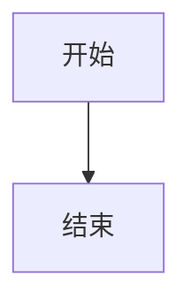

# 展示源码边界用例

> 导出回归基线专用：验证"故意展示的图表源码"不会被误判为"漏渲染的图表"。
> 修 W2（失败可见化 / 识别认领）时最容易误伤此场景，故固化为边界断言。

## 真图（应被渲染、应计入图表数）



## 展示用源码（text 围栏，不应被渲染，也不应被报为漏图）

```text
graph TD
X[这是给读者看的 Mermaid 源码示例] --> Y[不要把我渲染成图]
```
