# 全部图表类型汇总测试

> 本文档包含 7 种图表类型，每种 10 个示例，共 70 个图表。用于全面测试 md-viewer 的渲染能力。

## 1. Mermaid 图表

### 1.1 流程图（TD）

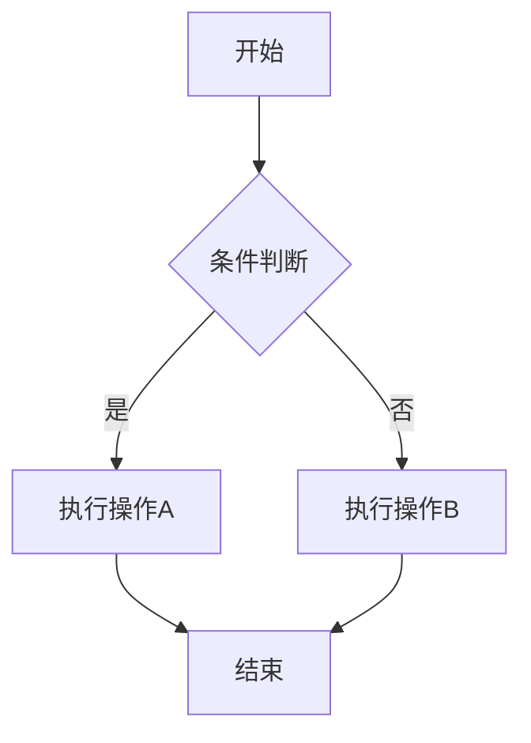

### 1.2 流程图（LR）

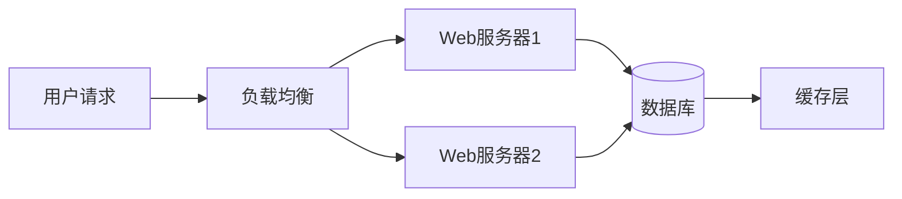

### 1.3 时序图

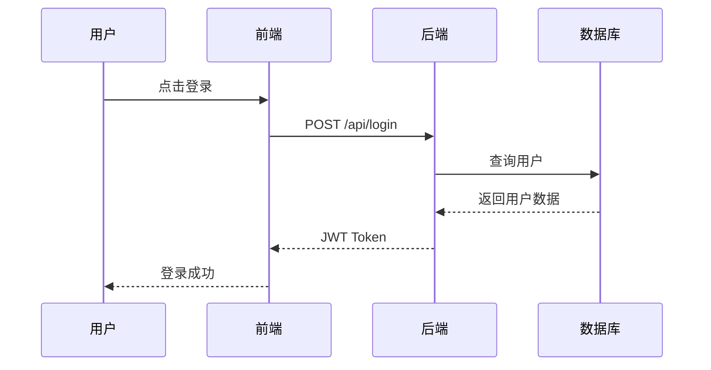

### 1.4 类图

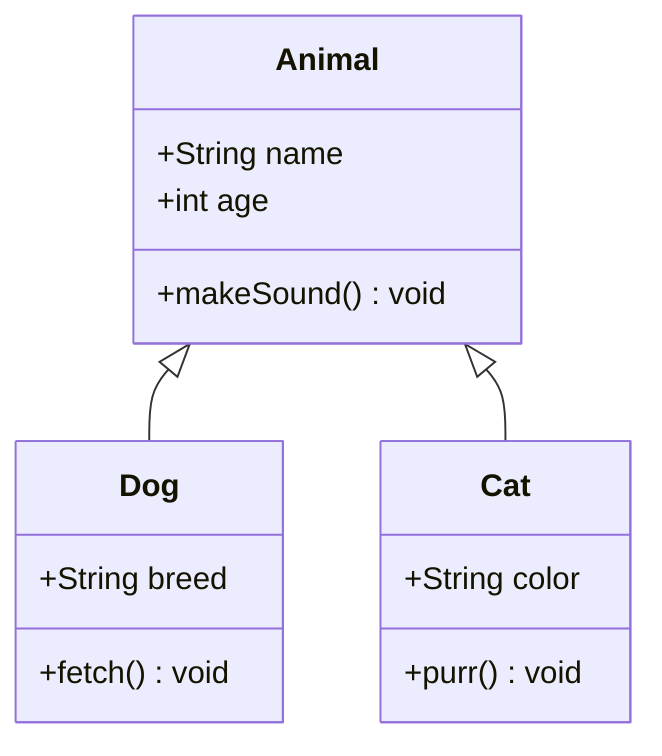

### 1.5 状态图

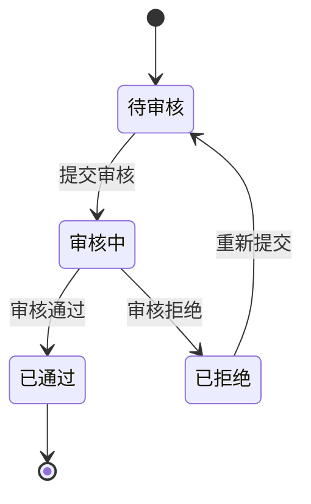

### 1.6 甘特图

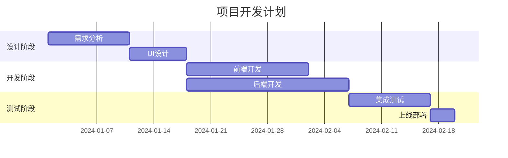

### 1.7 饼图

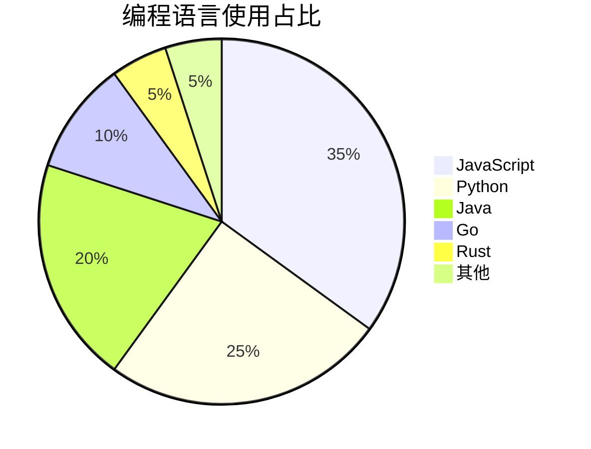

### 1.8 ER 图

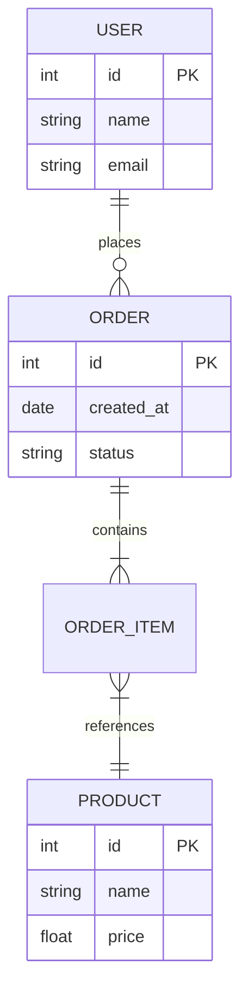

### 1.9 Git 图

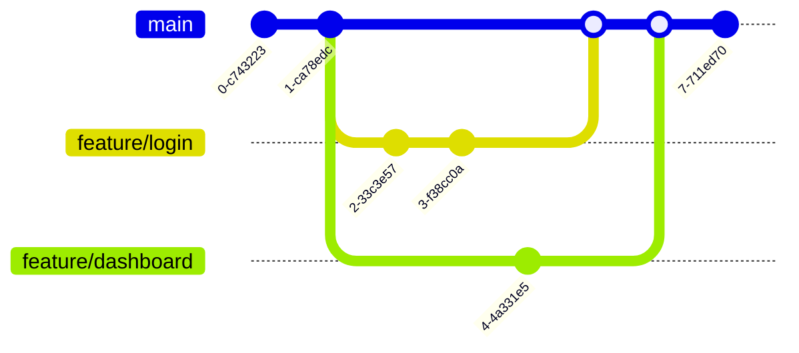

### 1.10 思维导图

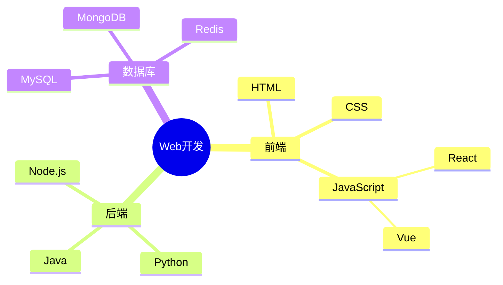

## 2. ECharts 图表

### 2.1 基础柱状图

```echarts
{
  "title": { "text": "月度销售额" },
  "xAxis": { "type": "category", "data": ["1月","2月","3月","4月","5月","6月"] },
  "yAxis": { "type": "value" },
  "series": [{ "type": "bar", "data": [120, 200, 150, 80, 70, 110] }]
}
```

### 2.2 多系列柱状图

```echarts
{
  "title": { "text": "季度对比" },
  "legend": { "data": ["2023", "2024"] },
  "xAxis": { "type": "category", "data": ["Q1","Q2","Q3","Q4"] },
  "yAxis": { "type": "value" },
  "series": [
    { "name": "2023", "type": "bar", "data": [320, 302, 341, 374] },
    { "name": "2024", "type": "bar", "data": [420, 362, 391, 434] }
  ]
}
```

### 2.3 折线图

```echarts
{
  "title": { "text": "访问量趋势" },
  "xAxis": { "type": "category", "data": ["Mon","Tue","Wed","Thu","Fri","Sat","Sun"] },
  "yAxis": { "type": "value" },
  "series": [{
    "type": "line",
    "data": [820, 932, 901, 934, 1290, 1330, 1320],
    "smooth": true
  }]
}
```

### 2.4 饼图

```echarts
{
  "title": { "text": "浏览器市场份额", "left": "center" },
  "series": [{
    "type": "pie",
    "radius": "60%",
    "data": [
      { "value": 63, "name": "Chrome" },
      { "value": 15, "name": "Safari" },
      { "value": 10, "name": "Firefox" },
      { "value": 7, "name": "Edge" },
      { "value": 5, "name": "其他" }
    ]
  }]
}
```

### 2.5 环形图

```echarts
{
  "title": { "text": "项目进度", "left": "center" },
  "series": [{
    "type": "pie",
    "radius": ["40%", "70%"],
    "data": [
      { "value": 60, "name": "已完成" },
      { "value": 25, "name": "进行中" },
      { "value": 15, "name": "未开始" }
    ]
  }]
}
```

### 2.6 散点图

```echarts
{
  "title": { "text": "身高体重分布" },
  "xAxis": { "name": "身高(cm)" },
  "yAxis": { "name": "体重(kg)" },
  "series": [{
    "type": "scatter",
    "symbolSize": 10,
    "data": [[161,51],[167,59],[159,49],[157,63],[155,53],[170,59],[159,47],[166,69],[176,66],[160,75],[172,55],[165,58],[174,70],[163,53],[168,62]]
  }]
}
```

### 2.7 堆叠柱状图

```echarts
{
  "title": { "text": "各部门支出构成" },
  "legend": { "data": ["人力","运营","研发"] },
  "xAxis": { "type": "category", "data": ["技术部","市场部","销售部","行政部"] },
  "yAxis": { "type": "value" },
  "series": [
    { "name": "人力", "type": "bar", "stack": "total", "data": [320, 302, 301, 334] },
    { "name": "运营", "type": "bar", "stack": "total", "data": [120, 132, 101, 134] },
    { "name": "研发", "type": "bar", "stack": "total", "data": [220, 182, 191, 234] }
  ]
}
```

### 2.8 雷达图

```echarts
{
  "title": { "text": "能力评估" },
  "radar": {
    "indicator": [
      { "name": "前端", "max": 100 },
      { "name": "后端", "max": 100 },
      { "name": "数据库", "max": 100 },
      { "name": "DevOps", "max": 100 },
      { "name": "沟通", "max": 100 },
      { "name": "管理", "max": 100 }
    ]
  },
  "series": [{
    "type": "radar",
    "data": [
      { "value": [90, 75, 80, 60, 70, 50], "name": "工程师A" },
      { "value": [70, 90, 85, 80, 60, 65], "name": "工程师B" }
    ]
  }]
}
```

### 2.9 仪表盘

```echarts
{
  "series": [{
    "type": "gauge",
    "detail": { "formatter": "{value}%" },
    "data": [{ "value": 72, "name": "完成率" }],
    "axisLine": { "lineStyle": { "width": 15 } }
  }]
}
```

### 2.10 漏斗图

```echarts
{
  "title": { "text": "转化漏斗" },
  "series": [{
    "type": "funnel",
    "data": [
      { "value": 100, "name": "访问" },
      { "value": 80, "name": "咨询" },
      { "value": 60, "name": "意向" },
      { "value": 40, "name": "下单" },
      { "value": 20, "name": "成交" }
    ]
  }]
}
```

## 3. Markmap 思维导图

### 3.1 水果分类

```markmap
# 水果
## 热带水果
- 芒果
- 菠萝
- 香蕉
## 温带水果
- 苹果
- 梨
- 桃子
## 浆果类
- 草莓
- 蓝莓
- 树莓
```

### 3.2 前端技术栈

```markmap
# 前端技术栈
## 框架
### React
- Next.js
- Remix
### Vue
- Nuxt
- Vite
### Angular
- NestJS
## 样式
### CSS-in-JS
- styled-components
- Emotion
### 原子化CSS
- Tailwind
- UnoCSS
## 构建工具
- Webpack
- Vite
- esbuild
- Turbopack
```

### 3.3 软件架构

```markmap
# 软件架构模式
## 单体架构
- 简单部署
- 适合小项目
## 微服务
- 独立部署
- 技术异构
- 服务发现
## Serverless
- 按需付费
- 自动扩缩
- 冷启动问题
## 事件驱动
- 消息队列
- CQRS
- Event Sourcing
```

### 3.4 计算机科学（深层嵌套）

```markmap
# 计算机科学
## 理论基础
### 算法
#### 排序
##### 比较排序
- 快速排序
- 归并排序
##### 非比较排序
- 计数排序
- 基数排序
#### 搜索
- 二分搜索
- DFS/BFS
### 数据结构
#### 线性
- 数组
- 链表
- 栈/队列
#### 非线性
- 树
- 图
- 哈希表
## 应用领域
### AI/ML
### 网络安全
### 分布式系统
```

### 3.5 项目管理

```markmap
# 项目管理
## 敏捷方法
- Scrum
- Kanban
- XP
## 瀑布模型
- 需求分析
- 设计
- 编码
- 测试
- 维护
## 工具
- Jira
- Trello
- Linear
- Notion
```

### 3.6 中文与特殊字符

```markmap
# 特殊字符测试
## 中文标点
- 逗号：，
- 句号：。
- 引号：“测试”
- 书名号：《红楼梦》
## 数学符号
- 加减：+ -
- 乘除：× ÷
- 不等：≠ ≈ ≤ ≥
## 箭头
- → ← ↑ ↓
- ⇒ ⇐ ⇑ ⇓
```

### 3.7 Emoji 思维导图

```markmap
# 🌍 世界美食
## 🇨🇳 中国
- 🥟 饺子
- 🍜 面条
- 🫕 火锅
## 🇯🇵 日本
- 🍣 寿司
- 🍱 便当
- 🍜 拉面
## 🇮🇹 意大利
- 🍕 披萨
- 🍝 意面
## 🇲🇽 墨西哥
- 🌮 Taco
- 🌯 Burrito
```

### 3.8 数据库设计

```markmap
# 数据库设计
## 关系型
### MySQL
- InnoDB引擎
- 主从复制
### PostgreSQL
- JSONB支持
- 扩展丰富
## NoSQL
### 文档型
- MongoDB
- CouchDB
### 键值型
- Redis
- Memcached
### 列族型
- Cassandra
- HBase
## NewSQL
- TiDB
- CockroachDB
```

### 3.9 编程语言（扁平结构）

```markmap
# 编程语言
## 系统级
- C
- C++
- Rust
- Zig
## 应用级
- Java
- C#
- Go
- Kotlin
## 脚本语言
- Python
- JavaScript
- Ruby
- Lua
## 函数式
- Haskell
- Elixir
- Clojure
- F#
```

### 3.10 Markdown 格式混合

```markmap
# Markdown特性
## **粗体文本**
- *斜体文本*
- ~~删除线~~
## `代码片段`
- `console.log()`
- `print()`
## 链接与图片
- [GitHub](https://github.com)
- [MDN](https://developer.mozilla.org)
## 列表嵌套
- 第一层
  - 第二层
    - 第三层
```

## 4. Graphviz 图表

### 4.1 简单有向图

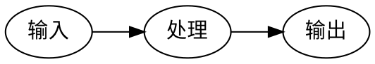

### 4.2 渲染管线

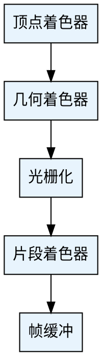

### 4.3 无向图

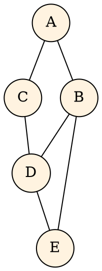

### 4.4 有限状态机

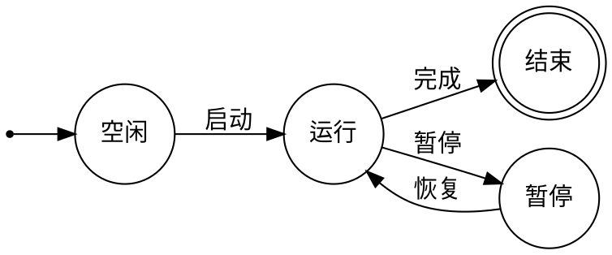

### 4.5 类继承关系

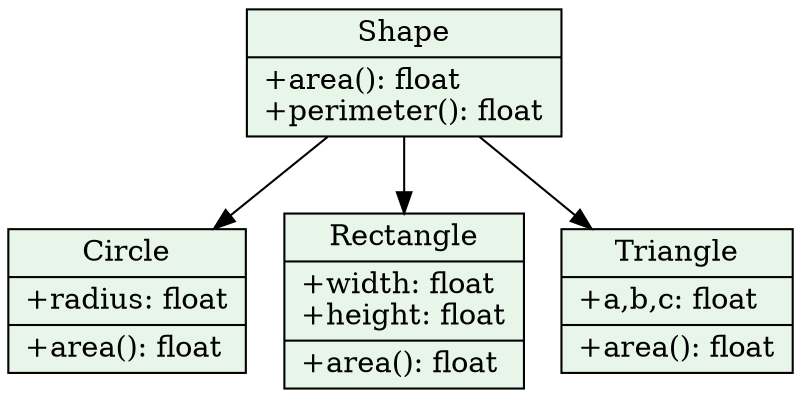

### 4.6 子图架构

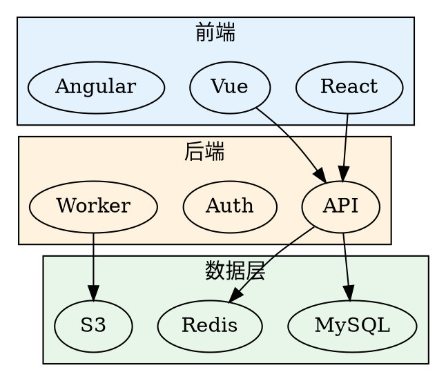

### 4.7 审批流程

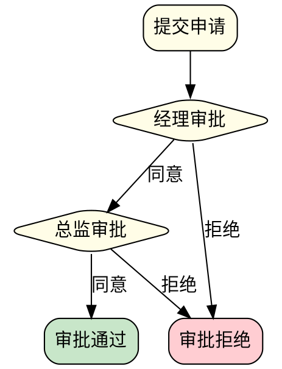

### 4.8 网络拓扑

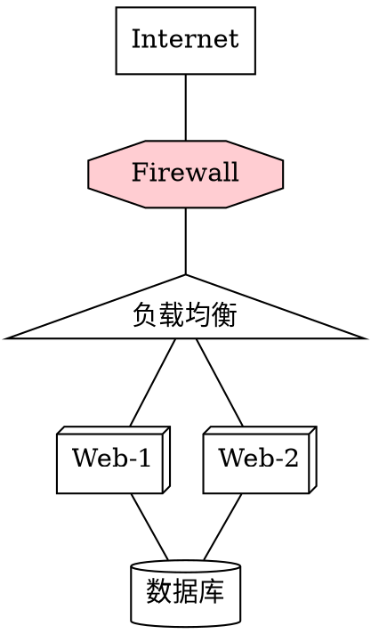

### 4.9 观察者模式

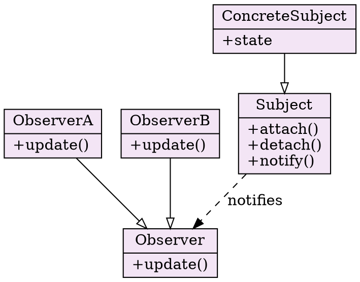

### 4.10 节点形状展示

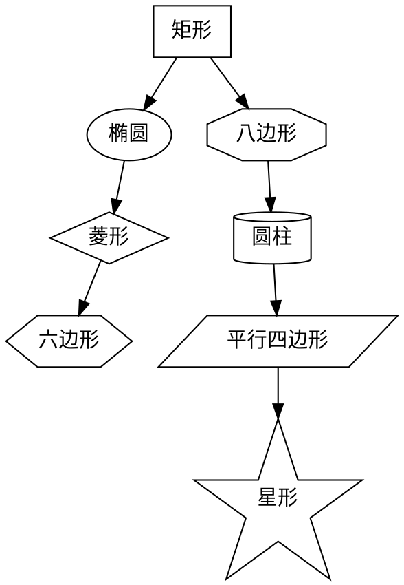

## 5. KaTeX 数学公式

### 5.1 二次方程求根公式

$$
x = \frac{-b \pm \sqrt{b^2 - 4ac}}{2a}
$$

### 5.2 高斯积分

$$
\int_{-\infty}^{\infty} e^{-x^2} dx = \sqrt{\pi}
$$

### 5.3 希腊字母表

$$
\alpha, \beta, \gamma, \delta, \epsilon, \zeta, \eta, \theta, \iota, \kappa, \lambda, \mu
$$

$$
\nu, \xi, \pi, \rho, \sigma, \tau, \upsilon, \phi, \chi, \psi, \omega
$$

### 5.4 求和与连乘

$$
\sum_{i=1}^{n} i = \frac{n(n+1)}{2}
$$

$$
\prod_{i=1}^{n} i = n!
$$

### 5.5 极限

$$
\lim_{n \to \infty} \left(1 + \frac{1}{n}\right)^n = e
$$

$$
\lim_{x \to 0} \frac{\sin x}{x} = 1
$$

### 5.6 矩阵

$$
A = \begin{pmatrix}
a_{11} & a_{12} & a_{13} \\
a_{21} & a_{22} & a_{23} \\
a_{31} & a_{32} & a_{33}
\end{pmatrix}
$$

$$
\det(A) = \begin{vmatrix}
1 & 2 & 3 \\
4 & 5 & 6 \\
7 & 8 & 9
\end{vmatrix}
$$

### 5.7 方程组

$$
\begin{cases}
3x + 2y - z = 1 \\
2x - 2y + 4z = -2 \\
-x + \frac{1}{2}y - z = 0
\end{cases}
$$

### 5.8 三角函数恒等式

$$
\sin^2\theta + \cos^2\theta = 1
$$

$$
\sin(\alpha \pm \beta) = \sin\alpha\cos\beta \pm \cos\alpha\sin\beta
$$

$$
e^{i\theta} = \cos\theta + i\sin\theta
$$

### 5.9 积分公式

$$
\int_0^1 x^n dx = \frac{1}{n+1}
$$

$$
\oint_C \vec{F} \cdot d\vec{r} = \iint_S (\nabla \times \vec{F}) \cdot d\vec{S}
$$

### 5.10 特殊数学符号

$$
\forall x \in \mathbb{R}, \exists y \in \mathbb{Z} : |x - y| < 1
$$

$$
A \cup B = \{x : x \in A \lor x \in B\}
$$

$$
\nabla f = \frac{\partial f}{\partial x}\hat{i} + \frac{\partial f}{\partial y}\hat{j} + \frac{\partial f}{\partial z}\hat{k}
$$

## 6. Infographic 信息图

### 6.1 水平箭头列表

```infographic
infographic list-row-simple-horizontal-arrow
data
  title 产品开发流程
  desc 从需求到上线的完整研发链路
  lists
    - label 需求分析
      desc 收集用户需求并确定优先级
      value 95
    - label UI设计
      desc 完成交互原型与视觉稿
      value 88
    - label 编码开发
      desc 前后端功能实现
      value 75
    - label 测试验收
      desc 功能测试与回归验证
      value 60
    - label 部署上线
      desc 灰度发布与全量推送
      value 40
```

### 6.2 环形进度列表

```infographic
infographic list-row-circular-progress
data
  title 季度KPI完成情况
  lists
    - label 营收目标
      value 85
    - label 用户增长
      value 92
    - label 留存率
      value 78
    - label NPS评分
      value 65
    - label 代码覆盖率
      value 88
    - label 交付准时率
      value 73
```

### 6.3 完成清单

```infographic
infographic list-column-done-list
data
  title Sprint回顾清单
  lists
    - label 用户登录模块
    - label 支付集成
    - label 消息推送
    - label 数据导出
    - label 权限管理
    - label 日志监控
```

### 6.4 垂直图标箭头

```infographic
infographic list-column-vertical-icon-arrow
data
  title 用户注册流程
  desc 从填写信息到开始使用的完整注册链路
  lists
    - label 填写信息
      desc 输入邮箱和密码完成基础注册
    - label 验证邮箱
      desc 点击邮件中的验证链接
    - label 完善资料
      desc 填写个人信息和偏好设置
    - label 开始使用
      desc 进入主界面开始体验
```

### 6.5 徽章卡片网格

```infographic
infographic list-grid-badge-card
data
  title 技术栈概览
  desc 项目核心技术组件与职责说明
  lists
    - label React
      desc 前端UI框架，组件化开发
      value 95
    - label Node.js
      desc 后端运行时，高并发处理
      value 88
    - label PostgreSQL
      desc 关系型数据库，数据持久化
      value 82
    - label Redis
      desc 内存缓存，加速数据访问
      value 90
    - label Docker
      desc 容器化部署，环境一致性
      value 85
    - label Kubernetes
      desc 容器编排，自动扩缩容
      value 78
```

### 6.6 SWOT分析（比较类）

```infographic
infographic compare-swot
data
  title 产品SWOT分析
  desc 全面评估产品的优势劣势与外部机会威胁
  compares
    - label Strengths
      children
        - label 技术壁垒高
        - label 用户体验优秀
        - label 团队执行力强
    - label Weaknesses
      children
        - label 市场知名度低
        - label 资金储备不足
        - label 国际化能力弱
    - label Opportunities
      children
        - label AI赛道高速增长
        - label 政策扶持力度大
        - label 海外市场空白
    - label Threats
      children
        - label 巨头入场竞争
        - label 人才争夺激烈
        - label 监管政策收紧
```

### 6.7 时间线（序列类）

```infographic
infographic sequence-timeline-simple
data
  title CI/CD流水线
  desc 从代码提交到生产发布的自动化流程
  lists
    - label 代码提交
      desc Push到Git仓库触发流水线
      value 100
    - label 自动构建
      desc 编译打包生成制品
      value 95
    - label 单元测试
      desc 运行测试套件验证功能
      value 88
    - label 代码扫描
      desc 安全漏洞与代码质量检查
      value 82
    - label 部署预发
      desc 部署到Staging环境验证
      value 75
    - label 生产发布
      desc 灰度发布到生产环境
      value 60
```

### 6.8 饼图（图表类）

```infographic
infographic chart-pie-plain-text
data
  title 团队技能分布
  values
    - label 前端开发
      value 35
    - label 后端开发
      value 30
    - label DevOps
      value 15
    - label 测试
      value 12
    - label 设计
      value 8
```

### 6.9 流程关系图（关系类）

```infographic
infographic relation-dagre-flow-tb-simple-circle-node
data
  title 微服务调用链路
  desc API网关到各服务的请求流转
  nodes
    - id gateway
      label API Gateway
      desc 统一入口与鉴权
    - id user
      label 用户服务
      desc 认证与用户管理
    - id order
      label 订单服务
      desc 订单创建与管理
    - id payment
      label 支付服务
      desc 支付处理与对账
    - id notify
      label 通知服务
      desc 消息推送与提醒
  relations
    gateway --> user
    gateway --> order
    order --> payment
    payment --> notify
    notify --> user
```

### 6.10 组织架构图（层级类）

```infographic
infographic hierarchy-structure
data
  title 技术部组织架构
  desc 展示技术团队的层级与分工
  root
    label CTO
    children
      - label 前端负责人
        children
          - label Web组
          - label 移动端组
          - label 小程序组
      - label 后端负责人
        children
          - label 业务组
          - label 基础架构组
          - label 数据组
      - label QA负责人
        children
          - label 自动化测试
          - label 手动测试
```

## 7. DrawIO 图表

### 7.1 基础流程图

```drawio
<mxfile host="app.diagrams.net">
  <diagram name="Page-1" id="flow1">
    <mxGraphModel dx="1422" dy="762" grid="1" gridSize="10" guides="1">
      <root>
        <mxCell id="0"/>
        <mxCell id="1" parent="0"/>
        <mxCell id="2" value="开始" style="rounded=1;whiteSpace=wrap;html=1;fillColor=#d5e8d4;strokeColor=#82b366;" vertex="1" parent="1">
          <mxGeometry x="160" y="40" width="120" height="60" as="geometry"/>
        </mxCell>
        <mxCell id="3" value="处理数据" style="rounded=0;whiteSpace=wrap;html=1;fillColor=#dae8fc;strokeColor=#6c8ebf;" vertex="1" parent="1">
          <mxGeometry x="160" y="140" width="120" height="60" as="geometry"/>
        </mxCell>
        <mxCell id="4" value="判断结果" style="rhombus;whiteSpace=wrap;html=1;fillColor=#fff2cc;strokeColor=#d6b656;" vertex="1" parent="1">
          <mxGeometry x="150" y="240" width="140" height="80" as="geometry"/>
        </mxCell>
        <mxCell id="5" value="成功" style="rounded=1;whiteSpace=wrap;html=1;fillColor=#d5e8d4;strokeColor=#82b366;" vertex="1" parent="1">
          <mxGeometry x="40" y="370" width="120" height="60" as="geometry"/>
        </mxCell>
        <mxCell id="6" value="失败" style="rounded=1;whiteSpace=wrap;html=1;fillColor=#f8cecc;strokeColor=#b85450;" vertex="1" parent="1">
          <mxGeometry x="280" y="370" width="120" height="60" as="geometry"/>
        </mxCell>
        <mxCell id="7" value="结束" style="rounded=1;whiteSpace=wrap;html=1;fillColor=#e1d5e7;strokeColor=#9673a6;" vertex="1" parent="1">
          <mxGeometry x="160" y="480" width="120" height="60" as="geometry"/>
        </mxCell>
        <mxCell id="8" edge="1" source="2" target="3" parent="1">
          <mxGeometry relative="1" as="geometry"/>
        </mxCell>
        <mxCell id="9" edge="1" source="3" target="4" parent="1">
          <mxGeometry relative="1" as="geometry"/>
        </mxCell>
        <mxCell id="10" value="是" edge="1" source="4" target="5" parent="1">
          <mxGeometry relative="1" as="geometry"/>
        </mxCell>
        <mxCell id="11" value="否" edge="1" source="4" target="6" parent="1">
          <mxGeometry relative="1" as="geometry"/>
        </mxCell>
        <mxCell id="12" edge="1" source="5" target="7" parent="1">
          <mxGeometry relative="1" as="geometry"/>
        </mxCell>
        <mxCell id="13" edge="1" source="6" target="7" parent="1">
          <mxGeometry relative="1" as="geometry"/>
        </mxCell>
      </root>
    </mxGraphModel>
  </diagram>
</mxfile>
```

### 7.2 UML 类图

```drawio
<mxfile host="app.diagrams.net">
  <diagram name="UML" id="uml1">
    <mxGraphModel dx="1200" dy="700" grid="1" gridSize="10">
      <root>
        <mxCell id="0"/>
        <mxCell id="1" parent="0"/>
        <mxCell id="2" value="&lt;b&gt;Animal&lt;/b&gt;&lt;hr&gt;- name: string&lt;br&gt;- age: number&lt;hr&gt;+ getName(): string&lt;br&gt;+ makeSound(): void" style="shape=note;whiteSpace=wrap;html=1;align=left;spacingLeft=10;fillColor=#f5f5f5;strokeColor=#666666;" vertex="1" parent="1">
          <mxGeometry x="180" y="40" width="200" height="120" as="geometry"/>
        </mxCell>
        <mxCell id="3" value="&lt;b&gt;Dog&lt;/b&gt;&lt;hr&gt;- breed: string&lt;hr&gt;+ fetch(): void&lt;br&gt;+ makeSound(): void" style="shape=note;whiteSpace=wrap;html=1;align=left;spacingLeft=10;fillColor=#dae8fc;strokeColor=#6c8ebf;" vertex="1" parent="1">
          <mxGeometry x="40" y="230" width="200" height="100" as="geometry"/>
        </mxCell>
        <mxCell id="4" value="&lt;b&gt;Cat&lt;/b&gt;&lt;hr&gt;- indoor: boolean&lt;hr&gt;+ purr(): void&lt;br&gt;+ makeSound(): void" style="shape=note;whiteSpace=wrap;html=1;align=left;spacingLeft=10;fillColor=#d5e8d4;strokeColor=#82b366;" vertex="1" parent="1">
          <mxGeometry x="320" y="230" width="200" height="100" as="geometry"/>
        </mxCell>
        <mxCell id="5" style="endArrow=block;endSize=16;endFill=0;" edge="1" source="3" target="2" parent="1">
          <mxGeometry relative="1" as="geometry"/>
        </mxCell>
        <mxCell id="6" style="endArrow=block;endSize=16;endFill=0;" edge="1" source="4" target="2" parent="1">
          <mxGeometry relative="1" as="geometry"/>
        </mxCell>
      </root>
    </mxGraphModel>
  </diagram>
</mxfile>
```

### 7.3 序列图

```drawio
<mxfile host="app.diagrams.net">
  <diagram name="Sequence" id="seq1">
    <mxGraphModel dx="1200" dy="700" grid="1" gridSize="10">
      <root>
        <mxCell id="0"/>
        <mxCell id="1" parent="0"/>
        <mxCell id="2" value="客户端" style="shape=umlLifeline;perimeter=lifelinePerimeter;whiteSpace=wrap;html=1;container=1;collapsible=0;recursiveResize=0;outlineConnect=0;fillColor=#dae8fc;strokeColor=#6c8ebf;" vertex="1" parent="1">
          <mxGeometry x="80" y="40" width="100" height="300" as="geometry"/>
        </mxCell>
        <mxCell id="3" value="API 网关" style="shape=umlLifeline;perimeter=lifelinePerimeter;whiteSpace=wrap;html=1;container=1;collapsible=0;recursiveResize=0;outlineConnect=0;fillColor=#d5e8d4;strokeColor=#82b366;" vertex="1" parent="1">
          <mxGeometry x="260" y="40" width="100" height="300" as="geometry"/>
        </mxCell>
        <mxCell id="4" value="数据库" style="shape=umlLifeline;perimeter=lifelinePerimeter;whiteSpace=wrap;html=1;container=1;collapsible=0;recursiveResize=0;outlineConnect=0;fillColor=#fff2cc;strokeColor=#d6b656;" vertex="1" parent="1">
          <mxGeometry x="440" y="40" width="100" height="300" as="geometry"/>
        </mxCell>
        <mxCell id="5" value="1. 发送请求" style="html=1;verticalAlign=bottom;endArrow=block;" edge="1" parent="1" source="2" target="3">
          <mxGeometry relative="1" as="geometry"><mxPoint y="10" as="offset"/><mxPoint as="sourcePoint"/></mxGeometry>
        </mxCell>
        <mxCell id="6" value="2. 查询数据" style="html=1;verticalAlign=bottom;endArrow=block;" edge="1" parent="1" source="3" target="4">
          <mxGeometry relative="1" as="geometry"><mxPoint y="30" as="offset"/></mxGeometry>
        </mxCell>
        <mxCell id="7" value="3. 返回结果" style="html=1;verticalAlign=bottom;endArrow=open;dashed=1;" edge="1" parent="1" source="4" target="3">
          <mxGeometry relative="1" as="geometry"><mxPoint y="50" as="offset"/></mxGeometry>
        </mxCell>
        <mxCell id="8" value="4. 响应数据" style="html=1;verticalAlign=bottom;endArrow=open;dashed=1;" edge="1" parent="1" source="3" target="2">
          <mxGeometry relative="1" as="geometry"><mxPoint y="70" as="offset"/></mxGeometry>
        </mxCell>
      </root>
    </mxGraphModel>
  </diagram>
</mxfile>
```

### 7.4 组织架构图

```drawio
<mxfile host="app.diagrams.net">
  <diagram name="OrgChart" id="org1">
    <mxGraphModel dx="1200" dy="700" grid="1" gridSize="10">
      <root>
        <mxCell id="0"/>
        <mxCell id="1" parent="0"/>
        <mxCell id="2" value="CEO&#xa;张三" style="shape=mxgraph.org.position;whiteSpace=wrap;html=1;fillColor=#dae8fc;strokeColor=#6c8ebf;" vertex="1" parent="1">
          <mxGeometry x="220" y="20" width="120" height="60" as="geometry"/>
        </mxCell>
        <mxCell id="3" value="CTO&#xa;李四" style="shape=mxgraph.org.position;whiteSpace=wrap;html=1;fillColor=#d5e8d4;strokeColor=#82b366;" vertex="1" parent="1">
          <mxGeometry x="60" y="130" width="120" height="60" as="geometry"/>
        </mxCell>
        <mxCell id="4" value="CFO&#xa;王五" style="shape=mxgraph.org.position;whiteSpace=wrap;html=1;fillColor=#fff2cc;strokeColor=#d6b656;" vertex="1" parent="1">
          <mxGeometry x="220" y="130" width="120" height="60" as="geometry"/>
        </mxCell>
        <mxCell id="5" value="COO&#xa;赵六" style="shape=mxgraph.org.position;whiteSpace=wrap;html=1;fillColor=#f8cecc;strokeColor=#b85450;" vertex="1" parent="1">
          <mxGeometry x="380" y="130" width="120" height="60" as="geometry"/>
        </mxCell>
        <mxCell id="6" value="前端组" style="rounded=1;whiteSpace=wrap;html=1;fillColor=#f5f5f5;strokeColor=#666666;" vertex="1" parent="1">
          <mxGeometry x="10" y="240" width="90" height="40" as="geometry"/>
        </mxCell>
        <mxCell id="7" value="后端组" style="rounded=1;whiteSpace=wrap;html=1;fillColor=#f5f5f5;strokeColor=#666666;" vertex="1" parent="1">
          <mxGeometry x="120" y="240" width="90" height="40" as="geometry"/>
        </mxCell>
        <mxCell id="8" edge="1" source="2" target="3" parent="1"><mxGeometry relative="1" as="geometry"/></mxCell>
        <mxCell id="9" edge="1" source="2" target="4" parent="1"><mxGeometry relative="1" as="geometry"/></mxCell>
        <mxCell id="10" edge="1" source="2" target="5" parent="1"><mxGeometry relative="1" as="geometry"/></mxCell>
        <mxCell id="11" edge="1" source="3" target="6" parent="1"><mxGeometry relative="1" as="geometry"/></mxCell>
        <mxCell id="12" edge="1" source="3" target="7" parent="1"><mxGeometry relative="1" as="geometry"/></mxCell>
      </root>
    </mxGraphModel>
  </diagram>
</mxfile>
```

### 7.5 状态机图

```drawio
<mxfile host="app.diagrams.net">
  <diagram name="StateMachine" id="sm1">
    <mxGraphModel dx="1200" dy="600" grid="1" gridSize="10">
      <root>
        <mxCell id="0"/>
        <mxCell id="1" parent="0"/>
        <mxCell id="2" value="" style="ellipse;fillColor=#000000;strokeColor=#000000;" vertex="1" parent="1">
          <mxGeometry x="40" y="110" width="30" height="30" as="geometry"/>
        </mxCell>
        <mxCell id="3" value="待支付" style="rounded=1;whiteSpace=wrap;html=1;fillColor=#fff2cc;strokeColor=#d6b656;" vertex="1" parent="1">
          <mxGeometry x="120" y="100" width="100" height="50" as="geometry"/>
        </mxCell>
        <mxCell id="4" value="已支付" style="rounded=1;whiteSpace=wrap;html=1;fillColor=#d5e8d4;strokeColor=#82b366;" vertex="1" parent="1">
          <mxGeometry x="280" y="100" width="100" height="50" as="geometry"/>
        </mxCell>
        <mxCell id="5" value="已发货" style="rounded=1;whiteSpace=wrap;html=1;fillColor=#dae8fc;strokeColor=#6c8ebf;" vertex="1" parent="1">
          <mxGeometry x="440" y="100" width="100" height="50" as="geometry"/>
        </mxCell>
        <mxCell id="6" value="已完成" style="rounded=1;whiteSpace=wrap;html=1;fillColor=#d5e8d4;strokeColor=#82b366;strokeWidth=3;" vertex="1" parent="1">
          <mxGeometry x="440" y="210" width="100" height="50" as="geometry"/>
        </mxCell>
        <mxCell id="7" value="已取消" style="rounded=1;whiteSpace=wrap;html=1;fillColor=#f8cecc;strokeColor=#b85450;" vertex="1" parent="1">
          <mxGeometry x="120" y="210" width="100" height="50" as="geometry"/>
        </mxCell>
        <mxCell id="8" value="创建" edge="1" source="2" target="3" parent="1"><mxGeometry relative="1" as="geometry"/></mxCell>
        <mxCell id="9" value="支付" edge="1" source="3" target="4" parent="1"><mxGeometry relative="1" as="geometry"/></mxCell>
        <mxCell id="10" value="发货" edge="1" source="4" target="5" parent="1"><mxGeometry relative="1" as="geometry"/></mxCell>
        <mxCell id="11" value="确认收货" edge="1" source="5" target="6" parent="1"><mxGeometry relative="1" as="geometry"/></mxCell>
        <mxCell id="12" value="取消" style="dashed=1;" edge="1" source="3" target="7" parent="1"><mxGeometry relative="1" as="geometry"/></mxCell>
      </root>
    </mxGraphModel>
  </diagram>
</mxfile>
```

### 7.6 dio 别名测试

```dio
<mxGraphModel dx="800" dy="400" grid="1" gridSize="10">
  <root>
    <mxCell id="0"/>
    <mxCell id="1" parent="0"/>
    <mxCell id="2" value="A" style="ellipse;whiteSpace=wrap;html=1;fillColor=#dae8fc;strokeColor=#6c8ebf;" vertex="1" parent="1">
      <mxGeometry x="40" y="40" width="80" height="80" as="geometry"/>
    </mxCell>
    <mxCell id="3" value="B" style="ellipse;whiteSpace=wrap;html=1;fillColor=#d5e8d4;strokeColor=#82b366;" vertex="1" parent="1">
      <mxGeometry x="200" y="40" width="80" height="80" as="geometry"/>
    </mxCell>
    <mxCell id="4" value="C" style="ellipse;whiteSpace=wrap;html=1;fillColor=#fff2cc;strokeColor=#d6b656;" vertex="1" parent="1">
      <mxGeometry x="360" y="40" width="80" height="80" as="geometry"/>
    </mxCell>
    <mxCell id="5" value="" edge="1" source="2" target="3" parent="1">
      <mxGeometry relative="1" as="geometry"/>
    </mxCell>
    <mxCell id="6" value="" edge="1" source="3" target="4" parent="1">
      <mxGeometry relative="1" as="geometry"/>
    </mxCell>
  </root>
</mxGraphModel>
```

### 7.7 仅 mxGraphModel

```drawio
<mxGraphModel>
  <root>
    <mxCell id="0"/>
    <mxCell id="1" parent="0"/>
    <mxCell id="2" value="节点 1" style="rounded=1;whiteSpace=wrap;html=1;" vertex="1" parent="1">
      <mxGeometry x="40" y="40" width="120" height="60" as="geometry"/>
    </mxCell>
    <mxCell id="3" value="节点 2" style="rounded=1;whiteSpace=wrap;html=1;" vertex="1" parent="1">
      <mxGeometry x="240" y="40" width="120" height="60" as="geometry"/>
    </mxCell>
    <mxCell id="4" value="连接" edge="1" source="2" target="3" parent="1">
      <mxGeometry relative="1" as="geometry"/>
    </mxCell>
  </root>
</mxGraphModel>
```

### 7.8 丰富样式测试

```drawio
<mxfile host="app.diagrams.net">
  <diagram name="Styles" id="style1">
    <mxGraphModel dx="1400" dy="800" grid="1" gridSize="10">
      <root>
        <mxCell id="0"/>
        <mxCell id="1" parent="0"/>
        <mxCell id="2" value="渐变填充" style="rounded=1;whiteSpace=wrap;html=1;fillColor=#dae8fc;gradientColor=#7ea6e0;gradientDirection=south;strokeColor=#6c8ebf;fontSize=14;fontStyle=1;" vertex="1" parent="1">
          <mxGeometry x="20" y="20" width="140" height="60" as="geometry"/>
        </mxCell>
        <mxCell id="3" value="阴影效果" style="rounded=1;whiteSpace=wrap;html=1;fillColor=#d5e8d4;strokeColor=#82b366;shadow=1;fontSize=14;" vertex="1" parent="1">
          <mxGeometry x="200" y="20" width="140" height="60" as="geometry"/>
        </mxCell>
        <mxCell id="4" value="大圆角" style="rounded=1;whiteSpace=wrap;html=1;fillColor=#fff2cc;strokeColor=#d6b656;arcSize=50;fontSize=14;" vertex="1" parent="1">
          <mxGeometry x="380" y="20" width="140" height="60" as="geometry"/>
        </mxCell>
        <mxCell id="5" value="虚线边框" style="rounded=0;whiteSpace=wrap;html=1;fillColor=#f5f5f5;strokeColor=#666666;dashed=1;dashPattern=5 5;fontSize=14;" vertex="1" parent="1">
          <mxGeometry x="560" y="20" width="140" height="60" as="geometry"/>
        </mxCell>
        <mxCell id="6" value="粗线条" style="rounded=0;whiteSpace=wrap;html=1;fillColor=#f8cecc;strokeColor=#b85450;strokeWidth=4;fontSize=14;" vertex="1" parent="1">
          <mxGeometry x="20" y="120" width="140" height="60" as="geometry"/>
        </mxCell>
        <mxCell id="7" value="小字体" style="rounded=0;whiteSpace=wrap;html=1;fillColor=#e1d5e7;strokeColor=#9673a6;fontSize=8;" vertex="1" parent="1">
          <mxGeometry x="200" y="120" width="140" height="60" as="geometry"/>
        </mxCell>
        <mxCell id="8" value="大字体" style="rounded=0;whiteSpace=wrap;html=1;fillColor=#dae8fc;strokeColor=#6c8ebf;fontSize=24;fontStyle=1;" vertex="1" parent="1">
          <mxGeometry x="380" y="120" width="140" height="60" as="geometry"/>
        </mxCell>
        <mxCell id="9" value="红色文字" style="rounded=0;whiteSpace=wrap;html=1;fillColor=#f5f5f5;strokeColor=#666666;fontColor=#FF0000;fontSize=14;fontStyle=1;" vertex="1" parent="1">
          <mxGeometry x="560" y="120" width="140" height="60" as="geometry"/>
        </mxCell>
        <mxCell id="10" value="半透明" style="rounded=1;whiteSpace=wrap;html=1;fillColor=#dae8fc;strokeColor=#6c8ebf;opacity=50;fontSize=14;" vertex="1" parent="1">
          <mxGeometry x="20" y="220" width="140" height="60" as="geometry"/>
        </mxCell>
        <mxCell id="11" value="点线边框" style="rounded=0;whiteSpace=wrap;html=1;fillColor=#d5e8d4;strokeColor=#82b366;dashed=1;dashPattern=1 4;fontSize=14;" vertex="1" parent="1">
          <mxGeometry x="200" y="220" width="140" height="60" as="geometry"/>
        </mxCell>
        <mxCell id="12" value="双线边框" style="rounded=0;whiteSpace=wrap;html=1;fillColor=#fff2cc;strokeColor=#d6b656;strokeWidth=2;fontSize=14;fontStyle=5;" vertex="1" parent="1">
          <mxGeometry x="380" y="220" width="140" height="60" as="geometry"/>
        </mxCell>
        <mxCell id="13" value="无边框" style="rounded=1;whiteSpace=wrap;html=1;fillColor=#e1d5e7;strokeColor=none;fontSize=14;" vertex="1" parent="1">
          <mxGeometry x="560" y="220" width="140" height="60" as="geometry"/>
        </mxCell>
        <mxCell id="14" value="渐变+阴影" style="rounded=1;whiteSpace=wrap;html=1;fillColor=#f8cecc;gradientColor=#ea6b66;strokeColor=#b85450;shadow=1;fontSize=14;fontColor=#FFFFFF;fontStyle=1;" vertex="1" parent="1">
          <mxGeometry x="20" y="320" width="140" height="60" as="geometry"/>
        </mxCell>
        <mxCell id="15" value="斜体+下划线" style="rounded=0;whiteSpace=wrap;html=1;fillColor=#dae8fc;strokeColor=#6c8ebf;fontSize=14;fontStyle=6;" vertex="1" parent="1">
          <mxGeometry x="200" y="320" width="140" height="60" as="geometry"/>
        </mxCell>
      </root>
    </mxGraphModel>
  </diagram>
</mxfile>
```

### 7.9 HTML 富文本节点

```drawio
<mxfile host="app.diagrams.net">
  <diagram name="RichText" id="rich1">
    <mxGraphModel dx="1400" dy="800" grid="1" gridSize="10">
      <root>
        <mxCell id="0"/>
        <mxCell id="1" parent="0"/>
        <mxCell id="2" value="&lt;b&gt;加粗文本&lt;/b&gt;&lt;br&gt;&lt;i&gt;斜体文本&lt;/i&gt;&lt;br&gt;&lt;u&gt;下划线文本&lt;/u&gt;" style="rounded=1;whiteSpace=wrap;html=1;fillColor=#dae8fc;strokeColor=#6c8ebf;fontSize=12;" vertex="1" parent="1">
          <mxGeometry x="20" y="20" width="180" height="80" as="geometry"/>
        </mxCell>
        <mxCell id="3" value="&lt;font color=&quot;#FF0000&quot;&gt;红色&lt;/font&gt; + &lt;font color=&quot;#0000FF&quot;&gt;蓝色&lt;/font&gt; + &lt;font color=&quot;#009900&quot;&gt;绿色&lt;/font&gt;" style="rounded=1;whiteSpace=wrap;html=1;fillColor=#f5f5f5;strokeColor=#666666;fontSize=12;" vertex="1" parent="1">
          <mxGeometry x="240" y="20" width="200" height="80" as="geometry"/>
        </mxCell>
        <mxCell id="4" value="&lt;font style=&quot;font-size: 18px;&quot;&gt;大号&lt;/font&gt;&lt;br&gt;&lt;font style=&quot;font-size: 10px;&quot;&gt;小号文字&lt;/font&gt;&lt;br&gt;&lt;font style=&quot;font-size: 14px;&quot;&gt;中号文字&lt;/font&gt;" style="rounded=1;whiteSpace=wrap;html=1;fillColor=#d5e8d4;strokeColor=#82b366;" vertex="1" parent="1">
          <mxGeometry x="480" y="20" width="160" height="80" as="geometry"/>
        </mxCell>
        <mxCell id="5" value="&lt;ul&gt;&lt;li&gt;项目一&lt;/li&gt;&lt;li&gt;项目二&lt;/li&gt;&lt;li&gt;项目三&lt;/li&gt;&lt;/ul&gt;" style="rounded=1;whiteSpace=wrap;html=1;fillColor=#fff2cc;strokeColor=#d6b656;align=left;spacingLeft=5;fontSize=12;" vertex="1" parent="1">
          <mxGeometry x="20" y="140" width="160" height="100" as="geometry"/>
        </mxCell>
        <mxCell id="6" value="&lt;a href=&quot;https://example.com&quot;&gt;点击链接&lt;/a&gt;&lt;br&gt;&lt;br&gt;&lt;b&gt;&lt;i&gt;加粗斜体&lt;/i&gt;&lt;/b&gt;&lt;br&gt;&lt;s&gt;删除线&lt;/s&gt;" style="rounded=1;whiteSpace=wrap;html=1;fillColor=#f8cecc;strokeColor=#b85450;fontSize=12;" vertex="1" parent="1">
          <mxGeometry x="220" y="140" width="160" height="100" as="geometry"/>
        </mxCell>
        <mxCell id="7" value="&lt;table&gt;&lt;tr&gt;&lt;td&gt;A1&lt;/td&gt;&lt;td&gt;B1&lt;/td&gt;&lt;/tr&gt;&lt;tr&gt;&lt;td&gt;A2&lt;/td&gt;&lt;td&gt;B2&lt;/td&gt;&lt;/tr&gt;&lt;/table&gt;" style="rounded=1;whiteSpace=wrap;html=1;fillColor=#e1d5e7;strokeColor=#9673a6;fontSize=12;" vertex="1" parent="1">
          <mxGeometry x="420" y="140" width="160" height="100" as="geometry"/>
        </mxCell>
        <mxCell id="8" value="&lt;sup&gt;上标&lt;/sup&gt; 正常 &lt;sub&gt;下标&lt;/sub&gt;&lt;br&gt;&lt;br&gt;&lt;code&gt;console.log()&lt;/code&gt;" style="rounded=1;whiteSpace=wrap;html=1;fillColor=#dae8fc;strokeColor=#6c8ebf;fontSize=12;" vertex="1" parent="1">
          <mxGeometry x="620" y="140" width="160" height="100" as="geometry"/>
        </mxCell>
        <mxCell id="re1" edge="1" source="2" target="3" parent="1"><mxGeometry relative="1" as="geometry"/></mxCell>
        <mxCell id="re2" edge="1" source="3" target="4" parent="1"><mxGeometry relative="1" as="geometry"/></mxCell>
        <mxCell id="re3" edge="1" source="5" target="6" parent="1"><mxGeometry relative="1" as="geometry"/></mxCell>
        <mxCell id="re4" edge="1" source="6" target="7" parent="1"><mxGeometry relative="1" as="geometry"/></mxCell>
        <mxCell id="re5" edge="1" source="7" target="8" parent="1"><mxGeometry relative="1" as="geometry"/></mxCell>
      </root>
    </mxGraphModel>
  </diagram>
</mxfile>
```

### 7.10 Unicode 特殊字符

```drawio
<mxfile host="app.diagrams.net">
  <diagram name="Unicode" id="unicode1">
    <mxGraphModel dx="1400" dy="800" grid="1" gridSize="10">
      <root>
        <mxCell id="0"/>
        <mxCell id="1" parent="0"/>
        <mxCell id="2" value="中文：你好世界" style="rounded=1;whiteSpace=wrap;html=1;fillColor=#dae8fc;strokeColor=#6c8ebf;fontSize=14;" vertex="1" parent="1">
          <mxGeometry x="20" y="20" width="160" height="50" as="geometry"/>
        </mxCell>
        <mxCell id="3" value="日本語：こんにちは" style="rounded=1;whiteSpace=wrap;html=1;fillColor=#d5e8d4;strokeColor=#82b366;fontSize=14;" vertex="1" parent="1">
          <mxGeometry x="220" y="20" width="180" height="50" as="geometry"/>
        </mxCell>
        <mxCell id="4" value="한국어：안녕하세요" style="rounded=1;whiteSpace=wrap;html=1;fillColor=#fff2cc;strokeColor=#d6b656;fontSize=14;" vertex="1" parent="1">
          <mxGeometry x="440" y="20" width="180" height="50" as="geometry"/>
        </mxCell>
        <mxCell id="5" value="Emoji: &#x1F600;&#x1F680;&#x2B50;&#x2764;&#xFE0F;&#x1F389;" style="rounded=1;whiteSpace=wrap;html=1;fillColor=#f8cecc;strokeColor=#b85450;fontSize=14;" vertex="1" parent="1">
          <mxGeometry x="20" y="110" width="200" height="50" as="geometry"/>
        </mxCell>
        <mxCell id="6" value="数学：&#x03B1; + &#x03B2; = &#x03B3;  &#x2211; &#x222B; &#x221E; &#x2202; &#x2260; &#x2264; &#x2265;" style="rounded=1;whiteSpace=wrap;html=1;fillColor=#e1d5e7;strokeColor=#9673a6;fontSize=13;" vertex="1" parent="1">
          <mxGeometry x="260" y="110" width="280" height="50" as="geometry"/>
        </mxCell>
        <mxCell id="7" value="XML特殊字符：&amp;amp; &amp;lt; &amp;gt; &amp;quot; &amp;apos;" style="rounded=1;whiteSpace=wrap;html=1;fillColor=#f5f5f5;strokeColor=#666666;fontSize=12;" vertex="1" parent="1">
          <mxGeometry x="20" y="200" width="280" height="50" as="geometry"/>
        </mxCell>
        <mxCell id="8" value="Русский: Привет мир" style="rounded=1;whiteSpace=wrap;html=1;fillColor=#dae8fc;strokeColor=#6c8ebf;fontSize=14;" vertex="1" parent="1">
          <mxGeometry x="340" y="200" width="200" height="50" as="geometry"/>
        </mxCell>
        <mxCell id="9" value="العربية: مرحبا" style="rounded=1;whiteSpace=wrap;html=1;fillColor=#d5e8d4;strokeColor=#82b366;fontSize=14;" vertex="1" parent="1">
          <mxGeometry x="580" y="200" width="160" height="50" as="geometry"/>
        </mxCell>
        <mxCell id="ue1" edge="1" source="2" target="3" parent="1"><mxGeometry relative="1" as="geometry"/></mxCell>
        <mxCell id="ue2" edge="1" source="3" target="4" parent="1"><mxGeometry relative="1" as="geometry"/></mxCell>
        <mxCell id="ue3" edge="1" source="5" target="6" parent="1"><mxGeometry relative="1" as="geometry"/></mxCell>
        <mxCell id="ue4" edge="1" source="7" target="8" parent="1"><mxGeometry relative="1" as="geometry"/></mxCell>
        <mxCell id="ue5" edge="1" source="8" target="9" parent="1"><mxGeometry relative="1" as="geometry"/></mxCell>
      </root>
    </mxGraphModel>
  </diagram>
</mxfile>
```
