# AI 架构图生成参考库与渲染质量基准

> 本文件有两个用途：既是 MD Viewer 的离线图表渲染 fixture，也是可以在 Claude Code 中通过 `@e2e/fixtures/test-diagram-design.md` 引用的架构图生成参考库。
>
> 生成新图时应迁移案例的**表达模型、布局策略和连线语义**，不要照抄案例中的业务名称。`md-case-*` 是自动化测试锚点，普通 Markdown 输出中禁止复制。

当前包含 **93 个可执行正例**，覆盖 9 种离线图表语言：D2 15、Graphviz 13、Mermaid 16、Structurizr 9、DBML 9、AntV G6 5、DrawIO 13、SVG 10、Markmap 3。这里的案例强调结构质量和可迁移性；其他 fixture 可能包含压力输入、极端尺寸或故意错误，不应直接当作 AI 设计模板。

## 1. 在 Claude Code 中如何使用

把本文件与真实需求、源码或现有文档一起提供给 AI。例如：

```text
请参考 @e2e/fixtures/test-diagram-design.md 的选择规则和最接近的正例，
根据 @src/... 的真实组件与调用关系生成一张架构图。
先确认这张图要回答的问题，再选择图形语言；不要虚构不存在的服务或关系。
输出一个可直接粘贴到 Markdown 的代码围栏，不要输出 md-case-* 测试锚点。
```

使用时遵循以下优先级：

1. 用户明确指定语言或图类型时，服从用户选择。
2. 用户未指定时，根据“要回答的问题”选择语言，而不是默认全部使用 Mermaid。
3. 案例与代码冲突时，以代码和用户提供的事实为准。
4. 信息不足时明确列出假设，不为追求视觉完整而虚构组件。

### 1.1 如何指定一个或多个参考案例

每个案例都有稳定的**案例键**，即测试 marker 去掉 `md-case-` 前缀，例如 `drawio-composable-capability-map`。普通输出只引用案例键，不复制 marker HTML。

- 单案例决定图的语言、主阅读方向、分区和主要视觉语法。
- `主案例 + 辅助案例` 时，左侧案例决定版式，右侧案例只补充关系语义、异常路径或治理元素。
- 一张图不能把两种 DSL 拼进同一代码围栏；若两个案例抽象层级不同，应输出两个相互配合的视角。
- 一次最多组合三个案例；组件、关系和约束始终以用户的真实需求、源码与文档为准。

```text
请以 drawio-strangler-cdc-migration 为主布局，
吸收 graphviz-expand-contract-schema-migration 的阶段依赖，
基于真实系统生成一张迁移图。
```

### 1.2 常见任务的组合参考

| 任务 | 推荐案例组合 | 分工 |
|---|---|---|
| 多租户 SaaS | `structurizr-saas-control-data-plane` + `antv-g6-multi-tenant-cell-isolation` | 静态容器边界 + 运行时 Cell 拓扑 |
| 隐私与数据生命周期 | `d2-data-residency-sovereignty` + `mermaid-privacy-erasure-workflow` + `dbml-privacy-consent-retention-erasure` | 地域边界 + 操作流程 + 数据约束 |
| 渐进式遗留迁移 | `drawio-strangler-cdc-migration` + `graphviz-expand-contract-schema-migration` | 交付级总体版式 + 严格阶段依赖 |
| DDD 设计 | `d2-ddd-context-map` + `mermaid-ddd-aggregate-class-model` | 战略上下文 + 战术聚合模型 |
| Agent 工具安全 | `d2-agent-platform-control-data-plane` + `mermaid-agent-tool-authorization-sequence` | 静态信任边界 + 动态授权时序 |
| AI 平台编辑式总览 | `svg-editorial-platform-architecture` + `d2-agent-platform-control-data-plane` | 精确视觉总览 + 控制/执行边界语义 |
| 架构方案决策 | `svg-architecture-tradeoff-decision-canvas` + `markmap-quality-attribute-tradeoffs` | 硬约束下的候选比较 + 质量属性讨论框架 |
| 事故恢复编排 | `svg-incident-recovery-multi-plane-storyboard` + `graphviz-incident-cause-tree` | 多平面恢复门禁 + 原因与证据树 |
| 领域事件探索 | `svg-event-storming-domain-flow` + `d2-ddd-context-map` | 命令/事件/策略叙事 + 上下文契约 |
| 用户旅程与系统协作 | `svg-service-blueprint-export-journey` + `structurizr-c4-container` | 前后台服务蓝图 + 稳定容器边界 |
| 迁移组合分波 | `svg-migration-portfolio-wave-map` + `drawio-strangler-cdc-migration` | 组合优先级与波次 + 单系统迁移机制 |
| 团队交互与平台边界 | `svg-team-topology-interaction-map` + `structurizr-internal-developer-platform-landscape` | 团队认知负载/交互模式 + 平台能力景观 |
| 容量与饱和预算 | `svg-capacity-budget-saturation-corridor` + `drawio-performance-governance-loop` | 同单位容量刻度 + 压测与生产反馈闭环 |
| 故障传播与隔离 | `svg-failure-propagation-blast-radius-overlay` + `drawio-high-availability-dr` | 实测爆炸半径叠层 + 故障域与切换机制 |
| 单元迁移一致性 | `svg-state-data-migration-visibility-overlay` + `drawio-strangler-cdc-migration` | 水位/可见性/回滚窗口 + 迁移交付全貌 |
| GitOps 与供应链 | `mermaid-gitops-environment-promotion` + `graphviz-software-supply-chain-provenance` | 环境晋级 + 制品证明链 |
| API 生命周期 | `mermaid-api-version-deprecation-gantt` + `dbml-api-contract-version-subscription` | 时间窗口 + 契约数据模型 |
| FinOps | `mermaid-finops-cost-allocation-sankey` + `markmap-finops-operating-model` | 成本流向 + 运营责任体系 |
| 部署实施与验收 | `drawio-phased-implementation-roadmap` + `drawio-image-promotion-rollout` + `drawio-deployment-test-acceptance-flow` | 项目阶段 + 制品晋级 + 测试验收闭环 |


### 1.3 完整案例目录

在提示中引用“案例键”即可定位正例；案例键稳定且不含 fixture-only 的 `md-case-` 前缀。复杂度 `M/H/X` 分别表示机制图、分区/反馈图和交付级人工布局图。

| 案例键 | 语言 | 主要问题 / 图形模式 | 复杂度 |
|---|---|---|:---:|
| `d2-architecture-zoned-flow` | D2 | 分区架构与主路径 | M |
| `d2-layered-system` | D2 | 分层系统：订单平台 | M |
| `d2-hexagonal-architecture` | D2 | 六边形架构：履约核心 | M |
| `d2-event-driven` | D2 | 事件驱动：订单事件闭环 | M |
| `d2-plugin-platform` | D2 | 插件体系：文档渲染平台 | M |
| `d2-zero-trust` | D2 | 零信任边界：内部服务访问 | M |
| `d2-multi-region` | D2 | 多区域部署：主动服务与灾备 | M |
| `d2-local-first-sync` | D2 | 本地优先同步：离线文档协作 | M |
| `d2-observability` | D2 | 可观测性：遥测到告警闭环 | M |
| `d2-data-pipeline` | D2 | 数据管道：批流一体分析 | M |
| `d2-ai-rag-pipeline` | D2 | AI/RAG 管道：知识问答 | M |
| `d2-ddd-context-map` | D2 | DDD 战略设计：上下文映射与集成模式 | M |
| `d2-data-residency-sovereignty` | D2 | 数据驻留与主权：全球控制、区域处理 | H |
| `d2-agent-platform-control-data-plane` | D2 | Agent 平台：控制平面、执行平面与人工接管 | H |
| `d2-serverless-concurrency-guardrails` | D2 | Serverless 并发与成本护栏 | H |
| `graphviz-dependency-ranks-cycle` | Graphviz | 分层依赖、汇聚与回边 | M |
| `graphviz-build-dag` | Graphviz | 构建 DAG：并行任务与汇合产物 | M |
| `graphviz-module-fanin-fanout` | Graphviz | 模块依赖：扇入、共享核心与扇出 | M |
| `graphviz-active-standby-failover` | Graphviz | 主备故障转移：流量、探测与复制 | M |
| `graphviz-compiler-pipeline` | Graphviz | 编译器流水线：阶段、表示与诊断出口 | M |
| `graphviz-permission-decision-tree` | Graphviz | 权限决策树：逐级判定与可解释拒绝 | M |
| `graphviz-incident-cause-tree` | Graphviz | 事故原因树：AND/OR 门与证据强度 | M |
| `graphviz-release-gates` | Graphviz | 发布门禁：验证、审批、灰度与回滚 | M |
| `graphviz-service-circuit-feedback` | Graphviz | 服务依赖与熔断回边：调用、反馈与降级 | M |
| `graphviz-backpressure-bulkhead-feedback` | Graphviz | 背压、舱壁与有界过载反馈 | M |
| `graphviz-software-supply-chain-provenance` | Graphviz | 软件供应链：制品、SBOM 与来源证明 | M |
| `graphviz-expand-contract-schema-migration` | Graphviz | Expand/Contract：零停机 Schema 迁移 | M |
| `graphviz-quorum-consensus-recovery` | Graphviz | 多数派共识：提交、分区与副本恢复 | M |
| `mermaid-sequence-alt-refresh` | Mermaid | 令牌刷新与异步审计 | M |
| `mermaid-sync-export-sequence` | Mermaid | 同步导出端到端时序 | M |
| `mermaid-cache-miss-read-through` | Mermaid | Read-through 缓存 Miss | M |
| `mermaid-outbox-event-delivery` | Mermaid | Outbox 事件发布与幂等消费 | M |
| `mermaid-cicd-progressive-delivery` | Mermaid | CI/CD 渐进式交付流水线 | M |
| `mermaid-file-authorization-boundary` | Mermaid | 文件访问授权边界 | M |
| `mermaid-circuit-breaker-fallback` | Mermaid | 熔断器与有界降级 | M |
| `mermaid-document-lifecycle-state` | Mermaid | 文档生命周期 | M |
| `mermaid-task-retry-state-machine` | Mermaid | 任务重试状态机 | M |
| `mermaid-saga-compensation-sequence` | Mermaid | 编排式 Saga：成功链、逆序补偿与人工修复 | M |
| `mermaid-agent-tool-authorization-sequence` | Mermaid | Agent 工具调用：授权、短期凭证与隔离执行 | M |
| `mermaid-privacy-erasure-workflow` | Mermaid | 隐私删除：法律保留、跨存储执行与删除证明 | M |
| `mermaid-ddd-aggregate-class-model` | Mermaid | DDD 战术设计：聚合、值对象与端口 | H |
| `mermaid-gitops-environment-promotion` | Mermaid | GitOps：不可变制品的环境晋级 | M |
| `mermaid-api-version-deprecation-gantt` | Mermaid | API 版本发布与退役窗口 | M |
| `mermaid-finops-cost-allocation-sankey` | Mermaid | FinOps：成本归集与二次分摊 | M |
| `structurizr-c4-context` | Structurizr | C4 系统上下文：全渠道零售平台 | M |
| `structurizr-c4-container` | Structurizr | C4 容器：模块化单体到服务化交易平台 | M |
| `structurizr-c4-component` | Structurizr | C4 组件：订单 API 内部协作 | M |
| `structurizr-deployment-nodes` | Structurizr | 部署节点：多可用区订单生产环境 | M |
| `structurizr-event-driven` | Structurizr | 事件驱动：订单事件骨干与受控重放 | M |
| `structurizr-data-platform-governance` | Structurizr | 数据平台治理：湖仓分层与策略门禁 | M |
| `structurizr-internal-developer-platform-landscape` | Structurizr | 内部开发者平台：自助能力与运行反馈 | M |
| `structurizr-saas-control-data-plane` | Structurizr | SaaS 控制平面与租户数据平面 | M |
| `structurizr-mlops-model-serving-platform` | Structurizr | MLOps：训练、模型推广与在线回滚 | M |
| `dbml-db-schema-row-fk` | DBML | 多租户文档与导出数据模型 | M |
| `dbml-saas-tenant-rbac` | DBML | SaaS 租户级 RBAC 与资源授权 | M |
| `dbml-event-sourcing-stream` | DBML | 事件溯源、快照与投影游标 | M |
| `dbml-content-version-release` | DBML | 内容分支、不可变版本与多渠道发布 | M |
| `dbml-order-payment-lifecycle` | DBML | 订单、支付尝试与退款闭环 | M |
| `dbml-data-lineage-catalog` | DBML | 数据目录、运行级血缘与字段映射 | M |
| `dbml-privacy-consent-retention-erasure` | DBML | 隐私同意、处理依据、保留与删除证据 | H |
| `dbml-bitemporal-audit-ledger` | DBML | 双时态审计与追加式更正账本 | M |
| `dbml-api-contract-version-subscription` | DBML | API 契约、版本、订阅与退役确认 | H |
| `antv-g6-microservice-runtime-topology` | AntV G6 | 微服务同步调用与共享基础设施 | M |
| `antv-g6-event-message-flow` | AntV G6 | 订单事件、重试与死信消息流 | M |
| `antv-g6-failure-domain-combos` | AntV G6 | 双可用区故障域与流量切换 | M |
| `antv-g6-multi-tenant-cell-isolation` | AntV G6 | 多租户 Cell：故障与数据隔离拓扑 | M |
| `antv-g6-edge-cloud-store-forward` | AntV G6 | 边云断连续传：本地自治与游标重放 | M |
| `drawio-overall-layered-architecture` | DrawIO | 案例 1：总体技术分层与横向治理 | X |
| `drawio-composable-capability-map` | DrawIO | 案例 2：可组合能力架构 | X |
| `drawio-multi-zone-deployment-topology` | DrawIO | 案例 3：多区容器化部署拓扑 | X |
| `drawio-gated-delivery-workflow` | DrawIO | 案例 4：分阶段实施与质量门禁 | X |
| `drawio-defense-in-depth` | DrawIO | 案例 5：纵深防御与安全运营闭环 | X |
| `drawio-high-availability-dr` | DrawIO | 案例 6：高可用与灾备切换 | X |
| `drawio-performance-governance-loop` | DrawIO | 案例 7：性能治理与弹性优化闭环 | X |
| `drawio-threat-modeling-trust-boundary-dfd` | DrawIO | 案例 8：威胁建模 DFD 与信任边界 | X |
| `drawio-strangler-cdc-migration` | DrawIO | 案例 9：Strangler + CDC 渐进迁移 | X |
| `drawio-kubernetes-cluster-security-boundaries` | DrawIO | 案例 10：Kubernetes 集群内安全边界 | X |
| `drawio-phased-implementation-roadmap` | DrawIO | 案例 11：分阶段实施路线图与退出证据 | X |
| `drawio-image-promotion-rollout` | DrawIO | 案例 12：不可变镜像晋级、渐进发布与回滚 | X |
| `drawio-deployment-test-acceptance-flow` | DrawIO | 案例 13：部署测试、缺陷闭环与验收放行 | X |
| `svg-editorial-platform-architecture` | SVG | 编辑式 AI 平台：上下文、控制、执行与证据闭环 | X |
| `svg-architecture-tradeoff-decision-canvas` | SVG | 架构权衡画布：硬约束、候选比较、结论与证据 | X |
| `svg-incident-recovery-multi-plane-storyboard` | SVG | 事故恢复故事板：流量、数据、控制与人工门禁 | X |
| `svg-event-storming-domain-flow` | SVG | Event Storming：命令、聚合、事件、策略与热点 | X |
| `svg-service-blueprint-export-journey` | SVG | 服务蓝图：用户旅程、前台、后台、支撑与证据 | X |
| `svg-migration-portfolio-wave-map` | SVG | 迁移组合地图：准备度、业务影响、依赖与波次 | X |
| `svg-team-topology-interaction-map` | SVG | Team Topologies：价值流、认知负载与交互模式 | X |
| `svg-capacity-budget-saturation-corridor` | SVG | 容量预算：需求守恒、同单位通道、饱和走廊与约束维度 | X |
| `svg-failure-propagation-blast-radius-overlay` | SVG | 故障传播：共同原因、路径门禁、爆炸半径与影响账本 | X |
| `svg-state-data-migration-visibility-overlay` | SVG | 单元迁移：快照、CDC 水位、可见性切换与回滚窗口 | X |
| `markmap-system-decomposition` | Markmap | MD Viewer 系统分解 | M |
| `markmap-quality-attribute-tradeoffs` | Markmap | 质量属性权衡图 | M |
| `markmap-finops-operating-model` | Markmap | FinOps 运营模型：责任、闭环与指标 | M |

## 2. 图形语言选择指南

| 要回答的问题 | 首选语言 | 识别信号 | 不适合 |
|---|---|---|---|
| 系统边界、分层、容器、部署区、主路径 | D2 | 有分区、包含关系或跨区数据流 | 时间顺序决定含义 |
| 依赖层级、DAG、扇入扇出、决策树、回边 | Graphviz | 节点关系和自动排序比容器边界重要 | 需要表达请求和返回顺序 |
| 调用时序、流程、分支、重试、生命周期 | Mermaid | 交互顺序、条件或状态变化是重点 | 字段级数据关系 |
| C4 上下文、容器、组件和部署视角 | Structurizr | 需要稳定的架构抽象层级 | 需要完整官方 Structurizr views/styles |
| 表、字段、主外键、索引和约束 | DBML | 关系必须精确到字段 | 只需展示服务拓扑 |
| 带类型和分组的运行时拓扑、故障域 | AntV G6 | 节点类型、边和 Combo 分组同等重要 | 需要人工精确坐标 |
| 交付级总体架构、精确分区、部署拓扑、泳道流程 | DrawIO | 需要人工坐标、正交布线和稳定版式 | 只需快速表达简单关系 |
| 编辑式架构海报、决策矩阵、多平面故事板 | SVG | 需要原生图元、精确二维对齐、可访问性和自包含样式 | 自动布局即可表达，或需要任意 Web SVG、外部素材和动画 |
| 系统分解、能力地图、质量属性权衡 | Markmap | 主要是树形分解和讨论框架 | 需要表达跨分支调用关系 |

本文件优先收录当前应用可离线稳定渲染的语言。DrawIO 虽然 XML 较长，但能表达人工坐标、复杂分区和交付级版式，已依据真实高质量方案图纳入核心参考。受限 SVG 用于把自包含编辑式图稿直接留在 Markdown 源码中，仅支持静态安全子集。PlantUML、C4-PlantUML 和 Kroki 依赖显式远程服务；Excalidraw 和 BPMN 暂留在专项 fixture。

## 3. 全局生成约束

### 3.1 先确定视角与事实

- 每张图只回答一个主要问题；系统上下文、运行时调用、部署和数据模型差异过大时拆成多张图。
- 同一张图保持一个抽象层级，不混合业务能力、源码函数和数据库字段。
- 节点和关系必须来自需求、源码或文档；未知内容放在图外作为假设。
- 示例中的 MD Viewer、电商、数据平台等名称只用于展示结构，生成时替换为目标领域事实。

### 3.2 控制布局和复杂度

- 选择单一主阅读方向，通常从左到右；树、状态流或层级很深时可从上到下。
- 普通架构、流程和依赖图建议保留 7–12 个主要节点；超过约 9 个节点时使用 2–4 个明确分区，仍然拥挤就拆成概览图与细节图。
- 删减顺序固定为：装饰元素 → 重复副本 → 可由空间关系推断的边 → 无关叶子节点；不要先缩小字号。
- 主路径应最容易识别；审计、监控、通知、重试等旁路保持次要视觉层级，每张图只设置 1–2 个视觉焦点。
- 节点使用短名词或短动宾短语；长解释、假设和限制写在图外。
- 避免所有节点互连、跨区长回边和大量无标签交叉线；同一节点扇出超过 4 条时优先增加有真实语义的汇聚点或拆图。
- 分区之间的间距应大于分区内间距；分区标题与首行节点之间保留独立留白，图例放在底部专用区域。
- DrawIO 使用显式画布和 10px 网格：先放分区与泳道，再按统一间距放节点，最后使用正交连线、分散锚点和专用 gutter。

### 3.3 让连线携带语义

- 非显然关系应有标签，标签说明传递的数据、事件、控制或反馈，而不是只写“调用”“连接”。
- 实线表示主依赖或主流程；虚线表示反馈、返回、审计、降级或非阻塞旁路，并在图注中解释。
- Graphviz 回边应避免破坏主层级，通常给回边使用 `constraint=false`。
- Mermaid Sequence 使用原生请求、返回、异步箭头和 `alt/else/end`，不要用颜色模拟时序语义。
- DBML 同一外键只声明一次，所有目标表和字段必须存在。

### 3.4 视觉语义与可访问性

- 颜色只用于强调，不能成为唯一信息载体；同时使用文字、形状、线型或位置表达含义。
- 推荐语义色：中性 `#f8fafc/#667085`，关键 `#e8f1ff/#3974c6`，警告 `#fff7e6/#b87503`，失败或异常 `#c2413b`。
- 同类节点保持一致样式；避免为每个业务域随机分配鲜艳颜色，一张图通常只保留一个主题强调色和一个异常色。
- 区域背景应弱于节点，区域边框应弱于主路径；不要用阴影、光晕或渐变制造层级。
- 中文节点名优先使用可读的无衬线字体和完整词语；技术栈、端口、字段类型才使用等宽语义，长说明移到图外。
- 不通过巨大空白、极端压缩或缩小文字来适配画布；窄屏优先保持可读尺寸并允许图表容器滚动。
- 图必须自包含，不引用外部字体、图片、脚本或网络资源。
- 输出标签默认使用用户请求的主要语言；个别固定测试中的英文不代表默认语言。

### 3.5 AI 输出契约

- 默认只输出一个最合适语言的、可直接粘贴进 Markdown 的代码围栏。
- 除非用户要求多个视角，否则不要同时输出多种图形语言版本。
- 普通文档不得输出本文件中的 `<div id="md-case-...">`。
- 用户需要说明时，在代码块外简短列出依据和假设，不把段落塞进节点。
- 输出后检查语法闭合、节点引用、边端点、外键目标和分组括号。

### 3.6 常见失误与修正

| 不合格信号 | 修正方式 |
|---|---|
| 所有节点互连，主路径无法辨认 | 删除不影响主要问题的关系，按关注点拆图 |
| 同图混合业务域、类名、函数和表字段 | 选择一个抽象层级，其余内容另图表达 |
| 所有边都没有标签 | 为数据、事件、控制和反馈补充具体标签 |
| 只靠红蓝绿区分含义 | 同时使用文字、线型、形状或位置 |
| 节点内包含整段解释 | 节点保留短标签，解释移到图外 |
| 为完整感增加输入中不存在的服务 | 只画有依据的组件，未知项作为假设 |
| 一张图同时表达部署、时序和数据模型 | 拆成相互链接的多个视角 |
| 复制 `md-case-*` HTML | 普通输出只保留图表代码围栏 |
| DBML 外键指向未定义表 | 补全真实目标实体，或删除无依据关系 |

## 4. D2：系统边界、分区与数据流

> 优先迁移容器层级、主阅读方向和旁路语义，而不是照抄节点名称。

### 分区架构与主路径

**适用/迁移模式：** 适用于展示桌面应用、处理区和交付区之间的主路径；迁移时替换各分区名称并保留主路径与审计旁路。

<div id="md-case-d2-architecture-zoned-flow"></div>

```d2
grid-columns: 3

reader: 知识工作者 {
  shape: person
}

app: MD Viewer 桌面端 {
  grid-columns: 1
  style.fill: "#f5f7fb"
  style.stroke: "#98a2b3"

  gateway: 文件与权限网关
  parser: Markdown 解析器
  renderer: 图表渲染器 {
    style.fill: "#e8f1ff"
    style.stroke: "#3974c6"
  }
}

worker: 导出工作区 {
  grid-columns: 1
  style.fill: "#f8fafc"
  style.stroke: "#98a2b3"

  queue: 导出队列
  docx: DOCX 服务
}

delivery: 交付文件库 {
  shape: cylinder
}

audit: 本地审计日志 {
  shape: document
}

reader -> app.gateway
app.gateway -> app.parser: 授权内容
app.parser -> app.renderer: 图表块
app.renderer -> worker.queue
worker.queue -> worker.docx: 渲染
worker.docx -> delivery: 交付文件
worker.docx -> audit: 审计摘要 {
  style.stroke-dash: 4
}
```

- 蓝色节点表示当前关键处理阶段。
- 虚线表示不阻塞主流程的审计记录。

### 分层系统：订单平台

**适用/迁移模式：** 适用于职责边界清晰的业务系统；迁移时可先固化层间接口，再逐层替换旧实现。

<div id="md-case-d2-layered-system"></div>

```d2
direction: down

clients: 接入层 {
  direction: right
  web: Web 客户端
  mobile: 移动客户端
  partner: 合作方系统
}

gateway: 网关层 {
  pipeline: API 网关 → 身份校验 → 流量控制
}

application: 应用层 {
  direction: right
  order: 订单用例
  inventory: 库存用例
  payment: 支付用例
}

domain: 领域层 {
  direction: right
  orderModel: 订单模型
  stockPolicy: 库存策略
  payPolicy: 支付策略
}

infrastructure: 基础设施层 {
  direction: right
  database: 业务数据库 { shape: cylinder }
  cache: 缓存
  broker: 事件队列 { shape: queue }
}

clients.web -> gateway.pipeline
clients.mobile -> gateway.pipeline
clients.partner -> gateway.pipeline
gateway.pipeline -> application.order
gateway.pipeline -> application.inventory
gateway.pipeline -> application.payment
application.order -> domain.orderModel -> infrastructure.database
application.inventory -> domain.stockPolicy -> infrastructure.cache
application.payment -> domain.payPolicy -> infrastructure.broker
```

- **设计要点 1：** 依赖只向内聚业务能力的下一层流动，避免客户端或网关绕过应用层直连数据。
- **设计要点 2：** 应用层按用例拆分，领域层保留规则，便于在不改业务语义的前提下替换基础设施。

### 六边形架构：履约核心

**适用/迁移模式：** 适用于业务规则稳定、外部渠道多变的系统；可用“抽取端口—接入适配器—替换依赖”的方式渐进迁移。

<div id="md-case-d2-hexagonal-architecture"></div>

```d2
direction: right

inbound: 入站适配器 {
  rest: 管理接口
  consumer: 事件订阅
  scheduler: 定时任务
}

inPorts: 入站端口 {
  createPort: 创建履约
  cancelPort: 取消履约
  queryPort: 查询进度
}

core: 领域核心 {
  fulfillment: 履约聚合 { shape: hexagon }
  routePolicy: 路由策略
  stateRule: 状态规则
}

outPorts: 出站端口 {
  repoPort: 履约仓储
  carrierPort: 承运商接口
  eventPort: 领域事件
}

outbound: 出站适配器 {
  database: 关系数据库 { shape: cylinder }
  carrier: 承运商网关
  eventBus: 事件总线 { shape: queue }
}

inbound.rest -> inPorts.createPort
inbound.consumer -> inPorts.cancelPort
inbound.scheduler -> inPorts.queryPort
inPorts.createPort -> core.fulfillment
inPorts.cancelPort -> core.fulfillment
inPorts.queryPort -> core.fulfillment
core.fulfillment -> core.routePolicy
core.fulfillment -> core.stateRule
core.fulfillment -> outPorts.repoPort
core.routePolicy -> outPorts.carrierPort
core.stateRule -> outPorts.eventPort
outPorts.repoPort -> outbound.database
outPorts.carrierPort -> outbound.carrier
outPorts.eventPort -> outbound.eventBus
```

- **设计要点 1：** 端口表达业务所需能力，适配器负责协议和存储细节，领域核心不感知数据库或消息系统。
- **设计要点 2：** 入站与出站分别成组，替换承运商、数据库或触发方式时只影响对应适配器。

### 事件驱动：订单事件闭环

**适用/迁移模式：** 适用于跨服务异步协作和削峰场景；从同步调用迁移时先引入事务外盒，再逐步拆出消费者。

<div id="md-case-d2-event-driven"></div>

```d2
direction: right

commandSide: 命令侧 {
  api: 下单接口
  order: 订单服务
  orderDb: 订单库 { shape: cylinder }
  outbox: 事务外盒 { shape: cylinder }
}

stream: 事件骨干 {
  relay: 外盒投递器
  orderTopic: 订单事件 { shape: queue }
  retryTopic: 重试队列 { shape: queue }
  deadLetter: 死信队列 { shape: queue }
}

consumers: 事件消费者 {
  stock: 库存服务
  payment: 支付服务
  notify: 通知服务
}

views: 查询与治理 {
  projection: 订单投影
  readDb: 查询库 { shape: cylinder }
  monitor: 消费监控
}

commandSide.api -> commandSide.order: 创建订单
commandSide.order -> commandSide.orderDb: 同一事务
commandSide.order -> commandSide.outbox: 记录事件
commandSide.outbox -> stream.relay -> stream.orderTopic
stream.orderTopic -> consumers.stock
stream.orderTopic -> consumers.payment
stream.orderTopic -> consumers.notify
stream.orderTopic -> views.projection -> views.readDb
consumers.stock -> stream.retryTopic: 处理失败
consumers.payment -> stream.retryTopic: 处理失败
stream.retryTopic -> stream.orderTopic: 延迟重放
stream.retryTopic -> stream.deadLetter: 超过上限
stream.deadLetter -> views.monitor: 告警
```

- **设计要点 1：** 业务数据与外盒事件在同一事务提交，避免数据库成功而事件丢失。
- **设计要点 2：** 重试与死信路径显式分离，消费者需以事件标识实现幂等处理。

### 插件体系：文档渲染平台

**适用/迁移模式：** 适用于核心稳定、能力持续扩展的平台；可先把内置实现包进统一契约，再开放受控的第三方插件入口。

<div id="md-case-d2-plugin-platform"></div>

```d2
direction: right

host: 宿主应用 {
  parser: 文档解析器
  registry: 插件注册表
  lifecycle: 生命周期管理
  result: 渲染结果
}

contract: 插件契约 {
  definition: 能力声明
  validate: 输入校验
  render: 渲染接口
  dispose: 资源释放
}

plugins: 插件集合 {
  diagram: 图表插件
  table: 表格插件
  export: 导出插件
  thirdParty: 第三方插件
}

control: 治理层 {
  allowlist: 插件白名单
  sandbox: 执行隔离
  timeout: 超时控制
  errorBox: 错误占位
}

host.parser -> host.registry: 识别类型
host.registry -> control.allowlist: 检查标识
control.allowlist -> host.lifecycle: 允许加载
host.lifecycle -> contract.definition
contract.definition -> contract.validate -> contract.render
contract.render -> plugins.diagram
contract.render -> plugins.table
contract.render -> plugins.export
contract.render -> plugins.thirdParty
plugins.diagram -> host.result
plugins.table -> host.result
plugins.export -> host.result
plugins.thirdParty -> control.sandbox -> host.result
host.lifecycle -> contract.dispose: 卸载
control.timeout -> control.errorBox: 超时
control.errorBox -> host.result: 保留页面
```

- **设计要点 1：** 注册、校验、渲染和释放形成完整生命周期，避免插件只实现成功路径而泄漏资源。
- **设计要点 2：** 第三方插件额外经过白名单、隔离和超时控制，单个插件失败不阻断整份文档。

### 零信任边界：内部服务访问

**适用/迁移模式：** 适用于混合办公和多服务环境；迁移时先统一身份，再把网络位置授权替换为逐请求策略判定。

<div id="md-case-d2-zero-trust"></div>

```d2
direction: right

untrusted: 不可信区域 {
  employee: 员工终端
  partner: 合作方终端
  deviceAgent: 设备代理
}

access: 访问边界 {
  proxy: 身份感知代理
  policy: 策略决策点 { shape: diamond }
  enforce: 策略执行点
}

identity: 身份平面 {
  identityProvider: 身份提供方
  devicePosture: 设备态势
  riskEngine: 风险引擎
}

workloads: 工作负载区 {
  serviceA: 文档服务
  serviceB: 导出服务
  serviceIdentity: 工作负载身份
}

dataZone: 数据保护区 {
  secrets: 密钥服务
  database: 业务数据库 { shape: cylinder }
  audit: 审计日志 { shape: cylinder }
}

untrusted.employee -> untrusted.deviceAgent -> access.proxy
untrusted.partner -> access.proxy
access.proxy -> access.policy: 每次请求
identity.identityProvider -> access.policy: 用户身份
identity.devicePosture -> access.policy: 设备状态
identity.riskEngine -> access.policy: 风险评分
access.policy -> access.enforce: 最小权限
access.enforce -> workloads.serviceA
access.enforce -> workloads.serviceB
workloads.serviceIdentity -> workloads.serviceA
workloads.serviceIdentity -> workloads.serviceB
workloads.serviceA -> dataZone.secrets: 短期凭据
workloads.serviceB -> dataZone.secrets: 短期凭据
workloads.serviceA -> dataZone.database
workloads.serviceB -> dataZone.database
access.policy -> dataZone.audit: 决策记录
workloads.serviceA -> dataZone.audit: 访问记录
workloads.serviceB -> dataZone.audit: 访问记录
```

- **设计要点 1：** 用户身份、设备态势和实时风险共同参与决策，不因处于内网而默认可信。
- **设计要点 2：** 服务通过工作负载身份获取短期凭据，策略决策与资源访问都写入不可变审计链路。

### 多区域部署：主动服务与灾备

**适用/迁移模式：** 适用于有地域时延和容灾目标的在线服务；可从主备部署起步，再按无状态流量逐步演进为双活。

<div id="md-case-d2-multi-region"></div>

```d2
direction: right

entry: 全局接入 {
  dns: 全局流量调度
  health: 健康探测
  waf: 边缘防护
}

regionEast: 东部区域 {
  ingressEast: 区域入口
  appEast: 应用集群
  cacheEast: 区域缓存
  dbEast: 主数据库 { shape: cylinder }
  objectEast: 对象存储
}

regionWest: 西部区域 {
  ingressWest: 区域入口
  appWest: 应用集群
  cacheWest: 区域缓存
  dbWest: 只读副本 { shape: cylinder }
  objectWest: 对象存储
}

control: 跨区控制 {
  config: 配置发布
  failover: 故障切换 { shape: diamond }
  backup: 独立备份 { shape: cylinder }
}

entry.dns -> entry.waf
entry.health -> entry.dns: 路由依据
entry.waf -> regionEast.ingressEast: 主流量
entry.waf -> regionWest.ingressWest: 就近读取
regionEast.ingressEast -> regionEast.appEast
regionEast.appEast -> regionEast.cacheEast
regionEast.appEast -> regionEast.dbEast
regionEast.appEast -> regionEast.objectEast
regionWest.ingressWest -> regionWest.appWest
regionWest.appWest -> regionWest.cacheWest
regionWest.appWest -> regionWest.dbWest
regionWest.appWest -> regionWest.objectWest
regionEast.dbEast -> regionWest.dbWest: 异步复制
regionEast.objectEast -> regionWest.objectWest: 跨区复制
control.config -> regionEast.appEast
control.config -> regionWest.appWest
entry.health -> control.failover: 区域失效
control.failover -> entry.dns: 提升西部
regionEast.dbEast -> control.backup: 定期快照
```

- **设计要点 1：** 健康探测只驱动流量切换，数据提升另由故障切换流程控制，避免误判造成双主写入。
- **设计要点 2：** 缓存限定在区域内，数据库、对象和备份分别定义复制策略与恢复目标。

### 本地优先同步：离线文档协作

**适用/迁移模式：** 适用于桌面端、弱网和离线编辑场景；可先把本地存储设为事实来源，再增量接入后台同步。

<div id="md-case-d2-local-first-sync"></div>

```d2
direction: right

local: 本地工作区 {
  editor: 文档编辑器
  localDb: 本地数据库 { shape: cylinder }
  changeLog: 变更日志 { shape: cylinder }
  attachment: 本地附件
}

sync: 同步引擎 {
  watcher: 变更观察器
  queue: 待同步队列 { shape: queue }
  transport: 增量传输
  resolver: 冲突解析器 { shape: diamond }
}

remote: 远端空间 {
  gateway: 同步网关
  remoteLog: 服务端日志 { shape: cylinder }
  blob: 附件存储
  snapshot: 文档快照 { shape: cylinder }
}

feedback: 用户反馈 {
  status: 同步状态
  conflictView: 冲突视图
  history: 版本历史
}

local.editor -> local.localDb: 立即保存
local.editor -> local.changeLog: 追加操作
local.attachment -> local.changeLog: 记录引用
local.changeLog -> sync.watcher -> sync.queue
sync.queue -> sync.transport -> remote.gateway: 联网后推送
remote.gateway -> remote.remoteLog: 追加变更
remote.gateway -> remote.blob: 上传附件
remote.remoteLog -> remote.snapshot: 合并快照
remote.gateway -> sync.transport: 拉取增量
sync.transport -> sync.resolver
local.changeLog -> sync.resolver: 本地版本
sync.resolver -> local.localDb: 无冲突合并
sync.resolver -> feedback.conflictView: 并发冲突
sync.queue -> feedback.status
remote.snapshot -> feedback.history
feedback.conflictView -> local.editor: 用户确认
```

- **设计要点 1：** 编辑先落本地数据库和变更日志，网络状态不进入保存成功的关键路径。
- **设计要点 2：** 同步传输与冲突解析分离，自动合并失败时保留双方版本并交给用户确认。

### 可观测性：遥测到告警闭环

**适用/迁移模式：** 适用于分布式服务故障定位；迁移时先统一采集协议，再逐步收敛日志、指标和追踪后端。

<div id="md-case-d2-observability"></div>

```d2
direction: down

sources: 遥测来源 {
 direction: right
 gateway: API 网关
 services: 业务服务
 workers: 后台任务
 database: 数据库
}

collection: 统一采集 {
 pipeline: 应用探针 → 接收 → 批处理与脱敏
}

backend: 遥测后端 {
 direction: right
 metrics: 指标存储 { shape: cylinder }
 traces: 追踪存储 { shape: cylinder }
 logs: 日志存储 { shape: cylinder }
}

analysis: 分析与告警 {
 direction: right
 dashboard: 统一看板
 rules: 告警规则
}

response: 事件响应 {
 pipeline: 值班通知 → 处置手册 → 恢复验证
}

sources.gateway -> collection.pipeline
sources.services -> collection.pipeline
sources.workers -> collection.pipeline
sources.database -> collection.pipeline
collection.pipeline -> backend.metrics: 指标
collection.pipeline -> backend.traces: 追踪
collection.pipeline -> backend.logs: 日志
backend.metrics -> analysis.dashboard
backend.traces -> analysis.dashboard
backend.logs -> analysis.dashboard
backend.metrics -> analysis.rules
backend.logs -> analysis.rules
analysis.rules -> response.pipeline
```

- **设计要点 1：** 在采集层统一补充服务名和关联标识，使指标、追踪、日志可从同一故障上下文互相跳转。
- **设计要点 2：** 告警必须连接处置手册和恢复验证，避免看板完整但事件响应仍靠临时排查。

### 数据管道：批流一体分析

**适用/迁移模式：** 适用于同时处理历史数据与实时事件的分析平台；可先建设原始数据层，再分批替换烟囱式任务。

<div id="md-case-d2-data-pipeline"></div>

```d2
direction: right

sources: 数据源 {
  appDb: 业务数据库 { shape: cylinder }
  events: 应用事件
  files: 批量文件
  external: 外部数据
}

ingest: 接入层 {
  cdc: 变更捕获
  streamBus: 流式总线 { shape: queue }
  batchLoad: 批量接入
  schema: 模式登记
}

storage: 数据湖分层 {
  raw: 原始层 { shape: cylinder }
  clean: 清洗层 { shape: cylinder }
  curated: 主题层 { shape: cylinder }
}

compute: 计算层 {
  streamJob: 实时计算
  batchJob: 批量计算
  quality: 质量检查 { shape: diamond }
}

serve: 服务层 {
  warehouse: 分析仓库 { shape: cylinder }
  feature: 特征服务
  bi: 分析看板
  api: 数据接口
}

sources.appDb -> ingest.cdc -> ingest.streamBus
sources.events -> ingest.streamBus
sources.files -> ingest.batchLoad
sources.external -> ingest.batchLoad
sources.appDb -> ingest.schema
sources.events -> ingest.schema
ingest.streamBus -> storage.raw
ingest.batchLoad -> storage.raw
ingest.schema -> compute.quality: 校验规则
storage.raw -> compute.streamJob
storage.raw -> compute.batchJob
compute.streamJob -> storage.clean
compute.batchJob -> storage.clean
storage.clean -> compute.quality
compute.quality -> storage.curated: 通过
storage.curated -> serve.warehouse
storage.curated -> serve.feature
serve.warehouse -> serve.bi
serve.warehouse -> serve.api
```

- **设计要点 1：** 所有来源先落不可变原始层，清洗和主题模型可重算，便于审计与纠错。
- **设计要点 2：** 模式登记和质量检查横跨批流路径，阻止结构漂移或坏数据直接进入服务层。

### AI/RAG 管道：知识问答

**适用/迁移模式：** 适用于需要引用私有知识的问答助手；可从离线评测的单知识库开始，再扩展实时更新与多租户隔离。

<div id="md-case-d2-ai-rag-pipeline"></div>

```d2
direction: down

ingestion: 知识接入 {
 documents: 文档来源
 pipeline: 解析 → 分段 → 元数据 → 文档向量化
}

index: 检索索引 {
 direction: right
 vectorStore: 向量索引 { shape: cylinder }
 textIndex: 关键词索引 { shape: cylinder }
 sourceStore: 原文存储 { shape: cylinder }
}

query: 查询编排 {
 user: 用户问题
 pipeline: 输入检查 → 查询改写 → 混合检索 → 结果重排
}

generation: 生成与校验 {
 pipeline: 上下文组装 → 模型 → 引用校验 → 输出检查
 answer: 带引用答案
}

evaluation: 离线反馈 {
 pipeline: 用户反馈 → 评测集 → 质量指标
}

ingestion.documents -> ingestion.pipeline
ingestion.pipeline -> index.vectorStore
ingestion.pipeline -> index.textIndex
ingestion.pipeline -> index.sourceStore
query.user -> query.pipeline
index.vectorStore -> query.pipeline: 语义召回
index.textIndex -> query.pipeline: 关键词召回
query.pipeline -> generation.pipeline
index.sourceStore -> generation.pipeline: 原文与来源核对
generation.pipeline -> generation.answer
generation.answer -> evaluation.pipeline {
 style.stroke-dash: 4
}
```

- **设计要点 1：** 语义检索与关键词检索先并行召回再重排，原文存储独立用于上下文和引用核对。
- **设计要点 2：** 输入检查、引用校验和输出检查覆盖生成前后，反馈进入离线评测而非直接修改在线答案。


### DDD 战略设计：上下文映射与集成模式

**适用/迁移模式：** 适用于划分核心域、支撑域和通用域，并明确多个限界上下文之间谁拥有模型、谁负责翻译；迁移时先在遗留边界建立防腐层，再以发布语言和领域事件固化新契约。

<div id="md-case-d2-ddd-context-map"></div>

```d2
direction: down
grid-columns: 1

core: 核心域与契约所有权 {
  grid-columns: 6
  ordering: 订单核心上下文 {
    style.fill: "#e8f1ff"
    style.stroke: "#3974c6"
  }
  role: 差异化业务规则 · 核心域
  ohsOwner: Ordering owns OHS
  plOwner: Ordering owns PL
  isolation: 下游不依赖内部领域模型
  noSharedDb: 上下文之间不共享数据库
}

contracts: 上游契约边界 {
  grid-columns: 4
  ohs: Open Host Service {
    orderApi: 订单命令契约 { shape: document }
  }
  ohsNote: 稳定命令 API · 隔离内部模型
  plNote: 稳定事件语义 · 版本化 Published Language
  published: Published Language {
    orderEvents: 订单领域事件契约 { shape: document }
  }
}

downstream: 下游上下文 {
  grid-columns: 2
  command: 命令消费者 {
    sales: 销售上下文 · Customer/Supplier
  }
  events: 事件订阅者 {
    grid-columns: 1
    bus: 订单事件订阅总线
    consumers: 订阅关系 {
      grid-columns: 4
      fulfillment: Fulfillment · PL · OrderReady
      customer: 客户上下文 · Conformist · OrderChanged
      inventory: 库存支撑域 · PL · Placed/Cancelled
      billing: 计费通用域 · PL · Confirmed/Cancelled
    }
    legacyPorts: 履约遗留连接器 {
      grid-columns: 2
      commandOut: "[L1] legacy command"
      resultIn: "[L2] normalized result"
    }
    bus -> consumers.fulfillment
    bus -> consumers.customer
    bus -> consumers.inventory
    bus -> consumers.billing
    consumers.fulfillment -> legacyPorts.commandOut
    legacyPorts.resultIn -> consumers.fulfillment
  }
}

legacy: 履约遗留适配边界（L1/L2 为同名受控连接器） {
  grid-columns: 2
  flow: ACL 翻译流 {
    grid-columns: 5
    commandIn: "[L1]"
    outbound: 命令翻译 { shape: hexagon }
    system: 遗留履约系统
    inbound: 状态归一化 { shape: hexagon }
    resultOut: "[L2]"
    commandIn -> outbound -> system
    system -> inbound -> resultOut { style.stroke-dash: 4 }
  }
  rules: 防腐层不变式 {
    grid-columns: 3
    outboundOnly: 所有遗留命令只经出站 ACL
    normalizedOnly: 只有归一化结果返回 Fulfillment
    coreShield: Ordering 核心域不接触遗留模型
  }
}

core.ordering -> contracts.ohs.orderApi: OHS owner
contracts.ohs.orderApi -> downstream.command.sales: C/S command
core.ordering -> contracts.published.orderEvents: PL owner
contracts.published.orderEvents -> downstream.events.bus
```

- **设计要点 1：** 关系标签同时写明集成模式与模型所有者，避免把 Context Map 画成没有责任语义的普通服务依赖图。
- **设计要点 2：** 发布语言是共享契约，不是共享数据库；防腐层只承担遗留模型翻译，不侵入订单核心域。

### 数据驻留与主权：全球控制、区域处理

**适用/迁移模式：** 适用于多法域 SaaS、跨境分析和区域灾备；迁移时先把租户原始数据、密钥和备份限制在所属区域，再单独建设策略分发与匿名指标汇总路径。

<div id="md-case-d2-data-residency-sovereignty"></div>

```d2
direction: down
grid-columns: 1

global: 全球控制平面（仅租户归属与策略元数据；不保存原始数据） {
  grid-columns: 5
  euPolicy: EU 策略发布 {
    grid-columns: 3
    binding: tenantId → EU
    rules: 驻留/传输 · Schema/查询
    bundle: 签名 policyVersion · 可撤销
  }
  usPolicy: US 策略发布 {
    grid-columns: 3
    binding: tenantId → US
    rules: 驻留/传输 · Schema/查询
    bundle: 签名 policyVersion · 可撤销
  }
  apacPolicy: APAC 策略发布 {
    grid-columns: 3
    binding: tenantId → APAC
    rules: 驻留/传输 · Schema/查询
    bundle: 签名 policyVersion · 可撤销
  }
  signing: 签名与吊销治理 {
    grid-columns: 1
    keys: 区域签名密钥轮换
    crl: 吊销清单与 fail closed 验签
  }
  rollout: 发布确认与回滚 {
    grid-columns: 1
    ack: 每区确认已加载 policyVersion
    rollback: 偏差告警并回退上一可信版本
  }
}

regions: 区域数据平面 {
  grid-columns: 3
  eu: EU 法域 {
    grid-columns: 2
    data: 区域数据边界 {
      grid-columns: 1
      ingress: EU 区域入口 · 租户工作负载
      database: EU 原始数据库 · EU 主权 KMS { shape: cylinder }
      backup: 同法域加密备份 · 仅本区恢复 · 禁多区密钥副本 { shape: cylinder }
      ingress -> database
      database -> backup { style.stroke-dash: 4 }
    }
    control: 区域出口控制 {
      grid-columns: 1
      policyIn: EU signed policyVersion
      pep: 验签并加载 · EU 出口 PEP { shape: diamond }
      outcomes: 出口判定 {
        grid-columns: 2
        approved: 字段 allowlist · k 阈值 · 维度抑制
        deny: 拒绝原始/备份/快照/日志/失败队列 {
          style.fill: "#f8cecc"
          style.stroke: "#b85450"
        }
      }
      export: "[X-EU] approved aggregate"
      policyIn -> pep
      pep -> outcomes.approved
      pep -> outcomes.deny
      outcomes.approved -> export
    }
    data.database -> control.pep
  }
  us: US 法域 {
    grid-columns: 2
    data: 区域数据边界 {
      grid-columns: 1
      ingress: US 区域入口 · 租户工作负载
      database: US 原始数据库 · US 主权 KMS { shape: cylinder }
      backup: 同法域加密备份 · 仅本区恢复 · 禁多区密钥副本 { shape: cylinder }
      ingress -> database
      database -> backup { style.stroke-dash: 4 }
    }
    control: 区域出口控制 {
      grid-columns: 1
      policyIn: US signed policyVersion
      pep: 验签并加载 · US 出口 PEP { shape: diamond }
      outcomes: 出口判定 {
        grid-columns: 2
        approved: 字段 allowlist · k 阈值 · 维度抑制
        deny: 拒绝原始/备份/快照/日志/失败队列 {
          style.fill: "#f8cecc"
          style.stroke: "#b85450"
        }
      }
      export: "[X-US] approved aggregate"
      policyIn -> pep
      pep -> outcomes.approved
      pep -> outcomes.deny
      outcomes.approved -> export
    }
    data.database -> control.pep
  }
  apac: APAC 法域 {
    grid-columns: 2
    data: 区域数据边界 {
      grid-columns: 1
      ingress: APAC 区域入口 · 租户工作负载
      database: APAC 原始数据库 · APAC 主权 KMS { shape: cylinder }
      backup: 同法域加密备份 · 仅本区恢复 · 禁多区密钥副本 { shape: cylinder }
      ingress -> database
      database -> backup { style.stroke-dash: 4 }
    }
    control: 区域出口控制 {
      grid-columns: 1
      policyIn: APAC signed policyVersion
      pep: 验签并加载 · APAC 出口 PEP { shape: diamond }
      outcomes: 出口判定 {
        grid-columns: 2
        approved: 字段 allowlist · k 阈值 · 维度抑制
        deny: 拒绝原始/备份/快照/日志/失败队列 {
          style.fill: "#f8cecc"
          style.stroke: "#b85450"
        }
      }
      export: "[X-APAC] approved aggregate"
      policyIn -> pep
      pep -> outcomes.approved
      pep -> outcomes.deny
      outcomes.approved -> export
    }
    data.database -> control.pep
  }
}

output: 跨区匿名指标边界（X-EU/X-US/X-APAC 为同名批准通道） {
  grid-columns: 5
  inputs: 区域批准输入 {
    grid-columns: 1
    eu: "[X-EU]"
    us: "[X-US]"
    apac: "[X-APAC]"
  }
  gates: 全局查询门禁 {
    grid-columns: 1
    schema: Schema / 查询策略门禁 { shape: hexagon }
    privacy: 最小粒度 · 隐私预算 · 再识别检查 { shape: hexagon }
    metrics: 全球匿名指标 { shape: cylinder }
    schema -> privacy -> metrics
  }
  assurance: 跨区保证与证据 {
    grid-columns: 1
    release: 区域 release 决策与 policyVersion 可审计
    lineage: 聚合 lineage 保留来源法域与查询目的
    prohibition: 原始数据及可识别派生物无跨区通道
  }
  queryControl: 查询与预算治理 {
    grid-columns: 1
    purpose: 查询目的与允许维度绑定
    budget: 隐私预算按租户/数据集扣减
    suppress: 小样本与高风险维度自动抑制
  }
  monitoring: 持续验证 {
    grid-columns: 1
    drift: Schema / policyVersion 漂移监测
    reid: 再识别风险定期复评
    revoke: 违规查询撤销并保留证据
  }
  inputs.eu -> gates.schema
  inputs.us -> gates.schema
  inputs.apac -> gates.schema
}

global.euPolicy.bundle -> regions.eu.control.policyIn
global.usPolicy.bundle -> regions.us.control.policyIn
global.apacPolicy.bundle -> regions.apac.control.policyIn
```

- **设计要点 1：** 全球控制平面只保存归属、策略和契约，区域数据平面独立保存原始数据、密钥与备份。
- **设计要点 2：** 跨区路径只承载去标识指标；红色终点明确表达被禁止的原始数据复制，而不是把限制写成图外注释。

### Agent 平台：控制平面、执行平面与人工接管

**适用/迁移模式：** 适用于能够规划并调用外部工具的 Agent 系统；迁移时把工具登记、策略、凭证和审批从模型提示中分离，所有高影响动作进入隔离执行与可追溯审计。

<div id="md-case-d2-agent-platform-control-data-plane"></div>

```d2
direction: down
grid-columns: 1

planes: Agent 平台主路径（同名连接器表示跨带的同一受控通道） {
  grid-columns: 4
  entry: 交互入口 {
    grid-columns: 1
    user: 用户 { shape: person }
    channel: 对话与任务 API
  }
  orchestration: 编排与模型平面 {
    grid-columns: 1
    context: 受限上下文装配
    model: 模型网关 · 只提出候选步骤
    planner: 计划与步骤编排 {
      style.fill: "#e8f1ff"
      style.stroke: "#3974c6"
    }
    registry: 工具契约与不可变版本注册表
    resultIn: "[P] 已校验结果入口"
    context -> model -> planner
    registry -> planner
    resultIn -> planner
  }
  governance: 授权控制平面 {
    grid-columns: 1
    inputs: 策略输入 {
      grid-columns: 2
      normalize: 参数规范化 · paramHash
      resumeIn: "[C2] new PDP decision"
    }
    policy: 策略决策点 { shape: diamond }
    decision: 决策分支 {
      grid-columns: 3
      approval: 高影响动作 · 单次审批 { shape: person }
      lowRisk: 低风险 grant
      deny: 拒绝 · 过期 · 策略变更
    }
    broker: 授权证明代理 · approvalEvidenceId / low-risk grant
    outcomes: 授权结果与撤销 {
      grid-columns: 3
      binding: 绑定主体/租户/动作/资源/paramHash/toolVersion/TTL/次数/额度
      revokePath: 撤销路径 {
        grid-columns: 1
        revokeIn: "[C1] revoke grant/credential"
        revoker: 授权撤销器 · 旧 grant 不可复用
        revokeIn -> revoker
      }
      denied: deny evidence
    }
    evidence: policyVersion/decisionId/approvalEvidenceId/grantId/credentialId
    decisionOut: "[E1] 决策/审批/grant 证据"
    inputs.normalize -> policy
    inputs.resumeIn -> policy
    policy -> decision.approval
    policy -> decision.lowRisk
    policy -> decision.deny
    decision.approval -> broker
    decision.lowRisk -> broker
    broker -> outcomes.binding
    decision.deny -> outcomes.denied
    outcomes.binding -> evidence
    outcomes.revokePath.revoker -> evidence
    outcomes.denied -> evidence
    evidence -> decisionOut
  }
  execution: 隔离执行平面 {
    grid-columns: 1
    killIn: "[K1] cancel + isolate"
    sandbox: 工具沙箱 · 凭证不可读/不可转发
    killIn -> sandbox
    tools: 受控工具通道 {
      grid-columns: 2
      internal: 内部业务工具
      externalPath: 外部调用边界 {
        grid-columns: 1
        egress: Egress allowlist · DLP · 请求审计
        external: 外部受控 API
        egress -> external
      }
    }
    redact: Schema 校验 · 大小限制 · 脱敏
    ports: 结果与证据连接器 {
      grid-columns: 2
      resultOut: "[R] validated result"
      evidenceOut: "[E2] correlationId · paramHash · finalStatus"
    }
    sandbox -> tools.internal
    sandbox -> tools.externalPath.egress
    tools.internal -> redact
    tools.externalPath.external -> redact
    redact -> ports.resultOut
    redact -> ports.evidenceOut
  }
}

feedback: 结果、证据与人工处置带（连接器 R→P、E1/E2、C1/C2/K1） {
  grid-columns: 3
  resultFlow: 结果回流 {
    grid-columns: 1
    path: 受控回流路径 {
      grid-columns: 3
      resultIn: "[R]"
      validated: 唯一允许回编排的脱敏结果
      plannerOut: "[P]"
      resultIn -> validated -> plannerOut
    }
    rules: 回流约束 {
      grid-columns: 3
      schema: Schema 与大小限制已通过
      secret: 不含原始凭证或未脱敏字段
      trace: 保留 correlationId 与来源工具版本
    }
  }
  evidenceFlow: 审计与监测 {
    grid-columns: 1
    inputs: 证据入口 {
      grid-columns: 2
      decision: "[E1]"
      execution: "[E2]"
    }
    audit: 不可变审计证据包 { shape: cylinder }
    monitor: 风险、延迟、成本与撤销监测
    takeover: 异常人工接管 { shape: queue }
    inputs.decision -> audit
    inputs.execution -> audit
    audit -> monitor -> takeover
  }
  controlFlow: 撤销与恢复 {
    grid-columns: 1
    revoke: 暂停/终止 · 撤销授权 · 隔离沙箱
    outputs: 立即控制出口 {
      grid-columns: 2
      grant: "[C1] revoke grant + credential"
      sandbox: "[K1] cancel + isolate"
    }
    resume: 人工恢复/关闭 · 不复用旧 grant
    resumeOut: "[C2] new PDP decision"
    revoke -> outputs.grant
    revoke -> outputs.sandbox
    revoke -> resume -> resumeOut
  }
  evidenceFlow.takeover -> controlFlow.revoke
}

planes.entry.user -> planes.entry.channel: 授权意图
planes.entry.channel -> planes.orchestration.context: tenantId · subjectId · correlationId
planes.orchestration.planner -> planes.governance.normalize: tool request
planes.orchestration.registry -> planes.governance.policy
planes.governance.outcomes.binding -> planes.execution.sandbox
```

- **设计要点 1：** 模型只能提出候选工具步骤，策略、审批和凭证代理共同决定实际可执行范围，长期密钥不进入 Agent 上下文。
- **设计要点 2：** 审计、监测和人工接管位于次级反馈路径；工具结果经过校验与脱敏后才能重新进入编排上下文。

### Serverless 并发与成本护栏

**适用/迁移模式：** 适用于同步 API 与事件消费共享无服务器计算资源的系统；迁移时先按工作负载设置保留并发和有限队列，再补齐幂等、丢弃、死信及预算反馈。

<div id="md-case-d2-serverless-concurrency-guardrails"></div>

```d2
direction: down
grid-columns: 1

runtime: 来源隔离的 Serverless 执行通道（A/I/T/G 为同名跨带连接器） {
  grid-columns: 1
  sync: 同步请求 lane {
    grid-columns: 6
    admission: "[A-S][G-S] 同步 API · 租户预算 · 超限执行前 429/503 + Retry-After"
    pool: 交互函数池 · 保留配额
    idem: "[I-S] idempotencyKey"
    work: 受控下游调用
    outcome: "[T] success→completed · timeout→reconcile · recoverable→retry"
    reentry: "[A-S] 调用方复用原幂等键重过准入"
    admission -> pool -> idem -> work -> outcome -> reentry
  }
  event: 事件任务 lane {
    grid-columns: 6
    admission: "[A-E][G-E] 事件源→有界队列 · 满载不确认/源端重投/隔离" { shape: queue }
    pool: 事件消费池 · 保留配额
    idem: "[I-E] operationId"
    work: 受控下游调用
    outcome: "[T] success→completed · timeout→reconcile · recoverable→delay"
    reentry: "[A-E] 延迟重投重过准入 · 超限 DLQ" { shape: queue }
    admission -> pool -> idem -> work -> outcome -> reentry
  }
  batch: 批任务 lane {
    grid-columns: 6
    admission: "[A-B][G-B] 定时任务 · 并发/重叠门禁 · 延后/合并/跳过"
    pool: 批处理池 · 保留配额
    idem: "[I-B] operationId"
    work: 受控下游调用
    outcome: "[T] success→completed · timeout→reconcile · recoverable→defer"
    reentry: "[A-B] 延后调度并重过重叠门禁"
    admission -> pool -> idem -> work -> outcome -> reentry
  }
}

state: 共享原子幂等状态机（I-S / I-E / I-B） {
  grid-columns: 3
  machine: 状态迁移 {
    grid-columns: 1
    inputs: lane claim 入口 {
      grid-columns: 3
      sync: "[I-S]"
      event: "[I-E]"
      batch: "[I-B]"
    }
    claim: conditional write / lease claim { shape: diamond }
    branches: claim 判定 {
      grid-columns: 2
      running: acquired → in-progress · operationId
      duplicate: duplicate → 返回 running 状态或 completed 结果
    }
    outcomes: 执行终态与对账 {
      grid-columns: 3
      completed: completed · 原子提交并缓存结果
      unknown: expired/abandoned/unknown
      reconcile: 按 operationId 对账 · 无副作用才允许重新 claim
    }
    inputs.sync -> claim
    inputs.event -> claim
    inputs.batch -> claim
    claim -> branches.running
    claim -> branches.duplicate
    branches.running -> outcomes.completed
    branches.running -> outcomes.unknown { style.stroke-dash: 4 }
    outcomes.unknown -> outcomes.reconcile
    outcomes.reconcile -> claim { style.stroke-dash: 4 }
  }
  invariants: 恢复不变式 {
    grid-columns: 1
    owner: 同一 operationId 仅一个有效 lease owner
    replay: duplicate 只返回状态/缓存结果 · 不重复副作用
    unknown: timeout/断连不等于失败 · 必须先对账
    expiry: 仅 expired/abandoned 且对账无副作用后允许重新 claim
  }
  connectors: 连接器契约 {
    grid-columns: 1
    claimPorts: I-S / I-E / I-B 只承载原子 claim
    admissionPorts: A-S / A-E / A-B 强制重过来源准入
    telemetryPort: T 只输出指标 · 不承载业务数据
    guardPorts: G-S / G-E / G-B 只下发即时保护动作
  }
}

governance: 容量、SLO 与成本保护闭环（T→G-S/G-E/G-B） {
  grid-columns: 3
  signals: 监测与决策 {
    grid-columns: 1
    telemetry: "[T] runtime telemetry"
    metrics: 每租户调用/时长/队列年龄/重试/DLQ/下游错误率
    alarm: 水位 · SLO · 费用告警
    telemetry -> metrics -> alarm
  }
  controls: 限额与保护动作 {
    grid-columns: 1
    limits: 账户/区域总并发 · 各池保留配额 · 下游承载上限
    protect: 自动保护动作
    targets: 保护动作出口 {
      grid-columns: 3
      sync: "[G-S] 收紧同步预算"
      event: "[G-E] 降低事件消费速率"
      batch: "[G-B] 暂停/延后批任务"
    }
    limits -> protect
    protect -> targets.sync
    protect -> targets.event
    protect -> targets.batch
  }
  assurance: 保护闭环保证 {
    grid-columns: 1
    precedence: 硬上限优先于租户预算与调度策略
    scope: 保护动作按来源 lane 生效 · 不串扰其他池
    audit: 告警、自动动作与人工覆盖全部审计
    recovery: 水位恢复后渐进放量 · 不瞬时解除全部限制
  }
  signals.alarm -> controls.protect
}
```

- **设计要点 1：** 三类工作负载使用独立保留并发，交互请求不会被批任务或积压事件耗尽；有限队列把突发流量转为受控消费。
- **设计要点 2：** 重试必须重新经过队列和并发护栏；容量、时长和费用共同进入配额调整门禁，不能只按 CPU 或请求量扩容。

## 5. Graphviz：依赖、DAG、决策与回边

> 优先迁移 rank、shape、汇聚关系和 constraint 策略。

### 分层依赖、汇聚与回边

**适用/迁移模式：** 适用于依赖层级、分支汇聚和失败反馈；迁移时保留 rank、汇聚门禁与唯一回边。

<div id="md-case-graphviz-dependency-ranks-cycle"></div>

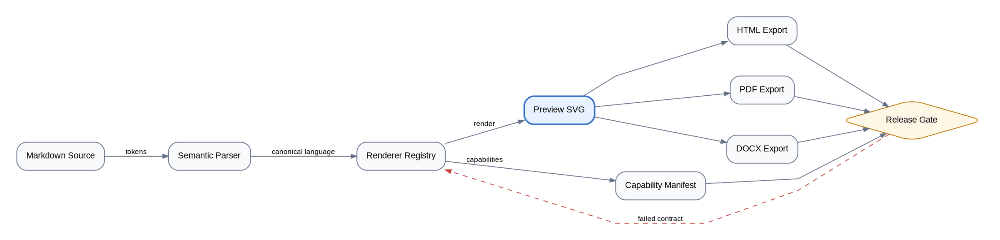

主路径从源码进入预览，三个导出分支在发布门禁汇聚；红色虚线是唯一回边。

### 构建 DAG：并行任务与汇合产物

- **适用：** 表达构建任务的前置条件、可并行阶段、缓存输入与最终产物。
- **迁移模式：** 将按步骤书写的构建脚本或带大量手工定位的流程图，迁移为由依赖关系自动排布的有向无环图。

<div id="md-case-graphviz-build-dag"></div>

```graphviz
digraph BuildDAG {
  graph [rankdir=LR, bgcolor="transparent", pad=0.25, nodesep=0.45, ranksep=0.70, splines=spline, labelloc=t, label="构建 DAG｜从左到右：前置条件 → 可执行任务 → 产物", fontname="sans-serif", fontsize=16];
  node [fontname="sans-serif", fontsize=11, margin="0.12,0.08"];
  edge [fontname="sans-serif", fontsize=10, arrowsize=0.75];

  change      [label="代码变更", shape=ellipse];
  cache       [label="依赖缓存", shape=cylinder];
  lint        [label="静态检查", shape=box, style=rounded];
  unit        [label="单元测试", shape=box, style=rounded];
  bundle      [label="前端构建", shape=box, style=rounded];
  integration [label="集成测试", shape=box, style=rounded];
  package     [label="打包签名", shape=box, style=rounded];
  artifact    [label="可发布制品", shape=component];

  change -> lint        [label="触发"];
  change -> unit        [label="触发"];
  change -> bundle      [label="触发"];
  cache  -> bundle      [label="命中时复用", style=dashed];
  unit   -> integration [label="通过后解锁"];
  lint   -> package     [label="必需"];
  bundle -> package     [label="必需"];
  integration -> package [label="必需"];
  package -> artifact   [label="生成"];

  { rank=same; change; cache; }
  { rank=same; lint; unit; bundle; }
}
```

- **设计要点 1：** `rankdir=LR` 让依赖解锁顺序从左向右读取；椭圆表示输入、圆角矩形表示任务、圆柱表示缓存、组件形表示制品。
- **设计要点 2：** 实线只表达硬前置依赖，虚线只表达可选缓存输入；同一 `rank` 对齐可并行任务，避免误读为串行步骤。

### 模块依赖：扇入、共享核心与扇出

- **适用：** 展示多个调用方如何汇入共享模块，以及共享模块对策略、令牌和审计能力的扇出依赖。
- **迁移模式：** 将嵌套模块清单或只画单向层级的组件图，迁移为同时保留扇入、扇出和异步事件语义的依赖图。

<div id="md-case-graphviz-module-fanin-fanout"></div>

```graphviz
digraph ModuleFan {
  graph [rankdir=LR, bgcolor="transparent", pad=0.25, nodesep=0.50, ranksep=0.85, splines=spline, labelloc=t, label="模块依赖｜左侧扇入，共享核心居中，右侧扇出", fontname="sans-serif", fontsize=16];
  node [fontname="sans-serif", fontsize=11, margin="0.12,0.08"];
  edge [fontname="sans-serif", fontsize=10, arrowsize=0.75];

  console [label="管理控制台", shape=box, style=rounded];
  web     [label="Web 应用", shape=box, style=rounded];
  worker  [label="后台任务", shape=box, style=rounded];

  access  [label="访问控制核心", shape=component, penwidth=2];

  policy  [label="策略模块", shape=tab];
  token   [label="令牌模块", shape=tab];
  audit   [label="审计模块", shape=tab];

  console -> access [label="导入"];
  web     -> access [label="导入"];
  worker  -> access [label="导入"];

  access -> policy [label="同步判定"];
  access -> token  [label="同步校验"];
  access -> audit  [label="异步事件", style=dashed];

  { rank=same; console; web; worker; }
  { rank=same; policy; token; audit; }
}
```

- **设计要点 1：** `rankdir=LR` 与两组 `rank=same` 形成稳定的三列结构；圆角矩形是调用方、加粗组件形是共享核心、页签形是被依赖模块。
- **设计要点 2：** 实线表示同步导入或调用，虚线表示异步审计事件；线型和文字共同编码，未依赖颜色区分关系。

### 主备故障转移：流量、探测与复制

- **适用：** 说明单入口主备部署中的正常流量、备用路径、健康探测、路由切换和状态复制。
- **迁移模式：** 将只有“主机—备机”连线的静态拓扑，迁移为分离数据面、控制面和复制面的故障转移图。

<div id="md-case-graphviz-active-standby-failover"></div>

```graphviz
digraph ActiveStandby {
  graph [rankdir=LR, bgcolor="transparent", pad=0.25, nodesep=0.55, ranksep=0.80, splines=spline, labelloc=t, label="主备故障转移｜实线：正常流量｜虚线：切换路径｜点线：探测与复制", fontname="sans-serif", fontsize=16];
  node [fontname="sans-serif", fontsize=11, margin="0.12,0.08"];
  edge [fontname="sans-serif", fontsize=10, arrowsize=0.75];

  client  [label="客户端", shape=ellipse];
  health  [label="健康探测器", shape=hexagon];
  vip     [label="虚拟入口\n选择后端", shape=diamond];
  primary [label="主实例\n正常承载", shape=box, style=rounded, penwidth=2];
  standby [label="备实例\n热备待命", shape=box, style=rounded];
  data    [label="共享数据\n存储", shape=cylinder, margin="0.20,0.10"];

  client -> vip     [label="请求"];
  vip -> primary    [label="正常路由"];
  vip -> standby    [label="故障时切换", style=dashed];
  primary -> data   [label="读写"];
  standby -> data   [label="接管后读写", style=dashed];

  health -> primary [label="探测", style=dotted];
  health -> standby [label="预热检查", style=dotted];
  health -> vip     [label="更新路由", style=dashed, constraint=false];
  primary -> standby [label="状态复制", style=dotted, constraint=false];

  { rank=same; client; health; }
  { rank=same; primary; standby; }
}
```

- **设计要点 1：** `rankdir=LR` 把入口、选择、执行和存储排成读取主轴；椭圆是外部请求方、菱形是路由决策、六边形是控制器、圆柱是存储。
- **设计要点 2：** 实线、虚线、点线分别对应正常流量、故障切换、探测或复制；控制边使用 `constraint=false`，避免回拉主数据路径。

### 编译器流水线：阶段、表示与诊断出口

- **适用：** 展示源文件经过词法、语法、语义、优化和代码生成阶段时，中间表示如何逐步变化。
- **迁移模式：** 将编号步骤或混合输入输出的长表格，迁移为以处理阶段为节点、以中间表示为边标签的流水线。

<div id="md-case-graphviz-compiler-pipeline"></div>

```graphviz
digraph CompilerPipeline {
  graph [rankdir=TB, bgcolor="transparent", pad=0.25, nodesep=0.58, ranksep=0.62, splines=spline, labelloc=t, label="编译器流水线｜阶段内聚，失败出口就近展开", fontname="sans-serif", fontsize=16];
  node [fontname="sans-serif", fontsize=13, margin="0.16,0.11"];
  edge [fontname="sans-serif", fontsize=11, arrowsize=0.80];

  source [label="源文件", shape=note];
  frontend [label="前端分析
词法 · 语法 · 语义", shape=box, style=rounded, margin="0.26,0.14"];
  backend [label="后端生成
IR 优化 · 代码生成", shape=box, style=rounded, margin="0.26,0.14"];
  binary [label="目标程序", shape=component];
  sourceError [label="非法记号 / 语法 / 类型错误
定位并停止", shape=octagon];
  backendError [label="优化或生成失败
保留中间表示", shape=octagon];

  source -> frontend [label="字符流"];
  frontend -> backend [label="带类型 IR"];
  backend -> binary [label="机器码"];
  frontend -> sourceError [label="失败", style=dashed, constraint=false];
  backend -> backendError [label="失败", style=dashed, constraint=false];

  { rank=same; frontend; sourceError; }
  { rank=same; backend; backendError; }
}
```

- **设计要点 1：** `rankdir=TB` 让编译阶段自上而下推进；便笺形是输入、圆角矩形是处理阶段、组件形是产物、八边形是异常终止。
- **设计要点 2：** 中间表示写在实线边上，避免为每个表示额外增加一列节点；虚线诊断边不参与排位，主流水线保持笔直。

### 权限决策树：逐级判定与可解释拒绝

- **适用：** 表达身份、角色、资源策略和上下文条件的短路判定，并给出明确的允许或拒绝原因。
- **迁移模式：** 将嵌套 `if/else`、权限伪代码或规则表，迁移为每个分支都有终点的可审计决策树。

<div id="md-case-graphviz-permission-decision-tree"></div>

```graphviz
digraph PermissionTree {
  graph [rankdir=LR, bgcolor="transparent", pad=0.25, nodesep=0.50, ranksep=0.62, splines=spline, labelloc=t, label="权限决策树｜实线：是｜虚线：否", fontname="sans-serif", fontsize=16];
  node [fontname="sans-serif", fontsize=11, margin="0.12,0.08"];
  edge [fontname="sans-serif", fontsize=10, arrowsize=0.75];

  request [label="访问请求", shape=ellipse];
  identity [label="身份有效？", shape=diamond];
  role     [label="角色直接授权？", shape=diamond];
  policy   [label="资源策略命中？", shape=diamond];
  context  [label="上下文条件满足？", shape=diamond];

  allow        [label="允许", shape=doublecircle];
  deny_id      [label="拒绝\n身份无效", shape=doublecircle];
  deny_policy  [label="拒绝\n无策略命中", shape=doublecircle];
  deny_context [label="拒绝\n上下文不满足", shape=doublecircle];

  request -> identity;
  identity -> role    [label="是"];
  identity -> deny_id [label="否", style=dashed];

  role -> allow  [label="是"];
  role -> policy [label="否", style=dashed];

  policy -> context     [label="是"];
  policy -> deny_policy [label="否", style=dashed];

  context -> allow        [label="是"];
  context -> deny_context [label="否", style=dashed];
}
```

- **设计要点 1：** `rankdir=LR` 让判断从左向右短路推进；椭圆表示请求、菱形表示布尔决策、双圆表示不可再分的最终结果。
- **设计要点 2：** “是”使用实线、“否”使用虚线且边上重复文字；拒绝叶子保留具体原因，使图可直接支持审计说明。

### 事故原因树：AND/OR 门与证据强度

- **适用：** 复盘事故时区分必要条件组合、可替代原因、已确认事实和仍待验证的假设。
- **迁移模式：** 将鱼骨图、散乱的“五个为什么”或时间线中的推测，迁移为原因朝事故结果汇聚的逻辑树。

<div id="md-case-graphviz-incident-cause-tree"></div>

```graphviz
digraph IncidentCauseTree {
  graph [rankdir=BT, bgcolor="transparent", pad=0.25, nodesep=0.48, ranksep=0.65, splines=spline, labelloc=t, label="事故原因树｜自下而上：基础原因 → 组合条件 → 用户可见事故", fontname="sans-serif", fontsize=16];
  node [fontname="sans-serif", fontsize=11, margin="0.12,0.08"];
  edge [fontname="sans-serif", fontsize=10, arrowsize=0.75];

  incident [label="下单接口大面积超时", shape=octagon, penwidth=2];
  any_path [label="OR\n任一成立", shape=circle, fixedsize=true, width=0.82];
  db_slow  [label="数据库响应\n变慢", shape=box, style=rounded, margin="0.20,0.10"];
  pool     [label="连接池\n耗尽", shape=box, style=rounded, margin="0.20,0.10"];
  all_load [label="AND\n同时成立", shape=circle, fixedsize=true, width=0.88];

  traffic  [label="突发流量", shape=note];
  no_limit [label="入口未限流", shape=note];
  plan     [label="查询计划\n回退", shape=note, margin="0.22,0.10"];
  leak     [label="连接未及时\n释放", shape=note, margin="0.22,0.10"];
  dns      [label="DNS 抖动\n待验证", shape=note];

  traffic  -> all_load;
  no_limit -> all_load;
  all_load -> db_slow [label="共同导致"];
  plan     -> db_slow [label="已确认"];
  leak     -> pool    [label="已确认"];

  db_slow -> any_path;
  pool    -> any_path;
  dns     -> any_path [label="假设", style=dashed];
  any_path -> incident [label="触发"];

  { rank=same; traffic; no_limit; plan; leak; dns; }
  { rank=same; db_slow; pool; }
}
```

- **设计要点 1：** `rankdir=BT` 使原因箭头指向上方事故；便笺形是基础原因、圆形是 AND/OR 逻辑门、八边形是用户可见事故。
- **设计要点 2：** 实线表示已有证据支持的因果关系，虚线表示待验证假设；逻辑门避免把“共同成立”和“任一成立”混为一谈。

### 发布门禁：验证、审批、灰度与回滚

- **适用：** 展示发布候选从自动化验证到人工审批、灰度观测和全量上线的完整门禁链。
- **迁移模式：** 将发布检查清单或 CI 阶段表，迁移为通过路径连续、每个失败出口就近可见的门禁流程。

<div id="md-case-graphviz-release-gates"></div>

```graphviz
digraph ReleaseGates {
  graph [rankdir=TB, bgcolor="transparent", pad=0.25, nodesep=0.64, ranksep=0.68, splines=spline, labelloc=t, label="发布门禁｜验证与审批收敛，异常就近终止", fontname="sans-serif", fontsize=16];
  node [fontname="sans-serif", fontsize=13, margin="0.16,0.11"];
  edge [fontname="sans-serif", fontsize=11, arrowsize=0.80];

  candidate [label="发布候选", shape=note];
  gate [label="测试、安全扫描与
变更审批均通过？", shape=diamond];
  canary [label="灰度发布
错误率 / 延迟
持续观测", shape=box, style=rounded, margin="0.24,0.13"];
  slo [label="关键指标达标？", shape=diamond];
  prod [label="全量上线", shape=doublecircle];
  repair [label="修复问题
补齐证据
重新生成候选", shape=note, margin="0.24,0.13"];
  rollback [label="停止灰度
执行回滚", shape=octagon];

  candidate -> gate;
  gate -> canary [label="通过"];
  canary -> slo [label="观测窗口结束"];
  slo -> prod [label="通过"];
  gate -> repair [label="未通过", style=dashed, constraint=false];
  slo -> rollback [label="未达标", style=dashed, constraint=false];

  { rank=same; gate; repair; }
  { rank=same; slo; rollback; }
}
```

- **设计要点 1：** `rankdir=TB` 让成功路径保持单一纵向主轴；便笺形是候选或修复材料、菱形是门禁、圆角矩形是执行阶段、双圆是成功终态。
- **设计要点 2：** 每个虚线失败分支停在对应门禁附近，避免多条线汇聚到远端“失败”节点造成 crossing；灰度异常单独落到八边形回滚终态。

### 服务依赖与熔断回边：调用、反馈与降级

- **适用：** 同时表达内部服务依赖、外部同步调用，以及失败如何反馈给熔断器并触发快速失败或降级。
- **迁移模式：** 将默认无环的服务依赖图，迁移为显式保留“外部失败 → 熔断状态 → 调用方”的反馈回路。

<div id="md-case-graphviz-service-circuit-feedback"></div>

```graphviz
digraph ServiceCircuitFeedback {
  graph [rankdir=LR, bgcolor="transparent", pad=0.25, nodesep=0.48, ranksep=0.82, splines=spline, labelloc=t, label="服务依赖与熔断回边｜实线：同步依赖｜虚线：失败反馈｜点线：降级路径", fontname="sans-serif", fontsize=16];
  node [fontname="sans-serif", fontsize=11, margin="0.12,0.08"];
  edge [fontname="sans-serif", fontsize=10, arrowsize=0.75];

  client    [label="客户端", shape=ellipse];
  gateway   [label="API 网关", shape=component];
  order     [label="订单服务", shape=component, penwidth=2];
  inventory [label="库存服务", shape=component];
  payment   [label="支付服务", shape=component];
  stock_db  [label="库存缓存", shape=cylinder];
  channel   [label="外部支付通道", shape=box, peripheries=2];
  breaker   [label="熔断器\n失败阈值达到？", shape=diamond];
  fallback  [label="降级响应\n稍后重试", shape=note];

  client  -> gateway [label="请求"];
  gateway -> order   [label="路由"];
  order -> inventory [label="预占库存"];
  order -> payment   [label="发起支付"];
  inventory -> stock_db [label="读写"];
  payment -> channel [label="同步调用"];

  channel -> breaker [label="超时 / 5xx\n累计失败", style=dashed, constraint=false];
  breaker -> payment [label="打开：快速失败\n状态回边", style=dashed, constraint=false];
  breaker -> fallback [label="返回可恢复结果", style=dotted];

  { rank=same; inventory; payment; }
  { rank=same; stock_db; channel; }
}
```

- **设计要点 1：** `rankdir=LR` 保持客户端到依赖项的主调用方向；组件形是内部服务、双边框矩形是外部依赖、圆柱是存储、菱形是熔断决策。
- **设计要点 2：** 虚线回边明确表示失败反馈和快速失败，不与实线业务调用混淆；`constraint=false` 让反馈环不破坏主依赖层级，点线只承担降级路径。


### 背压、舱壁与有界过载反馈

**适用/迁移模式：** 适用于高并发入口、优先级任务和共享下游保护；迁移时先引入入口预算、有限队列和独立工作池，再让队列水位与超时信号向生产端传播。

<div id="md-case-graphviz-backpressure-bulkhead-feedback"></div>

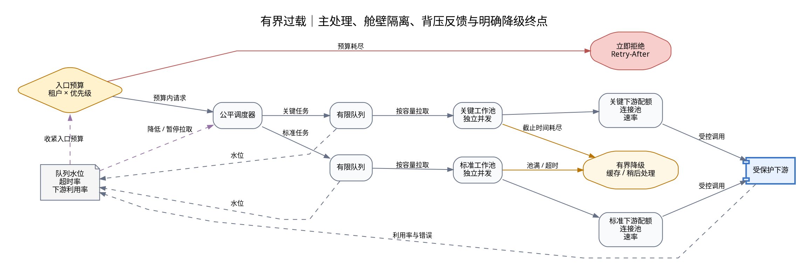

- **设计要点 1：** 关键与标准任务分别占用有限队列和工作池，低优先级积压不会越过舱壁挤占关键业务资源。
- **设计要点 2：** 背压由真实水位、超时和下游利用率触发并反馈到入口；拒绝和降级都有明确终点，不使用无界重试。

### 软件供应链：制品、SBOM 与来源证明

**适用/迁移模式：** 适用于需要验证“部署内容从哪里来、由什么构建、通过哪些策略”的交付链；迁移时先使制品不可变，再把 SBOM、签名和 provenance 绑定到同一摘要。

<div id="md-case-graphviz-software-supply-chain-provenance"></div>

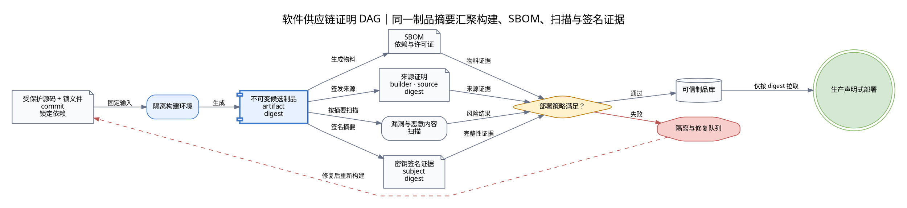

- **设计要点 1：** SBOM、扫描结果、来源证明和签名都绑定同一不可变制品摘要，门禁不能只凭“流水线成功”放行。
- **设计要点 2：** 失败制品进入隔离区并从源码重新构建，不能原地修改后沿用旧证明；生产只按 digest 拉取。

### Expand/Contract：零停机 Schema 迁移

**适用/迁移模式：** 适用于数据库字段、事件 Schema 或持久化契约的在线升级；迁移时先扩展向后兼容结构，再依次完成双写、回填、校验、切读、停旧写和收缩。

<div id="md-case-graphviz-expand-contract-schema-migration"></div>

```graphviz
digraph ExpandContract {
  graph [rankdir=LR, bgcolor="transparent", pad=0.25, nodesep=0.38, ranksep=0.62, splines=polyline, compound=true, labelloc=t, label="Expand / Contract｜兼容扩展、数据迁移、切换观察与最终收缩", fontname="sans-serif", fontsize=16];
  node [fontname="sans-serif", fontsize=10, margin="0.12,0.08", shape=box, style="rounded,filled", fillcolor="#f8fafc", color="#667085"];
  edge [fontname="sans-serif", fontsize=9, arrowsize=0.75, color="#667085"];

  subgraph cluster_expand {
    label="1 兼容扩展"; color="#6c8ebf"; style="rounded,dashed";
    baseline [label="基线\nApp v1 + Schema v1", shape=component];
    expand [label="新增目标列\n保留旧结构", shape=cylinder, fillcolor="#e8f1ff", color="#3974c6"];
    dual [label="App v1.5\n新旧字段双写"];
    baseline -> expand [label="向后兼容 DDL"];
    expand -> dual [label="发布兼容版本"];
  }

  subgraph cluster_migrate {
    label="2 数据迁移与验证"; color="#d6b656"; style="rounded,dashed";
    backfill [label="分片回填"];
    verify [label="校验和与业务不变量\n全部通过？", shape=diamond, fillcolor="#fff2cc", color="#b87503"];
    shadow [label="影子读取\n旧 / 新结果比对"];
    backfill -> verify [label="批次完成"];
    verify -> shadow [label="通过"];
  }

  subgraph cluster_contract {
    label="3 切换与收缩"; color="#82b366"; style="rounded,dashed";
    switchRead [label="App v2\n切读新结构", fillcolor="#d5e8d4", color="#82b366"];
    stopOld [label="停止旧字段写入"];
    observe [label="兼容观察窗口\n错误率与差异为零", shape=note];
    contract [label="删除旧列 / 旧索引", shape=cylinder, fillcolor="#d5e8d4", color="#82b366", penwidth=2];
    switchRead -> observe [label="持续双写观察"];
    observe -> stopOld [label="窗口通过"];
    stopOld -> contract [label="旧写归零"];
  }

  repair [label="隔离差异\n继续双写", shape=octagon, fillcolor="#f8cecc", color="#b85450"];
  rollback [label="切回旧读\n保持双写", shape=octagon, fillcolor="#fff7e6", color="#b87503"];

  dual -> backfill [label="持续双写"];
  shadow -> switchRead [label="差异为零"];
  verify -> repair [label="不通过", color="#b85450", constraint=false];
  repair -> backfill [label="修复后重跑", style=dashed, color="#b85450", constraint=false];
  switchRead -> rollback [label="异常", style=dashed, color="#b87503", constraint=false];
  rollback -> dual [label="恢复旧读", style=dashed, color="#b87503", constraint=false];

  { rank=same; repair; rollback; }
}
```

- **设计要点 1：** 切读和停旧写不是同一步；只有回填、影子比对和观察窗口都满足后，才允许删除旧结构。
- **设计要点 2：** 回滚恢复旧读路径但继续双写，避免因一次切换失败丢失新结构中的增量数据。

### 多数派共识：提交、分区与副本恢复

**适用/迁移模式：** 适用于解释复制完成、法定人数提交和网络分区恢复的差异；迁移时先明确故障域和多数派规则，再单独设计少数派拒写、任期变更及快照追赶。

<div id="md-case-graphviz-quorum-consensus-recovery"></div>

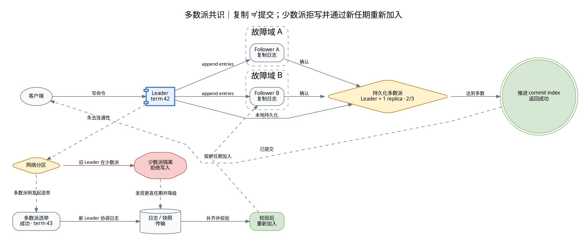

- **设计要点 1：** 副本收到日志不代表客户端写入已经提交；只有当前任期内达到多数派确认，才能推进提交索引并返回成功。
- **设计要点 2：** 失去多数派的一侧明确拒写，恢复后先按新任期完成日志或快照追赶，避免双主和旧日志重新进入集群。

## 6. Mermaid：交互时序、流程与状态

> 优先迁移参与者、条件分支、返回线和状态转换语义。

### 令牌刷新与异步审计

**适用/迁移模式：** 适用于跨服务交互中的分支、重试和异步记录；迁移时替换参与者与协议，不改变时间语义。

<div id="md-case-mermaid-sequence-alt-refresh"></div>

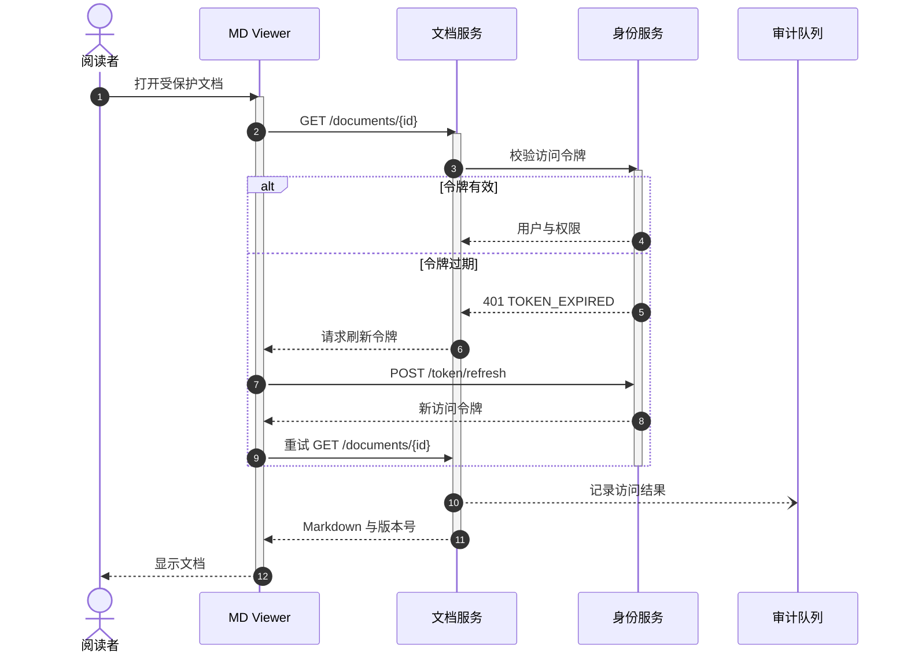

该场景固定验证同步调用、虚线返回、条件分支、重试和异步消息共存时的排版。

### 同步导出端到端时序

**适用：** 展示一次导出请求中 UI、主进程、渲染器与文件系统之间的同步调用及失败边界。

**迁移模式：** 将散落在界面事件中的导出步骤收敛为由主进程协调、逐阶段返回结果的同步流水线。

<div id="md-case-mermaid-sync-export-sequence"></div>

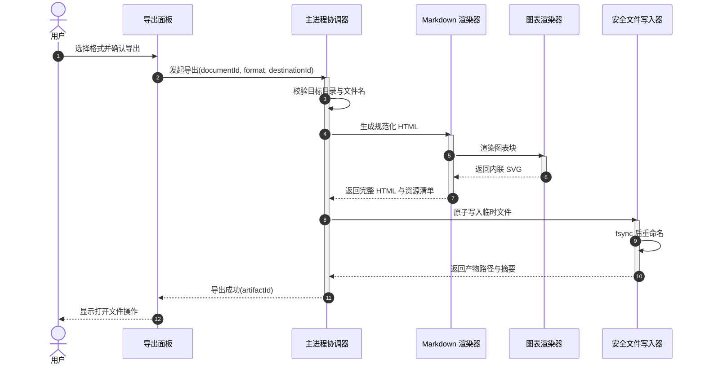

- 主进程持有授权与落盘责任，渲染进程只提交不可信的文档标识和目标标识。
- 临时文件加原子重命名避免中途失败留下看似完整的损坏产物。

### Read-through 缓存 Miss

**适用：** 说明读取请求在缓存未命中、回源、回填以及并发去重时的完整路径。

**迁移模式：** 从每次直读数据源迁移到 read-through cache，并用 single-flight 防止热点键击穿。

<div id="md-case-mermaid-cache-miss-read-through"></div>

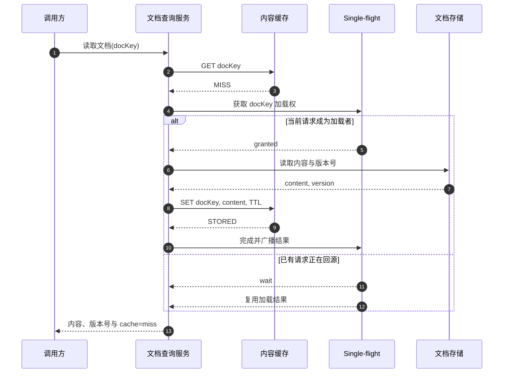

- single-flight 只合并同一键的并发回源，不应把不同版本或不同授权上下文错误合并。
- 回填失败不阻断本次读取，但应记录指标以识别持续缓存失效。

### Outbox 事件发布与幂等消费

**适用：** 展示业务写入、事件可靠发布以及多个消费者独立确认的边界。

**迁移模式：** 从“提交数据库后直接发消息”迁移到事务 Outbox、至少一次投递与消费者幂等。

<div id="md-case-mermaid-outbox-event-delivery"></div>

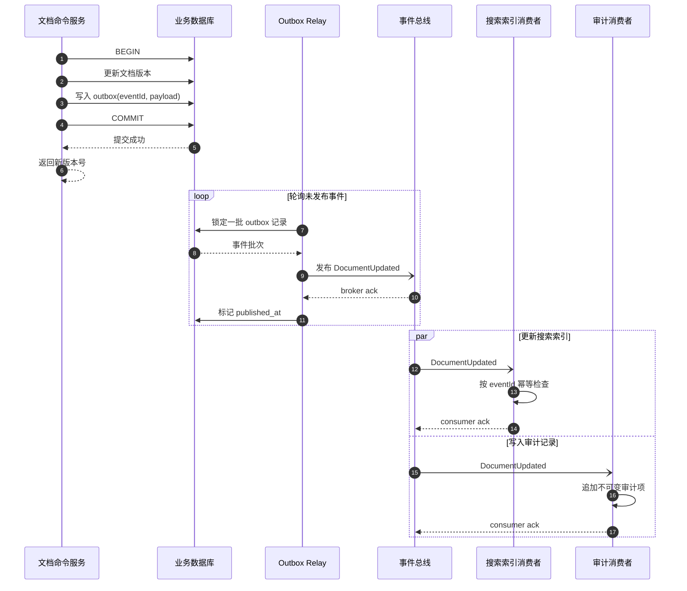

- 业务变更与 Outbox 记录必须在同一事务提交，避免“数据已改但事件丢失”。
- 事件总线采用至少一次投递时，每个消费者都必须以 eventId 实现幂等。

### CI/CD 渐进式交付流水线

**适用：** 描述从提交验证、产物签名到金丝雀发布和自动回滚的发布门禁。

**迁移模式：** 从人工打包直发迁移到一次构建、多环境晋级和基于观测信号的渐进式交付。

<div id="md-case-mermaid-cicd-progressive-delivery"></div>

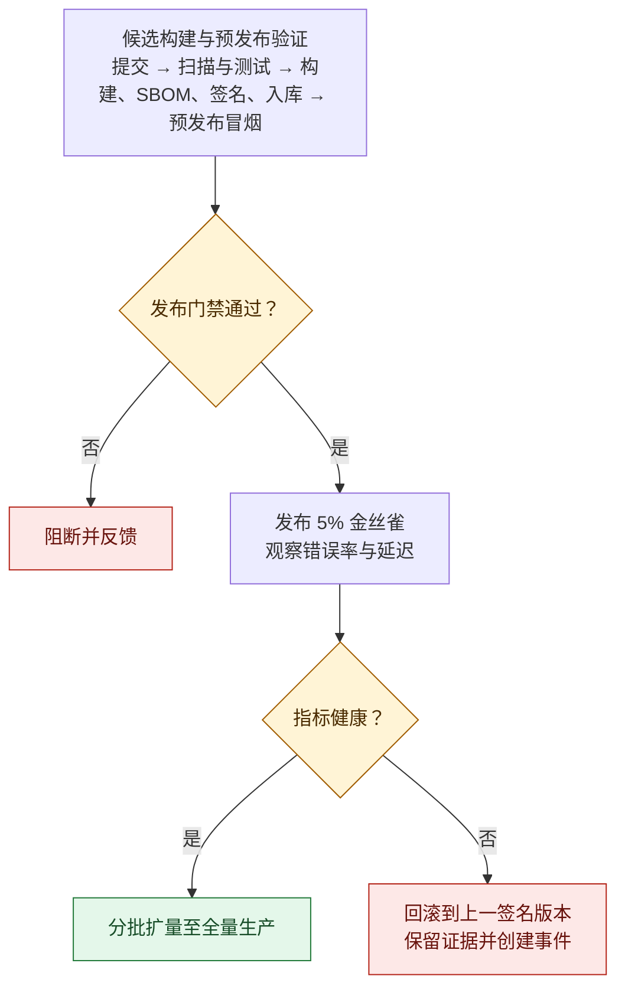

- 同一签名产物跨环境晋级，避免在生产前重新构建导致内容漂移。
- 金丝雀判定必须绑定明确的 SLO 窗口，失败路径直接回滚而不是继续扩量。

### 文件访问授权边界

**适用：** 解释 Electron 渲染进程发起文件访问时，主进程如何做根目录授权与路径边界校验。

**迁移模式：** 从传递绝对路径迁移到 opaque rootId 加相对路径，并把所有授权判断集中到主进程。

<div id="md-case-mermaid-file-authorization-boundary"></div>

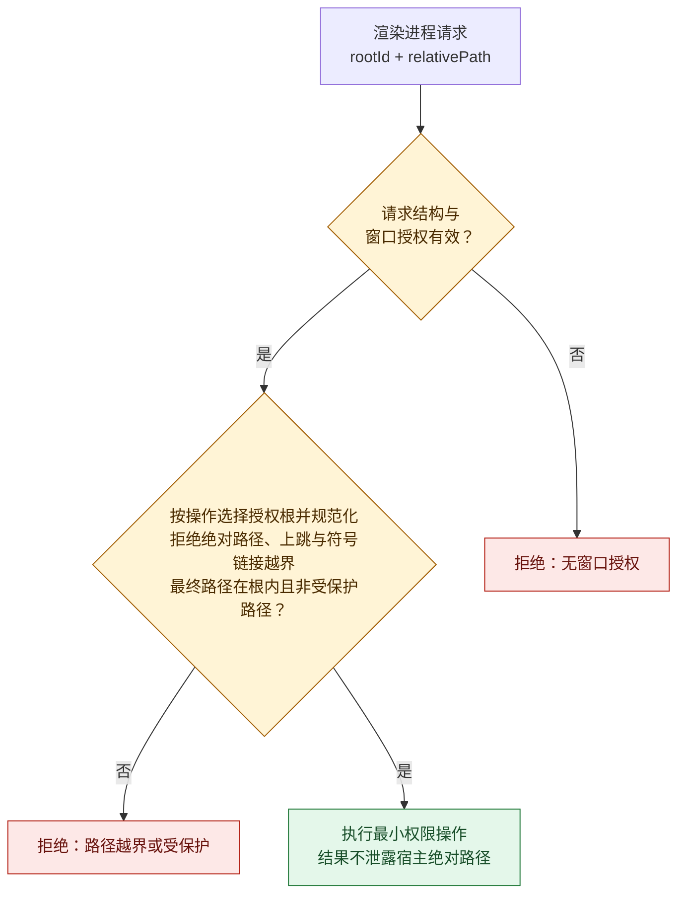

- 授权依据来自主进程维护的窗口上下文，不能信任渲染进程提交的根目录或绝对路径。
- 对不存在的写入目标校验最近已存在父目录，可同时防止目录穿越与符号链接越界。

### 熔断器与有界降级

**适用：** 描述外部依赖不稳定时，正常调用、失败计数、半开探测与降级响应之间的转换。

**迁移模式：** 从无条件重试迁移到超时预算、熔断器和能力受限但可解释的降级结果。

<div id="md-case-mermaid-circuit-breaker-fallback"></div>

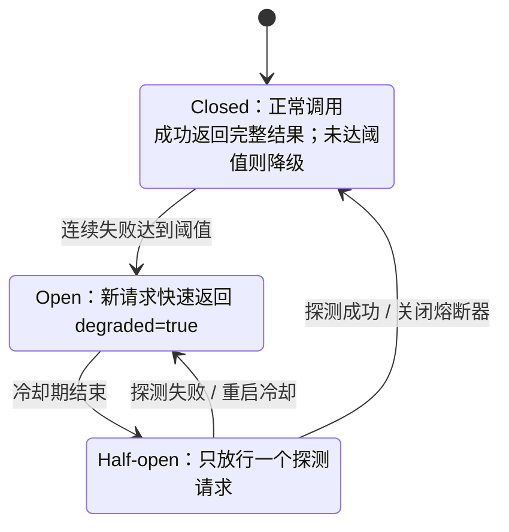

- 降级结果必须显式标记能力缺失，避免调用方把基础渲染误认为完整产物。
- 半开状态限制探测并发，防止冷却期结束后流量同时冲击尚未恢复的依赖。

### 文档生命周期

**适用：** 统一描述文档从草稿、评审、发布到归档和删除的合法状态迁移。

**迁移模式：** 从多个布尔字段迁移到单一生命周期状态，并以显式命令保护每条迁移边界。

<div id="md-case-mermaid-document-lifecycle-state"></div>

```mermaid
stateDiagram-v2
    [*] --> Draft

    state "草稿" as Draft
    state "评审中" as Review
    state "已批准" as Approved
    state "已发布" as Published
    state "已归档" as Archived
    state "已删除" as Deleted

    Draft --> Review: 提交评审
    Review --> Draft: 退回修改
    Review --> Approved: 审批通过
    Approved --> Published: 发布版本
    Published --> Draft: 基于已发布版创建新修订
    Published --> Archived: 停止维护
    Archived --> Published: 恢复发布
    Draft --> Deleted: 放弃草稿
    Archived --> Deleted: 保留期结束
    Deleted --> [*]
```

- “创建新修订”生成新的草稿版本，不修改已发布版本的不可变内容。
- 删除仅从草稿或已归档状态进入，避免绕过评审直接销毁在线版本。

### 任务重试状态机

**适用：** 规范后台任务面对临时错误、永久错误、取消和重试耗尽时的状态变化。

**迁移模式：** 从即时循环重试迁移到持久化尝试次数、指数退避加抖动以及死信终态。

<div id="md-case-mermaid-task-retry-state-machine"></div>

```mermaid
flowchart LR
    Start((开始)) --> Queued

    subgraph Active[可取消执行]
        direction TB
        Queued([等待执行]) -->|worker 获取租约| Running([执行中])
        Running -->|执行失败| Decide{错误类型与次数}
        Decide -->|临时错误且未超上限| Backoff([退避等待])
        Backoff -->|到期，attempt + 1| Queued
    end

    Running -->|执行成功| Succeeded([已成功])
    Decide -->|永久错误或次数耗尽| DeadLetter([死信])
    Active -.->|任一活动状态收到取消| Cancelled([已取消])
    Succeeded --> Done((结束))
    DeadLetter --> Done
    Cancelled --> Done
```

- attempt、nextRunAt 和错误分类需要持久化，进程重启后仍能延续正确状态。
- 只有可恢复的临时错误进入退避；参数错误和权限错误应直接进入死信并等待人工处理。


### 编排式 Saga：成功链、逆序补偿与人工修复

**适用/迁移模式：** 适用于库存、支付、履约等跨服务长事务；迁移时为每个已完成步骤定义幂等补偿，并把“补偿也可能失败”作为显式终态处理。

<div id="md-case-mermaid-saga-compensation-sequence"></div>

```mermaid
sequenceDiagram
    autonumber
    actor Buyer as 客户
    participant Saga as Saga 协调器
    participant Order as 订单服务
    participant Stock as 库存服务
    participant Pay as 支付服务
    participant Fulfill as 履约服务
    participant Repair as 人工修复队列

    Buyer->>Saga: 提交订单(commandId)
    Saga->>Order: 创建 PENDING 订单
    Order-->>Saga: orderId
    Saga->>Stock: 预留库存(orderId)
    Stock-->>Saga: reservationId
    Saga->>Pay: 确认支付(orderId, amount)

    alt 支付拒绝
        Pay-->>Saga: PAYMENT_REJECTED
        Saga->>Stock: 释放库存(reservationId)
        Saga->>Order: 取消订单(orderId)
        Saga-->>Buyer: 订单已取消
    else 支付成功
        Pay-->>Saga: paymentId
        Saga->>Fulfill: 创建履约单(orderId)
        alt 履约创建成功
            Fulfill-->>Saga: fulfillmentId
            Saga->>Order: 确认订单(orderId)
            Saga-->>Buyer: 订单已确认
        else 履约失败
            Fulfill-->>Saga: FULFILLMENT_FAILED
            par 退款
                Saga->>Pay: 退款(paymentId)
                Pay-->>Saga: refund result
            and 释放库存
                Saga->>Stock: 释放库存(reservationId)
                Stock-->>Saga: release result
            end
            alt 两项补偿均成功
                Saga->>Order: 取消订单(orderId)
                Saga-->>Buyer: 订单已取消并退款
            else 任一补偿失败
                Saga-)Repair: 状态快照与失败步骤
                Saga->>Order: 标记 MANUAL_REPAIR
                Saga-->>Buyer: 已受理人工处理
            end
        end
    end
```

- **设计要点 1：** 补偿只逆序撤销已经成功的步骤；支付拒绝无需退款，履约失败则先退款再释放库存。
- **设计要点 2：** 所有命令携带稳定业务标识以支持幂等；补偿失败进入人工修复，而不是被错误地当作最终一致成功。

### Agent 工具调用：授权、短期凭证与隔离执行

**适用/迁移模式：** 适用于 Agent 代表用户执行写操作或调用外部系统；迁移时把参数规范化、风险判断、人工审批、凭证签发和审计从模型上下文中分离。

<div id="md-case-mermaid-agent-tool-authorization-sequence"></div>

```mermaid
sequenceDiagram
    autonumber
    actor User as 用户
    participant Agent as Agent 编排器
    participant Policy as 策略与风险服务
    actor Approver as 审批人
    participant Token as 凭证代理
    participant Sandbox as 隔离执行沙箱
    participant Tool as 受控业务工具
    participant Audit as 审计证据库

    User->>Agent: 请求变更资源
    Agent->>Agent: 规范参数并计算 operationDigest
    Agent->>Policy: evaluate(user, tool, action, resource, operationDigest)

    alt 明确拒绝
        break DENY
            Policy-->>Agent: 可解释拒绝原因
            Policy-)Audit: 拒绝结果与策略版本
            Agent-->>User: 未执行
        end
    else 需要人工批准
        Policy-->>Agent: REQUIRE_APPROVAL + 风险摘要
        Agent->>Approver: 展示影响范围与 operationDigest
        alt 审批拒绝或超时
            break REJECT / EXPIRED
                Approver-->>Agent: 拒绝或过期
                Approver-)Audit: 审批结果
                Agent-->>User: 未执行
            end
        else 审批通过
            Approver->>Token: 签发绑定摘要、范围与 TTL 的授权证明
            Approver-->>Agent: approvalRef
        end
    else 低风险允许
        Policy->>Token: 签发绑定摘要、范围与 TTL 的策略证明
        Policy-->>Agent: grantRef
    end

    Agent->>Sandbox: 执行(validatedOperation, grantRef)
    Sandbox->>Token: redeem(grantRef, operationDigest, sandboxIdentity)
    Token-->>Sandbox: 一次性最小权限凭证
    Sandbox->>Tool: 受限调用
    Tool-->>Sandbox: 结构化结果
    Sandbox->>Sandbox: 校验 Schema 并脱敏
    Sandbox-)Audit: 操作摘要、授权证明与结果哈希
    Sandbox-->>Agent: 脱敏结果
    Agent-->>User: 执行结果与影响范围
```

- **设计要点 1：** Agent 只能提出候选操作；策略、审批与凭证代理决定实际范围，长期密钥不进入模型、提示词或审计正文。
- **设计要点 2：** 沙箱对参数和结果执行双向校验，审计仅保存必要摘要、策略版本和结果证据。

### 隐私删除：法律保留、跨存储执行与删除证明

**适用/迁移模式：** 适用于数据主体删除请求和保留义务并存的场景；迁移时先建立身份确认、数据目录和保留判定，再逐步接入各在线副本与备份过期流程。

<div id="md-case-mermaid-privacy-erasure-workflow"></div>

```mermaid
flowchart LR
    subgraph Intake[接收与范围确认]
        Request[收到删除请求] --> Verify{身份和代理权限<br/>验证通过？}
        Verify -->|否| Reject[拒绝并说明补充材料]
        Verify -->|是| Discover[按主体与租户查询数据目录]
    end

    subgraph Decision[保留义务判定]
        Discover --> Hold{存在法律保留、争议<br/>或安全调查？}
        Hold -->|是| Suspend[挂起请求并记录依据与复审日]
        Suspend -. 解除保留 .-> Hold
        Hold -->|否| Plan[生成版本化删除计划]
    end

    subgraph Execute[执行与隔离]
        Plan --> Primary[(业务数据库)]
        Plan --> Search[搜索与向量索引]
        Plan --> Files[对象与附件存储]
        Plan --> Backup[备份删除墓碑与到期登记]
        BackupState[恢复隔离与备份处置状态]
        Primary --> VerifyDelete{在线副本全部完成？}
        Search --> VerifyDelete
        Files --> VerifyDelete
        Backup --> BackupState
        VerifyDelete -->|否| Repair[受控重试与人工处置]
        Repair --> Plan
    end

    subgraph Evidence[证据与通知]
        VerifyDelete -->|是| Proof[最小化删除证明<br/>范围 · 时间 · 结果哈希]
        BackupState -->|单独声明备份状态| Proof
        Proof --> Notify[通知请求人]
    end
```

- **设计要点 1：** 法律保留是可解释的挂起状态，不是删除失败；解除后重新进入同一判定流程。
- **设计要点 2：** 备份通过受控保留期和恢复隔离逐步过期，删除证明只保留不可重新识别主体的最小证据。

### DDD 战术设计：聚合、值对象与端口

**适用/迁移模式：** 适用于明确单个聚合的一致性边界及其对外端口；迁移时先把内部实体和值对象收进聚合，再以仓储接口和领域事件隔离基础设施与其他聚合。

<div id="md-case-mermaid-ddd-aggregate-class-model"></div>

```mermaid
classDiagram
    direction LR

    class Order {
        <<AggregateRoot>>
        +OrderId id
        +CustomerId customerId
        +OrderStatus status
        +Money total
        +addLine(product, quantity)
        +confirmPayment(paymentId)
        +cancel(reason)
    }
    class OrderLine {
        <<Entity>>
        +LineId id
        +ProductSnapshot product
        +int quantity
        +Money subtotal()
    }
    class ProductSnapshot {
        <<ValueObject>>
        +ProductId id
        +String name
        +Money unitPrice
    }
    class ShippingAddress {
        <<ValueObject>>
        +String recipient
        +String address
    }
    class Money {
        <<ValueObject>>
        +Decimal amount
        +String currency
    }
    class OrderRepository {
        <<interface>>
        +find(OrderId) Order
        +save(Order)
    }
    class PricingPolicy {
        <<DomainService>>
        +price(lines) Money
    }
    class OrderConfirmed {
        <<DomainEvent>>
        +OrderId orderId
        +Instant occurredAt
    }
    class SqlOrderRepository {
        <<adapter>>
    }

    Order "1" *-- "1..*" OrderLine : owns
    OrderLine "1" *-- "1" ProductSnapshot : snapshots
    Order "1" *-- "0..1" ShippingAddress : ships to
    Order *-- Money : total
    ProductSnapshot *-- Money : unit price
    PricingPolicy ..> OrderLine : evaluates
    Order ..> OrderConfirmed : raises
    OrderRepository ..> Order : persists
    SqlOrderRepository ..|> OrderRepository : implements
```

- **设计要点 1：** `Order` 是唯一聚合根，内部实体和值对象只能通过聚合行为修改；客户和商品只保留标识或下单快照。
- **设计要点 2：** 仓储是领域端口，SQL 实现是外部适配器；跨聚合协作通过领域事件完成，不扩大本地事务边界。

### GitOps：不可变制品的环境晋级

**适用/迁移模式：** 适用于由版本库声明期望状态、由控制器持续协调环境的交付方式；迁移时固定制品摘要并通过提交晋级，禁止在集群中直接手工改配置。

<div id="md-case-mermaid-gitops-environment-promotion"></div>

```mermaid
gitGraph
    commit id: "baseline" tag: "prod-v1.4"
    branch change
    checkout change
    commit id: "pin image@sha256"
    commit id: "update policy + config"
    checkout main
    merge change id: "signed candidate"
    branch staging
    checkout staging
    commit id: "staging approval"
    checkout main
    merge staging tag: "staging-v1.5"
    branch production
    checkout production
    commit id: "production approval"
    checkout main
    merge production tag: "prod-v1.5"
    branch hotfix
    checkout hotfix
    commit id: "revert bad config"
    checkout main
    merge hotfix tag: "revert-v1.5.1"
    checkout production
    merge main tag: "prod-v1.5.1"
```

- **设计要点 1：** 同一不可变制品摘要随配置提交逐级晋级，环境之间不重新构建；控制器只协调版本库声明的目标状态。
- **设计要点 2：** 生产修复通过可审计的 revert 提交并回合主干，不能以手工修改集群制造不可追溯漂移。

### API 版本发布与退役窗口

**适用/迁移模式：** 适用于主版本替换、消费者迁移和弃用治理；迁移时先发布兼容版本与观测，再停止新增旧版订阅，最后依据真实剩余流量执行下线。

<div id="md-case-mermaid-api-version-deprecation-gantt"></div>

```mermaid
gantt
    title API v1 → v2 发布、迁移与退役
    dateFormat YYYY-MM-DD
    axisFormat %Y-%m

    section 提供方
    发布 v2 与迁移指南          :done, release, 2026-01-15, 14d
    双版本运行与兼容修复         :active, dual, after release, 182d
    v1 返回弃用响应头           :headers, 2026-04-15, 91d
    关闭 v1                     :crit, shutdown, 2026-07-15, 1d

    section 消费方
    盘点 v1 消费者               :done, inventory, 2026-02-01, 20d
    重点消费者联调               :migration1, after inventory, 55d
    长尾消费者迁移               :migration2, 2026-03-15, 100d
    迁移确认完成                 :milestone, confirmed, 2026-06-30, 0d

    section 治理
    发布剩余流量与错误率看板      :done, dashboard, 2026-02-01, 25d
    禁止新建 v1 订阅             :milestone, freeze, 2026-05-01, 0d
    下线门禁评审                 :gate, 2026-07-01, 10d
```

- **设计要点 1：** “通知弃用”“停止新增依赖”和“最终关闭”是三个不同控制点，消费者拥有明确且有限的迁移窗口。
- **设计要点 2：** 下线门禁应以消费者确认、剩余流量和错误率为证据，不能只依赖预设日期。

### FinOps：成本归集与二次分摊

**适用/迁移模式：** 适用于解释云成本如何从资源类别归集到产品域、共享平台和未分摊池；迁移时先保证每个中间节点流入流出守恒，再提升标签与分摊规则覆盖率。

<div id="md-case-mermaid-finops-cost-allocation-sankey"></div>

```mermaid
sankey-beta
CloudBill,Compute,42000
CloudBill,Storage,18000
CloudBill,Network,10000
CloudBill,SharedPlatform,30000
Compute,ProductA,24000
Compute,ProductB,18000
Storage,ProductA,7000
Storage,ProductB,5000
Storage,Unallocated,6000
Network,ProductA,4000
Network,ProductB,4000
Network,Unallocated,2000
SharedPlatform,ProductA,15000
SharedPlatform,ProductB,10000
SharedPlatform,Unallocated,5000
```

- **设计要点 1：** 云账单总额为 100,000，计算、存储、网络和共享平台的流入与流出分别守恒。
- **设计要点 2：** `Unallocated` 显式暴露标签缺失和规则覆盖不足；Sankey 当前解析器要求该 CSV 案例使用 ASCII 标签，生成其他图时仍优先使用用户的主要语言。

## 7. Structurizr：C4 与部署视角

> 本项目使用离线简化解析器，案例只采用实际支持的元素、分组和关系语法。

### C4 系统上下文：全渠道零售平台

**适用：** 在立项、跨团队评审或供应商对接时，说明用户、核心系统与外部依赖的责任边界。

**迁移模式：** 绞杀者模式；先以统一零售门户承接流量，再逐步替换遗留订单入口，身份、支付与通知保持外部集成边界。

<div id="md-case-structurizr-c4-context"></div>

```structurizr
workspace "Omnichannel Retail Context"
customer = person "消费者" "通过网页或移动端浏览商品、下单并查询履约状态"
operator = person "运营人员" "管理商品、价格、促销与订单异常"
retail = softwareSystem "全渠道零售平台" "统一承接商品浏览、交易编排与履约跟踪"
legacy = softwareSystem "遗留订单系统" "迁移期间继续处理尚未切换的订单"
identity = softwareSystem "企业身份平台" "提供登录、令牌签发与访问控制"
payment = softwareSystem "支付服务商" "完成支付授权、扣款与退款"
notification = softwareSystem "消息通知平台" "发送短信、邮件与站内通知"
customer -> retail "浏览商品、提交订单"
operator -> retail "维护商品与处理异常"
retail -> identity "验证用户与操作员身份"
retail -> payment "请求支付和退款"
retail -> notification "发送订单状态通知"
retail -> legacy "转发未迁移订单"
legacy -> notification "发送遗留订单通知"
```

- **边界清晰：** 核心平台只负责零售业务编排，身份、支付和通知均作为外部系统显式建模。
- **迁移可见：** 遗留订单系统保留在上下文中，可直接讨论流量切换、双轨运行和最终退役条件。

### C4 容器：模块化单体到服务化交易平台

**适用：** 需要明确 Web、API、异步任务、数据库与消息队列之间运行时职责的容器级设计评审。

**迁移模式：** 模块化单体优先；先拆分部署职责和数据访问边界，只有出现独立扩缩容或发布需求时再抽取服务。

<div id="md-case-structurizr-c4-container"></div>

```structurizr
workspace "Commerce Platform Containers"
shopper = person "购物用户" "搜索商品、维护购物车并提交订单"
support = person "客服人员" "查询订单并发起售后处理"
commerce = softwareSystem "交易平台" "承载商品检索、购物车、订单和售后流程" {
  web = container "Web 应用" "提供响应式购物与订单查询界面"
  api = container "交易 API" "执行业务规则并提供同步接口"
  worker = container "后台任务进程" "处理超时关闭、退款和通知任务"
  commerceDb = database "交易数据库" "保存商品快照、购物车、订单与退款状态"
  taskQueue = queue "任务队列" "缓冲可重试的异步业务任务"
}
identity = softwareSystem "身份平台" "提供单点登录与访问令牌"
payment = softwareSystem "支付网关" "处理支付授权、扣款和退款"
shopper -> web "浏览、下单和查单"
support -> web "处理售后工单"
web -> identity "登录并获取令牌"
web -> api "调用交易接口"
api -> commerceDb "读写交易状态"
api -> payment "发起支付或退款"
api -> taskQueue "发布异步任务"
taskQueue -> worker "投递待处理任务"
worker -> commerceDb "更新任务结果"
worker -> payment "查询或补偿支付状态"
```

- **同步与异步分离：** API 保持短事务，耗时或可重试工作经任务队列交给后台进程处理。
- **抽取信号明确：** 后台任务或交易 API 需要独立扩容时，可沿现有容器与数据库访问边界渐进拆分。

### C4 组件：订单 API 内部协作

**适用：** 深入单个容器，评审入口适配、用例编排、领域规则、持久化和外部集成之间的依赖方向。

**迁移模式：** 分层单体向六边形架构迁移；先把外部接口收敛到适配器，再逐步将业务规则移入领域组件。

<div id="md-case-structurizr-c4-component"></div>

```structurizr
workspace "Order API Components"
channel = person "渠道应用" "通过交易接口创建、取消和查询订单"
orderPlatform = softwareSystem "订单平台" "负责订单全生命周期管理" {
  orderApi = container "订单 API" "提供同步订单能力" {
    controller = component "接口控制器" "校验请求并映射传输对象"
    commandHandler = component "命令处理器" "编排创建、取消和确认用例"
    orderDomain = component "订单领域模型" "维护状态机、金额和库存约束"
    repository = component "订单仓储" "隔离领域模型与持久化实现"
    paymentAdapter = component "支付适配器" "封装支付平台协议和错误语义"
    eventPublisher = component "事件发布器" "在事务完成后发布领域事件"
  }
  orderDb = database "订单数据库" "保存订单聚合、幂等键与事务发件箱"
  orderEvents = queue "订单事件主题" "向下游分发已提交的订单领域事件"
}
payment = softwareSystem "支付平台" "执行支付授权和撤销"
channel -> controller "提交订单命令"
controller -> commandHandler "调用应用用例"
commandHandler -> orderDomain "执行业务规则"
commandHandler -> repository "加载和保存订单"
repository -> orderDb "读写订单聚合"
commandHandler -> paymentAdapter "请求支付授权"
paymentAdapter -> payment "转换并发送支付请求"
commandHandler -> eventPublisher "提交待发布事件"
eventPublisher -> orderDb "读取事务发件箱"
eventPublisher -> orderEvents "发布订单事件"
```

- **依赖方向稳定：** 领域模型不直接依赖数据库、消息队列或支付协议，外围变化由仓储和适配器吸收。
- **一致性策略明确：** 订单与发件箱记录同库提交，事件发布器随后投递，避免数据库提交成功但事件丢失。

### 部署节点：多可用区订单生产环境

**适用：** 交付评审、容量规划和故障演练中，展示入口、计算、数据、消息与运维面的实际部署边界。

**迁移模式：** 单区到多可用区主动-主动；先让应用无状态化，再复制入口与计算节点，最后完成数据库高可用切换。

<div id="md-case-structurizr-deployment-nodes"></div>

```structurizr
workspace "Order Production Deployment"
waf = deploymentNode "边缘防护集群" "过滤恶意请求并限制异常流量"
loadBalancer = deploymentNode "全局负载均衡" "健康检查并跨可用区分发请求"
appA = deploymentNode "可用区 A 订单服务" "运行同步 API 与后台 worker"
appB = deploymentNode "可用区 B 订单服务" "运行同步 API 与后台 worker"
primaryDb = database "订单主数据库" "接受订单事务写入"
replicaDb = database "订单只读副本" "承接查询并提供故障恢复副本"
jobQueue = queue "订单任务队列" "在两个计算副本间分发异步任务"
waf -> loadBalancer "转发已过滤流量"
loadBalancer -> appA "分发健康请求"
loadBalancer -> appB "分发健康请求"
appA -> primaryDb "提交订单事务"
appB -> primaryDb "提交订单事务"
primaryDb -> replicaDb "复制事务日志"
primaryDb -> jobQueue "提交后触发任务"
jobQueue -> appA "跨区投递任务"
jobQueue -> appB "跨区投递任务"
```

- **故障域可见：** 两组 API 与 worker 组合节点分布在不同可用区，单区失效不会移除全部计算能力。
- **状态风险突出：** 主数据库仍是关键写入点，演练应覆盖副本提升、连接重建、任务重复投递和幂等处理。
- **本图未展开：** 指标、日志、链路和告警属于横切运维能力，交由可观测性专项图表达，避免重复遥测边遮蔽容灾主路径。

### 事件驱动：订单事件骨干与受控重放

**适用：** 多个业务域需要异步协作、独立扩缩容，并且必须处理模式演进、失败隔离与历史事件重放。

**迁移模式：** 事务发件箱加消费者幂等；先从订单单体旁路发布事实事件，再逐步让库存、计费和履约改为订阅驱动。

<div id="md-case-structurizr-event-driven"></div>

```structurizr
workspace "Event Driven Order Backbone"
buyer = person "买家" "提交订单并接收履约结果"
order = softwareSystem "订单服务（含 Outbox）" "在同一事务中保存订单与待发布事件"
contract = component "事件契约门禁" "发布前检查兼容性与事件版本"
orderTopic = queue "订单事件主题" "保存订单已创建和已取消事件"
inventory = softwareSystem "库存服务" "预留库存并发布处理结果"
inventoryTopic = queue "库存事件主题" "保存库存已预留和预留失败事件"
billing = softwareSystem "计费服务" "库存预留后完成扣款"
paymentTopic = queue "支付事件主题" "保存支付成功和支付失败事件"
fulfillment = softwareSystem "履约服务" "支付成功后创建履约任务"
deadLetter = queue "死信队列" "隔离超过重试阈值的消息"
replay = component "受控重放" "按审批范围和原契约重新投递事件"
buyer -> order "创建或取消订单"
order -> contract "校验事件契约"
order -> orderTopic "事务提交后发布"
orderTopic -> inventory "投递订单事件"
inventory -> inventoryTopic "发布库存结果"
inventoryTopic -> billing "投递库存事件"
billing -> paymentTopic "发布支付结果"
paymentTopic -> fulfillment "投递支付事件"
orderTopic -> deadLetter "超过重试阈值"
deadLetter -> replay "提交失败消息"
replay -> orderTopic "按原契约重放"
```

- **可靠性闭环：** 发件箱解决事件丢失，幂等键应处理至少一次投递，死信与重放服务负责不可恢复失败。
- **契约先行：** 模式注册表在发布前执行兼容性检查，消费者可按自己的节奏升级而不依赖同步发布窗口。
- **本图未展开：** 实时分析可以旁路订阅各领域主题，但不参与订单履约主链，避免三条指标边与可靠投递路径竞争视觉焦点。

### 数据平台治理：湖仓分层与策略门禁

**适用：** 多源数据进入湖仓后，需要统一元数据、血缘、质量、分类分级和分析访问控制的治理架构。

**迁移模式：** 旁路治理到强制门禁；先自动采集元数据与血缘，再将质量和策略检查逐步前移到发布与查询路径。

<div id="md-case-structurizr-data-platform-governance"></div>

```structurizr
workspace "Governed Lakehouse Platform"
dataOwner = person "数据负责人" "确认口径、敏感级别与服务目标"
steward = person "数据管理员" "维护质量规则并处置问题"
analyst = person "数据分析师" "通过受控语义层查询可信数据"
sources = softwareSystem "业务数据源" "提供批量快照和实时业务事件"
ingestion = softwareSystem "统一数据接入" "校验批流数据并记录技术血缘"
rawZone = database "原始数据区" "不可变保存源数据与接入元信息"
quality = component "数据质量门禁" "检查完整性、唯一性和时效性"
catalog = component "元数据与血缘目录" "登记口径、责任人、分类和依赖"
curatedZone = database "可信数据区" "保存通过质量门禁的标准化数据"
policy = component "访问策略门禁" "基于分类、用途和角色决定权限"
semanticLayer = container "指标语义层" "发布受治理的维度、指标和数据产品"
bi = softwareSystem "分析工作台" "提供报表、自助分析和查询入口"
sources -> ingestion "接入快照与事件"
ingestion -> rawZone "写入不可变原始数据"
rawZone -> quality "提交质量校验"
quality -> curatedZone "发布合格数据"
ingestion -> catalog "上报技术血缘"
dataOwner -> catalog "确认口径与责任人"
steward -> quality "维护规则并处置问题"
catalog -> policy "提供分类分级"
analyst -> bi "创建报表和查询"
bi -> policy "申请查询授权"
policy -> semanticLayer "下发访问与脱敏策略"
semanticLayer -> curatedZone "读取可信数据"
```

- **控制面与数据面分离：** 治理服务保存元数据和决策，湖仓保存业务数据，避免目录或策略组件成为大规模数据搬运通道。
- **门禁渐进增强：** 质量结果、分类分级和审计记录先建立可观测性，再逐步阻止不合格数据发布和未授权查询。
- **视角收敛：** 同职责批量来源合并为一个入口，目录统一汇聚口径、分类与血缘元数据；具体采集器、规则结果和审计表由组件细节图展开。


### 内部开发者平台：自助能力与运行反馈

**适用/迁移模式：** 适用于说明平台团队如何向研发团队提供模板、目录、交付和运行能力；迁移时先统一入口与服务事实，再逐步接入现有工具，避免把平台画成所有运行时流量的中间层。

<div id="md-case-structurizr-internal-developer-platform-landscape"></div>

```structurizr
workspace "Internal Developer Platform Landscape"

developer = person "应用开发团队" "通过自助入口创建、交付和维护业务服务"
platformEngineer = person "平台工程团队" "维护模板、策略和运行基础设施"
security = person "安全与治理团队" "维护组织级交付策略和例外审批"

platform = softwareSystem "内部开发者平台" "提供服务创建、交付自动化和运行反馈" {
  portal = container "开发者门户" "服务目录、自助操作与状态视图"
  catalog = container "服务目录" "负责人、接口、依赖和运行状态的事实源"
  template = container "项目模板服务" "生成符合组织规范的代码与配置"
  orchestrator = container "交付编排服务" "触发构建、验证、签名和部署"
  policy = container "平台策略服务" "评估安全、成本和合规门禁"
}

identity = softwareSystem "企业身份平台" "提供人员、团队和角色关系"
source = softwareSystem "源码与配置平台" "保存应用代码、环境声明和评审记录"
build = softwareSystem "构建与制品平台" "生成并保存不可变签名制品"
cloud = softwareSystem "云运行基础设施" "运行受控业务工作负载"
observability = softwareSystem "可观测性平台" "汇聚运行日志、指标、追踪和告警"

developer -> portal "创建服务并查看运行状态"
platformEngineer -> portal "维护模板和平台能力"
security -> policy "发布策略与批准例外"
identity -> portal "验证身份与团队"
portal -> catalog "读写服务元数据"
portal -> template "选择并生成项目模板"
template -> source "创建代码与环境仓库"
source -> orchestrator "提交已评审变更"
orchestrator -> policy "请求交付门禁"
orchestrator -> build "构建并签名制品"
orchestrator -> cloud "部署已批准制品"
cloud -> observability "发送运行遥测"
observability -> catalog "回写健康和 SLO 摘要"
catalog -> portal "提供服务与运行事实"
```

- 平台承载自助操作和控制流，不位于业务请求的数据路径上；运行时应用可以在平台不可用时继续服务。
- 服务目录是负责人、依赖和运行摘要的事实源，模板、策略与流水线把组织规范落实到交付过程。

### SaaS 控制平面与租户数据平面

**适用/迁移模式：** 适用于区分租户供应、策略配置与在线业务请求；迁移时先将低频管理操作收拢到控制平面，再通过版本化配置分发驱动多个数据 Cell。

<div id="md-case-structurizr-saas-control-data-plane"></div>

```structurizr
workspace "SaaS Control and Data Plane"

tenantAdmin = person "租户管理员" "配置成员、套餐、策略和功能"
tenantUser = person "租户用户" "访问所属租户的在线业务数据"
operator = person "平台运营人员" "管理容量、Cell 分配和异常处置"

control = deploymentNode "控制平面" "低频管理、租户供应和版本化配置分发" {
  adminApi = container "租户管理 API" "处理租户、成员、套餐和策略变更"
  provisioning = container "租户供应服务" "分配租户到数据 Cell"
  policy = container "策略编译服务" "生成可下发的租户策略快照"
  metadata = database "租户元数据" "保存租户、套餐、Cell 与策略版本"
  configQueue = queue "配置发布主题" "通过租户路由、Cell A 和 Cell B 的独立订阅广播版本化配置"
}

data = deploymentNode "数据平面" "承载租户在线请求和隔离后的业务处理" {
  router = container "租户路由网关" "识别租户并路由到所属 Cell"
  cellA = container "数据 Cell A" "执行已发布策略并处理所属租户请求"
  cellB = container "数据 Cell B" "执行已发布策略并处理所属租户请求"
  storeA = database "Cell A 数据库" "保存 Cell A 租户业务数据"
  storeB = database "Cell B 数据库" "保存 Cell B 租户业务数据"
}

tenantAdmin -> adminApi "管理租户配置"
operator -> provisioning "管理 Cell 容量"
adminApi -> metadata "读写租户元数据"
adminApi -> policy "提交策略变更"
provisioning -> metadata "记录租户与 Cell 归属"
policy -> metadata "读取套餐与策略版本"
policy -> configQueue "发布版本化策略快照"
configQueue -> router "路由订阅：异步接收租户归属"
configQueue -> cellA "Cell A 订阅：异步接收策略"
configQueue -> cellB "Cell B 订阅：异步接收策略"
tenantUser -> router "携带租户上下文的请求"
router -> cellA "路由 Cell A 租户"
router -> cellB "路由 Cell B 租户"
cellA -> storeA "租户范围读写"
cellB -> storeB "租户范围读写"
```

- 控制平面负责低频管理和异步配置发布，在线请求不应同步依赖管理 API 或元数据库。
- 数据 Cell 各自持有业务存储；路由关系由租户归属驱动，不能出现跨 Cell 的租户数据访问边。

### MLOps：训练、模型推广与在线回滚

**适用/迁移模式：** 适用于展示训练、登记、批准、在线服务和漂移反馈；迁移时先让模型制品与指标可追溯，再把批准、渐进推广和精确版本回滚接入生产。

<div id="md-case-structurizr-mlops-model-serving-platform"></div>

```structurizr
workspace "MLOps Model Serving Platform"

dataScientist = person "数据科学家" "开发训练代码并评估候选模型"
mlOperator = person "模型运维人员" "批准、推广或回滚模型版本"
client = person "业务调用方" "请求在线预测"

sources = softwareSystem "受治理数据源" "提供历史特征、标签和质量信息"

mlops = softwareSystem "MLOps 平台" "管理训练、模型登记、推广和运行反馈" {
  featureStore = database "特征存储" "保存训练与在线一致的受控特征"
  training = container "训练流水线" "准备数据、训练、评估和打包模型"
  evaluation = container "离线评测门禁" "校验质量、安全、公平性和成本指标"
  registry = database "模型注册表" "保存制品、指标、签名和生命周期状态"
  promotion = container "模型推广控制器" "执行批准、灰度、全量和回滚"

  serving = deploymentNode "在线推理集群" "运行已批准模型的推理副本" {
    gateway = container "推理网关" "鉴权、配额和版本路由"
    inference = container "推理工作负载" "加载精确模型版本并执行预测"
    modelCache = database "模型制品缓存" "缓存已部署模型摘要"
  }

  telemetry = queue "推理遥测流" "记录延迟、错误、漂移和业务反馈"
  monitor = container "漂移与 SLO 监测" "评估线上质量并触发处置"
}

sources -> featureStore "提供受治理特征与标签"
dataScientist -> training "提交训练任务"
featureStore -> training "提供训练特征"
training -> evaluation "提交候选模型与指标"
evaluation -> registry "登记通过评测的模型"
mlOperator -> promotion "批准或回滚精确版本"
registry -> promotion "提供已批准制品与签名"
promotion -> inference "发布或回滚模型版本"
promotion -> modelCache "同步制品摘要"
client -> gateway "请求在线预测"
gateway -> inference "路由到指定模型版本"
featureStore -> inference "提供在线特征"
inference -> modelCache "加载模型制品"
inference -> telemetry "发送预测和运行摘要"
telemetry -> monitor "消费漂移与 SLO 信号"
monitor -> promotion "触发暂停、回滚或重新评测"
```

- 离线训练链与在线推理链只通过受控注册表和推广控制器汇合，在线服务不直接依赖训练工作区。
- 线上监测可以触发暂停或回滚，但新模型仍须经过离线评测和人工批准，不能未经门禁自动替换生产版本。

## 8. DBML：关系数据与约束

> 优先迁移实体边界、字段级关系和约束，不复制示例业务名。

### 多租户文档与导出数据模型

**适用/迁移模式：** 适用于多实体业务数据模型；迁移时先确认主键、外键和唯一约束，再补充查询索引。

<div id="md-case-dbml-db-schema-row-fk"></div>

```dbml
Table tenants {
  id uuid [pk]
  slug varchar(80) [not null, unique]
  display_name varchar(160) [not null]
  created_at timestamp [not null]
}

Table workspaces {
  id uuid [pk]
  tenant_id uuid [not null, ref: > tenants.id]
  name varchar(160) [not null]
  root_token varchar(128) [not null, unique]
  created_at timestamp [not null]

  indexes {
    (tenant_id, name) [unique]
  }
}

Table documents {
  id uuid [pk]
  workspace_id uuid [not null, ref: > workspaces.id]
  relative_path varchar(512) [not null]
  revision_sha256 char(64) [not null]
  updated_at timestamp [not null]

  indexes {
    (workspace_id, relative_path) [unique]
    revision_sha256
  }
}

Table export_jobs {
  id uuid [pk]
  document_id uuid [not null, ref: > documents.id]
  format varchar(16) [not null]
  status varchar(24) [not null]
  artifact_name varchar(255)
  created_at timestamp [not null]
  finished_at timestamp

  indexes {
    (document_id, created_at)
    (status, created_at)
  }
}

Table audit_events {
  id bigint [pk, increment]
  tenant_id uuid [not null, ref: > tenants.id]
  export_job_id uuid [ref: > export_jobs.id]
  event_type varchar(64) [not null]
  occurred_at timestamp [not null]
}
```

字段级外键、联合唯一约束和长字段名用于验证密集 Schema 在预览与导出中的可读性。

### SaaS 租户级 RBAC 与资源授权

适用：多租户 SaaS 的成员、角色、权限与资源实例授权；迁移模式：先回填租户成员关系，再双写旧 ACL 与 `access_grants`，核对授权结果后切读。

<div id="md-case-dbml-saas-tenant-rbac"></div>

```dbml
Table tenants {
  id uuid [pk]
  slug varchar(80) [not null, unique]
  status varchar(24) [not null]
}

Table accounts {
  id uuid [pk]
  email varchar(255) [not null, unique]
  status varchar(24) [not null]
}

Table tenant_memberships {
  id uuid [pk]
  tenant_id uuid [not null, ref: > tenants.id]
  account_id uuid [not null, ref: > accounts.id]
}

Table roles {
  id uuid [pk]
  tenant_id uuid [not null, ref: > tenants.id]
  code varchar(80) [not null]
}

Table permissions {
  id uuid [pk]
  action varchar(80) [not null]
  resource_type varchar(80) [not null]
}

Table role_permissions {
  role_id uuid [not null, ref: > roles.id]
  permission_id uuid [not null, ref: > permissions.id]
}

Table resources {
  id uuid [pk]
  tenant_id uuid [not null, ref: > tenants.id]
  parent_id uuid [ref: > resources.id]
}

Table access_grants {
  membership_id uuid [not null, ref: > tenant_memberships.id]
  role_id uuid [not null, ref: > roles.id]
  resource_id uuid [not null, ref: > resources.id]
}
```

- `tenant_memberships` 把全局账号映射到租户上下文，角色和资源也显式归属租户。
- `access_grants` 只保存授权事实；租户一致性应在写入事务中校验，避免跨租户角色绑定。

### 事件溯源、快照与投影游标

适用：需要完整状态演进、可重放投影和可靠事件外发的领域；迁移模式：先旁路记录领域事件并校验投影，再为存量聚合建立基线快照，最后切换事件流为事实源。

<div id="md-case-dbml-event-sourcing-stream"></div>

```dbml
Table aggregates {
  id uuid [pk]
  aggregate_type varchar(80) [not null]
  lifecycle_state varchar(32) [not null]
}

Table event_streams {
  id uuid [pk]
  aggregate_id uuid [not null, ref: > aggregates.id]
  current_version bigint [not null]
}

Table domain_events {
  id bigint [pk]
  stream_id uuid [not null, ref: > event_streams.id]
  event_type varchar(120) [not null]
}

Table event_payloads {
  event_id bigint [pk, ref: > domain_events.id]
  payload json [not null]
  occurred_at timestamp [not null]
}

Table event_links {
  event_id bigint [pk, ref: > domain_events.id]
  causation_event_id bigint [ref: > domain_events.id]
  correlation_key varchar(120)
}

Table snapshots {
  id uuid [pk]
  stream_id uuid [not null, ref: > event_streams.id]
  last_event_id bigint [not null, ref: > domain_events.id]
}

Table projection_offsets {
  id uuid [pk]
  projection_name varchar(120) [not null]
  last_event_id bigint [ref: > domain_events.id]
}

Table outbox_messages {
  id uuid [pk]
  event_id bigint [not null, ref: > domain_events.id]
  delivery_state varchar(24) [not null]
}
```

- 事件正文与因果关系拆表，使主事件流保持紧凑，同时保留审计和关联分析能力。
- 快照和投影游标都指向已存在事件；发布器从 `outbox_messages` 推进，不能把投影表反向当成事实源。

### 内容分支、不可变版本与多渠道发布

适用：文档、知识库或 CMS 的分支编辑、版本追踪与按渠道发布；迁移模式：把当前可变内容固化为首个版本，回填分支头指针，再逐步禁止原记录原地更新。

<div id="md-case-dbml-content-version-release"></div>

```dbml
Table content_items {
  id uuid [pk]
  slug varchar(160) [not null, unique]
}

Table content_branches {
  id uuid [pk]
  item_id uuid [not null, ref: > content_items.id]
}

Table content_versions {
  id uuid [pk]
  branch_id uuid [not null, ref: > content_branches.id]
  parent_version_id uuid [ref: > content_versions.id]
}

Table branch_heads {
  branch_id uuid [pk, ref: > content_branches.id]
  version_id uuid [not null, unique, ref: > content_versions.id]
  updated_at timestamp [not null]
}

Table content_blobs {
  version_id uuid [pk, ref: > content_versions.id]
  body text [not null]
  checksum char(64) [not null, unique]
}

Table assets {
  id uuid [pk]
  storage_key varchar(255) [not null, unique]
  media_type varchar(120) [not null]
}

Table version_assets {
  version_id uuid [not null, ref: > content_versions.id]
  asset_id uuid [not null, ref: > assets.id]
  placement varchar(80)
}

Table publish_channels {
  id uuid [pk]
  code varchar(80) [not null, unique]
  status varchar(24) [not null]
}

Table publications {
  id uuid [pk]
  version_id uuid [not null, ref: > content_versions.id]
  channel_id uuid [not null, ref: > publish_channels.id]
}
```

- `content_versions` 不原地修改，`branch_heads` 为每个分支保存唯一当前版本，便于原子推进、回滚与比较。
- 发布记录绑定精确版本而非内容主记录，因此同一内容可在不同渠道独立推进。
- 本图聚焦版本、附件和发布关系；作者身份与协作角色属于独立权限视角，不在版本主链中重复展开。

### 订单、支付尝试与退款闭环

适用：订单与第三方支付解耦、支付重试、退款和对账场景；迁移模式：先以订单号回填支付意图，双写新旧支付状态，完成账务核对后再把回调入口切到支付域。

<div id="md-case-dbml-order-payment-lifecycle"></div>

```dbml
Table customers {
  id uuid [pk]
  external_key varchar(120) [not null, unique]
  status varchar(24) [not null]
}

Table orders {
  id uuid [pk]
  customer_id uuid [not null, ref: > customers.id]
  order_state varchar(32) [not null]
}

Table order_lines {
  id uuid [pk]
  order_id uuid [not null, ref: > orders.id]
  sku varchar(120) [not null]
}

Table payment_intents {
  id uuid [pk]
  order_id uuid [not null, ref: > orders.id]
  amount decimal(12,2) [not null]
}

Table payment_attempts {
  id uuid [pk]
  intent_id uuid [not null, ref: > payment_intents.id]
  provider_ref varchar(160) [unique]
}

Table refunds {
  id uuid [pk]
  attempt_id uuid [not null, ref: > payment_attempts.id]
  amount decimal(12,2) [not null]
}

Table invoices {
  id uuid [pk]
  order_id uuid [not null, ref: > orders.id]
  invoice_state varchar(32) [not null]
}

Table payment_events {
  id uuid [pk]
  attempt_id uuid [not null, ref: > payment_attempts.id]
  event_type varchar(80) [not null]
}
```

- 一个订单对应一个或多个支付意图，每个意图可有多次渠道尝试，退款落在实际成功尝试上。
- `payment_events` 保存渠道回调事实；订单状态应由幂等处理器推进，而不是直接信任重复回调。

### 数据目录、运行级血缘与字段映射

适用：湖仓目录、批流任务审计、数据集级与字段级影响分析；迁移模式：先采集数据源和数据集元数据，再接入任务运行输入输出，最后逐步补齐字段映射。

<div id="md-case-dbml-data-lineage-catalog"></div>

```dbml
Table data_sources {
  id uuid [pk]
  source_type varchar(40) [not null]
  logical_name varchar(120) [not null, unique]
}

Table datasets {
  id uuid [pk]
  source_id uuid [not null, ref: > data_sources.id]
  qualified_name varchar(255) [not null, unique]
}

Table dataset_fields {
  id uuid [pk]
  dataset_id uuid [not null, ref: > datasets.id]
  field_name varchar(160) [not null]
}

Table pipelines {
  id uuid [pk]
  pipeline_key varchar(160) [not null, unique]
  owner_team varchar(120) [not null]
}

Table pipeline_runs {
  id uuid [pk]
  pipeline_id uuid [not null, ref: > pipelines.id]
  run_state varchar(24) [not null]
}

Table run_inputs {
  run_id uuid [not null, ref: > pipeline_runs.id]
  dataset_id uuid [not null, ref: > datasets.id]
  read_mode varchar(24) [not null]
}

Table run_outputs {
  run_id uuid [not null, ref: > pipeline_runs.id]
  dataset_id uuid [not null, ref: > datasets.id]
  write_mode varchar(24) [not null]
}

Table transformations {
  id uuid [pk]
  run_id uuid [not null, ref: > pipeline_runs.id]
  expression_hash char(64) [not null]
}

Table field_lineage {
  transformation_id uuid [not null, ref: > transformations.id]
  source_field_id uuid [not null, ref: > dataset_fields.id]
  target_field_id uuid [not null, ref: > dataset_fields.id]
}
```

- `run_inputs` 与 `run_outputs` 记录一次真实运行的数据集边，避免只依据静态 SQL 推测血缘。
- `field_lineage` 通过转换记录连接源字段与目标字段，可从字段影响面回溯到具体任务运行。


### 隐私同意、处理依据、保留与删除证据

**适用/迁移模式：** 适用于需要同时管理数据主体、处理目的、同意、法律保留和可审计删除的系统；迁移时先建立主体与数据范围目录，再将保留判定和删除执行逐步切换到显式模型。

<div id="md-case-dbml-privacy-consent-retention-erasure"></div>

```dbml
Table data_subjects {
  id uuid [pk]
  tenant_id uuid [not null]
  external_key varchar(120) [not null, unique]
  subject_state varchar(24) [not null]
  created_at timestamp [not null]
}

Table processing_purposes {
  id uuid [pk]
  purpose_code varchar(80) [not null, unique]
  lawful_basis varchar(40) [not null]
  purpose_state varchar(24) [not null]
}

Table consents {
  id uuid [pk]
  subject_id uuid [not null, ref: > data_subjects.id]
  purpose_id uuid [not null, ref: > processing_purposes.id]
  consent_state varchar(24) [not null]
  granted_at timestamp
  withdrawn_at timestamp
}

Table processing_activities {
  id uuid [pk]
  subject_id uuid [not null, ref: > data_subjects.id]
  purpose_id uuid [not null, ref: > processing_purposes.id]
  data_category varchar(80) [not null]
  storage_locator varchar(160) [not null]
  processed_at timestamp [not null]
}

Table retention_policies {
  id uuid [pk]
  purpose_id uuid [not null, ref: > processing_purposes.id]
  data_category varchar(80) [not null]
  retention_days int [not null]
  policy_version int [not null]
}

Table legal_holds {
  id uuid [pk]
  subject_id uuid [not null, ref: > data_subjects.id]
  hold_scope varchar(160) [not null]
  reason_code varchar(80) [not null]
  starts_at timestamp [not null]
  released_at timestamp
}

Table erasure_requests {
  id uuid [pk]
  subject_id uuid [not null, ref: > data_subjects.id]
  request_state varchar(24) [not null]
  requested_at timestamp [not null]
  due_at timestamp [not null]
  completed_at timestamp
}

Table erasure_targets {
  id uuid [pk]
  request_id uuid [not null, ref: > erasure_requests.id]
  activity_id uuid [not null, ref: > processing_activities.id]
  target_state varchar(24) [not null]
  hold_id uuid [ref: > legal_holds.id]
  executed_at timestamp
}

Table deletion_evidence {
  id uuid [pk]
  request_id uuid [not null, ref: > erasure_requests.id]
  evidence_hash char(64) [not null, unique]
  target_count int [not null]
  generated_at timestamp [not null]
}
```

- 同意、处理活动、保留策略和法律保留分别建模，避免用一个主体状态覆盖不同时间和目的下的处理事实。
- 删除目标精确关联数据位置和可选 hold；删除证明只保存范围、数量和结果哈希，不复制已删除的个人数据。

### 双时态审计与追加式更正账本

**适用/迁移模式：** 适用于既要回答“业务事实何时有效”，又要回答“系统何时得知该事实”的审计系统；迁移时先旁路追加账本并核对历史重建，再切换审计查询。

<div id="md-case-dbml-bitemporal-audit-ledger"></div>

```dbml
Table ledger_subjects {
  id uuid [pk]
  subject_type varchar(80) [not null]
  subject_key varchar(160) [not null, unique]
  created_at timestamp [not null]
}

Table facts {
  id uuid [pk]
  subject_id uuid [not null, ref: > ledger_subjects.id]
  fact_type varchar(120) [not null]
  stable_business_key varchar(160) [not null]

  indexes {
    (subject_id, fact_type, stable_business_key) [unique]
  }
}

Table ingestion_batches {
  id uuid [pk]
  source_name varchar(120) [not null]
  source_cursor varchar(160) [not null]
  received_at timestamp [not null]
  batch_hash char(64) [not null, unique]
}

Table fact_versions {
  id bigint [pk, increment]
  fact_id uuid [not null, ref: > facts.id]
  batch_id uuid [not null, ref: > ingestion_batches.id]
  valid_from timestamp [not null]
  valid_to timestamp
  recorded_from timestamp [not null]
  recorded_to timestamp

  indexes {
    (id, fact_id) [unique]
  }
}

Table fact_payloads {
  version_id bigint [pk, ref: > fact_versions.id]
  payload_hash char(64) [not null, unique]
  payload json [not null]
}

Table ledger_entries {
  id bigint [pk, increment]
  subject_id uuid [not null, ref: > ledger_subjects.id]
  version_id bigint [not null, ref: > fact_versions.id]
  previous_entry_id bigint [ref: > ledger_entries.id]
  entry_hash char(64) [not null, unique]
  appended_at timestamp [not null]
}

Table correction_links {
  id bigint [pk, increment]
  fact_id uuid [not null, ref: > facts.id]
  superseded_version_id bigint [not null, ref: > fact_versions.id]
  replacement_version_id bigint [not null, ref: > fact_versions.id]
  reason varchar(255) [not null]
  recorded_at timestamp [not null]
}

Table ledger_snapshots {
  id uuid [pk]
  subject_id uuid [not null, ref: > ledger_subjects.id]
  last_entry_id bigint [not null, ref: > ledger_entries.id]
  snapshot_hash char(64) [not null, unique]
  generated_at timestamp [not null]
}

Table integrity_seals {
  id uuid [pk]
  batch_id uuid [not null, ref: > ingestion_batches.id]
  last_entry_id bigint [not null, ref: > ledger_entries.id]
  seal_hash char(64) [not null, unique]
  sealed_at timestamp [not null]
}

Ref: correction_links.(superseded_version_id, fact_id) > fact_versions.(id, fact_id)
Ref: correction_links.(replacement_version_id, fact_id) > fact_versions.(id, fact_id)
```

- `valid_*` 表达业务有效时间，`recorded_*` 表达系统记录时间；迟到事实和更正不会改写原始历史。
- 更正通过 replacement link 追加；两条复合外键强制原版本和替代版本属于同一稳定 `fact_id`，不能以可伪造布尔字段代替约束。

### API 契约、版本、订阅与退役确认

**适用/迁移模式：** 适用于开放平台管理 API 版本、兼容性和消费者迁移；迁移时先登记现有消费者的精确版本订阅，再按弃用窗口收集迁移确认。

<div id="md-case-dbml-api-contract-version-subscription"></div>

```dbml
Table api_contracts {
  id uuid [pk]
  contract_key varchar(160) [not null, unique]
  owner_team varchar(120) [not null]
  lifecycle_state varchar(24) [not null]
}

Table contract_versions {
  id uuid [pk]
  contract_id uuid [not null, ref: > api_contracts.id]
  version_label varchar(40) [not null]
  specification_hash char(64) [not null, unique]
  release_state varchar(24) [not null]
  published_at timestamp

  indexes {
    (id, contract_id) [unique]
  }
}

Table api_operations {
  id uuid [pk]
  version_id uuid [not null, ref: > contract_versions.id]
  operation_key varchar(160) [not null]
  method varchar(12) [not null]
  path varchar(200) [not null]
}

Table schema_revisions {
  id uuid [pk]
  operation_id uuid [not null, ref: > api_operations.id]
  schema_role varchar(24) [not null]
  schema_hash char(64) [not null]
  created_at timestamp [not null]
}

Table api_consumers {
  id uuid [pk]
  consumer_key varchar(160) [not null, unique]
  owner_team varchar(120) [not null]
  criticality varchar(24) [not null]
}

Table contract_subscriptions {
  id uuid [pk]
  consumer_id uuid [not null, ref: > api_consumers.id]
  contract_id uuid [not null, ref: > api_contracts.id]
  version_id uuid [not null, ref: > contract_versions.id]
  subscription_state varchar(24) [not null]
  subscribed_at timestamp [not null]

  indexes {
    (id, consumer_id, contract_id) [unique]
  }
}

Table compatibility_checks {
  id uuid [pk]
  contract_id uuid [not null, ref: > api_contracts.id]
  candidate_version_id uuid [not null, ref: > contract_versions.id]
  baseline_version_id uuid [not null, ref: > contract_versions.id]
  check_state varchar(24) [not null]
  checked_at timestamp [not null]
}

Table deprecation_windows {
  id uuid [pk]
  version_id uuid [not null, ref: > contract_versions.id]
  announced_at timestamp [not null]
  freeze_new_at timestamp [not null]
  shutdown_at timestamp [not null]
}

Table migration_confirmations {
  id uuid [pk]
  consumer_id uuid [not null, ref: > api_consumers.id]
  contract_id uuid [not null, ref: > api_contracts.id]
  source_subscription_id uuid [not null, ref: > contract_subscriptions.id]
  target_subscription_id uuid [not null, ref: > contract_subscriptions.id]
  confirmation_state varchar(24) [not null]
  confirmed_at timestamp
}

Ref: compatibility_checks.(candidate_version_id, contract_id) > contract_versions.(id, contract_id)
Ref: compatibility_checks.(baseline_version_id, contract_id) > contract_versions.(id, contract_id)
Ref: migration_confirmations.(source_subscription_id, consumer_id, contract_id) > contract_subscriptions.(id, consumer_id, contract_id)
Ref: migration_confirmations.(target_subscription_id, consumer_id, contract_id) > contract_subscriptions.(id, consumer_id, contract_id)
```

- 消费者订阅精确关联契约版本，而不是只关联逻辑 API；同一消费者可以独立迁移并保留确认状态。
- 兼容性检查和迁移确认通过复合外键强制限定在同一 contract、同一 consumer 内；退役窗口分开记录通知、停止新增和最终下线三个控制点。

## 9. AntV G6：运行时拓扑与故障域

> 使用节点类型、边和 Combo 分组表达拓扑，不依赖手写坐标。

### 微服务同步调用与共享基础设施

适用：展示入口、领域服务、数据依赖和可观测链路；迁移模式：先按现状录入调用边，再把待拆分模块替换为独立节点，保持节点 ID 稳定以便对比。

<div id="md-case-antv-g6-microservice-runtime-topology"></div>

```antv-g6
{
  "title": "电商微服务运行拓扑",
  "combos": [
    { "id": "edge", "label": "接入层" },
    { "id": "domain", "label": "领域服务" },
    { "id": "data", "label": "数据层" },
    { "id": "observe", "label": "可观测性" }
  ],
  "nodes": [
    { "id": "client", "label": "Web Client", "type": "client", "description": "用户请求入口", "comboId": "edge" },
    { "id": "gateway", "label": "API Gateway", "type": "gateway", "description": "路由与限流", "comboId": "edge" },
    { "id": "identity", "label": "Identity", "type": "service", "description": "令牌校验", "comboId": "domain" },
    { "id": "checkout", "label": "Checkout", "type": "service", "description": "结算编排", "comboId": "domain" },
    { "id": "inventory", "label": "Inventory", "type": "service", "description": "库存预占", "comboId": "domain" },
    { "id": "orders-db", "label": "Orders DB", "type": "database", "description": "订单持久化", "comboId": "data" },
    { "id": "inventory-cache", "label": "Inventory Cache", "type": "cache", "description": "库存热点缓存", "comboId": "data" },
    { "id": "telemetry", "label": "Telemetry", "type": "observability", "description": "指标与调用链", "comboId": "observe" }
  ],
  "edges": [
    { "source": "client", "target": "gateway", "label": "HTTPS" },
    { "source": "gateway", "target": "identity", "label": "validate token" },
    { "source": "gateway", "target": "checkout", "label": "create order" },
    { "source": "checkout", "target": "inventory", "label": "reserve" },
    { "source": "checkout", "target": "orders-db", "label": "write" },
    { "source": "inventory", "target": "inventory-cache", "label": "atomic update" },
    { "source": "gateway", "target": "telemetry", "label": "trace" },
    { "source": "checkout", "target": "telemetry", "label": "metrics" }
  ]
}
```

- Combo 只承担逻辑分区，节点仍用 `type` 和 `description` 表达职责，避免依赖未支持的样式字段。
- 主调用链从客户端到库存与订单库，观测边独立汇聚到 `telemetry`，便于区分业务依赖和旁路信号。

### 订单事件、重试与死信消息流

适用：表达生产者、主题、消费者、重试和人工回放路径；迁移模式：先镜像发布事件并校验消费结果，再逐个消费者切换，最终下线点对点调用。

<div id="md-case-antv-g6-event-message-flow"></div>

```antv-g6
{
  "title": "订单事件可靠消息流",
  "combos": [
    { "id": "producer", "label": "生产端" },
    { "id": "broker", "label": "消息平台" },
    { "id": "consumer", "label": "消费端" },
    { "id": "recovery", "label": "恢复路径" }
  ],
  "nodes": [
    { "id": "order-api", "label": "Order API", "type": "producer", "description": "提交订单事务", "comboId": "producer" },
    { "id": "outbox-relay", "label": "Outbox Relay", "type": "publisher", "description": "事务后发布", "comboId": "producer" },
    { "id": "orders-topic", "label": "orders.v1", "type": "topic", "description": "订单事实主题", "comboId": "broker" },
    { "id": "retry-topic", "label": "orders.retry", "type": "topic", "description": "延迟重试主题", "comboId": "broker" },
    { "id": "billing-worker", "label": "Billing Worker", "type": "consumer", "description": "生成应收记录", "comboId": "consumer" },
    { "id": "fulfillment-worker", "label": "Fulfillment Worker", "type": "consumer", "description": "启动履约", "comboId": "consumer" },
    { "id": "dead-letter", "label": "Dead Letter", "type": "queue", "description": "隔离不可处理消息", "comboId": "recovery" },
    { "id": "replay-worker", "label": "Replay Worker", "type": "operator", "description": "审核后重新投递", "comboId": "recovery" }
  ],
  "edges": [
    { "source": "order-api", "target": "outbox-relay", "label": "commit" },
    { "source": "outbox-relay", "target": "orders-topic", "label": "publish" },
    { "source": "orders-topic", "target": "billing-worker", "label": "consume" },
    { "source": "orders-topic", "target": "fulfillment-worker", "label": "consume" },
    { "source": "billing-worker", "target": "retry-topic", "label": "retryable error" },
    { "source": "retry-topic", "target": "billing-worker", "label": "redeliver" },
    { "source": "billing-worker", "target": "dead-letter", "label": "max attempts" },
    { "source": "dead-letter", "target": "replay-worker", "label": "inspect" },
    { "source": "replay-worker", "target": "orders-topic", "label": "replay" }
  ]
}
```

- 正常消息从事务外盒进入主题后扇出，消费者失败不会反向修改生产者事务。
- 重试主题、死信队列和回放节点构成显式恢复闭环，边标签说明每次状态转移的条件。

### 双可用区故障域与流量切换

适用：展示可用区隔离、主备数据复制、健康检查和故障转移；迁移模式：先建立跨区只读副本并演练切流，再提升备用区服务容量，最后启用自动故障转移。

<div id="md-case-antv-g6-failure-domain-combos"></div>

```antv-g6
{
  "title": "双可用区故障域拓扑",
  "combos": [
    { "id": "global", "label": "全局控制" },
    { "id": "zone-a", "label": "可用区 A" },
    { "id": "zone-b", "label": "可用区 B" }
  ],
  "nodes": [
    { "id": "traffic-manager", "label": "Traffic Manager", "type": "routing", "description": "主备流量调度", "comboId": "global" },
    { "id": "health-controller", "label": "Health Controller", "type": "control", "description": "聚合区域健康状态", "comboId": "global" },
    { "id": "gateway-a", "label": "Gateway A", "type": "gateway", "description": "主区域入口", "comboId": "zone-a" },
    { "id": "order-a", "label": "Order A", "type": "service", "description": "主区域订单实例", "comboId": "zone-a" },
    { "id": "primary-db", "label": "Primary DB", "type": "database", "description": "主库写入", "comboId": "zone-a" },
    { "id": "gateway-b", "label": "Gateway B", "type": "gateway", "description": "备用区域入口", "comboId": "zone-b" },
    { "id": "order-b", "label": "Order B", "type": "service", "description": "备用订单实例", "comboId": "zone-b" },
    { "id": "replica-db", "label": "Replica DB", "type": "database", "description": "跨区只读副本", "comboId": "zone-b" }
  ],
  "edges": [
    { "source": "health-controller", "target": "traffic-manager", "label": "routing decision" },
    { "source": "traffic-manager", "target": "gateway-a", "label": "primary" },
    { "source": "traffic-manager", "target": "gateway-b", "label": "failover" },
    { "source": "gateway-a", "target": "order-a", "label": "request" },
    { "source": "order-a", "target": "primary-db", "label": "write" },
    { "source": "gateway-b", "target": "order-b", "label": "request" },
    { "source": "order-b", "target": "replica-db", "label": "read" },
    { "source": "primary-db", "target": "replica-db", "label": "replicate" },
    { "source": "gateway-a", "target": "health-controller", "label": "health" },
    { "source": "gateway-b", "target": "health-controller", "label": "health" }
  ]
}
```

- Combo ID 与每个节点的 `comboId` 一一对应，分组直接表达全局控制面和两个独立故障域。
- `primary`、`failover`、`replicate` 与 `health` 边同时呈现切流依据和数据恢复约束，避免把主备关系画成无语义连线。


### 多租户 Cell：故障与数据隔离拓扑

**适用/迁移模式：** 适用于展示共享控制面如何把租户路由到独立运行单元；迁移时先建立稳定归属，再把计算、缓存和数据库逐步收进 Cell，确保故障和数据访问不跨单元传播。

<div id="md-case-antv-g6-multi-tenant-cell-isolation"></div>

```antv-g6
{
  "title": "多租户 Cell 运行时隔离",
  "combos": [
    {
      "id": "control",
      "label": "共享控制平面"
    },
    {
      "id": "routing",
      "label": "共享数据面入口"
    },
    {
      "id": "cell-a",
      "label": "Cell A"
    },
    {
      "id": "cell-b",
      "label": "Cell B"
    },
    {
      "id": "cell-c",
      "label": "Cell C"
    }
  ],
  "nodes": [
    {
      "id": "directory",
      "label": "Tenant Directory",
      "type": "Control",
      "comboId": "control",
      "description": "租户到 Cell 的稳定归属"
    },
    {
      "id": "policy",
      "label": "Policy Publisher",
      "type": "Control",
      "comboId": "control",
      "description": "发布版本化租户策略"
    },
    {
      "id": "router",
      "label": "Tenant Router",
      "type": "Gateway",
      "comboId": "routing",
      "description": "按本地版本化归属路由在线请求"
    },
    {
      "id": "runtime-a",
      "label": "Runtime A",
      "type": "Service",
      "comboId": "cell-a",
      "description": "网关、工作池与缓存配额"
    },
    {
      "id": "data-a",
      "label": "Data A",
      "type": "Database",
      "comboId": "cell-a",
      "description": "Cell A 租户数据边界"
    },
    {
      "id": "runtime-b",
      "label": "Runtime B",
      "type": "Service",
      "comboId": "cell-b",
      "description": "网关、工作池与缓存配额"
    },
    {
      "id": "data-b",
      "label": "Data B",
      "type": "Database",
      "comboId": "cell-b",
      "description": "Cell B 租户数据边界"
    },
    {
      "id": "runtime-c",
      "label": "Runtime C",
      "type": "Service",
      "comboId": "cell-c",
      "description": "网关、工作池与缓存配额"
    },
    {
      "id": "data-c",
      "label": "Data C",
      "type": "Database",
      "comboId": "cell-c",
      "description": "Cell C 租户数据边界"
    }
  ],
  "edges": [
    {
      "source": "directory",
      "target": "router",
      "label": "async assignment snapshot"
    },
    {
      "source": "router",
      "target": "runtime-a",
      "label": "online request for Cell A"
    },
    {
      "source": "router",
      "target": "runtime-b",
      "label": "online request for Cell B"
    },
    {
      "source": "router",
      "target": "runtime-c",
      "label": "online request for Cell C"
    },
    {
      "source": "policy",
      "target": "runtime-a",
      "label": "policy snapshot A"
    },
    {
      "source": "policy",
      "target": "runtime-b",
      "label": "policy snapshot B"
    },
    {
      "source": "policy",
      "target": "runtime-c",
      "label": "policy snapshot C"
    },
    {
      "source": "runtime-a",
      "target": "data-a",
      "label": "tenant-scoped read/write"
    },
    {
      "source": "runtime-b",
      "target": "data-b",
      "label": "tenant-scoped read/write"
    },
    {
      "source": "runtime-c",
      "target": "data-c",
      "label": "tenant-scoped read/write"
    }
  ]
}
```

- 三个 Cell 具有同构但独立的网关、工作池、缓存和数据库，故障只影响所属单元；图中刻意没有跨 Cell 数据边。
- 共享控制面只分发归属与策略，共享可观测面只接收去租户化遥测，不成为在线业务请求的强依赖。

### 边云断连续传：本地自治与游标重放

**适用/迁移模式：** 适用于弱网工厂、门店或现场设备；迁移时先使本地写入与云端确认解耦，再通过序列号、游标和隔离队列实现有界重放。

<div id="md-case-antv-g6-edge-cloud-store-forward"></div>

```antv-g6
{
  "title": "边云断连续传与本地自治",
  "combos": [
    {
      "id": "edge-a",
      "label": "边缘站点 A"
    },
    {
      "id": "edge-b",
      "label": "边缘站点 B"
    },
    {
      "id": "cloud",
      "label": "云端数据平面"
    },
    {
      "id": "control",
      "label": "云端控制面"
    }
  ],
  "nodes": [
    {
      "id": "runtime-a",
      "label": "Edge Runtime A",
      "type": "Service",
      "comboId": "edge-a",
      "description": "本地规则、推理与设备控制"
    },
    {
      "id": "buffer-a",
      "label": "Durable Buffer A",
      "type": "Database",
      "comboId": "edge-a",
      "description": "保存序列号、事件与确认游标"
    },
    {
      "id": "runtime-b",
      "label": "Edge Runtime B",
      "type": "Service",
      "comboId": "edge-b",
      "description": "本地规则、推理与设备控制"
    },
    {
      "id": "buffer-b",
      "label": "Durable Buffer B",
      "type": "Database",
      "comboId": "edge-b",
      "description": "保存序列号、事件与确认游标"
    },
    {
      "id": "ingest",
      "label": "Cloud Ingest",
      "type": "Gateway",
      "comboId": "cloud",
      "description": "幂等接收有序事件批次"
    },
    {
      "id": "event-store",
      "label": "Cloud Event Store",
      "type": "Database",
      "comboId": "cloud",
      "description": "保存已确认事件"
    },
    {
      "id": "quarantine",
      "label": "Quarantine Queue",
      "type": "Queue",
      "comboId": "cloud",
      "description": "隔离坏消息与冲突"
    },
    {
      "id": "fleet",
      "label": "Fleet Control",
      "type": "Control",
      "comboId": "control",
      "description": "下发签名策略并监测游标延迟"
    }
  ],
  "edges": [
    {
      "source": "runtime-a",
      "target": "buffer-a",
      "label": "durable append"
    },
    {
      "source": "buffer-a",
      "target": "ingest",
      "label": "ordered replay after cursor"
    },
    {
      "source": "runtime-b",
      "target": "buffer-b",
      "label": "durable append"
    },
    {
      "source": "buffer-b",
      "target": "ingest",
      "label": "ordered replay after cursor"
    },
    {
      "source": "ingest",
      "target": "event-store",
      "label": "idempotent persist"
    },
    {
      "source": "ingest",
      "target": "quarantine",
      "label": "bad event or conflict"
    },
    {
      "source": "fleet",
      "target": "runtime-a",
      "label": "signed policy"
    },
    {
      "source": "fleet",
      "target": "runtime-b",
      "label": "signed policy"
    },
    {
      "source": "buffer-a",
      "target": "fleet",
      "label": "cursor lag A"
    },
    {
      "source": "buffer-b",
      "target": "fleet",
      "label": "cursor lag B"
    },
    {
      "source": "event-store",
      "target": "ingest",
      "label": "durable commit confirmation"
    },
    {
      "source": "ingest",
      "target": "buffer-a",
      "label": "ack cursor A after commit"
    },
    {
      "source": "ingest",
      "target": "buffer-b",
      "label": "ack cursor B after commit"
    }
  ]
}
```

- 每个站点在断网时继续本地持久化和规则执行；网络恢复只触发从已确认游标之后的有序重放。
- 云端幂等接收后才推进站点确认游标，坏消息与冲突进入隔离队列，不能阻塞其他站点的同步。

## 10. DrawIO：人工布局、分区与交付级版式

> DrawIO 案例来自用户既有高质量总体架构、部署、安全和性能方案的版式经验；内容已通用化，只迁移布局模式、语义色和布线策略。

> 这些案例使用显式坐标、分区容器、语义色和正交连线，适合作为 AI 生成或人工重绘 DrawIO 图的结构参考。所有名称均为通用化示例，不代表任何真实机构、项目或生产环境。

### 案例 1：总体技术分层与横向治理

- **适用：** 适合平台级总体蓝图、技术方案总览和跨团队边界对齐。
- **迁移模式：** 迁移“横向分层 + 两侧纵向治理”模式：中部表达主能力链，侧栏只放跨层标准、安全和运维职责。

<div id="md-case-drawio-overall-layered-architecture"></div>

```drawio
<mxGraphModel dx="1020" dy="600" grid="1" gridSize="10" guides="1" tooltips="1" connect="1" arrows="1" fold="1" page="1" pageScale="1" pageWidth="1020" pageHeight="600" math="0" shadow="0">
  <!-- Layout note: nested semantic containers replace generic swimlane tables where a lane grid would flatten the composition. -->
  <root>
    <mxCell id="0" />
    <mxCell id="1" parent="0" />
    <mxCell id="overall-title" value="通用智能平台总体技术分层" style="text;html=1;strokeColor=none;fillColor=none;align=left;verticalAlign=middle;fontFamily=PingFang SC;fontSize=18;fontStyle=1;fontColor=#0F172A;spacing=0;" vertex="1" parent="1">
      <mxGeometry x="20" y="8" width="980" height="32" as="geometry" />
    </mxCell>
    <mxCell id="overall-apps" value="触点与应用场景层" style="rounded=1;whiteSpace=wrap;html=1;fillColor=#DAE8FC;strokeColor=#6C8EBF;fontColor=#173B73;fontFamily=PingFang SC;fontSize=13;fontStyle=1;verticalAlign=top;spacingTop=8;container=1;collapsible=0;strokeWidth=1.5;dashed=0;" vertex="1" parent="1">
      <mxGeometry x="20" y="50" width="760" height="92" as="geometry" />
    </mxCell>
    <mxCell id="overall-app-0" value="&lt;b&gt;统一门户&lt;/b&gt;&lt;br&gt;&lt;font style=&quot;font-size:8px&quot;&gt;服务发现与工作入口&lt;/font&gt;" style="rounded=1;arcSize=12;whiteSpace=wrap;html=1;fillColor=#DAE8FC;strokeColor=#6C8EBF;fontColor=#173B73;fontFamily=PingFang SC;fontSize=10;fontStyle=0;align=center;verticalAlign=middle;spacing=5;strokeWidth=1.5;dashed=0;" vertex="1" parent="overall-apps">
      <mxGeometry x="14" y="35" width="132" height="42" as="geometry" />
    </mxCell>
    <mxCell id="overall-app-1" value="&lt;b&gt;专业工作台&lt;/b&gt;&lt;br&gt;&lt;font style=&quot;font-size:8px&quot;&gt;面向业务角色&lt;/font&gt;" style="rounded=1;arcSize=12;whiteSpace=wrap;html=1;fillColor=#DAE8FC;strokeColor=#6C8EBF;fontColor=#173B73;fontFamily=PingFang SC;fontSize=10;fontStyle=0;align=center;verticalAlign=middle;spacing=5;strokeWidth=1.5;dashed=0;" vertex="1" parent="overall-apps">
      <mxGeometry x="160" y="35" width="132" height="42" as="geometry" />
    </mxCell>
    <mxCell id="overall-app-2" value="&lt;b&gt;流程自动化&lt;/b&gt;&lt;br&gt;&lt;font style=&quot;font-size:8px&quot;&gt;任务与审批协同&lt;/font&gt;" style="rounded=1;arcSize=12;whiteSpace=wrap;html=1;fillColor=#DAE8FC;strokeColor=#6C8EBF;fontColor=#173B73;fontFamily=PingFang SC;fontSize=10;fontStyle=0;align=center;verticalAlign=middle;spacing=5;strokeWidth=1.5;dashed=0;" vertex="1" parent="overall-apps">
      <mxGeometry x="306" y="35" width="132" height="42" as="geometry" />
    </mxCell>
    <mxCell id="overall-app-3" value="&lt;b&gt;分析洞察&lt;/b&gt;&lt;br&gt;&lt;font style=&quot;font-size:8px&quot;&gt;报表与智能分析&lt;/font&gt;" style="rounded=1;arcSize=12;whiteSpace=wrap;html=1;fillColor=#DAE8FC;strokeColor=#6C8EBF;fontColor=#173B73;fontFamily=PingFang SC;fontSize=10;fontStyle=0;align=center;verticalAlign=middle;spacing=5;strokeWidth=1.5;dashed=0;" vertex="1" parent="overall-apps">
      <mxGeometry x="452" y="35" width="132" height="42" as="geometry" />
    </mxCell>
    <mxCell id="overall-app-4" value="&lt;b&gt;开放接口&lt;/b&gt;&lt;br&gt;&lt;font style=&quot;font-size:8px&quot;&gt;系统与伙伴调用&lt;/font&gt;" style="rounded=1;arcSize=12;whiteSpace=wrap;html=1;fillColor=#DAE8FC;strokeColor=#6C8EBF;fontColor=#173B73;fontFamily=PingFang SC;fontSize=10;fontStyle=0;align=center;verticalAlign=middle;spacing=5;strokeWidth=1.5;dashed=0;" vertex="1" parent="overall-apps">
      <mxGeometry x="598" y="35" width="132" height="42" as="geometry" />
    </mxCell>
    <mxCell id="overall-platform" value="智能服务层（统一能力平台）" style="rounded=1;whiteSpace=wrap;html=1;fillColor=#D5E8D4;strokeColor=#82B366;fontColor=#14532D;fontFamily=PingFang SC;fontSize=13;fontStyle=1;verticalAlign=top;spacingTop=8;container=1;collapsible=0;strokeWidth=1.5;dashed=0;" vertex="1" parent="1">
      <mxGeometry x="20" y="170" width="760" height="285" as="geometry" />
    </mxCell>
    <mxCell id="overall-gateway" value="&lt;b&gt;统一能力网关&lt;/b&gt;&lt;br&gt;&lt;font style=&quot;font-size:8px&quot;&gt;认证 · 路由 · 配额 · 协议适配&lt;/font&gt;" style="rounded=0;whiteSpace=wrap;html=1;fillColor=#D5E8D4;strokeColor=#82B366;fontColor=#14532D;fontFamily=PingFang SC;fontSize=10;fontStyle=1;align=center;verticalAlign=middle;spacing=5;strokeWidth=1.5;dashed=0;" vertex="1" parent="overall-platform">
      <mxGeometry x="15" y="38" width="535" height="34" as="geometry" />
    </mxCell>
    <mxCell id="overall-module-0" value="&lt;b&gt;模型管理&lt;/b&gt;&lt;br&gt;&lt;font style=&quot;font-size:8px&quot;&gt;注册 · 路由 · 评测&lt;/font&gt;" style="rounded=1;arcSize=12;whiteSpace=wrap;html=1;fillColor=#D5E8D4;strokeColor=#82B366;fontColor=#14532D;fontFamily=PingFang SC;fontSize=10;fontStyle=0;align=center;verticalAlign=middle;spacing=5;strokeWidth=1.5;dashed=0;" vertex="1" parent="overall-platform">
      <mxGeometry x="15" y="88" width="164" height="56" as="geometry" />
    </mxCell>
    <mxCell id="overall-module-1" value="&lt;b&gt;知识服务&lt;/b&gt;&lt;br&gt;&lt;font style=&quot;font-size:8px&quot;&gt;解析 · 检索 · 溯源&lt;/font&gt;" style="rounded=1;arcSize=12;whiteSpace=wrap;html=1;fillColor=#D5E8D4;strokeColor=#82B366;fontColor=#14532D;fontFamily=PingFang SC;fontSize=10;fontStyle=0;align=center;verticalAlign=middle;spacing=5;strokeWidth=1.5;dashed=0;" vertex="1" parent="overall-platform">
      <mxGeometry x="193" y="88" width="164" height="56" as="geometry" />
    </mxCell>
    <mxCell id="overall-module-2" value="&lt;b&gt;应用编排&lt;/b&gt;&lt;br&gt;&lt;font style=&quot;font-size:8px&quot;&gt;智能体 · 流程 · 工具&lt;/font&gt;" style="rounded=1;arcSize=12;whiteSpace=wrap;html=1;fillColor=#D5E8D4;strokeColor=#82B366;fontColor=#14532D;fontFamily=PingFang SC;fontSize=10;fontStyle=0;align=center;verticalAlign=middle;spacing=5;strokeWidth=1.5;dashed=0;" vertex="1" parent="overall-platform">
      <mxGeometry x="371" y="88" width="164" height="56" as="geometry" />
    </mxCell>
    <mxCell id="overall-module-3" value="&lt;b&gt;能力开放&lt;/b&gt;&lt;br&gt;&lt;font style=&quot;font-size:8px&quot;&gt;API · SDK · 事件&lt;/font&gt;" style="rounded=1;arcSize=12;whiteSpace=wrap;html=1;fillColor=#D5E8D4;strokeColor=#82B366;fontColor=#14532D;fontFamily=PingFang SC;fontSize=10;fontStyle=0;align=center;verticalAlign=middle;spacing=5;strokeWidth=1.5;dashed=0;" vertex="1" parent="overall-platform">
      <mxGeometry x="15" y="160" width="164" height="56" as="geometry" />
    </mxCell>
    <mxCell id="overall-module-4" value="&lt;b&gt;运营治理&lt;/b&gt;&lt;br&gt;&lt;font style=&quot;font-size:8px&quot;&gt;租户 · 审计 · 计量&lt;/font&gt;" style="rounded=1;arcSize=12;whiteSpace=wrap;html=1;fillColor=#D5E8D4;strokeColor=#82B366;fontColor=#14532D;fontFamily=PingFang SC;fontSize=10;fontStyle=0;align=center;verticalAlign=middle;spacing=5;strokeWidth=1.5;dashed=0;" vertex="1" parent="overall-platform">
      <mxGeometry x="193" y="160" width="164" height="56" as="geometry" />
    </mxCell>
    <mxCell id="overall-module-5" value="&lt;b&gt;可信控制&lt;/b&gt;&lt;br&gt;&lt;font style=&quot;font-size:8px&quot;&gt;护栏 · 脱敏 · 质量&lt;/font&gt;" style="rounded=1;arcSize=12;whiteSpace=wrap;html=1;fillColor=#D5E8D4;strokeColor=#82B366;fontColor=#14532D;fontFamily=PingFang SC;fontSize=10;fontStyle=0;align=center;verticalAlign=middle;spacing=5;strokeWidth=1.5;dashed=0;" vertex="1" parent="overall-platform">
      <mxGeometry x="371" y="160" width="164" height="56" as="geometry" />
    </mxCell>
    <mxCell id="overall-adapter" value="模型与工具协议适配  |  流式响应 · 调用追踪 · 成本计量" style="rounded=0;whiteSpace=wrap;html=1;fillColor=#D5E8D4;strokeColor=#82B366;fontColor=#14532D;fontFamily=PingFang SC;fontSize=9;fontStyle=0;align=center;verticalAlign=middle;spacing=5;strokeWidth=1.5;dashed=0;" vertex="1" parent="overall-platform">
      <mxGeometry x="15" y="235" width="535" height="30" as="geometry" />
    </mxCell>
    <mxCell id="overall-security" value="&lt;b&gt;安全&lt;br&gt;与&lt;br&gt;运维&lt;/b&gt;" style="rounded=1;arcSize=12;whiteSpace=wrap;html=1;fillColor=#FFF2CC;strokeColor=#D6B656;fontColor=#7A4B00;fontFamily=PingFang SC;fontSize=10;fontStyle=1;align=center;verticalAlign=middle;spacing=5;strokeWidth=1.5;dashed=0;" vertex="1" parent="overall-platform">
      <mxGeometry x="570" y="38" width="48" height="227" as="geometry" />
    </mxCell>
    <mxCell id="overall-observe" value="&lt;b&gt;可&lt;br&gt;观&lt;br&gt;测&lt;br&gt;性&lt;/b&gt;" style="rounded=1;arcSize=12;whiteSpace=wrap;html=1;fillColor=#E1D5E7;strokeColor=#9673A6;fontColor=#4C1D95;fontFamily=PingFang SC;fontSize=10;fontStyle=1;align=center;verticalAlign=middle;spacing=5;strokeWidth=1.5;dashed=0;" vertex="1" parent="overall-platform">
      <mxGeometry x="630" y="38" width="48" height="227" as="geometry" />
    </mxCell>
    <mxCell id="overall-auth" value="&lt;b&gt;统&lt;br&gt;一&lt;br&gt;认&lt;br&gt;证&lt;/b&gt;" style="rounded=1;arcSize=12;whiteSpace=wrap;html=1;fillColor=#F8CECC;strokeColor=#B85450;fontColor=#7F1D1D;fontFamily=PingFang SC;fontSize=10;fontStyle=1;align=center;verticalAlign=middle;spacing=5;strokeWidth=1.5;dashed=0;" vertex="1" parent="overall-platform">
      <mxGeometry x="690" y="38" width="48" height="227" as="geometry" />
    </mxCell>
    <mxCell id="overall-models" value="外部模型与工具服务" style="rounded=1;whiteSpace=wrap;html=1;fillColor=#FFF2CC;strokeColor=#D6B656;fontColor=#7A4B00;fontFamily=PingFang SC;fontSize=13;fontStyle=1;verticalAlign=top;spacingTop=8;container=1;collapsible=0;strokeWidth=1.5;dashed=0;" vertex="1" parent="1">
      <mxGeometry x="805" y="170" width="195" height="285" as="geometry" />
    </mxCell>
    <mxCell id="overall-external-0" value="通用模型服务" style="rounded=1;arcSize=12;whiteSpace=wrap;html=1;fillColor=#FFF2CC;strokeColor=#D6B656;fontColor=#7A4B00;fontFamily=PingFang SC;fontSize=9;fontStyle=0;align=center;verticalAlign=middle;spacing=5;strokeWidth=1.5;dashed=0;" vertex="1" parent="overall-models">
      <mxGeometry x="15" y="40" width="165" height="28" as="geometry" />
    </mxCell>
    <mxCell id="overall-external-1" value="推理服务" style="rounded=1;arcSize=12;whiteSpace=wrap;html=1;fillColor=#FFF2CC;strokeColor=#D6B656;fontColor=#7A4B00;fontFamily=PingFang SC;fontSize=9;fontStyle=0;align=center;verticalAlign=middle;spacing=5;strokeWidth=1.5;dashed=0;" vertex="1" parent="overall-models">
      <mxGeometry x="15" y="78" width="165" height="28" as="geometry" />
    </mxCell>
    <mxCell id="overall-external-2" value="多模态模型" style="rounded=1;arcSize=12;whiteSpace=wrap;html=1;fillColor=#FFF2CC;strokeColor=#D6B656;fontColor=#7A4B00;fontFamily=PingFang SC;fontSize=9;fontStyle=0;align=center;verticalAlign=middle;spacing=5;strokeWidth=1.5;dashed=0;" vertex="1" parent="overall-models">
      <mxGeometry x="15" y="116" width="165" height="28" as="geometry" />
    </mxCell>
    <mxCell id="overall-external-3" value="行业模型" style="rounded=1;arcSize=12;whiteSpace=wrap;html=1;fillColor=#FFF2CC;strokeColor=#D6B656;fontColor=#7A4B00;fontFamily=PingFang SC;fontSize=9;fontStyle=0;align=center;verticalAlign=middle;spacing=5;strokeWidth=1.5;dashed=0;" vertex="1" parent="overall-models">
      <mxGeometry x="15" y="154" width="165" height="28" as="geometry" />
    </mxCell>
    <mxCell id="overall-external-4" value="搜索与工具" style="rounded=1;arcSize=12;whiteSpace=wrap;html=1;fillColor=#FFF2CC;strokeColor=#D6B656;fontColor=#7A4B00;fontFamily=PingFang SC;fontSize=9;fontStyle=0;align=center;verticalAlign=middle;spacing=5;strokeWidth=1.5;dashed=0;" vertex="1" parent="overall-models">
      <mxGeometry x="15" y="192" width="165" height="28" as="geometry" />
    </mxCell>
    <mxCell id="overall-external-5" value="更多扩展…" style="rounded=1;arcSize=12;whiteSpace=wrap;html=1;fillColor=#FFF2CC;strokeColor=#D6B656;fontColor=#7A4B00;fontFamily=PingFang SC;fontSize=9;fontStyle=0;align=center;verticalAlign=middle;spacing=5;strokeWidth=1.5;dashed=1;" vertex="1" parent="overall-models">
      <mxGeometry x="15" y="230" width="165" height="28" as="geometry" />
    </mxCell>
    <mxCell id="overall-infra" value="基础设施与部署层" style="rounded=1;whiteSpace=wrap;html=1;fillColor=#F5F5F5;strokeColor=#666666;fontColor=#0F172A;fontFamily=PingFang SC;fontSize=13;fontStyle=1;verticalAlign=top;spacingTop=8;container=1;collapsible=0;strokeWidth=1.5;dashed=0;" vertex="1" parent="1">
      <mxGeometry x="20" y="485" width="980" height="95" as="geometry" />
    </mxCell>
    <mxCell id="overall-infra-0" value="&lt;b&gt;弹性计算&lt;/b&gt;&lt;br&gt;&lt;font style=&quot;font-size:8px&quot;&gt;容器与运行时&lt;/font&gt;" style="rounded=1;arcSize=12;whiteSpace=wrap;html=1;fillColor=#F5F5F5;strokeColor=#666666;fontColor=#0F172A;fontFamily=PingFang SC;fontSize=10;fontStyle=0;align=center;verticalAlign=middle;spacing=5;strokeWidth=1.5;dashed=0;" vertex="1" parent="overall-infra">
      <mxGeometry x="14" y="38" width="145" height="42" as="geometry" />
    </mxCell>
    <mxCell id="overall-infra-1" value="&lt;b&gt;数据存储&lt;/b&gt;&lt;br&gt;&lt;font style=&quot;font-size:8px&quot;&gt;对象 · 块 · 文件&lt;/font&gt;" style="rounded=1;arcSize=12;whiteSpace=wrap;html=1;fillColor=#F5F5F5;strokeColor=#666666;fontColor=#0F172A;fontFamily=PingFang SC;fontSize=10;fontStyle=0;align=center;verticalAlign=middle;spacing=5;strokeWidth=1.5;dashed=0;" vertex="1" parent="overall-infra">
      <mxGeometry x="172" y="38" width="145" height="42" as="geometry" />
    </mxCell>
    <mxCell id="overall-infra-2" value="&lt;b&gt;中间件&lt;/b&gt;&lt;br&gt;&lt;font style=&quot;font-size:8px&quot;&gt;缓存 · 消息 · 数据库&lt;/font&gt;" style="rounded=1;arcSize=12;whiteSpace=wrap;html=1;fillColor=#F5F5F5;strokeColor=#666666;fontColor=#0F172A;fontFamily=PingFang SC;fontSize=10;fontStyle=0;align=center;verticalAlign=middle;spacing=5;strokeWidth=1.5;dashed=0;" vertex="1" parent="overall-infra">
      <mxGeometry x="330" y="38" width="145" height="42" as="geometry" />
    </mxCell>
    <mxCell id="overall-infra-3" value="&lt;b&gt;网络安全&lt;/b&gt;&lt;br&gt;&lt;font style=&quot;font-size:8px&quot;&gt;负载均衡 · 隔离&lt;/font&gt;" style="rounded=1;arcSize=12;whiteSpace=wrap;html=1;fillColor=#F5F5F5;strokeColor=#666666;fontColor=#0F172A;fontFamily=PingFang SC;fontSize=10;fontStyle=0;align=center;verticalAlign=middle;spacing=5;strokeWidth=1.5;dashed=0;" vertex="1" parent="overall-infra">
      <mxGeometry x="488" y="38" width="145" height="42" as="geometry" />
    </mxCell>
    <mxCell id="overall-infra-4" value="&lt;b&gt;制品供应链&lt;/b&gt;&lt;br&gt;&lt;font style=&quot;font-size:8px&quot;&gt;镜像 · 依赖 · 签名&lt;/font&gt;" style="rounded=1;arcSize=12;whiteSpace=wrap;html=1;fillColor=#F5F5F5;strokeColor=#666666;fontColor=#0F172A;fontFamily=PingFang SC;fontSize=10;fontStyle=0;align=center;verticalAlign=middle;spacing=5;strokeWidth=1.5;dashed=0;" vertex="1" parent="overall-infra">
      <mxGeometry x="646" y="38" width="145" height="42" as="geometry" />
    </mxCell>
    <mxCell id="overall-infra-5" value="&lt;b&gt;备份恢复&lt;/b&gt;&lt;br&gt;&lt;font style=&quot;font-size:8px&quot;&gt;快照 · 归档 · 演练&lt;/font&gt;" style="rounded=1;arcSize=12;whiteSpace=wrap;html=1;fillColor=#F5F5F5;strokeColor=#666666;fontColor=#0F172A;fontFamily=PingFang SC;fontSize=10;fontStyle=0;align=center;verticalAlign=middle;spacing=5;strokeWidth=1.5;dashed=0;" vertex="1" parent="overall-infra">
      <mxGeometry x="804" y="38" width="145" height="42" as="geometry" />
    </mxCell>
    <mxCell id="overall-e1" value="标准 API 调用" style="edgeStyle=orthogonalEdgeStyle;rounded=1;orthogonalLoop=1;jettySize=auto;html=1;strokeColor=#64748B;strokeWidth=1.5;dashed=0;startArrow=none;startFill=0;endArrow=block;endFill=1;exitX=0.5;exitY=1;exitDx=0;exitDy=0;entryX=0.5;entryY=0;entryDx=0;entryDy=0;fontFamily=PingFang SC;fontSize=9;fontColor=#475569;labelBackgroundColor=#FFFFFF;" edge="1" parent="1" source="overall-apps" target="overall-platform">
      <mxGeometry relative="1" as="geometry" />
    </mxCell>
    <mxCell id="overall-e2" value="资源与运行支撑" style="edgeStyle=orthogonalEdgeStyle;rounded=1;orthogonalLoop=1;jettySize=auto;html=1;strokeColor=#64748B;strokeWidth=1.5;dashed=0;startArrow=none;startFill=0;endArrow=block;endFill=1;exitX=0.5;exitY=1;exitDx=0;exitDy=0;entryX=0.388;entryY=0;entryDx=0;entryDy=0;fontFamily=PingFang SC;fontSize=9;fontColor=#475569;labelBackgroundColor=#FFFFFF;" edge="1" parent="1" source="overall-platform" target="overall-infra">
      <mxGeometry relative="1" as="geometry" />
    </mxCell>
    <mxCell id="overall-e3" value="HTTPS / 受控调用" style="edgeStyle=orthogonalEdgeStyle;rounded=1;orthogonalLoop=1;jettySize=auto;html=1;strokeColor=#B87503;strokeWidth=1.5;dashed=1;startArrow=none;startFill=0;endArrow=block;endFill=1;exitX=1;exitY=0.5;exitDx=0;exitDy=0;entryX=0;entryY=0.5;entryDx=0;entryDy=0;fontFamily=PingFang SC;fontSize=9;fontColor=#475569;labelBackgroundColor=#FFFFFF;" edge="1" parent="1" source="overall-platform" target="overall-models">
      <mxGeometry relative="1" as="geometry" />
    </mxCell>
  </root>
</mxGraphModel>
```

- **结构要点：** 阅读路径：从上到下依次回答“谁使用、提供什么、如何智能化、资产在哪里、运行在什么之上”。
- **迁移提示：** 迁移要点：层数可增减，但应保持单向依赖；跨层职责放入侧栏，避免重复塞进每一层。

### 案例 2：可组合能力架构

- **适用：** 适合把零散功能归并为稳定能力域，并说明能力如何被人员、流程和系统复用。
- **迁移模式：** 迁移“多入口—统一编排—能力矩阵—共享总线—资源底座”模式，强调组合关系而非产品菜单。

<div id="md-case-drawio-composable-capability-map"></div>

```drawio
<mxGraphModel dx="1020" dy="680" grid="1" gridSize="10" guides="1" tooltips="1" connect="1" arrows="1" fold="1" page="1" pageScale="1" pageWidth="1020" pageHeight="680" math="0" shadow="0">
  <!-- Layout note: nested semantic containers replace generic swimlane tables where a lane grid would flatten the composition. -->
  <root>
    <mxCell id="0" />
    <mxCell id="1" parent="0" />
    <mxCell id="cap-title" value="可组合能力架构  |  场景接入 · 能力编排 · 共享依赖 · 资源供给" style="text;html=1;strokeColor=none;fillColor=none;align=left;verticalAlign=middle;fontFamily=PingFang SC;fontSize=18;fontStyle=1;fontColor=#0F172A;spacing=0;" vertex="1" parent="1">
      <mxGeometry x="20" y="8" width="980" height="32" as="geometry" />
    </mxCell>
    <mxCell id="cap-entry" value="需求与调用入口" style="rounded=1;whiteSpace=wrap;html=1;fillColor=#DAE8FC;strokeColor=#6C8EBF;fontColor=#173B73;fontFamily=PingFang SC;fontSize=13;fontStyle=1;verticalAlign=top;spacingTop=8;container=1;collapsible=0;strokeWidth=1.5;dashed=0;" vertex="1" parent="1">
      <mxGeometry x="20" y="52" width="980" height="84" as="geometry" />
    </mxCell>
    <mxCell id="cap-entry-0" value="&lt;b&gt;业务人员&lt;/b&gt;&lt;br&gt;&lt;font style=&quot;font-size:8px&quot;&gt;自然语言与工作台&lt;/font&gt;" style="rounded=1;arcSize=12;whiteSpace=wrap;html=1;fillColor=#DAE8FC;strokeColor=#6C8EBF;fontColor=#173B73;fontFamily=PingFang SC;fontSize=10;fontStyle=0;align=center;verticalAlign=middle;spacing=5;strokeWidth=1.5;dashed=0;" vertex="1" parent="cap-entry">
      <mxGeometry x="22" y="34" width="218" height="38" as="geometry" />
    </mxCell>
    <mxCell id="cap-entry-1" value="&lt;b&gt;业务系统&lt;/b&gt;&lt;br&gt;&lt;font style=&quot;font-size:8px&quot;&gt;API / 事件调用&lt;/font&gt;" style="rounded=1;arcSize=12;whiteSpace=wrap;html=1;fillColor=#DAE8FC;strokeColor=#6C8EBF;fontColor=#173B73;fontFamily=PingFang SC;fontSize=10;fontStyle=0;align=center;verticalAlign=middle;spacing=5;strokeWidth=1.5;dashed=0;" vertex="1" parent="cap-entry">
      <mxGeometry x="260" y="34" width="218" height="38" as="geometry" />
    </mxCell>
    <mxCell id="cap-entry-2" value="&lt;b&gt;运营流程&lt;/b&gt;&lt;br&gt;&lt;font style=&quot;font-size:8px&quot;&gt;审批与自动化&lt;/font&gt;" style="rounded=1;arcSize=12;whiteSpace=wrap;html=1;fillColor=#DAE8FC;strokeColor=#6C8EBF;fontColor=#173B73;fontFamily=PingFang SC;fontSize=10;fontStyle=0;align=center;verticalAlign=middle;spacing=5;strokeWidth=1.5;dashed=0;" vertex="1" parent="cap-entry">
      <mxGeometry x="498" y="34" width="218" height="38" as="geometry" />
    </mxCell>
    <mxCell id="cap-entry-3" value="&lt;b&gt;合作伙伴&lt;/b&gt;&lt;br&gt;&lt;font style=&quot;font-size:8px&quot;&gt;受控开放接口&lt;/font&gt;" style="rounded=1;arcSize=12;whiteSpace=wrap;html=1;fillColor=#DAE8FC;strokeColor=#6C8EBF;fontColor=#173B73;fontFamily=PingFang SC;fontSize=10;fontStyle=0;align=center;verticalAlign=middle;spacing=5;strokeWidth=1.5;dashed=0;" vertex="1" parent="cap-entry">
      <mxGeometry x="736" y="34" width="218" height="38" as="geometry" />
    </mxCell>
    <mxCell id="cap-platform" value="统一编排与能力开放中心" style="rounded=1;whiteSpace=wrap;html=1;fillColor=#D5E8D4;strokeColor=#82B366;fontColor=#14532D;fontFamily=PingFang SC;fontSize=13;fontStyle=1;verticalAlign=top;spacingTop=8;container=1;collapsible=0;strokeWidth=1.5;dashed=0;" vertex="1" parent="1">
      <mxGeometry x="20" y="160" width="980" height="360" as="geometry" />
    </mxCell>
    <mxCell id="capability-0" value="&lt;b&gt;内容理解&lt;/b&gt;&lt;br&gt;&lt;font style=&quot;font-size:8px&quot;&gt;解析 · 分类 · 提取&lt;/font&gt;" style="rounded=1;arcSize=12;whiteSpace=wrap;html=1;fillColor=#D5E8D4;strokeColor=#82B366;fontColor=#14532D;fontFamily=PingFang SC;fontSize=10;fontStyle=0;align=center;verticalAlign=middle;spacing=5;strokeWidth=1.5;dashed=0;" vertex="1" parent="cap-platform">
      <mxGeometry x="35" y="48" width="210" height="60" as="geometry" />
    </mxCell>
    <mxCell id="capability-1" value="&lt;b&gt;知识检索&lt;/b&gt;&lt;br&gt;&lt;font style=&quot;font-size:8px&quot;&gt;混合召回 · 重排&lt;/font&gt;" style="rounded=1;arcSize=12;whiteSpace=wrap;html=1;fillColor=#D5E8D4;strokeColor=#82B366;fontColor=#14532D;fontFamily=PingFang SC;fontSize=10;fontStyle=0;align=center;verticalAlign=middle;spacing=5;strokeWidth=1.5;dashed=0;" vertex="1" parent="cap-platform">
      <mxGeometry x="35" y="138" width="210" height="60" as="geometry" />
    </mxCell>
    <mxCell id="capability-2" value="&lt;b&gt;内容生成&lt;/b&gt;&lt;br&gt;&lt;font style=&quot;font-size:8px&quot;&gt;模板 · 模型 · 校验&lt;/font&gt;" style="rounded=1;arcSize=12;whiteSpace=wrap;html=1;fillColor=#D5E8D4;strokeColor=#82B366;fontColor=#14532D;fontFamily=PingFang SC;fontSize=10;fontStyle=0;align=center;verticalAlign=middle;spacing=5;strokeWidth=1.5;dashed=0;" vertex="1" parent="cap-platform">
      <mxGeometry x="35" y="228" width="210" height="60" as="geometry" />
    </mxCell>
    <mxCell id="capability-3" value="&lt;b&gt;任务执行&lt;/b&gt;&lt;br&gt;&lt;font style=&quot;font-size:8px&quot;&gt;工具 · 流程 · 补偿&lt;/font&gt;" style="rounded=1;arcSize=12;whiteSpace=wrap;html=1;fillColor=#D5E8D4;strokeColor=#82B366;fontColor=#14532D;fontFamily=PingFang SC;fontSize=10;fontStyle=0;align=center;verticalAlign=middle;spacing=5;strokeWidth=1.5;dashed=0;" vertex="1" parent="cap-platform">
      <mxGeometry x="735" y="48" width="210" height="60" as="geometry" />
    </mxCell>
    <mxCell id="capability-4" value="&lt;b&gt;分析决策&lt;/b&gt;&lt;br&gt;&lt;font style=&quot;font-size:8px&quot;&gt;指标 · 规则 · 洞察&lt;/font&gt;" style="rounded=1;arcSize=12;whiteSpace=wrap;html=1;fillColor=#D5E8D4;strokeColor=#82B366;fontColor=#14532D;fontFamily=PingFang SC;fontSize=10;fontStyle=0;align=center;verticalAlign=middle;spacing=5;strokeWidth=1.5;dashed=0;" vertex="1" parent="cap-platform">
      <mxGeometry x="735" y="138" width="210" height="60" as="geometry" />
    </mxCell>
    <mxCell id="capability-5" value="&lt;b&gt;可信治理&lt;/b&gt;&lt;br&gt;&lt;font style=&quot;font-size:8px&quot;&gt;护栏 · 质量 · 溯源&lt;/font&gt;" style="rounded=1;arcSize=12;whiteSpace=wrap;html=1;fillColor=#E1D5E7;strokeColor=#9673A6;fontColor=#4C1D95;fontFamily=PingFang SC;fontSize=10;fontStyle=0;align=center;verticalAlign=middle;spacing=5;strokeWidth=1.5;dashed=0;" vertex="1" parent="cap-platform">
      <mxGeometry x="735" y="228" width="210" height="60" as="geometry" />
    </mxCell>
    <mxCell id="cap-core" value="&lt;b&gt;能力编排核&lt;/b&gt;&lt;br&gt;&lt;font style=&quot;font-size:8px&quot;&gt;选择 · 组合 · 路由 · 补偿 · 审计&lt;/font&gt;" style="ellipse;whiteSpace=wrap;html=1;fillColor=#D5E8D4;strokeColor=#82B366;fontColor=#14532D;fontFamily=PingFang SC;fontSize=11;fontStyle=1;align=center;verticalAlign=middle;spacing=5;strokeWidth=1.5;dashed=0;" vertex="1" parent="cap-platform">
      <mxGeometry x="390" y="105" width="200" height="74" as="geometry" />
    </mxCell>
    <mxCell id="cap-bus" value="共享能力总线  |  模型 · 知识 · 策略 · 工具 · 事件" style="rounded=0;whiteSpace=wrap;html=1;fillColor=#E1D5E7;strokeColor=#9673A6;fontColor=#4C1D95;fontFamily=PingFang SC;fontSize=9;fontStyle=1;align=center;verticalAlign=middle;spacing=5;strokeWidth=1.5;dashed=0;" vertex="1" parent="cap-platform">
      <mxGeometry x="265" y="300" width="440" height="30" as="geometry" />
    </mxCell>
    <mxCell id="cap-call-0" value="编排调用" style="edgeStyle=orthogonalEdgeStyle;rounded=1;orthogonalLoop=1;jettySize=auto;html=1;strokeColor=#3974C6;strokeWidth=1.5;dashed=0;startArrow=none;startFill=0;endArrow=block;endFill=1;exitX=0;exitY=0.25;exitDx=0;exitDy=0;entryX=1;entryY=0.5;entryDx=0;entryDy=0;fontFamily=PingFang SC;fontSize=9;fontColor=#475569;labelBackgroundColor=#FFFFFF;" edge="1" parent="cap-platform" source="cap-core" target="capability-0">
      <mxGeometry relative="1" as="geometry" />
    </mxCell>
    <mxCell id="cap-call-1" value="" style="edgeStyle=orthogonalEdgeStyle;rounded=1;orthogonalLoop=1;jettySize=auto;html=1;strokeColor=#3974C6;strokeWidth=1.5;dashed=0;startArrow=none;startFill=0;endArrow=block;endFill=1;exitX=0;exitY=0.5;exitDx=0;exitDy=0;entryX=1;entryY=0.5;entryDx=0;entryDy=0;fontFamily=PingFang SC;fontSize=9;fontColor=#475569;labelBackgroundColor=#FFFFFF;" edge="1" parent="cap-platform" source="cap-core" target="capability-1">
      <mxGeometry relative="1" as="geometry" />
    </mxCell>
    <mxCell id="cap-call-2" value="" style="edgeStyle=orthogonalEdgeStyle;rounded=1;orthogonalLoop=1;jettySize=auto;html=1;strokeColor=#3974C6;strokeWidth=1.5;dashed=0;startArrow=none;startFill=0;endArrow=block;endFill=1;exitX=0;exitY=0.75;exitDx=0;exitDy=0;entryX=1;entryY=0.5;entryDx=0;entryDy=0;fontFamily=PingFang SC;fontSize=9;fontColor=#475569;labelBackgroundColor=#FFFFFF;" edge="1" parent="cap-platform" source="cap-core" target="capability-2">
      <mxGeometry relative="1" as="geometry" />
    </mxCell>
    <mxCell id="cap-call-3" value="" style="edgeStyle=orthogonalEdgeStyle;rounded=1;orthogonalLoop=1;jettySize=auto;html=1;strokeColor=#3974C6;strokeWidth=1.5;dashed=0;startArrow=none;startFill=0;endArrow=block;endFill=1;exitX=1;exitY=0.25;exitDx=0;exitDy=0;entryX=0;entryY=0.5;entryDx=0;entryDy=0;fontFamily=PingFang SC;fontSize=9;fontColor=#475569;labelBackgroundColor=#FFFFFF;" edge="1" parent="cap-platform" source="cap-core" target="capability-3">
      <mxGeometry relative="1" as="geometry" />
    </mxCell>
    <mxCell id="cap-call-4" value="" style="edgeStyle=orthogonalEdgeStyle;rounded=1;orthogonalLoop=1;jettySize=auto;html=1;strokeColor=#3974C6;strokeWidth=1.5;dashed=0;startArrow=none;startFill=0;endArrow=block;endFill=1;exitX=1;exitY=0.5;exitDx=0;exitDy=0;entryX=0;entryY=0.5;entryDx=0;entryDy=0;fontFamily=PingFang SC;fontSize=9;fontColor=#475569;labelBackgroundColor=#FFFFFF;" edge="1" parent="cap-platform" source="cap-core" target="capability-4">
      <mxGeometry relative="1" as="geometry" />
    </mxCell>
    <mxCell id="cap-call-5" value="" style="edgeStyle=orthogonalEdgeStyle;rounded=1;orthogonalLoop=1;jettySize=auto;html=1;strokeColor=#3974C6;strokeWidth=1.5;dashed=0;startArrow=none;startFill=0;endArrow=block;endFill=1;exitX=1;exitY=0.75;exitDx=0;exitDy=0;entryX=0;entryY=0.5;entryDx=0;entryDy=0;fontFamily=PingFang SC;fontSize=9;fontColor=#475569;labelBackgroundColor=#FFFFFF;" edge="1" parent="cap-platform" source="cap-core" target="capability-5">
      <mxGeometry relative="1" as="geometry" />
    </mxCell>
    <mxCell id="cap-bus-dependency-0" value="" style="edgeStyle=orthogonalEdgeStyle;rounded=1;orthogonalLoop=1;jettySize=auto;html=1;strokeColor=#9673A6;strokeWidth=1.25;dashed=1;startArrow=none;startFill=0;endArrow=none;endFill=0;exitX=0;exitY=0.5;exitDx=0;exitDy=0;entryX=0;entryY=0.5;entryDx=0;entryDy=0;fontFamily=PingFang SC;fontSize=9;fontColor=#475569;labelBackgroundColor=#FFFFFF;" edge="1" parent="cap-platform" source="capability-0" target="cap-bus">
      <mxGeometry relative="1" as="geometry">
        <Array as="points">
          <mxPoint x="15" y="78" />
          <mxPoint x="15" y="315" />
          <mxPoint x="265" y="315" />
        </Array>
      </mxGeometry>
    </mxCell>
    <mxCell id="cap-bus-dependency-1" value="" style="edgeStyle=orthogonalEdgeStyle;rounded=1;orthogonalLoop=1;jettySize=auto;html=1;strokeColor=#9673A6;strokeWidth=1.25;dashed=1;startArrow=none;startFill=0;endArrow=none;endFill=0;exitX=0;exitY=0.5;exitDx=0;exitDy=0;entryX=0;entryY=0.5;entryDx=0;entryDy=0;fontFamily=PingFang SC;fontSize=9;fontColor=#475569;labelBackgroundColor=#FFFFFF;" edge="1" parent="cap-platform" source="capability-1" target="cap-bus">
      <mxGeometry relative="1" as="geometry">
        <Array as="points">
          <mxPoint x="15" y="168" />
          <mxPoint x="15" y="315" />
          <mxPoint x="265" y="315" />
        </Array>
      </mxGeometry>
    </mxCell>
    <mxCell id="cap-bus-dependency-2" value="" style="edgeStyle=orthogonalEdgeStyle;rounded=1;orthogonalLoop=1;jettySize=auto;html=1;strokeColor=#9673A6;strokeWidth=1.25;dashed=1;startArrow=none;startFill=0;endArrow=none;endFill=0;exitX=1;exitY=0.5;exitDx=0;exitDy=0;entryX=1;entryY=0.5;entryDx=0;entryDy=0;fontFamily=PingFang SC;fontSize=9;fontColor=#475569;labelBackgroundColor=#FFFFFF;" edge="1" parent="cap-platform" source="capability-3" target="cap-bus">
      <mxGeometry relative="1" as="geometry">
        <Array as="points">
          <mxPoint x="965" y="78" />
          <mxPoint x="965" y="315" />
          <mxPoint x="705" y="315" />
        </Array>
      </mxGeometry>
    </mxCell>
    <mxCell id="cap-bus-dependency-3" value="" style="edgeStyle=orthogonalEdgeStyle;rounded=1;orthogonalLoop=1;jettySize=auto;html=1;strokeColor=#9673A6;strokeWidth=1.25;dashed=1;startArrow=none;startFill=0;endArrow=none;endFill=0;exitX=1;exitY=0.5;exitDx=0;exitDy=0;entryX=1;entryY=0.5;entryDx=0;entryDy=0;fontFamily=PingFang SC;fontSize=9;fontColor=#475569;labelBackgroundColor=#FFFFFF;" edge="1" parent="cap-platform" source="capability-4" target="cap-bus">
      <mxGeometry relative="1" as="geometry">
        <Array as="points">
          <mxPoint x="965" y="168" />
          <mxPoint x="965" y="315" />
          <mxPoint x="705" y="315" />
        </Array>
      </mxGeometry>
    </mxCell>
    <mxCell id="cap-bus-dependency-4" value="" style="edgeStyle=orthogonalEdgeStyle;rounded=1;orthogonalLoop=1;jettySize=auto;html=1;strokeColor=#9673A6;strokeWidth=1.25;dashed=1;startArrow=none;startFill=0;endArrow=none;endFill=0;exitX=0.5;exitY=1;exitDx=0;exitDy=0;entryX=0;entryY=0.5;entryDx=0;entryDy=0;fontFamily=PingFang SC;fontSize=9;fontColor=#475569;labelBackgroundColor=#FFFFFF;" edge="1" parent="cap-platform" source="capability-2" target="cap-bus">
      <mxGeometry relative="1" as="geometry">
        <Array as="points">
          <mxPoint x="140" y="295" />
          <mxPoint x="255" y="295" />
          <mxPoint x="255" y="315" />
        </Array>
      </mxGeometry>
    </mxCell>
    <mxCell id="cap-bus-dependency-5" value="" style="edgeStyle=orthogonalEdgeStyle;rounded=1;orthogonalLoop=1;jettySize=auto;html=1;strokeColor=#9673A6;strokeWidth=1.25;dashed=1;startArrow=none;startFill=0;endArrow=none;endFill=0;exitX=0.5;exitY=1;exitDx=0;exitDy=0;entryX=1;entryY=0.5;entryDx=0;entryDy=0;fontFamily=PingFang SC;fontSize=9;fontColor=#475569;labelBackgroundColor=#FFFFFF;" edge="1" parent="cap-platform" source="capability-5" target="cap-bus">
      <mxGeometry relative="1" as="geometry">
        <Array as="points">
          <mxPoint x="840" y="295" />
          <mxPoint x="715" y="295" />
          <mxPoint x="715" y="315" />
        </Array>
      </mxGeometry>
    </mxCell>
    <mxCell id="cap-entry-edge" value="统一接入" style="edgeStyle=orthogonalEdgeStyle;rounded=1;orthogonalLoop=1;jettySize=auto;html=1;strokeColor=#3974C6;strokeWidth=2;dashed=0;startArrow=none;startFill=0;endArrow=block;endFill=1;exitX=0.5;exitY=1;exitDx=0;exitDy=0;entryX=0.5;entryY=0;entryDx=0;entryDy=0;fontFamily=PingFang SC;fontSize=9;fontColor=#475569;labelBackgroundColor=#FFFFFF;" edge="1" parent="1" source="cap-entry" target="cap-core">
      <mxGeometry relative="1" as="geometry" />
    </mxCell>
    <mxCell id="cap-core-bus" value="组合上下文" style="edgeStyle=orthogonalEdgeStyle;rounded=1;orthogonalLoop=1;jettySize=auto;html=1;strokeColor=#9673A6;strokeWidth=1.5;dashed=1;startArrow=none;startFill=0;endArrow=block;endFill=1;exitX=0.5;exitY=1;exitDx=0;exitDy=0;entryX=0.5;entryY=0;entryDx=0;entryDy=0;fontFamily=PingFang SC;fontSize=9;fontColor=#475569;labelBackgroundColor=#FFFFFF;" edge="1" parent="cap-platform" source="cap-core" target="cap-bus">
      <mxGeometry relative="1" as="geometry" />
    </mxCell>
    <mxCell id="cap-foundation" value="资源与工程底座" style="rounded=1;whiteSpace=wrap;html=1;fillColor=#F5F5F5;strokeColor=#666666;fontColor=#0F172A;fontFamily=PingFang SC;fontSize=13;fontStyle=1;verticalAlign=top;spacingTop=8;container=1;collapsible=0;strokeWidth=1.5;dashed=0;" vertex="1" parent="1">
      <mxGeometry x="20" y="550" width="980" height="105" as="geometry" />
    </mxCell>
    <mxCell id="cap-base-0" value="&lt;b&gt;模型运行时&lt;/b&gt;&lt;br&gt;&lt;font style=&quot;font-size:8px&quot;&gt;推理 · 路由 · 限流&lt;/font&gt;" style="rounded=1;arcSize=12;whiteSpace=wrap;html=1;fillColor=#FFF2CC;strokeColor=#D6B656;fontColor=#7A4B00;fontFamily=PingFang SC;fontSize=10;fontStyle=0;align=center;verticalAlign=middle;spacing=5;strokeWidth=1.5;dashed=0;" vertex="1" parent="cap-foundation">
      <mxGeometry x="25" y="42" width="218" height="46" as="geometry" />
    </mxCell>
    <mxCell id="cap-base-1" value="&lt;b&gt;知识资产&lt;/b&gt;&lt;br&gt;&lt;font style=&quot;font-size:8px&quot;&gt;文档 · 向量 · 元数据&lt;/font&gt;" style="rounded=1;arcSize=12;whiteSpace=wrap;html=1;fillColor=#E1D5E7;strokeColor=#9673A6;fontColor=#4C1D95;fontFamily=PingFang SC;fontSize=10;fontStyle=0;align=center;verticalAlign=middle;spacing=5;strokeWidth=1.5;dashed=0;" vertex="1" parent="cap-foundation">
      <mxGeometry x="263" y="42" width="218" height="46" as="geometry" />
    </mxCell>
    <mxCell id="cap-base-2" value="&lt;b&gt;数据服务&lt;/b&gt;&lt;br&gt;&lt;font style=&quot;font-size:8px&quot;&gt;缓存 · 消息 · 数据库&lt;/font&gt;" style="rounded=1;arcSize=12;whiteSpace=wrap;html=1;fillColor=#F8CECC;strokeColor=#B85450;fontColor=#7F1D1D;fontFamily=PingFang SC;fontSize=10;fontStyle=0;align=center;verticalAlign=middle;spacing=5;strokeWidth=1.5;dashed=0;" vertex="1" parent="cap-foundation">
      <mxGeometry x="501" y="42" width="218" height="46" as="geometry" />
    </mxCell>
    <mxCell id="cap-base-3" value="&lt;b&gt;工程平台&lt;/b&gt;&lt;br&gt;&lt;font style=&quot;font-size:8px&quot;&gt;制品 · 发布 · 可观测&lt;/font&gt;" style="rounded=1;arcSize=12;whiteSpace=wrap;html=1;fillColor=#F5F5F5;strokeColor=#666666;fontColor=#0F172A;fontFamily=PingFang SC;fontSize=10;fontStyle=0;align=center;verticalAlign=middle;spacing=5;strokeWidth=1.5;dashed=0;" vertex="1" parent="cap-foundation">
      <mxGeometry x="739" y="42" width="218" height="46" as="geometry" />
    </mxCell>
    <mxCell id="cap-foundation-edge" value="资源供给" style="edgeStyle=orthogonalEdgeStyle;rounded=1;orthogonalLoop=1;jettySize=auto;html=1;strokeColor=#9673A6;strokeWidth=2;dashed=1;startArrow=none;startFill=0;endArrow=block;endFill=1;exitX=0.5;exitY=0;exitDx=0;exitDy=0;entryX=0.5;entryY=1;entryDx=0;entryDy=0;fontFamily=PingFang SC;fontSize=9;fontColor=#475569;labelBackgroundColor=#FFFFFF;" edge="1" parent="1" source="cap-foundation" target="cap-bus">
      <mxGeometry relative="1" as="geometry" />
    </mxCell>
  </root>
</mxGraphModel>
```

- **结构要点：** 阅读路径：入口先汇聚到统一编排中心，再按场景组合领域能力，最终复用同一组模型、知识、运行时和策略。
- **迁移提示：** 迁移要点：领域能力使用业务语言命名；底座只保留真正共享的资源，避免把具体页面或供应商产品画成能力。

### 案例 3：多区容器化部署拓扑

- **适用：** 适合部署方案、环境评审、网络区划和应用—数据依赖说明。
- **迁移模式：** 迁移“边界接入区—双故障域计算集群—共享数据区—底部运维平面”模式，显式表现流量与复制方向。

<div id="md-case-drawio-multi-zone-deployment-topology"></div>

```drawio
<mxGraphModel dx="1040" dy="690" grid="1" gridSize="10" guides="1" tooltips="1" connect="1" arrows="1" fold="1" page="1" pageScale="1" pageWidth="1040" pageHeight="690" math="0" shadow="0">
  <!-- Layout note: nested semantic containers replace generic swimlane tables where a lane grid would flatten the composition. -->
  <root>
    <mxCell id="0" />
    <mxCell id="1" parent="0" />
    <mxCell id="dep-title" value="多可用区容器化部署拓扑" style="text;html=1;strokeColor=none;fillColor=none;align=left;verticalAlign=middle;fontFamily=PingFang SC;fontSize=18;fontStyle=1;fontColor=#0F172A;spacing=0;" vertex="1" parent="1">
      <mxGeometry x="20" y="8" width="1000" height="32" as="geometry" />
    </mxCell>
    <mxCell id="dep-users" value="&lt;b&gt;终端与上游系统&lt;/b&gt;&lt;br&gt;&lt;font style=&quot;font-size:8px&quot;&gt;浏览器 · 移动端 · 内部系统&lt;/font&gt;" style="rounded=1;arcSize=12;whiteSpace=wrap;html=1;fillColor=#DAE8FC;strokeColor=#6C8EBF;fontColor=#173B73;fontFamily=PingFang SC;fontSize=10;fontStyle=0;align=center;verticalAlign=middle;spacing=5;strokeWidth=1.5;dashed=0;" vertex="1" parent="1">
      <mxGeometry x="215" y="50" width="260" height="54" as="geometry" />
    </mxCell>
    <mxCell id="dep-edge" value="&lt;b&gt;边缘接入&lt;/b&gt;&lt;br&gt;&lt;font style=&quot;font-size:8px&quot;&gt;WAF · TLS · 限流 · 全局负载均衡&lt;/font&gt;" style="rounded=0;whiteSpace=wrap;html=1;fillColor=#D5E8D4;strokeColor=#82B366;fontColor=#14532D;fontFamily=PingFang SC;fontSize=10;fontStyle=1;align=center;verticalAlign=middle;spacing=5;strokeWidth=1.5;dashed=0;" vertex="1" parent="1">
      <mxGeometry x="135" y="125" width="420" height="54" as="geometry" />
    </mxCell>
    <mxCell id="dep-cluster" value="应用集群（跨两个可用区）" style="rounded=1;whiteSpace=wrap;html=1;fillColor=#DAE8FC;strokeColor=#6C8EBF;fontColor=#173B73;fontFamily=PingFang SC;fontSize=13;fontStyle=1;verticalAlign=top;spacingTop=8;container=1;collapsible=0;strokeWidth=1.5;dashed=1;" vertex="1" parent="1">
      <mxGeometry x="20" y="210" width="650" height="330" as="geometry" />
    </mxCell>
    <mxCell id="dep-zone-A" value="可用区 A" style="rounded=1;whiteSpace=wrap;html=1;fillColor=#DAE8FC;strokeColor=#6C8EBF;fontColor=#173B73;fontFamily=PingFang SC;fontSize=11;fontStyle=1;verticalAlign=top;spacingTop=8;container=1;collapsible=0;strokeWidth=1.5;dashed=0;" vertex="1" parent="dep-cluster">
      <mxGeometry x="20" y="42" width="295" height="245" as="geometry" />
    </mxCell>
    <mxCell id="dep-ingress-A" value="&lt;b&gt;入口控制器&lt;/b&gt;&lt;br&gt;&lt;font style=&quot;font-size:8px&quot;&gt;就近接入与健康检查&lt;/font&gt;" style="rounded=1;arcSize=12;whiteSpace=wrap;html=1;fillColor=#FFF2CC;strokeColor=#D6B656;fontColor=#7A4B00;fontFamily=PingFang SC;fontSize=10;fontStyle=0;align=center;verticalAlign=middle;spacing=5;strokeWidth=1.5;dashed=0;" vertex="1" parent="dep-zone-A">
      <mxGeometry x="18" y="40" width="259" height="38" as="geometry" />
    </mxCell>
    <mxCell id="dep-app-A" value="&lt;b&gt;无状态应用副本&lt;/b&gt;&lt;br&gt;&lt;font style=&quot;font-size:8px&quot;&gt;API · 业务服务 · 能力网关&lt;/font&gt;" style="rounded=1;arcSize=12;whiteSpace=wrap;html=1;fillColor=#DAE8FC;strokeColor=#6C8EBF;fontColor=#173B73;fontFamily=PingFang SC;fontSize=10;fontStyle=0;align=center;verticalAlign=middle;spacing=5;strokeWidth=1.5;dashed=0;" vertex="1" parent="dep-zone-A">
      <mxGeometry x="18" y="95" width="259" height="50" as="geometry" />
    </mxCell>
    <mxCell id="dep-worker-A" value="&lt;b&gt;异步与推理工作负载&lt;/b&gt;&lt;br&gt;&lt;font style=&quot;font-size:8px&quot;&gt;队列消费 · 任务执行&lt;/font&gt;" style="rounded=1;arcSize=12;whiteSpace=wrap;html=1;fillColor=#D5E8D4;strokeColor=#82B366;fontColor=#14532D;fontFamily=PingFang SC;fontSize=10;fontStyle=0;align=center;verticalAlign=middle;spacing=5;strokeWidth=1.5;dashed=0;" vertex="1" parent="dep-zone-A">
      <mxGeometry x="18" y="162" width="124" height="54" as="geometry" />
    </mxCell>
    <mxCell id="dep-local-A" value="&lt;b&gt;节点观测代理&lt;/b&gt;&lt;br&gt;&lt;font style=&quot;font-size:8px&quot;&gt;日志 · 指标 · 链路&lt;/font&gt;" style="rounded=1;arcSize=12;whiteSpace=wrap;html=1;fillColor=#F5F5F5;strokeColor=#666666;fontColor=#0F172A;fontFamily=PingFang SC;fontSize=10;fontStyle=0;align=center;verticalAlign=middle;spacing=5;strokeWidth=1.5;dashed=0;" vertex="1" parent="dep-zone-A">
      <mxGeometry x="153" y="162" width="124" height="54" as="geometry" />
    </mxCell>
    <mxCell id="dep-flow-1-A" value="" style="edgeStyle=orthogonalEdgeStyle;rounded=1;orthogonalLoop=1;jettySize=auto;html=1;strokeColor=#6C8EBF;strokeWidth=1.5;dashed=0;startArrow=none;startFill=0;endArrow=block;endFill=1;exitX=0.5;exitY=1;exitDx=0;exitDy=0;entryX=0.5;entryY=0;entryDx=0;entryDy=0;fontFamily=PingFang SC;fontSize=9;fontColor=#475569;labelBackgroundColor=#FFFFFF;" edge="1" parent="dep-zone-A" source="dep-ingress-A" target="dep-app-A">
      <mxGeometry relative="1" as="geometry" />
    </mxCell>
    <mxCell id="dep-flow-2-A" value="" style="edgeStyle=orthogonalEdgeStyle;rounded=1;orthogonalLoop=1;jettySize=auto;html=1;strokeColor=#82B366;strokeWidth=1.5;dashed=0;startArrow=none;startFill=0;endArrow=block;endFill=1;exitX=0.5;exitY=1;exitDx=0;exitDy=0;entryX=0.5;entryY=0;entryDx=0;entryDy=0;fontFamily=PingFang SC;fontSize=9;fontColor=#475569;labelBackgroundColor=#FFFFFF;" edge="1" parent="dep-zone-A" source="dep-app-A" target="dep-worker-A">
      <mxGeometry relative="1" as="geometry" />
    </mxCell>
    <mxCell id="dep-zone-B" value="可用区 B" style="rounded=1;whiteSpace=wrap;html=1;fillColor=#DAE8FC;strokeColor=#6C8EBF;fontColor=#173B73;fontFamily=PingFang SC;fontSize=11;fontStyle=1;verticalAlign=top;spacingTop=8;container=1;collapsible=0;strokeWidth=1.5;dashed=0;" vertex="1" parent="dep-cluster">
      <mxGeometry x="335" y="42" width="295" height="245" as="geometry" />
    </mxCell>
    <mxCell id="dep-ingress-B" value="&lt;b&gt;入口控制器&lt;/b&gt;&lt;br&gt;&lt;font style=&quot;font-size:8px&quot;&gt;就近接入与健康检查&lt;/font&gt;" style="rounded=1;arcSize=12;whiteSpace=wrap;html=1;fillColor=#FFF2CC;strokeColor=#D6B656;fontColor=#7A4B00;fontFamily=PingFang SC;fontSize=10;fontStyle=0;align=center;verticalAlign=middle;spacing=5;strokeWidth=1.5;dashed=0;" vertex="1" parent="dep-zone-B">
      <mxGeometry x="18" y="40" width="259" height="38" as="geometry" />
    </mxCell>
    <mxCell id="dep-app-B" value="&lt;b&gt;无状态应用副本&lt;/b&gt;&lt;br&gt;&lt;font style=&quot;font-size:8px&quot;&gt;API · 业务服务 · 能力网关&lt;/font&gt;" style="rounded=1;arcSize=12;whiteSpace=wrap;html=1;fillColor=#DAE8FC;strokeColor=#6C8EBF;fontColor=#173B73;fontFamily=PingFang SC;fontSize=10;fontStyle=0;align=center;verticalAlign=middle;spacing=5;strokeWidth=1.5;dashed=0;" vertex="1" parent="dep-zone-B">
      <mxGeometry x="18" y="95" width="259" height="50" as="geometry" />
    </mxCell>
    <mxCell id="dep-worker-B" value="&lt;b&gt;异步与推理工作负载&lt;/b&gt;&lt;br&gt;&lt;font style=&quot;font-size:8px&quot;&gt;队列消费 · 任务执行&lt;/font&gt;" style="rounded=1;arcSize=12;whiteSpace=wrap;html=1;fillColor=#D5E8D4;strokeColor=#82B366;fontColor=#14532D;fontFamily=PingFang SC;fontSize=10;fontStyle=0;align=center;verticalAlign=middle;spacing=5;strokeWidth=1.5;dashed=0;" vertex="1" parent="dep-zone-B">
      <mxGeometry x="18" y="162" width="124" height="54" as="geometry" />
    </mxCell>
    <mxCell id="dep-local-B" value="&lt;b&gt;节点观测代理&lt;/b&gt;&lt;br&gt;&lt;font style=&quot;font-size:8px&quot;&gt;日志 · 指标 · 链路&lt;/font&gt;" style="rounded=1;arcSize=12;whiteSpace=wrap;html=1;fillColor=#F5F5F5;strokeColor=#666666;fontColor=#0F172A;fontFamily=PingFang SC;fontSize=10;fontStyle=0;align=center;verticalAlign=middle;spacing=5;strokeWidth=1.5;dashed=0;" vertex="1" parent="dep-zone-B">
      <mxGeometry x="153" y="162" width="124" height="54" as="geometry" />
    </mxCell>
    <mxCell id="dep-flow-1-B" value="" style="edgeStyle=orthogonalEdgeStyle;rounded=1;orthogonalLoop=1;jettySize=auto;html=1;strokeColor=#6C8EBF;strokeWidth=1.5;dashed=0;startArrow=none;startFill=0;endArrow=block;endFill=1;exitX=0.5;exitY=1;exitDx=0;exitDy=0;entryX=0.5;entryY=0;entryDx=0;entryDy=0;fontFamily=PingFang SC;fontSize=9;fontColor=#475569;labelBackgroundColor=#FFFFFF;" edge="1" parent="dep-zone-B" source="dep-ingress-B" target="dep-app-B">
      <mxGeometry relative="1" as="geometry" />
    </mxCell>
    <mxCell id="dep-flow-2-B" value="" style="edgeStyle=orthogonalEdgeStyle;rounded=1;orthogonalLoop=1;jettySize=auto;html=1;strokeColor=#82B366;strokeWidth=1.5;dashed=0;startArrow=none;startFill=0;endArrow=block;endFill=1;exitX=0.5;exitY=1;exitDx=0;exitDy=0;entryX=0.5;entryY=0;entryDx=0;entryDy=0;fontFamily=PingFang SC;fontSize=9;fontColor=#475569;labelBackgroundColor=#FFFFFF;" edge="1" parent="dep-zone-B" source="dep-app-B" target="dep-worker-B">
      <mxGeometry relative="1" as="geometry" />
    </mxCell>
    <mxCell id="dep-data" value="共享数据服务区" style="rounded=1;whiteSpace=wrap;html=1;fillColor=#F8CECC;strokeColor=#B85450;fontColor=#7F1D1D;fontFamily=PingFang SC;fontSize=13;fontStyle=1;verticalAlign=top;spacingTop=8;container=1;collapsible=0;strokeWidth=1.5;dashed=0;" vertex="1" parent="1">
      <mxGeometry x="700" y="210" width="320" height="330" as="geometry" />
    </mxCell>
    <mxCell id="dep-data-0" value="&lt;b&gt;分布式缓存&lt;/b&gt;&lt;br&gt;&lt;font style=&quot;font-size:8px&quot;&gt;热点数据与会话&lt;/font&gt;" style="rounded=1;arcSize=12;whiteSpace=wrap;html=1;fillColor=#F8CECC;strokeColor=#B85450;fontColor=#7F1D1D;fontFamily=PingFang SC;fontSize=10;fontStyle=0;align=center;verticalAlign=middle;spacing=5;strokeWidth=1.5;dashed=0;" vertex="1" parent="dep-data">
      <mxGeometry x="18" y="45" width="134" height="54" as="geometry" />
    </mxCell>
    <mxCell id="dep-data-1" value="&lt;b&gt;消息与任务队列&lt;/b&gt;&lt;br&gt;&lt;font style=&quot;font-size:8px&quot;&gt;异步解耦与削峰&lt;/font&gt;" style="rounded=1;arcSize=12;whiteSpace=wrap;html=1;fillColor=#F8CECC;strokeColor=#B85450;fontColor=#7F1D1D;fontFamily=PingFang SC;fontSize=10;fontStyle=0;align=center;verticalAlign=middle;spacing=5;strokeWidth=1.5;dashed=0;" vertex="1" parent="dep-data">
      <mxGeometry x="164" y="45" width="134" height="54" as="geometry" />
    </mxCell>
    <mxCell id="dep-data-2" value="&lt;b&gt;数据库主节点&lt;/b&gt;&lt;br&gt;&lt;font style=&quot;font-size:8px&quot;&gt;事务写入&lt;/font&gt;" style="rounded=1;arcSize=12;whiteSpace=wrap;html=1;fillColor=#F8CECC;strokeColor=#B85450;fontColor=#7F1D1D;fontFamily=PingFang SC;fontSize=10;fontStyle=0;align=center;verticalAlign=middle;spacing=5;strokeWidth=1.5;dashed=0;" vertex="1" parent="dep-data">
      <mxGeometry x="18" y="123" width="134" height="54" as="geometry" />
    </mxCell>
    <mxCell id="dep-data-3" value="&lt;b&gt;数据库副本&lt;/b&gt;&lt;br&gt;&lt;font style=&quot;font-size:8px&quot;&gt;查询与故障恢复&lt;/font&gt;" style="rounded=1;arcSize=12;whiteSpace=wrap;html=1;fillColor=#F8CECC;strokeColor=#B85450;fontColor=#7F1D1D;fontFamily=PingFang SC;fontSize=10;fontStyle=0;align=center;verticalAlign=middle;spacing=5;strokeWidth=1.5;dashed=0;" vertex="1" parent="dep-data">
      <mxGeometry x="164" y="123" width="134" height="54" as="geometry" />
    </mxCell>
    <mxCell id="dep-data-4" value="&lt;b&gt;对象 / 文件存储&lt;/b&gt;&lt;br&gt;&lt;font style=&quot;font-size:8px&quot;&gt;知识与制品&lt;/font&gt;" style="rounded=1;arcSize=12;whiteSpace=wrap;html=1;fillColor=#E1D5E7;strokeColor=#9673A6;fontColor=#4C1D95;fontFamily=PingFang SC;fontSize=10;fontStyle=0;align=center;verticalAlign=middle;spacing=5;strokeWidth=1.5;dashed=0;" vertex="1" parent="dep-data">
      <mxGeometry x="18" y="201" width="134" height="54" as="geometry" />
    </mxCell>
    <mxCell id="dep-data-5" value="&lt;b&gt;备份恢复库&lt;/b&gt;&lt;br&gt;&lt;font style=&quot;font-size:8px&quot;&gt;快照与恢复校验&lt;/font&gt;" style="rounded=1;arcSize=12;whiteSpace=wrap;html=1;fillColor=#E1D5E7;strokeColor=#9673A6;fontColor=#4C1D95;fontFamily=PingFang SC;fontSize=10;fontStyle=0;align=center;verticalAlign=middle;spacing=5;strokeWidth=1.5;dashed=0;" vertex="1" parent="dep-data">
      <mxGeometry x="164" y="201" width="134" height="54" as="geometry" />
    </mxCell>
    <mxCell id="dep-db-repl" value="主 → 副本复制" style="edgeStyle=orthogonalEdgeStyle;rounded=1;orthogonalLoop=1;jettySize=auto;html=1;strokeColor=#9673A6;strokeWidth=1.5;dashed=1;startArrow=none;startFill=0;endArrow=block;endFill=1;exitX=1;exitY=0.5;exitDx=0;exitDy=0;entryX=0;entryY=0.5;entryDx=0;entryDy=0;fontFamily=PingFang SC;fontSize=9;fontColor=#475569;labelBackgroundColor=#FFFFFF;" edge="1" parent="dep-data" source="dep-data-2" target="dep-data-3">
      <mxGeometry relative="1" as="geometry" />
    </mxCell>
    <mxCell id="dep-obj-backup" value="版本化备份" style="edgeStyle=orthogonalEdgeStyle;rounded=1;orthogonalLoop=1;jettySize=auto;html=1;strokeColor=#9673A6;strokeWidth=1.5;dashed=1;startArrow=none;startFill=0;endArrow=block;endFill=1;exitX=1;exitY=0.5;exitDx=0;exitDy=0;entryX=0;entryY=0.5;entryDx=0;entryDy=0;fontFamily=PingFang SC;fontSize=9;fontColor=#475569;labelBackgroundColor=#FFFFFF;" edge="1" parent="dep-data" source="dep-data-4" target="dep-data-5">
      <mxGeometry relative="1" as="geometry" />
    </mxCell>
    <mxCell id="dep-user-edge" value="HTTPS" style="edgeStyle=orthogonalEdgeStyle;rounded=1;orthogonalLoop=1;jettySize=auto;html=1;strokeColor=#82B366;strokeWidth=1.5;dashed=0;startArrow=none;startFill=0;endArrow=block;endFill=1;exitX=0.5;exitY=1;exitDx=0;exitDy=0;entryX=0.5;entryY=0;entryDx=0;entryDy=0;fontFamily=PingFang SC;fontSize=9;fontColor=#475569;labelBackgroundColor=#FFFFFF;" edge="1" parent="1" source="dep-users" target="dep-edge">
      <mxGeometry relative="1" as="geometry" />
    </mxCell>
    <mxCell id="dep-edge-a" value="健康流量" style="edgeStyle=orthogonalEdgeStyle;rounded=1;orthogonalLoop=1;jettySize=auto;html=1;strokeColor=#2563EB;strokeWidth=2;dashed=0;startArrow=none;startFill=0;endArrow=block;endFill=1;exitX=0.25;exitY=1;exitDx=0;exitDy=0;entryX=0.5;entryY=0;entryDx=0;entryDy=0;fontFamily=PingFang SC;fontSize=9;fontColor=#475569;labelBackgroundColor=#FFFFFF;" edge="1" parent="1" source="dep-edge" target="dep-ingress-A">
      <mxGeometry relative="1" as="geometry">
        <Array as="points">
          <mxPoint x="240" y="195" />
          <mxPoint x="188" y="195" />
        </Array>
      </mxGeometry>
    </mxCell>
    <mxCell id="dep-edge-b" value="健康流量" style="edgeStyle=orthogonalEdgeStyle;rounded=1;orthogonalLoop=1;jettySize=auto;html=1;strokeColor=#2563EB;strokeWidth=2;dashed=0;startArrow=none;startFill=0;endArrow=block;endFill=1;exitX=0.75;exitY=1;exitDx=0;exitDy=0;entryX=0.5;entryY=0;entryDx=0;entryDy=0;fontFamily=PingFang SC;fontSize=9;fontColor=#475569;labelBackgroundColor=#FFFFFF;" edge="1" parent="1" source="dep-edge" target="dep-ingress-B">
      <mxGeometry relative="1" as="geometry">
        <Array as="points">
          <mxPoint x="450" y="195" />
          <mxPoint x="503" y="195" />
        </Array>
      </mxGeometry>
    </mxCell>
    <mxCell id="dep-cluster-cache" value="两区缓存访问" style="edgeStyle=orthogonalEdgeStyle;rounded=1;orthogonalLoop=1;jettySize=auto;html=1;strokeColor=#9673A6;strokeWidth=1.5;dashed=0;startArrow=none;startFill=0;endArrow=block;endFill=1;exitX=1;exitY=0.45;exitDx=0;exitDy=0;entryX=0;entryY=0.5;entryDx=0;entryDy=0;fontFamily=PingFang SC;fontSize=9;fontColor=#475569;labelBackgroundColor=#FFFFFF;" edge="1" parent="1" source="dep-cluster" target="dep-data-0">
      <mxGeometry relative="1" as="geometry" />
    </mxCell>
    <mxCell id="dep-cluster-db" value="两区事务写入" style="edgeStyle=orthogonalEdgeStyle;rounded=1;orthogonalLoop=1;jettySize=auto;html=1;strokeColor=#9673A6;strokeWidth=1.5;dashed=0;startArrow=none;startFill=0;endArrow=block;endFill=1;exitX=1;exitY=0.58;exitDx=0;exitDy=0;entryX=0;entryY=0.5;entryDx=0;entryDy=0;fontFamily=PingFang SC;fontSize=9;fontColor=#475569;labelBackgroundColor=#FFFFFF;" edge="1" parent="1" source="dep-cluster" target="dep-data-2">
      <mxGeometry relative="1" as="geometry" />
    </mxCell>
    <mxCell id="dep-cluster-mq" value="两区任务投递" style="edgeStyle=orthogonalEdgeStyle;rounded=1;orthogonalLoop=1;jettySize=auto;html=1;strokeColor=#9673A6;strokeWidth=1.5;dashed=0;startArrow=none;startFill=0;endArrow=block;endFill=1;exitX=1;exitY=0.74;exitDx=0;exitDy=0;entryX=0.5;entryY=0;entryDx=0;entryDy=0;fontFamily=PingFang SC;fontSize=9;fontColor=#475569;labelBackgroundColor=#FFFFFF;" edge="1" parent="1" source="dep-cluster" target="dep-data-1">
      <mxGeometry relative="1" as="geometry">
        <Array as="points">
          <mxPoint x="685" y="455" />
          <mxPoint x="685" y="247" />
          <mxPoint x="931" y="247" />
        </Array>
      </mxGeometry>
    </mxCell>
    <mxCell id="dep-ops" value="统一运维平面" style="rounded=1;whiteSpace=wrap;html=1;fillColor=#F5F5F5;strokeColor=#666666;fontColor=#0F172A;fontFamily=PingFang SC;fontSize=13;fontStyle=1;verticalAlign=top;spacingTop=8;container=1;collapsible=0;strokeWidth=1.5;dashed=0;" vertex="1" parent="1">
      <mxGeometry x="20" y="565" width="650" height="105" as="geometry" />
    </mxCell>
    <mxCell id="dep-release-config" value="&lt;b&gt;发布与配置&lt;/b&gt;&lt;br&gt;&lt;font style=&quot;font-size:8px&quot;&gt;镜像 · 制品 · 密钥 · 配置治理&lt;/font&gt;" style="rounded=1;arcSize=12;whiteSpace=wrap;html=1;fillColor=#F5F5F5;strokeColor=#666666;fontColor=#0F172A;fontFamily=PingFang SC;fontSize=9;fontStyle=0;align=center;verticalAlign=middle;spacing=5;strokeWidth=1.5;dashed=0;" vertex="1" parent="dep-ops">
      <mxGeometry x="20" y="45" width="285" height="36" as="geometry" />
    </mxCell>
    <mxCell id="dep-observe" value="&lt;b&gt;可观测与处置&lt;/b&gt;&lt;br&gt;&lt;font style=&quot;font-size:8px&quot;&gt;指标 · 日志 · 链路 · 告警&lt;/font&gt;" style="rounded=1;arcSize=12;whiteSpace=wrap;html=1;fillColor=#F5F5F5;strokeColor=#666666;fontColor=#0F172A;fontFamily=PingFang SC;fontSize=9;fontStyle=0;align=center;verticalAlign=middle;spacing=5;strokeWidth=1.5;dashed=0;" vertex="1" parent="dep-ops">
      <mxGeometry x="345" y="45" width="285" height="36" as="geometry" />
    </mxCell>
    <mxCell id="dep-release-control" value="发布 / 配置" style="edgeStyle=orthogonalEdgeStyle;rounded=1;orthogonalLoop=1;jettySize=auto;html=1;strokeColor=#64748B;strokeWidth=1.5;dashed=1;startArrow=none;startFill=0;endArrow=block;endFill=1;exitX=0.5;exitY=0;exitDx=0;exitDy=0;entryX=0.25;entryY=1;entryDx=0;entryDy=0;fontFamily=PingFang SC;fontSize=9;fontColor=#475569;labelBackgroundColor=#FFFFFF;" edge="1" parent="1" source="dep-release-config" target="dep-cluster">
      <mxGeometry relative="1" as="geometry" />
    </mxCell>
    <mxCell id="dep-observe-a" value="" style="edgeStyle=orthogonalEdgeStyle;rounded=1;orthogonalLoop=1;jettySize=auto;html=1;strokeColor=#64748B;strokeWidth=1.5;dashed=1;startArrow=none;startFill=0;endArrow=block;endFill=1;exitX=0.5;exitY=1;exitDx=0;exitDy=0;entryX=0.35;entryY=0;entryDx=0;entryDy=0;fontFamily=PingFang SC;fontSize=9;fontColor=#475569;labelBackgroundColor=#FFFFFF;" edge="1" parent="1" source="dep-local-A" target="dep-observe">
      <mxGeometry relative="1" as="geometry">
        <Array as="points">
          <mxPoint x="255" y="550" />
          <mxPoint x="455" y="550" />
        </Array>
      </mxGeometry>
    </mxCell>
    <mxCell id="dep-observe-b" value="遥测汇聚" style="edgeStyle=orthogonalEdgeStyle;rounded=1;orthogonalLoop=1;jettySize=auto;html=1;strokeColor=#64748B;strokeWidth=1.5;dashed=1;startArrow=none;startFill=0;endArrow=block;endFill=1;exitX=0.5;exitY=1;exitDx=0;exitDy=0;entryX=0.65;entryY=0;entryDx=0;entryDy=0;fontFamily=PingFang SC;fontSize=9;fontColor=#475569;labelBackgroundColor=#FFFFFF;" edge="1" parent="1" source="dep-local-B" target="dep-observe">
      <mxGeometry relative="1" as="geometry">
        <Array as="points">
          <mxPoint x="570" y="550" />
          <mxPoint x="555" y="550" />
        </Array>
      </mxGeometry>
    </mxCell>
    <mxCell id="dep-persist" value="持久化与恢复" style="rounded=1;whiteSpace=wrap;html=1;fillColor=#E1D5E7;strokeColor=#9673A6;fontColor=#4C1D95;fontFamily=PingFang SC;fontSize=13;fontStyle=1;verticalAlign=top;spacingTop=8;container=1;collapsible=0;strokeWidth=1.5;dashed=0;" vertex="1" parent="1">
      <mxGeometry x="700" y="565" width="320" height="105" as="geometry" />
    </mxCell>
    <mxCell id="dep-persist-object" value="对象持久化" style="rounded=1;arcSize=12;whiteSpace=wrap;html=1;fillColor=#E1D5E7;strokeColor=#9673A6;fontColor=#4C1D95;fontFamily=PingFang SC;fontSize=9;fontStyle=0;align=center;verticalAlign=middle;spacing=5;strokeWidth=1.5;dashed=0;" vertex="1" parent="dep-persist">
      <mxGeometry x="15" y="42" width="90" height="28" as="geometry" />
    </mxCell>
    <mxCell id="dep-persist-db" value="数据库快照" style="rounded=1;arcSize=12;whiteSpace=wrap;html=1;fillColor=#E1D5E7;strokeColor=#9673A6;fontColor=#4C1D95;fontFamily=PingFang SC;fontSize=9;fontStyle=0;align=center;verticalAlign=middle;spacing=5;strokeWidth=1.5;dashed=0;" vertex="1" parent="dep-persist">
      <mxGeometry x="115" y="42" width="90" height="28" as="geometry" />
    </mxCell>
    <mxCell id="dep-persist-verify" value="恢复校验" style="rounded=1;arcSize=12;whiteSpace=wrap;html=1;fillColor=#E1D5E7;strokeColor=#9673A6;fontColor=#4C1D95;fontFamily=PingFang SC;fontSize=9;fontStyle=0;align=center;verticalAlign=middle;spacing=5;strokeWidth=1.5;dashed=0;" vertex="1" parent="dep-persist">
      <mxGeometry x="215" y="42" width="90" height="28" as="geometry" />
    </mxCell>
    <mxCell id="dep-object-persist" value="归档" style="edgeStyle=orthogonalEdgeStyle;rounded=1;orthogonalLoop=1;jettySize=auto;html=1;strokeColor=#9673A6;strokeWidth=1.5;dashed=1;startArrow=none;startFill=0;endArrow=block;endFill=1;exitX=0.5;exitY=1;exitDx=0;exitDy=0;entryX=0.5;entryY=0;entryDx=0;entryDy=0;fontFamily=PingFang SC;fontSize=9;fontColor=#475569;labelBackgroundColor=#FFFFFF;" edge="1" parent="1" source="dep-data-4" target="dep-persist-object">
      <mxGeometry relative="1" as="geometry" />
    </mxCell>
    <mxCell id="dep-db-snapshot" value="快照" style="edgeStyle=orthogonalEdgeStyle;rounded=1;orthogonalLoop=1;jettySize=auto;html=1;strokeColor=#9673A6;strokeWidth=1.5;dashed=1;startArrow=none;startFill=0;endArrow=block;endFill=1;exitX=0;exitY=0.5;exitDx=0;exitDy=0;entryX=0.5;entryY=0;entryDx=0;entryDy=0;fontFamily=PingFang SC;fontSize=9;fontColor=#475569;labelBackgroundColor=#FFFFFF;" edge="1" parent="1" source="dep-data-2" target="dep-persist-db">
      <mxGeometry relative="1" as="geometry">
        <Array as="points">
          <mxPoint x="680" y="360" />
          <mxPoint x="680" y="550" />
          <mxPoint x="860" y="550" />
        </Array>
      </mxGeometry>
    </mxCell>
    <mxCell id="dep-backup-verify" value="恢复演练" style="edgeStyle=orthogonalEdgeStyle;rounded=1;orthogonalLoop=1;jettySize=auto;html=1;strokeColor=#9673A6;strokeWidth=1.5;dashed=1;startArrow=none;startFill=0;endArrow=block;endFill=1;exitX=0.5;exitY=1;exitDx=0;exitDy=0;entryX=0.5;entryY=0;entryDx=0;entryDy=0;fontFamily=PingFang SC;fontSize=9;fontColor=#475569;labelBackgroundColor=#FFFFFF;" edge="1" parent="1" source="dep-data-5" target="dep-persist-verify">
      <mxGeometry relative="1" as="geometry" />
    </mxCell>
  </root>
</mxGraphModel>
```

- **结构要点：** 阅读路径：业务流量从左向右穿越边界防护，分发到两个故障域，再访问高可用数据服务；遥测向下汇聚到运维平面。
- **迁移提示：** 迁移要点：用框表示真实网络或故障边界，用副本节点表达冗余；不要用一个“集群”方块掩盖跨区关系。

### 案例 4：分阶段实施与质量门禁

- **适用：** 适合实施路线、交付计划、跨角色协作和上线评审。
- **迁移模式：** 迁移“阶段列 + 角色泳道 + 决策菱形 + 回退线”模式，把责任、证据和前置条件放在同一张图中。

<div id="md-case-drawio-gated-delivery-workflow"></div>

```drawio
<mxGraphModel dx="1060" dy="520" grid="1" gridSize="10" guides="1" tooltips="1" connect="1" arrows="1" fold="1" page="1" pageScale="1" pageWidth="1060" pageHeight="520" math="0" shadow="0">
  <!-- Layout note: nested semantic containers replace generic swimlane tables where a lane grid would flatten the composition. -->
  <root>
    <mxCell id="0" />
    <mxCell id="1" parent="0" />
    <mxCell id="delivery-title" value="分阶段实施与质量门禁流程" style="text;html=1;strokeColor=none;fillColor=none;align=left;verticalAlign=middle;fontFamily=PingFang SC;fontSize=18;fontStyle=1;fontColor=#0F172A;spacing=0;" vertex="1" parent="1">
      <mxGeometry x="20" y="8" width="1020" height="32" as="geometry" />
    </mxCell>
    <mxCell id="delivery-num-0" value="01" style="rounded=1;arcSize=50;whiteSpace=wrap;html=1;fillColor=#DAE8FC;strokeColor=#6C8EBF;fontColor=#173B73;fontFamily=PingFang SC;fontSize=9;fontStyle=1;align=center;verticalAlign=middle;spacing=5;strokeWidth=1.5;dashed=0;" vertex="1" parent="1">
      <mxGeometry x="25" y="62" width="42" height="26" as="geometry" />
    </mxCell>
    <mxCell id="delivery-stage-0" value="&lt;b&gt;范围与目标&lt;/b&gt;&lt;br&gt;&lt;font style=&quot;font-size:8px&quot;&gt;业务与产品 · 成功指标 · 风险边界&lt;/font&gt;" style="rounded=1;arcSize=12;whiteSpace=wrap;html=1;fillColor=#DAE8FC;strokeColor=#6C8EBF;fontColor=#173B73;fontFamily=PingFang SC;fontSize=11;fontStyle=1;align=center;verticalAlign=middle;spacing=5;strokeWidth=1.5;dashed=0;" vertex="1" parent="1">
      <mxGeometry x="25" y="98" width="174" height="62" as="geometry" />
    </mxCell>
    <mxCell id="delivery-evidence-0" value="范围基线" style="rounded=1;arcSize=50;whiteSpace=wrap;html=1;fillColor=#F5F5F5;strokeColor=#666666;fontColor=#0F172A;fontFamily=PingFang SC;fontSize=8;fontStyle=0;align=center;verticalAlign=middle;spacing=5;strokeWidth=1.5;dashed=0;" vertex="1" parent="1">
      <mxGeometry x="42" y="177" width="140" height="24" as="geometry" />
    </mxCell>
    <mxCell id="delivery-num-1" value="02" style="rounded=1;arcSize=50;whiteSpace=wrap;html=1;fillColor=#D5E8D4;strokeColor=#82B366;fontColor=#14532D;fontFamily=PingFang SC;fontSize=9;fontStyle=1;align=center;verticalAlign=middle;spacing=5;strokeWidth=1.5;dashed=0;" vertex="1" parent="1">
      <mxGeometry x="227" y="62" width="42" height="26" as="geometry" />
    </mxCell>
    <mxCell id="delivery-stage-1" value="&lt;b&gt;方案与基线&lt;/b&gt;&lt;br&gt;&lt;font style=&quot;font-size:8px&quot;&gt;架构与研发 · 设计 · 接口契约&lt;/font&gt;" style="rounded=1;arcSize=12;whiteSpace=wrap;html=1;fillColor=#D5E8D4;strokeColor=#82B366;fontColor=#14532D;fontFamily=PingFang SC;fontSize=11;fontStyle=1;align=center;verticalAlign=middle;spacing=5;strokeWidth=1.5;dashed=0;" vertex="1" parent="1">
      <mxGeometry x="227" y="98" width="174" height="62" as="geometry" />
    </mxCell>
    <mxCell id="delivery-evidence-1" value="方案评审记录" style="rounded=1;arcSize=50;whiteSpace=wrap;html=1;fillColor=#F5F5F5;strokeColor=#666666;fontColor=#0F172A;fontFamily=PingFang SC;fontSize=8;fontStyle=0;align=center;verticalAlign=middle;spacing=5;strokeWidth=1.5;dashed=0;" vertex="1" parent="1">
      <mxGeometry x="244" y="177" width="140" height="24" as="geometry" />
    </mxCell>
    <mxCell id="delivery-main-1" value="" style="edgeStyle=orthogonalEdgeStyle;rounded=1;orthogonalLoop=1;jettySize=auto;html=1;strokeColor=#2563EB;strokeWidth=2;dashed=0;startArrow=none;startFill=0;endArrow=block;endFill=1;fontFamily=PingFang SC;fontSize=9;fontColor=#475569;labelBackgroundColor=#FFFFFF;" edge="1" parent="1" source="delivery-stage-0" target="delivery-stage-1">
      <mxGeometry relative="1" as="geometry" />
    </mxCell>
    <mxCell id="delivery-num-2" value="03" style="rounded=1;arcSize=50;whiteSpace=wrap;html=1;fillColor=#D5E8D4;strokeColor=#82B366;fontColor=#14532D;fontFamily=PingFang SC;fontSize=9;fontStyle=1;align=center;verticalAlign=middle;spacing=5;strokeWidth=1.5;dashed=0;" vertex="1" parent="1">
      <mxGeometry x="429" y="62" width="42" height="26" as="geometry" />
    </mxCell>
    <mxCell id="delivery-stage-2" value="&lt;b&gt;构建与集成&lt;/b&gt;&lt;br&gt;&lt;font style=&quot;font-size:8px&quot;&gt;工程研发 · 增量开发 · 持续集成&lt;/font&gt;" style="rounded=1;arcSize=12;whiteSpace=wrap;html=1;fillColor=#D5E8D4;strokeColor=#82B366;fontColor=#14532D;fontFamily=PingFang SC;fontSize=11;fontStyle=1;align=center;verticalAlign=middle;spacing=5;strokeWidth=1.5;dashed=0;" vertex="1" parent="1">
      <mxGeometry x="429" y="98" width="174" height="62" as="geometry" />
    </mxCell>
    <mxCell id="delivery-evidence-2" value="构建制品" style="rounded=1;arcSize=50;whiteSpace=wrap;html=1;fillColor=#F5F5F5;strokeColor=#666666;fontColor=#0F172A;fontFamily=PingFang SC;fontSize=8;fontStyle=0;align=center;verticalAlign=middle;spacing=5;strokeWidth=1.5;dashed=0;" vertex="1" parent="1">
      <mxGeometry x="446" y="177" width="140" height="24" as="geometry" />
    </mxCell>
    <mxCell id="delivery-main-2" value="" style="edgeStyle=orthogonalEdgeStyle;rounded=1;orthogonalLoop=1;jettySize=auto;html=1;strokeColor=#2563EB;strokeWidth=2;dashed=0;startArrow=none;startFill=0;endArrow=block;endFill=1;fontFamily=PingFang SC;fontSize=9;fontColor=#475569;labelBackgroundColor=#FFFFFF;" edge="1" parent="1" source="delivery-stage-1" target="delivery-stage-2">
      <mxGeometry relative="1" as="geometry" />
    </mxCell>
    <mxCell id="delivery-num-3" value="04" style="rounded=1;arcSize=50;whiteSpace=wrap;html=1;fillColor=#F8CECC;strokeColor=#B85450;fontColor=#7F1D1D;fontFamily=PingFang SC;fontSize=9;fontStyle=1;align=center;verticalAlign=middle;spacing=5;strokeWidth=1.5;dashed=0;" vertex="1" parent="1">
      <mxGeometry x="631" y="62" width="42" height="26" as="geometry" />
    </mxCell>
    <mxCell id="delivery-stage-3" value="&lt;b&gt;验证与演练&lt;/b&gt;&lt;br&gt;&lt;font style=&quot;font-size:8px&quot;&gt;测试与安全 · 功能 · 性能 · 安全&lt;/font&gt;" style="rounded=1;arcSize=12;whiteSpace=wrap;html=1;fillColor=#F8CECC;strokeColor=#B85450;fontColor=#7F1D1D;fontFamily=PingFang SC;fontSize=11;fontStyle=1;align=center;verticalAlign=middle;spacing=5;strokeWidth=1.5;dashed=0;" vertex="1" parent="1">
      <mxGeometry x="631" y="98" width="174" height="62" as="geometry" />
    </mxCell>
    <mxCell id="delivery-evidence-3" value="测试与演练报告" style="rounded=1;arcSize=50;whiteSpace=wrap;html=1;fillColor=#F5F5F5;strokeColor=#666666;fontColor=#0F172A;fontFamily=PingFang SC;fontSize=8;fontStyle=0;align=center;verticalAlign=middle;spacing=5;strokeWidth=1.5;dashed=0;" vertex="1" parent="1">
      <mxGeometry x="648" y="177" width="140" height="24" as="geometry" />
    </mxCell>
    <mxCell id="delivery-main-3" value="" style="edgeStyle=orthogonalEdgeStyle;rounded=1;orthogonalLoop=1;jettySize=auto;html=1;strokeColor=#2563EB;strokeWidth=2;dashed=0;startArrow=none;startFill=0;endArrow=block;endFill=1;fontFamily=PingFang SC;fontSize=9;fontColor=#475569;labelBackgroundColor=#FFFFFF;" edge="1" parent="1" source="delivery-stage-2" target="delivery-stage-3">
      <mxGeometry relative="1" as="geometry" />
    </mxCell>
    <mxCell id="delivery-num-4" value="05" style="rounded=1;arcSize=50;whiteSpace=wrap;html=1;fillColor=#F5F5F5;strokeColor=#666666;fontColor=#0F172A;fontFamily=PingFang SC;fontSize=9;fontStyle=1;align=center;verticalAlign=middle;spacing=5;strokeWidth=1.5;dashed=0;" vertex="1" parent="1">
      <mxGeometry x="833" y="62" width="42" height="26" as="geometry" />
    </mxCell>
    <mxCell id="delivery-stage-4" value="&lt;b&gt;上线与运营&lt;/b&gt;&lt;br&gt;&lt;font style=&quot;font-size:8px&quot;&gt;运维与支持 · 灰度 · 监控 · 复盘&lt;/font&gt;" style="rounded=1;arcSize=12;whiteSpace=wrap;html=1;fillColor=#F5F5F5;strokeColor=#666666;fontColor=#0F172A;fontFamily=PingFang SC;fontSize=11;fontStyle=1;align=center;verticalAlign=middle;spacing=5;strokeWidth=1.5;dashed=0;" vertex="1" parent="1">
      <mxGeometry x="833" y="98" width="174" height="62" as="geometry" />
    </mxCell>
    <mxCell id="delivery-evidence-4" value="发布与复盘项" style="rounded=1;arcSize=50;whiteSpace=wrap;html=1;fillColor=#F5F5F5;strokeColor=#666666;fontColor=#0F172A;fontFamily=PingFang SC;fontSize=8;fontStyle=0;align=center;verticalAlign=middle;spacing=5;strokeWidth=1.5;dashed=0;" vertex="1" parent="1">
      <mxGeometry x="850" y="177" width="140" height="24" as="geometry" />
    </mxCell>
    <mxCell id="delivery-main-4" value="" style="edgeStyle=orthogonalEdgeStyle;rounded=1;orthogonalLoop=1;jettySize=auto;html=1;strokeColor=#2563EB;strokeWidth=2;dashed=0;startArrow=none;startFill=0;endArrow=block;endFill=1;fontFamily=PingFang SC;fontSize=9;fontColor=#475569;labelBackgroundColor=#FFFFFF;" edge="1" parent="1" source="delivery-stage-3" target="delivery-stage-4">
      <mxGeometry relative="1" as="geometry" />
    </mxCell>
    <mxCell id="delivery-gate" value="&lt;b&gt;上线门禁&lt;/b&gt;&lt;br&gt;&lt;font style=&quot;font-size:8px&quot;&gt;范围 · 风险 · 证据 · 回退条件&lt;/font&gt;" style="rhombus;whiteSpace=wrap;html=1;fillColor=#FFF2CC;strokeColor=#D6B656;fontColor=#7A4B00;fontFamily=PingFang SC;fontSize=10;fontStyle=1;align=center;verticalAlign=middle;spacing=5;strokeWidth=1.5;dashed=0;" vertex="1" parent="1">
      <mxGeometry x="646" y="250" width="160" height="78" as="geometry" />
    </mxCell>
    <mxCell id="delivery-release" value="&lt;b&gt;灰度发布与监控&lt;/b&gt;&lt;br&gt;&lt;font style=&quot;font-size:8px&quot;&gt;小流量验证 · 自动止损&lt;/font&gt;" style="rounded=1;arcSize=12;whiteSpace=wrap;html=1;fillColor=#D5E8D4;strokeColor=#82B366;fontColor=#14532D;fontFamily=PingFang SC;fontSize=10;fontStyle=1;align=center;verticalAlign=middle;spacing=5;strokeWidth=1.5;dashed=0;" vertex="1" parent="1">
      <mxGeometry x="838" y="260" width="180" height="58" as="geometry" />
    </mxCell>
    <mxCell id="delivery-rework" value="&lt;b&gt;整改与复验&lt;/b&gt;&lt;br&gt;&lt;font style=&quot;font-size:8px&quot;&gt;缺陷修复 · 重新取证&lt;/font&gt;" style="rounded=1;arcSize=12;whiteSpace=wrap;html=1;fillColor=#F8CECC;strokeColor=#B85450;fontColor=#7F1D1D;fontFamily=PingFang SC;fontSize=10;fontStyle=1;align=center;verticalAlign=middle;spacing=5;strokeWidth=1.5;dashed=0;" vertex="1" parent="1">
      <mxGeometry x="430" y="365" width="180" height="54" as="geometry" />
    </mxCell>
    <mxCell id="delivery-to-gate" value="" style="edgeStyle=orthogonalEdgeStyle;rounded=1;orthogonalLoop=1;jettySize=auto;html=1;strokeColor=#2563EB;strokeWidth=2;dashed=0;startArrow=none;startFill=0;endArrow=block;endFill=1;exitX=0;exitY=0.5;exitDx=0;exitDy=0;entryX=0;entryY=0.5;entryDx=0;entryDy=0;fontFamily=PingFang SC;fontSize=9;fontColor=#475569;labelBackgroundColor=#FFFFFF;" edge="1" parent="1" source="delivery-stage-3" target="delivery-gate">
      <mxGeometry relative="1" as="geometry">
        <Array as="points">
          <mxPoint x="620" y="129" />
          <mxPoint x="620" y="289" />
        </Array>
      </mxGeometry>
    </mxCell>
    <mxCell id="delivery-pass" value="通过" style="edgeStyle=orthogonalEdgeStyle;rounded=1;orthogonalLoop=1;jettySize=auto;html=1;strokeColor=#22A06B;strokeWidth=2;dashed=0;startArrow=none;startFill=0;endArrow=block;endFill=1;exitX=1;exitY=0.5;exitDx=0;exitDy=0;entryX=0;entryY=0.5;entryDx=0;entryDy=0;fontFamily=PingFang SC;fontSize=9;fontColor=#475569;labelBackgroundColor=#FFFFFF;" edge="1" parent="1" source="delivery-gate" target="delivery-release">
      <mxGeometry relative="1" as="geometry" />
    </mxCell>
    <mxCell id="delivery-fail" value="不通过" style="edgeStyle=orthogonalEdgeStyle;rounded=1;orthogonalLoop=1;jettySize=auto;html=1;strokeColor=#B85450;strokeWidth=2;dashed=1;startArrow=none;startFill=0;endArrow=block;endFill=1;exitX=0.5;exitY=1;exitDx=0;exitDy=0;entryX=1;entryY=0.5;entryDx=0;entryDy=0;fontFamily=PingFang SC;fontSize=9;fontColor=#475569;labelBackgroundColor=#FFFFFF;" edge="1" parent="1" source="delivery-gate" target="delivery-rework">
      <mxGeometry relative="1" as="geometry">
        <Array as="points">
          <mxPoint x="725" y="390" />
        </Array>
      </mxGeometry>
    </mxCell>
    <mxCell id="delivery-return" value="复验" style="edgeStyle=orthogonalEdgeStyle;rounded=1;orthogonalLoop=1;jettySize=auto;html=1;strokeColor=#B85450;strokeWidth=2;dashed=1;startArrow=none;startFill=0;endArrow=block;endFill=1;exitX=0.5;exitY=0;exitDx=0;exitDy=0;entryX=0.5;entryY=1;entryDx=0;entryDy=0;fontFamily=PingFang SC;fontSize=9;fontColor=#475569;labelBackgroundColor=#FFFFFF;" edge="1" parent="1" source="delivery-rework" target="delivery-stage-2">
      <mxGeometry relative="1" as="geometry">
        <Array as="points">
          <mxPoint x="520" y="230" />
        </Array>
      </mxGeometry>
    </mxCell>
    <mxCell id="delivery-feedback" value="运营反馈" style="edgeStyle=orthogonalEdgeStyle;rounded=1;orthogonalLoop=1;jettySize=auto;html=1;strokeColor=#64748B;strokeWidth=1.5;dashed=1;startArrow=none;startFill=0;endArrow=block;endFill=1;exitX=1;exitY=0.5;exitDx=0;exitDy=0;entryX=0.5;entryY=0;entryDx=0;entryDy=0;fontFamily=PingFang SC;fontSize=9;fontColor=#475569;labelBackgroundColor=#FFFFFF;" edge="1" parent="1" source="delivery-release" target="delivery-stage-0">
      <mxGeometry relative="1" as="geometry">
        <Array as="points">
          <mxPoint x="1040" y="289" />
          <mxPoint x="1040" y="40" />
          <mxPoint x="192" y="40" />
        </Array>
      </mxGeometry>
    </mxCell>
    <mxCell id="delivery-note" value="质量门禁：每阶段都有可检查的输入、输出、责任人与回退条件" style="rounded=0;whiteSpace=wrap;html=1;fillColor=#FFF2CC;strokeColor=#D6B656;fontColor=#7A4B00;fontFamily=PingFang SC;fontSize=10;fontStyle=1;align=center;verticalAlign=middle;spacing=5;strokeWidth=1.5;dashed=0;" vertex="1" parent="1">
      <mxGeometry x="175" y="455" width="710" height="34" as="geometry" />
    </mxCell>
  </root>
</mxGraphModel>
```

- **结构要点：** 阅读路径：主流程沿任务链推进，虚线表示并行支撑活动；上线门禁不通过时沿底部红色回路退回构建阶段。
- **迁移提示：** 迁移要点：每个阶段只保留可验收产物，门禁必须有通过条件与回退去向，避免把流程图画成无责任人的时间轴。

### 案例 5：纵深防御与安全运营闭环

- **适用：** 适合安全总体设计、威胁建模沟通、控制措施盘点和审计说明。
- **迁移模式：** 迁移“访问链上的多层防线 + 底部集中运营 + 策略回灌”模式，同时表达预防、检测、响应与改进。

<div id="md-case-drawio-defense-in-depth"></div>

```drawio
<mxGraphModel dx="1020" dy="510" grid="1" gridSize="10" guides="1" tooltips="1" connect="1" arrows="1" fold="1" page="1" pageScale="1" pageWidth="1020" pageHeight="510" math="0" shadow="0">
  <!-- Layout note: nested semantic containers replace generic swimlane tables where a lane grid would flatten the composition. -->
  <root>
    <mxCell id="0" />
    <mxCell id="1" parent="0" />
    <mxCell id="security-title" value="纵深防御与持续监测架构" style="text;html=1;strokeColor=none;fillColor=none;align=left;verticalAlign=middle;fontFamily=PingFang SC;fontSize=18;fontStyle=1;fontColor=#0F172A;spacing=0;" vertex="1" parent="1">
      <mxGeometry x="20" y="8" width="980" height="32" as="geometry" />
    </mxCell>
    <mxCell id="security-network" value="网络安全层" style="rounded=1;whiteSpace=wrap;html=1;fillColor=#DAE8FC;strokeColor=#6C8EBF;fontColor=#173B73;fontFamily=PingFang SC;fontSize=12;fontStyle=1;verticalAlign=top;spacingTop=8;container=1;collapsible=0;strokeWidth=1.5;dashed=0;" vertex="1" parent="1">
      <mxGeometry x="20" y="52" width="980" height="86" as="geometry" />
    </mxCell>
    <mxCell id="security-network-0" value="内外网隔离" style="rounded=1;arcSize=12;whiteSpace=wrap;html=1;fillColor=#DAE8FC;strokeColor=#6C8EBF;fontColor=#173B73;fontFamily=PingFang SC;fontSize=9;fontStyle=0;align=center;verticalAlign=middle;spacing=5;strokeWidth=1.5;dashed=0;" vertex="1" parent="security-network">
      <mxGeometry x="15" y="38" width="148" height="34" as="geometry" />
    </mxCell>
    <mxCell id="security-network-1" value="WAF 与抗攻击" style="rounded=1;arcSize=12;whiteSpace=wrap;html=1;fillColor=#DAE8FC;strokeColor=#6C8EBF;fontColor=#173B73;fontFamily=PingFang SC;fontSize=9;fontStyle=0;align=center;verticalAlign=middle;spacing=5;strokeWidth=1.5;dashed=0;" vertex="1" parent="security-network">
      <mxGeometry x="174" y="38" width="148" height="34" as="geometry" />
    </mxCell>
    <mxCell id="security-network-2" value="TLS / HSTS" style="rounded=1;arcSize=12;whiteSpace=wrap;html=1;fillColor=#DAE8FC;strokeColor=#6C8EBF;fontColor=#173B73;fontFamily=PingFang SC;fontSize=9;fontStyle=0;align=center;verticalAlign=middle;spacing=5;strokeWidth=1.5;dashed=0;" vertex="1" parent="security-network">
      <mxGeometry x="333" y="38" width="148" height="34" as="geometry" />
    </mxCell>
    <mxCell id="security-network-3" value="端口最小开放" style="rounded=1;arcSize=12;whiteSpace=wrap;html=1;fillColor=#DAE8FC;strokeColor=#6C8EBF;fontColor=#173B73;fontFamily=PingFang SC;fontSize=9;fontStyle=0;align=center;verticalAlign=middle;spacing=5;strokeWidth=1.5;dashed=0;" vertex="1" parent="security-network">
      <mxGeometry x="492" y="38" width="148" height="34" as="geometry" />
    </mxCell>
    <mxCell id="security-network-4" value="东西向隔离" style="rounded=1;arcSize=12;whiteSpace=wrap;html=1;fillColor=#DAE8FC;strokeColor=#6C8EBF;fontColor=#173B73;fontFamily=PingFang SC;fontSize=9;fontStyle=0;align=center;verticalAlign=middle;spacing=5;strokeWidth=1.5;dashed=0;" vertex="1" parent="security-network">
      <mxGeometry x="651" y="38" width="148" height="34" as="geometry" />
    </mxCell>
    <mxCell id="security-network-5" value="堡垒机审计" style="rounded=1;arcSize=12;whiteSpace=wrap;html=1;fillColor=#DAE8FC;strokeColor=#6C8EBF;fontColor=#173B73;fontFamily=PingFang SC;fontSize=9;fontStyle=0;align=center;verticalAlign=middle;spacing=5;strokeWidth=1.5;dashed=0;" vertex="1" parent="security-network">
      <mxGeometry x="810" y="38" width="148" height="34" as="geometry" />
    </mxCell>
    <mxCell id="security-app" value="身份与应用安全层" style="rounded=1;whiteSpace=wrap;html=1;fillColor=#D5E8D4;strokeColor=#82B366;fontColor=#14532D;fontFamily=PingFang SC;fontSize=12;fontStyle=1;verticalAlign=top;spacingTop=8;container=1;collapsible=0;strokeWidth=1.5;dashed=0;" vertex="1" parent="1">
      <mxGeometry x="20" y="157" width="980" height="86" as="geometry" />
    </mxCell>
    <mxCell id="security-app-0" value="OAuth2 / OIDC" style="rounded=1;arcSize=12;whiteSpace=wrap;html=1;fillColor=#D5E8D4;strokeColor=#82B366;fontColor=#14532D;fontFamily=PingFang SC;fontSize=9;fontStyle=0;align=center;verticalAlign=middle;spacing=5;strokeWidth=1.5;dashed=0;" vertex="1" parent="security-app">
      <mxGeometry x="15" y="38" width="148" height="34" as="geometry" />
    </mxCell>
    <mxCell id="security-app-1" value="多因子认证" style="rounded=1;arcSize=12;whiteSpace=wrap;html=1;fillColor=#D5E8D4;strokeColor=#82B366;fontColor=#14532D;fontFamily=PingFang SC;fontSize=9;fontStyle=0;align=center;verticalAlign=middle;spacing=5;strokeWidth=1.5;dashed=0;" vertex="1" parent="security-app">
      <mxGeometry x="174" y="38" width="148" height="34" as="geometry" />
    </mxCell>
    <mxCell id="security-app-2" value="RBAC 最小权限" style="rounded=1;arcSize=12;whiteSpace=wrap;html=1;fillColor=#D5E8D4;strokeColor=#82B366;fontColor=#14532D;fontFamily=PingFang SC;fontSize=9;fontStyle=0;align=center;verticalAlign=middle;spacing=5;strokeWidth=1.5;dashed=0;" vertex="1" parent="security-app">
      <mxGeometry x="333" y="38" width="148" height="34" as="geometry" />
    </mxCell>
    <mxCell id="security-app-3" value="API 签名校验" style="rounded=1;arcSize=12;whiteSpace=wrap;html=1;fillColor=#D5E8D4;strokeColor=#82B366;fontColor=#14532D;fontFamily=PingFang SC;fontSize=9;fontStyle=0;align=center;verticalAlign=middle;spacing=5;strokeWidth=1.5;dashed=0;" vertex="1" parent="security-app">
      <mxGeometry x="492" y="38" width="148" height="34" as="geometry" />
    </mxCell>
    <mxCell id="security-app-4" value="输入与内容护栏" style="rounded=1;arcSize=12;whiteSpace=wrap;html=1;fillColor=#D5E8D4;strokeColor=#82B366;fontColor=#14532D;fontFamily=PingFang SC;fontSize=9;fontStyle=0;align=center;verticalAlign=middle;spacing=5;strokeWidth=1.5;dashed=0;" vertex="1" parent="security-app">
      <mxGeometry x="651" y="38" width="148" height="34" as="geometry" />
    </mxCell>
    <mxCell id="security-app-5" value="越权与重放防护" style="rounded=1;arcSize=12;whiteSpace=wrap;html=1;fillColor=#D5E8D4;strokeColor=#82B366;fontColor=#14532D;fontFamily=PingFang SC;fontSize=9;fontStyle=0;align=center;verticalAlign=middle;spacing=5;strokeWidth=1.5;dashed=0;" vertex="1" parent="security-app">
      <mxGeometry x="810" y="38" width="148" height="34" as="geometry" />
    </mxCell>
    <mxCell id="security-data" value="数据与模型安全层" style="rounded=1;whiteSpace=wrap;html=1;fillColor=#FFF2CC;strokeColor=#D6B656;fontColor=#7A4B00;fontFamily=PingFang SC;fontSize=12;fontStyle=1;verticalAlign=top;spacingTop=8;container=1;collapsible=0;strokeWidth=1.5;dashed=0;" vertex="1" parent="1">
      <mxGeometry x="20" y="262" width="980" height="86" as="geometry" />
    </mxCell>
    <mxCell id="security-data-0" value="传输加密" style="rounded=1;arcSize=12;whiteSpace=wrap;html=1;fillColor=#FFF2CC;strokeColor=#D6B656;fontColor=#7A4B00;fontFamily=PingFang SC;fontSize=9;fontStyle=0;align=center;verticalAlign=middle;spacing=5;strokeWidth=1.5;dashed=0;" vertex="1" parent="security-data">
      <mxGeometry x="15" y="38" width="148" height="34" as="geometry" />
    </mxCell>
    <mxCell id="security-data-1" value="密钥托管" style="rounded=1;arcSize=12;whiteSpace=wrap;html=1;fillColor=#FFF2CC;strokeColor=#D6B656;fontColor=#7A4B00;fontFamily=PingFang SC;fontSize=9;fontStyle=0;align=center;verticalAlign=middle;spacing=5;strokeWidth=1.5;dashed=0;" vertex="1" parent="security-data">
      <mxGeometry x="174" y="38" width="148" height="34" as="geometry" />
    </mxCell>
    <mxCell id="security-data-2" value="分类分级" style="rounded=1;arcSize=12;whiteSpace=wrap;html=1;fillColor=#FFF2CC;strokeColor=#D6B656;fontColor=#7A4B00;fontFamily=PingFang SC;fontSize=9;fontStyle=0;align=center;verticalAlign=middle;spacing=5;strokeWidth=1.5;dashed=0;" vertex="1" parent="security-data">
      <mxGeometry x="333" y="38" width="148" height="34" as="geometry" />
    </mxCell>
    <mxCell id="security-data-3" value="脱敏与水印" style="rounded=1;arcSize=12;whiteSpace=wrap;html=1;fillColor=#FFF2CC;strokeColor=#D6B656;fontColor=#7A4B00;fontFamily=PingFang SC;fontSize=9;fontStyle=0;align=center;verticalAlign=middle;spacing=5;strokeWidth=1.5;dashed=0;" vertex="1" parent="security-data">
      <mxGeometry x="492" y="38" width="148" height="34" as="geometry" />
    </mxCell>
    <mxCell id="security-data-4" value="模型与工具准入" style="rounded=1;arcSize=12;whiteSpace=wrap;html=1;fillColor=#FFF2CC;strokeColor=#D6B656;fontColor=#7A4B00;fontFamily=PingFang SC;fontSize=9;fontStyle=0;align=center;verticalAlign=middle;spacing=5;strokeWidth=1.5;dashed=0;" vertex="1" parent="security-data">
      <mxGeometry x="651" y="38" width="148" height="34" as="geometry" />
    </mxCell>
    <mxCell id="security-data-5" value="敏感词治理" style="rounded=1;arcSize=12;whiteSpace=wrap;html=1;fillColor=#FFF2CC;strokeColor=#D6B656;fontColor=#7A4B00;fontFamily=PingFang SC;fontSize=9;fontStyle=0;align=center;verticalAlign=middle;spacing=5;strokeWidth=1.5;dashed=0;" vertex="1" parent="security-data">
      <mxGeometry x="810" y="38" width="148" height="34" as="geometry" />
    </mxCell>
    <mxCell id="security-ops" value="安全运营闭环" style="rounded=1;whiteSpace=wrap;html=1;fillColor=#F5F5F5;strokeColor=#666666;fontColor=#0F172A;fontFamily=PingFang SC;fontSize=12;fontStyle=1;verticalAlign=top;spacingTop=8;container=1;collapsible=0;strokeWidth=1.5;dashed=0;" vertex="1" parent="1">
      <mxGeometry x="20" y="367" width="980" height="86" as="geometry" />
    </mxCell>
    <mxCell id="security-ops-0" value="日志留痕" style="rounded=1;arcSize=12;whiteSpace=wrap;html=1;fillColor=#F5F5F5;strokeColor=#666666;fontColor=#0F172A;fontFamily=PingFang SC;fontSize=9;fontStyle=0;align=center;verticalAlign=middle;spacing=5;strokeWidth=1.5;dashed=0;" vertex="1" parent="security-ops">
      <mxGeometry x="15" y="38" width="148" height="34" as="geometry" />
    </mxCell>
    <mxCell id="security-ops-1" value="事件汇聚" style="rounded=1;arcSize=12;whiteSpace=wrap;html=1;fillColor=#F5F5F5;strokeColor=#666666;fontColor=#0F172A;fontFamily=PingFang SC;fontSize=9;fontStyle=0;align=center;verticalAlign=middle;spacing=5;strokeWidth=1.5;dashed=0;" vertex="1" parent="security-ops">
      <mxGeometry x="174" y="38" width="148" height="34" as="geometry" />
    </mxCell>
    <mxCell id="security-ops-2" value="威胁检测" style="rounded=1;arcSize=12;whiteSpace=wrap;html=1;fillColor=#F5F5F5;strokeColor=#666666;fontColor=#0F172A;fontFamily=PingFang SC;fontSize=9;fontStyle=0;align=center;verticalAlign=middle;spacing=5;strokeWidth=1.5;dashed=0;" vertex="1" parent="security-ops">
      <mxGeometry x="333" y="38" width="148" height="34" as="geometry" />
    </mxCell>
    <mxCell id="security-ops-3" value="告警与隔离" style="rounded=1;arcSize=12;whiteSpace=wrap;html=1;fillColor=#F5F5F5;strokeColor=#666666;fontColor=#0F172A;fontFamily=PingFang SC;fontSize=9;fontStyle=0;align=center;verticalAlign=middle;spacing=5;strokeWidth=1.5;dashed=0;" vertex="1" parent="security-ops">
      <mxGeometry x="492" y="38" width="148" height="34" as="geometry" />
    </mxCell>
    <mxCell id="security-ops-4" value="恢复与取证" style="rounded=1;arcSize=12;whiteSpace=wrap;html=1;fillColor=#F5F5F5;strokeColor=#666666;fontColor=#0F172A;fontFamily=PingFang SC;fontSize=9;fontStyle=0;align=center;verticalAlign=middle;spacing=5;strokeWidth=1.5;dashed=0;" vertex="1" parent="security-ops">
      <mxGeometry x="651" y="38" width="148" height="34" as="geometry" />
    </mxCell>
    <mxCell id="security-ops-5" value="复盘与规则回灌" style="rounded=1;arcSize=12;whiteSpace=wrap;html=1;fillColor=#F5F5F5;strokeColor=#666666;fontColor=#0F172A;fontFamily=PingFang SC;fontSize=9;fontStyle=0;align=center;verticalAlign=middle;spacing=5;strokeWidth=1.5;dashed=0;" vertex="1" parent="security-ops">
      <mxGeometry x="810" y="38" width="148" height="34" as="geometry" />
    </mxCell>
    <mxCell id="security-firewall-rail" value="强制控制带  |  默认拒绝 · 显式授权 · 全链路审计" style="rounded=0;whiteSpace=wrap;html=1;fillColor=#F8CECC;strokeColor=#B85450;fontColor=#7F1D1D;fontFamily=PingFang SC;fontSize=9;fontStyle=1;align=center;verticalAlign=middle;spacing=5;strokeWidth=1.5;dashed=0;" vertex="1" parent="1">
      <mxGeometry x="175" y="464" width="670" height="28" as="geometry" />
    </mxCell>
    <mxCell id="security-flow-1" value="" style="edgeStyle=orthogonalEdgeStyle;rounded=1;orthogonalLoop=1;jettySize=auto;html=1;strokeColor=#475569;strokeWidth=1.5;dashed=0;startArrow=none;startFill=0;endArrow=block;endFill=1;fontFamily=PingFang SC;fontSize=9;fontColor=#475569;labelBackgroundColor=#FFFFFF;" edge="1" parent="1" source="security-network" target="security-app">
      <mxGeometry relative="1" as="geometry" />
    </mxCell>
    <mxCell id="security-flow-2" value="" style="edgeStyle=orthogonalEdgeStyle;rounded=1;orthogonalLoop=1;jettySize=auto;html=1;strokeColor=#475569;strokeWidth=1.5;dashed=0;startArrow=none;startFill=0;endArrow=block;endFill=1;fontFamily=PingFang SC;fontSize=9;fontColor=#475569;labelBackgroundColor=#FFFFFF;" edge="1" parent="1" source="security-app" target="security-data">
      <mxGeometry relative="1" as="geometry" />
    </mxCell>
    <mxCell id="security-flow-3" value="遥测与审计" style="edgeStyle=orthogonalEdgeStyle;rounded=1;orthogonalLoop=1;jettySize=auto;html=1;strokeColor=#9673A6;strokeWidth=1.5;dashed=1;startArrow=none;startFill=0;endArrow=block;endFill=1;fontFamily=PingFang SC;fontSize=9;fontColor=#475569;labelBackgroundColor=#FFFFFF;" edge="1" parent="1" source="security-data" target="security-ops">
      <mxGeometry relative="1" as="geometry" />
    </mxCell>
    <mxCell id="security-feedback" value="策略回灌" style="edgeStyle=orthogonalEdgeStyle;rounded=1;orthogonalLoop=1;jettySize=auto;html=1;strokeColor=#B85450;strokeWidth=1.5;dashed=1;startArrow=none;startFill=0;endArrow=block;endFill=1;exitX=1;exitY=0.5;exitDx=0;exitDy=0;entryX=0.5;entryY=1;entryDx=0;entryDy=0;fontFamily=PingFang SC;fontSize=9;fontColor=#475569;labelBackgroundColor=#FFFFFF;" edge="1" parent="1" source="security-ops-5" target="security-app-2">
      <mxGeometry relative="1" as="geometry">
        <Array as="points">
          <mxPoint x="1010" y="422" />
          <mxPoint x="1010" y="250" />
          <mxPoint x="427" y="250" />
        </Array>
      </mxGeometry>
    </mxCell>
  </root>
</mxGraphModel>
```

- **结构要点：** 阅读路径：访问必须逐层通过边界、身份、应用、数据与运行时控制；每层遥测统一进入安全运营闭环。
- **迁移提示：** 迁移要点：控制项应贴近被保护对象，敏感规则、真实域名、账号体系和资产名称只保留抽象类别。

### 案例 6：高可用与灾备切换

- **适用：** 适合可靠性设计、故障演练、容灾评审和恢复策略沟通。
- **迁移模式：** 迁移“主地域双故障域 + 灾备地域 + 底部切换闭环”模式，区分无状态扩展、有状态复制和流量切换。

<div id="md-case-drawio-high-availability-dr"></div>

```drawio
<mxGraphModel dx="1060" dy="620" grid="1" gridSize="10" guides="1" tooltips="1" connect="1" arrows="1" fold="1" page="1" pageScale="1" pageWidth="1060" pageHeight="620" math="0" shadow="0">
  <!-- Layout note: nested semantic containers replace generic swimlane tables where a lane grid would flatten the composition. -->
  <root>
    <mxCell id="0" />
    <mxCell id="1" parent="0" />
    <mxCell id="ha-title" value="高可用与灾备切换拓扑" style="text;html=1;strokeColor=none;fillColor=none;align=left;verticalAlign=middle;fontFamily=PingFang SC;fontSize=18;fontStyle=1;fontColor=#0F172A;spacing=0;" vertex="1" parent="1">
      <mxGeometry x="20" y="8" width="1020" height="32" as="geometry" />
    </mxCell>
    <mxCell id="ha-users" value="用户请求" style="rounded=1;arcSize=12;whiteSpace=wrap;html=1;fillColor=#DAE8FC;strokeColor=#6C8EBF;fontColor=#173B73;fontFamily=PingFang SC;fontSize=10;fontStyle=0;align=center;verticalAlign=middle;spacing=5;strokeWidth=1.5;dashed=0;" vertex="1" parent="1">
      <mxGeometry x="20" y="225" width="110" height="46" as="geometry" />
    </mxCell>
    <mxCell id="ha-gslb" value="&lt;b&gt;全局流量调度&lt;/b&gt;&lt;br&gt;&lt;font style=&quot;font-size:8px&quot;&gt;健康探测 · 权重 · 熔断&lt;/font&gt;" style="rounded=1;arcSize=12;whiteSpace=wrap;html=1;fillColor=#D5E8D4;strokeColor=#82B366;fontColor=#14532D;fontFamily=PingFang SC;fontSize=10;fontStyle=1;align=center;verticalAlign=middle;spacing=5;strokeWidth=1.5;dashed=0;" vertex="1" parent="1">
      <mxGeometry x="155" y="205" width="160" height="86" as="geometry" />
    </mxCell>
    <mxCell id="ha-primary" value="主服务地域（Active / Active）" style="rounded=1;whiteSpace=wrap;html=1;fillColor=#DAE8FC;strokeColor=#6C8EBF;fontColor=#173B73;fontFamily=PingFang SC;fontSize=13;fontStyle=1;verticalAlign=top;spacingTop=8;container=1;collapsible=0;strokeWidth=1.5;dashed=0;" vertex="1" parent="1">
      <mxGeometry x="345" y="55" width="420" height="360" as="geometry" />
    </mxCell>
    <mxCell id="ha-zone-A" value="故障域 A" style="rounded=1;whiteSpace=wrap;html=1;fillColor=#DAE8FC;strokeColor=#6C8EBF;fontColor=#173B73;fontFamily=PingFang SC;fontSize=10;fontStyle=1;verticalAlign=top;spacingTop=8;container=1;collapsible=0;strokeWidth=1.5;dashed=1;" vertex="1" parent="ha-primary">
      <mxGeometry x="20" y="42" width="180" height="255" as="geometry" />
    </mxCell>
    <mxCell id="ha-A-0" value="区内负载均衡" style="rounded=1;arcSize=12;whiteSpace=wrap;html=1;fillColor=#FFF2CC;strokeColor=#D6B656;fontColor=#7A4B00;fontFamily=PingFang SC;fontSize=9;fontStyle=0;align=center;verticalAlign=middle;spacing=5;strokeWidth=1.5;dashed=0;" vertex="1" parent="ha-zone-A">
      <mxGeometry x="15" y="38" width="150" height="34" as="geometry" />
    </mxCell>
    <mxCell id="ha-A-1" value="无状态服务副本" style="rounded=1;arcSize=12;whiteSpace=wrap;html=1;fillColor=#DAE8FC;strokeColor=#6C8EBF;fontColor=#173B73;fontFamily=PingFang SC;fontSize=9;fontStyle=0;align=center;verticalAlign=middle;spacing=5;strokeWidth=1.5;dashed=0;" vertex="1" parent="ha-zone-A">
      <mxGeometry x="15" y="88" width="150" height="34" as="geometry" />
    </mxCell>
    <mxCell id="ha-A-flow-1" value="" style="edgeStyle=orthogonalEdgeStyle;rounded=1;orthogonalLoop=1;jettySize=auto;html=1;strokeColor=#64748B;strokeWidth=1.2;dashed=0;startArrow=none;startFill=0;endArrow=block;endFill=1;exitX=0.5;exitY=1;exitDx=0;exitDy=0;entryX=0.5;entryY=0;entryDx=0;entryDy=0;fontFamily=PingFang SC;fontSize=9;fontColor=#475569;labelBackgroundColor=#FFFFFF;" edge="1" parent="ha-zone-A" source="ha-A-0" target="ha-A-1">
      <mxGeometry relative="1" as="geometry" />
    </mxCell>
    <mxCell id="ha-A-2" value="缓存 / 队列副本" style="rounded=1;arcSize=12;whiteSpace=wrap;html=1;fillColor=#D5E8D4;strokeColor=#82B366;fontColor=#14532D;fontFamily=PingFang SC;fontSize=9;fontStyle=0;align=center;verticalAlign=middle;spacing=5;strokeWidth=1.5;dashed=0;" vertex="1" parent="ha-zone-A">
      <mxGeometry x="15" y="138" width="150" height="34" as="geometry" />
    </mxCell>
    <mxCell id="ha-A-flow-2" value="" style="edgeStyle=orthogonalEdgeStyle;rounded=1;orthogonalLoop=1;jettySize=auto;html=1;strokeColor=#64748B;strokeWidth=1.2;dashed=0;startArrow=none;startFill=0;endArrow=block;endFill=1;exitX=0.5;exitY=1;exitDx=0;exitDy=0;entryX=0.5;entryY=0;entryDx=0;entryDy=0;fontFamily=PingFang SC;fontSize=9;fontColor=#475569;labelBackgroundColor=#FFFFFF;" edge="1" parent="ha-zone-A" source="ha-A-1" target="ha-A-2">
      <mxGeometry relative="1" as="geometry" />
    </mxCell>
    <mxCell id="ha-A-3" value="数据库节点" style="rounded=1;arcSize=12;whiteSpace=wrap;html=1;fillColor=#F8CECC;strokeColor=#B85450;fontColor=#7F1D1D;fontFamily=PingFang SC;fontSize=9;fontStyle=0;align=center;verticalAlign=middle;spacing=5;strokeWidth=1.5;dashed=0;" vertex="1" parent="ha-zone-A">
      <mxGeometry x="15" y="188" width="150" height="34" as="geometry" />
    </mxCell>
    <mxCell id="ha-A-flow-3" value="" style="edgeStyle=orthogonalEdgeStyle;rounded=1;orthogonalLoop=1;jettySize=auto;html=1;strokeColor=#64748B;strokeWidth=1.2;dashed=0;startArrow=none;startFill=0;endArrow=block;endFill=1;exitX=0.5;exitY=1;exitDx=0;exitDy=0;entryX=0.5;entryY=0;entryDx=0;entryDy=0;fontFamily=PingFang SC;fontSize=9;fontColor=#475569;labelBackgroundColor=#FFFFFF;" edge="1" parent="ha-zone-A" source="ha-A-2" target="ha-A-3">
      <mxGeometry relative="1" as="geometry" />
    </mxCell>
    <mxCell id="ha-zone-B" value="故障域 B" style="rounded=1;whiteSpace=wrap;html=1;fillColor=#DAE8FC;strokeColor=#6C8EBF;fontColor=#173B73;fontFamily=PingFang SC;fontSize=10;fontStyle=1;verticalAlign=top;spacingTop=8;container=1;collapsible=0;strokeWidth=1.5;dashed=1;" vertex="1" parent="ha-primary">
      <mxGeometry x="220" y="42" width="180" height="255" as="geometry" />
    </mxCell>
    <mxCell id="ha-B-0" value="区内负载均衡" style="rounded=1;arcSize=12;whiteSpace=wrap;html=1;fillColor=#FFF2CC;strokeColor=#D6B656;fontColor=#7A4B00;fontFamily=PingFang SC;fontSize=9;fontStyle=0;align=center;verticalAlign=middle;spacing=5;strokeWidth=1.5;dashed=0;" vertex="1" parent="ha-zone-B">
      <mxGeometry x="15" y="38" width="150" height="34" as="geometry" />
    </mxCell>
    <mxCell id="ha-B-1" value="无状态服务副本" style="rounded=1;arcSize=12;whiteSpace=wrap;html=1;fillColor=#DAE8FC;strokeColor=#6C8EBF;fontColor=#173B73;fontFamily=PingFang SC;fontSize=9;fontStyle=0;align=center;verticalAlign=middle;spacing=5;strokeWidth=1.5;dashed=0;" vertex="1" parent="ha-zone-B">
      <mxGeometry x="15" y="88" width="150" height="34" as="geometry" />
    </mxCell>
    <mxCell id="ha-B-flow-1" value="" style="edgeStyle=orthogonalEdgeStyle;rounded=1;orthogonalLoop=1;jettySize=auto;html=1;strokeColor=#64748B;strokeWidth=1.2;dashed=0;startArrow=none;startFill=0;endArrow=block;endFill=1;exitX=0.5;exitY=1;exitDx=0;exitDy=0;entryX=0.5;entryY=0;entryDx=0;entryDy=0;fontFamily=PingFang SC;fontSize=9;fontColor=#475569;labelBackgroundColor=#FFFFFF;" edge="1" parent="ha-zone-B" source="ha-B-0" target="ha-B-1">
      <mxGeometry relative="1" as="geometry" />
    </mxCell>
    <mxCell id="ha-B-2" value="缓存 / 队列副本" style="rounded=1;arcSize=12;whiteSpace=wrap;html=1;fillColor=#D5E8D4;strokeColor=#82B366;fontColor=#14532D;fontFamily=PingFang SC;fontSize=9;fontStyle=0;align=center;verticalAlign=middle;spacing=5;strokeWidth=1.5;dashed=0;" vertex="1" parent="ha-zone-B">
      <mxGeometry x="15" y="138" width="150" height="34" as="geometry" />
    </mxCell>
    <mxCell id="ha-B-flow-2" value="" style="edgeStyle=orthogonalEdgeStyle;rounded=1;orthogonalLoop=1;jettySize=auto;html=1;strokeColor=#64748B;strokeWidth=1.2;dashed=0;startArrow=none;startFill=0;endArrow=block;endFill=1;exitX=0.5;exitY=1;exitDx=0;exitDy=0;entryX=0.5;entryY=0;entryDx=0;entryDy=0;fontFamily=PingFang SC;fontSize=9;fontColor=#475569;labelBackgroundColor=#FFFFFF;" edge="1" parent="ha-zone-B" source="ha-B-1" target="ha-B-2">
      <mxGeometry relative="1" as="geometry" />
    </mxCell>
    <mxCell id="ha-B-3" value="数据库节点" style="rounded=1;arcSize=12;whiteSpace=wrap;html=1;fillColor=#F8CECC;strokeColor=#B85450;fontColor=#7F1D1D;fontFamily=PingFang SC;fontSize=9;fontStyle=0;align=center;verticalAlign=middle;spacing=5;strokeWidth=1.5;dashed=0;" vertex="1" parent="ha-zone-B">
      <mxGeometry x="15" y="188" width="150" height="34" as="geometry" />
    </mxCell>
    <mxCell id="ha-B-flow-3" value="" style="edgeStyle=orthogonalEdgeStyle;rounded=1;orthogonalLoop=1;jettySize=auto;html=1;strokeColor=#64748B;strokeWidth=1.2;dashed=0;startArrow=none;startFill=0;endArrow=block;endFill=1;exitX=0.5;exitY=1;exitDx=0;exitDy=0;entryX=0.5;entryY=0;entryDx=0;entryDy=0;fontFamily=PingFang SC;fontSize=9;fontColor=#475569;labelBackgroundColor=#FFFFFF;" edge="1" parent="ha-zone-B" source="ha-B-2" target="ha-B-3">
      <mxGeometry relative="1" as="geometry" />
    </mxCell>
    <mxCell id="ha-dr" value="灾备地域（Warm Standby）" style="rounded=1;whiteSpace=wrap;html=1;fillColor=#E1D5E7;strokeColor=#9673A6;fontColor=#4C1D95;fontFamily=PingFang SC;fontSize=13;fontStyle=1;verticalAlign=top;spacingTop=8;container=1;collapsible=0;strokeWidth=1.5;dashed=1;" vertex="1" parent="1">
      <mxGeometry x="795" y="55" width="245" height="360" as="geometry" />
    </mxCell>
    <mxCell id="ha-dr-0" value="&lt;b&gt;灾备入口&lt;/b&gt;&lt;br&gt;&lt;font style=&quot;font-size:8px&quot;&gt;常态低权重&lt;/font&gt;" style="rounded=1;arcSize=12;whiteSpace=wrap;html=1;fillColor=#FFF2CC;strokeColor=#D6B656;fontColor=#7A4B00;fontFamily=PingFang SC;fontSize=9;fontStyle=0;align=center;verticalAlign=middle;spacing=5;strokeWidth=1.5;dashed=0;" vertex="1" parent="ha-dr">
      <mxGeometry x="22" y="48" width="201" height="48" as="geometry" />
    </mxCell>
    <mxCell id="ha-dr-1" value="&lt;b&gt;最小运行集&lt;/b&gt;&lt;br&gt;&lt;font style=&quot;font-size:8px&quot;&gt;故障时弹性扩容&lt;/font&gt;" style="rounded=1;arcSize=12;whiteSpace=wrap;html=1;fillColor=#DAE8FC;strokeColor=#6C8EBF;fontColor=#173B73;fontFamily=PingFang SC;fontSize=9;fontStyle=0;align=center;verticalAlign=middle;spacing=5;strokeWidth=1.5;dashed=0;" vertex="1" parent="ha-dr">
      <mxGeometry x="22" y="118" width="201" height="48" as="geometry" />
    </mxCell>
    <mxCell id="ha-dr-flow-1" value="" style="edgeStyle=orthogonalEdgeStyle;rounded=1;orthogonalLoop=1;jettySize=auto;html=1;strokeColor=#9673A6;strokeWidth=1.2;dashed=0;startArrow=none;startFill=0;endArrow=block;endFill=1;fontFamily=PingFang SC;fontSize=9;fontColor=#475569;labelBackgroundColor=#FFFFFF;" edge="1" parent="ha-dr" source="ha-dr-0" target="ha-dr-1">
      <mxGeometry relative="1" as="geometry" />
    </mxCell>
    <mxCell id="ha-dr-2" value="&lt;b&gt;跨地域数据副本&lt;/b&gt;&lt;br&gt;&lt;font style=&quot;font-size:8px&quot;&gt;持续复制与校验&lt;/font&gt;" style="rounded=1;arcSize=12;whiteSpace=wrap;html=1;fillColor=#E1D5E7;strokeColor=#9673A6;fontColor=#4C1D95;fontFamily=PingFang SC;fontSize=9;fontStyle=0;align=center;verticalAlign=middle;spacing=5;strokeWidth=1.5;dashed=0;" vertex="1" parent="ha-dr">
      <mxGeometry x="22" y="188" width="201" height="48" as="geometry" />
    </mxCell>
    <mxCell id="ha-dr-flow-2" value="" style="edgeStyle=orthogonalEdgeStyle;rounded=1;orthogonalLoop=1;jettySize=auto;html=1;strokeColor=#9673A6;strokeWidth=1.2;dashed=1;startArrow=none;startFill=0;endArrow=block;endFill=1;fontFamily=PingFang SC;fontSize=9;fontColor=#475569;labelBackgroundColor=#FFFFFF;" edge="1" parent="ha-dr" source="ha-dr-1" target="ha-dr-2">
      <mxGeometry relative="1" as="geometry" />
    </mxCell>
    <mxCell id="ha-dr-3" value="&lt;b&gt;离线恢复副本&lt;/b&gt;&lt;br&gt;&lt;font style=&quot;font-size:8px&quot;&gt;隔离存放&lt;/font&gt;" style="rounded=1;arcSize=12;whiteSpace=wrap;html=1;fillColor=#F5F5F5;strokeColor=#666666;fontColor=#0F172A;fontFamily=PingFang SC;fontSize=9;fontStyle=0;align=center;verticalAlign=middle;spacing=5;strokeWidth=1.5;dashed=0;" vertex="1" parent="ha-dr">
      <mxGeometry x="22" y="258" width="201" height="48" as="geometry" />
    </mxCell>
    <mxCell id="ha-dr-flow-3" value="" style="edgeStyle=orthogonalEdgeStyle;rounded=1;orthogonalLoop=1;jettySize=auto;html=1;strokeColor=#9673A6;strokeWidth=1.2;dashed=1;startArrow=none;startFill=0;endArrow=block;endFill=1;fontFamily=PingFang SC;fontSize=9;fontColor=#475569;labelBackgroundColor=#FFFFFF;" edge="1" parent="ha-dr" source="ha-dr-2" target="ha-dr-3">
      <mxGeometry relative="1" as="geometry" />
    </mxCell>
    <mxCell id="ha-user-gslb" value="" style="edgeStyle=orthogonalEdgeStyle;rounded=1;orthogonalLoop=1;jettySize=auto;html=1;strokeColor=#2563EB;strokeWidth=2;dashed=0;startArrow=none;startFill=0;endArrow=block;endFill=1;exitX=1;exitY=0.5;exitDx=0;exitDy=0;entryX=0;entryY=0.5;entryDx=0;entryDy=0;fontFamily=PingFang SC;fontSize=9;fontColor=#475569;labelBackgroundColor=#FFFFFF;" edge="1" parent="1" source="ha-users" target="ha-gslb">
      <mxGeometry relative="1" as="geometry" />
    </mxCell>
    <mxCell id="ha-dispatch" value="健康流量 · 双活分发" style="edgeStyle=orthogonalEdgeStyle;rounded=1;orthogonalLoop=1;jettySize=auto;html=1;strokeColor=#2563EB;strokeWidth=2;dashed=0;startArrow=none;startFill=0;endArrow=block;endFill=1;exitX=1;exitY=0.5;exitDx=0;exitDy=0;entryX=0;entryY=0.5;entryDx=0;entryDy=0;fontFamily=PingFang SC;fontSize=9;fontColor=#475569;labelBackgroundColor=#FFFFFF;" edge="1" parent="1" source="ha-gslb" target="ha-primary">
      <mxGeometry relative="1" as="geometry" />
    </mxCell>
    <mxCell id="ha-cache-sync" value="双向同步" style="edgeStyle=orthogonalEdgeStyle;rounded=1;orthogonalLoop=1;jettySize=auto;html=1;strokeColor=#9673A6;strokeWidth=1.5;dashed=1;startArrow=block;startFill=1;endArrow=block;endFill=1;exitX=1;exitY=0.5;exitDx=0;exitDy=0;entryX=0;entryY=0.5;entryDx=0;entryDy=0;fontFamily=PingFang SC;fontSize=9;fontColor=#475569;labelBackgroundColor=#FFFFFF;" edge="1" parent="1" source="ha-A-2" target="ha-B-2">
      <mxGeometry relative="1" as="geometry" />
    </mxCell>
    <mxCell id="ha-db-sync" value="主从复制" style="edgeStyle=orthogonalEdgeStyle;rounded=1;orthogonalLoop=1;jettySize=auto;html=1;strokeColor=#9673A6;strokeWidth=1.5;dashed=1;startArrow=none;startFill=0;endArrow=block;endFill=1;exitX=1;exitY=0.5;exitDx=0;exitDy=0;entryX=0;entryY=0.5;entryDx=0;entryDy=0;fontFamily=PingFang SC;fontSize=9;fontColor=#475569;labelBackgroundColor=#FFFFFF;" edge="1" parent="1" source="ha-A-3" target="ha-B-3">
      <mxGeometry relative="1" as="geometry" />
    </mxCell>
    <mxCell id="ha-cross-copy" value="跨地域复制" style="edgeStyle=orthogonalEdgeStyle;rounded=1;orthogonalLoop=1;jettySize=auto;html=1;strokeColor=#9673A6;strokeWidth=2;dashed=1;startArrow=none;startFill=0;endArrow=block;endFill=1;exitX=1;exitY=0.5;exitDx=0;exitDy=0;entryX=0;entryY=0.5;entryDx=0;entryDy=0;fontFamily=PingFang SC;fontSize=9;fontColor=#475569;labelBackgroundColor=#FFFFFF;" edge="1" parent="1" source="ha-B-3" target="ha-dr-2">
      <mxGeometry relative="1" as="geometry" />
    </mxCell>
    <mxCell id="ha-failover" value="故障切换" style="edgeStyle=orthogonalEdgeStyle;rounded=1;orthogonalLoop=1;jettySize=auto;html=1;strokeColor=#B85450;strokeWidth=3;dashed=1;startArrow=none;startFill=0;endArrow=block;endFill=1;exitX=1;exitY=0;exitDx=0;exitDy=0;entryX=0.5;entryY=0;entryDx=0;entryDy=0;fontFamily=PingFang SC;fontSize=9;fontColor=#475569;labelBackgroundColor=#FFFFFF;" edge="1" parent="1" source="ha-gslb" target="ha-dr-0">
      <mxGeometry relative="1" as="geometry">
        <Array as="points">
          <mxPoint x="315" y="35" />
          <mxPoint x="920" y="35" />
        </Array>
      </mxGeometry>
    </mxCell>
    <mxCell id="ha-recovery" value="三级恢复策略" style="rounded=1;whiteSpace=wrap;html=1;fillColor=#F5F5F5;strokeColor=#666666;fontColor=#0F172A;fontFamily=PingFang SC;fontSize=13;fontStyle=1;verticalAlign=top;spacingTop=8;container=1;collapsible=0;strokeWidth=1.5;dashed=0;" vertex="1" parent="1">
      <mxGeometry x="155" y="450" width="885" height="135" as="geometry" />
    </mxCell>
    <mxCell id="ha-recovery-0" value="&lt;b&gt;一级：本地全量备份&lt;/b&gt;&lt;br&gt;&lt;font style=&quot;font-size:8px&quot;&gt;每日执行 · 快速恢复&lt;/font&gt;" style="rounded=1;arcSize=12;whiteSpace=wrap;html=1;fillColor=#D5E8D4;strokeColor=#82B366;fontColor=#14532D;fontFamily=PingFang SC;fontSize=10;fontStyle=1;align=center;verticalAlign=middle;spacing=5;strokeWidth=1.5;dashed=0;" vertex="1" parent="ha-recovery">
      <mxGeometry x="20" y="45" width="265" height="68" as="geometry" />
    </mxCell>
    <mxCell id="ha-recovery-1" value="&lt;b&gt;二级：增量与日志归档&lt;/b&gt;&lt;br&gt;&lt;font style=&quot;font-size:8px&quot;&gt;持续写入 · 时间点恢复&lt;/font&gt;" style="rounded=1;arcSize=12;whiteSpace=wrap;html=1;fillColor=#FFF2CC;strokeColor=#D6B656;fontColor=#7A4B00;fontFamily=PingFang SC;fontSize=10;fontStyle=1;align=center;verticalAlign=middle;spacing=5;strokeWidth=1.5;dashed=0;" vertex="1" parent="ha-recovery">
      <mxGeometry x="305" y="45" width="265" height="68" as="geometry" />
    </mxCell>
    <mxCell id="ha-recovery-edge-1" value="复制与校验" style="edgeStyle=orthogonalEdgeStyle;rounded=1;orthogonalLoop=1;jettySize=auto;html=1;strokeColor=#9673A6;strokeWidth=1.5;dashed=1;startArrow=none;startFill=0;endArrow=block;endFill=1;fontFamily=PingFang SC;fontSize=9;fontColor=#475569;labelBackgroundColor=#FFFFFF;" edge="1" parent="ha-recovery" source="ha-recovery-0" target="ha-recovery-1">
      <mxGeometry relative="1" as="geometry" />
    </mxCell>
    <mxCell id="ha-recovery-2" value="&lt;b&gt;三级：独立离线副本&lt;/b&gt;&lt;br&gt;&lt;font style=&quot;font-size:8px&quot;&gt;隔离存放 · 定期演练&lt;/font&gt;" style="rounded=1;arcSize=12;whiteSpace=wrap;html=1;fillColor=#E1D5E7;strokeColor=#9673A6;fontColor=#4C1D95;fontFamily=PingFang SC;fontSize=10;fontStyle=1;align=center;verticalAlign=middle;spacing=5;strokeWidth=1.5;dashed=0;" vertex="1" parent="ha-recovery">
      <mxGeometry x="590" y="45" width="265" height="68" as="geometry" />
    </mxCell>
    <mxCell id="ha-recovery-edge-2" value="复制与校验" style="edgeStyle=orthogonalEdgeStyle;rounded=1;orthogonalLoop=1;jettySize=auto;html=1;strokeColor=#9673A6;strokeWidth=1.5;dashed=1;startArrow=none;startFill=0;endArrow=block;endFill=1;fontFamily=PingFang SC;fontSize=9;fontColor=#475569;labelBackgroundColor=#FFFFFF;" edge="1" parent="ha-recovery" source="ha-recovery-1" target="ha-recovery-2">
      <mxGeometry relative="1" as="geometry" />
    </mxCell>
    <mxCell id="ha-backup-source" value="备份" style="edgeStyle=orthogonalEdgeStyle;rounded=1;orthogonalLoop=1;jettySize=auto;html=1;strokeColor=#9673A6;strokeWidth=1.5;dashed=1;startArrow=none;startFill=0;endArrow=block;endFill=1;exitX=1;exitY=0.5;exitDx=0;exitDy=0;entryX=0.5;entryY=0;entryDx=0;entryDy=0;fontFamily=PingFang SC;fontSize=9;fontColor=#475569;labelBackgroundColor=#FFFFFF;" edge="1" parent="1" source="ha-B-3" target="ha-recovery-0">
      <mxGeometry relative="1" as="geometry">
        <Array as="points">
          <mxPoint x="750" y="430" />
          <mxPoint x="288" y="430" />
        </Array>
      </mxGeometry>
    </mxCell>
    <mxCell id="ha-restore-verify" value="恢复演练" style="edgeStyle=orthogonalEdgeStyle;rounded=1;orthogonalLoop=1;jettySize=auto;html=1;strokeColor=#B85450;strokeWidth=1.5;dashed=1;startArrow=none;startFill=0;endArrow=block;endFill=1;exitX=1;exitY=0.5;exitDx=0;exitDy=0;entryX=1;entryY=0.5;entryDx=0;entryDy=0;fontFamily=PingFang SC;fontSize=9;fontColor=#475569;labelBackgroundColor=#FFFFFF;" edge="1" parent="1" source="ha-recovery-2" target="ha-dr-3">
      <mxGeometry relative="1" as="geometry">
        <Array as="points">
          <mxPoint x="1045" y="530" />
          <mxPoint x="1045" y="337" />
        </Array>
      </mxGeometry>
    </mxCell>
  </root>
</mxGraphModel>
```

- **结构要点：** 阅读路径：常态流量分散到主地域两个故障域；故障时全局调度切向灾备入口，数据副本与离线备份提供恢复基础。
- **迁移提示：** 迁移要点：先画故障域再放副本，并明确健康探测、判定、切换、校验和回切；不要把“备份”等同于“可切换灾备”。

### 案例 7：性能治理与弹性优化闭环

- **适用：** 适合性能保障方案、容量评审、压测计划和上线后持续优化。
- **迁移模式：** 迁移“目标输入—验证流水线—优化动作—生产反馈”闭环模式，把一次性压测升级为可持续性能治理。

<div id="md-case-drawio-performance-governance-loop"></div>

```drawio
<mxGraphModel dx="1040" dy="620" grid="1" gridSize="10" guides="1" tooltips="1" connect="1" arrows="1" fold="1" page="1" pageScale="1" pageWidth="1040" pageHeight="620" math="0" shadow="0">
  <!-- Layout note: nested semantic containers replace generic swimlane tables where a lane grid would flatten the composition. -->
  <root>
    <mxCell id="0" />
    <mxCell id="1" parent="0" />
    <mxCell id="perf-title" value="性能验证与持续治理闭环" style="text;html=1;strokeColor=none;fillColor=none;align=left;verticalAlign=middle;fontFamily=PingFang SC;fontSize=18;fontStyle=1;fontColor=#0F172A;spacing=0;" vertex="1" parent="1">
      <mxGeometry x="20" y="8" width="1000" height="32" as="geometry" />
    </mxCell>
    <mxCell id="perf-input" value="目标与工作负载" style="rounded=1;whiteSpace=wrap;html=1;fillColor=#DAE8FC;strokeColor=#6C8EBF;fontColor=#173B73;fontFamily=PingFang SC;fontSize=13;fontStyle=1;verticalAlign=top;spacingTop=8;container=1;collapsible=0;strokeWidth=1.5;dashed=0;" vertex="1" parent="1">
      <mxGeometry x="20" y="55" width="220" height="440" as="geometry" />
    </mxCell>
    <mxCell id="perf-input-0" value="&lt;b&gt;服务目标&lt;/b&gt;&lt;br&gt;&lt;font style=&quot;font-size:8px&quot;&gt;时延 · 吞吐 · 可用性&lt;/font&gt;" style="rounded=1;arcSize=12;whiteSpace=wrap;html=1;fillColor=#DAE8FC;strokeColor=#6C8EBF;fontColor=#173B73;fontFamily=PingFang SC;fontSize=9;fontStyle=0;align=center;verticalAlign=middle;spacing=5;strokeWidth=1.5;dashed=0;" vertex="1" parent="perf-input">
      <mxGeometry x="20" y="52" width="180" height="52" as="geometry" />
    </mxCell>
    <mxCell id="perf-input-1" value="&lt;b&gt;业务场景&lt;/b&gt;&lt;br&gt;&lt;font style=&quot;font-size:8px&quot;&gt;峰值 · 长尾 · 混合流量&lt;/font&gt;" style="rounded=1;arcSize=12;whiteSpace=wrap;html=1;fillColor=#DAE8FC;strokeColor=#6C8EBF;fontColor=#173B73;fontFamily=PingFang SC;fontSize=9;fontStyle=0;align=center;verticalAlign=middle;spacing=5;strokeWidth=1.5;dashed=0;" vertex="1" parent="perf-input">
      <mxGeometry x="20" y="134" width="180" height="52" as="geometry" />
    </mxCell>
    <mxCell id="perf-input-2" value="&lt;b&gt;数据规模&lt;/b&gt;&lt;br&gt;&lt;font style=&quot;font-size:8px&quot;&gt;容量 · 热点 · 增长率&lt;/font&gt;" style="rounded=1;arcSize=12;whiteSpace=wrap;html=1;fillColor=#DAE8FC;strokeColor=#6C8EBF;fontColor=#173B73;fontFamily=PingFang SC;fontSize=9;fontStyle=0;align=center;verticalAlign=middle;spacing=5;strokeWidth=1.5;dashed=0;" vertex="1" parent="perf-input">
      <mxGeometry x="20" y="216" width="180" height="52" as="geometry" />
    </mxCell>
    <mxCell id="perf-input-3" value="&lt;b&gt;风险假设&lt;/b&gt;&lt;br&gt;&lt;font style=&quot;font-size:8px&quot;&gt;依赖故障 · 降级边界&lt;/font&gt;" style="rounded=1;arcSize=12;whiteSpace=wrap;html=1;fillColor=#DAE8FC;strokeColor=#6C8EBF;fontColor=#173B73;fontFamily=PingFang SC;fontSize=9;fontStyle=0;align=center;verticalAlign=middle;spacing=5;strokeWidth=1.5;dashed=0;" vertex="1" parent="perf-input">
      <mxGeometry x="20" y="298" width="180" height="52" as="geometry" />
    </mxCell>
    <mxCell id="perf-pipeline" value="验证与优化流水线" style="rounded=1;whiteSpace=wrap;html=1;fillColor=#D5E8D4;strokeColor=#82B366;fontColor=#14532D;fontFamily=PingFang SC;fontSize=13;fontStyle=1;verticalAlign=top;spacingTop=8;container=1;collapsible=0;strokeWidth=1.5;dashed=0;" vertex="1" parent="1">
      <mxGeometry x="270" y="55" width="490" height="440" as="geometry" />
    </mxCell>
    <mxCell id="perf-step-0" value="&lt;b&gt;场景化压测&lt;/b&gt;&lt;br&gt;&lt;font style=&quot;font-size:8px&quot;&gt;稳定复现负载&lt;/font&gt;" style="rounded=1;arcSize=12;whiteSpace=wrap;html=1;fillColor=#D5E8D4;strokeColor=#82B366;fontColor=#14532D;fontFamily=PingFang SC;fontSize=9;fontStyle=0;align=center;verticalAlign=middle;spacing=5;strokeWidth=1.5;dashed=0;" vertex="1" parent="perf-pipeline">
      <mxGeometry x="25" y="55" width="205" height="62" as="geometry" />
    </mxCell>
    <mxCell id="perf-step-1" value="&lt;b&gt;全链路观测&lt;/b&gt;&lt;br&gt;&lt;font style=&quot;font-size:8px&quot;&gt;指标 · 日志 · 链路&lt;/font&gt;" style="rounded=1;arcSize=12;whiteSpace=wrap;html=1;fillColor=#D5E8D4;strokeColor=#82B366;fontColor=#14532D;fontFamily=PingFang SC;fontSize=9;fontStyle=0;align=center;verticalAlign=middle;spacing=5;strokeWidth=1.5;dashed=0;" vertex="1" parent="perf-pipeline">
      <mxGeometry x="250" y="55" width="205" height="62" as="geometry" />
    </mxCell>
    <mxCell id="perf-step-2" value="&lt;b&gt;瓶颈定位&lt;/b&gt;&lt;br&gt;&lt;font style=&quot;font-size:8px&quot;&gt;资源 · 代码 · 数据&lt;/font&gt;" style="rounded=1;arcSize=12;whiteSpace=wrap;html=1;fillColor=#D5E8D4;strokeColor=#82B366;fontColor=#14532D;fontFamily=PingFang SC;fontSize=9;fontStyle=0;align=center;verticalAlign=middle;spacing=5;strokeWidth=1.5;dashed=0;" vertex="1" parent="perf-pipeline">
      <mxGeometry x="250" y="167" width="205" height="62" as="geometry" />
    </mxCell>
    <mxCell id="perf-step-3" value="&lt;b&gt;分层优化&lt;/b&gt;&lt;br&gt;&lt;font style=&quot;font-size:8px&quot;&gt;先证据后动作&lt;/font&gt;" style="rounded=1;arcSize=12;whiteSpace=wrap;html=1;fillColor=#D5E8D4;strokeColor=#82B366;fontColor=#14532D;fontFamily=PingFang SC;fontSize=9;fontStyle=0;align=center;verticalAlign=middle;spacing=5;strokeWidth=1.5;dashed=0;" vertex="1" parent="perf-pipeline">
      <mxGeometry x="25" y="167" width="205" height="62" as="geometry" />
    </mxCell>
    <mxCell id="perf-step-4" value="&lt;b&gt;容量模型&lt;/b&gt;&lt;br&gt;&lt;font style=&quot;font-size:8px&quot;&gt;水位与弹性策略&lt;/font&gt;" style="rounded=1;arcSize=12;whiteSpace=wrap;html=1;fillColor=#D5E8D4;strokeColor=#82B366;fontColor=#14532D;fontFamily=PingFang SC;fontSize=9;fontStyle=0;align=center;verticalAlign=middle;spacing=5;strokeWidth=1.5;dashed=0;" vertex="1" parent="perf-pipeline">
      <mxGeometry x="25" y="279" width="205" height="62" as="geometry" />
    </mxCell>
    <mxCell id="perf-step-5" value="&lt;b&gt;回归与发布门禁&lt;/b&gt;&lt;br&gt;&lt;font style=&quot;font-size:8px&quot;&gt;基线对比 · 自动阻断&lt;/font&gt;" style="rounded=1;arcSize=12;whiteSpace=wrap;html=1;fillColor=#FFF2CC;strokeColor=#D6B656;fontColor=#7A4B00;fontFamily=PingFang SC;fontSize=9;fontStyle=1;align=center;verticalAlign=middle;spacing=5;strokeWidth=1.5;dashed=0;" vertex="1" parent="perf-pipeline">
      <mxGeometry x="250" y="279" width="205" height="62" as="geometry" />
    </mxCell>
    <mxCell id="perf-flow-1" value="" style="edgeStyle=orthogonalEdgeStyle;rounded=1;orthogonalLoop=1;jettySize=auto;html=1;strokeColor=#475569;strokeWidth=1.5;dashed=0;startArrow=none;startFill=0;endArrow=block;endFill=1;exitX=1;exitY=0.5;exitDx=0;exitDy=0;entryX=0;entryY=0.5;entryDx=0;entryDy=0;fontFamily=PingFang SC;fontSize=9;fontColor=#475569;labelBackgroundColor=#FFFFFF;" edge="1" parent="perf-pipeline" source="perf-step-0" target="perf-step-1">
      <mxGeometry relative="1" as="geometry" />
    </mxCell>
    <mxCell id="perf-flow-2" value="" style="edgeStyle=orthogonalEdgeStyle;rounded=1;orthogonalLoop=1;jettySize=auto;html=1;strokeColor=#475569;strokeWidth=1.5;dashed=0;startArrow=none;startFill=0;endArrow=block;endFill=1;exitX=0.5;exitY=1;exitDx=0;exitDy=0;entryX=0.5;entryY=0;entryDx=0;entryDy=0;fontFamily=PingFang SC;fontSize=9;fontColor=#475569;labelBackgroundColor=#FFFFFF;" edge="1" parent="perf-pipeline" source="perf-step-1" target="perf-step-2">
      <mxGeometry relative="1" as="geometry" />
    </mxCell>
    <mxCell id="perf-flow-3" value="" style="edgeStyle=orthogonalEdgeStyle;rounded=1;orthogonalLoop=1;jettySize=auto;html=1;strokeColor=#475569;strokeWidth=1.5;dashed=0;startArrow=none;startFill=0;endArrow=block;endFill=1;exitX=0;exitY=0.5;exitDx=0;exitDy=0;entryX=1;entryY=0.5;entryDx=0;entryDy=0;fontFamily=PingFang SC;fontSize=9;fontColor=#475569;labelBackgroundColor=#FFFFFF;" edge="1" parent="perf-pipeline" source="perf-step-2" target="perf-step-3">
      <mxGeometry relative="1" as="geometry" />
    </mxCell>
    <mxCell id="perf-flow-4" value="" style="edgeStyle=orthogonalEdgeStyle;rounded=1;orthogonalLoop=1;jettySize=auto;html=1;strokeColor=#475569;strokeWidth=1.5;dashed=0;startArrow=none;startFill=0;endArrow=block;endFill=1;exitX=0.5;exitY=1;exitDx=0;exitDy=0;entryX=0.5;entryY=0;entryDx=0;entryDy=0;fontFamily=PingFang SC;fontSize=9;fontColor=#475569;labelBackgroundColor=#FFFFFF;" edge="1" parent="perf-pipeline" source="perf-step-3" target="perf-step-4">
      <mxGeometry relative="1" as="geometry" />
    </mxCell>
    <mxCell id="perf-flow-5" value="" style="edgeStyle=orthogonalEdgeStyle;rounded=1;orthogonalLoop=1;jettySize=auto;html=1;strokeColor=#475569;strokeWidth=1.5;dashed=0;startArrow=none;startFill=0;endArrow=block;endFill=1;exitX=1;exitY=0.5;exitDx=0;exitDy=0;entryX=0;entryY=0.5;entryDx=0;entryDy=0;fontFamily=PingFang SC;fontSize=9;fontColor=#475569;labelBackgroundColor=#FFFFFF;" edge="1" parent="perf-pipeline" source="perf-step-4" target="perf-step-5">
      <mxGeometry relative="1" as="geometry" />
    </mxCell>
    <mxCell id="perf-action" value="优化动作与生产反馈" style="rounded=1;whiteSpace=wrap;html=1;fillColor=#FFF2CC;strokeColor=#D6B656;fontColor=#7A4B00;fontFamily=PingFang SC;fontSize=13;fontStyle=1;verticalAlign=top;spacingTop=8;container=1;collapsible=0;strokeWidth=1.5;dashed=0;" vertex="1" parent="1">
      <mxGeometry x="790" y="55" width="230" height="440" as="geometry" />
    </mxCell>
    <mxCell id="perf-dispatch" value="优化动作编排" style="rounded=0;whiteSpace=wrap;html=1;fillColor=#FFF2CC;strokeColor=#D6B656;fontColor=#7A4B00;fontFamily=PingFang SC;fontSize=9;fontStyle=1;align=center;verticalAlign=middle;spacing=5;strokeWidth=1.5;dashed=0;" vertex="1" parent="perf-action">
      <mxGeometry x="20" y="34" width="190" height="24" as="geometry" />
    </mxCell>
    <mxCell id="perf-action-0" value="&lt;b&gt;资源层&lt;/b&gt;&lt;br&gt;&lt;font style=&quot;font-size:8px&quot;&gt;规格 · 弹性 · 限额&lt;/font&gt;" style="rounded=1;arcSize=12;whiteSpace=wrap;html=1;fillColor=#F5F5F5;strokeColor=#666666;fontColor=#0F172A;fontFamily=PingFang SC;fontSize=9;fontStyle=0;align=center;verticalAlign=middle;spacing=5;strokeWidth=1.5;dashed=0;" vertex="1" parent="perf-action">
      <mxGeometry x="20" y="72" width="190" height="48" as="geometry" />
    </mxCell>
    <mxCell id="perf-action-1" value="&lt;b&gt;应用层&lt;/b&gt;&lt;br&gt;&lt;font style=&quot;font-size:8px&quot;&gt;并发 · 缓存 · 热点&lt;/font&gt;" style="rounded=1;arcSize=12;whiteSpace=wrap;html=1;fillColor=#D5E8D4;strokeColor=#82B366;fontColor=#14532D;fontFamily=PingFang SC;fontSize=9;fontStyle=0;align=center;verticalAlign=middle;spacing=5;strokeWidth=1.5;dashed=0;" vertex="1" parent="perf-action">
      <mxGeometry x="20" y="148" width="190" height="48" as="geometry" />
    </mxCell>
    <mxCell id="perf-action-2" value="&lt;b&gt;数据层&lt;/b&gt;&lt;br&gt;&lt;font style=&quot;font-size:8px&quot;&gt;索引 · 分片 · 连接&lt;/font&gt;" style="rounded=1;arcSize=12;whiteSpace=wrap;html=1;fillColor=#E1D5E7;strokeColor=#9673A6;fontColor=#4C1D95;fontFamily=PingFang SC;fontSize=9;fontStyle=0;align=center;verticalAlign=middle;spacing=5;strokeWidth=1.5;dashed=0;" vertex="1" parent="perf-action">
      <mxGeometry x="20" y="224" width="190" height="48" as="geometry" />
    </mxCell>
    <mxCell id="perf-action-3" value="&lt;b&gt;韧性层&lt;/b&gt;&lt;br&gt;&lt;font style=&quot;font-size:8px&quot;&gt;超时 · 熔断 · 降级&lt;/font&gt;" style="rounded=1;arcSize=12;whiteSpace=wrap;html=1;fillColor=#F8CECC;strokeColor=#B85450;fontColor=#7F1D1D;fontFamily=PingFang SC;fontSize=9;fontStyle=0;align=center;verticalAlign=middle;spacing=5;strokeWidth=1.5;dashed=0;" vertex="1" parent="perf-action">
      <mxGeometry x="20" y="300" width="190" height="48" as="geometry" />
    </mxCell>
    <mxCell id="perf-input-edge" value="压测模型" style="edgeStyle=orthogonalEdgeStyle;rounded=1;orthogonalLoop=1;jettySize=auto;html=1;strokeColor=#2563EB;strokeWidth=2;dashed=0;startArrow=none;startFill=0;endArrow=block;endFill=1;exitX=1;exitY=0.5;exitDx=0;exitDy=0;entryX=0.5;entryY=0;entryDx=0;entryDy=0;fontFamily=PingFang SC;fontSize=9;fontColor=#475569;labelBackgroundColor=#FFFFFF;" edge="1" parent="1" source="perf-input-1" target="perf-step-0">
      <mxGeometry relative="1" as="geometry" />
    </mxCell>
    <mxCell id="perf-action-edge" value="" style="edgeStyle=orthogonalEdgeStyle;rounded=1;orthogonalLoop=1;jettySize=auto;html=1;strokeColor=#22A06B;strokeWidth=2;dashed=0;startArrow=none;startFill=0;endArrow=block;endFill=1;exitX=1;exitY=0.5;exitDx=0;exitDy=0;entryX=0;entryY=0.5;entryDx=0;entryDy=0;fontFamily=PingFang SC;fontSize=9;fontColor=#475569;labelBackgroundColor=#FFFFFF;" edge="1" parent="1" source="perf-step-5" target="perf-dispatch">
      <mxGeometry relative="1" as="geometry">
        <Array as="points">
          <mxPoint x="775" y="365" />
          <mxPoint x="775" y="101" />
        </Array>
      </mxGeometry>
    </mxCell>
    <mxCell id="perf-feedback" value="生产遥测与基线更新" style="rounded=1;whiteSpace=wrap;html=1;fillColor=#E1D5E7;strokeColor=#9673A6;fontColor=#4C1D95;fontFamily=PingFang SC;fontSize=13;fontStyle=1;verticalAlign=top;spacingTop=8;container=1;collapsible=0;strokeWidth=1.5;dashed=0;" vertex="1" parent="1">
      <mxGeometry x="20" y="525" width="1000" height="72" as="geometry" />
    </mxCell>
    <mxCell id="perf-feedback-0" value="真实负载画像" style="rounded=1;arcSize=50;whiteSpace=wrap;html=1;fillColor=#E1D5E7;strokeColor=#9673A6;fontColor=#4C1D95;fontFamily=PingFang SC;fontSize=9;fontStyle=0;align=center;verticalAlign=middle;spacing=5;strokeWidth=1.5;dashed=0;" vertex="1" parent="perf-feedback">
      <mxGeometry x="18" y="32" width="180" height="26" as="geometry" />
    </mxCell>
    <mxCell id="perf-feedback-1" value="SLO 与告警水位" style="rounded=1;arcSize=50;whiteSpace=wrap;html=1;fillColor=#E1D5E7;strokeColor=#9673A6;fontColor=#4C1D95;fontFamily=PingFang SC;fontSize=9;fontStyle=0;align=center;verticalAlign=middle;spacing=5;strokeWidth=1.5;dashed=0;" vertex="1" parent="perf-feedback">
      <mxGeometry x="212" y="32" width="180" height="26" as="geometry" />
    </mxCell>
    <mxCell id="perf-feedback-2" value="容量趋势" style="rounded=1;arcSize=50;whiteSpace=wrap;html=1;fillColor=#E1D5E7;strokeColor=#9673A6;fontColor=#4C1D95;fontFamily=PingFang SC;fontSize=9;fontStyle=0;align=center;verticalAlign=middle;spacing=5;strokeWidth=1.5;dashed=0;" vertex="1" parent="perf-feedback">
      <mxGeometry x="406" y="32" width="180" height="26" as="geometry" />
    </mxCell>
    <mxCell id="perf-feedback-3" value="回归样本" style="rounded=1;arcSize=50;whiteSpace=wrap;html=1;fillColor=#E1D5E7;strokeColor=#9673A6;fontColor=#4C1D95;fontFamily=PingFang SC;fontSize=9;fontStyle=0;align=center;verticalAlign=middle;spacing=5;strokeWidth=1.5;dashed=0;" vertex="1" parent="perf-feedback">
      <mxGeometry x="600" y="32" width="180" height="26" as="geometry" />
    </mxCell>
    <mxCell id="perf-feedback-4" value="优化收益复核" style="rounded=1;arcSize=50;whiteSpace=wrap;html=1;fillColor=#E1D5E7;strokeColor=#9673A6;fontColor=#4C1D95;fontFamily=PingFang SC;fontSize=9;fontStyle=0;align=center;verticalAlign=middle;spacing=5;strokeWidth=1.5;dashed=0;" vertex="1" parent="perf-feedback">
      <mxGeometry x="794" y="32" width="180" height="26" as="geometry" />
    </mxCell>
    <mxCell id="perf-feedback-input" value="更新负载" style="edgeStyle=orthogonalEdgeStyle;rounded=1;orthogonalLoop=1;jettySize=auto;html=1;strokeColor=#9673A6;strokeWidth=1.5;dashed=1;startArrow=none;startFill=0;endArrow=block;endFill=1;exitX=0;exitY=0.5;exitDx=0;exitDy=0;entryX=0;entryY=0.5;entryDx=0;entryDy=0;fontFamily=PingFang SC;fontSize=9;fontColor=#475569;labelBackgroundColor=#FFFFFF;" edge="1" parent="1" source="perf-feedback-0" target="perf-input-1">
      <mxGeometry relative="1" as="geometry">
        <Array as="points">
          <mxPoint x="8" y="570" />
          <mxPoint x="8" y="215" />
        </Array>
      </mxGeometry>
    </mxCell>
    <mxCell id="perf-feedback-gate" value="更新基线" style="edgeStyle=orthogonalEdgeStyle;rounded=1;orthogonalLoop=1;jettySize=auto;html=1;strokeColor=#9673A6;strokeWidth=1.5;dashed=1;startArrow=none;startFill=0;endArrow=block;endFill=1;exitX=0;exitY=0.5;exitDx=0;exitDy=0;entryX=1;entryY=0.5;entryDx=0;entryDy=0;fontFamily=PingFang SC;fontSize=9;fontColor=#475569;labelBackgroundColor=#FFFFFF;" edge="1" parent="1" source="perf-feedback-4" target="perf-step-5">
      <mxGeometry relative="1" as="geometry">
        <Array as="points">
          <mxPoint x="775" y="570" />
          <mxPoint x="775" y="365" />
        </Array>
      </mxGeometry>
    </mxCell>
  </root>
</mxGraphModel>
```

- **结构要点：** 阅读路径：目标和负载模型驱动压测，观测与定位形成优化动作，回归门禁控制发布，生产遥测再更新基线。
- **迁移提示：** 迁移要点：指标必须关联工作负载和容量边界；扩容、缓存、数据优化、限流降级应画成可选择动作而非固定顺序。


### 案例 8：威胁建模 DFD 与信任边界

**适用：用于安全评审时识别外部主体、处理过程、数据存储、第三方和跨信任边界的数据流。**

**迁移提示：先按真实数据流编号，再为每个边界选择少量可验证的 STRIDE 风险与缓解控制；不要把普通安全分层图冒充威胁模型。**

<div id="md-case-drawio-threat-modeling-trust-boundary-dfd"></div>

```drawio
<mxGraphModel dx="1200" dy="820" grid="1" gridSize="10" guides="1" tooltips="1" connect="1" arrows="1" fold="1" page="1" pageScale="1" pageWidth="1200" pageHeight="820" math="0" shadow="0">
  <!-- swimlane-equivalent nested semantic containers; explicit geometry preserves each boundary. -->
  <root>
    <mxCell id="0" />
    <mxCell id="1" parent="0" />
    <mxCell id="tm-title" value="威胁建模 DFD  |  认证 · 授权 · 隔离扫描 · 输出控制 · 可追溯审计" style="text;html=1;strokeColor=none;fillColor=none;align=left;verticalAlign=middle;fontFamily=PingFang SC;fontSize=18;fontStyle=1;fontColor=#0F172A;spacing=0;" vertex="1" parent="1">
      <mxGeometry x="20" y="8" width="1160" height="32" as="geometry" />
    </mxCell>
    <mxCell id="tm-user" value="&lt;b&gt;外部用户&lt;/b&gt;&lt;br&gt;&lt;font style=&quot;font-size:8px&quot;&gt;浏览器 / 移动端&lt;/font&gt;" style="ellipse;whiteSpace=wrap;html=1;fillColor=#DAE8FC;strokeColor=#6C8EBF;fontColor=#173B73;fontFamily=PingFang SC;fontSize=10;fontStyle=1;align=center;verticalAlign=middle;spacing=5;strokeWidth=1.5;dashed=0;" vertex="1" parent="1">
      <mxGeometry x="20" y="125" width="145" height="58" as="geometry" />
    </mxCell>
    <mxCell id="tm-admin" value="&lt;b&gt;安全管理员&lt;/b&gt;&lt;br&gt;&lt;font style=&quot;font-size:8px&quot;&gt;受管终端 · MFA · 审批&lt;/font&gt;" style="ellipse;whiteSpace=wrap;html=1;fillColor=#E1D5E7;strokeColor=#9673A6;fontColor=#4C1D95;fontFamily=PingFang SC;fontSize=10;fontStyle=0;align=center;verticalAlign=middle;spacing=5;strokeWidth=1.5;dashed=0;" vertex="1" parent="1">
      <mxGeometry x="20" y="580" width="145" height="58" as="geometry" />
    </mxCell>
    <mxCell id="tm-edge-zone" value="TB1 互联网接入区  |  不信任输入" style="rounded=1;whiteSpace=wrap;html=1;fillColor=#DAE8FC;strokeColor=#6C8EBF;fontColor=#173B73;fontFamily=PingFang SC;fontSize=12;fontStyle=1;verticalAlign=top;spacingTop=8;container=1;collapsible=0;strokeWidth=1.5;dashed=1;" vertex="1" parent="1">
      <mxGeometry x="190" y="55" width="220" height="480" as="geometry" />
    </mxCell>
    <mxCell id="tm-waf" value="&lt;b&gt;P1 WAF / DDoS&lt;/b&gt;&lt;br&gt;&lt;font style=&quot;font-size:8px&quot;&gt;速率 · 规则 · TLS&lt;/font&gt;" style="rounded=1;arcSize=12;whiteSpace=wrap;html=1;fillColor=#DAE8FC;strokeColor=#6C8EBF;fontColor=#173B73;fontFamily=PingFang SC;fontSize=10;fontStyle=0;align=center;verticalAlign=middle;spacing=5;strokeWidth=1.5;dashed=0;" vertex="1" parent="tm-edge-zone">
      <mxGeometry x="20" y="45" width="180" height="50" as="geometry" />
    </mxCell>
    <mxCell id="tm-gateway" value="&lt;b&gt;P2 API 网关 / AuthN&lt;/b&gt;&lt;br&gt;&lt;font style=&quot;font-size:8px&quot;&gt;JWT 本地验签 · 配额 · 请求规范化&lt;/font&gt;" style="rounded=1;arcSize=12;whiteSpace=wrap;html=1;fillColor=#DAE8FC;strokeColor=#6C8EBF;fontColor=#173B73;fontFamily=PingFang SC;fontSize=10;fontStyle=1;align=center;verticalAlign=middle;spacing=5;strokeWidth=1.5;dashed=0;" vertex="1" parent="tm-edge-zone">
      <mxGeometry x="20" y="125" width="180" height="54" as="geometry" />
    </mxCell>
    <mxCell id="tm-scanner" value="&lt;b&gt;P3 文件扫描器&lt;/b&gt;&lt;br&gt;&lt;font style=&quot;font-size:8px&quot;&gt;读取 pending · 写签名 verdict&lt;/font&gt;" style="rounded=1;arcSize=12;whiteSpace=wrap;html=1;fillColor=#FFF2CC;strokeColor=#D6B656;fontColor=#7A4B00;fontFamily=PingFang SC;fontSize=10;fontStyle=0;align=center;verticalAlign=middle;spacing=5;strokeWidth=1.5;dashed=0;" vertex="1" parent="tm-edge-zone">
      <mxGeometry x="20" y="225" width="180" height="54" as="geometry" />
    </mxCell>
    <mxCell id="tm-edge-rule" value="入口控制：类型 / 大小 / 超时 / 有界队列  |  禁止业务身份读取 pending" style="rounded=0;whiteSpace=wrap;html=1;fillColor=#DAE8FC;strokeColor=#6C8EBF;fontColor=#173B73;fontFamily=PingFang SC;fontSize=8;fontStyle=0;align=center;verticalAlign=middle;spacing=5;strokeWidth=1.5;dashed=0;" vertex="1" parent="tm-edge-zone">
      <mxGeometry x="20" y="325" width="180" height="42" as="geometry" />
    </mxCell>
    <mxCell id="tm-app-zone" value="TB2 应用信任区  |  已认证主体" style="rounded=1;whiteSpace=wrap;html=1;fillColor=#D5E8D4;strokeColor=#82B366;fontColor=#14532D;fontFamily=PingFang SC;fontSize=12;fontStyle=1;verticalAlign=top;spacingTop=8;container=1;collapsible=0;strokeWidth=1.5;dashed=0;" vertex="1" parent="1">
      <mxGeometry x="430" y="55" width="300" height="480" as="geometry" />
    </mxCell>
    <mxCell id="tm-authz" value="&lt;b&gt;P4 授权决策点 PDP&lt;/b&gt;&lt;br&gt;&lt;font style=&quot;font-size:8px&quot;&gt;主体 · 动作 · 资源 · 策略版本&lt;/font&gt;" style="rounded=1;arcSize=12;whiteSpace=wrap;html=1;fillColor=#D5E8D4;strokeColor=#82B366;fontColor=#14532D;fontFamily=PingFang SC;fontSize=10;fontStyle=1;align=center;verticalAlign=middle;spacing=5;strokeWidth=1.5;dashed=0;" vertex="1" parent="tm-app-zone">
      <mxGeometry x="20" y="45" width="260" height="50" as="geometry" />
    </mxCell>
    <mxCell id="tm-app" value="&lt;b&gt;P5 业务应用 / PEP&lt;/b&gt;&lt;br&gt;&lt;font style=&quot;font-size:8px&quot;&gt;执行 PDP 决策 · 领域校验 · 幂等&lt;/font&gt;" style="rounded=1;arcSize=12;whiteSpace=wrap;html=1;fillColor=#D5E8D4;strokeColor=#82B366;fontColor=#14532D;fontFamily=PingFang SC;fontSize=10;fontStyle=1;align=center;verticalAlign=middle;spacing=5;strokeWidth=1.5;dashed=0;" vertex="1" parent="tm-app-zone">
      <mxGeometry x="20" y="125" width="260" height="54" as="geometry" />
    </mxCell>
    <mxCell id="tm-worker" value="&lt;b&gt;P6 异步任务执行器&lt;/b&gt;&lt;br&gt;&lt;font style=&quot;font-size:8px&quot;&gt;受限队列 · clean-only 身份&lt;/font&gt;" style="rounded=1;arcSize=12;whiteSpace=wrap;html=1;fillColor=#D5E8D4;strokeColor=#82B366;fontColor=#14532D;fontFamily=PingFang SC;fontSize=10;fontStyle=0;align=center;verticalAlign=middle;spacing=5;strokeWidth=1.5;dashed=0;" vertex="1" parent="tm-app-zone">
      <mxGeometry x="20" y="225" width="260" height="54" as="geometry" />
    </mxCell>
    <mxCell id="tm-output" value="&lt;b&gt;P7 输出与拒绝策略&lt;/b&gt;&lt;br&gt;&lt;font style=&quot;font-size:8px&quot;&gt;字段脱敏 · 内容校验 · 错误最小化&lt;/font&gt;" style="rounded=1;arcSize=12;whiteSpace=wrap;html=1;fillColor=#E1D5E7;strokeColor=#9673A6;fontColor=#4C1D95;fontFamily=PingFang SC;fontSize=10;fontStyle=0;align=center;verticalAlign=middle;spacing=5;strokeWidth=1.5;dashed=0;" vertex="1" parent="tm-app-zone">
      <mxGeometry x="20" y="325" width="260" height="54" as="geometry" />
    </mxCell>
    <mxCell id="tm-app-rule" value="业务 PEP 执行 PDP 决策  |  upload / read / write 均受动作与资源范围约束" style="rounded=0;whiteSpace=wrap;html=1;fillColor=#D5E8D4;strokeColor=#82B366;fontColor=#14532D;fontFamily=PingFang SC;fontSize=8;fontStyle=0;align=center;verticalAlign=middle;spacing=5;strokeWidth=1.5;dashed=0;" vertex="1" parent="tm-app-zone">
      <mxGeometry x="20" y="414" width="260" height="32" as="geometry" />
    </mxCell>
    <mxCell id="tm-data-zone" value="TB3 敏感数据区  |  服务身份访问" style="rounded=1;whiteSpace=wrap;html=1;fillColor=#F5F5F5;strokeColor=#666666;fontColor=#0F172A;fontFamily=PingFang SC;fontSize=12;fontStyle=1;verticalAlign=top;spacingTop=8;container=1;collapsible=0;strokeWidth=1.5;dashed=0;" vertex="1" parent="1">
      <mxGeometry x="750" y="55" width="250" height="480" as="geometry" />
    </mxCell>
    <mxCell id="tm-db" value="&lt;b&gt;D1 业务数据库&lt;/b&gt;&lt;br&gt;&lt;font style=&quot;font-size:8px&quot;&gt;行级租户约束 · 加密&lt;/font&gt;" style="rounded=1;arcSize=12;whiteSpace=wrap;html=1;fillColor=#F5F5F5;strokeColor=#666666;fontColor=#0F172A;fontFamily=PingFang SC;fontSize=10;fontStyle=1;align=center;verticalAlign=middle;spacing=5;strokeWidth=1.5;dashed=0;" vertex="1" parent="tm-data-zone">
      <mxGeometry x="20" y="125" width="210" height="54" as="geometry" />
    </mxCell>
    <mxCell id="tm-object" value="&lt;b&gt;D2 隔离对象存储&lt;/b&gt;&lt;br&gt;&lt;font style=&quot;font-size:8px&quot;&gt;pending / clean / blocked / failed&lt;/font&gt;" style="rounded=1;arcSize=12;whiteSpace=wrap;html=1;fillColor=#E1D5E7;strokeColor=#9673A6;fontColor=#4C1D95;fontFamily=PingFang SC;fontSize=10;fontStyle=0;align=center;verticalAlign=middle;spacing=5;strokeWidth=1.5;dashed=0;" vertex="1" parent="tm-data-zone">
      <mxGeometry x="20" y="225" width="210" height="54" as="geometry" />
    </mxCell>
    <mxCell id="tm-audit" value="&lt;b&gt;D3 统一审计接口 + WORM&lt;/b&gt;&lt;br&gt;&lt;font style=&quot;font-size:8px&quot;&gt;各组件 append-only · requestId · policy / verdict / result&lt;/font&gt;" style="rounded=1;arcSize=12;whiteSpace=wrap;html=1;fillColor=#F5F5F5;strokeColor=#666666;fontColor=#0F172A;fontFamily=PingFang SC;fontSize=10;fontStyle=1;align=center;verticalAlign=middle;spacing=5;strokeWidth=1.5;dashed=0;" vertex="1" parent="tm-data-zone">
      <mxGeometry x="20" y="325" width="210" height="54" as="geometry" />
    </mxCell>
    <mxCell id="tm-data-rule" value="写入方不可修改 / 删除 / 重放历史；SIEM 仅只读消费" style="rounded=0;whiteSpace=wrap;html=1;fillColor=#F5F5F5;strokeColor=#666666;fontColor=#0F172A;fontFamily=PingFang SC;fontSize=8;fontStyle=0;align=center;verticalAlign=middle;spacing=5;strokeWidth=1.5;dashed=0;" vertex="1" parent="tm-data-zone">
      <mxGeometry x="20" y="414" width="210" height="32" as="geometry" />
    </mxCell>
    <mxCell id="tm-third-zone" value="TB4 第三方边界" style="rounded=1;whiteSpace=wrap;html=1;fillColor=#FFF2CC;strokeColor=#D6B656;fontColor=#7A4B00;fontFamily=PingFang SC;fontSize=11;fontStyle=1;verticalAlign=top;spacingTop=8;container=1;collapsible=0;strokeWidth=1.5;dashed=1;" vertex="1" parent="1">
      <mxGeometry x="1020" y="55" width="160" height="400" as="geometry" />
    </mxCell>
    <mxCell id="tm-idp" value="&lt;b&gt;外部身份服务&lt;/b&gt;&lt;br&gt;&lt;font style=&quot;font-size:8px&quot;&gt;OIDC · JWKS&lt;/font&gt;" style="rounded=1;arcSize=12;whiteSpace=wrap;html=1;fillColor=#FFF2CC;strokeColor=#D6B656;fontColor=#7A4B00;fontFamily=PingFang SC;fontSize=9;fontStyle=0;align=center;verticalAlign=middle;spacing=5;strokeWidth=1.5;dashed=0;" vertex="1" parent="tm-third-zone">
      <mxGeometry x="15" y="45" width="130" height="54" as="geometry" />
    </mxCell>
    <mxCell id="tm-notify" value="&lt;b&gt;通知服务&lt;/b&gt;&lt;br&gt;&lt;font style=&quot;font-size:8px&quot;&gt;最小化消息内容&lt;/font&gt;" style="rounded=1;arcSize=12;whiteSpace=wrap;html=1;fillColor=#FFF2CC;strokeColor=#D6B656;fontColor=#7A4B00;fontFamily=PingFang SC;fontSize=9;fontStyle=0;align=center;verticalAlign=middle;spacing=5;strokeWidth=1.5;dashed=0;" vertex="1" parent="tm-third-zone">
      <mxGeometry x="15" y="325" width="130" height="54" as="geometry" />
    </mxCell>
    <mxCell id="tm-third-rule" value="出站代理 + allowlist" style="rounded=0;whiteSpace=wrap;html=1;fillColor=#FFF2CC;strokeColor=#D6B656;fontColor=#7A4B00;fontFamily=PingFang SC;fontSize=8;fontStyle=0;align=center;verticalAlign=middle;spacing=5;strokeWidth=1.5;dashed=0;" vertex="1" parent="tm-third-zone">
      <mxGeometry x="15" y="235" width="130" height="34" as="geometry" />
    </mxCell>
    <mxCell id="tm-risks" value="风险登记  |  每项绑定数据流 / 资产 / 控制 / 验证证据" style="rounded=1;whiteSpace=wrap;html=1;fillColor=#F8CECC;strokeColor=#B85450;fontColor=#7F1D1D;fontFamily=PingFang SC;fontSize=11;fontStyle=1;verticalAlign=top;spacingTop=8;container=1;collapsible=0;strokeWidth=1.5;dashed=1;" vertex="1" parent="1">
      <mxGeometry x="190" y="690" width="990" height="90" as="geometry" />
    </mxCell>
    <mxCell id="tm-risk-1" value="&lt;b&gt;T1 身份冒用&lt;/b&gt;&lt;br&gt;&lt;font style=&quot;font-size:8px&quot;&gt;F1 / JWT · MFA + nonce&lt;/font&gt;" style="rounded=1;arcSize=12;whiteSpace=wrap;html=1;fillColor=#F8CECC;strokeColor=#B85450;fontColor=#7F1D1D;fontFamily=PingFang SC;fontSize=8;fontStyle=0;align=center;verticalAlign=middle;spacing=5;strokeWidth=1.5;dashed=1;" vertex="1" parent="tm-risks">
      <mxGeometry x="20" y="38" width="180" height="38" as="geometry" />
    </mxCell>
    <mxCell id="tm-risk-2" value="&lt;b&gt;T2 资源耗尽&lt;/b&gt;&lt;br&gt;&lt;font style=&quot;font-size:8px&quot;&gt;F1/F5 · 配额 + 有界队列&lt;/font&gt;" style="rounded=1;arcSize=12;whiteSpace=wrap;html=1;fillColor=#F8CECC;strokeColor=#B85450;fontColor=#7F1D1D;fontFamily=PingFang SC;fontSize=8;fontStyle=0;align=center;verticalAlign=middle;spacing=5;strokeWidth=1.5;dashed=1;" vertex="1" parent="tm-risks">
      <mxGeometry x="213" y="38" width="180" height="38" as="geometry" />
    </mxCell>
    <mxCell id="tm-risk-3" value="&lt;b&gt;T3 权限提升&lt;/b&gt;&lt;br&gt;&lt;font style=&quot;font-size:8px&quot;&gt;F3/P4 · 服务端授权&lt;/font&gt;" style="rounded=1;arcSize=12;whiteSpace=wrap;html=1;fillColor=#F8CECC;strokeColor=#B85450;fontColor=#7F1D1D;fontFamily=PingFang SC;fontSize=8;fontStyle=0;align=center;verticalAlign=middle;spacing=5;strokeWidth=1.5;dashed=1;" vertex="1" parent="tm-risks">
      <mxGeometry x="406" y="38" width="180" height="38" as="geometry" />
    </mxCell>
    <mxCell id="tm-risk-4" value="&lt;b&gt;T4 泄露 / 抵赖&lt;/b&gt;&lt;br&gt;&lt;font style=&quot;font-size:8px&quot;&gt;D1/D3 · 加密 + WORM&lt;/font&gt;" style="rounded=1;arcSize=12;whiteSpace=wrap;html=1;fillColor=#F8CECC;strokeColor=#B85450;fontColor=#7F1D1D;fontFamily=PingFang SC;fontSize=8;fontStyle=0;align=center;verticalAlign=middle;spacing=5;strokeWidth=1.5;dashed=1;" vertex="1" parent="tm-risks">
      <mxGeometry x="599" y="38" width="180" height="38" as="geometry" />
    </mxCell>
    <mxCell id="tm-risk-5" value="&lt;b&gt;T5 SSRF / 供应链&lt;/b&gt;&lt;br&gt;&lt;font style=&quot;font-size:8px&quot;&gt;F14 · allowlist + 出站代理&lt;/font&gt;" style="rounded=1;arcSize=12;whiteSpace=wrap;html=1;fillColor=#F8CECC;strokeColor=#B85450;fontColor=#7F1D1D;fontFamily=PingFang SC;fontSize=8;fontStyle=0;align=center;verticalAlign=middle;spacing=5;strokeWidth=1.5;dashed=1;" vertex="1" parent="tm-risks">
      <mxGeometry x="792" y="38" width="180" height="38" as="geometry" />
    </mxCell>
    <mxCell id="tm-control" value="管理与检测平面  |  不进入业务主数据流" style="rounded=1;whiteSpace=wrap;html=1;fillColor=#E1D5E7;strokeColor=#9673A6;fontColor=#4C1D95;fontFamily=PingFang SC;fontSize=11;fontStyle=1;verticalAlign=top;spacingTop=8;container=1;collapsible=0;strokeWidth=1.5;dashed=0;" vertex="1" parent="1">
      <mxGeometry x="190" y="560" width="990" height="105" as="geometry" />
    </mxCell>
    <mxCell id="tm-siem" value="&lt;b&gt;安全监测与处置&lt;/b&gt;&lt;br&gt;&lt;font style=&quot;font-size:8px&quot;&gt;只读消费 · 完整性校验 · 响应&lt;/font&gt;" style="rounded=1;arcSize=12;whiteSpace=wrap;html=1;fillColor=#E1D5E7;strokeColor=#9673A6;fontColor=#4C1D95;fontFamily=PingFang SC;fontSize=9;fontStyle=0;align=center;verticalAlign=middle;spacing=5;strokeWidth=1.5;dashed=0;" vertex="1" parent="tm-control">
      <mxGeometry x="25" y="42" width="280" height="42" as="geometry" />
    </mxCell>
    <mxCell id="tm-config" value="&lt;b&gt;签名策略发布&lt;/b&gt;&lt;br&gt;&lt;font style=&quot;font-size:8px&quot;&gt;授权策略 / 输出策略 · 版本化&lt;/font&gt;" style="rounded=1;arcSize=12;whiteSpace=wrap;html=1;fillColor=#E1D5E7;strokeColor=#9673A6;fontColor=#4C1D95;fontFamily=PingFang SC;fontSize=9;fontStyle=0;align=center;verticalAlign=middle;spacing=5;strokeWidth=1.5;dashed=0;" vertex="1" parent="tm-control">
      <mxGeometry x="355" y="42" width="280" height="42" as="geometry" />
    </mxCell>
    <mxCell id="tm-evidence" value="&lt;b&gt;威胁与缓解登记&lt;/b&gt;&lt;br&gt;&lt;font style=&quot;font-size:8px&quot;&gt;T → F/D → 控制 → 验证证据&lt;/font&gt;" style="rounded=1;arcSize=12;whiteSpace=wrap;html=1;fillColor=#E1D5E7;strokeColor=#9673A6;fontColor=#4C1D95;fontFamily=PingFang SC;fontSize=9;fontStyle=0;align=center;verticalAlign=middle;spacing=5;strokeWidth=1.5;dashed=0;" vertex="1" parent="tm-control">
      <mxGeometry x="685" y="42" width="280" height="42" as="geometry" />
    </mxCell>
    <mxCell id="tm-f1" value="F1 request" style="edgeStyle=orthogonalEdgeStyle;rounded=1;orthogonalLoop=1;jettySize=auto;html=1;strokeColor=#2563EB;strokeWidth=2;dashed=0;startArrow=none;startFill=0;endArrow=block;endFill=1;exitX=1;exitY=0.5;exitDx=0;exitDy=0;entryX=0;entryY=0.5;entryDx=0;entryDy=0;fontFamily=PingFang SC;fontSize=9;fontColor=#475569;labelBackgroundColor=#FFFFFF;" edge="1" parent="1" source="tm-user" target="tm-waf">
      <mxGeometry relative="1" as="geometry" />
    </mxCell>
    <mxCell id="tm-f2" value="F2 清洗后请求" style="edgeStyle=orthogonalEdgeStyle;rounded=1;orthogonalLoop=1;jettySize=auto;html=1;strokeColor=#2563EB;strokeWidth=2;dashed=0;startArrow=none;startFill=0;endArrow=block;endFill=1;exitX=0.5;exitY=1;exitDx=0;exitDy=0;entryX=0.5;entryY=0;entryDx=0;entryDy=0;fontFamily=PingFang SC;fontSize=9;fontColor=#475569;labelBackgroundColor=#FFFFFF;" edge="1" parent="tm-edge-zone" source="tm-waf" target="tm-gateway">
      <mxGeometry relative="1" as="geometry" />
    </mxCell>
    <mxCell id="tm-a1" value="A1 JWKS fetch ↔ response/cache" style="edgeStyle=orthogonalEdgeStyle;rounded=1;orthogonalLoop=1;jettySize=auto;html=1;strokeColor=#B87503;strokeWidth=1.5;dashed=1;startArrow=block;startFill=1;endArrow=block;endFill=1;exitX=0;exitY=0.5;exitDx=0;exitDy=0;entryX=1;entryY=0.5;entryDx=0;entryDy=0;fontFamily=PingFang SC;fontSize=9;fontColor=#475569;labelBackgroundColor=#FFFFFF;" edge="1" parent="1" source="tm-gateway" target="tm-idp">
      <mxGeometry relative="1" as="geometry">
        <Array as="points">
          <mxPoint x="420" y="88" />
          <mxPoint x="1010" y="88" />
        </Array>
      </mxGeometry>
    </mxCell>
    <mxCell id="tm-f3" value="F3 已认证主体 + 请求摘要" style="edgeStyle=orthogonalEdgeStyle;rounded=1;orthogonalLoop=1;jettySize=auto;html=1;strokeColor=#2563EB;strokeWidth=2;dashed=0;startArrow=none;startFill=0;endArrow=block;endFill=1;exitX=1;exitY=0.5;exitDx=0;exitDy=0;entryX=0;entryY=0.5;entryDx=0;entryDy=0;fontFamily=PingFang SC;fontSize=9;fontColor=#475569;labelBackgroundColor=#FFFFFF;" edge="1" parent="1" source="tm-gateway" target="tm-authz">
      <mxGeometry relative="1" as="geometry" />
    </mxCell>
    <mxCell id="tm-f4" value="F4 decision + obligations" style="edgeStyle=orthogonalEdgeStyle;rounded=1;orthogonalLoop=1;jettySize=auto;html=1;strokeColor=#22A06B;strokeWidth=2;dashed=0;startArrow=none;startFill=0;endArrow=block;endFill=1;exitX=0.5;exitY=1;exitDx=0;exitDy=0;entryX=0.5;entryY=0;entryDx=0;entryDy=0;fontFamily=PingFang SC;fontSize=9;fontColor=#475569;labelBackgroundColor=#FFFFFF;" edge="1" parent="tm-app-zone" source="tm-authz" target="tm-app">
      <mxGeometry relative="1" as="geometry" />
    </mxCell>
    <mxCell id="tm-f5" value="F5 txn" style="edgeStyle=orthogonalEdgeStyle;rounded=1;orthogonalLoop=1;jettySize=auto;html=1;strokeColor=#64748B;strokeWidth=2;dashed=0;startArrow=none;startFill=0;endArrow=block;endFill=1;exitX=1;exitY=0.5;exitDx=0;exitDy=0;entryX=0;entryY=0.5;entryDx=0;entryDy=0;fontFamily=PingFang SC;fontSize=9;fontColor=#475569;labelBackgroundColor=#FFFFFF;" edge="1" parent="1" source="tm-app" target="tm-db">
      <mxGeometry relative="1" as="geometry" />
    </mxCell>
    <mxCell id="tm-f6" value="F6 authorized pending" style="edgeStyle=orthogonalEdgeStyle;rounded=1;orthogonalLoop=1;jettySize=auto;html=1;strokeColor=#9673A6;strokeWidth=1.5;dashed=0;startArrow=none;startFill=0;endArrow=block;endFill=1;exitX=1;exitY=0.75;exitDx=0;exitDy=0;entryX=0;entryY=0.5;entryDx=0;entryDy=0;fontFamily=PingFang SC;fontSize=9;fontColor=#475569;labelBackgroundColor=#FFFFFF;" edge="1" parent="1" source="tm-app" target="tm-object">
      <mxGeometry relative="1" as="geometry">
        <Array as="points">
          <mxPoint x="740" y="230" />
          <mxPoint x="740" y="307" />
        </Array>
      </mxGeometry>
    </mxCell>
    <mxCell id="tm-f7" value="F7 read" style="edgeStyle=orthogonalEdgeStyle;rounded=1;orthogonalLoop=1;jettySize=auto;html=1;strokeColor=#B87503;strokeWidth=1.5;dashed=0;startArrow=none;startFill=0;endArrow=block;endFill=1;exitX=0;exitY=0.75;exitDx=0;exitDy=0;entryX=1;entryY=0.5;entryDx=0;entryDy=0;fontFamily=PingFang SC;fontSize=9;fontColor=#475569;labelBackgroundColor=#FFFFFF;" edge="1" parent="1" source="tm-object" target="tm-scanner">
      <mxGeometry relative="1" as="geometry">
        <Array as="points">
          <mxPoint x="740" y="350" />
          <mxPoint x="420" y="350" />
          <mxPoint x="420" y="307" />
        </Array>
      </mxGeometry>
    </mxCell>
    <mxCell id="tm-f8" value="F8 verdict" style="edgeStyle=orthogonalEdgeStyle;rounded=1;orthogonalLoop=1;jettySize=auto;html=1;strokeColor=#B87503;strokeWidth=2;dashed=0;startArrow=none;startFill=0;endArrow=block;endFill=1;exitX=1;exitY=0.25;exitDx=0;exitDy=0;entryX=0;entryY=0.25;entryDx=0;entryDy=0;fontFamily=PingFang SC;fontSize=9;fontColor=#475569;labelBackgroundColor=#FFFFFF;" edge="1" parent="1" source="tm-scanner" target="tm-object">
      <mxGeometry relative="1" as="geometry">
        <Array as="points">
          <mxPoint x="420" y="270" />
          <mxPoint x="740" y="270" />
        </Array>
      </mxGeometry>
    </mxCell>
    <mxCell id="tm-f9" value="F9 clean" style="edgeStyle=orthogonalEdgeStyle;rounded=1;orthogonalLoop=1;jettySize=auto;html=1;strokeColor=#9673A6;strokeWidth=1.5;dashed=1;startArrow=none;startFill=0;endArrow=block;endFill=1;exitX=0;exitY=0.5;exitDx=0;exitDy=0;entryX=1;entryY=0.5;entryDx=0;entryDy=0;fontFamily=PingFang SC;fontSize=9;fontColor=#475569;labelBackgroundColor=#FFFFFF;" edge="1" parent="1" source="tm-object" target="tm-authz">
      <mxGeometry relative="1" as="geometry">
        <Array as="points">
          <mxPoint x="740" y="307" />
          <mxPoint x="740" y="125" />
        </Array>
      </mxGeometry>
    </mxCell>
    <mxCell id="tm-f10" value="" style="edgeStyle=orthogonalEdgeStyle;rounded=1;orthogonalLoop=1;jettySize=auto;html=1;strokeColor=#22A06B;strokeWidth=1.5;dashed=0;startArrow=none;startFill=0;endArrow=block;endFill=1;exitX=0.5;exitY=1;exitDx=0;exitDy=0;entryX=0.5;entryY=0;entryDx=0;entryDy=0;fontFamily=PingFang SC;fontSize=9;fontColor=#475569;labelBackgroundColor=#FFFFFF;" edge="1" parent="tm-app-zone" source="tm-app" target="tm-worker">
      <mxGeometry relative="1" as="geometry" />
    </mxCell>
    <mxCell id="tm-f11" value="F11 clean-only" style="edgeStyle=orthogonalEdgeStyle;rounded=1;orthogonalLoop=1;jettySize=auto;html=1;strokeColor=#9673A6;strokeWidth=1.5;dashed=0;startArrow=none;startFill=0;endArrow=block;endFill=1;exitX=1;exitY=0.5;exitDx=0;exitDy=0;entryX=0;entryY=0.5;entryDx=0;entryDy=0;fontFamily=PingFang SC;fontSize=9;fontColor=#475569;labelBackgroundColor=#FFFFFF;" edge="1" parent="1" source="tm-worker" target="tm-object">
      <mxGeometry relative="1" as="geometry" />
    </mxCell>
    <mxCell id="tm-f12" value="" style="edgeStyle=orthogonalEdgeStyle;rounded=1;orthogonalLoop=1;jettySize=auto;html=1;strokeColor=#22A06B;strokeWidth=2;dashed=0;startArrow=none;startFill=0;endArrow=block;endFill=1;exitX=0.75;exitY=1;exitDx=0;exitDy=0;entryX=0.75;entryY=0;entryDx=0;entryDy=0;fontFamily=PingFang SC;fontSize=9;fontColor=#475569;labelBackgroundColor=#FFFFFF;" edge="1" parent="tm-app-zone" source="tm-app" target="tm-output">
      <mxGeometry relative="1" as="geometry" />
    </mxCell>
    <mxCell id="tm-deny" value="" style="edgeStyle=orthogonalEdgeStyle;rounded=1;orthogonalLoop=1;jettySize=auto;html=1;strokeColor=#9673A6;strokeWidth=1.5;dashed=1;startArrow=none;startFill=0;endArrow=block;endFill=1;exitX=0.2;exitY=1;exitDx=0;exitDy=0;entryX=0.2;entryY=0;entryDx=0;entryDy=0;fontFamily=PingFang SC;fontSize=9;fontColor=#475569;labelBackgroundColor=#FFFFFF;" edge="1" parent="tm-app-zone" source="tm-authz" target="tm-output">
      <mxGeometry relative="1" as="geometry" />
    </mxCell>
    <mxCell id="tm-f13" value="F13 filtered" style="edgeStyle=orthogonalEdgeStyle;rounded=1;orthogonalLoop=1;jettySize=auto;html=1;strokeColor=#22A06B;strokeWidth=2;dashed=0;startArrow=none;startFill=0;endArrow=block;endFill=1;exitX=0;exitY=0.5;exitDx=0;exitDy=0;entryX=1;entryY=0.5;entryDx=0;entryDy=0;fontFamily=PingFang SC;fontSize=9;fontColor=#475569;labelBackgroundColor=#FFFFFF;" edge="1" parent="1" source="tm-output" target="tm-gateway">
      <mxGeometry relative="1" as="geometry">
        <Array as="points">
          <mxPoint x="420" y="407" />
          <mxPoint x="420" y="207" />
        </Array>
      </mxGeometry>
    </mxCell>
    <mxCell id="tm-f14" value="F14 notify" style="edgeStyle=orthogonalEdgeStyle;rounded=1;orthogonalLoop=1;jettySize=auto;html=1;strokeColor=#B87503;strokeWidth=1.5;dashed=1;startArrow=none;startFill=0;endArrow=block;endFill=1;exitX=1;exitY=0.5;exitDx=0;exitDy=0;entryX=0;entryY=0.5;entryDx=0;entryDy=0;fontFamily=PingFang SC;fontSize=9;fontColor=#475569;labelBackgroundColor=#FFFFFF;" edge="1" parent="1" source="tm-output" target="tm-notify">
      <mxGeometry relative="1" as="geometry">
        <Array as="points">
          <mxPoint x="740" y="355" />
          <mxPoint x="1010" y="355" />
          <mxPoint x="1010" y="407" />
        </Array>
      </mxGeometry>
    </mxCell>
    <mxCell id="tm-audit-app" value="" style="edgeStyle=orthogonalEdgeStyle;rounded=1;orthogonalLoop=1;jettySize=auto;html=1;strokeColor=#64748B;strokeWidth=1.5;dashed=1;startArrow=none;startFill=0;endArrow=block;endFill=1;exitX=1;exitY=0.75;exitDx=0;exitDy=0;entryX=0;entryY=0.5;entryDx=0;entryDy=0;fontFamily=PingFang SC;fontSize=9;fontColor=#475569;labelBackgroundColor=#FFFFFF;" edge="1" parent="1" source="tm-output" target="tm-audit">
      <mxGeometry relative="1" as="geometry">
        <Array as="points">
          <mxPoint x="740" y="407" />
        </Array>
      </mxGeometry>
    </mxCell>
    <mxCell id="tm-audit-gw" value="" style="edgeStyle=orthogonalEdgeStyle;rounded=1;orthogonalLoop=1;jettySize=auto;html=1;strokeColor=#64748B;strokeWidth=1.5;dashed=1;startArrow=none;startFill=0;endArrow=block;endFill=1;exitX=1;exitY=0.85;exitDx=0;exitDy=0;entryX=0;entryY=0.5;entryDx=0;entryDy=0;fontFamily=PingFang SC;fontSize=9;fontColor=#475569;labelBackgroundColor=#FFFFFF;" edge="1" parent="1" source="tm-gateway" target="tm-audit">
      <mxGeometry relative="1" as="geometry">
        <Array as="points">
          <mxPoint x="420" y="230" />
          <mxPoint x="420" y="545" />
          <mxPoint x="740" y="545" />
          <mxPoint x="740" y="407" />
        </Array>
      </mxGeometry>
    </mxCell>
    <mxCell id="tm-audit-siem" value="" style="edgeStyle=orthogonalEdgeStyle;rounded=1;orthogonalLoop=1;jettySize=auto;html=1;strokeColor=#9673A6;strokeWidth=1.5;dashed=1;startArrow=none;startFill=0;endArrow=block;endFill=1;exitX=0.5;exitY=1;exitDx=0;exitDy=0;entryX=0.5;entryY=0;entryDx=0;entryDy=0;fontFamily=PingFang SC;fontSize=9;fontColor=#475569;labelBackgroundColor=#FFFFFF;" edge="1" parent="1" source="tm-audit" target="tm-siem">
      <mxGeometry relative="1" as="geometry">
        <Array as="points">
          <mxPoint x="875" y="545" />
          <mxPoint x="355" y="545" />
          <mxPoint x="355" y="560" />
        </Array>
      </mxGeometry>
    </mxCell>
    <mxCell id="tm-admin-config" value="MFA + approval" style="edgeStyle=orthogonalEdgeStyle;rounded=1;orthogonalLoop=1;jettySize=auto;html=1;strokeColor=#9673A6;strokeWidth=1.5;dashed=1;startArrow=none;startFill=0;endArrow=block;endFill=1;exitX=1;exitY=0.5;exitDx=0;exitDy=0;entryX=0;entryY=0.5;entryDx=0;entryDy=0;fontFamily=PingFang SC;fontSize=9;fontColor=#475569;labelBackgroundColor=#FFFFFF;" edge="1" parent="1" source="tm-admin" target="tm-config">
      <mxGeometry relative="1" as="geometry">
        <Array as="points">
          <mxPoint x="180" y="609" />
          <mxPoint x="180" y="672" />
          <mxPoint x="545" y="672" />
          <mxPoint x="545" y="623" />
        </Array>
      </mxGeometry>
    </mxCell>
    <mxCell id="tm-config-authz" value="authz vN" style="edgeStyle=orthogonalEdgeStyle;rounded=1;orthogonalLoop=1;jettySize=auto;html=1;strokeColor=#9673A6;strokeWidth=1.5;dashed=1;startArrow=none;startFill=0;endArrow=block;endFill=1;exitX=0.5;exitY=0;exitDx=0;exitDy=0;entryX=0.5;entryY=1;entryDx=0;entryDy=0;fontFamily=PingFang SC;fontSize=9;fontColor=#475569;labelBackgroundColor=#FFFFFF;" edge="1" parent="1" source="tm-config" target="tm-authz">
      <mxGeometry relative="1" as="geometry">
        <Array as="points">
          <mxPoint x="670" y="545" />
          <mxPoint x="420" y="545" />
          <mxPoint x="420" y="150" />
          <mxPoint x="580" y="150" />
        </Array>
      </mxGeometry>
    </mxCell>
    <mxCell id="tm-config-output" value="output vN" style="edgeStyle=orthogonalEdgeStyle;rounded=1;orthogonalLoop=1;jettySize=auto;html=1;strokeColor=#9673A6;strokeWidth=1.5;dashed=1;startArrow=none;startFill=0;endArrow=block;endFill=1;exitX=0.5;exitY=0;exitDx=0;exitDy=0;entryX=0.75;entryY=1;entryDx=0;entryDy=0;fontFamily=PingFang SC;fontSize=9;fontColor=#475569;labelBackgroundColor=#FFFFFF;" edge="1" parent="1" source="tm-config" target="tm-output">
      <mxGeometry relative="1" as="geometry">
        <Array as="points">
          <mxPoint x="670" y="545" />
          <mxPoint x="670" y="535" />
        </Array>
      </mxGeometry>
    </mxCell>
    <mxCell id="tm-f15" value="F15 response" style="edgeStyle=orthogonalEdgeStyle;rounded=1;orthogonalLoop=1;jettySize=auto;html=1;strokeColor=#22A06B;strokeWidth=2;dashed=0;startArrow=none;startFill=0;endArrow=block;endFill=1;exitX=0.5;exitY=0;exitDx=0;exitDy=0;entryX=0.5;entryY=1;entryDx=0;entryDy=0;fontFamily=PingFang SC;fontSize=9;fontColor=#475569;labelBackgroundColor=#FFFFFF;" edge="1" parent="tm-edge-zone" source="tm-gateway" target="tm-waf">
      <mxGeometry relative="1" as="geometry" />
    </mxCell>
    <mxCell id="tm-f16" value="F16 TLS" style="edgeStyle=orthogonalEdgeStyle;rounded=1;orthogonalLoop=1;jettySize=auto;html=1;strokeColor=#22A06B;strokeWidth=2;dashed=0;startArrow=none;startFill=0;endArrow=block;endFill=1;exitX=0;exitY=0.5;exitDx=0;exitDy=0;entryX=1;entryY=0.5;entryDx=0;entryDy=0;fontFamily=PingFang SC;fontSize=9;fontColor=#475569;labelBackgroundColor=#FFFFFF;" edge="1" parent="1" source="tm-waf" target="tm-user">
      <mxGeometry relative="1" as="geometry">
        <Array as="points">
          <mxPoint x="180" y="125" />
          <mxPoint x="180" y="154" />
        </Array>
      </mxGeometry>
    </mxCell>
    <mxCell id="tm-audit-pdp" value="" style="edgeStyle=orthogonalEdgeStyle;rounded=1;orthogonalLoop=1;jettySize=auto;html=1;strokeColor=#64748B;strokeWidth=1.5;dashed=1;startArrow=none;startFill=0;endArrow=block;endFill=1;exitX=1;exitY=0.5;exitDx=0;exitDy=0;entryX=0;entryY=0.35;entryDx=0;entryDy=0;fontFamily=PingFang SC;fontSize=9;fontColor=#475569;labelBackgroundColor=#FFFFFF;" edge="1" parent="1" source="tm-authz" target="tm-audit">
      <mxGeometry relative="1" as="geometry">
        <Array as="points">
          <mxPoint x="740" y="125" />
          <mxPoint x="740" y="407" />
        </Array>
      </mxGeometry>
    </mxCell>
    <mxCell id="tm-audit-scan" value="" style="edgeStyle=orthogonalEdgeStyle;rounded=1;orthogonalLoop=1;jettySize=auto;html=1;strokeColor=#64748B;strokeWidth=1.5;dashed=1;startArrow=none;startFill=0;endArrow=block;endFill=1;exitX=1;exitY=0.75;exitDx=0;exitDy=0;entryX=0;entryY=0.75;entryDx=0;entryDy=0;fontFamily=PingFang SC;fontSize=9;fontColor=#475569;labelBackgroundColor=#FFFFFF;" edge="1" parent="1" source="tm-scanner" target="tm-audit">
      <mxGeometry relative="1" as="geometry">
        <Array as="points">
          <mxPoint x="420" y="330" />
          <mxPoint x="420" y="545" />
          <mxPoint x="740" y="545" />
          <mxPoint x="740" y="425" />
        </Array>
      </mxGeometry>
    </mxCell>
  </root>
</mxGraphModel>
```

- **结构要点：认证、授权、隔离扫描、输出最小化和 append-only 审计分别闭环；风险登记用 T→F/D→控制→证据保持可追溯。**
- **连线语义：** 蓝/绿实线承载请求与响应，紫/灰虚线承载策略与审计，黄色承载扫描/第三方路径，红色虚线仅表示威胁。


### 案例 9：Strangler + CDC 渐进迁移

**适用：用于遗留系统按能力切流、数据同步、影子验证、可回滚切换和最终退役。**

**迁移提示：明确区分切流、切读、切写和退役四个控制点；CDC 只解决增量同步，不能替代结果对账与业务不变量校验。**

<div id="md-case-drawio-strangler-cdc-migration"></div>

```drawio
<mxGraphModel dx="1200" dy="760" grid="1" gridSize="10" guides="1" tooltips="1" connect="1" arrows="1" fold="1" page="1" pageScale="1" pageWidth="1200" pageHeight="760" math="0" shadow="0">
  <!-- swimlane-equivalent nested semantic containers; explicit geometry preserves each boundary. -->
  <root>
    <mxCell id="0" />
    <mxCell id="1" parent="0" />
    <mxCell id="sc-title" value="Strangler + CDC 渐进迁移  |  路由切分 · 影子验证 · 数据同步 · 可回滚退役" style="text;html=1;strokeColor=none;fillColor=none;align=left;verticalAlign=middle;fontFamily=PingFang SC;fontSize=18;fontStyle=1;fontColor=#0F172A;spacing=0;" vertex="1" parent="1">
      <mxGeometry x="20" y="8" width="1160" height="32" as="geometry" />
    </mxCell>
    <mxCell id="sc-current" value="阶段 1  现状基线" style="rounded=1;whiteSpace=wrap;html=1;fillColor=#F5F5F5;strokeColor=#666666;fontColor=#0F172A;fontFamily=PingFang SC;fontSize=13;fontStyle=1;verticalAlign=top;spacingTop=8;container=1;collapsible=0;strokeWidth=1.5;dashed=0;" vertex="1" parent="1">
      <mxGeometry x="20" y="70" width="345" height="550" as="geometry" />
    </mxCell>
    <mxCell id="sc-users-old" value="&lt;b&gt;客户端&lt;/b&gt;&lt;br&gt;&lt;font style=&quot;font-size:8px&quot;&gt;全部流量进入遗留系统&lt;/font&gt;" style="rounded=1;arcSize=12;whiteSpace=wrap;html=1;fillColor=#DAE8FC;strokeColor=#6C8EBF;fontColor=#173B73;fontFamily=PingFang SC;fontSize=10;fontStyle=0;align=center;verticalAlign=middle;spacing=5;strokeWidth=1.5;dashed=0;" vertex="1" parent="sc-current">
      <mxGeometry x="25" y="48" width="295" height="48" as="geometry" />
    </mxCell>
    <mxCell id="sc-old-entry" value="&lt;b&gt;遗留入口&lt;/b&gt;&lt;br&gt;&lt;font style=&quot;font-size:8px&quot;&gt;会话 · 路由 · 业务规则&lt;/font&gt;" style="rounded=1;arcSize=12;whiteSpace=wrap;html=1;fillColor=#F5F5F5;strokeColor=#666666;fontColor=#0F172A;fontFamily=PingFang SC;fontSize=10;fontStyle=1;align=center;verticalAlign=middle;spacing=5;strokeWidth=1.5;dashed=0;" vertex="1" parent="sc-current">
      <mxGeometry x="25" y="128" width="295" height="58" as="geometry" />
    </mxCell>
    <mxCell id="sc-old-app" value="&lt;b&gt;遗留应用&lt;/b&gt;&lt;br&gt;&lt;font style=&quot;font-size:8px&quot;&gt;单体模块与批任务&lt;/font&gt;" style="rounded=1;arcSize=12;whiteSpace=wrap;html=1;fillColor=#F5F5F5;strokeColor=#666666;fontColor=#0F172A;fontFamily=PingFang SC;fontSize=10;fontStyle=0;align=center;verticalAlign=middle;spacing=5;strokeWidth=1.5;dashed=0;" vertex="1" parent="sc-current">
      <mxGeometry x="25" y="218" width="295" height="58" as="geometry" />
    </mxCell>
    <mxCell id="sc-old-db" value="&lt;b&gt;遗留事实源&lt;/b&gt;&lt;br&gt;&lt;font style=&quot;font-size:8px&quot;&gt;并行期唯一可写&lt;/font&gt;" style="rounded=1;arcSize=12;whiteSpace=wrap;html=1;fillColor=#F5F5F5;strokeColor=#666666;fontColor=#0F172A;fontFamily=PingFang SC;fontSize=10;fontStyle=1;align=center;verticalAlign=middle;spacing=5;strokeWidth=1.5;dashed=0;" vertex="1" parent="sc-current">
      <mxGeometry x="25" y="308" width="295" height="58" as="geometry" />
    </mxCell>
    <mxCell id="sc-baseline" value="&lt;b&gt;迁移清单与基线&lt;/b&gt;&lt;br&gt;&lt;font style=&quot;font-size:8px&quot;&gt;读写者 · 批任务 · 直连账户 · SLO&lt;/font&gt;" style="rounded=1;arcSize=12;whiteSpace=wrap;html=1;fillColor=#E1D5E7;strokeColor=#9673A6;fontColor=#4C1D95;fontFamily=PingFang SC;fontSize=10;fontStyle=0;align=center;verticalAlign=middle;spacing=5;strokeWidth=1.5;dashed=0;" vertex="1" parent="sc-current">
      <mxGeometry x="25" y="418" width="295" height="48" as="geometry" />
    </mxCell>
    <mxCell id="sc-old-flow-1" value="" style="edgeStyle=orthogonalEdgeStyle;rounded=1;orthogonalLoop=1;jettySize=auto;html=1;strokeColor=#2563EB;strokeWidth=2;dashed=0;startArrow=none;startFill=0;endArrow=block;endFill=1;fontFamily=PingFang SC;fontSize=9;fontColor=#475569;labelBackgroundColor=#FFFFFF;" edge="1" parent="sc-current" source="sc-users-old" target="sc-old-entry">
      <mxGeometry relative="1" as="geometry" />
    </mxCell>
    <mxCell id="sc-old-flow-2" value="" style="edgeStyle=orthogonalEdgeStyle;rounded=1;orthogonalLoop=1;jettySize=auto;html=1;strokeColor=#64748B;strokeWidth=1.5;dashed=0;startArrow=none;startFill=0;endArrow=block;endFill=1;fontFamily=PingFang SC;fontSize=9;fontColor=#475569;labelBackgroundColor=#FFFFFF;" edge="1" parent="sc-current" source="sc-old-entry" target="sc-old-app">
      <mxGeometry relative="1" as="geometry" />
    </mxCell>
    <mxCell id="sc-old-flow-3" value="" style="edgeStyle=orthogonalEdgeStyle;rounded=1;orthogonalLoop=1;jettySize=auto;html=1;strokeColor=#64748B;strokeWidth=1.5;dashed=0;startArrow=none;startFill=0;endArrow=block;endFill=1;fontFamily=PingFang SC;fontSize=9;fontColor=#475569;labelBackgroundColor=#FFFFFF;" edge="1" parent="sc-current" source="sc-old-app" target="sc-old-db">
      <mxGeometry relative="1" as="geometry" />
    </mxCell>
    <mxCell id="sc-old-baseline" value="采样" style="edgeStyle=orthogonalEdgeStyle;rounded=1;orthogonalLoop=1;jettySize=auto;html=1;strokeColor=#9673A6;strokeWidth=1.5;dashed=1;startArrow=none;startFill=0;endArrow=block;endFill=1;fontFamily=PingFang SC;fontSize=9;fontColor=#475569;labelBackgroundColor=#FFFFFF;" edge="1" parent="sc-current" source="sc-old-app" target="sc-baseline">
      <mxGeometry relative="1" as="geometry" />
    </mxCell>
    <mxCell id="sc-parallel" value="阶段 2  并行迁移与验证" style="rounded=1;whiteSpace=wrap;html=1;fillColor=#DAE8FC;strokeColor=#6C8EBF;fontColor=#173B73;fontFamily=PingFang SC;fontSize=13;fontStyle=1;verticalAlign=top;spacingTop=8;container=1;collapsible=0;strokeWidth=1.5;dashed=0;" vertex="1" parent="1">
      <mxGeometry x="390" y="70" width="420" height="550" as="geometry" />
    </mxCell>
    <mxCell id="sc-router" value="&lt;b&gt;Strangler 路由器&lt;/b&gt;&lt;br&gt;&lt;font style=&quot;font-size:8px&quot;&gt;按能力 / 租户 / 比例切流&lt;/font&gt;" style="rounded=1;arcSize=12;whiteSpace=wrap;html=1;fillColor=#DAE8FC;strokeColor=#6C8EBF;fontColor=#173B73;fontFamily=PingFang SC;fontSize=10;fontStyle=1;align=center;verticalAlign=middle;spacing=5;strokeWidth=1.5;dashed=0;" vertex="1" parent="sc-parallel">
      <mxGeometry x="25" y="48" width="370" height="52" as="geometry" />
    </mxCell>
    <mxCell id="sc-legacy" value="&lt;b&gt;未迁移能力&lt;/b&gt;&lt;br&gt;&lt;font style=&quot;font-size:8px&quot;&gt;能力级唯一写拥有者&lt;/font&gt;" style="rounded=1;arcSize=12;whiteSpace=wrap;html=1;fillColor=#F5F5F5;strokeColor=#666666;fontColor=#0F172A;fontFamily=PingFang SC;fontSize=10;fontStyle=0;align=center;verticalAlign=middle;spacing=5;strokeWidth=1.5;dashed=0;" vertex="1" parent="sc-parallel">
      <mxGeometry x="25" y="130" width="170" height="54" as="geometry" />
    </mxCell>
    <mxCell id="sc-new-service" value="&lt;b&gt;迁移能力&lt;/b&gt;&lt;br&gt;&lt;font style=&quot;font-size:8px&quot;&gt;唯一写拥有者 · 遗留 Schema 适配&lt;/font&gt;" style="rounded=1;arcSize=12;whiteSpace=wrap;html=1;fillColor=#D5E8D4;strokeColor=#82B366;fontColor=#14532D;fontFamily=PingFang SC;fontSize=10;fontStyle=1;align=center;verticalAlign=middle;spacing=5;strokeWidth=1.5;dashed=0;" vertex="1" parent="sc-parallel">
      <mxGeometry x="225" y="130" width="170" height="54" as="geometry" />
    </mxCell>
    <mxCell id="sc-cdc" value="&lt;b&gt;初始快照 + CDC&lt;/b&gt;&lt;br&gt;&lt;font style=&quot;font-size:8px&quot;&gt;固定起始 LSN → 一致性快照 → 回填 → 幂等重放&lt;/font&gt;" style="rounded=1;arcSize=12;whiteSpace=wrap;html=1;fillColor=#E1D5E7;strokeColor=#9673A6;fontColor=#4C1D95;fontFamily=PingFang SC;fontSize=10;fontStyle=0;align=center;verticalAlign=middle;spacing=5;strokeWidth=1.5;dashed=0;" vertex="1" parent="sc-parallel">
      <mxGeometry x="25" y="230" width="170" height="54" as="geometry" />
    </mxCell>
    <mxCell id="sc-new-model" value="&lt;b&gt;目标影子库&lt;/b&gt;&lt;br&gt;&lt;font style=&quot;font-size:8px&quot;&gt;并行期只读 · 幂等应用 · 可重建&lt;/font&gt;" style="rounded=1;arcSize=12;whiteSpace=wrap;html=1;fillColor=#F5F5F5;strokeColor=#666666;fontColor=#0F172A;fontFamily=PingFang SC;fontSize=10;fontStyle=0;align=center;verticalAlign=middle;spacing=5;strokeWidth=1.5;dashed=0;" vertex="1" parent="sc-parallel">
      <mxGeometry x="225" y="230" width="170" height="54" as="geometry" />
    </mxCell>
    <mxCell id="sc-shadow" value="&lt;b&gt;影子请求&lt;/b&gt;&lt;br&gt;&lt;font style=&quot;font-size:8px&quot;&gt;同请求/身份 · dry-run · 禁止副作用&lt;/font&gt;" style="rounded=1;arcSize=12;whiteSpace=wrap;html=1;fillColor=#FFF2CC;strokeColor=#D6B656;fontColor=#7A4B00;fontFamily=PingFang SC;fontSize=10;fontStyle=0;align=center;verticalAlign=middle;spacing=5;strokeWidth=1.5;dashed=0;" vertex="1" parent="sc-parallel">
      <mxGeometry x="25" y="330" width="170" height="54" as="geometry" />
    </mxCell>
    <mxCell id="sc-reconcile" value="&lt;b&gt;共同水位对账&lt;/b&gt;&lt;br&gt;&lt;font style=&quot;font-size:8px&quot;&gt;字段 · 数量 · 业务不变量&lt;/font&gt;" style="rounded=1;arcSize=12;whiteSpace=wrap;html=1;fillColor=#FFF2CC;strokeColor=#D6B656;fontColor=#7A4B00;fontFamily=PingFang SC;fontSize=10;fontStyle=0;align=center;verticalAlign=middle;spacing=5;strokeWidth=1.5;dashed=0;" vertex="1" parent="sc-parallel">
      <mxGeometry x="225" y="330" width="170" height="54" as="geometry" />
    </mxCell>
    <mxCell id="sc-gate" value="&lt;b&gt;切换门禁&lt;/b&gt;&lt;br&gt;&lt;font style=&quot;font-size:8px&quot;&gt;回填 · 共同水位 · 死信 · 不变量 · SLO&lt;/font&gt;" style="rhombus;whiteSpace=wrap;html=1;fillColor=#D5E8D4;strokeColor=#82B366;fontColor=#14532D;fontFamily=PingFang SC;fontSize=10;fontStyle=1;align=center;verticalAlign=middle;spacing=5;strokeWidth=1.5;dashed=0;" vertex="1" parent="sc-parallel">
      <mxGeometry x="25" y="430" width="370" height="54" as="geometry" />
    </mxCell>
    <mxCell id="sc-parallel-old" value="未迁移流量" style="edgeStyle=orthogonalEdgeStyle;rounded=1;orthogonalLoop=1;jettySize=auto;html=1;strokeColor=#64748B;strokeWidth=1.5;dashed=0;startArrow=none;startFill=0;endArrow=block;endFill=1;exitX=0.25;exitY=1;exitDx=0;exitDy=0;entryX=0.5;entryY=0;entryDx=0;entryDy=0;fontFamily=PingFang SC;fontSize=9;fontColor=#475569;labelBackgroundColor=#FFFFFF;" edge="1" parent="sc-parallel" source="sc-router" target="sc-legacy">
      <mxGeometry relative="1" as="geometry" />
    </mxCell>
    <mxCell id="sc-parallel-new" value="已迁移流量" style="edgeStyle=orthogonalEdgeStyle;rounded=1;orthogonalLoop=1;jettySize=auto;html=1;strokeColor=#22A06B;strokeWidth=2;dashed=0;startArrow=none;startFill=0;endArrow=block;endFill=1;exitX=0.75;exitY=1;exitDx=0;exitDy=0;entryX=0.5;entryY=0;entryDx=0;entryDy=0;fontFamily=PingFang SC;fontSize=9;fontColor=#475569;labelBackgroundColor=#FFFFFF;" edge="1" parent="sc-parallel" source="sc-router" target="sc-new-service">
      <mxGeometry relative="1" as="geometry" />
    </mxCell>
    <mxCell id="sc-cdc-model" value="幂等重放" style="edgeStyle=orthogonalEdgeStyle;rounded=1;orthogonalLoop=1;jettySize=auto;html=1;strokeColor=#9673A6;strokeWidth=1.5;dashed=1;startArrow=none;startFill=0;endArrow=block;endFill=1;fontFamily=PingFang SC;fontSize=9;fontColor=#475569;labelBackgroundColor=#FFFFFF;" edge="1" parent="sc-parallel" source="sc-cdc" target="sc-new-model">
      <mxGeometry relative="1" as="geometry" />
    </mxCell>
    <mxCell id="sc-shadow-compare" value="旧 / 新结果" style="edgeStyle=orthogonalEdgeStyle;rounded=1;orthogonalLoop=1;jettySize=auto;html=1;strokeColor=#B87503;strokeWidth=1.5;dashed=0;startArrow=none;startFill=0;endArrow=block;endFill=1;fontFamily=PingFang SC;fontSize=9;fontColor=#475569;labelBackgroundColor=#FFFFFF;" edge="1" parent="sc-parallel" source="sc-shadow" target="sc-reconcile">
      <mxGeometry relative="1" as="geometry" />
    </mxCell>
    <mxCell id="sc-compare-gate" value="共同水位证据" style="edgeStyle=orthogonalEdgeStyle;rounded=1;orthogonalLoop=1;jettySize=auto;html=1;strokeColor=#22A06B;strokeWidth=1.5;dashed=0;startArrow=none;startFill=0;endArrow=block;endFill=1;exitX=0.5;exitY=1;exitDx=0;exitDy=0;entryX=0.75;entryY=0;entryDx=0;entryDy=0;fontFamily=PingFang SC;fontSize=9;fontColor=#475569;labelBackgroundColor=#FFFFFF;" edge="1" parent="sc-parallel" source="sc-reconcile" target="sc-gate">
      <mxGeometry relative="1" as="geometry" />
    </mxCell>
    <mxCell id="sc-service-gate" value="" style="edgeStyle=orthogonalEdgeStyle;rounded=1;orthogonalLoop=1;jettySize=auto;html=1;strokeColor=#22A06B;strokeWidth=1.5;dashed=1;startArrow=none;startFill=0;endArrow=block;endFill=1;exitX=0.5;exitY=1;exitDx=0;exitDy=0;entryX=0.25;entryY=0;entryDx=0;entryDy=0;fontFamily=PingFang SC;fontSize=9;fontColor=#475569;labelBackgroundColor=#FFFFFF;" edge="1" parent="sc-parallel" source="sc-new-service" target="sc-gate">
      <mxGeometry relative="1" as="geometry" />
    </mxCell>
    <mxCell id="sc-target" value="阶段 3  目标架构与退役" style="rounded=1;whiteSpace=wrap;html=1;fillColor=#D5E8D4;strokeColor=#82B366;fontColor=#14532D;fontFamily=PingFang SC;fontSize=13;fontStyle=1;verticalAlign=top;spacingTop=8;container=1;collapsible=0;strokeWidth=1.5;dashed=0;" vertex="1" parent="1">
      <mxGeometry x="835" y="70" width="345" height="550" as="geometry" />
    </mxCell>
    <mxCell id="sc-users-new" value="&lt;b&gt;客户端&lt;/b&gt;&lt;br&gt;&lt;font style=&quot;font-size:8px&quot;&gt;全部流量进入新入口&lt;/font&gt;" style="rounded=1;arcSize=12;whiteSpace=wrap;html=1;fillColor=#DAE8FC;strokeColor=#6C8EBF;fontColor=#173B73;fontFamily=PingFang SC;fontSize=10;fontStyle=0;align=center;verticalAlign=middle;spacing=5;strokeWidth=1.5;dashed=0;" vertex="1" parent="sc-target">
      <mxGeometry x="25" y="48" width="295" height="48" as="geometry" />
    </mxCell>
    <mxCell id="sc-new-entry" value="&lt;b&gt;统一新入口&lt;/b&gt;&lt;br&gt;&lt;font style=&quot;font-size:8px&quot;&gt;路由 · 鉴权 · 契约&lt;/font&gt;" style="rounded=1;arcSize=12;whiteSpace=wrap;html=1;fillColor=#D5E8D4;strokeColor=#82B366;fontColor=#14532D;fontFamily=PingFang SC;fontSize=10;fontStyle=1;align=center;verticalAlign=middle;spacing=5;strokeWidth=1.5;dashed=0;" vertex="1" parent="sc-target">
      <mxGeometry x="25" y="128" width="295" height="58" as="geometry" />
    </mxCell>
    <mxCell id="sc-domain" value="&lt;b&gt;领域服务组合&lt;/b&gt;&lt;br&gt;&lt;font style=&quot;font-size:8px&quot;&gt;独立发布与扩缩&lt;/font&gt;" style="rounded=1;arcSize=12;whiteSpace=wrap;html=1;fillColor=#D5E8D4;strokeColor=#82B366;fontColor=#14532D;fontFamily=PingFang SC;fontSize=10;fontStyle=0;align=center;verticalAlign=middle;spacing=5;strokeWidth=1.5;dashed=0;" vertex="1" parent="sc-target">
      <mxGeometry x="25" y="218" width="295" height="58" as="geometry" />
    </mxCell>
    <mxCell id="sc-target-db" value="&lt;b&gt;目标写模型&lt;/b&gt;&lt;br&gt;&lt;font style=&quot;font-size:8px&quot;&gt;承诺点后唯一可写&lt;/font&gt;" style="rounded=1;arcSize=12;whiteSpace=wrap;html=1;fillColor=#F5F5F5;strokeColor=#666666;fontColor=#0F172A;fontFamily=PingFang SC;fontSize=10;fontStyle=1;align=center;verticalAlign=middle;spacing=5;strokeWidth=1.5;dashed=0;" vertex="1" parent="sc-target">
      <mxGeometry x="25" y="308" width="295" height="58" as="geometry" />
    </mxCell>
    <mxCell id="sc-compat" value="&lt;b&gt;兼容查询门面&lt;/b&gt;&lt;br&gt;&lt;font style=&quot;font-size:8px&quot;&gt;有限期限 · 只读&lt;/font&gt;" style="rounded=1;arcSize=12;whiteSpace=wrap;html=1;fillColor=#FFF2CC;strokeColor=#D6B656;fontColor=#7A4B00;fontFamily=PingFang SC;fontSize=10;fontStyle=0;align=center;verticalAlign=middle;spacing=5;strokeWidth=1.5;dashed=0;" vertex="1" parent="sc-target">
      <mxGeometry x="25" y="388" width="140" height="48" as="geometry" />
    </mxCell>
    <mxCell id="sc-retire" value="&lt;b&gt;遗留系统退役&lt;/b&gt;&lt;br&gt;&lt;font style=&quot;font-size:8px&quot;&gt;冻结 · 归档 · 关闭&lt;/font&gt;" style="rounded=1;arcSize=12;whiteSpace=wrap;html=1;fillColor=#E1D5E7;strokeColor=#9673A6;fontColor=#4C1D95;fontFamily=PingFang SC;fontSize=10;fontStyle=1;align=center;verticalAlign=middle;spacing=5;strokeWidth=1.5;dashed=0;" vertex="1" parent="sc-target">
      <mxGeometry x="180" y="388" width="140" height="48" as="geometry" />
    </mxCell>
    <mxCell id="sc-verify" value="&lt;b&gt;退役条件&lt;/b&gt;&lt;br&gt;&lt;font style=&quot;font-size:8px&quot;&gt;零读写 · 账户撤销 · 可恢复归档演练&lt;/font&gt;" style="rounded=1;arcSize=12;whiteSpace=wrap;html=1;fillColor=#F5F5F5;strokeColor=#666666;fontColor=#0F172A;fontFamily=PingFang SC;fontSize=10;fontStyle=0;align=center;verticalAlign=middle;spacing=5;strokeWidth=1.5;dashed=0;" vertex="1" parent="sc-target">
      <mxGeometry x="25" y="468" width="295" height="44" as="geometry" />
    </mxCell>
    <mxCell id="sc-target-flow-1" value="" style="edgeStyle=orthogonalEdgeStyle;rounded=1;orthogonalLoop=1;jettySize=auto;html=1;strokeColor=#2563EB;strokeWidth=2;dashed=0;startArrow=none;startFill=0;endArrow=block;endFill=1;fontFamily=PingFang SC;fontSize=9;fontColor=#475569;labelBackgroundColor=#FFFFFF;" edge="1" parent="sc-target" source="sc-users-new" target="sc-new-entry">
      <mxGeometry relative="1" as="geometry" />
    </mxCell>
    <mxCell id="sc-target-flow-2" value="" style="edgeStyle=orthogonalEdgeStyle;rounded=1;orthogonalLoop=1;jettySize=auto;html=1;strokeColor=#22A06B;strokeWidth=2;dashed=0;startArrow=none;startFill=0;endArrow=block;endFill=1;fontFamily=PingFang SC;fontSize=9;fontColor=#475569;labelBackgroundColor=#FFFFFF;" edge="1" parent="sc-target" source="sc-new-entry" target="sc-domain">
      <mxGeometry relative="1" as="geometry" />
    </mxCell>
    <mxCell id="sc-target-flow-3" value="" style="edgeStyle=orthogonalEdgeStyle;rounded=1;orthogonalLoop=1;jettySize=auto;html=1;strokeColor=#64748B;strokeWidth=1.5;dashed=0;startArrow=none;startFill=0;endArrow=block;endFill=1;fontFamily=PingFang SC;fontSize=9;fontColor=#475569;labelBackgroundColor=#FFFFFF;" edge="1" parent="sc-target" source="sc-domain" target="sc-target-db">
      <mxGeometry relative="1" as="geometry" />
    </mxCell>
    <mxCell id="sc-target-compat" value="过渡查询" style="edgeStyle=orthogonalEdgeStyle;rounded=1;orthogonalLoop=1;jettySize=auto;html=1;strokeColor=#B87503;strokeWidth=1.5;dashed=1;startArrow=none;startFill=0;endArrow=block;endFill=1;fontFamily=PingFang SC;fontSize=9;fontColor=#475569;labelBackgroundColor=#FFFFFF;" edge="1" parent="sc-target" source="sc-domain" target="sc-compat">
      <mxGeometry relative="1" as="geometry" />
    </mxCell>
    <mxCell id="sc-target-retire" value="满足后执行" style="edgeStyle=orthogonalEdgeStyle;rounded=1;orthogonalLoop=1;jettySize=auto;html=1;strokeColor=#9673A6;strokeWidth=1.5;dashed=0;startArrow=none;startFill=0;endArrow=block;endFill=1;exitX=0.75;exitY=0;exitDx=0;exitDy=0;entryX=0.5;entryY=1;entryDx=0;entryDy=0;fontFamily=PingFang SC;fontSize=9;fontColor=#475569;labelBackgroundColor=#FFFFFF;" edge="1" parent="sc-target" source="sc-verify" target="sc-retire">
      <mxGeometry relative="1" as="geometry" />
    </mxCell>
    <mxCell id="sc-controls" value="迁移控制带  |  承诺前可回滚 · 承诺后只允许前向修复或只读降级" style="rounded=1;whiteSpace=wrap;html=1;fillColor=#E1D5E7;strokeColor=#9673A6;fontColor=#4C1D95;fontFamily=PingFang SC;fontSize=13;fontStyle=1;verticalAlign=top;spacingTop=8;container=1;collapsible=0;strokeWidth=1.5;dashed=0;" vertex="1" parent="1">
      <mxGeometry x="20" y="650" width="1160" height="82" as="geometry" />
    </mxCell>
    <mxCell id="sc-observe" value="观察：共同水位 · dry-run" style="rounded=1;arcSize=12;whiteSpace=wrap;html=1;fillColor=#E1D5E7;strokeColor=#9673A6;fontColor=#4C1D95;fontFamily=PingFang SC;fontSize=9;fontStyle=0;align=center;verticalAlign=middle;spacing=5;strokeWidth=1.5;dashed=0;" vertex="1" parent="sc-controls">
      <mxGeometry x="25" y="36" width="210" height="30" as="geometry" />
    </mxCell>
    <mxCell id="sc-rollback" value="承诺点前：恢复旧路由" style="rounded=1;arcSize=12;whiteSpace=wrap;html=1;fillColor=#F8CECC;strokeColor=#B85450;fontColor=#7F1D1D;fontFamily=PingFang SC;fontSize=9;fontStyle=0;align=center;verticalAlign=middle;spacing=5;strokeWidth=1.5;dashed=0;" vertex="1" parent="sc-controls">
      <mxGeometry x="250" y="36" width="210" height="30" as="geometry" />
    </mxCell>
    <mxCell id="sc-freeze" value="写围栏：撤销全部旧写者 · 排空在途写 · 记录 HWM" style="rounded=1;arcSize=12;whiteSpace=wrap;html=1;fillColor=#FFF2CC;strokeColor=#D6B656;fontColor=#7A4B00;fontFamily=PingFang SC;fontSize=9;fontStyle=0;align=center;verticalAlign=middle;spacing=5;strokeWidth=1.5;dashed=0;" vertex="1" parent="sc-controls">
      <mxGeometry x="475" y="36" width="210" height="30" as="geometry" />
    </mxCell>
    <mxCell id="sc-archive" value="切换后：前向修复 · 退役证据" style="rounded=1;arcSize=12;whiteSpace=wrap;html=1;fillColor=#E1D5E7;strokeColor=#9673A6;fontColor=#4C1D95;fontFamily=PingFang SC;fontSize=9;fontStyle=0;align=center;verticalAlign=middle;spacing=5;strokeWidth=1.5;dashed=0;" vertex="1" parent="sc-controls">
      <mxGeometry x="925" y="36" width="210" height="30" as="geometry" />
    </mxCell>
    <mxCell id="sc-baseline-router" value="先保持旧路由" style="edgeStyle=orthogonalEdgeStyle;rounded=1;orthogonalLoop=1;jettySize=auto;html=1;strokeColor=#2563EB;strokeWidth=2;dashed=0;startArrow=none;startFill=0;endArrow=block;endFill=1;exitX=1;exitY=0.5;exitDx=0;exitDy=0;entryX=0;entryY=0.5;entryDx=0;entryDy=0;fontFamily=PingFang SC;fontSize=9;fontColor=#475569;labelBackgroundColor=#FFFFFF;" edge="1" parent="1" source="sc-old-entry" target="sc-router">
      <mxGeometry relative="1" as="geometry" />
    </mxCell>
    <mxCell id="sc-new-write-old" value="唯一写 → 旧库" style="edgeStyle=orthogonalEdgeStyle;rounded=1;orthogonalLoop=1;jettySize=auto;html=1;strokeColor=#64748B;strokeWidth=2;dashed=0;startArrow=none;startFill=0;endArrow=block;endFill=1;exitX=1;exitY=0.5;exitDx=0;exitDy=0;entryX=1;entryY=0.5;entryDx=0;entryDy=0;fontFamily=PingFang SC;fontSize=9;fontColor=#475569;labelBackgroundColor=#FFFFFF;" edge="1" parent="1" source="sc-new-service" target="sc-old-db">
      <mxGeometry relative="1" as="geometry" />
    </mxCell>
    <mxCell id="sc-db-cdc" value="快照 LSN + 增量" style="edgeStyle=orthogonalEdgeStyle;rounded=1;orthogonalLoop=1;jettySize=auto;html=1;strokeColor=#9673A6;strokeWidth=2;dashed=1;startArrow=none;startFill=0;endArrow=block;endFill=1;exitX=1;exitY=0.5;exitDx=0;exitDy=0;entryX=0;entryY=0.5;entryDx=0;entryDy=0;fontFamily=PingFang SC;fontSize=9;fontColor=#475569;labelBackgroundColor=#FFFFFF;" edge="1" parent="1" source="sc-old-db" target="sc-cdc">
      <mxGeometry relative="1" as="geometry" />
    </mxCell>
    <mxCell id="sc-old-shadow" value="" style="edgeStyle=orthogonalEdgeStyle;rounded=1;orthogonalLoop=1;jettySize=auto;html=1;strokeColor=#B87503;strokeWidth=1.5;dashed=1;startArrow=none;startFill=0;endArrow=block;endFill=1;exitX=0.5;exitY=1;exitDx=0;exitDy=0;entryX=0.5;entryY=0;entryDx=0;entryDy=0;fontFamily=PingFang SC;fontSize=9;fontColor=#475569;labelBackgroundColor=#FFFFFF;" edge="1" parent="sc-parallel" source="sc-legacy" target="sc-shadow">
      <mxGeometry relative="1" as="geometry" />
    </mxCell>
    <mxCell id="sc-new-shadow" value="" style="edgeStyle=orthogonalEdgeStyle;rounded=1;orthogonalLoop=1;jettySize=auto;html=1;strokeColor=#B87503;strokeWidth=1.5;dashed=1;startArrow=none;startFill=0;endArrow=block;endFill=1;exitX=0;exitY=0.5;exitDx=0;exitDy=0;entryX=1;entryY=0.5;entryDx=0;entryDy=0;fontFamily=PingFang SC;fontSize=9;fontColor=#475569;labelBackgroundColor=#FFFFFF;" edge="1" parent="sc-parallel" source="sc-new-service" target="sc-shadow">
      <mxGeometry relative="1" as="geometry" />
    </mxCell>
    <mxCell id="sc-gate-target" value="" style="edgeStyle=orthogonalEdgeStyle;rounded=1;orthogonalLoop=1;jettySize=auto;html=1;strokeColor=#22A06B;strokeWidth=2;dashed=0;startArrow=none;startFill=0;endArrow=block;endFill=1;exitX=1;exitY=0.5;exitDx=0;exitDy=0;entryX=0;entryY=0.5;entryDx=0;entryDy=0;fontFamily=PingFang SC;fontSize=9;fontColor=#475569;labelBackgroundColor=#FFFFFF;" edge="1" parent="1" source="sc-commit" target="sc-new-entry">
      <mxGeometry relative="1" as="geometry" />
    </mxCell>
    <mxCell id="sc-model-target" value="同一目标存储 · 开放写权" style="edgeStyle=orthogonalEdgeStyle;rounded=1;orthogonalLoop=1;jettySize=auto;html=1;strokeColor=#9673A6;strokeWidth=1.5;dashed=1;startArrow=none;startFill=0;endArrow=block;endFill=1;exitX=1;exitY=0.5;exitDx=0;exitDy=0;entryX=0;entryY=0.5;entryDx=0;entryDy=0;fontFamily=PingFang SC;fontSize=9;fontColor=#475569;labelBackgroundColor=#FFFFFF;" edge="1" parent="1" source="sc-new-model" target="sc-target-db">
      <mxGeometry relative="1" as="geometry" />
    </mxCell>
    <mxCell id="sc-gate-rollback" value="承诺点前失败" style="edgeStyle=orthogonalEdgeStyle;rounded=1;orthogonalLoop=1;jettySize=auto;html=1;strokeColor=#B85450;strokeWidth=1.5;dashed=1;startArrow=none;startFill=0;endArrow=block;endFill=1;exitX=0.5;exitY=1;exitDx=0;exitDy=0;entryX=0.5;entryY=0;entryDx=0;entryDy=0;fontFamily=PingFang SC;fontSize=9;fontColor=#475569;labelBackgroundColor=#FFFFFF;" edge="1" parent="1" source="sc-gate" target="sc-rollback">
      <mxGeometry relative="1" as="geometry" />
    </mxCell>
    <mxCell id="sc-rollback-router" value="恢复旧路径 · 保持 CDC" style="edgeStyle=orthogonalEdgeStyle;rounded=1;orthogonalLoop=1;jettySize=auto;html=1;strokeColor=#B85450;strokeWidth=1.5;dashed=1;startArrow=none;startFill=0;endArrow=block;endFill=1;exitX=0;exitY=0.5;exitDx=0;exitDy=0;entryX=0;entryY=0.5;entryDx=0;entryDy=0;fontFamily=PingFang SC;fontSize=9;fontColor=#475569;labelBackgroundColor=#FFFFFF;" edge="1" parent="1" source="sc-rollback" target="sc-router">
      <mxGeometry relative="1" as="geometry">
        <Array as="points">
          <mxPoint x="355" y="635" />
          <mxPoint x="380" y="635" />
          <mxPoint x="380" y="145" />
          <mxPoint x="405" y="145" />
        </Array>
      </mxGeometry>
    </mxCell>
    <mxCell id="sc-commit" value="追平至 HWM + 最终对账 → 迁移单元有序承诺" style="rounded=1;arcSize=12;whiteSpace=wrap;html=1;fillColor=#D5E8D4;strokeColor=#82B366;fontColor=#14532D;fontFamily=PingFang SC;fontSize=9;fontStyle=1;align=center;verticalAlign=middle;spacing=5;strokeWidth=1.5;dashed=0;" vertex="1" parent="sc-controls">
      <mxGeometry x="700" y="36" width="210" height="30" as="geometry" />
    </mxCell>
    <mxCell id="sc-gate-freeze" value="" style="edgeStyle=orthogonalEdgeStyle;rounded=1;orthogonalLoop=1;jettySize=auto;html=1;strokeColor=#B87503;strokeWidth=2;dashed=0;startArrow=none;startFill=0;endArrow=block;endFill=1;exitX=0.5;exitY=1;exitDx=0;exitDy=0;entryX=0.5;entryY=0;entryDx=0;entryDy=0;fontFamily=PingFang SC;fontSize=9;fontColor=#475569;labelBackgroundColor=#FFFFFF;" edge="1" parent="1" source="sc-gate" target="sc-freeze">
      <mxGeometry relative="1" as="geometry" />
    </mxCell>
    <mxCell id="sc-freeze-commit" value="" style="edgeStyle=orthogonalEdgeStyle;rounded=1;orthogonalLoop=1;jettySize=auto;html=1;strokeColor=#22A06B;strokeWidth=2;dashed=0;startArrow=none;startFill=0;endArrow=block;endFill=1;exitX=1;exitY=0.5;exitDx=0;exitDy=0;entryX=0;entryY=0.5;entryDx=0;entryDy=0;fontFamily=PingFang SC;fontSize=9;fontColor=#475569;labelBackgroundColor=#FFFFFF;" edge="1" parent="sc-controls" source="sc-freeze" target="sc-commit">
      <mxGeometry relative="1" as="geometry" />
    </mxCell>
  </root>
</mxGraphModel>
```

- **结构要点：横向三阶段之外增加回填、水位、唯一写权、承诺点与退役证据；承诺点前可回滚，之后只允许前向修复或只读降级。**
- **连线语义：** 蓝/绿实线是请求与切换路径，紫/灰表示快照、CDC 与数据访问，黄色表示验证，红色只表示承诺点前回滚。


### 案例 10：Kubernetes 集群内安全边界

**适用：用于部署与安全评审时说明 namespace、node pool、NetworkPolicy、工作负载身份、出站和受控管理路径。**

**迁移提示：集群边界不等于租户边界；应从真实 Ingress、ServiceAccount、策略和数据访问关系生成，不照抄示例中的工作负载名称。**

<div id="md-case-drawio-kubernetes-cluster-security-boundaries"></div>

```drawio
<mxGraphModel dx="1200" dy="820" grid="1" gridSize="10" guides="1" tooltips="1" connect="1" arrows="1" fold="1" page="1" pageScale="1" pageWidth="1200" pageHeight="820" math="0" shadow="0">
  <!-- swimlane-equivalent nested semantic containers; explicit geometry preserves each boundary. -->
  <root>
    <mxCell id="0" />
    <mxCell id="1" parent="0" />
    <mxCell id="k8s-title" value="Kubernetes 安全边界  |  边缘入口 · 控制面 · 工作负载数据面 · 最小权限" style="text;html=1;strokeColor=none;fillColor=none;align=left;verticalAlign=middle;fontFamily=PingFang SC;fontSize=18;fontStyle=1;fontColor=#0F172A;spacing=0;" vertex="1" parent="1">
      <mxGeometry x="20" y="8" width="1160" height="32" as="geometry" />
    </mxCell>
    <mxCell id="k8s-user" value="&lt;b&gt;外部客户端&lt;/b&gt;&lt;br&gt;&lt;font style=&quot;font-size:8px&quot;&gt;互联网 / 合作方&lt;/font&gt;" style="ellipse;whiteSpace=wrap;html=1;fillColor=#DAE8FC;strokeColor=#6C8EBF;fontColor=#173B73;fontFamily=PingFang SC;fontSize=10;fontStyle=1;align=center;verticalAlign=middle;spacing=5;strokeWidth=1.5;dashed=0;" vertex="1" parent="1">
      <mxGeometry x="20" y="115" width="145" height="58" as="geometry" />
    </mxCell>
    <mxCell id="k8s-admin" value="&lt;b&gt;平台管理员&lt;/b&gt;&lt;br&gt;&lt;font style=&quot;font-size:8px&quot;&gt;受管终端 · MFA · 审批&lt;/font&gt;" style="ellipse;whiteSpace=wrap;html=1;fillColor=#E1D5E7;strokeColor=#9673A6;fontColor=#4C1D95;fontFamily=PingFang SC;fontSize=10;fontStyle=0;align=center;verticalAlign=middle;spacing=5;strokeWidth=1.5;dashed=0;" vertex="1" parent="1">
      <mxGeometry x="20" y="555" width="145" height="58" as="geometry" />
    </mxCell>
    <mxCell id="k8s-edge" value="集群外边缘入口  |  唯一公网路径" style="rounded=1;whiteSpace=wrap;html=1;fillColor=#FFF2CC;strokeColor=#D6B656;fontColor=#7A4B00;fontFamily=PingFang SC;fontSize=11;fontStyle=1;verticalAlign=top;spacingTop=8;container=1;collapsible=0;strokeWidth=1.5;dashed=1;" vertex="1" parent="1">
      <mxGeometry x="190" y="55" width="370" height="115" as="geometry" />
    </mxCell>
    <mxCell id="k8s-lb" value="&lt;b&gt;Edge Load Balancer&lt;/b&gt;&lt;br&gt;&lt;font style=&quot;font-size:8px&quot;&gt;TLS 终止 · 证书责任&lt;/font&gt;" style="rounded=1;arcSize=12;whiteSpace=wrap;html=1;fillColor=#DAE8FC;strokeColor=#6C8EBF;fontColor=#173B73;fontFamily=PingFang SC;fontSize=10;fontStyle=0;align=center;verticalAlign=middle;spacing=5;strokeWidth=1.5;dashed=0;" vertex="1" parent="k8s-edge">
      <mxGeometry x="20" y="42" width="150" height="50" as="geometry" />
    </mxCell>
    <mxCell id="k8s-waf" value="&lt;b&gt;Inline WAF&lt;/b&gt;&lt;br&gt;&lt;font style=&quot;font-size:8px&quot;&gt;配额 · 请求大小 · 无旁路&lt;/font&gt;" style="rounded=1;arcSize=12;whiteSpace=wrap;html=1;fillColor=#FFF2CC;strokeColor=#D6B656;fontColor=#7A4B00;fontFamily=PingFang SC;fontSize=10;fontStyle=1;align=center;verticalAlign=middle;spacing=5;strokeWidth=1.5;dashed=0;" vertex="1" parent="k8s-edge">
      <mxGeometry x="195" y="42" width="150" height="50" as="geometry" />
    </mxCell>
    <mxCell id="k8s-control-plane" value="托管 Control Plane  |  不属于任何 namespace" style="rounded=1;whiteSpace=wrap;html=1;fillColor=#E1D5E7;strokeColor=#9673A6;fontColor=#4C1D95;fontFamily=PingFang SC;fontSize=11;fontStyle=1;verticalAlign=top;spacingTop=8;container=1;collapsible=0;strokeWidth=1.5;dashed=1;" vertex="1" parent="1">
      <mxGeometry x="585" y="55" width="395" height="115" as="geometry" />
    </mxCell>
    <mxCell id="k8s-api-server" value="&lt;b&gt;Kubernetes API Server&lt;/b&gt;&lt;br&gt;&lt;font style=&quot;font-size:8px&quot;&gt;认证 → RBAC → Admission → 持久化&lt;/font&gt;" style="rounded=1;arcSize=12;whiteSpace=wrap;html=1;fillColor=#E1D5E7;strokeColor=#9673A6;fontColor=#4C1D95;fontFamily=PingFang SC;fontSize=10;fontStyle=1;align=center;verticalAlign=middle;spacing=5;strokeWidth=1.5;dashed=0;" vertex="1" parent="k8s-control-plane">
      <mxGeometry x="15" y="42" width="225" height="50" as="geometry" />
    </mxCell>
    <mxCell id="k8s-cluster" value="Worker Cluster  |  CNI 强制策略；cluster / node pool 均不等于租户边界" style="rounded=1;whiteSpace=wrap;html=1;fillColor=#DAE8FC;strokeColor=#6C8EBF;fontColor=#173B73;fontFamily=PingFang SC;fontSize=13;fontStyle=1;verticalAlign=top;spacingTop=8;container=1;collapsible=0;strokeWidth=1.5;dashed=1;" vertex="1" parent="1">
      <mxGeometry x="190" y="195" width="790" height="520" as="geometry" />
    </mxCell>
    <mxCell id="k8s-ingress-ns" value="ingress-system namespace" style="rounded=1;whiteSpace=wrap;html=1;fillColor=#DAE8FC;strokeColor=#6C8EBF;fontColor=#173B73;fontFamily=PingFang SC;fontSize=11;fontStyle=1;verticalAlign=top;spacingTop=8;container=1;collapsible=0;strokeWidth=1.5;dashed=0;" vertex="1" parent="k8s-cluster">
      <mxGeometry x="20" y="42" width="750" height="82" as="geometry" />
    </mxCell>
    <mxCell id="k8s-ingress" value="&lt;b&gt;Ingress Controller&lt;/b&gt;&lt;br&gt;&lt;font style=&quot;font-size:8px&quot;&gt;IngressClass · 路由 · mTLS 上游&lt;/font&gt;" style="rounded=1;arcSize=12;whiteSpace=wrap;html=1;fillColor=#DAE8FC;strokeColor=#6C8EBF;fontColor=#173B73;fontFamily=PingFang SC;fontSize=10;fontStyle=1;align=center;verticalAlign=middle;spacing=5;strokeWidth=1.5;dashed=0;" vertex="1" parent="k8s-ingress-ns">
      <mxGeometry x="20" y="34" width="285" height="40" as="geometry" />
    </mxCell>
    <mxCell id="k8s-ingress-guard" value="仅接受 WAF 源段 / mTLS  |  禁止公网 NodePort / LB 旁路" style="rounded=0;whiteSpace=wrap;html=1;fillColor=#FFF2CC;strokeColor=#D6B656;fontColor=#7A4B00;fontFamily=PingFang SC;fontSize=9;fontStyle=0;align=center;verticalAlign=middle;spacing=5;strokeWidth=1.5;dashed=0;" vertex="1" parent="k8s-ingress-ns">
      <mxGeometry x="335" y="34" width="395" height="40" as="geometry" />
    </mxCell>
    <mxCell id="k8s-business-ns" value="business namespace  |  default deny ingress + egress" style="rounded=1;whiteSpace=wrap;html=1;fillColor=#D5E8D4;strokeColor=#82B366;fontColor=#14532D;fontFamily=PingFang SC;fontSize=11;fontStyle=1;verticalAlign=top;spacingTop=8;container=1;collapsible=0;strokeWidth=1.5;dashed=0;" vertex="1" parent="k8s-cluster">
      <mxGeometry x="20" y="150" width="500" height="235" as="geometry" />
    </mxCell>
    <mxCell id="k8s-service" value="&lt;b&gt;ClusterIP Service&lt;/b&gt;&lt;br&gt;&lt;font style=&quot;font-size:8px&quot;&gt;服务发现；不是策略边界&lt;/font&gt;" style="rounded=1;arcSize=12;whiteSpace=wrap;html=1;fillColor=#D5E8D4;strokeColor=#82B366;fontColor=#14532D;fontFamily=PingFang SC;fontSize=10;fontStyle=0;align=center;verticalAlign=middle;spacing=5;strokeWidth=1.5;dashed=0;" vertex="1" parent="k8s-business-ns">
      <mxGeometry x="20" y="42" width="215" height="46" as="geometry" />
    </mxCell>
    <mxCell id="k8s-api" value="&lt;b&gt;API Pods ×N&lt;/b&gt;&lt;br&gt;&lt;font style=&quot;font-size:8px&quot;&gt;sa-api · 非特权 · 只读根文件系统&lt;/font&gt;" style="rounded=1;arcSize=12;whiteSpace=wrap;html=1;fillColor=#D5E8D4;strokeColor=#82B366;fontColor=#14532D;fontFamily=PingFang SC;fontSize=10;fontStyle=1;align=center;verticalAlign=middle;spacing=5;strokeWidth=1.5;dashed=0;" vertex="1" parent="k8s-business-ns">
      <mxGeometry x="265" y="42" width="215" height="52" as="geometry" />
    </mxCell>
    <mxCell id="k8s-worker" value="&lt;b&gt;Worker Pods ×N&lt;/b&gt;&lt;br&gt;&lt;font style=&quot;font-size:8px&quot;&gt;sa-worker · 独立最小权限&lt;/font&gt;" style="rounded=1;arcSize=12;whiteSpace=wrap;html=1;fillColor=#D5E8D4;strokeColor=#82B366;fontColor=#14532D;fontFamily=PingFang SC;fontSize=10;fontStyle=0;align=center;verticalAlign=middle;spacing=5;strokeWidth=1.5;dashed=0;" vertex="1" parent="k8s-business-ns">
      <mxGeometry x="20" y="112" width="215" height="52" as="geometry" />
    </mxCell>
    <mxCell id="k8s-egress" value="&lt;b&gt;L7 Egress Proxy&lt;/b&gt;&lt;br&gt;&lt;font style=&quot;font-size:8px&quot;&gt;FQDN allowlist · TLS · 审计&lt;/font&gt;" style="rounded=1;arcSize=12;whiteSpace=wrap;html=1;fillColor=#FFF2CC;strokeColor=#D6B656;fontColor=#7A4B00;fontFamily=PingFang SC;fontSize=10;fontStyle=0;align=center;verticalAlign=middle;spacing=5;strokeWidth=1.5;dashed=0;" vertex="1" parent="k8s-business-ns">
      <mxGeometry x="265" y="112" width="215" height="52" as="geometry" />
    </mxCell>
    <mxCell id="k8s-netpol" value="CNI / NP：ingress-controller Pod→api Pod:443 · api/worker Pod→db-proxy Pod/Egress/DNS/Identity/Telemetry；目标侧 default deny" style="rounded=0;whiteSpace=wrap;html=1;fillColor=#D5E8D4;strokeColor=#82B366;fontColor=#14532D;fontFamily=PingFang SC;fontSize=8;fontStyle=0;align=center;verticalAlign=middle;spacing=5;strokeWidth=1.5;dashed=0;" vertex="1" parent="k8s-business-ns">
      <mxGeometry x="20" y="184" width="460" height="30" as="geometry" />
    </mxCell>
    <mxCell id="k8s-platform-ns" value="platform namespace  |  admission / identity / telemetry" style="rounded=1;whiteSpace=wrap;html=1;fillColor=#E1D5E7;strokeColor=#9673A6;fontColor=#4C1D95;fontFamily=PingFang SC;fontSize=10;fontStyle=1;verticalAlign=top;spacingTop=8;container=1;collapsible=0;strokeWidth=1.5;dashed=0;" vertex="1" parent="k8s-cluster">
      <mxGeometry x="545" y="150" width="225" height="235" as="geometry" />
    </mxCell>
    <mxCell id="k8s-policy" value="&lt;b&gt;Admission Webhook&lt;/b&gt;&lt;br&gt;&lt;font style=&quot;font-size:8px&quot;&gt;PSS restricted · 禁 privileged/host* · 调度字段 allowlist&lt;/font&gt;" style="rounded=1;arcSize=12;whiteSpace=wrap;html=1;fillColor=#E1D5E7;strokeColor=#9673A6;fontColor=#4C1D95;fontFamily=PingFang SC;fontSize=9;fontStyle=0;align=center;verticalAlign=middle;spacing=5;strokeWidth=1.5;dashed=0;" vertex="1" parent="k8s-platform-ns">
      <mxGeometry x="15" y="42" width="195" height="38" as="geometry" />
    </mxCell>
    <mxCell id="k8s-csi" value="&lt;b&gt;Workload Identity&lt;/b&gt;&lt;br&gt;&lt;font style=&quot;font-size:8px&quot;&gt;sa-api→role_api · sa-worker→role_worker · STS&lt;/font&gt;" style="rounded=1;arcSize=12;whiteSpace=wrap;html=1;fillColor=#FFF2CC;strokeColor=#D6B656;fontColor=#7A4B00;fontFamily=PingFang SC;fontSize=9;fontStyle=0;align=center;verticalAlign=middle;spacing=5;strokeWidth=1.5;dashed=0;" vertex="1" parent="k8s-platform-ns">
      <mxGeometry x="15" y="90" width="195" height="42" as="geometry" />
    </mxCell>
    <mxCell id="k8s-telemetry" value="&lt;b&gt;安全事件汇聚&lt;/b&gt;&lt;br&gt;&lt;font style=&quot;font-size:8px&quot;&gt;API audit · admission · WAF/Egress · workload&lt;/font&gt;" style="rounded=1;arcSize=12;whiteSpace=wrap;html=1;fillColor=#E1D5E7;strokeColor=#9673A6;fontColor=#4C1D95;fontFamily=PingFang SC;fontSize=8;fontStyle=0;align=center;verticalAlign=middle;spacing=5;strokeWidth=1.5;dashed=0;" vertex="1" parent="k8s-platform-ns">
      <mxGeometry x="15" y="190" width="195" height="34" as="geometry" />
    </mxCell>
    <mxCell id="k8s-data-pool" value="数据 Node Pool＝调度域（非安全边界） | taint:NoSchedule · nodeSelector / affinity · 加密卷" style="rounded=1;whiteSpace=wrap;html=1;fillColor=#F8CECC;strokeColor=#B85450;fontColor=#7F1D1D;fontFamily=PingFang SC;fontSize=9;fontStyle=1;verticalAlign=top;spacingTop=8;container=1;collapsible=0;strokeWidth=1.5;dashed=0;" vertex="1" parent="k8s-cluster">
      <mxGeometry x="20" y="410" width="750" height="90" as="geometry" />
    </mxCell>
    <mxCell id="k8s-db-proxy" value="&lt;b&gt;数据库代理&lt;/b&gt;&lt;br&gt;&lt;font style=&quot;font-size:8px&quot;&gt;sa-api→role_api · sa-worker→role_worker&lt;/font&gt;" style="rounded=1;arcSize=12;whiteSpace=wrap;html=1;fillColor=#F8CECC;strokeColor=#B85450;fontColor=#7F1D1D;fontFamily=PingFang SC;fontSize=9;fontStyle=0;align=center;verticalAlign=middle;spacing=5;strokeWidth=1.5;dashed=0;" vertex="1" parent="k8s-data-pool">
      <mxGeometry x="15" y="35" width="225" height="42" as="geometry" />
    </mxCell>
    <mxCell id="k8s-db" value="&lt;b&gt;数据库工作负载&lt;/b&gt;&lt;br&gt;&lt;font style=&quot;font-size:8px&quot;&gt;TLS · Schema / 表级最小权限 · 加密卷&lt;/font&gt;" style="rounded=1;arcSize=12;whiteSpace=wrap;html=1;fillColor=#F8CECC;strokeColor=#B85450;fontColor=#7F1D1D;fontFamily=PingFang SC;fontSize=9;fontStyle=1;align=center;verticalAlign=middle;spacing=5;strokeWidth=1.5;dashed=0;" vertex="1" parent="k8s-data-pool">
      <mxGeometry x="265" y="35" width="225" height="42" as="geometry" />
    </mxCell>
    <mxCell id="k8s-backup" value="&lt;b&gt;备份控制器&lt;/b&gt;&lt;br&gt;&lt;font style=&quot;font-size:8px&quot;&gt;独立 SA · 加密快照 · 恢复演练&lt;/font&gt;" style="rounded=1;arcSize=12;whiteSpace=wrap;html=1;fillColor=#E1D5E7;strokeColor=#9673A6;fontColor=#4C1D95;fontFamily=PingFang SC;fontSize=9;fontStyle=0;align=center;verticalAlign=middle;spacing=5;strokeWidth=1.5;dashed=0;" vertex="1" parent="k8s-data-pool">
      <mxGeometry x="515" y="35" width="220" height="42" as="geometry" />
    </mxCell>
    <mxCell id="k8s-manage" value="集群外受控依赖" style="rounded=1;whiteSpace=wrap;html=1;fillColor=#E1D5E7;strokeColor=#9673A6;fontColor=#4C1D95;fontFamily=PingFang SC;fontSize=11;fontStyle=1;verticalAlign=top;spacingTop=8;container=1;collapsible=0;strokeWidth=1.5;dashed=1;" vertex="1" parent="1">
      <mxGeometry x="1030" y="55" width="150" height="650" as="geometry" />
    </mxCell>
    <mxCell id="k8s-idp" value="&lt;b&gt;身份与审批&lt;/b&gt;&lt;br&gt;&lt;font style=&quot;font-size:8px&quot;&gt;OIDC · MFA · break-glass&lt;/font&gt;" style="rounded=1;arcSize=12;whiteSpace=wrap;html=1;fillColor=#E1D5E7;strokeColor=#9673A6;fontColor=#4C1D95;fontFamily=PingFang SC;fontSize=8;fontStyle=0;align=center;verticalAlign=middle;spacing=5;strokeWidth=1.5;dashed=0;" vertex="1" parent="k8s-manage">
      <mxGeometry x="15" y="48" width="120" height="52" as="geometry" />
    </mxCell>
    <mxCell id="k8s-gitops" value="&lt;b&gt;GitOps 控制器&lt;/b&gt;&lt;br&gt;&lt;font style=&quot;font-size:8px&quot;&gt;独立身份 · scoped RBAC&lt;/font&gt;" style="rounded=1;arcSize=12;whiteSpace=wrap;html=1;fillColor=#E1D5E7;strokeColor=#9673A6;fontColor=#4C1D95;fontFamily=PingFang SC;fontSize=8;fontStyle=0;align=center;verticalAlign=middle;spacing=5;strokeWidth=1.5;dashed=0;" vertex="1" parent="k8s-manage">
      <mxGeometry x="15" y="144" width="120" height="52" as="geometry" />
    </mxCell>
    <mxCell id="k8s-registry" value="&lt;b&gt;可信镜像库&lt;/b&gt;&lt;br&gt;&lt;font style=&quot;font-size:8px&quot;&gt;签名 · SBOM · provenance&lt;/font&gt;" style="rounded=1;arcSize=12;whiteSpace=wrap;html=1;fillColor=#F5F5F5;strokeColor=#666666;fontColor=#0F172A;fontFamily=PingFang SC;fontSize=8;fontStyle=0;align=center;verticalAlign=middle;spacing=5;strokeWidth=1.5;dashed=0;" vertex="1" parent="k8s-manage">
      <mxGeometry x="15" y="240" width="120" height="52" as="geometry" />
    </mxCell>
    <mxCell id="k8s-secrets" value="&lt;b&gt;Secret Manager / STS&lt;/b&gt;&lt;br&gt;&lt;font style=&quot;font-size:8px&quot;&gt;身份联合 · 短期凭证&lt;/font&gt;" style="rounded=1;arcSize=12;whiteSpace=wrap;html=1;fillColor=#FFF2CC;strokeColor=#D6B656;fontColor=#7A4B00;fontFamily=PingFang SC;fontSize=8;fontStyle=0;align=center;verticalAlign=middle;spacing=5;strokeWidth=1.5;dashed=0;" vertex="1" parent="k8s-manage">
      <mxGeometry x="15" y="336" width="120" height="52" as="geometry" />
    </mxCell>
    <mxCell id="k8s-siem" value="&lt;b&gt;安全审计与告警&lt;/b&gt;&lt;br&gt;&lt;font style=&quot;font-size:8px&quot;&gt;完整性 · 保留 · 响应&lt;/font&gt;" style="rounded=1;arcSize=12;whiteSpace=wrap;html=1;fillColor=#E1D5E7;strokeColor=#9673A6;fontColor=#4C1D95;fontFamily=PingFang SC;fontSize=8;fontStyle=0;align=center;verticalAlign=middle;spacing=5;strokeWidth=1.5;dashed=0;" vertex="1" parent="k8s-manage">
      <mxGeometry x="15" y="432" width="120" height="52" as="geometry" />
    </mxCell>
    <mxCell id="k8s-external" value="&lt;b&gt;受控业务 API&lt;/b&gt;&lt;br&gt;&lt;font style=&quot;font-size:8px&quot;&gt;仅经 L7 Egress Proxy&lt;/font&gt;" style="rounded=1;arcSize=12;whiteSpace=wrap;html=1;fillColor=#FFF2CC;strokeColor=#D6B656;fontColor=#7A4B00;fontFamily=PingFang SC;fontSize=8;fontStyle=0;align=center;verticalAlign=middle;spacing=5;strokeWidth=1.5;dashed=0;" vertex="1" parent="k8s-manage">
      <mxGeometry x="15" y="528" width="120" height="52" as="geometry" />
    </mxCell>
    <mxCell id="k8s-legend" value="路径语义" style="rounded=1;whiteSpace=wrap;html=1;fillColor=#F5F5F5;strokeColor=#666666;fontColor=#0F172A;fontFamily=PingFang SC;fontSize=13;fontStyle=1;verticalAlign=top;spacingTop=8;container=1;collapsible=0;strokeWidth=1.5;dashed=0;" vertex="1" parent="1">
      <mxGeometry x="190" y="750" width="990" height="50" as="geometry" />
    </mxCell>
    <mxCell id="k8s-legend-main" value="蓝 / 绿实线：业务主路径 + NetworkPolicy 允许" style="rounded=1;arcSize=50;whiteSpace=wrap;html=1;fillColor=#DAE8FC;strokeColor=#6C8EBF;fontColor=#173B73;fontFamily=PingFang SC;fontSize=8;fontStyle=0;align=center;verticalAlign=middle;spacing=5;strokeWidth=1.5;dashed=0;" vertex="1" parent="k8s-legend">
      <mxGeometry x="20" y="16" width="300" height="22" as="geometry" />
    </mxCell>
    <mxCell id="k8s-legend-control" value="紫 / 灰虚线：身份、准入、供应链、凭证与审计" style="rounded=1;arcSize=50;whiteSpace=wrap;html=1;fillColor=#E1D5E7;strokeColor=#9673A6;fontColor=#4C1D95;fontFamily=PingFang SC;fontSize=8;fontStyle=0;align=center;verticalAlign=middle;spacing=5;strokeWidth=1.5;dashed=0;" vertex="1" parent="k8s-legend">
      <mxGeometry x="345" y="16" width="300" height="22" as="geometry" />
    </mxCell>
    <mxCell id="k8s-legend-data" value="红色实线：身份映射后的受控数据访问" style="rounded=1;arcSize=50;whiteSpace=wrap;html=1;fillColor=#F8CECC;strokeColor=#B85450;fontColor=#7F1D1D;fontFamily=PingFang SC;fontSize=8;fontStyle=0;align=center;verticalAlign=middle;spacing=5;strokeWidth=1.5;dashed=0;" vertex="1" parent="k8s-legend">
      <mxGeometry x="670" y="16" width="295" height="22" as="geometry" />
    </mxCell>
    <mxCell id="k8s-user-lb" value="HTTPS 唯一入口" style="edgeStyle=orthogonalEdgeStyle;rounded=1;orthogonalLoop=1;jettySize=auto;html=1;strokeColor=#2563EB;strokeWidth=2;dashed=0;startArrow=none;startFill=0;endArrow=block;endFill=1;exitX=1;exitY=0.5;exitDx=0;exitDy=0;entryX=0;entryY=0.5;entryDx=0;entryDy=0;fontFamily=PingFang SC;fontSize=9;fontColor=#475569;labelBackgroundColor=#FFFFFF;" edge="1" parent="1" source="k8s-user" target="k8s-lb">
      <mxGeometry relative="1" as="geometry" />
    </mxCell>
    <mxCell id="k8s-lb-waf" value="解密后策略检查" style="edgeStyle=orthogonalEdgeStyle;rounded=1;orthogonalLoop=1;jettySize=auto;html=1;strokeColor=#B87503;strokeWidth=2;dashed=0;startArrow=none;startFill=0;endArrow=block;endFill=1;exitX=1;exitY=0.5;exitDx=0;exitDy=0;entryX=0;entryY=0.5;entryDx=0;entryDy=0;fontFamily=PingFang SC;fontSize=9;fontColor=#475569;labelBackgroundColor=#FFFFFF;" edge="1" parent="k8s-edge" source="k8s-lb" target="k8s-waf">
      <mxGeometry relative="1" as="geometry" />
    </mxCell>
    <mxCell id="k8s-waf-ingress" value="mTLS / re-encrypt · 无旁路" style="edgeStyle=orthogonalEdgeStyle;rounded=1;orthogonalLoop=1;jettySize=auto;html=1;strokeColor=#2563EB;strokeWidth=2;dashed=0;startArrow=none;startFill=0;endArrow=block;endFill=1;exitX=1;exitY=0.5;exitDx=0;exitDy=0;entryX=0;entryY=0.5;entryDx=0;entryDy=0;fontFamily=PingFang SC;fontSize=9;fontColor=#475569;labelBackgroundColor=#FFFFFF;" edge="1" parent="1" source="k8s-waf" target="k8s-ingress">
      <mxGeometry relative="1" as="geometry">
        <Array as="points">
          <mxPoint x="570" y="122" />
          <mxPoint x="570" y="258" />
          <mxPoint x="210" y="258" />
        </Array>
      </mxGeometry>
    </mxCell>
    <mxCell id="k8s-ingress-service" value="NP: ingress-controller Pod → api Pod :443" style="edgeStyle=orthogonalEdgeStyle;rounded=1;orthogonalLoop=1;jettySize=auto;html=1;strokeColor=#2563EB;strokeWidth=2;dashed=0;startArrow=none;startFill=0;endArrow=block;endFill=1;exitX=0.35;exitY=1;exitDx=0;exitDy=0;entryX=0.5;entryY=0;entryDx=0;entryDy=0;fontFamily=PingFang SC;fontSize=9;fontColor=#475569;labelBackgroundColor=#FFFFFF;" edge="1" parent="k8s-cluster" source="k8s-ingress" target="k8s-service">
      <mxGeometry relative="1" as="geometry" />
    </mxCell>
    <mxCell id="k8s-service-api" value="Service selector" style="edgeStyle=orthogonalEdgeStyle;rounded=1;orthogonalLoop=1;jettySize=auto;html=1;strokeColor=#22A06B;strokeWidth=2;dashed=0;startArrow=none;startFill=0;endArrow=block;endFill=1;exitX=1;exitY=0.5;exitDx=0;exitDy=0;entryX=0;entryY=0.5;entryDx=0;entryDy=0;fontFamily=PingFang SC;fontSize=9;fontColor=#475569;labelBackgroundColor=#FFFFFF;" edge="1" parent="k8s-business-ns" source="k8s-service" target="k8s-api">
      <mxGeometry relative="1" as="geometry" />
    </mxCell>
    <mxCell id="k8s-api-worker" value="" style="edgeStyle=orthogonalEdgeStyle;rounded=1;orthogonalLoop=1;jettySize=auto;html=1;strokeColor=#22A06B;strokeWidth=1.5;dashed=0;startArrow=none;startFill=0;endArrow=block;endFill=1;exitX=0.5;exitY=1;exitDx=0;exitDy=0;entryX=1;entryY=0.5;entryDx=0;entryDy=0;fontFamily=PingFang SC;fontSize=9;fontColor=#475569;labelBackgroundColor=#FFFFFF;" edge="1" parent="k8s-business-ns" source="k8s-api" target="k8s-worker">
      <mxGeometry relative="1" as="geometry">
        <Array as="points">
          <mxPoint x="250" y="100" />
          <mxPoint x="250" y="138" />
        </Array>
      </mxGeometry>
    </mxCell>
    <mxCell id="k8s-api-egress" value="" style="edgeStyle=orthogonalEdgeStyle;rounded=1;orthogonalLoop=1;jettySize=auto;html=1;strokeColor=#B87503;strokeWidth=1.5;dashed=0;startArrow=none;startFill=0;endArrow=block;endFill=1;exitX=0.5;exitY=1;exitDx=0;exitDy=0;entryX=0.5;entryY=0;entryDx=0;entryDy=0;fontFamily=PingFang SC;fontSize=9;fontColor=#475569;labelBackgroundColor=#FFFFFF;" edge="1" parent="k8s-business-ns" source="k8s-api" target="k8s-egress">
      <mxGeometry relative="1" as="geometry" />
    </mxCell>
    <mxCell id="k8s-worker-egress" value="" style="edgeStyle=orthogonalEdgeStyle;rounded=1;orthogonalLoop=1;jettySize=auto;html=1;strokeColor=#B87503;strokeWidth=1.5;dashed=0;startArrow=none;startFill=0;endArrow=block;endFill=1;exitX=1;exitY=0.75;exitDx=0;exitDy=0;entryX=0;entryY=0.75;entryDx=0;entryDy=0;fontFamily=PingFang SC;fontSize=9;fontColor=#475569;labelBackgroundColor=#FFFFFF;" edge="1" parent="k8s-business-ns" source="k8s-worker" target="k8s-egress">
      <mxGeometry relative="1" as="geometry" />
    </mxCell>
    <mxCell id="k8s-egress-external" value="业务 API 唯一出口" style="edgeStyle=orthogonalEdgeStyle;rounded=1;orthogonalLoop=1;jettySize=auto;html=1;strokeColor=#B87503;strokeWidth=2;dashed=0;startArrow=none;startFill=0;endArrow=block;endFill=1;exitX=1;exitY=0.5;exitDx=0;exitDy=0;entryX=0;entryY=0.5;entryDx=0;entryDy=0;fontFamily=PingFang SC;fontSize=9;fontColor=#475569;labelBackgroundColor=#FFFFFF;" edge="1" parent="1" source="k8s-egress" target="k8s-external">
      <mxGeometry relative="1" as="geometry">
        <Array as="points">
          <mxPoint x="990" y="489" />
          <mxPoint x="990" y="583" />
        </Array>
      </mxGeometry>
    </mxCell>
    <mxCell id="k8s-api-dbproxy" value="" style="edgeStyle=orthogonalEdgeStyle;rounded=1;orthogonalLoop=1;jettySize=auto;html=1;strokeColor=#B85450;strokeWidth=2;dashed=0;startArrow=none;startFill=0;endArrow=block;endFill=1;exitX=1;exitY=0.5;exitDx=0;exitDy=0;entryX=0.35;entryY=0;entryDx=0;entryDy=0;fontFamily=PingFang SC;fontSize=9;fontColor=#475569;labelBackgroundColor=#FFFFFF;" edge="1" parent="1" source="k8s-api" target="k8s-db-proxy">
      <mxGeometry relative="1" as="geometry">
        <Array as="points">
          <mxPoint x="710" y="420" />
          <mxPoint x="710" y="640" />
          <mxPoint x="370" y="640" />
        </Array>
      </mxGeometry>
    </mxCell>
    <mxCell id="k8s-worker-dbproxy" value="" style="edgeStyle=orthogonalEdgeStyle;rounded=1;orthogonalLoop=1;jettySize=auto;html=1;strokeColor=#B85450;strokeWidth=2;dashed=0;startArrow=none;startFill=0;endArrow=block;endFill=1;exitX=0;exitY=0.5;exitDx=0;exitDy=0;entryX=0.7;entryY=0;entryDx=0;entryDy=0;fontFamily=PingFang SC;fontSize=9;fontColor=#475569;labelBackgroundColor=#FFFFFF;" edge="1" parent="1" source="k8s-worker" target="k8s-db-proxy">
      <mxGeometry relative="1" as="geometry">
        <Array as="points">
          <mxPoint x="215" y="483" />
          <mxPoint x="215" y="640" />
          <mxPoint x="320" y="640" />
        </Array>
      </mxGeometry>
    </mxCell>
    <mxCell id="k8s-dbproxy-db" value="TLS + role grants" style="edgeStyle=orthogonalEdgeStyle;rounded=1;orthogonalLoop=1;jettySize=auto;html=1;strokeColor=#B85450;strokeWidth=2;dashed=0;startArrow=none;startFill=0;endArrow=block;endFill=1;fontFamily=PingFang SC;fontSize=9;fontColor=#475569;labelBackgroundColor=#FFFFFF;" edge="1" parent="k8s-data-pool" source="k8s-db-proxy" target="k8s-db">
      <mxGeometry relative="1" as="geometry" />
    </mxCell>
    <mxCell id="k8s-db-backup" value="encrypted snapshot" style="edgeStyle=orthogonalEdgeStyle;rounded=1;orthogonalLoop=1;jettySize=auto;html=1;strokeColor=#9673A6;strokeWidth=1.5;dashed=1;startArrow=none;startFill=0;endArrow=block;endFill=1;fontFamily=PingFang SC;fontSize=9;fontColor=#475569;labelBackgroundColor=#FFFFFF;" edge="1" parent="k8s-data-pool" source="k8s-db" target="k8s-backup">
      <mxGeometry relative="1" as="geometry" />
    </mxCell>
    <mxCell id="k8s-workload-csi" value="" style="edgeStyle=orthogonalEdgeStyle;rounded=1;orthogonalLoop=1;jettySize=auto;html=1;strokeColor=#9673A6;strokeWidth=1.5;dashed=1;startArrow=none;startFill=0;endArrow=block;endFill=1;exitX=1;exitY=0.75;exitDx=0;exitDy=0;entryX=0;entryY=0.35;entryDx=0;entryDy=0;fontFamily=PingFang SC;fontSize=9;fontColor=#475569;labelBackgroundColor=#FFFFFF;" edge="1" parent="1" source="k8s-api" target="k8s-csi">
      <mxGeometry relative="1" as="geometry" />
    </mxCell>
    <mxCell id="k8s-csi-secrets" value="" style="edgeStyle=orthogonalEdgeStyle;rounded=1;orthogonalLoop=1;jettySize=auto;html=1;strokeColor=#9673A6;strokeWidth=1.5;dashed=1;startArrow=block;startFill=1;endArrow=block;endFill=1;exitX=1;exitY=0.5;exitDx=0;exitDy=0;entryX=0;entryY=0.5;entryDx=0;entryDy=0;fontFamily=PingFang SC;fontSize=9;fontColor=#475569;labelBackgroundColor=#FFFFFF;" edge="1" parent="1" source="k8s-csi" target="k8s-secrets">
      <mxGeometry relative="1" as="geometry">
        <Array as="points">
          <mxPoint x="1010" y="475" />
          <mxPoint x="1010" y="391" />
        </Array>
      </mxGeometry>
    </mxCell>
    <mxCell id="k8s-workload-telemetry" value="" style="edgeStyle=orthogonalEdgeStyle;rounded=1;orthogonalLoop=1;jettySize=auto;html=1;strokeColor=#9673A6;strokeWidth=1.5;dashed=1;startArrow=none;startFill=0;endArrow=block;endFill=1;exitX=1;exitY=0.5;exitDx=0;exitDy=0;entryX=0;entryY=0.5;entryDx=0;entryDy=0;fontFamily=PingFang SC;fontSize=9;fontColor=#475569;labelBackgroundColor=#FFFFFF;" edge="1" parent="1" source="k8s-api" target="k8s-telemetry">
      <mxGeometry relative="1" as="geometry" />
    </mxCell>
    <mxCell id="k8s-telemetry-siem" value="security events" style="edgeStyle=orthogonalEdgeStyle;rounded=1;orthogonalLoop=1;jettySize=auto;html=1;strokeColor=#9673A6;strokeWidth=1.5;dashed=1;startArrow=none;startFill=0;endArrow=block;endFill=1;exitX=1;exitY=0.5;exitDx=0;exitDy=0;entryX=0;entryY=0.5;entryDx=0;entryDy=0;fontFamily=PingFang SC;fontSize=9;fontColor=#475569;labelBackgroundColor=#FFFFFF;" edge="1" parent="1" source="k8s-telemetry" target="k8s-siem">
      <mxGeometry relative="1" as="geometry">
        <Array as="points">
          <mxPoint x="1020" y="540" />
          <mxPoint x="1020" y="513" />
        </Array>
      </mxGeometry>
    </mxCell>
    <mxCell id="k8s-admin-idp" value="auth + MFA" style="edgeStyle=orthogonalEdgeStyle;rounded=1;orthogonalLoop=1;jettySize=auto;html=1;strokeColor=#9673A6;strokeWidth=1.5;dashed=1;startArrow=none;startFill=0;endArrow=block;endFill=1;exitX=1;exitY=0.5;exitDx=0;exitDy=0;entryX=0;entryY=0.5;entryDx=0;entryDy=0;fontFamily=PingFang SC;fontSize=9;fontColor=#475569;labelBackgroundColor=#FFFFFF;" edge="1" parent="1" source="k8s-admin" target="k8s-idp">
      <mxGeometry relative="1" as="geometry">
        <Array as="points">
          <mxPoint x="180" y="584" />
          <mxPoint x="180" y="730" />
          <mxPoint x="1025" y="730" />
          <mxPoint x="1025" y="129" />
        </Array>
      </mxGeometry>
    </mxCell>
    <mxCell id="k8s-idp-api" value="issuer / JWKS" style="edgeStyle=orthogonalEdgeStyle;rounded=1;orthogonalLoop=1;jettySize=auto;html=1;strokeColor=#9673A6;strokeWidth=1.5;dashed=1;startArrow=block;startFill=1;endArrow=block;endFill=1;exitX=0;exitY=0.5;exitDx=0;exitDy=0;entryX=1;entryY=0.35;entryDx=0;entryDy=0;fontFamily=PingFang SC;fontSize=9;fontColor=#475569;labelBackgroundColor=#FFFFFF;" edge="1" parent="1" source="k8s-api-server" target="k8s-idp">
      <mxGeometry relative="1" as="geometry">
        <Array as="points">
          <mxPoint x="1000" y="129" />
        </Array>
      </mxGeometry>
    </mxCell>
    <mxCell id="k8s-gitops-api" value="GitOps + RBAC" style="edgeStyle=orthogonalEdgeStyle;rounded=1;orthogonalLoop=1;jettySize=auto;html=1;strokeColor=#9673A6;strokeWidth=1.5;dashed=1;startArrow=none;startFill=0;endArrow=block;endFill=1;exitX=0;exitY=0.5;exitDx=0;exitDy=0;entryX=1;entryY=0.75;entryDx=0;entryDy=0;fontFamily=PingFang SC;fontSize=9;fontColor=#475569;labelBackgroundColor=#FFFFFF;" edge="1" parent="1" source="k8s-gitops" target="k8s-api-server">
      <mxGeometry relative="1" as="geometry">
        <Array as="points">
          <mxPoint x="990" y="225" />
          <mxPoint x="990" y="143" />
        </Array>
      </mxGeometry>
    </mxCell>
    <mxCell id="k8s-api-policy" value="Admission" style="edgeStyle=orthogonalEdgeStyle;rounded=1;orthogonalLoop=1;jettySize=auto;html=1;strokeColor=#9673A6;strokeWidth=1.5;dashed=1;startArrow=block;startFill=1;endArrow=block;endFill=1;exitX=0.65;exitY=1;exitDx=0;exitDy=0;entryX=0.35;entryY=0;entryDx=0;entryDy=0;fontFamily=PingFang SC;fontSize=9;fontColor=#475569;labelBackgroundColor=#FFFFFF;" edge="1" parent="1" source="k8s-api-server" target="k8s-policy">
      <mxGeometry relative="1" as="geometry" />
    </mxCell>
    <mxCell id="k8s-policy-registry" value="sig / SBOM" style="edgeStyle=orthogonalEdgeStyle;rounded=1;orthogonalLoop=1;jettySize=auto;html=1;strokeColor=#64748B;strokeWidth=1.5;dashed=1;startArrow=block;startFill=1;endArrow=block;endFill=1;exitX=1;exitY=0.5;exitDx=0;exitDy=0;entryX=0;entryY=0.5;entryDx=0;entryDy=0;fontFamily=PingFang SC;fontSize=9;fontColor=#475569;labelBackgroundColor=#FFFFFF;" edge="1" parent="1" source="k8s-policy" target="k8s-registry">
      <mxGeometry relative="1" as="geometry">
        <Array as="points">
          <mxPoint x="1010" y="390" />
          <mxPoint x="1010" y="321" />
        </Array>
      </mxGeometry>
    </mxCell>
    <mxCell id="k8s-controller" value="&lt;b&gt;Controllers&lt;/b&gt;&lt;br&gt;&lt;font style=&quot;font-size:8px&quot;&gt;watch · reconcile&lt;/font&gt;" style="rounded=1;arcSize=12;whiteSpace=wrap;html=1;fillColor=#E1D5E7;strokeColor=#9673A6;fontColor=#4C1D95;fontFamily=PingFang SC;fontSize=8;fontStyle=0;align=center;verticalAlign=middle;spacing=5;strokeWidth=1.5;dashed=0;" vertex="1" parent="k8s-control-plane">
      <mxGeometry x="255" y="42" width="120" height="50" as="geometry" />
    </mxCell>
    <mxCell id="k8s-api-controller" value="" style="edgeStyle=orthogonalEdgeStyle;rounded=1;orthogonalLoop=1;jettySize=auto;html=1;strokeColor=#9673A6;strokeWidth=1.5;dashed=1;startArrow=block;startFill=1;endArrow=block;endFill=1;exitX=1;exitY=0.5;exitDx=0;exitDy=0;entryX=0;entryY=0.5;entryDx=0;entryDy=0;fontFamily=PingFang SC;fontSize=9;fontColor=#475569;labelBackgroundColor=#FFFFFF;" edge="1" parent="k8s-control-plane" source="k8s-api-server" target="k8s-controller">
      <mxGeometry relative="1" as="geometry" />
    </mxCell>
    <mxCell id="k8s-csi-driver" value="&lt;b&gt;Secret Store CSI&lt;/b&gt;&lt;br&gt;&lt;font style=&quot;font-size:8px&quot;&gt;kubelet plugin · mount / rotate&lt;/font&gt;" style="rounded=1;arcSize=12;whiteSpace=wrap;html=1;fillColor=#FFF2CC;strokeColor=#D6B656;fontColor=#7A4B00;fontFamily=PingFang SC;fontSize=8;fontStyle=0;align=center;verticalAlign=middle;spacing=5;strokeWidth=1.5;dashed=0;" vertex="1" parent="k8s-platform-ns">
      <mxGeometry x="15" y="140" width="195" height="42" as="geometry" />
    </mxCell>
    <mxCell id="k8s-admin-api" value="admin request + token" style="edgeStyle=orthogonalEdgeStyle;rounded=1;orthogonalLoop=1;jettySize=auto;html=1;strokeColor=#9673A6;strokeWidth=1.5;dashed=1;startArrow=none;startFill=0;endArrow=block;endFill=1;exitX=1;exitY=0.75;exitDx=0;exitDy=0;entryX=1;entryY=0.75;entryDx=0;entryDy=0;fontFamily=PingFang SC;fontSize=9;fontColor=#475569;labelBackgroundColor=#FFFFFF;" edge="1" parent="1" source="k8s-admin" target="k8s-api-server">
      <mxGeometry relative="1" as="geometry">
        <Array as="points">
          <mxPoint x="180" y="610" />
          <mxPoint x="180" y="720" />
          <mxPoint x="995" y="720" />
          <mxPoint x="995" y="145" />
        </Array>
      </mxGeometry>
    </mxCell>
    <mxCell id="k8s-worker-identity" value="" style="edgeStyle=orthogonalEdgeStyle;rounded=1;orthogonalLoop=1;jettySize=auto;html=1;strokeColor=#9673A6;strokeWidth=1.5;dashed=1;startArrow=none;startFill=0;endArrow=block;endFill=1;exitX=1;exitY=0.5;exitDx=0;exitDy=0;entryX=0;entryY=0.75;entryDx=0;entryDy=0;fontFamily=PingFang SC;fontSize=9;fontColor=#475569;labelBackgroundColor=#FFFFFF;" edge="1" parent="1" source="k8s-worker" target="k8s-csi">
      <mxGeometry relative="1" as="geometry">
        <Array as="points">
          <mxPoint x="720" y="483" />
          <mxPoint x="720" y="306" />
        </Array>
      </mxGeometry>
    </mxCell>
    <mxCell id="k8s-csi-driver-secrets" value="" style="edgeStyle=orthogonalEdgeStyle;rounded=1;orthogonalLoop=1;jettySize=auto;html=1;strokeColor=#9673A6;strokeWidth=1.5;dashed=1;startArrow=block;startFill=1;endArrow=block;endFill=1;exitX=1;exitY=0.5;exitDx=0;exitDy=0;entryX=0;entryY=0.75;entryDx=0;entryDy=0;fontFamily=PingFang SC;fontSize=9;fontColor=#475569;labelBackgroundColor=#FFFFFF;" edge="1" parent="1" source="k8s-csi-driver" target="k8s-secrets">
      <mxGeometry relative="1" as="geometry">
        <Array as="points">
          <mxPoint x="1005" y="500" />
          <mxPoint x="1005" y="391" />
        </Array>
      </mxGeometry>
    </mxCell>
    <mxCell id="k8s-pod-volume" value="" style="edgeStyle=orthogonalEdgeStyle;rounded=1;orthogonalLoop=1;jettySize=auto;html=1;strokeColor=#9673A6;strokeWidth=1.5;dashed=1;startArrow=none;startFill=0;endArrow=block;endFill=1;exitX=1;exitY=0.85;exitDx=0;exitDy=0;entryX=0;entryY=0.5;entryDx=0;entryDy=0;fontFamily=PingFang SC;fontSize=9;fontColor=#475569;labelBackgroundColor=#FFFFFF;" edge="1" parent="1" source="k8s-api" target="k8s-csi-driver">
      <mxGeometry relative="1" as="geometry">
        <Array as="points">
          <mxPoint x="725" y="430" />
          <mxPoint x="725" y="507" />
        </Array>
      </mxGeometry>
    </mxCell>
    <mxCell id="k8s-api-audit" value="" style="edgeStyle=orthogonalEdgeStyle;rounded=1;orthogonalLoop=1;jettySize=auto;html=1;strokeColor=#64748B;strokeWidth=1.5;dashed=1;startArrow=none;startFill=0;endArrow=block;endFill=1;exitX=1;exitY=0.5;exitDx=0;exitDy=0;entryX=1;entryY=0.25;entryDx=0;entryDy=0;fontFamily=PingFang SC;fontSize=9;fontColor=#475569;labelBackgroundColor=#FFFFFF;" edge="1" parent="1" source="k8s-api-server" target="k8s-telemetry">
      <mxGeometry relative="1" as="geometry">
        <Array as="points">
          <mxPoint x="1000" y="160" />
          <mxPoint x="1000" y="565" />
        </Array>
      </mxGeometry>
    </mxCell>
    <mxCell id="k8s-policy-audit" value="" style="edgeStyle=orthogonalEdgeStyle;rounded=1;orthogonalLoop=1;jettySize=auto;html=1;strokeColor=#9673A6;strokeWidth=1.5;dashed=1;startArrow=none;startFill=0;endArrow=block;endFill=1;exitX=0.25;exitY=1;exitDx=0;exitDy=0;entryX=0.25;entryY=0;entryDx=0;entryDy=0;fontFamily=PingFang SC;fontSize=9;fontColor=#475569;labelBackgroundColor=#FFFFFF;" edge="1" parent="k8s-platform-ns" source="k8s-policy" target="k8s-telemetry">
      <mxGeometry relative="1" as="geometry" />
    </mxCell>
    <mxCell id="k8s-waf-audit" value="" style="edgeStyle=orthogonalEdgeStyle;rounded=1;orthogonalLoop=1;jettySize=auto;html=1;strokeColor=#64748B;strokeWidth=1.5;dashed=1;startArrow=none;startFill=0;endArrow=block;endFill=1;exitX=1;exitY=1;exitDx=0;exitDy=0;entryX=1;entryY=0.5;entryDx=0;entryDy=0;fontFamily=PingFang SC;fontSize=9;fontColor=#475569;labelBackgroundColor=#FFFFFF;" edge="1" parent="1" source="k8s-waf" target="k8s-telemetry">
      <mxGeometry relative="1" as="geometry">
        <Array as="points">
          <mxPoint x="570" y="180" />
          <mxPoint x="1015" y="180" />
          <mxPoint x="1015" y="565" />
        </Array>
      </mxGeometry>
    </mxCell>
    <mxCell id="k8s-egress-audit" value="" style="edgeStyle=orthogonalEdgeStyle;rounded=1;orthogonalLoop=1;jettySize=auto;html=1;strokeColor=#9673A6;strokeWidth=1.5;dashed=1;startArrow=none;startFill=0;endArrow=block;endFill=1;exitX=1;exitY=0.75;exitDx=0;exitDy=0;entryX=0;entryY=0.75;entryDx=0;entryDy=0;fontFamily=PingFang SC;fontSize=9;fontColor=#475569;labelBackgroundColor=#FFFFFF;" edge="1" parent="1" source="k8s-egress" target="k8s-telemetry">
      <mxGeometry relative="1" as="geometry" />
    </mxCell>
  </root>
</mxGraphModel>
```

- **结构要点：集群外边缘、托管控制面、Worker Cluster、Namespace 与数据调度域分层；API Server 不属于 Namespace，Node Pool 也不是安全边界。**
- **连线语义：** 蓝/绿实线是受 CNI/NetworkPolicy 允许的业务路径，黄色是受控业务出站，红色是身份映射后的数据访问，紫/灰虚线是身份、准入、供应链、凭证与审计。


### 流程案例 11：分阶段实施路线图

- **适用：** 项目实施、环境建设、系统迁移或平台落地需要按阶段推进，并明确每一阶段的退出证据和责任转移。
- **迁移模式：** 迁移六阶段横向节奏、阶段证据带和治理带；不要只画时间箭头而遗漏前置条件、验收证据和交接完成定义。

<div id="md-case-drawio-phased-implementation-roadmap"></div>

```drawio
<mxGraphModel dx="1180" dy="560" grid="1" gridSize="10" guides="1" tooltips="1" connect="1" arrows="1" fold="1" page="1" pageScale="1" pageWidth="1180" pageHeight="560" math="0" shadow="0">
  <!-- swimlane-based process layout; explicit geometry and orthogonal routing preserve review quality. -->
  <root>
    <mxCell id="0" />
    <mxCell id="1" parent="0" />
    <mxCell id="road-title" value="&lt;b&gt;分阶段实施路线图&lt;/b&gt;　阶段依赖、退出证据与责任边界" style="rounded=1;whiteSpace=wrap;html=1;fillColor=#0F172A;strokeColor=#0F172A;fontColor=#FFFFFF;fontFamily=PingFang SC;fontSize=16;fontStyle=1;align=left;spacingLeft=14;" vertex="1" parent="1">
      <mxGeometry x="20" y="10" width="1140" height="36" as="geometry" />
    </mxCell>
    <mxCell id="road-main" value="主实施路径｜前一阶段退出证据通过后，下一阶段才可启动" style="swimlane;html=1;rounded=1;startSize=32;horizontal=1;fillColor=#F8FAFC;swimlaneFillColor=#FFFFFF;strokeColor=#94A3B8;strokeWidth=1.5;fontColor=#0F172A;fontFamily=PingFang SC;fontSize=13;fontStyle=1;align=left;spacingLeft=10;" vertex="1" parent="1">
      <mxGeometry x="20" y="62" width="1140" height="150" as="geometry" />
    </mxCell>
    <mxCell id="p1" value="&lt;b&gt;01 · 环境交付&lt;/b&gt;&lt;br&gt;&lt;font style=&quot;font-size:9px&quot;&gt;资源清单 · 网络 · 账号&lt;/font&gt;" style="rounded=1;whiteSpace=wrap;html=1;fillColor=#F8FAFC;strokeColor=#64748B;strokeWidth=1.5;fontFamily=PingFang SC;fontSize=11;fontColor=#0F172A;spacing=8;fillColor=#F8FAFC;strokeColor=#64748B;fontStyle=1;" vertex="1" parent="road-main">
      <mxGeometry x="18" y="52" width="150" height="70" as="geometry" />
    </mxCell>
    <mxCell id="p2" value="&lt;b&gt;02 · 基础设施&lt;/b&gt;&lt;br&gt;&lt;font style=&quot;font-size:9px&quot;&gt;集群 · 存储 · 镜像仓库&lt;/font&gt;" style="rounded=1;whiteSpace=wrap;html=1;fillColor=#F8FAFC;strokeColor=#64748B;strokeWidth=1.5;fontFamily=PingFang SC;fontSize=11;fontColor=#0F172A;spacing=8;fillColor=#E8F1FF;strokeColor=#3974C6;fontStyle=1;" vertex="1" parent="road-main">
      <mxGeometry x="205" y="52" width="150" height="70" as="geometry" />
    </mxCell>
    <mxCell id="p3" value="&lt;b&gt;03 · 数据与中间件&lt;/b&gt;&lt;br&gt;&lt;font style=&quot;font-size:9px&quot;&gt;数据库 · 缓存 · 消息&lt;/font&gt;" style="rounded=1;whiteSpace=wrap;html=1;fillColor=#F8FAFC;strokeColor=#64748B;strokeWidth=1.5;fontFamily=PingFang SC;fontSize=11;fontColor=#0F172A;spacing=8;fillColor=#FCE8E6;strokeColor=#B85450;fontStyle=1;" vertex="1" parent="road-main">
      <mxGeometry x="392" y="52" width="150" height="70" as="geometry" />
    </mxCell>
    <mxCell id="p4" value="&lt;b&gt;04 · 平台服务&lt;/b&gt;&lt;br&gt;&lt;font style=&quot;font-size:9px&quot;&gt;分批部署 · 联调 · 基线数据&lt;/font&gt;" style="rounded=1;whiteSpace=wrap;html=1;fillColor=#F8FAFC;strokeColor=#64748B;strokeWidth=1.5;fontFamily=PingFang SC;fontSize=11;fontColor=#0F172A;spacing=8;fillColor=#D5E8D4;strokeColor=#82B366;fontStyle=1;" vertex="1" parent="road-main">
      <mxGeometry x="579" y="52" width="150" height="70" as="geometry" />
    </mxCell>
    <mxCell id="p5" value="&lt;b&gt;05 · 验证与压测&lt;/b&gt;&lt;br&gt;&lt;font style=&quot;font-size:9px&quot;&gt;E2E · SLO · 容量&lt;/font&gt;" style="rounded=1;whiteSpace=wrap;html=1;fillColor=#F8FAFC;strokeColor=#64748B;strokeWidth=1.5;fontFamily=PingFang SC;fontSize=11;fontColor=#0F172A;spacing=8;fillColor=#FFF7E6;strokeColor=#B87503;fontStyle=1;" vertex="1" parent="road-main">
      <mxGeometry x="766" y="52" width="150" height="70" as="geometry" />
    </mxCell>
    <mxCell id="p6" value="&lt;b&gt;06 · 试运行交接&lt;/b&gt;&lt;br&gt;&lt;font style=&quot;font-size:9px&quot;&gt;生产切换 · 运维接管&lt;/font&gt;" style="rounded=1;whiteSpace=wrap;html=1;fillColor=#F8FAFC;strokeColor=#64748B;strokeWidth=1.5;fontFamily=PingFang SC;fontSize=11;fontColor=#0F172A;spacing=8;fillColor=#E1D5E7;strokeColor=#9673A6;fontStyle=1;" vertex="1" parent="road-main">
      <mxGeometry x="953" y="52" width="150" height="70" as="geometry" />
    </mxCell>
    <mxCell id="pg1" value="G1" style="rhombus;whiteSpace=wrap;html=1;fillColor=#FFF7E6;strokeColor=#B87503;strokeWidth=1.5;fontFamily=PingFang SC;fontSize=10;fontColor=#7C4A03;spacing=6;" vertex="1" parent="road-main">
      <mxGeometry x="181" y="75" width="24" height="24" as="geometry" />
    </mxCell>
    <mxCell id="road-phase-gate-1" value="" style="edgeStyle=orthogonalEdgeStyle;rounded=0;orthogonalLoop=1;jettySize=auto;html=1;strokeColor=#64748B;strokeWidth=1.5;endArrow=block;endFill=1;fontFamily=PingFang SC;fontSize=9;fontColor=#475569;labelBackgroundColor=#FFFFFF;exitX=1;exitY=0.5;entryX=0;entryY=0.5;exitPerimeter=1;entryPerimeter=1;" edge="1" parent="1" source="p1" target="pg1">
      <mxGeometry relative="1" as="geometry" />
    </mxCell>
    <mxCell id="road-gate-next-1" value="" style="edgeStyle=orthogonalEdgeStyle;rounded=0;orthogonalLoop=1;jettySize=auto;html=1;strokeColor=#64748B;strokeWidth=1.5;endArrow=block;endFill=1;fontFamily=PingFang SC;fontSize=9;fontColor=#475569;labelBackgroundColor=#FFFFFF;exitX=1;exitY=0.5;entryX=0;entryY=0.5;exitPerimeter=1;entryPerimeter=1;" edge="1" parent="1" source="pg1" target="p2">
      <mxGeometry relative="1" as="geometry" />
    </mxCell>
    <mxCell id="pg2" value="G2" style="rhombus;whiteSpace=wrap;html=1;fillColor=#FFF7E6;strokeColor=#B87503;strokeWidth=1.5;fontFamily=PingFang SC;fontSize=10;fontColor=#7C4A03;spacing=6;" vertex="1" parent="road-main">
      <mxGeometry x="368" y="75" width="24" height="24" as="geometry" />
    </mxCell>
    <mxCell id="road-phase-gate-2" value="" style="edgeStyle=orthogonalEdgeStyle;rounded=0;orthogonalLoop=1;jettySize=auto;html=1;strokeColor=#64748B;strokeWidth=1.5;endArrow=block;endFill=1;fontFamily=PingFang SC;fontSize=9;fontColor=#475569;labelBackgroundColor=#FFFFFF;exitX=1;exitY=0.5;entryX=0;entryY=0.5;exitPerimeter=1;entryPerimeter=1;" edge="1" parent="1" source="p2" target="pg2">
      <mxGeometry relative="1" as="geometry" />
    </mxCell>
    <mxCell id="road-gate-next-2" value="" style="edgeStyle=orthogonalEdgeStyle;rounded=0;orthogonalLoop=1;jettySize=auto;html=1;strokeColor=#64748B;strokeWidth=1.5;endArrow=block;endFill=1;fontFamily=PingFang SC;fontSize=9;fontColor=#475569;labelBackgroundColor=#FFFFFF;exitX=1;exitY=0.5;entryX=0;entryY=0.5;exitPerimeter=1;entryPerimeter=1;" edge="1" parent="1" source="pg2" target="p3">
      <mxGeometry relative="1" as="geometry" />
    </mxCell>
    <mxCell id="pg3" value="G3" style="rhombus;whiteSpace=wrap;html=1;fillColor=#FFF7E6;strokeColor=#B87503;strokeWidth=1.5;fontFamily=PingFang SC;fontSize=10;fontColor=#7C4A03;spacing=6;" vertex="1" parent="road-main">
      <mxGeometry x="555" y="75" width="24" height="24" as="geometry" />
    </mxCell>
    <mxCell id="road-phase-gate-3" value="" style="edgeStyle=orthogonalEdgeStyle;rounded=0;orthogonalLoop=1;jettySize=auto;html=1;strokeColor=#64748B;strokeWidth=1.5;endArrow=block;endFill=1;fontFamily=PingFang SC;fontSize=9;fontColor=#475569;labelBackgroundColor=#FFFFFF;exitX=1;exitY=0.5;entryX=0;entryY=0.5;exitPerimeter=1;entryPerimeter=1;" edge="1" parent="1" source="p3" target="pg3">
      <mxGeometry relative="1" as="geometry" />
    </mxCell>
    <mxCell id="road-gate-next-3" value="" style="edgeStyle=orthogonalEdgeStyle;rounded=0;orthogonalLoop=1;jettySize=auto;html=1;strokeColor=#64748B;strokeWidth=1.5;endArrow=block;endFill=1;fontFamily=PingFang SC;fontSize=9;fontColor=#475569;labelBackgroundColor=#FFFFFF;exitX=1;exitY=0.5;entryX=0;entryY=0.5;exitPerimeter=1;entryPerimeter=1;" edge="1" parent="1" source="pg3" target="p4">
      <mxGeometry relative="1" as="geometry" />
    </mxCell>
    <mxCell id="pg4" value="G4" style="rhombus;whiteSpace=wrap;html=1;fillColor=#FFF7E6;strokeColor=#B87503;strokeWidth=1.5;fontFamily=PingFang SC;fontSize=10;fontColor=#7C4A03;spacing=6;" vertex="1" parent="road-main">
      <mxGeometry x="742" y="75" width="24" height="24" as="geometry" />
    </mxCell>
    <mxCell id="road-phase-gate-4" value="" style="edgeStyle=orthogonalEdgeStyle;rounded=0;orthogonalLoop=1;jettySize=auto;html=1;strokeColor=#64748B;strokeWidth=1.5;endArrow=block;endFill=1;fontFamily=PingFang SC;fontSize=9;fontColor=#475569;labelBackgroundColor=#FFFFFF;exitX=1;exitY=0.5;entryX=0;entryY=0.5;exitPerimeter=1;entryPerimeter=1;" edge="1" parent="1" source="p4" target="pg4">
      <mxGeometry relative="1" as="geometry" />
    </mxCell>
    <mxCell id="road-gate-next-4" value="" style="edgeStyle=orthogonalEdgeStyle;rounded=0;orthogonalLoop=1;jettySize=auto;html=1;strokeColor=#64748B;strokeWidth=1.5;endArrow=block;endFill=1;fontFamily=PingFang SC;fontSize=9;fontColor=#475569;labelBackgroundColor=#FFFFFF;exitX=1;exitY=0.5;entryX=0;entryY=0.5;exitPerimeter=1;entryPerimeter=1;" edge="1" parent="1" source="pg4" target="p5">
      <mxGeometry relative="1" as="geometry" />
    </mxCell>
    <mxCell id="pg5" value="G5" style="rhombus;whiteSpace=wrap;html=1;fillColor=#FFF7E6;strokeColor=#B87503;strokeWidth=1.5;fontFamily=PingFang SC;fontSize=10;fontColor=#7C4A03;spacing=6;" vertex="1" parent="road-main">
      <mxGeometry x="929" y="75" width="24" height="24" as="geometry" />
    </mxCell>
    <mxCell id="road-phase-gate-5" value="" style="edgeStyle=orthogonalEdgeStyle;rounded=0;orthogonalLoop=1;jettySize=auto;html=1;strokeColor=#64748B;strokeWidth=1.5;endArrow=block;endFill=1;fontFamily=PingFang SC;fontSize=9;fontColor=#475569;labelBackgroundColor=#FFFFFF;exitX=1;exitY=0.5;entryX=0;entryY=0.5;exitPerimeter=1;entryPerimeter=1;" edge="1" parent="1" source="p5" target="pg5">
      <mxGeometry relative="1" as="geometry" />
    </mxCell>
    <mxCell id="road-gate-next-5" value="" style="edgeStyle=orthogonalEdgeStyle;rounded=0;orthogonalLoop=1;jettySize=auto;html=1;strokeColor=#64748B;strokeWidth=1.5;endArrow=block;endFill=1;fontFamily=PingFang SC;fontSize=9;fontColor=#475569;labelBackgroundColor=#FFFFFF;exitX=1;exitY=0.5;entryX=0;entryY=0.5;exitPerimeter=1;entryPerimeter=1;" edge="1" parent="1" source="pg5" target="p6">
      <mxGeometry relative="1" as="geometry" />
    </mxCell>
    <mxCell id="road-exit" value="阶段退出证据｜证据存档后才能改变项目状态" style="swimlane;html=1;rounded=1;startSize=32;horizontal=1;fillColor=#F8FAFC;swimlaneFillColor=#FFFFFF;strokeColor=#94A3B8;strokeWidth=1.5;fontColor=#0F172A;fontFamily=PingFang SC;fontSize=13;fontStyle=1;align=left;spacingLeft=10;" vertex="1" parent="1">
      <mxGeometry x="20" y="232" width="1140" height="130" as="geometry" />
    </mxCell>
    <mxCell id="x1" value="资源验收单&lt;br&gt;安全访问已开通" style="shape=note;whiteSpace=wrap;html=1;fillColor=#F8FAFC;strokeColor=#94A3B8;fontFamily=PingFang SC;fontSize=10;fontColor=#334155;spacing=8;" vertex="1" parent="road-exit">
      <mxGeometry x="18" y="50" width="150" height="52" as="geometry" />
    </mxCell>
    <mxCell id="x2" value="节点 Ready&lt;br&gt;存储恢复演练通过" style="shape=note;whiteSpace=wrap;html=1;fillColor=#F8FAFC;strokeColor=#94A3B8;fontFamily=PingFang SC;fontSize=10;fontColor=#334155;spacing=8;" vertex="1" parent="road-exit">
      <mxGeometry x="205" y="50" width="150" height="52" as="geometry" />
    </mxCell>
    <mxCell id="x3" value="连接测试通过&lt;br&gt;初始化基线已固化" style="shape=note;whiteSpace=wrap;html=1;fillColor=#F8FAFC;strokeColor=#94A3B8;fontFamily=PingFang SC;fontSize=10;fontColor=#334155;spacing=8;" vertex="1" parent="road-exit">
      <mxGeometry x="392" y="50" width="150" height="52" as="geometry" />
    </mxCell>
    <mxCell id="x4" value="逐批冒烟通过&lt;br&gt;依赖拓扑已验证" style="shape=note;whiteSpace=wrap;html=1;fillColor=#F8FAFC;strokeColor=#94A3B8;fontFamily=PingFang SC;fontSize=10;fontColor=#334155;spacing=8;" vertex="1" parent="road-exit">
      <mxGeometry x="579" y="50" width="150" height="52" as="geometry" />
    </mxCell>
    <mxCell id="x5" value="功能 / 性能报告&lt;br&gt;阻断缺陷清零" style="shape=note;whiteSpace=wrap;html=1;fillColor=#F8FAFC;strokeColor=#94A3B8;fontFamily=PingFang SC;fontSize=10;fontColor=#334155;spacing=8;" vertex="1" parent="road-exit">
      <mxGeometry x="766" y="50" width="150" height="52" as="geometry" />
    </mxCell>
    <mxCell id="x6" value="运行手册与培训&lt;br&gt;交接签收" style="shape=note;whiteSpace=wrap;html=1;fillColor=#F8FAFC;strokeColor=#94A3B8;fontFamily=PingFang SC;fontSize=10;fontColor=#334155;spacing=8;" vertex="1" parent="road-exit">
      <mxGeometry x="953" y="50" width="150" height="52" as="geometry" />
    </mxCell>
    <mxCell id="road-x1" value="" style="edgeStyle=orthogonalEdgeStyle;rounded=0;orthogonalLoop=1;jettySize=auto;html=1;strokeColor=#64748B;strokeWidth=1.5;endArrow=block;endFill=1;fontFamily=PingFang SC;fontSize=9;fontColor=#475569;labelBackgroundColor=#FFFFFF;dashed=1;dashPattern=6 4;" edge="1" parent="1" source="p1" target="x1">
      <mxGeometry relative="1" as="geometry" />
    </mxCell>
    <mxCell id="road-evidence-gate-1" value="" style="edgeStyle=orthogonalEdgeStyle;rounded=0;orthogonalLoop=1;jettySize=auto;html=1;strokeColor=#64748B;strokeWidth=1.5;endArrow=block;endFill=1;fontFamily=PingFang SC;fontSize=9;fontColor=#475569;labelBackgroundColor=#FFFFFF;exitX=1;exitY=0.5;entryX=0.5;entryY=1;exitPerimeter=1;entryPerimeter=1;" edge="1" parent="1" source="x1" target="pg1">
      <mxGeometry relative="1" as="geometry">
        <Array as="points">
          <mxPoint x="213" y="308" />
        </Array>
      </mxGeometry>
    </mxCell>
    <mxCell id="road-x2" value="" style="edgeStyle=orthogonalEdgeStyle;rounded=0;orthogonalLoop=1;jettySize=auto;html=1;strokeColor=#64748B;strokeWidth=1.5;endArrow=block;endFill=1;fontFamily=PingFang SC;fontSize=9;fontColor=#475569;labelBackgroundColor=#FFFFFF;dashed=1;dashPattern=6 4;" edge="1" parent="1" source="p2" target="x2">
      <mxGeometry relative="1" as="geometry" />
    </mxCell>
    <mxCell id="road-evidence-gate-2" value="" style="edgeStyle=orthogonalEdgeStyle;rounded=0;orthogonalLoop=1;jettySize=auto;html=1;strokeColor=#64748B;strokeWidth=1.5;endArrow=block;endFill=1;fontFamily=PingFang SC;fontSize=9;fontColor=#475569;labelBackgroundColor=#FFFFFF;exitX=1;exitY=0.5;entryX=0.5;entryY=1;exitPerimeter=1;entryPerimeter=1;" edge="1" parent="1" source="x2" target="pg2">
      <mxGeometry relative="1" as="geometry">
        <Array as="points">
          <mxPoint x="400" y="308" />
        </Array>
      </mxGeometry>
    </mxCell>
    <mxCell id="road-x3" value="" style="edgeStyle=orthogonalEdgeStyle;rounded=0;orthogonalLoop=1;jettySize=auto;html=1;strokeColor=#64748B;strokeWidth=1.5;endArrow=block;endFill=1;fontFamily=PingFang SC;fontSize=9;fontColor=#475569;labelBackgroundColor=#FFFFFF;dashed=1;dashPattern=6 4;" edge="1" parent="1" source="p3" target="x3">
      <mxGeometry relative="1" as="geometry" />
    </mxCell>
    <mxCell id="road-evidence-gate-3" value="" style="edgeStyle=orthogonalEdgeStyle;rounded=0;orthogonalLoop=1;jettySize=auto;html=1;strokeColor=#64748B;strokeWidth=1.5;endArrow=block;endFill=1;fontFamily=PingFang SC;fontSize=9;fontColor=#475569;labelBackgroundColor=#FFFFFF;exitX=1;exitY=0.5;entryX=0.5;entryY=1;exitPerimeter=1;entryPerimeter=1;" edge="1" parent="1" source="x3" target="pg3">
      <mxGeometry relative="1" as="geometry">
        <Array as="points">
          <mxPoint x="587" y="308" />
        </Array>
      </mxGeometry>
    </mxCell>
    <mxCell id="road-x4" value="" style="edgeStyle=orthogonalEdgeStyle;rounded=0;orthogonalLoop=1;jettySize=auto;html=1;strokeColor=#64748B;strokeWidth=1.5;endArrow=block;endFill=1;fontFamily=PingFang SC;fontSize=9;fontColor=#475569;labelBackgroundColor=#FFFFFF;dashed=1;dashPattern=6 4;" edge="1" parent="1" source="p4" target="x4">
      <mxGeometry relative="1" as="geometry" />
    </mxCell>
    <mxCell id="road-evidence-gate-4" value="" style="edgeStyle=orthogonalEdgeStyle;rounded=0;orthogonalLoop=1;jettySize=auto;html=1;strokeColor=#64748B;strokeWidth=1.5;endArrow=block;endFill=1;fontFamily=PingFang SC;fontSize=9;fontColor=#475569;labelBackgroundColor=#FFFFFF;exitX=1;exitY=0.5;entryX=0.5;entryY=1;exitPerimeter=1;entryPerimeter=1;" edge="1" parent="1" source="x4" target="pg4">
      <mxGeometry relative="1" as="geometry">
        <Array as="points">
          <mxPoint x="774" y="308" />
        </Array>
      </mxGeometry>
    </mxCell>
    <mxCell id="road-x5" value="" style="edgeStyle=orthogonalEdgeStyle;rounded=0;orthogonalLoop=1;jettySize=auto;html=1;strokeColor=#64748B;strokeWidth=1.5;endArrow=block;endFill=1;fontFamily=PingFang SC;fontSize=9;fontColor=#475569;labelBackgroundColor=#FFFFFF;dashed=1;dashPattern=6 4;" edge="1" parent="1" source="p5" target="x5">
      <mxGeometry relative="1" as="geometry" />
    </mxCell>
    <mxCell id="road-evidence-gate-5" value="" style="edgeStyle=orthogonalEdgeStyle;rounded=0;orthogonalLoop=1;jettySize=auto;html=1;strokeColor=#64748B;strokeWidth=1.5;endArrow=block;endFill=1;fontFamily=PingFang SC;fontSize=9;fontColor=#475569;labelBackgroundColor=#FFFFFF;exitX=1;exitY=0.5;entryX=0.5;entryY=1;exitPerimeter=1;entryPerimeter=1;" edge="1" parent="1" source="x5" target="pg5">
      <mxGeometry relative="1" as="geometry">
        <Array as="points">
          <mxPoint x="961" y="308" />
        </Array>
      </mxGeometry>
    </mxCell>
    <mxCell id="road-x6" value="" style="edgeStyle=orthogonalEdgeStyle;rounded=0;orthogonalLoop=1;jettySize=auto;html=1;strokeColor=#64748B;strokeWidth=1.5;endArrow=block;endFill=1;fontFamily=PingFang SC;fontSize=9;fontColor=#475569;labelBackgroundColor=#FFFFFF;dashed=1;dashPattern=6 4;" edge="1" parent="1" source="p6" target="x6">
      <mxGeometry relative="1" as="geometry" />
    </mxCell>
    <mxCell id="road-gov" value="项目治理与变更控制" style="swimlane;html=1;rounded=1;startSize=32;horizontal=1;fillColor=#F8FAFC;swimlaneFillColor=#FFFFFF;strokeColor=#94A3B8;strokeWidth=1.5;fontColor=#0F172A;fontFamily=PingFang SC;fontSize=13;fontStyle=1;align=left;spacingLeft=10;" vertex="1" parent="1">
      <mxGeometry x="20" y="382" width="1140" height="150" as="geometry" />
    </mxCell>
    <mxCell id="g-scope" value="&lt;b&gt;范围与依赖&lt;/b&gt;&lt;br&gt;阶段基线 · 前置条件 · 责任人" style="rounded=1;whiteSpace=wrap;html=1;fillColor=#E8F1FF;strokeColor=#3974C6;strokeWidth=1.5;fontFamily=PingFang SC;fontSize=11;fontColor=#163B72;spacing=8;" vertex="1" parent="road-gov">
      <mxGeometry x="25" y="54" width="250" height="58" as="geometry" />
    </mxCell>
    <mxCell id="g-change" value="&lt;b&gt;变更控制&lt;/b&gt;&lt;br&gt;风险评审 · 时间窗 · 回退方案" style="rounded=1;whiteSpace=wrap;html=1;fillColor=#FFF7E6;strokeColor=#B87503;strokeWidth=1.5;fontFamily=PingFang SC;fontSize=11;fontColor=#7C4A03;spacing=8;" vertex="1" parent="road-gov">
      <mxGeometry x="305" y="54" width="250" height="58" as="geometry" />
    </mxCell>
    <mxCell id="g-evidence" value="&lt;b&gt;证据仓&lt;/b&gt;&lt;br&gt;配置快照 · 测试报告 · 审批记录" style="rounded=1;whiteSpace=wrap;html=1;fillColor=#F8FAFC;strokeColor=#64748B;strokeWidth=1.5;fontFamily=PingFang SC;fontSize=11;fontColor=#0F172A;spacing=8;" vertex="1" parent="road-gov">
      <mxGeometry x="585" y="54" width="250" height="58" as="geometry" />
    </mxCell>
    <mxCell id="g-handover" value="&lt;b&gt;交接完成定义&lt;/b&gt;&lt;br&gt;责任转移 · 监控接管 · 未决项清单" style="rounded=1;whiteSpace=wrap;html=1;fillColor=#E1D5E7;strokeColor=#9673A6;strokeWidth=1.5;fontFamily=PingFang SC;fontSize=11;fontColor=#5B3B66;spacing=8;" vertex="1" parent="road-gov">
      <mxGeometry x="865" y="54" width="250" height="58" as="geometry" />
    </mxCell>
  </root>
</mxGraphModel>
```

- **结构要点：** 主实施路径、退出证据和治理责任分成三条泳道；阶段卡与证据卡严格对齐，便于审阅阶段完成定义。
- **连线语义：** 实线是前后依赖，虚线是阶段产出到退出证据的可审计关联；下一阶段只在前一阶段退出证据通过后启动。

### 流程案例 12：不可变镜像晋级与渐进发布

- **适用：** 从代码构建、私有镜像仓库、策略门禁到 Kubernetes 渐进发布和回滚的完整制品流程。
- **迁移模式：** 保留“构建与证明 → 仓库与策略 → 运行时发布”三泳道，以及隔离重建和上一可信 digest 回滚两条异常路径。

<div id="md-case-drawio-image-promotion-rollout"></div>

```drawio
<mxGraphModel dx="1180" dy="700" grid="1" gridSize="10" guides="1" tooltips="1" connect="1" arrows="1" fold="1" page="1" pageScale="1" pageWidth="1180" pageHeight="700" math="0" shadow="0">
  <!-- swimlane-based process layout; explicit geometry and orthogonal routing preserve review quality. -->
  <root>
    <mxCell id="0" />
    <mxCell id="1" parent="0" />
    <mxCell id="img-title" value="&lt;b&gt;不可变镜像晋级与渐进发布&lt;/b&gt;　构建证据、仓库策略、准入与回滚闭环" style="rounded=1;whiteSpace=wrap;html=1;fillColor=#0F172A;strokeColor=#0F172A;fontColor=#FFFFFF;fontFamily=PingFang SC;fontSize=16;fontStyle=1;align=left;spacingLeft=14;" vertex="1" parent="1">
      <mxGeometry x="20" y="10" width="1140" height="36" as="geometry" />
    </mxCell>
    <mxCell id="img-build-lane" value="构建与证明｜所有证据绑定同一 artifact digest" style="swimlane;html=1;rounded=1;startSize=32;horizontal=1;fillColor=#F8FAFC;swimlaneFillColor=#FFFFFF;strokeColor=#94A3B8;strokeWidth=1.5;fontColor=#0F172A;fontFamily=PingFang SC;fontSize=13;fontStyle=1;align=left;spacingLeft=10;" vertex="1" parent="1">
      <mxGeometry x="20" y="62" width="1140" height="145" as="geometry" />
    </mxCell>
    <mxCell id="src" value="&lt;b&gt;受保护源码&lt;/b&gt;&lt;br&gt;&lt;font style=&quot;font-size:9px&quot;&gt;commit · lockfile&lt;/font&gt;" style="rounded=1;whiteSpace=wrap;html=1;fillColor=#F8FAFC;strokeColor=#64748B;strokeWidth=1.5;fontFamily=PingFang SC;fontSize=11;fontColor=#0F172A;spacing=8;" vertex="1" parent="img-build-lane">
      <mxGeometry x="35" y="50" width="180" height="58" as="geometry" />
    </mxCell>
    <mxCell id="build" value="&lt;b&gt;隔离可复现构建&lt;/b&gt;&lt;br&gt;&lt;font style=&quot;font-size:9px&quot;&gt;固定工具链与依赖&lt;/font&gt;" style="rounded=1;whiteSpace=wrap;html=1;fillColor=#E8F1FF;strokeColor=#3974C6;strokeWidth=1.5;fontFamily=PingFang SC;fontSize=11;fontColor=#163B72;spacing=8;" vertex="1" parent="img-build-lane">
      <mxGeometry x="300" y="50" width="180" height="58" as="geometry" />
    </mxCell>
    <mxCell id="verify" value="&lt;b&gt;生成并验证证据&lt;/b&gt;&lt;br&gt;&lt;font style=&quot;font-size:9px&quot;&gt;SBOM · 漏洞 / 恶意扫描&lt;/font&gt;" style="rounded=1;whiteSpace=wrap;html=1;fillColor=#F8FAFC;strokeColor=#64748B;strokeWidth=1.5;fontFamily=PingFang SC;fontSize=11;fontColor=#0F172A;spacing=8;" vertex="1" parent="img-build-lane">
      <mxGeometry x="565" y="50" width="210" height="58" as="geometry" />
    </mxCell>
    <mxCell id="sign" value="&lt;b&gt;签名 digest&lt;/b&gt;&lt;br&gt;&lt;font style=&quot;font-size:9px&quot;&gt;provenance · keyless / KMS&lt;/font&gt;" style="rounded=1;whiteSpace=wrap;html=1;fillColor=#E1D5E7;strokeColor=#9673A6;strokeWidth=1.5;fontFamily=PingFang SC;fontSize=11;fontColor=#5B3B66;spacing=8;" vertex="1" parent="img-build-lane">
      <mxGeometry x="860" y="50" width="220" height="58" as="geometry" />
    </mxCell>
    <mxCell id="i-e1" value="锁定输入" style="edgeStyle=orthogonalEdgeStyle;rounded=0;orthogonalLoop=1;jettySize=auto;html=1;strokeColor=#64748B;strokeWidth=1.5;endArrow=block;endFill=1;fontFamily=PingFang SC;fontSize=9;fontColor=#475569;labelBackgroundColor=#FFFFFF;" edge="1" parent="1" source="src" target="build">
      <mxGeometry relative="1" as="geometry" />
    </mxCell>
    <mxCell id="i-e2" value="制品 digest" style="edgeStyle=orthogonalEdgeStyle;rounded=0;orthogonalLoop=1;jettySize=auto;html=1;strokeColor=#64748B;strokeWidth=1.5;endArrow=block;endFill=1;fontFamily=PingFang SC;fontSize=9;fontColor=#475569;labelBackgroundColor=#FFFFFF;" edge="1" parent="1" source="build" target="verify">
      <mxGeometry relative="1" as="geometry" />
    </mxCell>
    <mxCell id="i-e3" value="证据完备" style="edgeStyle=orthogonalEdgeStyle;rounded=0;orthogonalLoop=1;jettySize=auto;html=1;strokeColor=#64748B;strokeWidth=1.5;endArrow=block;endFill=1;fontFamily=PingFang SC;fontSize=9;fontColor=#475569;labelBackgroundColor=#FFFFFF;" edge="1" parent="1" source="verify" target="sign">
      <mxGeometry relative="1" as="geometry" />
    </mxCell>
    <mxCell id="img-reg-lane" value="私有仓库与策略门禁｜只晋级不可变 digest" style="swimlane;html=1;rounded=1;startSize=32;horizontal=1;fillColor=#F8FAFC;swimlaneFillColor=#FFFFFF;strokeColor=#94A3B8;strokeWidth=1.5;fontColor=#0F172A;fontFamily=PingFang SC;fontSize=13;fontStyle=1;align=left;spacingLeft=10;" vertex="1" parent="1">
      <mxGeometry x="20" y="227" width="1140" height="155" as="geometry" />
    </mxCell>
    <mxCell id="harbor" value="&lt;b&gt;Harbor 候选仓&lt;/b&gt;&lt;br&gt;&lt;font style=&quot;font-size:9px&quot;&gt;immutable tag · retention&lt;/font&gt;" style="rounded=1;whiteSpace=wrap;html=1;fillColor=#E8F1FF;strokeColor=#3974C6;strokeWidth=1.5;fontFamily=PingFang SC;fontSize=11;fontColor=#163B72;spacing=8;" vertex="1" parent="img-reg-lane">
      <mxGeometry x="860" y="50" width="220" height="60" as="geometry" />
    </mxCell>
    <mxCell id="policy" value="&lt;b&gt;部署策略满足？&lt;/b&gt;&lt;br&gt;&lt;font style=&quot;font-size:9px&quot;&gt;签名 · SBOM · 风险阈值&lt;/font&gt;" style="rhombus;whiteSpace=wrap;html=1;fillColor=#FFF7E6;strokeColor=#B87503;strokeWidth=1.5;fontFamily=PingFang SC;fontSize=10;fontColor=#7C4A03;spacing=6;" vertex="1" parent="img-reg-lane">
      <mxGeometry x="565" y="40" width="210" height="78" as="geometry" />
    </mxCell>
    <mxCell id="approved" value="&lt;b&gt;批准晋级&lt;/b&gt;&lt;br&gt;&lt;font style=&quot;font-size:9px&quot;&gt;release digest + 证据 ID&lt;/font&gt;" style="rounded=1;whiteSpace=wrap;html=1;fillColor=#D5E8D4;strokeColor=#82B366;strokeWidth=1.5;fontFamily=PingFang SC;fontSize=10;fontColor=#28552A;spacing=7;" vertex="1" parent="img-reg-lane">
      <mxGeometry x="300" y="50" width="180" height="60" as="geometry" />
    </mxCell>
    <mxCell id="quarantine" value="&lt;b&gt;隔离与修复&lt;/b&gt;&lt;br&gt;&lt;font style=&quot;font-size:9px&quot;&gt;禁止原地修改制品&lt;/font&gt;" style="rounded=1;whiteSpace=wrap;html=1;fillColor=#F8CECC;strokeColor=#B85450;strokeWidth=1.5;fontFamily=PingFang SC;fontSize=10;fontColor=#7F1D1D;spacing=7;" vertex="1" parent="img-reg-lane">
      <mxGeometry x="565" y="118" width="210" height="30" as="geometry" />
    </mxCell>
    <mxCell id="i-e4" value="" style="edgeStyle=orthogonalEdgeStyle;rounded=0;orthogonalLoop=1;jettySize=auto;html=1;strokeColor=#64748B;strokeWidth=1.5;endArrow=block;endFill=1;fontFamily=PingFang SC;fontSize=9;fontColor=#475569;labelBackgroundColor=#FFFFFF;" edge="1" parent="1" source="sign" target="harbor">
      <mxGeometry relative="1" as="geometry" />
    </mxCell>
    <mxCell id="i-e5" value="digest + 证据" style="edgeStyle=orthogonalEdgeStyle;rounded=0;orthogonalLoop=1;jettySize=auto;html=1;strokeColor=#64748B;strokeWidth=1.5;endArrow=block;endFill=1;fontFamily=PingFang SC;fontSize=9;fontColor=#475569;labelBackgroundColor=#FFFFFF;" edge="1" parent="1" source="harbor" target="policy">
      <mxGeometry relative="1" as="geometry" />
    </mxCell>
    <mxCell id="i-e6" value="允许" style="edgeStyle=orthogonalEdgeStyle;rounded=0;orthogonalLoop=1;jettySize=auto;html=1;strokeColor=#64748B;strokeWidth=1.5;endArrow=block;endFill=1;fontFamily=PingFang SC;fontSize=9;fontColor=#475569;labelBackgroundColor=#FFFFFF;" edge="1" parent="1" source="policy" target="approved">
      <mxGeometry relative="1" as="geometry" />
    </mxCell>
    <mxCell id="i-e7" value="拒绝" style="edgeStyle=orthogonalEdgeStyle;rounded=0;orthogonalLoop=1;jettySize=auto;html=1;strokeColor=#64748B;strokeWidth=1.5;endArrow=block;endFill=1;fontFamily=PingFang SC;fontSize=9;fontColor=#475569;labelBackgroundColor=#FFFFFF;dashed=1;dashPattern=6 4;strokeColor=#B85450;" edge="1" parent="1" source="policy" target="quarantine">
      <mxGeometry relative="1" as="geometry" />
    </mxCell>
    <mxCell id="img-run-lane" value="运行时渐进发布｜Canary 与每一批扩流后都重新进入观察窗口" style="swimlane;html=1;rounded=1;startSize=32;horizontal=1;fillColor=#F8FAFC;swimlaneFillColor=#FFFFFF;strokeColor=#94A3B8;strokeWidth=1.5;fontColor=#0F172A;fontFamily=PingFang SC;fontSize=13;fontStyle=1;align=left;spacingLeft=10;" vertex="1" parent="1">
      <mxGeometry x="20" y="402" width="1140" height="260" as="geometry" />
    </mxCell>
    <mxCell id="admission" value="&lt;b&gt;运行时准入&lt;/b&gt;&lt;br&gt;&lt;font style=&quot;font-size:9px&quot;&gt;同一 digest：签名 · provenance&lt;br&gt;SBOM / 扫描 · policyVersion&lt;/font&gt;" style="rounded=1;whiteSpace=wrap;html=1;fillColor=#F8FAFC;strokeColor=#64748B;strokeWidth=1.5;fontFamily=PingFang SC;fontSize=11;fontColor=#0F172A;spacing=8;" vertex="1" parent="img-run-lane">
      <mxGeometry x="25" y="52" width="175" height="72" as="geometry" />
    </mxCell>
    <mxCell id="canary" value="&lt;b&gt;Canary&lt;/b&gt;&lt;br&gt;&lt;font style=&quot;font-size:9px&quot;&gt;小流量 · 单故障域&lt;/font&gt;" style="rounded=1;whiteSpace=wrap;html=1;fillColor=#E8F1FF;strokeColor=#3974C6;strokeWidth=1.5;fontFamily=PingFang SC;fontSize=11;fontColor=#163B72;spacing=8;" vertex="1" parent="img-run-lane">
      <mxGeometry x="230" y="58" width="150" height="60" as="geometry" />
    </mxCell>
    <mxCell id="slo" value="&lt;b&gt;观察窗口&lt;/b&gt;&lt;br&gt;&lt;font style=&quot;font-size:9px&quot;&gt;健康与 SLO 达标？&lt;br&gt;错误率 · 延迟 · 饱和度&lt;/font&gt;" style="rhombus;whiteSpace=wrap;html=1;fillColor=#FFF7E6;strokeColor=#B87503;strokeWidth=1.5;fontFamily=PingFang SC;fontSize=10;fontColor=#7C4A03;spacing=6;" vertex="1" parent="img-run-lane">
      <mxGeometry x="420" y="45" width="180" height="86" as="geometry" />
    </mxCell>
    <mxCell id="target" value="&lt;b&gt;已达到 100%？&lt;/b&gt;&lt;br&gt;&lt;font style=&quot;font-size:9px&quot;&gt;当前批次证据已固化&lt;/font&gt;" style="rhombus;whiteSpace=wrap;html=1;fillColor=#FFF7E6;strokeColor=#B87503;strokeWidth=1.5;fontFamily=PingFang SC;fontSize=10;fontColor=#7C4A03;spacing=6;" vertex="1" parent="img-run-lane">
      <mxGeometry x="640" y="45" width="160" height="86" as="geometry" />
    </mxCell>
    <mxCell id="service" value="&lt;b&gt;稳定运行&lt;/b&gt;&lt;br&gt;&lt;font style=&quot;font-size:9px&quot;&gt;digest 与证据持续可追溯&lt;/font&gt;" style="rounded=1;whiteSpace=wrap;html=1;fillColor=#D5E8D4;strokeColor=#82B366;strokeWidth=1.5;fontFamily=PingFang SC;fontSize=10;fontColor=#28552A;spacing=7;" vertex="1" parent="img-run-lane">
      <mxGeometry x="900" y="58" width="200" height="60" as="geometry" />
    </mxCell>
    <mxCell id="progress" value="&lt;b&gt;下一批扩流&lt;/b&gt;&lt;br&gt;&lt;font style=&quot;font-size:9px&quot;&gt;25% → 50% → 100%&lt;/font&gt;" style="rounded=1;whiteSpace=wrap;html=1;fillColor=#D5E8D4;strokeColor=#82B366;strokeWidth=1.5;fontFamily=PingFang SC;fontSize=10;fontColor=#28552A;spacing=7;" vertex="1" parent="img-run-lane">
      <mxGeometry x="640" y="165" width="160" height="52" as="geometry" />
    </mxCell>
    <mxCell id="rollback" value="&lt;b&gt;停止扩流并回滚&lt;/b&gt;&lt;br&gt;&lt;font style=&quot;font-size:9px&quot;&gt;恢复上一可信 digest&lt;/font&gt;" style="rounded=1;whiteSpace=wrap;html=1;fillColor=#F8CECC;strokeColor=#B85450;strokeWidth=1.5;fontFamily=PingFang SC;fontSize=10;fontColor=#7F1D1D;spacing=7;" vertex="1" parent="img-run-lane">
      <mxGeometry x="420" y="165" width="180" height="52" as="geometry" />
    </mxCell>
    <mxCell id="i-e9" value="发布 digest" style="edgeStyle=orthogonalEdgeStyle;rounded=0;orthogonalLoop=1;jettySize=auto;html=1;strokeColor=#64748B;strokeWidth=1.5;endArrow=block;endFill=1;fontFamily=PingFang SC;fontSize=9;fontColor=#475569;labelBackgroundColor=#FFFFFF;" edge="1" parent="1" source="approved" target="admission">
      <mxGeometry relative="1" as="geometry" />
    </mxCell>
    <mxCell id="i-e10" value="" style="edgeStyle=orthogonalEdgeStyle;rounded=0;orthogonalLoop=1;jettySize=auto;html=1;strokeColor=#64748B;strokeWidth=1.5;endArrow=block;endFill=1;fontFamily=PingFang SC;fontSize=9;fontColor=#475569;labelBackgroundColor=#FFFFFF;" edge="1" parent="1" source="admission" target="canary">
      <mxGeometry relative="1" as="geometry" />
    </mxCell>
    <mxCell id="i-e11" value="观察" style="edgeStyle=orthogonalEdgeStyle;rounded=0;orthogonalLoop=1;jettySize=auto;html=1;strokeColor=#64748B;strokeWidth=1.5;endArrow=block;endFill=1;fontFamily=PingFang SC;fontSize=9;fontColor=#475569;labelBackgroundColor=#FFFFFF;" edge="1" parent="1" source="canary" target="slo">
      <mxGeometry relative="1" as="geometry" />
    </mxCell>
    <mxCell id="i-e12" value="通过" style="edgeStyle=orthogonalEdgeStyle;rounded=0;orthogonalLoop=1;jettySize=auto;html=1;strokeColor=#64748B;strokeWidth=1.5;endArrow=block;endFill=1;fontFamily=PingFang SC;fontSize=9;fontColor=#475569;labelBackgroundColor=#FFFFFF;" edge="1" parent="1" source="slo" target="target">
      <mxGeometry relative="1" as="geometry" />
    </mxCell>
    <mxCell id="i-e13" value="是" style="edgeStyle=orthogonalEdgeStyle;rounded=0;orthogonalLoop=1;jettySize=auto;html=1;strokeColor=#64748B;strokeWidth=1.5;endArrow=block;endFill=1;fontFamily=PingFang SC;fontSize=9;fontColor=#475569;labelBackgroundColor=#FFFFFF;" edge="1" parent="1" source="target" target="service">
      <mxGeometry relative="1" as="geometry" />
    </mxCell>
    <mxCell id="i-e14" value="否" style="edgeStyle=orthogonalEdgeStyle;rounded=0;orthogonalLoop=1;jettySize=auto;html=1;strokeColor=#64748B;strokeWidth=1.5;endArrow=block;endFill=1;fontFamily=PingFang SC;fontSize=9;fontColor=#475569;labelBackgroundColor=#FFFFFF;" edge="1" parent="1" source="target" target="progress">
      <mxGeometry relative="1" as="geometry" />
    </mxCell>
    <mxCell id="i-e15" value="" style="edgeStyle=orthogonalEdgeStyle;rounded=0;orthogonalLoop=1;jettySize=auto;html=1;strokeColor=#64748B;strokeWidth=1.5;endArrow=block;endFill=1;fontFamily=PingFang SC;fontSize=9;fontColor=#475569;labelBackgroundColor=#FFFFFF;exitX=0.5;exitY=1;entryX=0.72;entryY=1;exitPerimeter=1;entryPerimeter=1;" edge="1" parent="1" source="progress" target="slo">
      <mxGeometry relative="1" as="geometry">
        <Array as="points">
          <mxPoint x="740" y="645" />
          <mxPoint x="640" y="645" />
          <mxPoint x="640" y="548" />
          <mxPoint x="570" y="548" />
        </Array>
      </mxGeometry>
    </mxCell>
    <mxCell id="i-e16" value="失败" style="edgeStyle=orthogonalEdgeStyle;rounded=0;orthogonalLoop=1;jettySize=auto;html=1;strokeColor=#64748B;strokeWidth=1.5;endArrow=block;endFill=1;fontFamily=PingFang SC;fontSize=9;fontColor=#475569;labelBackgroundColor=#FFFFFF;dashed=1;dashPattern=6 4;strokeColor=#B85450;exitX=0.28;exitY=1;entryX=0.5;entryY=0;exitPerimeter=1;entryPerimeter=1;" edge="1" parent="1" source="slo" target="rollback">
      <mxGeometry relative="1" as="geometry">
        <Array as="points">
          <mxPoint x="490" y="548" />
          <mxPoint x="530" y="548" />
        </Array>
      </mxGeometry>
    </mxCell>
    <mxCell id="i-e17" value="上一可信 digest" style="edgeStyle=orthogonalEdgeStyle;rounded=0;orthogonalLoop=1;jettySize=auto;html=1;strokeColor=#64748B;strokeWidth=1.5;endArrow=block;endFill=1;fontFamily=PingFang SC;fontSize=9;fontColor=#475569;labelBackgroundColor=#FFFFFF;dashed=1;dashPattern=6 4;strokeColor=#B85450;" edge="1" parent="1" source="rollback" target="admission">
      <mxGeometry relative="1" as="geometry">
        <Array as="points">
          <mxPoint x="510" y="680" />
          <mxPoint x="130" y="680" />
        </Array>
      </mxGeometry>
    </mxCell>
    <mxCell id="i-e8" value="" style="edgeStyle=orthogonalEdgeStyle;rounded=0;orthogonalLoop=1;jettySize=auto;html=1;strokeColor=#64748B;strokeWidth=1.5;endArrow=block;endFill=1;fontFamily=PingFang SC;fontSize=9;fontColor=#475569;labelBackgroundColor=#FFFFFF;dashed=1;dashPattern=6 4;strokeColor=#B85450;" edge="1" parent="1" source="quarantine" target="src">
      <mxGeometry relative="1" as="geometry">
        <Array as="points">
          <mxPoint x="690" y="392" />
          <mxPoint x="1135" y="392" />
          <mxPoint x="1135" y="100" />
          <mxPoint x="110" y="100" />
        </Array>
      </mxGeometry>
    </mxCell>
  </root>
</mxGraphModel>
```

- **结构要点：** 构建证据、私有仓库策略和运行时准入各自成带；SBOM、扫描、签名和 provenance 绑定同一 digest。
- **连线语义：** 主路径只传递不可变 digest 和证据 ID；门禁失败回到源码重建，运行指标不达标则停止扩流并恢复上一可信 digest。

### 流程案例 13：部署测试与验收闭环

- **适用：** 部署测试、接口联调、端到端验证、压力测试以及最终验收需要形成统一证据链。
- **迁移模式：** 迁移五阶段递进测试、逐阶段证据卡、失败汇聚与重新进入责任阶段的闭环；不同测试级别不能在前置级别失败时跳级执行。

<div id="md-case-drawio-deployment-test-acceptance-flow"></div>

```drawio
<mxGraphModel dx="1200" dy="700" grid="1" gridSize="10" guides="1" tooltips="1" connect="1" arrows="1" fold="1" page="1" pageScale="1" pageWidth="1200" pageHeight="700" math="0" shadow="0">
  <!-- swimlane-based process layout; explicit geometry and orthogonal routing preserve review quality. -->
  <root>
    <mxCell id="0" />
    <mxCell id="1" parent="0" />
    <mxCell id="test-title" value="&lt;b&gt;部署测试、缺陷闭环与验收放行&lt;/b&gt;　从基础设施到试运行的证据链" style="rounded=1;whiteSpace=wrap;html=1;fillColor=#0F172A;strokeColor=#0F172A;fontColor=#FFFFFF;fontFamily=PingFang SC;fontSize=16;fontStyle=1;align=left;spacingLeft=14;" vertex="1" parent="1">
      <mxGeometry x="20" y="10" width="1140" height="36" as="geometry" />
    </mxCell>
    <mxCell id="test-main" value="递进测试主路径｜前级失败时不得跳级；R 轨按影响分析返回最早受影响阶段" style="swimlane;html=1;rounded=1;startSize=32;horizontal=1;fillColor=#F8FAFC;swimlaneFillColor=#FFFFFF;strokeColor=#94A3B8;strokeWidth=1.5;fontColor=#0F172A;fontFamily=PingFang SC;fontSize=13;fontStyle=1;align=left;spacingLeft=10;" vertex="1" parent="1">
      <mxGeometry x="20" y="62" width="1140" height="215" as="geometry" />
    </mxCell>
    <mxCell id="t1" value="&lt;b&gt;01 · 基础设施&lt;/b&gt;&lt;br&gt;&lt;font style=&quot;font-size:9px&quot;&gt;连通性 · DNS · 存储 · 网络策略&lt;/font&gt;" style="rounded=1;whiteSpace=wrap;html=1;fillColor=#F8FAFC;strokeColor=#64748B;strokeWidth=1.5;fontFamily=PingFang SC;fontSize=11;fontColor=#0F172A;spacing=8;" vertex="1" parent="test-main">
      <mxGeometry x="25" y="105" width="165" height="65" as="geometry" />
    </mxCell>
    <mxCell id="t2" value="&lt;b&gt;02 · 服务部署&lt;/b&gt;&lt;br&gt;&lt;font style=&quot;font-size:9px&quot;&gt;Pod · 探针 · 启动日志&lt;/font&gt;" style="rounded=1;whiteSpace=wrap;html=1;fillColor=#E8F1FF;strokeColor=#3974C6;strokeWidth=1.5;fontFamily=PingFang SC;fontSize=11;fontColor=#163B72;spacing=8;" vertex="1" parent="test-main">
      <mxGeometry x="210" y="105" width="165" height="65" as="geometry" />
    </mxCell>
    <mxCell id="t3" value="&lt;b&gt;03 · 接口联调&lt;/b&gt;&lt;br&gt;&lt;font style=&quot;font-size:9px&quot;&gt;认证 · API · 异步任务&lt;/font&gt;" style="rounded=1;whiteSpace=wrap;html=1;fillColor=#F8FAFC;strokeColor=#64748B;strokeWidth=1.5;fontFamily=PingFang SC;fontSize=11;fontColor=#0F172A;spacing=8;" vertex="1" parent="test-main">
      <mxGeometry x="395" y="105" width="165" height="65" as="geometry" />
    </mxCell>
    <mxCell id="t4" value="&lt;b&gt;04 · 端到端功能&lt;/b&gt;&lt;br&gt;&lt;font style=&quot;font-size:9px&quot;&gt;核心用户旅程 · 权限&lt;/font&gt;" style="rounded=1;whiteSpace=wrap;html=1;fillColor=#FFF7E6;strokeColor=#B87503;strokeWidth=1.5;fontFamily=PingFang SC;fontSize=11;fontColor=#7C4A03;spacing=8;" vertex="1" parent="test-main">
      <mxGeometry x="580" y="105" width="165" height="65" as="geometry" />
    </mxCell>
    <mxCell id="t5" value="&lt;b&gt;05 · 压力与韧性&lt;/b&gt;&lt;br&gt;&lt;font style=&quot;font-size:9px&quot;&gt;并发 · 延迟 · 恢复能力&lt;/font&gt;" style="rounded=1;whiteSpace=wrap;html=1;fillColor=#E1D5E7;strokeColor=#9673A6;strokeWidth=1.5;fontFamily=PingFang SC;fontSize=11;fontColor=#5B3B66;spacing=8;" vertex="1" parent="test-main">
      <mxGeometry x="765" y="105" width="165" height="65" as="geometry" />
    </mxCell>
    <mxCell id="t-e1" value="pass" style="edgeStyle=orthogonalEdgeStyle;rounded=0;orthogonalLoop=1;jettySize=auto;html=1;strokeColor=#64748B;strokeWidth=1.5;endArrow=block;endFill=1;fontFamily=PingFang SC;fontSize=9;fontColor=#475569;labelBackgroundColor=#FFFFFF;" edge="1" parent="1" source="t1" target="t2">
      <mxGeometry relative="1" as="geometry" />
    </mxCell>
    <mxCell id="t-e2" value="pass" style="edgeStyle=orthogonalEdgeStyle;rounded=0;orthogonalLoop=1;jettySize=auto;html=1;strokeColor=#64748B;strokeWidth=1.5;endArrow=block;endFill=1;fontFamily=PingFang SC;fontSize=9;fontColor=#475569;labelBackgroundColor=#FFFFFF;" edge="1" parent="1" source="t2" target="t3">
      <mxGeometry relative="1" as="geometry" />
    </mxCell>
    <mxCell id="t-e3" value="pass" style="edgeStyle=orthogonalEdgeStyle;rounded=0;orthogonalLoop=1;jettySize=auto;html=1;strokeColor=#64748B;strokeWidth=1.5;endArrow=block;endFill=1;fontFamily=PingFang SC;fontSize=9;fontColor=#475569;labelBackgroundColor=#FFFFFF;" edge="1" parent="1" source="t3" target="t4">
      <mxGeometry relative="1" as="geometry" />
    </mxCell>
    <mxCell id="t-e4" value="pass" style="edgeStyle=orthogonalEdgeStyle;rounded=0;orthogonalLoop=1;jettySize=auto;html=1;strokeColor=#64748B;strokeWidth=1.5;endArrow=block;endFill=1;fontFamily=PingFang SC;fontSize=9;fontColor=#475569;labelBackgroundColor=#FFFFFF;" edge="1" parent="1" source="t4" target="t5">
      <mxGeometry relative="1" as="geometry" />
    </mxCell>
    <mxCell id="release-gate" value="&lt;b&gt;验收证据门禁&lt;/b&gt;&lt;br&gt;&lt;font style=&quot;font-size:9px&quot;&gt;E1–E5 可追溯 · revision 一致&lt;br&gt;阻断缺陷 = 0&lt;/font&gt;" style="rhombus;whiteSpace=wrap;html=1;fillColor=#FFF7E6;strokeColor=#B87503;strokeWidth=1.5;fontFamily=PingFang SC;fontSize=10;fontColor=#7C4A03;spacing=6;" vertex="1" parent="test-main">
      <mxGeometry x="955" y="95" width="165" height="85" as="geometry" />
    </mxCell>
    <mxCell id="t-e5" value="汇总" style="edgeStyle=orthogonalEdgeStyle;rounded=0;orthogonalLoop=1;jettySize=auto;html=1;strokeColor=#64748B;strokeWidth=1.5;endArrow=block;endFill=1;fontFamily=PingFang SC;fontSize=9;fontColor=#475569;labelBackgroundColor=#FFFFFF;" edge="1" parent="1" source="t5" target="release-gate">
      <mxGeometry relative="1" as="geometry" />
    </mxCell>
    <mxCell id="return-label" value="&lt;b&gt;R · 选择最早受影响阶段；从该阶段起重跑后续链&lt;/b&gt;" style="text;html=1;strokeColor=none;fillColor=#FFFFFF;fontColor=#B87503;fontFamily=PingFang SC;fontSize=10;fontStyle=1;" vertex="1" parent="test-main">
      <mxGeometry x="330" y="38" width="500" height="22" as="geometry" />
    </mxCell>
    <mxCell id="rp1" value="R1" style="ellipse;html=1;fillColor=#FFF7E6;strokeColor=#B87503;fontColor=#7C4A03;fontFamily=PingFang SC;fontSize=8;fontStyle=1;" vertex="1" parent="test-main">
      <mxGeometry x="95" y="65" width="25" height="25" as="geometry" />
    </mxCell>
    <mxCell id="t-r-stage-1" value="" style="edgeStyle=orthogonalEdgeStyle;rounded=0;orthogonalLoop=1;jettySize=auto;html=1;strokeColor=#64748B;strokeWidth=1.5;endArrow=block;endFill=1;fontFamily=PingFang SC;fontSize=9;fontColor=#475569;labelBackgroundColor=#FFFFFF;dashed=1;dashPattern=6 4;strokeColor=#B87503;" edge="1" parent="1" source="rp1" target="t1">
      <mxGeometry relative="1" as="geometry" />
    </mxCell>
    <mxCell id="rp2" value="R2" style="ellipse;html=1;fillColor=#FFF7E6;strokeColor=#B87503;fontColor=#7C4A03;fontFamily=PingFang SC;fontSize=8;fontStyle=1;" vertex="1" parent="test-main">
      <mxGeometry x="280" y="65" width="25" height="25" as="geometry" />
    </mxCell>
    <mxCell id="t-r-stage-2" value="" style="edgeStyle=orthogonalEdgeStyle;rounded=0;orthogonalLoop=1;jettySize=auto;html=1;strokeColor=#64748B;strokeWidth=1.5;endArrow=block;endFill=1;fontFamily=PingFang SC;fontSize=9;fontColor=#475569;labelBackgroundColor=#FFFFFF;dashed=1;dashPattern=6 4;strokeColor=#B87503;" edge="1" parent="1" source="rp2" target="t2">
      <mxGeometry relative="1" as="geometry" />
    </mxCell>
    <mxCell id="rp3" value="R3" style="ellipse;html=1;fillColor=#FFF7E6;strokeColor=#B87503;fontColor=#7C4A03;fontFamily=PingFang SC;fontSize=8;fontStyle=1;" vertex="1" parent="test-main">
      <mxGeometry x="465" y="65" width="25" height="25" as="geometry" />
    </mxCell>
    <mxCell id="t-r-stage-3" value="" style="edgeStyle=orthogonalEdgeStyle;rounded=0;orthogonalLoop=1;jettySize=auto;html=1;strokeColor=#64748B;strokeWidth=1.5;endArrow=block;endFill=1;fontFamily=PingFang SC;fontSize=9;fontColor=#475569;labelBackgroundColor=#FFFFFF;dashed=1;dashPattern=6 4;strokeColor=#B87503;" edge="1" parent="1" source="rp3" target="t3">
      <mxGeometry relative="1" as="geometry" />
    </mxCell>
    <mxCell id="rp4" value="R4" style="ellipse;html=1;fillColor=#FFF7E6;strokeColor=#B87503;fontColor=#7C4A03;fontFamily=PingFang SC;fontSize=8;fontStyle=1;" vertex="1" parent="test-main">
      <mxGeometry x="650" y="65" width="25" height="25" as="geometry" />
    </mxCell>
    <mxCell id="t-r-stage-4" value="" style="edgeStyle=orthogonalEdgeStyle;rounded=0;orthogonalLoop=1;jettySize=auto;html=1;strokeColor=#64748B;strokeWidth=1.5;endArrow=block;endFill=1;fontFamily=PingFang SC;fontSize=9;fontColor=#475569;labelBackgroundColor=#FFFFFF;dashed=1;dashPattern=6 4;strokeColor=#B87503;" edge="1" parent="1" source="rp4" target="t4">
      <mxGeometry relative="1" as="geometry" />
    </mxCell>
    <mxCell id="rp5" value="R5" style="ellipse;html=1;fillColor=#FFF7E6;strokeColor=#B87503;fontColor=#7C4A03;fontFamily=PingFang SC;fontSize=8;fontStyle=1;" vertex="1" parent="test-main">
      <mxGeometry x="835" y="65" width="25" height="25" as="geometry" />
    </mxCell>
    <mxCell id="t-r-stage-5" value="" style="edgeStyle=orthogonalEdgeStyle;rounded=0;orthogonalLoop=1;jettySize=auto;html=1;strokeColor=#64748B;strokeWidth=1.5;endArrow=block;endFill=1;fontFamily=PingFang SC;fontSize=9;fontColor=#475569;labelBackgroundColor=#FFFFFF;dashed=1;dashPattern=6 4;strokeColor=#B87503;" edge="1" parent="1" source="rp5" target="t5">
      <mxGeometry relative="1" as="geometry" />
    </mxCell>
    <mxCell id="t-r-bus-4" value="" style="edgeStyle=orthogonalEdgeStyle;rounded=0;orthogonalLoop=1;jettySize=auto;html=1;strokeColor=#64748B;strokeWidth=1.5;endArrow=block;endFill=1;fontFamily=PingFang SC;fontSize=9;fontColor=#475569;labelBackgroundColor=#FFFFFF;dashed=1;dashPattern=6 4;strokeColor=#B87503;endArrow=none;" edge="1" parent="1" source="rp5" target="rp4">
      <mxGeometry relative="1" as="geometry" />
    </mxCell>
    <mxCell id="t-r-bus-3" value="" style="edgeStyle=orthogonalEdgeStyle;rounded=0;orthogonalLoop=1;jettySize=auto;html=1;strokeColor=#64748B;strokeWidth=1.5;endArrow=block;endFill=1;fontFamily=PingFang SC;fontSize=9;fontColor=#475569;labelBackgroundColor=#FFFFFF;dashed=1;dashPattern=6 4;strokeColor=#B87503;endArrow=none;" edge="1" parent="1" source="rp4" target="rp3">
      <mxGeometry relative="1" as="geometry" />
    </mxCell>
    <mxCell id="t-r-bus-2" value="" style="edgeStyle=orthogonalEdgeStyle;rounded=0;orthogonalLoop=1;jettySize=auto;html=1;strokeColor=#64748B;strokeWidth=1.5;endArrow=block;endFill=1;fontFamily=PingFang SC;fontSize=9;fontColor=#475569;labelBackgroundColor=#FFFFFF;dashed=1;dashPattern=6 4;strokeColor=#B87503;endArrow=none;" edge="1" parent="1" source="rp3" target="rp2">
      <mxGeometry relative="1" as="geometry" />
    </mxCell>
    <mxCell id="t-r-bus-1" value="" style="edgeStyle=orthogonalEdgeStyle;rounded=0;orthogonalLoop=1;jettySize=auto;html=1;strokeColor=#64748B;strokeWidth=1.5;endArrow=block;endFill=1;fontFamily=PingFang SC;fontSize=9;fontColor=#475569;labelBackgroundColor=#FFFFFF;dashed=1;dashPattern=6 4;strokeColor=#B87503;endArrow=none;" edge="1" parent="1" source="rp2" target="rp1">
      <mxGeometry relative="1" as="geometry" />
    </mxCell>
    <mxCell id="test-evidence" value="阶段证据与退出标准" style="swimlane;html=1;rounded=1;startSize=32;horizontal=1;fillColor=#F8FAFC;swimlaneFillColor=#FFFFFF;strokeColor=#94A3B8;strokeWidth=1.5;fontColor=#0F172A;fontFamily=PingFang SC;fontSize=13;fontStyle=1;align=left;spacingLeft=10;" vertex="1" parent="1">
      <mxGeometry x="20" y="297" width="1140" height="150" as="geometry" />
    </mxCell>
    <mxCell id="ev1" value="节点可达&lt;br&gt;挂载读写正常" style="shape=note;whiteSpace=wrap;html=1;fillColor=#F8FAFC;strokeColor=#94A3B8;fontFamily=PingFang SC;fontSize=10;fontColor=#334155;spacing=8;" vertex="1" parent="test-evidence">
      <mxGeometry x="25" y="50" width="165" height="58" as="geometry" />
    </mxCell>
    <mxCell id="ev2" value="Pod Running&lt;br&gt;readiness / liveness 通过" style="shape=note;whiteSpace=wrap;html=1;fillColor=#F8FAFC;strokeColor=#94A3B8;fontFamily=PingFang SC;fontSize=10;fontColor=#334155;spacing=8;" vertex="1" parent="test-evidence">
      <mxGeometry x="210" y="50" width="165" height="58" as="geometry" />
    </mxCell>
    <mxCell id="ev3" value="契约响应符合预期&lt;br&gt;无超时 / 鉴权错误" style="shape=note;whiteSpace=wrap;html=1;fillColor=#F8FAFC;strokeColor=#94A3B8;fontFamily=PingFang SC;fontSize=10;fontColor=#334155;spacing=8;" vertex="1" parent="test-evidence">
      <mxGeometry x="395" y="50" width="165" height="58" as="geometry" />
    </mxCell>
    <mxCell id="ev4" value="关键旅程通过&lt;br&gt;权限边界符合设计" style="shape=note;whiteSpace=wrap;html=1;fillColor=#F8FAFC;strokeColor=#94A3B8;fontFamily=PingFang SC;fontSize=10;fontColor=#334155;spacing=8;" vertex="1" parent="test-evidence">
      <mxGeometry x="580" y="50" width="165" height="58" as="geometry" />
    </mxCell>
    <mxCell id="ev5" value="SLO 与容量达标&lt;br&gt;恢复演练通过" style="shape=note;whiteSpace=wrap;html=1;fillColor=#F8FAFC;strokeColor=#94A3B8;fontFamily=PingFang SC;fontSize=10;fontColor=#334155;spacing=8;" vertex="1" parent="test-evidence">
      <mxGeometry x="765" y="50" width="165" height="58" as="geometry" />
    </mxCell>
    <mxCell id="t-x1" value="E1" style="edgeStyle=orthogonalEdgeStyle;rounded=0;orthogonalLoop=1;jettySize=auto;html=1;strokeColor=#64748B;strokeWidth=1.5;endArrow=block;endFill=1;fontFamily=PingFang SC;fontSize=9;fontColor=#475569;labelBackgroundColor=#FFFFFF;dashed=1;dashPattern=6 4;" edge="1" parent="1" source="t1" target="ev1">
      <mxGeometry relative="1" as="geometry" />
    </mxCell>
    <mxCell id="t-x2" value="E2" style="edgeStyle=orthogonalEdgeStyle;rounded=0;orthogonalLoop=1;jettySize=auto;html=1;strokeColor=#64748B;strokeWidth=1.5;endArrow=block;endFill=1;fontFamily=PingFang SC;fontSize=9;fontColor=#475569;labelBackgroundColor=#FFFFFF;dashed=1;dashPattern=6 4;" edge="1" parent="1" source="t2" target="ev2">
      <mxGeometry relative="1" as="geometry" />
    </mxCell>
    <mxCell id="t-x3" value="E3" style="edgeStyle=orthogonalEdgeStyle;rounded=0;orthogonalLoop=1;jettySize=auto;html=1;strokeColor=#64748B;strokeWidth=1.5;endArrow=block;endFill=1;fontFamily=PingFang SC;fontSize=9;fontColor=#475569;labelBackgroundColor=#FFFFFF;dashed=1;dashPattern=6 4;" edge="1" parent="1" source="t3" target="ev3">
      <mxGeometry relative="1" as="geometry" />
    </mxCell>
    <mxCell id="t-x4" value="E4" style="edgeStyle=orthogonalEdgeStyle;rounded=0;orthogonalLoop=1;jettySize=auto;html=1;strokeColor=#64748B;strokeWidth=1.5;endArrow=block;endFill=1;fontFamily=PingFang SC;fontSize=9;fontColor=#475569;labelBackgroundColor=#FFFFFF;dashed=1;dashPattern=6 4;" edge="1" parent="1" source="t4" target="ev4">
      <mxGeometry relative="1" as="geometry" />
    </mxCell>
    <mxCell id="t-x5" value="E5" style="edgeStyle=orthogonalEdgeStyle;rounded=0;orthogonalLoop=1;jettySize=auto;html=1;strokeColor=#64748B;strokeWidth=1.5;endArrow=block;endFill=1;fontFamily=PingFang SC;fontSize=9;fontColor=#475569;labelBackgroundColor=#FFFFFF;dashed=1;dashPattern=6 4;" edge="1" parent="1" source="t5" target="ev5">
      <mxGeometry relative="1" as="geometry" />
    </mxCell>
    <mxCell id="test-control" value="失败处置与最终验收" style="swimlane;html=1;rounded=1;startSize=32;horizontal=1;fillColor=#F8FAFC;swimlaneFillColor=#FFFFFF;strokeColor=#94A3B8;strokeWidth=1.5;fontColor=#0F172A;fontFamily=PingFang SC;fontSize=13;fontStyle=1;align=left;spacingLeft=10;" vertex="1" parent="1">
      <mxGeometry x="20" y="490" width="1140" height="180" as="geometry" />
    </mxCell>
    <mxCell id="fail-bus" value="&lt;b&gt;F · 失败汇聚&lt;/b&gt;&lt;br&gt;&lt;font style=&quot;font-size:9px&quot;&gt;记录失败阶段、输入、日志与复现条件&lt;/font&gt;" style="rounded=1;whiteSpace=wrap;html=1;fillColor=#F8CECC;strokeColor=#B85450;strokeWidth=1.5;fontFamily=PingFang SC;fontSize=10;fontColor=#7F1D1D;spacing=7;" vertex="1" parent="test-control">
      <mxGeometry x="30" y="52" width="220" height="58" as="geometry" />
    </mxCell>
    <mxCell id="triage" value="&lt;b&gt;缺陷分级&lt;/b&gt;&lt;br&gt;&lt;font style=&quot;font-size:9px&quot;&gt;阻断 / 严重 / 一般 · 指定责任人&lt;/font&gt;" style="rounded=1;whiteSpace=wrap;html=1;fillColor=#F8FAFC;strokeColor=#64748B;strokeWidth=1.5;fontFamily=PingFang SC;fontSize=11;fontColor=#0F172A;spacing=8;" vertex="1" parent="test-control">
      <mxGeometry x="285" y="52" width="210" height="58" as="geometry" />
    </mxCell>
    <mxCell id="repair" value="&lt;b&gt;修复并重新部署&lt;/b&gt;&lt;br&gt;&lt;font style=&quot;font-size:9px&quot;&gt;新 revision · 配置快照 · 影响分析&lt;/font&gt;" style="rounded=1;whiteSpace=wrap;html=1;fillColor=#E8F1FF;strokeColor=#3974C6;strokeWidth=1.5;fontFamily=PingFang SC;fontSize=11;fontColor=#163B72;spacing=8;" vertex="1" parent="test-control">
      <mxGeometry x="530" y="52" width="220" height="58" as="geometry" />
    </mxCell>
    <mxCell id="retest" value="&lt;b&gt;R1–R5 · 返回责任阶段&lt;/b&gt;&lt;br&gt;&lt;font style=&quot;font-size:9px&quot;&gt;选择最早受影响阶段，重跑后续链&lt;/font&gt;" style="rounded=1;whiteSpace=wrap;html=1;fillColor=#FFF7E6;strokeColor=#B87503;strokeWidth=1.5;fontFamily=PingFang SC;fontSize=11;fontColor=#7C4A03;spacing=8;" vertex="1" parent="test-control">
      <mxGeometry x="785" y="52" width="315" height="58" as="geometry" />
    </mxCell>
    <mxCell id="accept" value="&lt;b&gt;验收放行&lt;/b&gt;　E1–E5 与 revision 已固化 · 阻断缺陷清零 · 回滚 / 恢复 SOP 已演练 · 责任方签收" style="rounded=1;whiteSpace=wrap;html=1;fillColor=#D5E8D4;strokeColor=#82B366;strokeWidth=1.5;fontFamily=PingFang SC;fontSize=10;fontColor=#28552A;spacing=7;" vertex="1" parent="test-control">
      <mxGeometry x="270" y="128" width="620" height="35" as="geometry" />
    </mxCell>
    <mxCell id="t-c1" value="" style="edgeStyle=orthogonalEdgeStyle;rounded=0;orthogonalLoop=1;jettySize=auto;html=1;strokeColor=#64748B;strokeWidth=1.5;endArrow=block;endFill=1;fontFamily=PingFang SC;fontSize=9;fontColor=#475569;labelBackgroundColor=#FFFFFF;" edge="1" parent="1" source="fail-bus" target="triage">
      <mxGeometry relative="1" as="geometry" />
    </mxCell>
    <mxCell id="t-c2" value="" style="edgeStyle=orthogonalEdgeStyle;rounded=0;orthogonalLoop=1;jettySize=auto;html=1;strokeColor=#64748B;strokeWidth=1.5;endArrow=block;endFill=1;fontFamily=PingFang SC;fontSize=9;fontColor=#475569;labelBackgroundColor=#FFFFFF;" edge="1" parent="1" source="triage" target="repair">
      <mxGeometry relative="1" as="geometry" />
    </mxCell>
    <mxCell id="t-c3" value="" style="edgeStyle=orthogonalEdgeStyle;rounded=0;orthogonalLoop=1;jettySize=auto;html=1;strokeColor=#64748B;strokeWidth=1.5;endArrow=block;endFill=1;fontFamily=PingFang SC;fontSize=9;fontColor=#475569;labelBackgroundColor=#FFFFFF;" edge="1" parent="1" source="repair" target="retest">
      <mxGeometry relative="1" as="geometry" />
    </mxCell>
    <mxCell id="fail-label" value="&lt;b&gt;F · 任一阶段退出证据失败（保留来源阶段）&lt;/b&gt;" style="text;html=1;strokeColor=none;fillColor=#FFFFFF;fontColor=#B85450;fontFamily=PingFang SC;fontSize=10;fontStyle=1;" vertex="1" parent="1">
      <mxGeometry x="385" y="452" width="410" height="22" as="geometry" />
    </mxCell>
    <mxCell id="fp1" value="" style="ellipse;html=1;fillColor=#B85450;strokeColor=#B85450;" vertex="1" parent="1">
      <mxGeometry x="101" y="471" width="12" height="12" as="geometry" />
    </mxCell>
    <mxCell id="t-f1" value="" style="edgeStyle=orthogonalEdgeStyle;rounded=0;orthogonalLoop=1;jettySize=auto;html=1;strokeColor=#64748B;strokeWidth=1.5;endArrow=block;endFill=1;fontFamily=PingFang SC;fontSize=9;fontColor=#475569;labelBackgroundColor=#FFFFFF;dashed=1;dashPattern=6 4;strokeColor=#B85450;endArrow=none;" edge="1" parent="1" source="ev1" target="fp1">
      <mxGeometry relative="1" as="geometry" />
    </mxCell>
    <mxCell id="fp2" value="" style="ellipse;html=1;fillColor=#B85450;strokeColor=#B85450;" vertex="1" parent="1">
      <mxGeometry x="286" y="471" width="12" height="12" as="geometry" />
    </mxCell>
    <mxCell id="t-f2" value="" style="edgeStyle=orthogonalEdgeStyle;rounded=0;orthogonalLoop=1;jettySize=auto;html=1;strokeColor=#64748B;strokeWidth=1.5;endArrow=block;endFill=1;fontFamily=PingFang SC;fontSize=9;fontColor=#475569;labelBackgroundColor=#FFFFFF;dashed=1;dashPattern=6 4;strokeColor=#B85450;endArrow=none;" edge="1" parent="1" source="ev2" target="fp2">
      <mxGeometry relative="1" as="geometry" />
    </mxCell>
    <mxCell id="fp3" value="" style="ellipse;html=1;fillColor=#B85450;strokeColor=#B85450;" vertex="1" parent="1">
      <mxGeometry x="471" y="471" width="12" height="12" as="geometry" />
    </mxCell>
    <mxCell id="t-f3" value="" style="edgeStyle=orthogonalEdgeStyle;rounded=0;orthogonalLoop=1;jettySize=auto;html=1;strokeColor=#64748B;strokeWidth=1.5;endArrow=block;endFill=1;fontFamily=PingFang SC;fontSize=9;fontColor=#475569;labelBackgroundColor=#FFFFFF;dashed=1;dashPattern=6 4;strokeColor=#B85450;endArrow=none;" edge="1" parent="1" source="ev3" target="fp3">
      <mxGeometry relative="1" as="geometry" />
    </mxCell>
    <mxCell id="fp4" value="" style="ellipse;html=1;fillColor=#B85450;strokeColor=#B85450;" vertex="1" parent="1">
      <mxGeometry x="656" y="471" width="12" height="12" as="geometry" />
    </mxCell>
    <mxCell id="t-f4" value="" style="edgeStyle=orthogonalEdgeStyle;rounded=0;orthogonalLoop=1;jettySize=auto;html=1;strokeColor=#64748B;strokeWidth=1.5;endArrow=block;endFill=1;fontFamily=PingFang SC;fontSize=9;fontColor=#475569;labelBackgroundColor=#FFFFFF;dashed=1;dashPattern=6 4;strokeColor=#B85450;endArrow=none;" edge="1" parent="1" source="ev4" target="fp4">
      <mxGeometry relative="1" as="geometry" />
    </mxCell>
    <mxCell id="fp5" value="" style="ellipse;html=1;fillColor=#B85450;strokeColor=#B85450;" vertex="1" parent="1">
      <mxGeometry x="841" y="471" width="12" height="12" as="geometry" />
    </mxCell>
    <mxCell id="t-f5" value="" style="edgeStyle=orthogonalEdgeStyle;rounded=0;orthogonalLoop=1;jettySize=auto;html=1;strokeColor=#64748B;strokeWidth=1.5;endArrow=block;endFill=1;fontFamily=PingFang SC;fontSize=9;fontColor=#475569;labelBackgroundColor=#FFFFFF;dashed=1;dashPattern=6 4;strokeColor=#B85450;endArrow=none;" edge="1" parent="1" source="ev5" target="fp5">
      <mxGeometry relative="1" as="geometry" />
    </mxCell>
    <mxCell id="t-b4" value="" style="edgeStyle=orthogonalEdgeStyle;rounded=0;orthogonalLoop=1;jettySize=auto;html=1;strokeColor=#64748B;strokeWidth=1.5;endArrow=block;endFill=1;fontFamily=PingFang SC;fontSize=9;fontColor=#475569;labelBackgroundColor=#FFFFFF;dashed=1;dashPattern=6 4;strokeColor=#B85450;endArrow=none;" edge="1" parent="1" source="fp5" target="fp4">
      <mxGeometry relative="1" as="geometry" />
    </mxCell>
    <mxCell id="t-b3" value="" style="edgeStyle=orthogonalEdgeStyle;rounded=0;orthogonalLoop=1;jettySize=auto;html=1;strokeColor=#64748B;strokeWidth=1.5;endArrow=block;endFill=1;fontFamily=PingFang SC;fontSize=9;fontColor=#475569;labelBackgroundColor=#FFFFFF;dashed=1;dashPattern=6 4;strokeColor=#B85450;endArrow=none;" edge="1" parent="1" source="fp4" target="fp3">
      <mxGeometry relative="1" as="geometry" />
    </mxCell>
    <mxCell id="t-b2" value="" style="edgeStyle=orthogonalEdgeStyle;rounded=0;orthogonalLoop=1;jettySize=auto;html=1;strokeColor=#64748B;strokeWidth=1.5;endArrow=block;endFill=1;fontFamily=PingFang SC;fontSize=9;fontColor=#475569;labelBackgroundColor=#FFFFFF;dashed=1;dashPattern=6 4;strokeColor=#B85450;endArrow=none;" edge="1" parent="1" source="fp3" target="fp2">
      <mxGeometry relative="1" as="geometry" />
    </mxCell>
    <mxCell id="t-b1" value="" style="edgeStyle=orthogonalEdgeStyle;rounded=0;orthogonalLoop=1;jettySize=auto;html=1;strokeColor=#64748B;strokeWidth=1.5;endArrow=block;endFill=1;fontFamily=PingFang SC;fontSize=9;fontColor=#475569;labelBackgroundColor=#FFFFFF;dashed=1;dashPattern=6 4;strokeColor=#B85450;endArrow=none;" edge="1" parent="1" source="fp2" target="fp1">
      <mxGeometry relative="1" as="geometry" />
    </mxCell>
    <mxCell id="t-b0" value="" style="edgeStyle=orthogonalEdgeStyle;rounded=0;orthogonalLoop=1;jettySize=auto;html=1;strokeColor=#64748B;strokeWidth=1.5;endArrow=block;endFill=1;fontFamily=PingFang SC;fontSize=9;fontColor=#475569;labelBackgroundColor=#FFFFFF;dashed=1;dashPattern=6 4;strokeColor=#B85450;" edge="1" parent="1" source="fp1" target="fail-bus">
      <mxGeometry relative="1" as="geometry" />
    </mxCell>
    <mxCell id="t-gate-fail" value="" style="edgeStyle=orthogonalEdgeStyle;rounded=0;orthogonalLoop=1;jettySize=auto;html=1;strokeColor=#64748B;strokeWidth=1.5;endArrow=block;endFill=1;fontFamily=PingFang SC;fontSize=9;fontColor=#475569;labelBackgroundColor=#FFFFFF;dashed=1;dashPattern=6 4;strokeColor=#B85450;" edge="1" parent="1" source="release-gate" target="fp5">
      <mxGeometry relative="1" as="geometry">
        <Array as="points">
          <mxPoint x="1135" y="280" />
          <mxPoint x="1135" y="477" />
          <mxPoint x="847" y="477" />
        </Array>
      </mxGeometry>
    </mxCell>
    <mxCell id="t-reenter" value="" style="edgeStyle=orthogonalEdgeStyle;rounded=0;orthogonalLoop=1;jettySize=auto;html=1;strokeColor=#64748B;strokeWidth=1.5;endArrow=block;endFill=1;fontFamily=PingFang SC;fontSize=9;fontColor=#475569;labelBackgroundColor=#FFFFFF;dashed=1;dashPattern=6 4;strokeColor=#B87503;" edge="1" parent="1" source="retest" target="rp5">
      <mxGeometry relative="1" as="geometry">
        <Array as="points">
          <mxPoint x="1180" y="570" />
          <mxPoint x="1180" y="135" />
          <mxPoint x="848" y="135" />
        </Array>
      </mxGeometry>
    </mxCell>
    <mxCell id="t-accept" value="" style="edgeStyle=orthogonalEdgeStyle;rounded=0;orthogonalLoop=1;jettySize=auto;html=1;strokeColor=#64748B;strokeWidth=1.5;endArrow=block;endFill=1;fontFamily=PingFang SC;fontSize=9;fontColor=#475569;labelBackgroundColor=#FFFFFF;" edge="1" parent="1" source="release-gate" target="accept">
      <mxGeometry relative="1" as="geometry">
        <Array as="points">
          <mxPoint x="1145" y="275" />
          <mxPoint x="1145" y="645" />
          <mxPoint x="890" y="645" />
        </Array>
      </mxGeometry>
    </mxCell>
  </root>
</mxGraphModel>
```

- **结构要点：** 测试主路径、退出证据和缺陷处置分成三条泳道；每个阶段都有可检查的完成标准，最终放行条件集中展示。
- **连线语义：** 实线是递进测试与处置主流程，虚线是证据或失败反馈；修复后返回责任阶段，并重跑受影响的后续阶段。


## 11. SVG：编辑式架构画布与精确视觉叙事

> 受限 SVG 适合把自包含的编辑式架构海报直接保存在 Markdown 中。只使用静态图元、系统字体、简单本地 class CSS 和 fragment 引用；禁止脚本、动画、`foreignObject`、图片、外部字体及网络资源。

### 编辑式 AI 平台架构

- **适用：** 需要同时表达输入来源、控制平面、受控执行和证据闭环，并希望精确控制卡片、留白、配色与阅读顺序。
- **迁移模式：** 保留“左侧上下文 → 中部决策控制 → 右侧隔离执行 → 底部证据链”的编辑式布局；替换业务事实时同步修改节点、箭头标签和控制门禁，不把视觉装饰当成不存在的组件。

<div id="md-case-svg-editorial-platform-architecture"></div>

```svg
<svg xmlns="http://www.w3.org/2000/svg" width="1200" height="760" viewBox="0 0 1200 760" role="img" aria-labelledby="svg-platform-title svg-platform-desc">
  <title id="svg-platform-title">受控 AI 平台：从上下文到执行证据</title>
  <desc id="svg-platform-desc">左侧是上下文输入，中部是策略与编排控制平面，右侧是隔离执行区，底部形成可追溯证据链。</desc>
  <defs>
    <linearGradient id="svg-bg" x1="0" y1="0" x2="1" y2="1">
      <stop offset="0" stop-color="#f8fafc" />
      <stop offset="1" stop-color="#eef4ff" />
    </linearGradient>
    <linearGradient id="svg-focus" x1="0" y1="0" x2="1" y2="0">
      <stop offset="0" stop-color="#3974c6" />
      <stop offset="1" stop-color="#6d5bd0" />
    </linearGradient>
    <pattern id="svg-runtime-grid" width="18" height="18" patternUnits="userSpaceOnUse">
      <circle cx="2" cy="2" r="1" fill="#cbd5e1" />
    </pattern>
    <filter id="svg-card-shadow" x="-15%" y="-20%" width="130%" height="150%">
      <feDropShadow dx="0" dy="4" stdDeviation="6" flood-color="#172033" flood-opacity=".12" />
    </filter>
    <marker id="svg-arrow" markerWidth="11" markerHeight="11" refX="9" refY="3.5" orient="auto" markerUnits="strokeWidth">
      <path d="M0,0 L0,7 L10,3.5 z" fill="#3974c6" />
    </marker>
    <marker id="svg-arrow-gateway" markerWidth="10" markerHeight="10" refX="9" refY="4" orient="auto" markerUnits="userSpaceOnUse">
      <path d="M0,0 L0,8 L9,4 z" fill="#3974c6" />
    </marker>
    <marker id="svg-arrow-muted" markerWidth="10" markerHeight="10" refX="8" refY="3" orient="auto" markerUnits="strokeWidth">
      <path d="M0,0 L0,6 L9,3 z" fill="#7c8aa0" />
    </marker>
    <clipPath id="svg-policy-clip">
      <rect x="0" y="0" width="310" height="70" rx="12" />
    </clipPath>
    <symbol id="svg-status-dot" viewBox="0 0 18 18">
      <circle cx="9" cy="9" r="8" fill="#d5e8d4" stroke="#4f8a55" stroke-width="1.5" />
      <path d="M5 9 L8 12 L13 6" fill="none" stroke="#28552a" stroke-width="2" stroke-linecap="round" stroke-linejoin="round" />
    </symbol>
    <style>
      .svg-title { font: 700 30px -apple-system, BlinkMacSystemFont, "PingFang SC", "Microsoft YaHei", sans-serif; fill: #172033; }
      .svg-subtitle { font: 500 14px -apple-system, BlinkMacSystemFont, "PingFang SC", "Microsoft YaHei", sans-serif; fill: #667085; }
      .svg-section { font: 700 15px -apple-system, BlinkMacSystemFont, "PingFang SC", "Microsoft YaHei", sans-serif; fill: #334155; }
      .svg-card-title { font: 700 16px -apple-system, BlinkMacSystemFont, "PingFang SC", "Microsoft YaHei", sans-serif; fill: #172033; }
      .svg-body { font: 500 13px -apple-system, BlinkMacSystemFont, "PingFang SC", "Microsoft YaHei", sans-serif; fill: #475569; }
      .svg-small { font: 500 11px -apple-system, BlinkMacSystemFont, "PingFang SC", "Microsoft YaHei", sans-serif; fill: #667085; }
      .svg-footer { font: 500 11px -apple-system, BlinkMacSystemFont, "PingFang SC", "Microsoft YaHei", sans-serif; fill: #dbeafe; }
      .svg-mono { font: 600 11px ui-monospace, SFMono-Regular, Menlo, monospace; fill: #315985; }
      .svg-edge { fill: none; stroke: #3974c6; stroke-width: 2.5; stroke-linecap: round; }
      .svg-edge-muted { fill: none; stroke: #7c8aa0; stroke-width: 1.8; stroke-dasharray: 7 5; }
      .svg-white { font: 700 13px -apple-system, BlinkMacSystemFont, "PingFang SC", "Microsoft YaHei", sans-serif; fill: #ffffff; }
    </style>
  </defs>

  <rect width="1200" height="760" rx="28" fill="url(#svg-bg)" />
  <rect x="24" y="22" width="1152" height="716" rx="24" fill="#ffffff" stroke="#d9e2ef" stroke-width="1.5" />

  <text class="svg-title" x="58" y="72">受控 AI 平台</text>
  <text class="svg-subtitle" x="58" y="99">上下文可追溯 · 决策可解释 · 工具最小授权 · 执行全程留证</text>
  <rect x="912" y="52" width="218" height="34" rx="17" fill="#eef4ff" stroke="#9ab8df" />
  <use href="#svg-status-dot" x="928" y="60" width="18" height="18" />
  <text class="svg-mono" x="958" y="74">offline / policy-bound</text>

  <text class="svg-section" x="58" y="144">01 · 可信上下文</text>
  <text class="svg-section" x="340" y="144">02 · 决策与控制平面</text>
  <text class="svg-section" x="785" y="144">03 · 隔离执行平面</text>

  <rect x="50" y="162" width="244" height="400" rx="18" fill="#f8fafc" stroke="#cbd5e1" />
  <rect x="68" y="184" width="208" height="92" rx="14" fill="#ffffff" stroke="#9ab8df" filter="url(#svg-card-shadow)" />
  <text class="svg-card-title" x="88" y="216">任务与目标</text>
  <text class="svg-body" x="88" y="240">用户意图 · 验收标准</text>
  <text class="svg-small" x="88" y="260">requestId 绑定本次执行</text>

  <rect x="68" y="294" width="208" height="108" rx="14" fill="#ffffff" stroke="#cbd5e1" />
  <text class="svg-card-title" x="88" y="326">检索上下文</text>
  <text class="svg-body" x="88" y="350">文档片段 · 代码事实</text>
  <text class="svg-body" x="88" y="372">来源 URI · 内容摘要</text>
  <text class="svg-mono" x="88" y="390">contextHash</text>

  <rect x="68" y="420" width="208" height="118" rx="14" fill="#fff7e6" stroke="#d49a2a" />
  <text class="svg-card-title" x="88" y="452">输入约束</text>
  <text class="svg-body" x="88" y="476">敏感字段脱敏</text>
  <text class="svg-body" x="88" y="498">提示注入风险标注</text>
  <text class="svg-small" x="88" y="520">未经证明的内容不升级为事实</text>

  <rect x="324" y="162" width="415" height="400" rx="18" fill="#f8fbff" stroke="#9ab8df" />
  <rect x="344" y="184" width="375" height="88" rx="14" fill="#e8f1ff" stroke="#3974c6" filter="url(#svg-card-shadow)" />
  <text class="svg-card-title" x="366" y="214">Planner · 候选步骤</text>
  <text class="svg-body" x="366" y="238"><tspan x="366">只生成计划与工具意图</tspan><tspan x="366" dy="18">不持有长期凭证</tspan></text>
  <rect x="594" y="199" width="102" height="30" rx="15" fill="url(#svg-focus)" />
  <text class="svg-white" x="612" y="219">proposed</text>

  <rect x="344" y="294" width="375" height="126" rx="14" fill="#ffffff" stroke="#3974c6" />
  <text class="svg-card-title" x="366" y="326">PDP · 策略决策</text>
  <g clip-path="url(#svg-policy-clip)" transform="translate(384 342)">
    <rect width="310" height="70" fill="#f8fafc" />
    <rect width="102" height="70" fill="#d5e8d4" />
    <rect x="104" width="102" height="70" fill="#fff7e6" />
    <rect x="208" width="102" height="70" fill="#f8cecc" />
    <text class="svg-small" x="20" y="25">低风险</text>
    <text class="svg-small" x="122" y="25">需审批</text>
    <text class="svg-small" x="230" y="25">拒绝</text>
    <text class="svg-mono" x="18" y="52">allow</text>
    <text class="svg-mono" x="122" y="52">review</text>
    <text class="svg-mono" x="232" y="52">deny</text>
  </g>

  <rect x="344" y="432" width="178" height="104" rx="14" fill="#ffffff" stroke="#9673a6" />
  <text class="svg-card-title" x="364" y="464">审批与接管</text>
  <text class="svg-body" x="364" y="488">高影响操作确认</text>
  <text class="svg-small" x="364" y="512">超时即拒绝</text>

  <rect x="541" y="432" width="178" height="104" rx="14" fill="#ffffff" stroke="#3974c6" />
  <text class="svg-card-title" x="561" y="464">Grant Broker</text>
  <text class="svg-body" x="561" y="488">短期、单工具凭证</text>
  <text class="svg-mono" x="561" y="512">grantId · ttl · scope</text>

  <rect x="765" y="162" width="385" height="400" rx="18" fill="url(#svg-runtime-grid)" stroke="#cbd5e1" />
  <rect x="788" y="184" width="339" height="78" rx="14" fill="#ffffff" stroke="#3974c6" filter="url(#svg-card-shadow)" />
  <text class="svg-card-title" x="810" y="216">Tool Gateway</text>
  <text class="svg-body" x="810" y="240">校验 grant · 绑定参数 · 注入一次性凭证</text>

  <svg x="788" y="284" width="339" height="244" viewBox="0 0 339 244" role="img" aria-label="隔离沙箱执行步骤">
    <rect width="339" height="244" rx="16" fill="#ffffff" stroke="#9ab8df" />
    <text class="svg-card-title" x="22" y="34">隔离沙箱</text>
    <rect x="22" y="54" width="132" height="56" rx="12" fill="#e8f1ff" stroke="#3974c6" />
    <text class="svg-body" x="42" y="87">参数校验</text>
    <rect x="184" y="54" width="132" height="56" rx="12" fill="#e8f1ff" stroke="#3974c6" />
    <text class="svg-body" x="204" y="87">工具执行</text>
    <path class="svg-edge" d="M154 82 L184 82" marker-end="url(#svg-arrow)" />
    <rect x="22" y="140" width="132" height="56" rx="12" fill="#f8fafc" stroke="#7c8aa0" />
    <text class="svg-body" x="42" y="173">结果脱敏</text>
    <rect x="184" y="140" width="132" height="56" rx="12" fill="#d5e8d4" stroke="#4f8a55" />
    <text class="svg-body" x="204" y="173">结果回传</text>
    <path class="svg-edge" d="M250 110 L250 140" marker-end="url(#svg-arrow)" />
    <path class="svg-edge" d="M184 168 L154 168" marker-end="url(#svg-arrow)" />
    <text class="svg-small" x="22" y="224">网络、文件与进程能力按策略收窄</text>
  </svg>

  <path class="svg-edge" d="M276 230 C300 230 316 228 344 228" marker-end="url(#svg-arrow)" />
  <text class="svg-small" x="342" y="176">输入：事实 + 约束</text>
  <path class="svg-edge" d="M719 352 C756 352 748 198 800 198" marker-end="url(#svg-arrow-gateway)" />
  <text class="svg-small" x="726" y="338">allow</text>
  <path class="svg-edge" d="M522 484 L541 484" marker-end="url(#svg-arrow)" />
  <path class="svg-edge" d="M719 484 C772 484 766 250 800 250" marker-end="url(#svg-arrow-gateway)" />
  <text class="svg-mono" x="724" y="472">grant</text>

  <rect x="50" y="590" width="1100" height="116" rx="18" fill="#172033" />
  <text class="svg-white" x="76" y="622">04 · 证据链与恢复闭环</text>
  <rect x="76" y="640" width="230" height="42" rx="10" fill="#26364e" stroke="#5f7189" />
  <text class="svg-footer" x="94" y="666">输入摘要 · contextHash</text>
  <rect x="334" y="640" width="230" height="42" rx="10" fill="#26364e" stroke="#5f7189" />
  <text class="svg-footer" x="352" y="666">policyVersion · 决策理由</text>
  <rect x="592" y="640" width="230" height="42" rx="10" fill="#26364e" stroke="#5f7189" />
  <text class="svg-footer" x="610" y="666">grantId · 工具调用证据</text>
  <rect x="850" y="640" width="274" height="42" rx="10" fill="#26364e" stroke="#5f7189" />
  <text class="svg-footer" x="868" y="666">输出摘要 · 撤销 / 人工恢复记录</text>
  <path class="svg-edge-muted" d="M172 538 C172 576 282 580 282 640" marker-end="url(#svg-arrow-muted)" />
  <path class="svg-edge-muted" d="M532 420 L532 640" marker-end="url(#svg-arrow-muted)" />
  <path class="svg-edge-muted" d="M630 536 C630 580 706 588 706 640" marker-end="url(#svg-arrow-muted)" />
  <path class="svg-edge-muted" d="M958 528 L958 640" marker-end="url(#svg-arrow-muted)" />
</svg>
```

- **结构要点：** 三列主叙事与底部证据带形成清晰阅读节奏；`defs` 统一定义渐变、pattern、marker、clipPath、symbol 和受限阴影，避免散落重复样式。
- **连线语义：** 蓝色实线是事实、决策和短期授权主路径；灰色虚线只把输入摘要、决策版本、grant 和执行结果写入证据链，不冒充业务调用。
- **受限 SVG 约束：** class CSS 在渲染时下沉为 presentation attributes；所有 `href` / `url(#...)` 都是同一 SVG 内 fragment，多个图同页由 renderer 自动 namespace ID。

### 架构权衡决策画布

- **适用：** 需要在不可违反的约束下比较多个真实候选方案，并把选择、附加条件、不采用项和证据放在同一张可审计画布中。
- **迁移模式：** 保留“左侧硬约束 → 中部逐项比较 → 右侧决策结论 → 底部证据”的二维结构；状态必须同时使用符号和文字，未验证项不得伪造成量化评分。

<div id="md-case-svg-architecture-tradeoff-decision-canvas"></div>

```svg
<svg xmlns="http://www.w3.org/2000/svg" width="1200" height="780" viewBox="0 0 1200 780" role="img" aria-labelledby="svg-adr-title svg-adr-desc">
  <title id="svg-adr-title">架构权衡决策画布：核心交易协作模式</title>
  <desc id="svg-adr-desc">左侧列出硬约束，中部比较同步编排、事件驱动和混合边界三个候选，右侧记录决策及不采用项，底部保存可复核证据。</desc>
  <defs>
    <marker id="svg-adr-arrow" markerWidth="11" markerHeight="11" refX="9" refY="3.5" orient="auto" markerUnits="strokeWidth">
      <path d="M0,0 L0,7 L10,3.5 z" fill="#3974c6" />
    </marker>
    <marker id="svg-adr-arrow-muted" markerWidth="10" markerHeight="10" refX="8" refY="3" orient="auto" markerUnits="strokeWidth">
      <path d="M0,0 L0,6 L9,3 z" fill="#7c8aa0" />
    </marker>
    <symbol id="svg-adr-ok" viewBox="0 0 20 20">
      <circle cx="10" cy="10" r="8" fill="#e7f3e4" stroke="#4f8a55" stroke-width="1.5" />
      <path d="M6 10 L9 13 L14 7" fill="none" stroke="#28552a" stroke-width="2" stroke-linecap="round" stroke-linejoin="round" />
    </symbol>
    <symbol id="svg-adr-conditional" viewBox="0 0 20 20">
      <polygon points="10,2 18,17 2,17" fill="#fff7e6" stroke="#b87503" stroke-width="1.5" />
      <line x1="10" y1="7" x2="10" y2="12" stroke="#8a5700" stroke-width="1.8" stroke-linecap="round" />
      <circle cx="10" cy="14.7" r="1" fill="#8a5700" />
    </symbol>
    <symbol id="svg-adr-no" viewBox="0 0 20 20">
      <circle cx="10" cy="10" r="8" fill="#fde8e7" stroke="#c2413b" stroke-width="1.5" />
      <path d="M7 7 L13 13 M13 7 L7 13" fill="none" stroke="#8d2d28" stroke-width="2" stroke-linecap="round" />
    </symbol>
    <style>
      .svg-adr-title { font: 700 29px -apple-system, BlinkMacSystemFont, "PingFang SC", "Microsoft YaHei", sans-serif; fill: #172033; }
      .svg-adr-subtitle { font: 500 13px -apple-system, BlinkMacSystemFont, "PingFang SC", "Microsoft YaHei", sans-serif; fill: #667085; }
      .svg-adr-section { font: 700 14px -apple-system, BlinkMacSystemFont, "PingFang SC", "Microsoft YaHei", sans-serif; fill: #334155; }
      .svg-adr-card-title { font: 700 15px -apple-system, BlinkMacSystemFont, "PingFang SC", "Microsoft YaHei", sans-serif; fill: #172033; }
      .svg-adr-body { font: 500 12px -apple-system, BlinkMacSystemFont, "PingFang SC", "Microsoft YaHei", sans-serif; fill: #475569; }
      .svg-adr-small { font: 500 10.5px -apple-system, BlinkMacSystemFont, "PingFang SC", "Microsoft YaHei", sans-serif; fill: #667085; }
      .svg-adr-mono { font: 600 10.5px ui-monospace, SFMono-Regular, Menlo, monospace; fill: #315985; }
      .svg-adr-white { font: 700 12px -apple-system, BlinkMacSystemFont, "PingFang SC", "Microsoft YaHei", sans-serif; fill: #ffffff; }
      .svg-adr-edge { fill: none; stroke: #3974c6; stroke-width: 2.2; stroke-linecap: round; stroke-linejoin: round; }
      .svg-adr-evidence-edge { fill: none; stroke: #7c8aa0; stroke-width: 1.6; stroke-dasharray: 6 5; }
    </style>
  </defs>

  <rect width="1200" height="780" rx="28" fill="#f3f6fb" />
  <rect x="24" y="22" width="1152" height="736" rx="24" fill="#ffffff" stroke="#d9e2ef" stroke-width="1.5" />

  <text class="svg-adr-title" x="58" y="70">架构权衡决策画布</text>
  <text class="svg-adr-subtitle" x="58" y="96">核心交易协作模式 · 先核对硬约束，再比较候选，最后记录可复核证据</text>
  <rect x="929" y="51" width="194" height="34" rx="17" fill="#eef4ff" stroke="#9ab8df" />
  <text class="svg-adr-mono" x="946" y="73">ADR-027 · conditional</text>

  <text class="svg-adr-section" x="50" y="142">01 · 不可违反的约束</text>
  <text class="svg-adr-section" x="300" y="142">02 · 候选方案逐项比较</text>
  <text class="svg-adr-section" x="894" y="142">03 · 决策与边界</text>

  <rect x="46" y="158" width="226" height="420" rx="18" fill="#f8fafc" stroke="#cbd5e1" />
  <g transform="translate(64 184)">
    <circle cx="18" cy="20" r="18" fill="#e8f1ff" stroke="#3974c6" />
    <text class="svg-adr-mono" x="10" y="24">C1</text>
    <text class="svg-adr-card-title" x="48" y="16">响应边界</text>
    <text class="svg-adr-body" x="48" y="38"><tspan x="48">用户确认路径有明确</tspan><tspan x="48" dy="18">延迟预算与超时语义</tspan></text>
  </g>
  <line x1="64" y1="259" x2="254" y2="259" stroke="#d9e2ef" />
  <g transform="translate(64 278)">
    <circle cx="18" cy="20" r="18" fill="#e8f1ff" stroke="#3974c6" />
    <text class="svg-adr-mono" x="10" y="24">C2</text>
    <text class="svg-adr-card-title" x="48" y="16">写入一致性</text>
    <text class="svg-adr-body" x="48" y="38"><tspan x="48">核心写入不依赖</tspan><tspan x="48" dy="18">跨服务分布式事务</tspan></text>
  </g>
  <line x1="64" y1="353" x2="254" y2="353" stroke="#d9e2ef" />
  <g transform="translate(64 372)">
    <circle cx="18" cy="20" r="18" fill="#fff7e6" stroke="#b87503" />
    <text class="svg-adr-mono" x="10" y="24">C3</text>
    <text class="svg-adr-card-title" x="48" y="16">故障隔离</text>
    <text class="svg-adr-body" x="48" y="38"><tspan x="48">下游不可用时主交易</tspan><tspan x="48" dy="18">仍能有界降级</tspan></text>
  </g>
  <line x1="64" y1="447" x2="254" y2="447" stroke="#d9e2ef" />
  <g transform="translate(64 466)">
    <circle cx="18" cy="20" r="18" fill="#eef0f8" stroke="#6d5bd0" />
    <text class="svg-adr-mono" x="10" y="24">C4</text>
    <text class="svg-adr-card-title" x="48" y="16">可恢复性</text>
    <text class="svg-adr-body" x="48" y="38"><tspan x="48">每次状态变化可追踪</tspan><tspan x="48" dy="18">可重放且保持幂等</tspan></text>
  </g>
  <polyline class="svg-adr-edge" points="258,184 282,184 282,538 258,538" />
  <line class="svg-adr-edge" x1="282" y1="361" x2="300" y2="361" marker-end="url(#svg-adr-arrow)" />
  <text class="svg-adr-small" x="130" y="558">C1–C4 全部进入比较</text>

  <rect x="296" y="158" width="576" height="420" rx="18" fill="#ffffff" stroke="#9ab8df" />
  <rect x="314" y="178" width="540" height="72" rx="12" fill="#f8fafc" />
  <rect x="718" y="178" width="136" height="382" rx="12" fill="#eef4ff" stroke="#9ab8df" />
  <text class="svg-adr-small" x="334" y="202">评价维度</text>
  <text class="svg-adr-card-title" x="505" y="204" text-anchor="middle">A · 同步编排</text>
  <text class="svg-adr-card-title" x="646" y="204" text-anchor="middle">B · 事件驱动</text>
  <text class="svg-adr-card-title" x="786" y="204" text-anchor="middle">C · 混合边界</text>
  <text class="svg-adr-small" x="505" y="225" text-anchor="middle">单链路强协调</text>
  <text class="svg-adr-small" x="646" y="225" text-anchor="middle">异步解耦</text>
  <text class="svg-adr-small" x="786" y="225" text-anchor="middle">短同步 + 事件扩散</text>

  <line x1="314" y1="250" x2="854" y2="250" stroke="#cbd5e1" />
  <line x1="454" y1="178" x2="454" y2="560" stroke="#d9e2ef" />
  <line x1="576" y1="178" x2="576" y2="560" stroke="#d9e2ef" />
  <line x1="718" y1="178" x2="718" y2="560" stroke="#9ab8df" />
  <line x1="314" y1="310" x2="854" y2="310" stroke="#d9e2ef" />
  <line x1="314" y1="370" x2="854" y2="370" stroke="#d9e2ef" />
  <line x1="314" y1="430" x2="854" y2="430" stroke="#d9e2ef" />
  <line x1="314" y1="490" x2="854" y2="490" stroke="#d9e2ef" />

  <text class="svg-adr-body" x="330" y="278">用户响应路径</text>
  <text class="svg-adr-small" x="330" y="296">是否进入关键响应</text>
  <use href="#svg-adr-ok" x="475" y="265" width="20" height="20" /><text class="svg-adr-small" x="501" y="280">满足</text>
  <use href="#svg-adr-conditional" x="606" y="265" width="20" height="20" /><text class="svg-adr-small" x="632" y="280">附条件</text>
  <use href="#svg-adr-ok" x="748" y="265" width="20" height="20" /><text class="svg-adr-small" x="774" y="280">满足</text>

  <text class="svg-adr-body" x="330" y="338">跨服务一致性</text>
  <text class="svg-adr-small" x="330" y="356">避免双写与长事务</text>
  <use href="#svg-adr-conditional" x="468" y="325" width="20" height="20" /><text class="svg-adr-small" x="494" y="340">附条件</text>
  <use href="#svg-adr-conditional" x="606" y="325" width="20" height="20" /><text class="svg-adr-small" x="632" y="340">附条件</text>
  <use href="#svg-adr-conditional" x="746" y="325" width="20" height="20" /><text class="svg-adr-small" x="772" y="340">附条件</text>

  <text class="svg-adr-body" x="330" y="398">故障隔离</text>
  <text class="svg-adr-small" x="330" y="416">下游失败不扩散</text>
  <use href="#svg-adr-no" x="475" y="385" width="20" height="20" /><text class="svg-adr-small" x="501" y="400">不满足</text>
  <use href="#svg-adr-ok" x="613" y="385" width="20" height="20" /><text class="svg-adr-small" x="639" y="400">满足</text>
  <use href="#svg-adr-conditional" x="746" y="385" width="20" height="20" /><text class="svg-adr-small" x="772" y="400">附条件</text>

  <text class="svg-adr-body" x="330" y="458">恢复与追溯</text>
  <text class="svg-adr-small" x="330" y="476">重放、幂等、证据</text>
  <use href="#svg-adr-conditional" x="468" y="445" width="20" height="20" /><text class="svg-adr-small" x="494" y="460">附条件</text>
  <use href="#svg-adr-conditional" x="606" y="445" width="20" height="20" /><text class="svg-adr-small" x="632" y="460">附条件</text>
  <use href="#svg-adr-conditional" x="746" y="445" width="20" height="20" /><text class="svg-adr-small" x="772" y="460">附条件</text>

  <text class="svg-adr-body" x="330" y="518">复杂度预算</text>
  <text class="svg-adr-small" x="330" y="536">团队可长期运维</text>
  <use href="#svg-adr-ok" x="475" y="505" width="20" height="20" /><text class="svg-adr-small" x="501" y="520">满足</text>
  <use href="#svg-adr-conditional" x="606" y="505" width="20" height="20" /><text class="svg-adr-small" x="632" y="520">附条件</text>
  <use href="#svg-adr-conditional" x="746" y="505" width="20" height="20" /><text class="svg-adr-small" x="772" y="520">附条件</text>
  <text class="svg-adr-small" x="334" y="554">符号 + 文字双重编码：满足 / 附条件 / 不满足</text>

  <polyline class="svg-adr-edge" points="872,368 883,368 883,368 894,368" marker-end="url(#svg-adr-arrow)" />
  <rect x="892" y="158" width="262" height="420" rx="18" fill="#f8fafc" stroke="#cbd5e1" />
  <rect x="912" y="180" width="222" height="126" rx="14" fill="#e8f1ff" stroke="#3974c6" />
  <text class="svg-adr-card-title" x="932" y="210">选择 C · 有条件采纳</text>
  <text class="svg-adr-body" x="932" y="234"><tspan x="932">前提：单写入所有权</tspan><tspan x="932" dy="18">事务外箱或等价原子发布</tspan><tspan x="932" dy="18">幂等重放 + 超时熔断舱壁</tspan><tspan x="932" dy="18">积压预算和值守演练达标</tspan></text>

  <text class="svg-adr-card-title" x="912" y="330">适用范围</text>
  <text class="svg-adr-body" x="912" y="352"><tspan x="912">核心交易写入</tspan><tspan x="912" dy="18">跨域状态通知</tspan><tspan x="912" dy="18">可回放的下游处理</tspan></text>
  <line x1="912" y1="408" x2="1134" y2="408" stroke="#d9e2ef" />
  <text class="svg-adr-card-title" x="912" y="438">明确不采用</text>
  <text class="svg-adr-body" x="912" y="464"><tspan x="912">全链路同步级联</tspan><tspan x="912" dy="20">跨服务分布式事务</tspan></text>
  <rect x="912" y="516" width="222" height="42" rx="10" fill="#fff7e6" stroke="#d49a2a" />
  <text class="svg-adr-small" x="928" y="534"><tspan x="928">复审触发：约束变化或</tspan><tspan x="928" dy="15">事件积压超过既定预算</tspan></text>

  <rect x="46" y="610" width="1108" height="112" rx="18" fill="#172033" />
  <text class="svg-adr-white" x="70" y="639">04 · 有条件采纳所需证据</text>
  <rect x="70" y="654" width="244" height="46" rx="10" fill="#26364e" stroke="#5f7189" />
  <text class="svg-adr-white" x="88" y="682">ADR · 约束与不采用理由</text>
  <rect x="326" y="654" width="244" height="46" rx="10" fill="#26364e" stroke="#5f7189" />
  <text class="svg-adr-white" x="344" y="682">压测 · 延迟与容量边界</text>
  <rect x="582" y="654" width="244" height="46" rx="10" fill="#26364e" stroke="#5f7189" />
  <text class="svg-adr-white" x="600" y="682">演练 · 故障隔离与恢复</text>
  <rect x="838" y="654" width="292" height="46" rx="10" fill="#26364e" stroke="#5f7189" />
  <text class="svg-adr-white" x="856" y="682">评审 · owner / 日期 / 复审触发器</text>
  <polyline class="svg-adr-evidence-edge" points="1023,578 1023,594 984,594 984,654" marker-end="url(#svg-adr-arrow-muted)" />
</svg>
```

- **结构要点：** 横向阅读呈现约束、比较与结论，纵向矩阵保证三个候选在同一维度上严格对齐；底部证据带把“为什么这样选”与结论绑定。
- **连线语义：** 蓝色实线表示决策收敛路径，灰色虚线表示结论写入证据；矩阵状态同时使用图形、颜色和文字，颜色不是唯一编码。
- **生成约束：** 只比较有真实依据的候选与约束；模式名称不等于能力保证，“满足”必须有已验证机制与证据支撑，否则标为“附条件”或“未验证”。没有量化模型时不要虚构分数、收益或精度。

### 事故恢复多平面故事板

- **适用：** 需要把用户流量、数据平面、控制平面和人工响应放在同一时间轴上，明确何时允许从隔离、降级进入灰度和完全恢复。
- **迁移模式：** 保留“横向恢复阶段 × 纵向运行平面”的严格对齐；每个恢复门必须有可检查条件，数据未确认或观察窗未结束时不得把系统画成自动恢复成功。

<div id="md-case-svg-incident-recovery-multi-plane-storyboard"></div>

```svg
<svg xmlns="http://www.w3.org/2000/svg" width="1200" height="800" viewBox="0 0 1200 800" role="img" aria-labelledby="svg-recovery-title svg-recovery-desc">
  <title id="svg-recovery-title">事故恢复多平面故事板</title>
  <desc id="svg-recovery-desc">横向依次经过异常检测、流量隔离、有界降级、数据确认、灰度恢复和完全恢复，纵向对齐流量、数据、控制和人工响应四个平面，并由两个恢复门控制放量。</desc>
  <defs>
    <marker id="svg-recovery-arrow-blue" markerWidth="10" markerHeight="10" refX="8" refY="3" orient="auto" markerUnits="strokeWidth">
      <path d="M0,0 L0,6 L9,3 z" fill="#3974c6" />
    </marker>
    <marker id="svg-recovery-arrow-green" markerWidth="10" markerHeight="10" refX="8" refY="3" orient="auto" markerUnits="strokeWidth">
      <path d="M0,0 L0,6 L9,3 z" fill="#4f8a55" />
    </marker>
    <marker id="svg-recovery-arrow-purple" markerWidth="10" markerHeight="10" refX="8" refY="3" orient="auto" markerUnits="strokeWidth">
      <path d="M0,0 L0,6 L9,3 z" fill="#6d5bd0" />
    </marker>
    <marker id="svg-recovery-arrow-amber" markerWidth="10" markerHeight="10" refX="8" refY="3" orient="auto" markerUnits="strokeWidth">
      <path d="M0,0 L0,6 L9,3 z" fill="#b87503" />
    </marker>
    <marker id="svg-recovery-arrow-red" markerWidth="10" markerHeight="10" refX="8" refY="3" orient="auto" markerUnits="strokeWidth">
      <path d="M0,0 L0,6 L9,3 z" fill="#c2413b" />
    </marker>
    <marker id="svg-recovery-arrow-muted" markerWidth="10" markerHeight="10" refX="8" refY="3" orient="auto" markerUnits="strokeWidth">
      <path d="M0,0 L0,6 L9,3 z" fill="#7c8aa0" />
    </marker>
    <symbol id="svg-recovery-gate" viewBox="0 0 28 28">
      <polygon points="14,2 26,14 14,26 2,14" fill="#fff7e6" stroke="#b87503" stroke-width="1.8" />
      <path d="M9 14 L13 18 L20 10" fill="none" stroke="#8a5700" stroke-width="2" stroke-linecap="round" stroke-linejoin="round" />
    </symbol>
    <symbol id="svg-recovery-observed" viewBox="0 0 22 22">
      <circle cx="11" cy="11" r="9" fill="#e7f3e4" stroke="#4f8a55" stroke-width="1.5" />
      <circle cx="11" cy="11" r="3" fill="#4f8a55" />
    </symbol>
    <style>
      .svg-recovery-title { font: 700 29px -apple-system, BlinkMacSystemFont, "PingFang SC", "Microsoft YaHei", sans-serif; fill: #172033; }
      .svg-recovery-subtitle { font: 500 13px -apple-system, BlinkMacSystemFont, "PingFang SC", "Microsoft YaHei", sans-serif; fill: #667085; }
      .svg-recovery-section { font: 700 14px -apple-system, BlinkMacSystemFont, "PingFang SC", "Microsoft YaHei", sans-serif; fill: #334155; }
      .svg-recovery-lane { font: 700 14px -apple-system, BlinkMacSystemFont, "PingFang SC", "Microsoft YaHei", sans-serif; fill: #172033; }
      .svg-recovery-body { font: 500 11.5px -apple-system, BlinkMacSystemFont, "PingFang SC", "Microsoft YaHei", sans-serif; fill: #475569; text-anchor: middle; }
      .svg-recovery-small { font: 500 10.5px -apple-system, BlinkMacSystemFont, "PingFang SC", "Microsoft YaHei", sans-serif; fill: #667085; }
      .svg-recovery-mono { font: 600 10.5px ui-monospace, SFMono-Regular, Menlo, monospace; fill: #315985; }
      .svg-recovery-white { font: 700 11.5px -apple-system, BlinkMacSystemFont, "PingFang SC", "Microsoft YaHei", sans-serif; fill: #ffffff; }
      .svg-recovery-traffic { fill: none; stroke: #3974c6; stroke-width: 2.4; stroke-linecap: round; stroke-linejoin: round; }
      .svg-recovery-data { fill: none; stroke: #4f8a55; stroke-width: 2.4; stroke-linecap: round; stroke-linejoin: round; }
      .svg-recovery-control { fill: none; stroke: #6d5bd0; stroke-width: 2.2; stroke-linecap: round; stroke-linejoin: round; }
      .svg-recovery-human { fill: none; stroke: #b87503; stroke-width: 2.2; stroke-linecap: round; stroke-linejoin: round; }
      .svg-recovery-dependency { fill: none; stroke: #7c8aa0; stroke-width: 1.6; stroke-dasharray: 6 5; stroke-linecap: round; stroke-linejoin: round; }
      .svg-recovery-release { fill: none; stroke: #3974c6; stroke-width: 1.8; stroke-linecap: round; stroke-linejoin: round; }
      .svg-recovery-return { fill: none; stroke: #c2413b; stroke-width: 1.8; stroke-dasharray: 7 5; stroke-linecap: round; stroke-linejoin: round; }
    </style>
  </defs>

  <rect width="1200" height="800" rx="28" fill="#f3f6fb" />
  <rect x="24" y="22" width="1152" height="756" rx="24" fill="#ffffff" stroke="#d9e2ef" stroke-width="1.5" />

  <text class="svg-recovery-title" x="58" y="70">事故恢复多平面故事板</text>
  <text class="svg-recovery-subtitle" x="58" y="96">恢复不是一次切换：先隔离影响，再确认数据，经过灰度观察后才完全放量</text>
  <ellipse cx="1035" cy="68" rx="91" ry="19" fill="#fff7e6" stroke="#d49a2a" />
  <text class="svg-recovery-mono" x="973" y="72">SEV-1 · controlled</text>

  <text class="svg-recovery-section" x="50" y="140">运行平面</text>
  <text class="svg-recovery-section" x="230" y="140">恢复阶段与可检查状态</text>

  <rect x="46" y="158" width="1108" height="444" rx="18" fill="#f8fafc" stroke="#cbd5e1" />
  <rect x="220" y="172" width="135" height="52" rx="10" fill="#eef4ff" stroke="#9ab8df" />
  <rect x="375" y="172" width="135" height="52" rx="10" fill="#fff7e6" stroke="#d49a2a" />
  <rect x="530" y="172" width="135" height="52" rx="10" fill="#f8fafc" stroke="#cbd5e1" />
  <rect x="685" y="172" width="135" height="52" rx="10" fill="#eef0f8" stroke="#9a8bc2" />
  <rect x="850" y="172" width="125" height="52" rx="10" fill="#e8f1ff" stroke="#3974c6" />
  <rect x="1005" y="172" width="125" height="52" rx="10" fill="#e7f3e4" stroke="#4f8a55" />
  <text class="svg-recovery-lane" x="292" y="203" text-anchor="middle">1 · 异常检测</text>
  <text class="svg-recovery-lane" x="447" y="203" text-anchor="middle">2 · 流量隔离</text>
  <text class="svg-recovery-lane" x="602" y="203" text-anchor="middle">3 · 有界降级</text>
  <text class="svg-recovery-lane" x="757" y="203" text-anchor="middle">4 · 数据确认</text>
  <text class="svg-recovery-lane" x="912" y="203" text-anchor="middle">5 · 灰度恢复</text>
  <text class="svg-recovery-lane" x="1067" y="203" text-anchor="middle">6 · 完全恢复</text>
  <polyline class="svg-recovery-return" points="985,184 985,120 447,120 447,172" marker-end="url(#svg-recovery-arrow-red)" />
  <text class="svg-recovery-small" x="646" y="114">G2 未通过：回到阶段 2 隔离</text>

  <rect x="60" y="240" width="1080" height="78" rx="12" fill="#f7faff" stroke="#d9e2ef" />
  <rect x="60" y="326" width="1080" height="78" rx="12" fill="#f7fbf6" stroke="#d9e2ef" />
  <rect x="60" y="412" width="1080" height="78" rx="12" fill="#faf9fd" stroke="#d9e2ef" />
  <rect x="60" y="498" width="1080" height="78" rx="12" fill="#fffbf2" stroke="#d9e2ef" />

  <circle cx="84" cy="268" r="14" fill="#e8f1ff" stroke="#3974c6" />
  <text class="svg-recovery-mono" x="78" y="272">T</text>
  <text class="svg-recovery-lane" x="108" y="264">用户流量</text>
  <text class="svg-recovery-small" x="108" y="284">路由 · 限流 · 放量</text>

  <circle cx="84" cy="354" r="14" fill="#e7f3e4" stroke="#4f8a55" />
  <text class="svg-recovery-mono" x="78" y="358">D</text>
  <text class="svg-recovery-lane" x="108" y="350">数据平面</text>
  <text class="svg-recovery-small" x="108" y="370">写入 · 回放 · 对账</text>

  <circle cx="84" cy="440" r="14" fill="#eef0f8" stroke="#6d5bd0" />
  <text class="svg-recovery-mono" x="78" y="444">C</text>
  <text class="svg-recovery-lane" x="108" y="436">控制平面</text>
  <text class="svg-recovery-small" x="108" y="456">配置 · 发布 · 策略</text>

  <circle cx="84" cy="526" r="14" fill="#fff7e6" stroke="#b87503" />
  <text class="svg-recovery-mono" x="78" y="530">H</text>
  <text class="svg-recovery-lane" x="108" y="522">人工响应</text>
  <text class="svg-recovery-small" x="108" y="542">指挥 · 沟通 · 放行</text>

  <line x1="210" y1="240" x2="210" y2="576" stroke="#cbd5e1" />
  <line x1="365" y1="240" x2="365" y2="576" stroke="#e2e8f0" />
  <line x1="520" y1="240" x2="520" y2="576" stroke="#e2e8f0" />
  <line x1="675" y1="240" x2="675" y2="576" stroke="#e2e8f0" />
  <line x1="830" y1="240" x2="830" y2="576" stroke="#c8b98f" stroke-dasharray="5 5" />
  <line x1="985" y1="240" x2="985" y2="576" stroke="#c8b98f" stroke-dasharray="5 5" />

  <text class="svg-recovery-body" x="292" y="270"><tspan x="292">错误率 / 延迟</tspan><tspan x="292" dy="16">越过告警门槛</tspan></text>
  <text class="svg-recovery-body" x="447" y="270"><tspan x="447">异常实例摘除</tspan><tspan x="447" dy="16">新写入受控</tspan></text>
  <text class="svg-recovery-body" x="602" y="270"><tspan x="602">只读 / 限流</tspan><tspan x="602" dy="16">保留核心入口</tspan></text>
  <text class="svg-recovery-body" x="757" y="270"><tspan x="757">维持隔离</tspan><tspan x="757" dy="16">等待数据结论</tspan></text>
  <text class="svg-recovery-body" x="912" y="270"><tspan x="912">初始小流量 → 分批</tspan><tspan x="912" dy="16">按批准批次观察 SLO</tspan></text>
  <text class="svg-recovery-body" x="1067" y="270"><tspan x="1067">恢复全量路由</tspan><tspan x="1067" dy="16">保留快速回退</tspan></text>
  <polyline class="svg-recovery-traffic" points="230,305 350,305 385,305 505,305 540,305 660,305 695,305 815,305" marker-end="url(#svg-recovery-arrow-blue)" />
  <line class="svg-recovery-traffic" x1="850" y1="305" x2="970" y2="305" marker-end="url(#svg-recovery-arrow-blue)" />
  <line class="svg-recovery-traffic" x1="1005" y1="305" x2="1125" y2="305" marker-end="url(#svg-recovery-arrow-blue)" />

  <text class="svg-recovery-body" x="292" y="356"><tspan x="292">记录故障水位</tspan><tspan x="292" dy="16">冻结对账基线</tspan></text>
  <text class="svg-recovery-body" x="447" y="356"><tspan x="447">阻断风险写入</tspan><tspan x="447" dy="16">排空在途请求</tspan></text>
  <text class="svg-recovery-body" x="602" y="356"><tspan x="602">幂等回放积压</tspan><tspan x="602" dy="16">保持写围栏</tspan></text>
  <text class="svg-recovery-body" x="745" y="356"><tspan x="745">HWM 对账完成</tspan><tspan x="745" dy="16">复制滞后达标</tspan></text>
  <text class="svg-recovery-body" x="900" y="356"><tspan x="900">持续核对副本</tspan><tspan x="900" dy="16">异常立即停止</tspan></text>
  <text class="svg-recovery-body" x="1067" y="356"><tspan x="1067">解除写围栏</tspan><tspan x="1067" dy="16">归档对账摘要</tspan></text>
  <polyline class="svg-recovery-data" points="230,391 350,391 385,391 505,391 540,391 660,391 695,391 815,391" marker-end="url(#svg-recovery-arrow-green)" />
  <line class="svg-recovery-data" x1="850" y1="391" x2="970" y2="391" marker-end="url(#svg-recovery-arrow-green)" />
  <line class="svg-recovery-data" x1="1005" y1="391" x2="1125" y2="391" marker-end="url(#svg-recovery-arrow-green)" />

  <text class="svg-recovery-body" x="292" y="442"><tspan x="292">锁定发布版本</tspan><tspan x="292" dy="16">保存配置快照</tspan></text>
  <text class="svg-recovery-body" x="447" y="442"><tspan x="447">冻结变更入口</tspan><tspan x="447" dy="16">撤回风险策略</tspan></text>
  <text class="svg-recovery-body" x="602" y="442"><tspan x="602">固定降级配置</tspan><tspan x="602" dy="16">防止配置漂移</tspan></text>
  <text class="svg-recovery-body" x="757" y="442"><tspan x="757">复核恢复策略</tspan><tspan x="757" dy="16">准备分段解锁</tspan></text>
  <text class="svg-recovery-body" x="912" y="442"><tspan x="912">每批重新评估</tspan><tspan x="912" dy="16">失败回到隔离</tspan></text>
  <text class="svg-recovery-body" x="1067" y="442"><tspan x="1067">解除发布冻结</tspan><tspan x="1067" dy="16">保留观察策略</tspan></text>
  <polyline class="svg-recovery-control" points="230,477 350,477 385,477 505,477 540,477 660,477 695,477 815,477" marker-end="url(#svg-recovery-arrow-purple)" />
  <line class="svg-recovery-control" x1="850" y1="477" x2="970" y2="477" marker-end="url(#svg-recovery-arrow-purple)" />
  <line class="svg-recovery-control" x1="1005" y1="477" x2="1125" y2="477" marker-end="url(#svg-recovery-arrow-purple)" />

  <text class="svg-recovery-body" x="292" y="528"><tspan x="292">宣布事件等级</tspan><tspan x="292" dy="16">建立统一时间线</tspan></text>
  <text class="svg-recovery-body" x="447" y="528"><tspan x="447">确认影响范围</tspan><tspan x="447" dy="16">通知业务负责人</tspan></text>
  <text class="svg-recovery-body" x="602" y="528"><tspan x="602">更新状态页面</tspan><tspan x="602" dy="16">记录未决风险</tspan></text>
  <text class="svg-recovery-body" x="745" y="528"><tspan x="745">审核恢复证据</tspan><tspan x="745" dy="16">批准进入灰度</tspan></text>
  <text class="svg-recovery-body" x="900" y="528"><tspan x="900">观察窗口签字</tspan><tspan x="900" dy="16">批准继续放量</tspan></text>
  <text class="svg-recovery-body" x="1067" y="528"><tspan x="1067">关闭用户事件</tspan><tspan x="1067" dy="16">创建复盘任务</tspan></text>
  <polyline class="svg-recovery-human" points="230,563 350,563 385,563 505,563 540,563 660,563 695,563 815,563" marker-end="url(#svg-recovery-arrow-amber)" />
  <line class="svg-recovery-human" x1="850" y1="563" x2="970" y2="563" marker-end="url(#svg-recovery-arrow-amber)" />
  <line class="svg-recovery-human" x1="1005" y1="563" x2="1125" y2="563" marker-end="url(#svg-recovery-arrow-amber)" />

  <polyline class="svg-recovery-dependency" points="815,391 822,391 822,207" marker-end="url(#svg-recovery-arrow-muted)" />
  <polyline class="svg-recovery-dependency" points="815,563 838,563 838,207" marker-end="url(#svg-recovery-arrow-muted)" />
  <polyline class="svg-recovery-dependency" points="970,305 977,305 977,207" marker-end="url(#svg-recovery-arrow-muted)" />
  <polyline class="svg-recovery-dependency" points="970,563 993,563 993,207" marker-end="url(#svg-recovery-arrow-muted)" />

  <line class="svg-recovery-release" x1="839" y1="198" x2="858" y2="198" marker-end="url(#svg-recovery-arrow-blue)" />
  <line class="svg-recovery-release" x1="994" y1="198" x2="1013" y2="198" marker-end="url(#svg-recovery-arrow-blue)" />

  <use href="#svg-recovery-gate" x="821" y="189" width="18" height="18" />
  <text class="svg-recovery-small" x="692" y="235">G1 · 对账 + 人工批准</text>
  <use href="#svg-recovery-gate" x="976" y="189" width="18" height="18" />
  <text class="svg-recovery-small" x="852" y="235">G2 · SLO + 观察签字</text>

  <rect x="46" y="624" width="1108" height="112" rx="18" fill="#172033" />
  <text class="svg-recovery-white" x="70" y="653">恢复证据与退出条件</text>
  <rect x="70" y="670" width="230" height="44" rx="10" fill="#26364e" stroke="#5f7189" />
  <text class="svg-recovery-white" x="88" y="697">故障时间线 · 影响范围</text>
  <rect x="314" y="670" width="230" height="44" rx="10" fill="#26364e" stroke="#5f7189" />
  <text class="svg-recovery-white" x="332" y="697">G1 · HWM / 回放 / 复制结论</text>
  <rect x="558" y="670" width="230" height="44" rx="10" fill="#26364e" stroke="#5f7189" />
  <text class="svg-recovery-white" x="576" y="697">G1 · 策略版本 / 批准人</text>
  <rect x="802" y="670" width="328" height="44" rx="10" fill="#26364e" stroke="#5f7189" />
  <use href="#svg-recovery-gate" x="820" y="681" width="22" height="22" />
  <use href="#svg-recovery-observed" x="850" y="681" width="22" height="22" />
  <text class="svg-recovery-white" x="884" y="697">G1 对账/批准 · G2 SLO/签字</text>
</svg>
```

- **结构要点：** 六个阶段与四个运行平面形成严格二维对齐；横向看单平面的恢复状态，纵向看同一阶段各责任面的协作，底部集中保存退出证据。
- **连线语义：** 各色实线在 G1/G2 前明确中断，只有门禁条件汇聚并通过后才进入下一阶段；灰色虚线是数据、SLO 与人工签字输入，红色回边表示 G2 未通过时返回流量隔离。
- **生成约束：** 未确认数据一致性、未完成观察窗口或未获得必要批准时，流程必须停在当前门禁；放量批次、观察时长、SLO 阈值和回退条件必须来自目标系统的容量基线与风险评估，不得照抄示例数值或用一条“自动切换成功”箭头省略恢复条件。

### 领域事件风暴叙事图

- **适用：** 需要从业务参与者的意图出发，沿命令、聚合、领域事件和策略触发发现跨域协作，并显式暴露尚未解决的业务热点。
- **迁移模式：** 保留“参与者 → 命令 → 聚合 → 事件 → 策略 → 下一域命令”的因果链；事件使用已经发生的过去式，策略说明由哪个事件触发什么动作，热点只标注真实未决问题。

<div id="md-case-svg-event-storming-domain-flow"></div>

```svg
<svg xmlns="http://www.w3.org/2000/svg" width="1200" height="850" viewBox="0 0 1200 850" role="img" aria-labelledby="svg-es-title svg-es-desc">
  <title id="svg-es-title">订单履约领域事件风暴</title>
  <desc id="svg-es-desc">客户提交订单后，Ordering、Inventory 和 Billing 三个上下文通过命令、聚合、事件和策略形成因果链；完整预留进入扣款，部分预留停在热点，支付最终失败则经补偿策略释放预留并关闭订单。</desc>
  <defs>
    <marker id="svg-es-arrow" markerWidth="10" markerHeight="10" refX="8" refY="3" orient="auto" markerUnits="strokeWidth"><path d="M0,0 L0,6 L9,3 z" fill="#3974c6" /></marker>
    <marker id="svg-es-arrow-compact" markerWidth="8" markerHeight="8" refX="7" refY="3" orient="auto" markerUnits="userSpaceOnUse"><path d="M0,0 L0,6 L8,3 z" fill="#3974c6" /></marker>
    <marker id="svg-es-arrow-muted" markerWidth="9" markerHeight="9" refX="7" refY="3" orient="auto" markerUnits="strokeWidth"><path d="M0,0 L0,6 L8,3 z" fill="#7c8aa0" /></marker>
    <marker id="svg-es-arrow-red" markerWidth="9" markerHeight="9" refX="7" refY="3" orient="auto" markerUnits="strokeWidth"><path d="M0,0 L0,6 L8,3 z" fill="#c2413b" /></marker>
    <style>
      .svg-es-title { font: 700 29px -apple-system, BlinkMacSystemFont, "PingFang SC", "Microsoft YaHei", sans-serif; fill: #172033; }
      .svg-es-subtitle { font: 500 13px -apple-system, BlinkMacSystemFont, "PingFang SC", "Microsoft YaHei", sans-serif; fill: #667085; }
      .svg-es-section { font: 700 14px -apple-system, BlinkMacSystemFont, "PingFang SC", "Microsoft YaHei", sans-serif; fill: #334155; }
      .svg-es-node { font: 700 12px -apple-system, BlinkMacSystemFont, "PingFang SC", "Microsoft YaHei", sans-serif; fill: #172033; text-anchor: middle; }
      .svg-es-node-small { font: 600 10.5px -apple-system, BlinkMacSystemFont, "PingFang SC", "Microsoft YaHei", sans-serif; fill: #172033; text-anchor: middle; }
      .svg-es-small { font: 500 10.5px -apple-system, BlinkMacSystemFont, "PingFang SC", "Microsoft YaHei", sans-serif; fill: #667085; }
      .svg-es-white { font: 700 11.5px -apple-system, BlinkMacSystemFont, "PingFang SC", "Microsoft YaHei", sans-serif; fill: #ffffff; }
      .svg-es-edge { fill: none; stroke: #3974c6; stroke-width: 2.2; stroke-linecap: round; stroke-linejoin: round; }
      .svg-es-edge-muted { fill: none; stroke: #7c8aa0; stroke-width: 1.7; stroke-dasharray: 6 5; stroke-linecap: round; stroke-linejoin: round; }
      .svg-es-compensation { fill: none; stroke: #c2413b; stroke-width: 1.8; stroke-dasharray: 6 4; stroke-linecap: round; stroke-linejoin: round; }
    </style>
  </defs>
  <rect width="1200" height="850" rx="28" fill="#f3f6fb" />
  <rect x="24" y="22" width="1152" height="806" rx="24" fill="#ffffff" stroke="#d9e2ef" stroke-width="1.5" />
  <text class="svg-es-title" x="58" y="70">领域事件风暴 · 订单履约</text>
  <text class="svg-es-subtitle" x="58" y="96">从业务意图追踪命令、聚合、事件与策略；红色热点表示必须由领域专家确认的未决规则</text>

  <rect x="52" y="124" width="1096" height="56" rx="14" fill="#f8fafc" stroke="#cbd5e1" />
  <circle cx="78" cy="152" r="14" fill="#eef4ff" stroke="#3974c6" /><text class="svg-es-small" x="99" y="156">参与者</text>
  <rect x="177" y="139" width="58" height="26" rx="6" fill="#dbeafe" stroke="#3974c6" /><text class="svg-es-small" x="246" y="156">命令</text>
  <rect x="304" y="139" width="58" height="26" rx="6" fill="#fff3bf" stroke="#b87503" /><text class="svg-es-small" x="373" y="156">聚合</text>
  <rect x="431" y="139" width="58" height="26" rx="6" fill="#fed7aa" stroke="#c66a14" /><text class="svg-es-small" x="500" y="156">领域事件</text>
  <rect x="590" y="139" width="58" height="26" rx="6" fill="#ede9fe" stroke="#6d5bd0" /><text class="svg-es-small" x="659" y="156">策略</text>
  <polygon points="754,139 769,152 754,165 739,152" fill="#fde8e7" stroke="#c2413b" /><text class="svg-es-small" x="778" y="156">热点 / 未决规则</text>

  <rect x="52" y="202" width="340" height="430" rx="18" fill="#f8fbff" stroke="#9ab8df" />
  <rect x="410" y="202" width="340" height="430" rx="18" fill="#fffdf7" stroke="#d9c88d" />
  <rect x="768" y="202" width="380" height="430" rx="18" fill="#fbf9ff" stroke="#b9addb" />
  <text class="svg-es-section" x="72" y="232">Ordering · 订单上下文</text>
  <text class="svg-es-section" x="430" y="232">Inventory · 库存上下文</text>
  <text class="svg-es-section" x="788" y="232">Billing · 计费上下文</text>

  <circle cx="78" cy="304" r="24" fill="#eef4ff" stroke="#3974c6" stroke-width="1.5" />
  <text class="svg-es-node" x="78" y="300"><tspan x="78">客户</tspan><tspan x="78" dy="15">确认</tspan></text>
  <rect x="118" y="270" width="112" height="68" rx="12" fill="#dbeafe" stroke="#3974c6" />
  <text class="svg-es-node" x="174" y="298"><tspan x="174">提交订单</tspan><tspan x="174" dy="16">commandId</tspan></text>
  <rect x="250" y="270" width="112" height="68" rx="12" fill="#fff3bf" stroke="#b87503" />
  <text class="svg-es-node" x="306" y="298"><tspan x="306">Order</tspan><tspan x="306" dy="16">校验并接受</tspan></text>
  <path class="svg-es-edge" d="M102 304 L118 304" marker-end="url(#svg-es-arrow)" />
  <path class="svg-es-edge" d="M230 304 L250 304" marker-end="url(#svg-es-arrow)" />

  <rect x="270" y="372" width="104" height="70" rx="10" fill="#fed7aa" stroke="#c66a14" />
  <text class="svg-es-node" x="322" y="400"><tspan x="322">订单已接受</tspan><tspan x="322" dy="16">eventId</tspan></text>
  <path class="svg-es-edge" d="M306 338 L306 372" marker-end="url(#svg-es-arrow)" />

  <rect x="310" y="548" width="72" height="58" rx="10" fill="#ede9fe" stroke="#6d5bd0" />
  <text class="svg-es-node-small" x="346" y="572"><tspan x="346">取消策略</tspan><tspan x="346" dy="14">预留释放时</tspan></text>
  <rect x="230" y="548" width="72" height="58" rx="10" fill="#dbeafe" stroke="#3974c6" />
  <text class="svg-es-node-small" x="266" y="572"><tspan x="266">取消订单</tspan><tspan x="266" dy="14">orderId</tspan></text>
  <rect x="150" y="548" width="72" height="58" rx="10" fill="#fff3bf" stroke="#b87503" />
  <text class="svg-es-node-small" x="186" y="572"><tspan x="186">Order</tspan><tspan x="186" dy="14">同一聚合</tspan></text>
  <rect x="70" y="548" width="72" height="58" rx="10" fill="#fed7aa" stroke="#c66a14" />
  <text class="svg-es-node-small" x="106" y="572"><tspan x="106">订单已取消</tspan><tspan x="106" dy="14">eventId</tspan></text>
  <path class="svg-es-edge" d="M310 577 L302 577" marker-end="url(#svg-es-arrow-compact)" />
  <path class="svg-es-edge" d="M230 577 L222 577" marker-end="url(#svg-es-arrow-compact)" />
  <path class="svg-es-edge" d="M150 577 L142 577" marker-end="url(#svg-es-arrow-compact)" />

  <rect x="430" y="270" width="112" height="68" rx="12" fill="#ede9fe" stroke="#6d5bd0" />
  <text class="svg-es-node" x="486" y="298"><tspan x="486">预留策略</tspan><tspan x="486" dy="16">订单已接受时</tspan></text>
  <rect x="562" y="270" width="112" height="68" rx="12" fill="#dbeafe" stroke="#3974c6" />
  <text class="svg-es-node" x="618" y="298"><tspan x="618">预留库存</tspan><tspan x="618" dy="16">orderId</tspan></text>
  <rect x="562" y="372" width="112" height="68" rx="12" fill="#fff3bf" stroke="#b87503" />
  <text class="svg-es-node" x="618" y="400"><tspan x="618">Reservation</tspan><tspan x="618" dy="16">锁定可售量</tspan></text>
  <rect x="430" y="458" width="112" height="64" rx="10" fill="#fed7aa" stroke="#c66a14" />
  <text class="svg-es-node" x="486" y="485"><tspan x="486">可结算预留已确认</tspan><tspan x="486" dy="16">reservationId</tspan></text>
  <path class="svg-es-edge" d="M374 407 C410 407 398 304 430 304" marker-end="url(#svg-es-arrow)" />
  <path class="svg-es-edge" d="M542 304 L562 304" marker-end="url(#svg-es-arrow)" />
  <path class="svg-es-edge" d="M618 338 L618 372" marker-end="url(#svg-es-arrow)" />
  <path class="svg-es-edge" d="M562 406 C536 406 548 490 542 490" marker-end="url(#svg-es-arrow)" />
  <text class="svg-es-small" x="442" y="446">仅完整预留或已确认拆单</text>

  <polygon points="716,370 738,392 716,414 694,392" fill="#fde8e7" stroke="#c2413b" stroke-width="1.5" />
  <text class="svg-es-small" x="690" y="468" text-anchor="middle"><tspan x="690">热点：部分预留</tspan><tspan x="690" dy="15">拆单 / 整体拒绝？</tspan></text>
  <path class="svg-es-edge-muted" d="M674 406 L694 396" marker-end="url(#svg-es-arrow-muted)" />
  <text class="svg-es-small" x="650" y="360">部分预留</text>

  <rect x="666" y="548" width="72" height="58" rx="10" fill="#ede9fe" stroke="#6d5bd0" />
  <text class="svg-es-node-small" x="702" y="572"><tspan x="702">失败补偿</tspan><tspan x="702" dy="14">最终失败时</tspan></text>
  <rect x="586" y="548" width="72" height="58" rx="10" fill="#dbeafe" stroke="#3974c6" />
  <text class="svg-es-node-small" x="622" y="572"><tspan x="622">释放预留</tspan><tspan x="622" dy="14">failureId</tspan></text>
  <rect x="506" y="548" width="72" height="58" rx="10" fill="#fff3bf" stroke="#b87503" />
  <text class="svg-es-node-small" x="542" y="572"><tspan x="542">Reservation</tspan><tspan x="542" dy="14">同一聚合</tspan></text>
  <rect x="426" y="548" width="72" height="58" rx="10" fill="#fed7aa" stroke="#c66a14" />
  <text class="svg-es-node-small" x="462" y="572"><tspan x="462">预留已释放</tspan><tspan x="462" dy="14">eventId</tspan></text>

  <rect x="788" y="270" width="112" height="68" rx="12" fill="#ede9fe" stroke="#6d5bd0" />
  <text class="svg-es-node" x="844" y="298"><tspan x="844">扣款策略</tspan><tspan x="844" dy="16">可结算预留时</tspan></text>
  <rect x="920" y="270" width="112" height="68" rx="12" fill="#dbeafe" stroke="#3974c6" />
  <text class="svg-es-node" x="976" y="298"><tspan x="976">发起扣款</tspan><tspan x="976" dy="16">reservationId</tspan></text>
  <rect x="920" y="372" width="112" height="68" rx="12" fill="#fff3bf" stroke="#b87503" />
  <text class="svg-es-node" x="976" y="400"><tspan x="976">Payment</tspan><tspan x="976" dy="16">记录支付尝试</tspan></text>
  <rect x="788" y="458" width="112" height="64" rx="10" fill="#fed7aa" stroke="#c66a14" />
  <text class="svg-es-node" x="844" y="485"><tspan x="844">支付最终失败</tspan><tspan x="844" dy="16">failureId</tspan></text>
  <polygon points="976,458 998,480 976,502 954,480" fill="#fde8e7" stroke="#c2413b" stroke-width="1.5" />
  <text class="svg-es-small" x="976" y="519" text-anchor="middle"><tspan x="976">结果未知</tspan><tspan x="976" dy="14">禁止重扣或释放</tspan></text>
  <rect x="1038" y="458" width="92" height="64" rx="10" fill="#fed7aa" stroke="#c66a14" />
  <text class="svg-es-node" x="1084" y="485"><tspan x="1084">支付已确认</tspan><tspan x="1084" dy="16">paymentId</tspan></text>
  <path class="svg-es-edge" d="M542 490 C590 490 610 530 670 530 L738 530 C772 530 754 304 788 304" marker-end="url(#svg-es-arrow)" />
  <text class="svg-es-small" x="592" y="520">可结算预留事件</text>
  <path class="svg-es-edge" d="M900 304 L920 304" marker-end="url(#svg-es-arrow)" />
  <path class="svg-es-edge" d="M976 338 L976 372" marker-end="url(#svg-es-arrow)" />
  <path class="svg-es-edge" d="M1032 406 C1070 406 1084 432 1084 458" marker-end="url(#svg-es-arrow)" />
  <path class="svg-es-compensation" d="M920 414 C894 414 918 490 900 490" marker-end="url(#svg-es-arrow-red)" />
  <path class="svg-es-edge-muted" d="M976 440 L976 458" marker-end="url(#svg-es-arrow-muted)" />
  <path class="svg-es-compensation" d="M788 488 C780 520 758 577 738 577" marker-end="url(#svg-es-arrow-red)" />
  <path class="svg-es-edge" d="M666 577 L658 577" marker-end="url(#svg-es-arrow-compact)" />
  <path class="svg-es-edge" d="M586 577 L578 577" marker-end="url(#svg-es-arrow-compact)" />
  <path class="svg-es-edge" d="M506 577 L498 577" marker-end="url(#svg-es-arrow-compact)" />
  <path class="svg-es-edge" d="M426 577 L382 577" marker-end="url(#svg-es-arrow-compact)" />

  <rect x="52" y="660" width="1096" height="126" rx="18" fill="#172033" />
  <text class="svg-es-white" x="76" y="692">因果与一致性证据</text>
  <rect x="76" y="710" width="244" height="48" rx="10" fill="#26364e" stroke="#5f7189" /><text class="svg-es-white" x="94" y="739">commandId · 发起者 · 意图</text>
  <rect x="334" y="710" width="244" height="48" rx="10" fill="#26364e" stroke="#5f7189" /><text class="svg-es-white" x="352" y="739">eventId · causationId</text>
  <rect x="592" y="710" width="244" height="48" rx="10" fill="#26364e" stroke="#5f7189" /><text class="svg-es-white" x="610" y="739">aggregateVersion · 幂等键</text>
  <rect x="850" y="710" width="274" height="48" rx="10" fill="#26364e" stroke="#5f7189" /><text class="svg-es-white" x="868" y="739">热点决议 · owner · 验证案例</text>
</svg>
```

- **结构要点：** 三个限界上下文保持独立聚合与语言；成功路径从可结算预留进入扣款，支付最终失败则严格经过“事件 → 补偿策略 → 释放命令 → Reservation → 预留已释放 → 取消策略 → Order → 订单已取消”。下排的 `Reservation` / `Order` 是同一聚合的重复视图，只为避免回线穿越，不表示第二份状态。
- **连线语义：** 蓝色实线是命令和事件触发链，灰色虚线指向需要领域专家裁决的热点，红色虚线只把支付最终失败事实送入补偿策略；支付结果未知时禁止重复扣款或释放预留，必须停在裁决点。
- **生成约束：** 事件必须用过去式，命令必须有明确发起者，聚合只维护自身不变量；不要为填满画布虚构事件、策略或热点答案。

### 异步导出服务蓝图

- **适用：** 需要把用户旅程、可见交互、后台处理、支撑系统与可观测证据按同一阶段对齐，定位体验承诺由哪个系统和团队兑现。
- **迁移模式：** 保留“阶段列 × 服务层级行”的蓝图结构；可见线以上只画用户能观察到的动作，以下才画后台与支撑能力，失败提示必须能追到真实处理和证据。

<div id="md-case-svg-service-blueprint-export-journey"></div>

```svg
<svg xmlns="http://www.w3.org/2000/svg" width="1200" height="800" viewBox="0 0 1200 800" role="img" aria-labelledby="svg-sb-title svg-sb-desc">
  <title id="svg-sb-title">异步文档导出服务蓝图</title>
  <desc id="svg-sb-desc">五个旅程阶段纵向对齐用户动作、前台交互、后台处理、支撑系统和证据，显式标出可见线与失败恢复责任。</desc>
  <defs>
    <marker id="svg-sb-arrow" markerWidth="9" markerHeight="9" refX="7" refY="3" orient="auto" markerUnits="strokeWidth"><path d="M0,0 L0,6 L8,3 z" fill="#3974c6" /></marker>
    <marker id="svg-sb-arrow-muted" markerWidth="9" markerHeight="9" refX="7" refY="3" orient="auto" markerUnits="strokeWidth"><path d="M0,0 L0,6 L8,3 z" fill="#7c8aa0" /></marker>
    <marker id="svg-sb-arrow-warn" markerWidth="9" markerHeight="9" refX="7" refY="3" orient="auto" markerUnits="strokeWidth"><path d="M0,0 L0,6 L8,3 z" fill="#b87503" /></marker>
    <symbol id="svg-sb-handoff" viewBox="0 0 20 20"><circle cx="10" cy="10" r="8" fill="#eef4ff" stroke="#3974c6" stroke-width="1.5" /><path d="M6 10 L14 10 M11 7 L14 10 L11 13" fill="none" stroke="#315985" stroke-width="1.5" stroke-linecap="round" /></symbol>
    <style>
      .svg-sb-title { font: 700 29px -apple-system, BlinkMacSystemFont, "PingFang SC", "Microsoft YaHei", sans-serif; fill: #172033; }
      .svg-sb-subtitle { font: 500 13px -apple-system, BlinkMacSystemFont, "PingFang SC", "Microsoft YaHei", sans-serif; fill: #667085; }
      .svg-sb-section { font: 700 13px -apple-system, BlinkMacSystemFont, "PingFang SC", "Microsoft YaHei", sans-serif; fill: #334155; text-anchor: middle; }
      .svg-sb-lane { font: 700 13px -apple-system, BlinkMacSystemFont, "PingFang SC", "Microsoft YaHei", sans-serif; fill: #172033; }
      .svg-sb-body { font: 500 11px -apple-system, BlinkMacSystemFont, "PingFang SC", "Microsoft YaHei", sans-serif; fill: #475569; text-anchor: middle; }
      .svg-sb-small { font: 500 10px -apple-system, BlinkMacSystemFont, "PingFang SC", "Microsoft YaHei", sans-serif; fill: #667085; }
      .svg-sb-white { font: 700 11px -apple-system, BlinkMacSystemFont, "PingFang SC", "Microsoft YaHei", sans-serif; fill: #ffffff; }
      .svg-sb-edge { fill: none; stroke: #3974c6; stroke-width: 2.1; stroke-linecap: round; stroke-linejoin: round; }
      .svg-sb-edge-muted { fill: none; stroke: #7c8aa0; stroke-width: 1.5; stroke-dasharray: 6 5; }
      .svg-sb-recovery { fill: none; stroke: #b87503; stroke-width: 1.7; stroke-dasharray: 5 4; stroke-linecap: round; stroke-linejoin: round; }
    </style>
  </defs>
  <rect width="1200" height="800" rx="28" fill="#f3f6fb" />
  <rect x="24" y="22" width="1152" height="756" rx="24" fill="#ffffff" stroke="#d9e2ef" stroke-width="1.5" />
  <text class="svg-sb-title" x="58" y="70">异步文档导出 · 服务蓝图</text>
  <text class="svg-sb-subtitle" x="58" y="96">把用户可见体验与后台责任、支撑依赖和证据放在同一阶段坐标中</text>

  <rect x="46" y="128" width="1108" height="526" rx="18" fill="#f8fafc" stroke="#cbd5e1" />
  <rect x="190" y="144" width="180" height="52" rx="10" fill="#eef4ff" stroke="#9ab8df" />
  <rect x="382" y="144" width="180" height="52" rx="10" fill="#eef4ff" stroke="#9ab8df" />
  <rect x="574" y="144" width="180" height="52" rx="10" fill="#eef4ff" stroke="#9ab8df" />
  <rect x="766" y="144" width="180" height="52" rx="10" fill="#eef4ff" stroke="#9ab8df" />
  <rect x="958" y="144" width="180" height="52" rx="10" fill="#e7f3e4" stroke="#4f8a55" />
  <text class="svg-sb-section" x="280" y="176">1 · 选择文档</text><text class="svg-sb-section" x="472" y="176">2 · 配置格式</text><text class="svg-sb-section" x="664" y="176">3 · 提交任务</text><text class="svg-sb-section" x="856" y="176">4 · 后台处理</text><text class="svg-sb-section" x="1048" y="176">5 · 获取制品</text>

  <rect x="60" y="214" width="1078" height="74" rx="10" fill="#ffffff" stroke="#d9e2ef" />
  <rect x="60" y="300" width="1078" height="74" rx="10" fill="#f7faff" stroke="#d9e2ef" />
  <line x1="60" y1="386" x2="1138" y2="386" stroke="#3974c6" stroke-width="2" stroke-dasharray="9 6" />
  <text class="svg-sb-small" x="952" y="380">用户可见线</text>
  <rect x="60" y="398" width="1078" height="74" rx="10" fill="#fbf9ff" stroke="#d9e2ef" />
  <rect x="60" y="484" width="1078" height="74" rx="10" fill="#f7fbf6" stroke="#d9e2ef" />
  <rect x="60" y="570" width="1078" height="68" rx="10" fill="#fffbf2" stroke="#d9e2ef" />

  <text class="svg-sb-lane" x="78" y="240">用户动作</text><text class="svg-sb-small" x="78" y="260">意图与感知</text>
  <text class="svg-sb-lane" x="78" y="326">前台交互</text><text class="svg-sb-small" x="78" y="346">页面与通知</text>
  <text class="svg-sb-lane" x="78" y="424">后台处理</text><text class="svg-sb-small" x="78" y="444">业务与编排</text>
  <text class="svg-sb-lane" x="78" y="510">支撑系统</text><text class="svg-sb-small" x="78" y="530">平台能力</text>
  <text class="svg-sb-lane" x="78" y="596">证据 / SLO</text><text class="svg-sb-small" x="78" y="616">可追踪承诺</text>

  <line x1="178" y1="214" x2="178" y2="638" stroke="#cbd5e1" />
  <line x1="370" y1="214" x2="370" y2="638" stroke="#e2e8f0" /><line x1="562" y1="214" x2="562" y2="638" stroke="#e2e8f0" /><line x1="754" y1="214" x2="754" y2="638" stroke="#e2e8f0" /><line x1="946" y1="214" x2="946" y2="638" stroke="#e2e8f0" />

  <text class="svg-sb-body" x="280" y="242"><tspan x="280">选择版本明确的</tspan><tspan x="280" dy="16">Markdown 文档</tspan></text>
  <text class="svg-sb-body" x="472" y="242"><tspan x="472">选择 HTML / PDF</tspan><tspan x="472" dy="16">或 DOCX 规则</tspan></text>
  <text class="svg-sb-body" x="664" y="242"><tspan x="664">确认目标与风险</tspan><tspan x="664" dy="16">提交一次任务</tspan></text>
  <text class="svg-sb-body" x="856" y="242"><tspan x="856">看到真实进度</tspan><tspan x="856" dy="16">可取消、可重试</tspan></text>
  <text class="svg-sb-body" x="1048" y="242"><tspan x="1048">打开或保存制品</tspan><tspan x="1048" dy="16">核对完成状态</tspan></text>
  <polyline class="svg-sb-edge" points="205,276 355,276 397,276 547,276 589,276 739,276 781,276 931,276 973,276 1123,276" marker-end="url(#svg-sb-arrow)" />

  <text class="svg-sb-body" x="280" y="328"><tspan x="280">版本与资源摘要</tspan><tspan x="280" dy="16">缺失项就地提示</tspan></text>
  <text class="svg-sb-body" x="472" y="328"><tspan x="472">格式能力与预检</tspan><tspan x="472" dy="16">不隐藏降级差异</tspan></text>
  <text class="svg-sb-body" x="664" y="328"><tspan x="664">返回 jobId</tspan><tspan x="664" dy="16">立即显示已排队</tspan></text>
  <text class="svg-sb-body" x="856" y="328"><tspan x="856">阶段进度与告警</tspan><tspan x="856" dy="16">取消 / 失败给出行动原因</tspan></text>
  <text class="svg-sb-body" x="1048" y="328"><tspan x="1048">成功链接或</tspan><tspan x="1048" dy="16">安全重试入口</tspan></text>
  <path class="svg-sb-recovery" d="M1012 364 C950 378 824 378 754 364" marker-end="url(#svg-sb-arrow-warn)" />
  <rect x="814" y="354" width="150" height="20" rx="6" fill="#f7faff" />
  <text class="svg-sb-small" x="826" y="368">retryable · 创建新 attempt</text>
  <path class="svg-sb-recovery" d="M856 374 L856 398" marker-end="url(#svg-sb-arrow-warn)" />

  <text class="svg-sb-body" x="280" y="426"><tspan x="280">读取源版本</tspan><tspan x="280" dy="16">锁定 revision</tspan></text>
  <text class="svg-sb-body" x="472" y="426"><tspan x="472">建立渲染计划</tspan><tspan x="472" dy="16">计算依赖清单</tspan></text>
  <text class="svg-sb-body" x="664" y="426"><tspan x="664">幂等创建任务</tspan><tspan x="664" dy="16">写入初始状态</tspan></text>
  <text class="svg-sb-body" x="856" y="418"><tspan x="856">running → succeeded / failed</tspan><tspan x="856" dy="15">cancelRequested → cancelling</tspan><tspan x="856" dy="15">停止确认 → cancelled → 释放租约</tspan></text>
  <text class="svg-sb-body" x="1048" y="426"><tspan x="1048">签发短期访问</tspan><tspan x="1048" dy="16">完成后保留摘要</tspan></text>

  <text class="svg-sb-body" x="280" y="512"><tspan x="280">授权文件系统</tspan><tspan x="280" dy="16">资源解析器</tspan></text>
  <text class="svg-sb-body" x="472" y="512"><tspan x="472">Renderer Registry</tspan><tspan x="472" dy="16">格式能力表</tspan></text>
  <text class="svg-sb-body" x="664" y="512"><tspan x="664">持久任务队列</tspan><tspan x="664" dy="16">去重与租约</tspan></text>
  <text class="svg-sb-body" x="856" y="500"><tspan x="856">Headless Renderer / DOCX Service</tspan><tspan x="856" dy="15">渲染 → 组装 → 校验 → 原子落盘</tspan><tspan x="856" dy="15">轮询取消信号并中止</tspan></text>
  <text class="svg-sb-body" x="1048" y="512"><tspan x="1048">制品存储</tspan><tspan x="1048" dy="16">生命周期策略</tspan></text>

  <text class="svg-sb-body" x="280" y="598"><tspan x="280">sourceRevision</tspan><tspan x="280" dy="15">resourceHash</tspan></text>
  <text class="svg-sb-body" x="472" y="598"><tspan x="472">preflightReport</tspan><tspan x="472" dy="15">rendererVersion</tspan></text>
  <text class="svg-sb-body" x="664" y="598"><tspan x="664">jobId · idempotencyKey</tspan><tspan x="664" dy="15">queuedAt</tspan></text>
  <text class="svg-sb-body" x="856" y="590"><tspan x="856">statusVersion · terminalStatus</tspan><tspan x="856" dy="14">retryReason · cancelReason</tspan><tspan x="856" dy="14">attemptId · retryOf · retryKey</tspan></text>
  <text class="svg-sb-body" x="1048" y="598"><tspan x="1048">artifactHash · bytes</tspan><tspan x="1048" dy="15">completedAt</tspan></text>

  <use href="#svg-sb-handoff" x="360" y="411" width="20" height="20" /><use href="#svg-sb-handoff" x="552" y="411" width="20" height="20" /><use href="#svg-sb-handoff" x="744" y="411" width="20" height="20" /><use href="#svg-sb-handoff" x="936" y="411" width="20" height="20" />
  <path class="svg-sb-recovery" d="M856 472 L856 484" marker-end="url(#svg-sb-arrow-warn)" />

  <rect x="46" y="676" width="1108" height="58" rx="14" fill="#172033" />
  <text class="svg-sb-white" x="70" y="710">责任闭环：前台错误关联 jobId · 停止确认后写 cancelled 并释放租约 · retryable 失败派生新 attempt · 成功制品绑定源版本和摘要</text>
</svg>
```

- **结构要点：** 五个旅程阶段纵向贯穿用户、前台、后台、支撑和证据；蓝色虚线是用户可见线，避免把内部实现冒充用户动作。
- **连线语义：** 上方蓝色实线是用户旅程，后台交接点表示阶段责任转移，琥珀回边只允许 retryable 失败从终态派生新 attempt；取消必须等待执行停止并清理临时制品后写入 `cancelled`，原 `failed` attempt 不回写为运行态。
- **生成约束：** 不能只画“理想成功路径”；必须把失败提示、取消/重试入口、幂等任务、原子制品和责任证据与真实系统能力对应。

### 迁移组合分波地图

- **适用：** 需要从一组遗留系统中确定先迁谁、后迁谁，并同时呈现准备度、业务/失败影响、关键耦合、迁移波次和进入下一波的证据门槛。
- **迁移模式：** 横轴只表示准备度，纵轴只表示业务/失败影响；耦合通过有名称的依赖边表达，节点位置必须来自盘点证据，不使用无来源综合评分。先隔离高影响依赖，再迁移高准备度能力，核心系统最后按可逆切片推进。

<div id="md-case-svg-migration-portfolio-wave-map"></div>

```svg
<svg xmlns="http://www.w3.org/2000/svg" width="1200" height="780" viewBox="0 0 1200 780" role="img" aria-labelledby="svg-mw-title svg-mw-desc">
  <title id="svg-mw-title">遗留系统迁移组合分波地图</title>
  <desc id="svg-mw-desc">二维地图按准备度和业务/失败影响放置六项能力，耦合通过带名称的依赖边表达；W0 隔离、W1 提取、W2 核心切片和 W3 退役由证据门禁推进。</desc>
  <defs>
    <marker id="svg-mw-arrow" markerWidth="9" markerHeight="9" refX="7" refY="3" orient="auto" markerUnits="strokeWidth"><path d="M0,0 L0,6 L8,3 z" fill="#3974c6" /></marker>
    <marker id="svg-mw-arrow-red" markerWidth="9" markerHeight="9" refX="7" refY="3" orient="auto" markerUnits="strokeWidth"><path d="M0,0 L0,6 L8,3 z" fill="#c2413b" /></marker>
    <style>
      .svg-mw-title { font: 700 29px -apple-system, BlinkMacSystemFont, "PingFang SC", "Microsoft YaHei", sans-serif; fill: #172033; }
      .svg-mw-subtitle { font: 500 13px -apple-system, BlinkMacSystemFont, "PingFang SC", "Microsoft YaHei", sans-serif; fill: #667085; }
      .svg-mw-section { font: 700 14px -apple-system, BlinkMacSystemFont, "PingFang SC", "Microsoft YaHei", sans-serif; fill: #334155; }
      .svg-mw-card { font: 700 13px -apple-system, BlinkMacSystemFont, "PingFang SC", "Microsoft YaHei", sans-serif; fill: #172033; }
      .svg-mw-body { font: 500 10.5px -apple-system, BlinkMacSystemFont, "PingFang SC", "Microsoft YaHei", sans-serif; fill: #475569; }
      .svg-mw-small { font: 500 10px -apple-system, BlinkMacSystemFont, "PingFang SC", "Microsoft YaHei", sans-serif; fill: #667085; }
      .svg-mw-white { font: 700 11px -apple-system, BlinkMacSystemFont, "PingFang SC", "Microsoft YaHei", sans-serif; fill: #ffffff; }
      .svg-mw-edge { fill: none; stroke: #3974c6; stroke-width: 1.9; stroke-linecap: round; stroke-linejoin: round; }
      .svg-mw-risk { fill: none; stroke: #c2413b; stroke-width: 1.7; stroke-dasharray: 6 5; stroke-linecap: round; stroke-linejoin: round; }
    </style>
  </defs>
  <rect width="1200" height="780" rx="28" fill="#f3f6fb" />
  <rect x="24" y="22" width="1152" height="736" rx="24" fill="#ffffff" stroke="#d9e2ef" stroke-width="1.5" />
  <text class="svg-mw-title" x="58" y="70">迁移组合分波地图</text>
  <text class="svg-mw-subtitle" x="58" y="96">位置只表达准备度与业务 / 失败影响；耦合由命名依赖边表达，波次由解除证据推进</text>

  <text class="svg-mw-section" x="58" y="138">01 · 组合地图</text>
  <rect x="58" y="154" width="758" height="438" rx="18" fill="#f8fafc" stroke="#cbd5e1" />
  <rect x="86" y="180" width="344" height="178" fill="#fff7e6" opacity=".7" />
  <rect x="430" y="180" width="358" height="178" fill="#fde8e7" opacity=".55" />
  <rect x="86" y="358" width="344" height="204" fill="#f1f5f9" />
  <rect x="430" y="358" width="358" height="204" fill="#e7f3e4" opacity=".75" />
  <line x1="430" y1="180" x2="430" y2="562" stroke="#9ab8df" stroke-dasharray="7 5" />
  <line x1="86" y1="358" x2="788" y2="358" stroke="#9ab8df" stroke-dasharray="7 5" />
  <text class="svg-mw-small" x="98" y="204">高影响 / 低准备：先隔离，不直接迁移</text>
  <text class="svg-mw-small" x="450" y="204">高影响 / 高准备：可逆切片推进</text>
  <text class="svg-mw-small" x="98" y="382">低影响 / 低准备：补齐盘点与契约</text>
  <text class="svg-mw-small" x="450" y="382">低影响 / 高准备：优先提取</text>

  <line x1="86" y1="562" x2="788" y2="562" stroke="#334155" stroke-width="1.6" marker-end="url(#svg-mw-arrow)" />
  <line x1="86" y1="562" x2="86" y2="180" stroke="#334155" stroke-width="1.6" marker-end="url(#svg-mw-arrow)" />
  <text class="svg-mw-small" x="94" y="582">准备度低</text><text class="svg-mw-small" x="730" y="582">准备度高</text>
  <text class="svg-mw-small" x="62" y="548" transform="rotate(-90 62 548)">业务 / 失败影响较低</text><text class="svg-mw-small" x="62" y="278" transform="rotate(-90 62 278)">业务 / 失败影响较高</text>

  <g transform="translate(150 236)"><rect width="170" height="72" rx="13" fill="#ffffff" stroke="#c2413b" /><rect x="12" y="12" width="34" height="20" rx="10" fill="#fde8e7" /><text class="svg-mw-small" x="20" y="27">W0</text><text class="svg-mw-card" x="58" y="28">核心账务单体</text><text class="svg-mw-body" x="18" y="51"><tspan x="18">共享库 · 月结关键路径</tspan><tspan x="18" dy="15">先加写围栏与变更观测</tspan></text></g>
  <g transform="translate(494 232)"><rect width="178" height="72" rx="13" fill="#ffffff" stroke="#6d5bd0" /><rect x="12" y="12" width="34" height="20" rx="10" fill="#ede9fe" /><text class="svg-mw-small" x="20" y="27">W2</text><text class="svg-mw-card" x="58" y="28">订单核心</text><text class="svg-mw-body" x="18" y="51"><tspan x="18">契约已盘点 · 可按能力切片</tspan><tspan x="18" dy="15">仍受账务提交顺序约束</tspan></text></g>
  <g transform="translate(584 414)"><rect width="176" height="72" rx="13" fill="#ffffff" stroke="#4f8a55" /><rect x="12" y="12" width="34" height="20" rx="10" fill="#e7f3e4" /><text class="svg-mw-small" x="20" y="27">W1</text><text class="svg-mw-card" x="58" y="28">查询服务</text><text class="svg-mw-body" x="18" y="51"><tspan x="18">只读副本 + 版本化契约</tspan><tspan x="18" dy="15">替代报表直连核心库</tspan></text></g>
  <g transform="translate(380 458)"><rect width="174" height="72" rx="13" fill="#ffffff" stroke="#4f8a55" /><rect x="12" y="12" width="34" height="20" rx="10" fill="#e7f3e4" /><text class="svg-mw-small" x="20" y="27">W1</text><text class="svg-mw-card" x="58" y="28">报表能力</text><text class="svg-mw-body" x="18" y="51"><tspan x="18">既有报表消费者</tspan><tspan x="18" dy="15">当前直连核心账务库</tspan></text></g>
  <g transform="translate(164 424)"><rect width="172" height="72" rx="13" fill="#ffffff" stroke="#7c8aa0" /><rect x="12" y="12" width="34" height="20" rx="10" fill="#f1f5f9" /><text class="svg-mw-small" x="20" y="27">待定</text><text class="svg-mw-card" x="58" y="28">批处理作业</text><text class="svg-mw-body" x="18" y="51"><tspan x="18">owner 与输入契约缺失</tspan><tspan x="18" dy="15">先盘点再进入波次</tspan></text></g>
  <g transform="translate(610 318)"><rect width="154" height="62" rx="13" fill="#ffffff" stroke="#b87503" /><rect x="12" y="10" width="34" height="20" rx="10" fill="#fff7e6" /><text class="svg-mw-small" x="20" y="25">W3</text><text class="svg-mw-card" x="56" y="26">旧查询 API</text><text class="svg-mw-body" x="18" y="48">消费者零流量后退役</text></g>

  <path class="svg-mw-risk" d="M494 250 C430 250 392 270 320 270" marker-end="url(#svg-mw-arrow-red)" /><text class="svg-mw-small" x="366" y="252">账务顺序依赖</text>
  <path class="svg-mw-risk" d="M380 494 C344 494 350 330 276 308" marker-end="url(#svg-mw-arrow-red)" /><text class="svg-mw-small" x="292" y="406">直连核心库</text>
  <path class="svg-mw-edge" d="M584 448 C570 448 580 478 554 478" marker-end="url(#svg-mw-arrow)" /><text class="svg-mw-small" x="496" y="448">替代查询契约</text>
  <path class="svg-mw-edge" d="M672 414 L672 380" marker-end="url(#svg-mw-arrow)" /><text class="svg-mw-small" x="686" y="402">消费者已切换</text>

  <text class="svg-mw-section" x="848" y="138">02 · 波次门禁</text>
  <rect x="842" y="154" width="312" height="438" rx="18" fill="#f8fafc" stroke="#cbd5e1" />
  <rect x="862" y="178" width="272" height="76" rx="13" fill="#fde8e7" stroke="#c2413b" /><text class="svg-mw-card" x="882" y="205">W0 · 先隔离</text><text class="svg-mw-body" x="882" y="228"><tspan x="882">写围栏、调用观测、owner</tspan><tspan x="882" dy="15">没有回退证据不得动核心</tspan></text>
  <rect x="862" y="270" width="272" height="76" rx="13" fill="#e7f3e4" stroke="#4f8a55" /><text class="svg-mw-card" x="882" y="297">W1 · 验证交付路径</text><text class="svg-mw-body" x="882" y="320"><tspan x="882">低风险提取、契约测试</tspan><tspan x="882" dy="15">运行反馈进入下一波门禁</tspan></text>
  <rect x="862" y="362" width="272" height="88" rx="13" fill="#eef0f8" stroke="#6d5bd0" /><text class="svg-mw-card" x="882" y="389">W2 · 核心可逆切片</text><text class="svg-mw-body" x="882" y="412"><tspan x="882">固定起点、回填、追平</tspan><tspan x="882" dy="15">对账后按迁移单元承诺</tspan><tspan x="882" dy="15">只允许前向修复</tspan></text>
  <rect x="862" y="466" width="272" height="96" rx="13" fill="#fff7e6" stroke="#b87503" /><text class="svg-mw-card" x="882" y="493">W3 · 退役而非闲置</text><text class="svg-mw-body" x="882" y="516"><tspan x="882">替代契约上线 · 消费者清零</tspan><tspan x="882" dy="15">数据与作业迁移完成</tspan><tspan x="882" dy="15">归档证据后关闭费用与访问</tspan></text>

  <rect x="58" y="626" width="1096" height="92" rx="18" fill="#172033" />
  <text class="svg-mw-white" x="82" y="656">每个节点的位置和波次都必须有证据</text>
  <rect x="82" y="670" width="240" height="30" rx="8" fill="#26364e" stroke="#5f7189" /><text class="svg-mw-white" x="98" y="690">owner · 消费者与依赖清单</text>
  <rect x="336" y="670" width="240" height="30" rx="8" fill="#26364e" stroke="#5f7189" /><text class="svg-mw-white" x="352" y="690">契约测试 · 数据对账基线</text>
  <rect x="590" y="670" width="240" height="30" rx="8" fill="#26364e" stroke="#5f7189" /><text class="svg-mw-white" x="606" y="690">容量 / SLO · 回退演练</text>
  <rect x="844" y="670" width="286" height="30" rx="8" fill="#26364e" stroke="#5f7189" /><text class="svg-mw-white" x="860" y="690">退役证据 · 成本与访问关闭</text>
</svg>
```

- **结构要点：** 二维位置回答“先迁谁”，右侧波次门禁回答“满足什么才能继续”；依赖线只保留会改变排序的阻塞关系。
- **连线语义：** 红色虚线统一从依赖者指向被依赖者，表示必须先解除的遗留耦合；蓝色实线从替代能力指向消费者或退役对象，表示替代契约与消费者切换已经完成。W0 是风险隔离，不是假装完成迁移。
- **生成约束：** 不能凭感觉摆放节点或编造成熟度分数；位置、波次和门禁必须由 owner、依赖、契约测试、对账、容量及回退证据支持。

### Team Topologies 交互地图

- **适用：** 需要围绕价值流安排流对齐团队、平台团队、赋能团队和复杂子系统团队，并明确长期服务、阶段协作和临时赋能三种交互模式。
- **迁移模式：** 先画真实价值流和认知负载边界，再决定团队类型；平台必须提供可消费的服务，赋能关系必须有退出条件，协作不能成为永久依赖。

<div id="md-case-svg-team-topology-interaction-map"></div>

```svg
<svg xmlns="http://www.w3.org/2000/svg" width="1200" height="780" viewBox="0 0 1200 780" role="img" aria-labelledby="svg-tt-title svg-tt-desc">
  <title id="svg-tt-title">Team Topologies 交互地图</title>
  <desc id="svg-tt-desc">两支流对齐团队通过长期订单事件契约衔接，并仅在契约发现期临时协作；平台团队和风险决策团队从提供者指向消费者，赋能团队以有退出条件的促进模式帮助可靠性改进。</desc>
  <defs>
    <marker id="svg-tt-arrow" markerWidth="10" markerHeight="10" refX="8" refY="3" orient="auto" markerUnits="strokeWidth"><path d="M0,0 L0,6 L9,3 z" fill="#3974c6" /></marker>
    <marker id="svg-tt-arrow-green" markerWidth="10" markerHeight="10" refX="8" refY="3" orient="auto" markerUnits="strokeWidth"><path d="M0,0 L0,6 L9,3 z" fill="#4f8a55" /></marker>
    <style>
      .svg-tt-title { font: 700 29px -apple-system, BlinkMacSystemFont, "PingFang SC", "Microsoft YaHei", sans-serif; fill: #172033; }
      .svg-tt-subtitle { font: 500 13px -apple-system, BlinkMacSystemFont, "PingFang SC", "Microsoft YaHei", sans-serif; fill: #667085; }
      .svg-tt-section { font: 700 14px -apple-system, BlinkMacSystemFont, "PingFang SC", "Microsoft YaHei", sans-serif; fill: #334155; }
      .svg-tt-team { font: 700 16px -apple-system, BlinkMacSystemFont, "PingFang SC", "Microsoft YaHei", sans-serif; fill: #172033; }
      .svg-tt-body { font: 500 12px -apple-system, BlinkMacSystemFont, "PingFang SC", "Microsoft YaHei", sans-serif; fill: #475569; }
      .svg-tt-small { font: 500 10.5px -apple-system, BlinkMacSystemFont, "PingFang SC", "Microsoft YaHei", sans-serif; fill: #667085; }
      .svg-tt-muted-on-dark { font: 500 10.5px -apple-system, BlinkMacSystemFont, "PingFang SC", "Microsoft YaHei", sans-serif; fill: #aeb8c8; }
      .svg-tt-white { font: 700 11.5px -apple-system, BlinkMacSystemFont, "PingFang SC", "Microsoft YaHei", sans-serif; fill: #ffffff; }
      .svg-tt-service { fill: none; stroke: #3974c6; stroke-width: 2.3; stroke-linecap: round; stroke-linejoin: round; }
      .svg-tt-collab { fill: none; stroke: #6d5bd0; stroke-width: 2.2; stroke-dasharray: 10 4; stroke-linecap: round; stroke-linejoin: round; }
      .svg-tt-facilitate { fill: none; stroke: #4f8a55; stroke-width: 2; stroke-dasharray: 3 5; stroke-linecap: round; stroke-linejoin: round; }
    </style>
  </defs>
  <rect width="1200" height="780" rx="28" fill="#f3f6fb" />
  <rect x="24" y="22" width="1152" height="736" rx="24" fill="#ffffff" stroke="#d9e2ef" stroke-width="1.5" />
  <text class="svg-tt-title" x="58" y="70">Team Topologies · 交互地图</text>
  <text class="svg-tt-subtitle" x="58" y="96">围绕客户价值流划分团队责任，用明确交互模式控制认知负载和组织耦合</text>

  <text class="svg-tt-section" x="58" y="140">01 · 客户价值流与流对齐团队</text>
  <rect x="52" y="156" width="1096" height="86" rx="18" fill="#172033" />
  <circle cx="86" cy="199" r="19" fill="#eef4ff" stroke="#9ab8df" /><text class="svg-tt-small" x="73" y="203">需求</text>
  <rect x="132" y="177" width="198" height="44" rx="12" fill="#26364e" stroke="#5f7189" /><text class="svg-tt-white" x="153" y="204">发现 → 下单 → 支付</text>
  <rect x="360" y="177" width="198" height="44" rx="12" fill="#26364e" stroke="#5f7189" /><text class="svg-tt-white" x="381" y="204">履约 → 通知 → 售后</text>
  <rect x="588" y="177" width="198" height="44" rx="12" fill="#26364e" stroke="#5f7189" /><text class="svg-tt-white" x="609" y="204">运行反馈 → 产品决策</text>
  <path class="svg-tt-service" d="M105 199 L132 199 M330 199 L360 199 M558 199 L588 199 M786 199 L1110 199" marker-end="url(#svg-tt-arrow)" />
  <text class="svg-tt-white" x="944" y="192">端到端结果由流对齐团队负责</text>

  <rect x="52" y="270" width="336" height="186" rx="18" fill="#f8fbff" stroke="#3974c6" stroke-width="1.5" />
  <rect x="410" y="270" width="336" height="186" rx="18" fill="#f8fbff" stroke="#3974c6" stroke-width="1.5" />
  <text class="svg-tt-small" x="74" y="300">STREAM-ALIGNED TEAM</text><text class="svg-tt-team" x="74" y="330">交易体验团队</text>
  <text class="svg-tt-body" x="74" y="358"><tspan x="74">负责：发现、下单、支付体验</tspan><tspan x="74" dy="22">边界：不维护风控模型内部算法</tspan><tspan x="74" dy="22">结果：转化率、成功率、恢复时间</tspan></text>
  <rect x="74" y="416" width="286" height="24" rx="12" fill="#eef4ff" /><text class="svg-tt-small" x="90" y="432">认知负载：业务流程 + 体验 + 运行反馈</text>
  <text class="svg-tt-small" x="432" y="300">STREAM-ALIGNED TEAM</text><text class="svg-tt-team" x="432" y="330">履约体验团队</text>
  <text class="svg-tt-body" x="432" y="358"><tspan x="432">负责：库存、履约、售后结果</tspan><tspan x="432" dy="22">长期契约：订单事件 / API</tspan><tspan x="432" dy="22">结果：履约时效、缺货率、补偿完成</tspan></text>
  <rect x="432" y="416" width="286" height="24" rx="12" fill="#eef4ff" /><text class="svg-tt-small" x="448" y="432">认知负载：领域规则 + 异常处置 + SLO</text>

  <rect x="768" y="270" width="380" height="186" rx="18" fill="#fffdf7" stroke="#b87503" stroke-width="1.5" />
  <text class="svg-tt-small" x="790" y="300">COMPLICATED-SUBSYSTEM TEAM</text><text class="svg-tt-team" x="790" y="330">风险决策团队</text>
  <text class="svg-tt-body" x="790" y="358"><tspan x="790">负责：规则、模型、解释与风险证据</tspan><tspan x="790" dy="22">接口：版本化 decision API / event</tspan><tspan x="790" dy="22">边界：不接管交易与履约价值流</tspan></text>
  <rect x="790" y="416" width="330" height="24" rx="12" fill="#fff7e6" /><text class="svg-tt-small" x="806" y="432">专业认知负载封装在稳定契约之后</text>

  <rect x="52" y="488" width="696" height="136" rx="18" fill="#eef0f8" stroke="#6d5bd0" stroke-width="1.5" />
  <text class="svg-tt-small" x="74" y="518">PLATFORM TEAM</text><text class="svg-tt-team" x="74" y="548">内部交付平台团队</text>
  <text class="svg-tt-body" x="74" y="576"><tspan x="74">提供自助服务：构建模板、部署、观测、密钥、策略门禁</tspan><tspan x="74" dy="22">产品边界：有文档、SLO、支持模型和真实消费反馈；不代替业务团队运行服务</tspan></text>
  <rect x="768" y="488" width="380" height="136" rx="18" fill="#f7fbf6" stroke="#4f8a55" stroke-width="1.5" />
  <text class="svg-tt-small" x="790" y="518">ENABLING TEAM</text><text class="svg-tt-team" x="790" y="548">可靠性赋能团队</text>
  <text class="svg-tt-body" x="790" y="576"><tspan x="790">临时促进：故障演练、SLO 设计、值守能力</tspan><tspan x="790" dy="22">退出条件：目标团队能独立运行并持续改进</tspan></text>

  <path class="svg-tt-service" d="M252 488 L252 456" marker-end="url(#svg-tt-arrow)" /><text class="svg-tt-small" x="264" y="478">X-as-a-Service</text>
  <path class="svg-tt-service" d="M548 488 L548 456" marker-end="url(#svg-tt-arrow)" />
  <path class="svg-tt-collab" d="M388 350 L410 350" /><text class="svg-tt-small" x="296" y="342">共同发现（限时）</text>
  <path class="svg-tt-service" d="M388 396 L410 396" marker-end="url(#svg-tt-arrow)" />
  <path class="svg-tt-service" d="M958 270 L958 254 L220 254 L220 270" marker-end="url(#svg-tt-arrow)" />
  <rect x="790" y="242" width="112" height="22" rx="6" fill="#ffffff" />
  <text class="svg-tt-small" x="802" y="257">decision API</text>
  <path class="svg-tt-facilitate" d="M958 488 C958 464 650 468 650 456" marker-end="url(#svg-tt-arrow-green)" />
  <rect x="772" y="458" width="194" height="22" rx="6" fill="#f3f6fb" />
  <text class="svg-tt-small" x="784" y="473">Facilitating · 有退出日期</text>

  <rect x="52" y="650" width="1096" height="70" rx="16" fill="#172033" />
  <text class="svg-tt-white" x="76" y="678">交互模式与治理不变量</text>
  <line x1="286" y1="674" x2="330" y2="674" stroke="#3974c6" stroke-width="2.3" /><text class="svg-tt-white" x="344" y="678">X-as-a-Service / 稳定服务契约</text>
  <line x1="586" y1="674" x2="630" y2="674" stroke="#6d5bd0" stroke-width="2.2" stroke-dasharray="10 4" /><text class="svg-tt-white" x="644" y="678">Collaboration · 限时共同发现</text>
  <line x1="890" y1="674" x2="934" y2="674" stroke="#4f8a55" stroke-width="2" stroke-dasharray="3 5" /><text class="svg-tt-white" x="948" y="678">Facilitating · 能力转移后退出</text>
  <text class="svg-tt-muted-on-dark" x="76" y="704">任何长期高频协作都应触发边界、接口或平台产品能力的重新评审</text>
</svg>
```

- **结构要点：** 上方价值流定义端到端结果，中部团队卡片明确责任和认知负载，底部平台与赋能团队提供不同性质的支持；团队类型不是组织头衔，而是围绕工作流的设计。
- **连线语义：** 蓝色实线统一从能力提供者指向消费者，表示可长期消费的 X-as-a-Service 或稳定服务契约；紫色长虚线只表示有结束条件的共同发现，绿色点线表示能力转移后退出的赋能，三种关系不能混写成泛化“支持”。
- **生成约束：** 平台必须按产品经营，赋能必须有能力转移和退出条件，复杂子系统通过稳定契约封装专业认知；不要把现有部门名称直接套成团队类型。


### 容量预算与饱和走廊

- **适用：** 需要把入口负载经过准入、扇出和重试后的资源需求，与计算、数据库、消息和网络等不同单位的有效预算逐项比较，找出当前约束维度和过载处置。
- **迁移模式：** 保留“需求守恒 → 工作量换算 → 同单位预算通道 → 约束结论 → 证据口径”的结构；共享横轴只表示无量纲占用比 `ρ=Demand/EffectiveBudget`，原始单位不得相加或平均。

<div id="md-case-svg-capacity-budget-saturation-corridor"></div>

```svg
<svg xmlns="http://www.w3.org/2000/svg" width="1200" height="820" viewBox="0 0 1200 820" role="img" aria-labelledby="svg-cap-title svg-cap-desc">
  <title id="svg-cap-title">容量预算与饱和走廊</title>
  <desc id="svg-cap-desc">说明性算例将每分钟稳态窗口中的入口请求守恒、工作量换算和四个同单位资源预算映射到共享占用比刻度，数据库是当前余量最小的约束维度，但不据此宣称已证实性能根因。</desc>
  <defs>
    <pattern id="svg-cap-warning" width="10" height="10" patternUnits="userSpaceOnUse"><path d="M-2 10 L10 -2 M6 14 L14 6" fill="none" stroke="#b87503" stroke-width="1" opacity=".34" /></pattern>
    <pattern id="svg-cap-critical" width="10" height="10" patternUnits="userSpaceOnUse"><path d="M-2 10 L10 -2 M-2 0 L10 12 M6 14 L14 6 M6 -4 L14 4" fill="none" stroke="#c2413b" stroke-width="1" opacity=".42" /></pattern>
    <marker id="svg-cap-arrow" markerWidth="9" markerHeight="9" refX="8" refY="3" orient="auto" markerUnits="userSpaceOnUse"><path d="M0,0 L0,6 L8,3 z" fill="#3974c6" /></marker>
    <style>
      .svg-cap-title { font: 700 29px -apple-system, BlinkMacSystemFont, "PingFang SC", "Microsoft YaHei", sans-serif; fill: #172033; }
      .svg-cap-subtitle { font: 500 13px -apple-system, BlinkMacSystemFont, "PingFang SC", "Microsoft YaHei", sans-serif; fill: #667085; }
      .svg-cap-section { font: 700 14px -apple-system, BlinkMacSystemFont, "PingFang SC", "Microsoft YaHei", sans-serif; fill: #334155; }
      .svg-cap-label { font: 700 12px -apple-system, BlinkMacSystemFont, "PingFang SC", "Microsoft YaHei", sans-serif; fill: #172033; }
      .svg-cap-body { font: 500 11px -apple-system, BlinkMacSystemFont, "PingFang SC", "Microsoft YaHei", sans-serif; fill: #475569; }
      .svg-cap-small { font: 500 10.5px -apple-system, BlinkMacSystemFont, "PingFang SC", "Microsoft YaHei", sans-serif; fill: #667085; }
      .svg-cap-mono { font: 600 10.5px ui-monospace, SFMono-Regular, Menlo, Consolas, monospace; fill: #334155; }
      .svg-cap-white { font: 700 11px -apple-system, BlinkMacSystemFont, "PingFang SC", "Microsoft YaHei", sans-serif; fill: #ffffff; }
      .svg-cap-edge { fill: none; stroke: #3974c6; stroke-width: 2; stroke-linecap: round; stroke-linejoin: round; }
      .svg-cap-dim { fill: none; stroke: #7c8aa0; stroke-width: 1.3; }
    </style>
  </defs>
  <rect width="1200" height="820" rx="28" fill="#f3f6fb" />
  <rect x="24" y="22" width="1152" height="776" rx="24" fill="#ffffff" stroke="#d9e2ef" stroke-width="1.5" />
  <text class="svg-cap-title" x="58" y="70">容量预算与饱和走廊</text>
  <text class="svg-cap-subtitle" x="58" y="96">说明性算例 · 单区域 · 1 分钟稳态窗口；原始单位分通道，横轴只比较无量纲占用比 ρ</text>

  <text class="svg-cap-section" x="58" y="136">01 · 需求守恒与工作量换算</text>
  <rect x="58" y="152" width="180" height="78" rx="12" fill="#f8fafc" stroke="#9ab8df" />
  <text class="svg-cap-label" x="76" y="178">Offered load</text><text class="svg-cap-mono" x="76" y="200">900 req/s</text><text class="svg-cap-small" x="76" y="218">场景：结算峰值</text>
  <rect x="286" y="152" width="180" height="78" rx="12" fill="#eef4ff" stroke="#3974c6" />
  <text class="svg-cap-label" x="304" y="178">入口准入</text><text class="svg-cap-mono" x="304" y="200">800 req/s admitted</text><text class="svg-cap-small" x="304" y="218">100 req/s rejected</text>
  <rect x="514" y="152" width="280" height="78" rx="12" fill="#f8fafc" stroke="#9ab8df" />
  <text class="svg-cap-label" x="532" y="178">工作量换算</text><text class="svg-cap-mono" x="532" y="199">2 DB op/req · 0.4 msg/req</text><text class="svg-cap-mono" x="532" y="217">0.25 MiB/req · Wavg(all admitted)=0.15 s</text>
  <rect x="842" y="152" width="300" height="78" rx="12" fill="#f7fbf6" stroke="#4f8a55" />
  <text class="svg-cap-label" x="860" y="178">稳态结果</text><text class="svg-cap-mono" x="860" y="199">792 req/s completed + 8 req/s failed</text><text class="svg-cap-small" x="860" y="217">queue growth ≈ 0 req/s</text>
  <path class="svg-cap-edge" d="M238 191 L286 191" marker-end="url(#svg-cap-arrow)" /><path class="svg-cap-edge" d="M466 191 L514 191" marker-end="url(#svg-cap-arrow)" /><path class="svg-cap-edge" d="M794 191 L842 191" marker-end="url(#svg-cap-arrow)" />

  <text class="svg-cap-section" x="58" y="270">02 · 同单位预算通道</text>
  <text class="svg-cap-small" x="360" y="270" text-anchor="middle">0%</text><text class="svg-cap-small" x="640" y="270" text-anchor="middle">50%</text><text class="svg-cap-small" x="920" y="270" text-anchor="middle">100%</text><text class="svg-cap-small" x="976" y="270" text-anchor="middle">110%</text><text class="svg-cap-small" x="1032" y="270" text-anchor="middle">120%</text>
  <line x1="360" y1="278" x2="1032" y2="278" stroke="#64748b" stroke-width="1.3" />
  <line x1="360" y1="274" x2="360" y2="570" stroke="#cbd5e1" /><line x1="640" y1="274" x2="640" y2="570" stroke="#e2e8f0" /><line x1="920" y1="270" x2="920" y2="570" stroke="#b87503" stroke-width="2" /><line x1="976" y1="274" x2="976" y2="570" stroke="#c2413b" stroke-dasharray="5 4" /><line x1="1032" y1="274" x2="1032" y2="570" stroke="#c2413b" />
  <rect x="920" y="278" width="56" height="292" fill="#fff7e6" /><rect x="920" y="278" width="56" height="292" fill="url(#svg-cap-warning)" />
  <rect x="976" y="278" width="56" height="292" fill="#fde8e7" /><rect x="976" y="278" width="56" height="292" fill="url(#svg-cap-critical)" />
  <text class="svg-cap-small" x="930" y="292">警戒</text><text class="svg-cap-small" x="984" y="292">过载</text>

  <text class="svg-cap-label" x="78" y="330">数据库操作</text><text class="svg-cap-mono" x="78" y="350">1600 / 2000 op/s</text>
  <rect x="360" y="312" width="560" height="44" rx="6" fill="#ffffff" stroke="#9ab8df" /><rect x="360" y="312" width="448" height="44" rx="6" fill="#3974c6" />
  <text class="svg-cap-white" x="378" y="339">ρDB = 0.80 · 当前约束维度</text>
  <line class="svg-cap-dim" x1="808" y1="300" x2="920" y2="300" /><line class="svg-cap-dim" x1="808" y1="296" x2="808" y2="304" /><line class="svg-cap-dim" x1="920" y1="296" x2="920" y2="304" /><rect x="828" y="290" width="74" height="17" fill="#ffffff" /><text class="svg-cap-small" x="834" y="302">20 pp 余量</text>

  <text class="svg-cap-label" x="78" y="410">消息发布</text><text class="svg-cap-mono" x="78" y="430">320 / 500 msg/s</text>
  <rect x="360" y="392" width="560" height="44" rx="6" fill="#ffffff" stroke="#9ab8df" /><rect x="360" y="392" width="358" height="44" rx="6" fill="#3974c6" /><text class="svg-cap-white" x="378" y="419">ρMSG = 0.64</text>

  <text class="svg-cap-label" x="78" y="490">网络吞吐</text><text class="svg-cap-mono" x="78" y="510">200 / 300 MiB/s</text>
  <rect x="360" y="472" width="560" height="44" rx="6" fill="#ffffff" stroke="#9ab8df" /><rect x="360" y="472" width="373" height="44" rx="6" fill="#3974c6" /><text class="svg-cap-white" x="378" y="499">ρNET = 0.67</text>

  <text class="svg-cap-label" x="78" y="570">在途请求</text><text class="svg-cap-mono" x="78" y="584"><tspan x="78">L=800 req/s × 0.15 s = 120 requests</tspan><tspan x="78" dy="16">effective budget = 180 requests</tspan></text>
  <rect x="360" y="552" width="560" height="44" rx="6" fill="#ffffff" stroke="#9ab8df" /><rect x="360" y="552" width="373" height="44" rx="6" fill="#3974c6" /><text class="svg-cap-white" x="378" y="579">ρCONCURRENCY = 0.67</text>
  <rect x="1048" y="318" width="94" height="160" rx="12" fill="#fffaf0" stroke="#b87503" />
  <text class="svg-cap-label" x="1060" y="344"><tspan x="1060">结论</tspan><tspan class="svg-cap-small" x="1060" dy="24">DB 余量最小</tspan><tspan class="svg-cap-small" x="1060" dy="18">仅是当前</tspan><tspan class="svg-cap-small" x="1060" dy="16">约束维度</tspan><tspan class="svg-cap-small" x="1060" dy="24">不能推出</tspan><tspan class="svg-cap-small" x="1060" dy="16">已导致延迟</tspan></text>

  <line x1="58" y1="642" x2="1142" y2="642" stroke="#64748b" stroke-width="2" /><line x1="58" y1="648" x2="1142" y2="648" stroke="#cbd5e1" />
  <text class="svg-cap-section" x="58" y="678">03 · 证据与口径</text>
  <line x1="370" y1="662" x2="370" y2="760" stroke="#d9e2ef" /><line x1="758" y1="662" x2="758" y2="760" stroke="#d9e2ef" />
  <text class="svg-cap-label" x="78" y="706">守恒 · req/s</text><text class="svg-cap-mono" x="78" y="728">900 = 800 + 100</text><text class="svg-cap-mono" x="78" y="746">800 = 792 + 8</text>
  <text class="svg-cap-label" x="394" y="706">预算口径</text><text class="svg-cap-body" x="394" y="728">压测基线 cap-v7 · 2026-Q3</text><text class="svg-cap-body" x="394" y="746">EffectiveBudget = validated capacity × 80%</text>
  <text class="svg-cap-label" x="782" y="706">生成约束</text><text class="svg-cap-body" x="782" y="728">示例容量基线，不可照抄</text><text class="svg-cap-body" x="782" y="746">100 / 110 / 120% 为本算例策略阈值</text>
  <text class="svg-cap-body" x="58" y="780">不同单位不得相加；队列是有界缓冲，不是额外吞吐；ρ≈1 不等于必然故障或已证实根因。</text>
</svg>
```

- **结构要点：** 顶部守恒链先区分 offered、admitted、rejected、completed 与 failed；中部四条资源轨道保留原始单位，但只把逐维占用比映射到共享刻度；右侧结论不把“余量最小”夸大成已证实瓶颈。
- **连线语义：** 顶部箭头是请求量守恒，工作量换算到资源通道是核算映射而非调用时序；100% 之后的纹理走廊表示超出有效预算，不能被解释为额外容量。
- **生成约束：** 扇出、重试、缓存命中和平均驻留时间必须进入换算，Little’s Law 的 `W` 要覆盖与 admitted rate 相同的成功和失败请求总体；吞吐、并发、连接、容量与带宽只和同单位预算比较。`EffectiveBudget` 必须明确为校验容量扣除故障余量后的结果，100/110/120% 等策略阈值只属于说明性算例，不可照抄。

### 故障传播与爆炸半径叠层

- **适用：** 需要在稳定运行拓扑上解释一个共同原因如何形成多个故障起点、沿哪些机制传播、隔离门在哪一跳生效，以及最终影响哪些业务能力。
- **迁移模式：** 保留“共同原因 → 故障起点 → 带机制的传播边 → 路径门禁 → 业务影响集合”，同时把症状、潜在暴露和已确认 blast radius 分开；轮廓面积不承担数量含义。

<div id="md-case-svg-failure-propagation-blast-radius-overlay"></div>

```svg
<svg xmlns="http://www.w3.org/2000/svg" width="1200" height="840" viewBox="0 0 1200 840" role="img" aria-labelledby="svg-blast-title svg-blast-desc">
  <title id="svg-blast-title">故障传播与爆炸半径叠层</title>
  <desc id="svg-blast-desc">AZ 网络异常作为共同原因分别造成库存数据库和 CDC 端点不可达；库存查询超时经重试放大后使 Browse 降级，而缓存回退与路由舱壁阻断了对 Recommendations 和 Search 的传播。轮廓表示节点集合，不表示面积比例。</desc>
  <defs>
    <pattern id="svg-blast-direct" width="10" height="10" patternUnits="userSpaceOnUse"><path d="M-2 10 L10 -2 M-2 0 L10 12" fill="none" stroke="#c2413b" stroke-width="1" opacity=".42" /></pattern>
    <pattern id="svg-blast-degraded" width="10" height="10" patternUnits="userSpaceOnUse"><path d="M-2 10 L10 -2 M6 14 L14 6" fill="none" stroke="#b87503" stroke-width="1" opacity=".34" /></pattern>
    <marker id="svg-blast-arrow-red" markerWidth="9" markerHeight="9" refX="8" refY="3" orient="auto" markerUnits="userSpaceOnUse"><path d="M0,0 L0,6 L8,3 z" fill="#c2413b" /></marker>
    <marker id="svg-blast-arrow-green" markerWidth="9" markerHeight="9" refX="8" refY="3" orient="auto" markerUnits="userSpaceOnUse"><path d="M0,0 L0,6 L8,3 z" fill="#4f8a55" /></marker>
    <clipPath id="svg-blast-topology-clip"><rect x="58" y="160" width="816" height="474" rx="18" /></clipPath>
    <style>
      .svg-blast-title { font: 700 29px -apple-system, BlinkMacSystemFont, "PingFang SC", "Microsoft YaHei", sans-serif; fill: #172033; }
      .svg-blast-subtitle { font: 500 13px -apple-system, BlinkMacSystemFont, "PingFang SC", "Microsoft YaHei", sans-serif; fill: #667085; }
      .svg-blast-section { font: 700 14px -apple-system, BlinkMacSystemFont, "PingFang SC", "Microsoft YaHei", sans-serif; fill: #334155; }
      .svg-blast-node { font: 700 11.5px -apple-system, BlinkMacSystemFont, "PingFang SC", "Microsoft YaHei", sans-serif; fill: #172033; text-anchor: middle; }
      .svg-blast-body { font: 500 10.5px -apple-system, BlinkMacSystemFont, "PingFang SC", "Microsoft YaHei", sans-serif; fill: #475569; }
      .svg-blast-metric { font: 700 11.5px -apple-system, BlinkMacSystemFont, "PingFang SC", "Microsoft YaHei", sans-serif; fill: #172033; }
      .svg-blast-small { font: 500 10px -apple-system, BlinkMacSystemFont, "PingFang SC", "Microsoft YaHei", sans-serif; fill: #667085; }
      .svg-blast-white { font: 700 11px -apple-system, BlinkMacSystemFont, "PingFang SC", "Microsoft YaHei", sans-serif; fill: #ffffff; }
      .svg-blast-propagation { fill: none; stroke: #c2413b; stroke-width: 2.2; stroke-linecap: round; stroke-linejoin: round; }
      .svg-blast-potential { fill: none; stroke: #c2413b; stroke-width: 1.8; stroke-dasharray: 6 4; stroke-linecap: round; stroke-linejoin: round; }
      .svg-blast-safe { fill: none; stroke: #4f8a55; stroke-width: 2; stroke-linecap: round; stroke-linejoin: round; }
      .svg-blast-observed { fill: none; stroke: #7c8aa0; stroke-width: 1.5; stroke-dasharray: 5 4; }
    </style>
  </defs>
  <rect width="1200" height="840" rx="28" fill="#f3f6fb" />
  <rect x="24" y="22" width="1152" height="796" rx="24" fill="#ffffff" stroke="#d9e2ef" stroke-width="1.5" />
  <text class="svg-blast-title" x="58" y="70">故障传播与爆炸半径叠层</text>
  <text class="svg-blast-subtitle" x="58" y="96">演练 IR-042 · 10:00–10:05 observed · 5m mean rates；轮廓包围节点集合，不表示距离、概率、严重度或请求比例</text>
  <text class="svg-blast-section" x="58" y="138">01 · 故障域、传播机制与隔离门</text>

  <rect x="58" y="160" width="816" height="474" rx="18" fill="#f8fafc" stroke="#64748b" stroke-width="2.5" />
  <rect x="70" y="150" width="176" height="22" fill="#ffffff" /><text class="svg-blast-small" x="78" y="165">观察范围 · Region-A</text>
  <rect x="78" y="206" width="310" height="390" rx="16" fill="none" stroke="#94a3b8" stroke-width="1.3" stroke-dasharray="7 5" />
  <rect x="90" y="198" width="146" height="20" fill="#f8fafc" /><text class="svg-blast-small" x="98" y="212">Affected AZ failure domain</text>

  <path d="M214 214 C260 190 352 210 366 270 C376 350 370 530 334 574 C292 610 220 576 210 510 C196 410 196 278 214 214 z" fill="#fde8e7" opacity=".55" clip-path="url(#svg-blast-topology-clip)" />
  <path d="M214 214 C260 190 352 210 366 270 C376 350 370 530 334 574 C292 610 220 576 210 510 C196 410 196 278 214 214 z" fill="url(#svg-blast-direct)" stroke="#c2413b" stroke-width="1.5" clip-path="url(#svg-blast-topology-clip)" />
  <path d="M380 210 C500 174 760 180 842 228 C868 246 870 318 842 338 C720 358 492 350 402 322 C374 300 360 236 380 210 z" fill="#fff7e6" opacity=".6" clip-path="url(#svg-blast-topology-clip)" />
  <path d="M380 210 C500 174 760 180 842 228 C868 246 870 318 842 338 C720 358 492 350 402 322 C374 300 360 236 380 210 z" fill="url(#svg-blast-degraded)" stroke="#b87503" stroke-width="1.5" clip-path="url(#svg-blast-topology-clip)" />
  <path d="M690 194 C766 180 850 214 858 278 C862 324 830 344 774 340 C718 336 672 238 690 194 z" fill="#eef4ff" opacity=".8" stroke="#3974c6" stroke-width="1.5" clip-path="url(#svg-blast-topology-clip)" />
  <text class="svg-blast-small" x="218" y="190">T+0s · 直接故障起点集合</text><text class="svg-blast-small" x="356" y="190">T+30s · 依赖降级集合</text><text class="svg-blast-small" x="712" y="208">T+2m · 用户影响集合</text>

  <path class="svg-blast-propagation" d="M170 350 C190 318 208 280 228 270" marker-end="url(#svg-blast-arrow-red)" />
  <path class="svg-blast-propagation" d="M170 350 C190 382 208 500 228 510" marker-end="url(#svg-blast-arrow-red)" />
  <path class="svg-blast-propagation" d="M344 270 L394 270" marker-end="url(#svg-blast-arrow-red)" />
  <path class="svg-blast-propagation" d="M510 270 L560 270" marker-end="url(#svg-blast-arrow-red)" />
  <path class="svg-blast-propagation" d="M676 270 L726 270" marker-end="url(#svg-blast-arrow-red)" />
  <path class="svg-blast-potential" d="M456 306 C456 340 520 384 560 400" marker-end="url(#svg-blast-arrow-red)" />
  <path class="svg-blast-potential" d="M622 306 C622 436 542 506 518 526" marker-end="url(#svg-blast-arrow-red)" />
  <path class="svg-blast-safe" d="M676 400 L726 400" marker-end="url(#svg-blast-arrow-green)" />
  <path class="svg-blast-safe" d="M510 526 L560 526" marker-end="url(#svg-blast-arrow-green)" />

  <polygon points="126,316 170,350 126,384 82,350" fill="#c2413b" stroke="#8f2f2a" stroke-width="2" />
  <text class="svg-blast-white" x="126" y="346" text-anchor="middle"><tspan x="126">AZ 网络</tspan><tspan x="126" dy="14">共同原因</tspan></text>
  <rect x="236" y="236" width="108" height="68" rx="8" fill="#ffffff" stroke="#c2413b" stroke-width="1.7" /><text class="svg-blast-node" x="290" y="260"><tspan x="290">Inventory DB</tspan><tspan x="290" dy="15">不可达 · failed</tspan></text>
  <rect x="236" y="476" width="108" height="68" rx="8" fill="#ffffff" stroke="#c2413b" stroke-width="1.7" /><text class="svg-blast-node" x="290" y="500"><tspan x="290">CDC endpoint</tspan><tspan x="290" dy="15">不可达 · failed</tspan></text>
  <rect x="402" y="236" width="108" height="68" rx="8" fill="#ffffff" stroke="#b87503" stroke-width="1.7" /><text class="svg-blast-node" x="456" y="260"><tspan x="456">Catalog query</tspan><tspan x="456" dy="15">timeout · degraded</tspan></text>
  <rect x="568" y="236" width="108" height="68" rx="8" fill="#ffffff" stroke="#b87503" stroke-width="1.7" /><text class="svg-blast-node" x="622" y="260"><tspan x="622">Retry limiter</tspan><tspan x="622" dy="15">LIMIT · ×1.15</tspan></text>
  <rect x="734" y="236" width="108" height="68" rx="8" fill="#ffffff" stroke="#3974c6" stroke-width="1.7" /><text class="svg-blast-node" x="788" y="250">Browse</text><text class="svg-blast-small" x="788" y="268" text-anchor="middle"><tspan x="788">exposed 200 req/s</tspan><tspan x="788" dy="14">final errors 51 req/s</tspan></text>
  <rect x="568" y="366" width="108" height="68" rx="8" fill="#ffffff" stroke="#4f8a55" stroke-width="1.7" /><text class="svg-blast-node" x="622" y="382"><tspan x="622">Cache fallback</tspan><tspan x="622" dy="14">BLOCK</tspan><tspan x="622" dy="14">propagation</tspan></text>
  <rect x="734" y="366" width="108" height="68" rx="8" fill="#ffffff" stroke="#4f8a55" stroke-width="1.7" /><text class="svg-blast-node" x="788" y="382"><tspan x="788">Recommendations</tspan><tspan x="788" dy="14">healthy</tspan><tspan x="788" dy="14">stale-safe</tspan></text>
  <rect x="402" y="492" width="108" height="68" rx="8" fill="#ffffff" stroke="#4f8a55" stroke-width="1.7" /><text class="svg-blast-node" x="456" y="516"><tspan x="456">Route bulkhead</tspan><tspan x="456" dy="15">BLOCK · isolated</tspan></text>
  <rect x="568" y="492" width="108" height="68" rx="8" fill="#ffffff" stroke="#4f8a55" stroke-width="1.7" /><text class="svg-blast-node" x="622" y="516"><tspan x="622">Search</tspan><tspan x="622" dy="15">healthy · observed</tspan></text>

  <text class="svg-blast-small" x="174" y="302">共同原因分叉</text><text class="svg-blast-small" x="354" y="258">查询超时</text><text class="svg-blast-small" x="520" y="258">重试放大</text><text class="svg-blast-small" x="688" y="258">错误返回</text>
  <text class="svg-blast-small" x="468" y="356">潜在传播</text><text class="svg-blast-small" x="682" y="392">serve stale</text><text class="svg-blast-small" x="520" y="490">跨工作负载压力</text><text class="svg-blast-small" x="516" y="548">isolated</text>

  <path class="svg-blast-observed" d="M842 270 C878 270 892 230 918 230" />
  <path class="svg-blast-observed" d="M344 544 C510 612 760 614 878 580 L886 574 L886 350 C886 338 902 338 918 338" />
  <circle cx="918" cy="230" r="4" fill="#ffffff" stroke="#7c8aa0" stroke-width="1.5" /><circle cx="918" cy="338" r="4" fill="#ffffff" stroke="#7c8aa0" stroke-width="1.5" />
  <rect x="642" y="588" width="232" height="22" fill="#f8fafc" /><line class="svg-blast-observed" x1="650" y1="599" x2="684" y2="599" /><circle cx="690" cy="599" r="4" fill="#ffffff" stroke="#7c8aa0" stroke-width="1.5" /><text class="svg-blast-small" x="700" y="603">观测映射 · 非传播边</text>

  <line x1="900" y1="152" x2="900" y2="648" stroke="#cbd5e1" stroke-width="2" />
  <text class="svg-blast-section" x="926" y="180">02 · 影响账本</text>
  <rect x="926" y="194" width="218" height="82" rx="10" fill="#eef4ff" stroke="#3974c6" /><text class="svg-blast-node" x="1035" y="216"><tspan x="1035">全站 admitted 最终错误率</tspan><tspan x="1035" dy="16">51 req/s / 500 req/s</tspan><tspan x="1035" dy="16">= 10.2%</tspan></text>
  <rect x="926" y="306" width="218" height="66" rx="10" fill="#f8fafc" stroke="#7c8aa0" /><text class="svg-blast-node" x="1035" y="330"><tspan x="1035">CDC lag alert</tspan><tspan x="1035" dy="16">同时症状 · 非因果边</tspan></text>
  <rect x="926" y="404" width="218" height="176" rx="12" fill="#ffffff" stroke="#cbd5e1" />
  <text class="svg-blast-body" x="946" y="428">流量暴露 · 全站 admitted</text><text class="svg-blast-metric" x="946" y="448">200 / 500 = 40%</text>
  <text class="svg-blast-body" x="946" y="476">总尝试率（含首次）</text><text class="svg-blast-metric" x="946" y="496">230 / 200 = ×1.15</text><text class="svg-blast-small" x="946" y="513">纯重试 = 30 req/s</text>
  <text class="svg-blast-body" x="946" y="542">业务 blast radius</text><text class="svg-blast-metric" x="946" y="562">B = {Browse}</text>
  <rect x="926" y="598" width="218" height="34" rx="8" fill="#f7fbf6" stroke="#4f8a55" /><text class="svg-blast-body" x="942" y="620">未受影响需有观测证据</text>

  <line x1="58" y1="690" x2="1142" y2="690" stroke="#64748b" stroke-width="2" /><line x1="58" y1="696" x2="1142" y2="696" stroke="#cbd5e1" />
  <text class="svg-blast-section" x="58" y="726">03 · 证据与边界声明</text>
  <text class="svg-blast-body" x="78" y="752">已观测：trace-8fd2 · DB connect timeout · Browse final error</text>
  <text class="svg-blast-body" x="78" y="766"><tspan x="78">模型推断：Catalog query → Cache fallback；Retry limiter → Route bulkhead</tspan><tspan x="78" dy="16">两条均为潜在传播；BLOCK 后不再画传播箭头</tspan></text>
  <text class="svg-blast-body" x="620" y="752">共同原因 ≠ 首个告警；症状同时出现 ≠ 相互因果</text>
  <text class="svg-blast-body" x="620" y="774">blast radius 是业务能力集合；轮廓面积和流量比例必须分开</text>
  <text class="svg-blast-small" x="58" y="806">门禁状态仅针对本次演练窗口；BLOCK 表示该路径停止传播，不表示整个系统已经恢复。</text>
</svg>
```

- **结构要点：** 左侧单线外框只是 Region-A 观察范围，内部虚线框才是本次 affected AZ failure domain；三个非同心轮廓分别圈定直接故障、依赖降级和用户影响节点集合。右侧账本按同一 5 分钟均值窗口分别计算全站 admitted 暴露率、最终失败率和含首次请求的总尝试放大，避免用视觉面积冒充比例。
- **连线语义：** 红色实线是有证据的原因到结果传播，红色虚线是模型推断且必须经过门禁的潜在传播；绿色实线表示已验证的遏制结果，其中 `serve stale` 是有界回退、`isolated` 是独立资源池保持健康；灰色虚线加空心端点只连接组件与观察账本，不表示传播。共同原因分别指向 DB 和 CDC，不虚构二者相互导致。
- **生成约束：** 每条传播边必须写清超时、重试、连接池或队列等机制；LIMIT 与 BLOCK 不得混写，BLOCK 后传播终止但不宣称系统恢复，未受影响状态必须绑定观测窗口。

### 状态—数据—迁移水位可见性叠层

- **适用：** 单个迁移单元需要在同一因果轴上对齐一致性快照、前向 CDC、写入栅栏、切换水位、验证、可见性切换、反向同步、回滚窗口和最终退役。
- **迁移模式：** 保留 `B0 → Hc → C_vis → C_final` 的严格顺序；`C_vis` 切换写入权威但仍可按协议回滚，`C_final` 在退出在线回滚获准、旧端外部读者/业务直写者/作业清零且最终验证通过后，才撤销本次在线回滚能力；Reverse CDC 不属于需提前清零的旧业务写者，必须保持到 `C_final`。横轴是顺序示意而非时间比例，不把不同日志域的水位直接比较。DrawIO 总览把 `C_vis → W_rollback → C_final` 压缩为单一承诺阶段；其中只有 `C_final` 对应“承诺后只允许前向修复”。

<div id="md-case-svg-state-data-migration-visibility-overlay"></div>

```svg
<svg xmlns="http://www.w3.org/2000/svg" width="1200" height="920" viewBox="0 0 1200 920" role="img" aria-labelledby="svg-mig-title svg-mig-desc">
  <title id="svg-mig-title">状态、数据与迁移水位可见性叠层</title>
  <desc id="svg-mig-desc">源端 epoch E 在写入栅栏和事务收敛后记录 Hc，目标端追平并验证到 Hc，先武装反向 CDC 再通过 CAS 在 C_vis 切换到 epoch E+1；回滚窗口保持源端 shadow，退出在线回滚获准、旧端外部读者/业务直写者/作业清零且最终验证通过后，C_final 才停止反向同步并退役旧端。</desc>
  <defs>
    <pattern id="svg-mig-hidden" width="10" height="10" patternUnits="userSpaceOnUse"><path d="M-2 10 L10 -2 M6 14 L14 6" fill="none" stroke="#4f8a55" stroke-width="1" opacity=".30" /></pattern>
    <pattern id="svg-mig-rollback" width="10" height="10" patternUnits="userSpaceOnUse"><path d="M-2 0 L10 12 M6 -4 L14 4" fill="none" stroke="#b87503" stroke-width="1" opacity=".34" /></pattern>
    <marker id="svg-mig-arrow-blue" markerWidth="9" markerHeight="9" refX="8" refY="3" orient="auto" markerUnits="userSpaceOnUse"><path d="M0,0 L0,6 L8,3 z" fill="#3974c6" /></marker>
    <marker id="svg-mig-arrow-green" markerWidth="9" markerHeight="9" refX="8" refY="3" orient="auto" markerUnits="userSpaceOnUse"><path d="M0,0 L0,6 L8,3 z" fill="#4f8a55" /></marker>
    <marker id="svg-mig-arrow-red" markerWidth="9" markerHeight="9" refX="8" refY="3" orient="auto" markerUnits="userSpaceOnUse"><path d="M0,0 L0,6 L8,3 z" fill="#c2413b" /></marker>
    <marker id="svg-mig-arrow-amber" markerWidth="9" markerHeight="9" refX="8" refY="3" orient="auto" markerUnits="userSpaceOnUse"><path d="M0,0 L0,6 L8,3 z" fill="#b87503" /></marker>
    <style>
      .svg-mig-title { font: 700 29px -apple-system, BlinkMacSystemFont, "PingFang SC", "Microsoft YaHei", sans-serif; fill: #172033; }
      .svg-mig-subtitle { font: 500 13px -apple-system, BlinkMacSystemFont, "PingFang SC", "Microsoft YaHei", sans-serif; fill: #667085; }
      .svg-mig-section { font: 700 14px -apple-system, BlinkMacSystemFont, "PingFang SC", "Microsoft YaHei", sans-serif; fill: #334155; }
      .svg-mig-lane { font: 700 12px -apple-system, BlinkMacSystemFont, "PingFang SC", "Microsoft YaHei", sans-serif; fill: #172033; }
      .svg-mig-body { font: 500 10.5px -apple-system, BlinkMacSystemFont, "PingFang SC", "Microsoft YaHei", sans-serif; fill: #475569; }
      .svg-mig-small { font: 500 10px -apple-system, BlinkMacSystemFont, "PingFang SC", "Microsoft YaHei", sans-serif; fill: #667085; }
      .svg-mig-mono { font: 600 10px ui-monospace, SFMono-Regular, Menlo, Consolas, monospace; fill: #334155; }
      .svg-mig-white { font: 700 10.5px -apple-system, BlinkMacSystemFont, "PingFang SC", "Microsoft YaHei", sans-serif; fill: #ffffff; }
      .svg-mig-source { fill: none; stroke: #3974c6; stroke-width: 2.3; stroke-linecap: round; stroke-linejoin: round; }
      .svg-mig-target { fill: none; stroke: #4f8a55; stroke-width: 2.3; stroke-linecap: round; stroke-linejoin: round; }
      .svg-mig-control { fill: none; stroke: #6d5bd0; stroke-width: 1.8; stroke-dasharray: 6 4; stroke-linecap: round; stroke-linejoin: round; }
      .svg-mig-rollback-edge { fill: none; stroke: #b87503; stroke-width: 2; stroke-dasharray: 6 4; stroke-linecap: round; stroke-linejoin: round; }
    </style>
  </defs>
  <rect width="1200" height="920" rx="28" fill="#f3f6fb" />
  <rect x="24" y="22" width="1152" height="876" rx="24" fill="#ffffff" stroke="#d9e2ef" stroke-width="1.5" />
  <text class="svg-mig-title" x="58" y="70">状态—数据—迁移水位可见性叠层</text>
  <text class="svg-mig-subtitle" x="58" y="96">单一迁移单元 · 顺序示意，非时间比例；source LSN 与 target LSN 属于不同日志域，不直接比较大小</text>

  <text class="svg-mig-section" x="58" y="138">01 · 因果阶段与可逆性窗口</text>
  <rect x="190" y="154" width="918" height="44" rx="8" fill="#f8fafc" stroke="#cbd5e1" />
  <text class="svg-mig-small" x="208" y="181">建立 CDC</text><text class="svg-mig-small" x="336" y="181">B0 快照</text><text class="svg-mig-small" x="462" y="181">回填 / 重放</text><text class="svg-mig-small" x="604" y="181">栅栏 / Hc</text><text class="svg-mig-small" x="742" y="181">验证 / R0</text><text class="svg-mig-small" x="874" y="181">C_vis 切换</text><text class="svg-mig-small" x="1010" y="181">C_final</text>
  <rect x="330" y="204" width="544" height="30" fill="#e7f3e4" opacity=".6" /><rect x="330" y="204" width="544" height="30" fill="url(#svg-mig-hidden)" /><text class="svg-mig-small" x="476" y="223">Target G · hidden migration</text>
  <rect x="874" y="204" width="136" height="30" fill="#fff7e6" opacity=".75" /><rect x="874" y="204" width="136" height="30" fill="url(#svg-mig-rollback)" /><text class="svg-mig-small" x="892" y="223">W_rollback</text>
  <rect x="1010" y="204" width="98" height="30" fill="#fde8e7" opacity=".65" /><text class="svg-mig-small" x="1022" y="223">只前向修复</text>

  <rect x="58" y="250" width="1084" height="430" rx="16" fill="#f8fafc" stroke="#cbd5e1" />
  <line x1="180" y1="250" x2="180" y2="680" stroke="#94a3b8" stroke-width="1.5" />
  <line x1="330" y1="250" x2="330" y2="680" stroke="#7c8aa0" stroke-dasharray="5 4" /><line x1="604" y1="250" x2="604" y2="680" stroke="#7c8aa0" stroke-dasharray="5 4" /><line x1="742" y1="250" x2="742" y2="680" stroke="#7c8aa0" stroke-dasharray="5 4" />
  <line x1="874" y1="242" x2="874" y2="688" stroke="#6d5bd0" stroke-width="2.5" />
  <line x1="1010" y1="242" x2="1010" y2="688" stroke="#b87503" stroke-width="2.5" />
  <rect x="810" y="238" width="128" height="22" fill="#ffffff" /><text class="svg-mig-small" x="818" y="253">C_vis · 可协议回滚</text><rect x="944" y="238" width="154" height="22" fill="#ffffff" /><text class="svg-mig-small" x="952" y="253">C_final · 撤销在线回滚</text>

  <line x1="58" y1="336" x2="1142" y2="336" stroke="#e2e8f0" /><line x1="58" y1="422" x2="1142" y2="422" stroke="#e2e8f0" /><line x1="58" y1="508" x2="1142" y2="508" stroke="#e2e8f0" /><line x1="58" y1="594" x2="1142" y2="594" stroke="#e2e8f0" />
  <text class="svg-mig-lane" x="76" y="294">业务权威</text><text class="svg-mig-small" x="76" y="312">Router / epoch</text>
  <text class="svg-mig-lane" x="76" y="380">源端与日志</text><text class="svg-mig-small" x="76" y="398">Source E / WAL</text>
  <text class="svg-mig-lane" x="76" y="466">目标数据面</text><text class="svg-mig-small" x="76" y="484">Target G / CDC</text>
  <text class="svg-mig-lane" x="76" y="552">控制与验证</text><text class="svg-mig-small" x="76" y="570">Fence / pointer</text>
  <text class="svg-mig-lane" x="76" y="638">回滚保持</text><text class="svg-mig-small" x="76" y="656">Reverse CDC</text>

  <path class="svg-mig-source" d="M208 294 L604 294" marker-end="url(#svg-mig-arrow-blue)" /><text class="svg-mig-mono" x="220" y="284">Client → Router → Source · epoch E</text>
  <path class="svg-mig-target" d="M874 294 L1088 294" marker-end="url(#svg-mig-arrow-green)" /><text class="svg-mig-mono" x="894" y="274"><tspan x="894">Target G · visible</tspan><tspan x="894" dy="14">write epoch E+1</tspan></text>
  <rect x="596" y="274" width="16" height="40" rx="4" fill="#fde8e7" stroke="#c2413b" /><text class="svg-mig-small" x="618" y="300">旧 epoch 写入拒绝</text>

  <path class="svg-mig-source" d="M208 380 L604 380" marker-end="url(#svg-mig-arrow-blue)" /><text class="svg-mig-mono" x="220" y="370">Source commit log · B0[src]=500 … Hc[src]=504</text>
  <rect x="588" y="360" width="32" height="40" rx="6" fill="#eef4ff" stroke="#3974c6" /><text class="svg-mig-small" x="596" y="384">Hc</text>

  <path class="svg-mig-target" d="M330 466 L742 466" marker-end="url(#svg-mig-arrow-green)" /><text class="svg-mig-mono" x="344" y="448">Snapshot @B0 → replay (B0,Hc] → source_cursor_applied=504</text>
  <rect x="314" y="446" width="32" height="40" rx="6" fill="#e7f3e4" stroke="#4f8a55" /><text class="svg-mig-small" x="320" y="470">B0</text>
  <rect x="726" y="446" width="32" height="40" rx="6" fill="#e7f3e4" stroke="#4f8a55" /><text class="svg-mig-small" x="731" y="470">504</text>
  <text class="svg-mig-small" x="770" y="470">Target G 仍 hidden</text>

  <path class="svg-mig-control" d="M604 570 L742 570 L874 570" marker-end="url(#svg-mig-arrow-blue)" />
  <text class="svg-mig-small" x="614" y="530"><tspan x="614">Fence E → drain</tspan><tspan x="614" dy="14">record Hc</tspan></text>
  <text class="svg-mig-small" x="748" y="516"><tspan x="748">source_cursor_applied ≥ Hc</tspan><tspan x="748" dy="14">validate · park forward@Hc</tspan><tspan x="748" dy="14">R0 · arm reverse</tspan></text>
  <polygon points="874,554 890,570 874,586 858,570" fill="#ede9fe" stroke="#6d5bd0" stroke-width="1.5" /><text class="svg-mig-small" x="896" y="560"><tspan x="896">CAS pointer → G</tspan><tspan x="896" dy="14">write_epoch = E+1</tspan></text>

  <rect x="330" y="606" width="500" height="74" rx="9" fill="#f8fafc" stroke="#cbd5e1" />
  <text class="svg-mig-lane" x="348" y="628">回滚协议说明（非时间轴；仅适用于 W_rollback）</text>
  <text class="svg-mig-small" x="348" y="650">1 · Fence Target(E+1) → drain → record target-domain Hr</text>
  <text class="svg-mig-small" x="348" y="670">2 · source_shadow.target_cursor_applied ≥ Hr[tgt] → validate → CAS Source(E+2)</text>
  <path class="svg-mig-rollback-edge" d="M830 642 C852 642 852 700 874 700 L874 709" />
  <text class="svg-mig-small" x="894" y="612">Target G log</text><path class="svg-mig-rollback-edge" d="M942 620 L942 650" marker-end="url(#svg-mig-arrow-amber)" /><text class="svg-mig-small" x="954" y="638">Reverse CDC</text><text class="svg-mig-small" x="894" y="672">Source shadow</text>
  <line x1="874" y1="714" x2="1010" y2="714" stroke="#7c8aa0" stroke-width="1.3" /><line x1="874" y1="709" x2="874" y2="719" stroke="#7c8aa0" /><line x1="1010" y1="709" x2="1010" y2="719" stroke="#7c8aa0" /><rect x="900" y="704" width="84" height="18" fill="#ffffff" /><text class="svg-mig-small" x="906" y="717">回滚窗口 W</text>

  <line x1="58" y1="744" x2="1142" y2="744" stroke="#64748b" stroke-width="2" /><line x1="58" y1="750" x2="1142" y2="750" stroke="#cbd5e1" />
  <text class="svg-mig-section" x="58" y="782">02 · 水位、验证与最终承诺证据</text>
  <line x1="344" y1="766" x2="344" y2="870" stroke="#d9e2ef" /><line x1="700" y1="766" x2="700" y2="870" stroke="#d9e2ef" />
  <text class="svg-mig-lane" x="78" y="810">快照与日志边界</text><text class="svg-mig-mono" x="78" y="832">B0=500 · replay (500,504]</text><text class="svg-mig-small" x="78" y="852">tx 504 原子应用 · tombstone 生效</text>
  <text class="svg-mig-lane" x="368" y="810">切换门</text><text class="svg-mig-mono" x="368" y="832">source_cursor_applied ≥ Hc · validation=pass</text><text class="svg-mig-small" x="368" y="852">forward parked@Hc · R0 早于目标业务写入</text>
  <text class="svg-mig-lane" x="724" y="806">C_final gate</text><text class="svg-mig-small" x="724" y="824">rollback exit approved</text><text class="svg-mig-small" x="724" y="842">external readers / business writers / jobs = 0</text><text class="svg-mig-small" x="724" y="858">final validation = pass · Reverse CDC still active</text><text class="svg-mig-mono" x="724" y="876">C_final → stop reverse CDC → archive / retire</text>
  <text class="svg-mig-small" x="58" y="892">不变量：任意时刻只有一个写入权威；没有反向同步或等价协议时，不得声称无数据损失回滚。</text>
</svg>
```

- **结构要点：** 五条泳道共享 `B0、Hc、C_vis、C_final` 因果基准线；目标在验证前保持 hidden，`C_vis` 后进入有界在线回滚窗口，`C_final gate` 汇聚退出在线回滚获准、旧端外部读者/业务直写者/作业清零和最终验证，通过前 Reverse CDC 仍保持活跃，通过后才停止反向同步并退役源端。
- **连线语义：** 蓝线属于源端权威与前向日志，绿线属于目标数据与新权威，紫色虚线是栅栏、验证和 CAS 控制；琥珀色竖向箭头专门表示 `Target G log → Source shadow` 的反向复制方向，横向括号只表示在线回滚窗口。不同日志域的 `Hc` 与 `Hr` 不按数值大小比较。
- **生成约束：** 必须先建 CDC 保留再取得与 B0 原子对应的快照；Hc 只能在旧写栅栏和在途事务收敛后记录，目标的 source-domain cursor 追平并验证到 Hc、前向 CDC 固定在 Hc 防回环、记录 R0 且武装反向 CDC 后才能执行 `C_vis`。`C_final` 必须等待退出在线回滚获准、旧端外部读者/业务直写者/作业清零及最终验证通过；Reverse CDC 不属于旧业务写者，在 gate 通过前必须继续写 Source shadow，不能只因时间到期就提前停止。

## 12. Markmap：架构分解与权衡

> 只表达树形分解；跨分支调用和时序应改用其他语言。

### MD Viewer 系统分解

**适用：** 用于架构导览、模块责任对齐和新成员快速建立系统全景。

**迁移模式：** 从按文件罗列实现细节迁移到按运行时边界、能力域和外部依赖分层分解。

<div id="md-case-markmap-system-decomposition"></div>

```markmap
# MD Viewer
## Electron 主进程
### 窗口与会话
### 文件授权网关
### 导出协调器
#### HTML
#### PDF
#### DOCX 服务适配
### CLI 命令入口
## Preload 桥接
### 最小 IPC API
### 参数类型与通道白名单
### 不暴露 Node.js 能力
## React 渲染进程
### 文档工作区
#### 文件树
#### 标签页与分屏
#### 编辑与预览
### Markdown 管线
#### 解析与消毒
#### 虚拟化渲染
#### 锚点与链接策略
### 图表插件注册表
#### Mermaid
#### Markmap
#### D2 与 Graphviz
### Zustand 功能域状态
## 外部边界
### 本地文件系统
### DOCX 转换服务
### 系统浏览器
### 操作系统安全存储
## 质量保障
### 单元与集成测试
### Playwright 交互测试
### 导出视觉基线
### 发布门禁
```

- 一级分支按进程和信任边界组织，避免把 UI 组件与高权限文件操作混在同一层级。
- 外部边界单独列出，便于识别故障隔离、权限控制和契约测试责任。

### 质量属性权衡图

**适用：** 用于架构评审时明确安全、性能、保真度、可用性和可维护性之间的真实张力。

**迁移模式：** 从孤立优化单一指标迁移到记录决策、代价、补偿措施和可验证指标的权衡管理。

<div id="md-case-markmap-quality-attribute-tradeoffs"></div>

```markmap
# MD Viewer 质量属性权衡
## 安全性
### 强路径隔离
#### 收益：限制目录穿越与越权写入
#### 代价：跨根操作需要显式授权
### Markdown 消毒
#### 收益：降低脚本注入风险
#### 代价：复杂图表标签可能失真
## 性能
### 虚拟化渲染
#### 收益：长文档滚动稳定
#### 代价：锚点定位需要测量与校正
### 懒加载图表引擎
#### 收益：降低首屏资源开销
#### 代价：首次显示增加短暂等待
## 导出保真度
### 复用预览产物
#### 收益：减少所见与所得偏差
#### 代价：导出链路继承浏览器布局约束
### 字体与资源内联
#### 收益：离线产物更一致
#### 代价：文件体积和生成时间增加
## 可用性
### 本地降级
#### 收益：外部服务故障时仍可完成基础任务
#### 代价：必须明确标记能力差异
### 会话恢复
#### 收益：减少中断后的恢复成本
#### 代价：状态迁移与兼容测试更复杂
## 可维护性
### 渲染器插件契约
#### 收益：新增图表类型影响可控
#### 代价：需要统一预览与导出能力清单
### 分层 IPC
#### 收益：权限边界清晰且便于审计
#### 代价：跨层变更需要同步类型和测试
## 决策方法
### 记录 ADR 与回滚条件
### 为每个属性定义可测指标
### 优先守住安全不变式
### 用真实基线验证性能与保真度
```

- 每个收益都紧邻其代价，帮助评审者避免把局部优化误写成无成本结论。
- 决策方法分支把抽象权衡落到 ADR、回滚条件和可测基线，而不是停留在偏好争论。


### FinOps 运营模型：责任、闭环与指标

**适用：** 用于组织工程、财务和业务团队对成本可见性、单位经济性、优化动作与治理节奏的共同责任。

**迁移模式：** 从月末账单复盘迁移到持续归集、异常发现、受控优化和收益验证的运营闭环。

<div id="md-case-markmap-finops-operating-model"></div>

```markmap
# FinOps 运营模型
## Inform｜看清成本与价值
### 成本归集
#### 账户、项目、环境与租户标签
#### 共享平台二次分摊
### 单位经济性
#### 每活跃用户成本
#### 每订单或每推理任务成本
### 预测与异常
#### 预算偏差
#### 突增、闲置与标签缺失
## Optimize｜形成可验证动作
### 使用优化
#### 规格调整与自动停机
#### 存储分层与数据保留
### 费率优化
#### 承诺折扣与容量预留
#### Spot 与弹性策略
### 变更门禁
#### 性能、可靠性与安全约束
#### 灰度、回滚和收益基线
## Operate｜把责任纳入节奏
### 工程团队
#### 设计、标签与资源效率
### 财务团队
#### 预算、分摊与预测
### 业务负责人
#### 价值目标与优先级
### 治理节奏
#### 周度异常处置
#### 月度预测与季度承诺评审
## 共同指标
### 分摊覆盖率与未分摊成本
### 已验证节省额与单位成本
### SLO、性能与成本联合趋势
```

- 一级分支分别回答“看见什么、优化什么、谁负责以及如何度量”，避免把 FinOps 误写成云服务清单。
- 优化动作同时受性能、可靠性和安全门禁约束；节省额必须相对真实基线验证，而不是只记录资源缩减数量。

## 12. Fixture 维护约束

以下规则只服务于自动化测试，不属于 AI 生成输出：

- 每个正例使用全局唯一的 `md-case-{renderer}-{intent}` ID。
- marker 后只允许空白，随后必须紧邻对应语言的代码围栏。
- 不把 case metadata 放进 fence info，避免破坏导出链路的语言识别。
- 新增案例必须先用当前真实 renderer 渲染成功，再进入本文件。
- 压力测试、故意错误、远程服务 mock 和超大图继续放在各自专项 fixture，不混入这个正例库。
- 调整被 E2E 固定检查的关键标签时，同步更新 `e2e/diagram-design-quality.spec.ts`。
