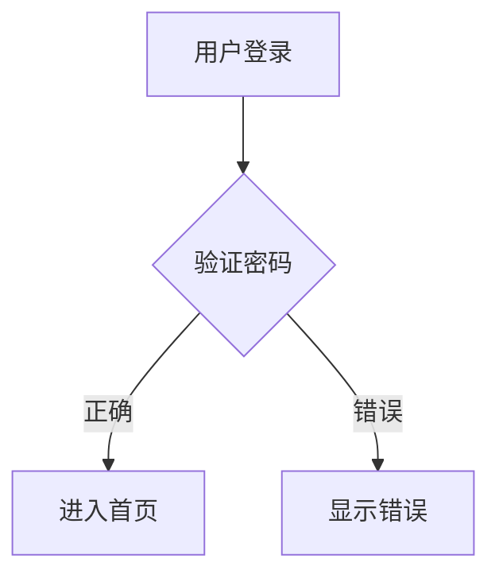
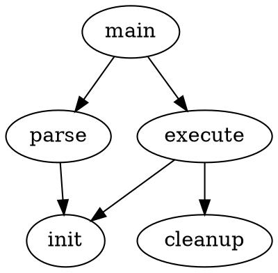

# DrawIO 全面测试文档

本文档包含各种 DrawIO 图表类型，覆盖基础、复杂、极限场景，用于全面测试渲染功能。

---

## 1. 基础流程图

```drawio
<mxfile host="app.diagrams.net">
  <diagram name="Page-1" id="flow1">
    <mxGraphModel dx="1422" dy="762" grid="1" gridSize="10" guides="1">
      <root>
        <mxCell id="0"/>
        <mxCell id="1" parent="0"/>
        <mxCell id="2" value="开始" style="rounded=1;whiteSpace=wrap;html=1;fillColor=#d5e8d4;strokeColor=#82b366;" vertex="1" parent="1">
          <mxGeometry x="160" y="40" width="120" height="60" as="geometry"/>
        </mxCell>
        <mxCell id="3" value="处理数据" style="rounded=0;whiteSpace=wrap;html=1;fillColor=#dae8fc;strokeColor=#6c8ebf;" vertex="1" parent="1">
          <mxGeometry x="160" y="140" width="120" height="60" as="geometry"/>
        </mxCell>
        <mxCell id="4" value="判断结果" style="rhombus;whiteSpace=wrap;html=1;fillColor=#fff2cc;strokeColor=#d6b656;" vertex="1" parent="1">
          <mxGeometry x="150" y="240" width="140" height="80" as="geometry"/>
        </mxCell>
        <mxCell id="5" value="成功" style="rounded=1;whiteSpace=wrap;html=1;fillColor=#d5e8d4;strokeColor=#82b366;" vertex="1" parent="1">
          <mxGeometry x="40" y="370" width="120" height="60" as="geometry"/>
        </mxCell>
        <mxCell id="6" value="失败" style="rounded=1;whiteSpace=wrap;html=1;fillColor=#f8cecc;strokeColor=#b85450;" vertex="1" parent="1">
          <mxGeometry x="280" y="370" width="120" height="60" as="geometry"/>
        </mxCell>
        <mxCell id="7" value="结束" style="rounded=1;whiteSpace=wrap;html=1;fillColor=#e1d5e7;strokeColor=#9673a6;" vertex="1" parent="1">
          <mxGeometry x="160" y="480" width="120" height="60" as="geometry"/>
        </mxCell>
        <mxCell id="8" edge="1" source="2" target="3" parent="1">
          <mxGeometry relative="1" as="geometry"/>
        </mxCell>
        <mxCell id="9" edge="1" source="3" target="4" parent="1">
          <mxGeometry relative="1" as="geometry"/>
        </mxCell>
        <mxCell id="10" value="是" edge="1" source="4" target="5" parent="1">
          <mxGeometry relative="1" as="geometry"/>
        </mxCell>
        <mxCell id="11" value="否" edge="1" source="4" target="6" parent="1">
          <mxGeometry relative="1" as="geometry"/>
        </mxCell>
        <mxCell id="12" edge="1" source="5" target="7" parent="1">
          <mxGeometry relative="1" as="geometry"/>
        </mxCell>
        <mxCell id="13" edge="1" source="6" target="7" parent="1">
          <mxGeometry relative="1" as="geometry"/>
        </mxCell>
      </root>
    </mxGraphModel>
  </diagram>
</mxfile>
```

---

## 2. 网络拓扑图

```drawio
<mxfile host="app.diagrams.net">
  <diagram name="Network" id="net1">
    <mxGraphModel dx="1200" dy="600" grid="1" gridSize="10">
      <root>
        <mxCell id="0"/>
        <mxCell id="1" parent="0"/>
        <mxCell id="2" value="互联网" style="shape=cloud;whiteSpace=wrap;html=1;fillColor=#f5f5f5;strokeColor=#666666;" vertex="1" parent="1">
          <mxGeometry x="200" y="20" width="160" height="80" as="geometry"/>
        </mxCell>
        <mxCell id="3" value="防火墙" style="shape=mxgraph.cisco.firewalls.firewall;sketch=0;html=1;fillColor=#FAFAFA;strokeColor=#005073;" vertex="1" parent="1">
          <mxGeometry x="250" y="140" width="60" height="50" as="geometry"/>
        </mxCell>
        <mxCell id="4" value="核心交换机" style="shape=mxgraph.cisco.switches.workgroup_switch;sketch=0;html=1;fillColor=#FAFAFA;strokeColor=#005073;" vertex="1" parent="1">
          <mxGeometry x="240" y="230" width="80" height="50" as="geometry"/>
        </mxCell>
        <mxCell id="5" value="Web 服务器" style="shape=mxgraph.cisco.servers.standard_server;sketch=0;html=1;fillColor=#dae8fc;strokeColor=#6c8ebf;" vertex="1" parent="1">
          <mxGeometry x="80" y="330" width="50" height="65" as="geometry"/>
        </mxCell>
        <mxCell id="6" value="数据库服务器" style="shape=mxgraph.cisco.servers.standard_server;sketch=0;html=1;fillColor=#d5e8d4;strokeColor=#82b366;" vertex="1" parent="1">
          <mxGeometry x="255" y="330" width="50" height="65" as="geometry"/>
        </mxCell>
        <mxCell id="7" value="文件服务器" style="shape=mxgraph.cisco.servers.standard_server;sketch=0;html=1;fillColor=#fff2cc;strokeColor=#d6b656;" vertex="1" parent="1">
          <mxGeometry x="430" y="330" width="50" height="65" as="geometry"/>
        </mxCell>
        <mxCell id="8" edge="1" source="2" target="3" parent="1">
          <mxGeometry relative="1" as="geometry"/>
        </mxCell>
        <mxCell id="9" edge="1" source="3" target="4" parent="1">
          <mxGeometry relative="1" as="geometry"/>
        </mxCell>
        <mxCell id="10" edge="1" source="4" target="5" parent="1">
          <mxGeometry relative="1" as="geometry"/>
        </mxCell>
        <mxCell id="11" edge="1" source="4" target="6" parent="1">
          <mxGeometry relative="1" as="geometry"/>
        </mxCell>
        <mxCell id="12" edge="1" source="4" target="7" parent="1">
          <mxGeometry relative="1" as="geometry"/>
        </mxCell>
      </root>
    </mxGraphModel>
  </diagram>
</mxfile>
```

---

## 3. UML 类图

```drawio
<mxfile host="app.diagrams.net">
  <diagram name="UML" id="uml1">
    <mxGraphModel dx="1200" dy="700" grid="1" gridSize="10">
      <root>
        <mxCell id="0"/>
        <mxCell id="1" parent="0"/>
        <mxCell id="2" value="&lt;b&gt;Animal&lt;/b&gt;&lt;hr&gt;- name: string&lt;br&gt;- age: number&lt;hr&gt;+ getName(): string&lt;br&gt;+ makeSound(): void" style="shape=note;whiteSpace=wrap;html=1;align=left;spacingLeft=10;fillColor=#f5f5f5;strokeColor=#666666;" vertex="1" parent="1">
          <mxGeometry x="180" y="40" width="200" height="120" as="geometry"/>
        </mxCell>
        <mxCell id="3" value="&lt;b&gt;Dog&lt;/b&gt;&lt;hr&gt;- breed: string&lt;hr&gt;+ fetch(): void&lt;br&gt;+ makeSound(): void" style="shape=note;whiteSpace=wrap;html=1;align=left;spacingLeft=10;fillColor=#dae8fc;strokeColor=#6c8ebf;" vertex="1" parent="1">
          <mxGeometry x="40" y="230" width="200" height="100" as="geometry"/>
        </mxCell>
        <mxCell id="4" value="&lt;b&gt;Cat&lt;/b&gt;&lt;hr&gt;- indoor: boolean&lt;hr&gt;+ purr(): void&lt;br&gt;+ makeSound(): void" style="shape=note;whiteSpace=wrap;html=1;align=left;spacingLeft=10;fillColor=#d5e8d4;strokeColor=#82b366;" vertex="1" parent="1">
          <mxGeometry x="320" y="230" width="200" height="100" as="geometry"/>
        </mxCell>
        <mxCell id="5" style="endArrow=block;endSize=16;endFill=0;" edge="1" source="3" target="2" parent="1">
          <mxGeometry relative="1" as="geometry"/>
        </mxCell>
        <mxCell id="6" style="endArrow=block;endSize=16;endFill=0;" edge="1" source="4" target="2" parent="1">
          <mxGeometry relative="1" as="geometry"/>
        </mxCell>
      </root>
    </mxGraphModel>
  </diagram>
</mxfile>
```

---

## 4. 序列图（时序图）

```drawio
<mxfile host="app.diagrams.net">
  <diagram name="Sequence" id="seq1">
    <mxGraphModel dx="1200" dy="700" grid="1" gridSize="10">
      <root>
        <mxCell id="0"/>
        <mxCell id="1" parent="0"/>
        <mxCell id="2" value="客户端" style="shape=umlLifeline;perimeter=lifelinePerimeter;whiteSpace=wrap;html=1;container=1;collapsible=0;recursiveResize=0;outlineConnect=0;fillColor=#dae8fc;strokeColor=#6c8ebf;" vertex="1" parent="1">
          <mxGeometry x="80" y="40" width="100" height="300" as="geometry"/>
        </mxCell>
        <mxCell id="3" value="API 网关" style="shape=umlLifeline;perimeter=lifelinePerimeter;whiteSpace=wrap;html=1;container=1;collapsible=0;recursiveResize=0;outlineConnect=0;fillColor=#d5e8d4;strokeColor=#82b366;" vertex="1" parent="1">
          <mxGeometry x="260" y="40" width="100" height="300" as="geometry"/>
        </mxCell>
        <mxCell id="4" value="数据库" style="shape=umlLifeline;perimeter=lifelinePerimeter;whiteSpace=wrap;html=1;container=1;collapsible=0;recursiveResize=0;outlineConnect=0;fillColor=#fff2cc;strokeColor=#d6b656;" vertex="1" parent="1">
          <mxGeometry x="440" y="40" width="100" height="300" as="geometry"/>
        </mxCell>
        <mxCell id="5" value="1. 发送请求" style="html=1;verticalAlign=bottom;endArrow=block;" edge="1" parent="1" source="2" target="3">
          <mxGeometry relative="1" as="geometry"><mxPoint y="10" as="offset"/><mxPoint as="sourcePoint"/></mxGeometry>
        </mxCell>
        <mxCell id="6" value="2. 查询数据" style="html=1;verticalAlign=bottom;endArrow=block;" edge="1" parent="1" source="3" target="4">
          <mxGeometry relative="1" as="geometry"><mxPoint y="30" as="offset"/></mxGeometry>
        </mxCell>
        <mxCell id="7" value="3. 返回结果" style="html=1;verticalAlign=bottom;endArrow=open;dashed=1;" edge="1" parent="1" source="4" target="3">
          <mxGeometry relative="1" as="geometry"><mxPoint y="50" as="offset"/></mxGeometry>
        </mxCell>
        <mxCell id="8" value="4. 响应数据" style="html=1;verticalAlign=bottom;endArrow=open;dashed=1;" edge="1" parent="1" source="3" target="2">
          <mxGeometry relative="1" as="geometry"><mxPoint y="70" as="offset"/></mxGeometry>
        </mxCell>
      </root>
    </mxGraphModel>
  </diagram>
</mxfile>
```

---

## 5. 组织架构图

```drawio
<mxfile host="app.diagrams.net">
  <diagram name="OrgChart" id="org1">
    <mxGraphModel dx="1200" dy="700" grid="1" gridSize="10">
      <root>
        <mxCell id="0"/>
        <mxCell id="1" parent="0"/>
        <mxCell id="2" value="CEO&#xa;张三" style="shape=mxgraph.org.position;whiteSpace=wrap;html=1;fillColor=#dae8fc;strokeColor=#6c8ebf;" vertex="1" parent="1">
          <mxGeometry x="220" y="20" width="120" height="60" as="geometry"/>
        </mxCell>
        <mxCell id="3" value="CTO&#xa;李四" style="shape=mxgraph.org.position;whiteSpace=wrap;html=1;fillColor=#d5e8d4;strokeColor=#82b366;" vertex="1" parent="1">
          <mxGeometry x="60" y="130" width="120" height="60" as="geometry"/>
        </mxCell>
        <mxCell id="4" value="CFO&#xa;王五" style="shape=mxgraph.org.position;whiteSpace=wrap;html=1;fillColor=#fff2cc;strokeColor=#d6b656;" vertex="1" parent="1">
          <mxGeometry x="220" y="130" width="120" height="60" as="geometry"/>
        </mxCell>
        <mxCell id="5" value="COO&#xa;赵六" style="shape=mxgraph.org.position;whiteSpace=wrap;html=1;fillColor=#f8cecc;strokeColor=#b85450;" vertex="1" parent="1">
          <mxGeometry x="380" y="130" width="120" height="60" as="geometry"/>
        </mxCell>
        <mxCell id="6" value="前端组" style="rounded=1;whiteSpace=wrap;html=1;fillColor=#f5f5f5;strokeColor=#666666;" vertex="1" parent="1">
          <mxGeometry x="10" y="240" width="90" height="40" as="geometry"/>
        </mxCell>
        <mxCell id="7" value="后端组" style="rounded=1;whiteSpace=wrap;html=1;fillColor=#f5f5f5;strokeColor=#666666;" vertex="1" parent="1">
          <mxGeometry x="120" y="240" width="90" height="40" as="geometry"/>
        </mxCell>
        <mxCell id="8" edge="1" source="2" target="3" parent="1"><mxGeometry relative="1" as="geometry"/></mxCell>
        <mxCell id="9" edge="1" source="2" target="4" parent="1"><mxGeometry relative="1" as="geometry"/></mxCell>
        <mxCell id="10" edge="1" source="2" target="5" parent="1"><mxGeometry relative="1" as="geometry"/></mxCell>
        <mxCell id="11" edge="1" source="3" target="6" parent="1"><mxGeometry relative="1" as="geometry"/></mxCell>
        <mxCell id="12" edge="1" source="3" target="7" parent="1"><mxGeometry relative="1" as="geometry"/></mxCell>
      </root>
    </mxGraphModel>
  </diagram>
</mxfile>
```

---

## 6. 泳道图（跨部门流程）

```drawio
<mxfile host="app.diagrams.net">
  <diagram name="Swimlane" id="swim1">
    <mxGraphModel dx="1200" dy="800" grid="1" gridSize="10">
      <root>
        <mxCell id="0"/>
        <mxCell id="1" parent="0"/>
        <mxCell id="pool" value="订单处理流程" style="shape=table;startSize=30;container=1;collapsible=0;childLayout=tableLayout;fixedRows=1;rowLines=0;fontStyle=1;strokeColor=#6c8ebf;fillColor=#dae8fc;" vertex="1" parent="1">
          <mxGeometry x="20" y="20" width="520" height="280" as="geometry"/>
        </mxCell>
        <mxCell id="lane1" value="客户" style="shape=tableRow;horizontal=0;startSize=60;swimlaneHead=0;swimlaneBody=0;fillColor=#d5e8d4;strokeColor=#82b366;collapsible=0;dropTarget=0;points=[[0,0.5],[1,0.5]];portConstraint=eastwest;fontSize=12;fontStyle=1;" vertex="1" parent="pool">
          <mxGeometry y="30" width="520" height="80" as="geometry"/>
        </mxCell>
        <mxCell id="lane2" value="销售" style="shape=tableRow;horizontal=0;startSize=60;swimlaneHead=0;swimlaneBody=0;fillColor=#fff2cc;strokeColor=#d6b656;collapsible=0;dropTarget=0;points=[[0,0.5],[1,0.5]];portConstraint=eastwest;fontSize=12;fontStyle=1;" vertex="1" parent="pool">
          <mxGeometry y="110" width="520" height="80" as="geometry"/>
        </mxCell>
        <mxCell id="lane3" value="仓库" style="shape=tableRow;horizontal=0;startSize=60;swimlaneHead=0;swimlaneBody=0;fillColor=#f8cecc;strokeColor=#b85450;collapsible=0;dropTarget=0;points=[[0,0.5],[1,0.5]];portConstraint=eastwest;fontSize=12;fontStyle=1;" vertex="1" parent="pool">
          <mxGeometry y="190" width="520" height="80" as="geometry"/>
        </mxCell>
      </root>
    </mxGraphModel>
  </diagram>
</mxfile>
```

---

## 7. ER 实体关系图

```drawio
<mxfile host="app.diagrams.net">
  <diagram name="ER" id="er1">
    <mxGraphModel dx="1200" dy="700" grid="1" gridSize="10">
      <root>
        <mxCell id="0"/>
        <mxCell id="1" parent="0"/>
        <mxCell id="2" value="用户 (User)&#xa;─────────&#xa;PK  id: int&#xa;    username: varchar(50)&#xa;    email: varchar(100)&#xa;    created_at: datetime" style="shape=note;whiteSpace=wrap;html=0;align=left;spacingLeft=10;fillColor=#dae8fc;strokeColor=#6c8ebf;fontFamily=Courier New;fontSize=12;" vertex="1" parent="1">
          <mxGeometry x="40" y="40" width="220" height="130" as="geometry"/>
        </mxCell>
        <mxCell id="3" value="订单 (Order)&#xa;─────────&#xa;PK  id: int&#xa;FK  user_id: int&#xa;    total: decimal(10,2)&#xa;    status: enum&#xa;    created_at: datetime" style="shape=note;whiteSpace=wrap;html=0;align=left;spacingLeft=10;fillColor=#d5e8d4;strokeColor=#82b366;fontFamily=Courier New;fontSize=12;" vertex="1" parent="1">
          <mxGeometry x="340" y="40" width="220" height="150" as="geometry"/>
        </mxCell>
        <mxCell id="4" value="商品 (Product)&#xa;─────────&#xa;PK  id: int&#xa;    name: varchar(100)&#xa;    price: decimal(10,2)&#xa;    stock: int" style="shape=note;whiteSpace=wrap;html=0;align=left;spacingLeft=10;fillColor=#fff2cc;strokeColor=#d6b656;fontFamily=Courier New;fontSize=12;" vertex="1" parent="1">
          <mxGeometry x="340" y="250" width="220" height="130" as="geometry"/>
        </mxCell>
        <mxCell id="5" value="1:N" style="endArrow=ERmany;startArrow=ERone;endFill=0;startFill=0;" edge="1" source="2" target="3" parent="1">
          <mxGeometry relative="1" as="geometry"/>
        </mxCell>
        <mxCell id="6" value="N:M" style="endArrow=ERmany;startArrow=ERmany;endFill=0;startFill=0;" edge="1" source="3" target="4" parent="1">
          <mxGeometry relative="1" as="geometry"/>
        </mxCell>
      </root>
    </mxGraphModel>
  </diagram>
</mxfile>
```

---

## 8. 状态机图

```drawio
<mxfile host="app.diagrams.net">
  <diagram name="StateMachine" id="sm1">
    <mxGraphModel dx="1200" dy="600" grid="1" gridSize="10">
      <root>
        <mxCell id="0"/>
        <mxCell id="1" parent="0"/>
        <mxCell id="2" value="" style="ellipse;fillColor=#000000;strokeColor=#000000;" vertex="1" parent="1">
          <mxGeometry x="40" y="110" width="30" height="30" as="geometry"/>
        </mxCell>
        <mxCell id="3" value="待支付" style="rounded=1;whiteSpace=wrap;html=1;fillColor=#fff2cc;strokeColor=#d6b656;" vertex="1" parent="1">
          <mxGeometry x="120" y="100" width="100" height="50" as="geometry"/>
        </mxCell>
        <mxCell id="4" value="已支付" style="rounded=1;whiteSpace=wrap;html=1;fillColor=#d5e8d4;strokeColor=#82b366;" vertex="1" parent="1">
          <mxGeometry x="280" y="100" width="100" height="50" as="geometry"/>
        </mxCell>
        <mxCell id="5" value="已发货" style="rounded=1;whiteSpace=wrap;html=1;fillColor=#dae8fc;strokeColor=#6c8ebf;" vertex="1" parent="1">
          <mxGeometry x="440" y="100" width="100" height="50" as="geometry"/>
        </mxCell>
        <mxCell id="6" value="已完成" style="rounded=1;whiteSpace=wrap;html=1;fillColor=#d5e8d4;strokeColor=#82b366;strokeWidth=3;" vertex="1" parent="1">
          <mxGeometry x="440" y="210" width="100" height="50" as="geometry"/>
        </mxCell>
        <mxCell id="7" value="已取消" style="rounded=1;whiteSpace=wrap;html=1;fillColor=#f8cecc;strokeColor=#b85450;" vertex="1" parent="1">
          <mxGeometry x="120" y="210" width="100" height="50" as="geometry"/>
        </mxCell>
        <mxCell id="8" value="创建" edge="1" source="2" target="3" parent="1"><mxGeometry relative="1" as="geometry"/></mxCell>
        <mxCell id="9" value="支付" edge="1" source="3" target="4" parent="1"><mxGeometry relative="1" as="geometry"/></mxCell>
        <mxCell id="10" value="发货" edge="1" source="4" target="5" parent="1"><mxGeometry relative="1" as="geometry"/></mxCell>
        <mxCell id="11" value="确认收货" edge="1" source="5" target="6" parent="1"><mxGeometry relative="1" as="geometry"/></mxCell>
        <mxCell id="12" value="取消" style="dashed=1;" edge="1" source="3" target="7" parent="1"><mxGeometry relative="1" as="geometry"/></mxCell>
      </root>
    </mxGraphModel>
  </diagram>
</mxfile>
```

---

## 9. 使用 `dio` 别名

```dio
<mxGraphModel dx="800" dy="400" grid="1" gridSize="10">
  <root>
    <mxCell id="0"/>
    <mxCell id="1" parent="0"/>
    <mxCell id="2" value="A" style="ellipse;whiteSpace=wrap;html=1;fillColor=#dae8fc;strokeColor=#6c8ebf;" vertex="1" parent="1">
      <mxGeometry x="40" y="40" width="80" height="80" as="geometry"/>
    </mxCell>
    <mxCell id="3" value="B" style="ellipse;whiteSpace=wrap;html=1;fillColor=#d5e8d4;strokeColor=#82b366;" vertex="1" parent="1">
      <mxGeometry x="200" y="40" width="80" height="80" as="geometry"/>
    </mxCell>
    <mxCell id="4" value="C" style="ellipse;whiteSpace=wrap;html=1;fillColor=#fff2cc;strokeColor=#d6b656;" vertex="1" parent="1">
      <mxGeometry x="360" y="40" width="80" height="80" as="geometry"/>
    </mxCell>
    <mxCell id="5" value="" edge="1" source="2" target="3" parent="1">
      <mxGeometry relative="1" as="geometry"/>
    </mxCell>
    <mxCell id="6" value="" edge="1" source="3" target="4" parent="1">
      <mxGeometry relative="1" as="geometry"/>
    </mxCell>
  </root>
</mxGraphModel>
```

---

## 10. 仅 mxGraphModel（无 mxfile 包裹）

```drawio
<mxGraphModel>
  <root>
    <mxCell id="0"/>
    <mxCell id="1" parent="0"/>
    <mxCell id="2" value="节点 1" style="rounded=1;whiteSpace=wrap;html=1;" vertex="1" parent="1">
      <mxGeometry x="40" y="40" width="120" height="60" as="geometry"/>
    </mxCell>
    <mxCell id="3" value="节点 2" style="rounded=1;whiteSpace=wrap;html=1;" vertex="1" parent="1">
      <mxGeometry x="240" y="40" width="120" height="60" as="geometry"/>
    </mxCell>
    <mxCell id="4" value="连接" edge="1" source="2" target="3" parent="1">
      <mxGeometry relative="1" as="geometry"/>
    </mxCell>
  </root>
</mxGraphModel>
```

---

## 11. 复杂多层嵌套流程图

包含子流程容器（group）的复杂流程图，15+ 节点，嵌套容器，测试层级渲染。

```drawio
<mxfile host="app.diagrams.net">
  <diagram name="NestedFlow" id="nested1">
    <mxGraphModel dx="1600" dy="900" grid="1" gridSize="10">
      <root>
        <mxCell id="0"/>
        <mxCell id="1" parent="0"/>
        <mxCell id="g1" value="主流程" style="group;rounded=1;fillColor=#f5f5f5;strokeColor=#666666;fontStyle=1;fontSize=14;verticalAlign=top;container=1;collapsible=0;" vertex="1" parent="1">
          <mxGeometry x="20" y="20" width="700" height="520" as="geometry"/>
        </mxCell>
        <mxCell id="n1" value="开始" style="ellipse;whiteSpace=wrap;html=1;fillColor=#d5e8d4;strokeColor=#82b366;" vertex="1" parent="g1">
          <mxGeometry x="280" y="20" width="80" height="40" as="geometry"/>
        </mxCell>
        <mxCell id="n2" value="接收请求" style="rounded=0;whiteSpace=wrap;html=1;fillColor=#dae8fc;strokeColor=#6c8ebf;" vertex="1" parent="g1">
          <mxGeometry x="260" y="80" width="120" height="40" as="geometry"/>
        </mxCell>
        <mxCell id="n3" value="验证参数?" style="rhombus;whiteSpace=wrap;html=1;fillColor=#fff2cc;strokeColor=#d6b656;" vertex="1" parent="g1">
          <mxGeometry x="260" y="140" width="120" height="60" as="geometry"/>
        </mxCell>
        <mxCell id="n4" value="返回400" style="rounded=1;whiteSpace=wrap;html=1;fillColor=#f8cecc;strokeColor=#b85450;" vertex="1" parent="g1">
          <mxGeometry x="500" y="145" width="100" height="40" as="geometry"/>
        </mxCell>
        <mxCell id="g2" value="业务处理子流程" style="group;rounded=1;fillColor=#e1d5e7;strokeColor=#9673a6;fontStyle=1;fontSize=12;verticalAlign=top;container=1;collapsible=0;" vertex="1" parent="g1">
          <mxGeometry x="40" y="230" width="560" height="180" as="geometry"/>
        </mxCell>
        <mxCell id="n5" value="查询缓存" style="rounded=0;whiteSpace=wrap;html=1;fillColor=#dae8fc;strokeColor=#6c8ebf;" vertex="1" parent="g2">
          <mxGeometry x="20" y="40" width="100" height="40" as="geometry"/>
        </mxCell>
        <mxCell id="n6" value="命中?" style="rhombus;whiteSpace=wrap;html=1;fillColor=#fff2cc;strokeColor=#d6b656;" vertex="1" parent="g2">
          <mxGeometry x="160" y="30" width="80" height="60" as="geometry"/>
        </mxCell>
        <mxCell id="n7" value="查询数据库" style="rounded=0;whiteSpace=wrap;html=1;fillColor=#dae8fc;strokeColor=#6c8ebf;" vertex="1" parent="g2">
          <mxGeometry x="160" y="120" width="100" height="40" as="geometry"/>
        </mxCell>
        <mxCell id="n8" value="更新缓存" style="rounded=0;whiteSpace=wrap;html=1;fillColor=#dae8fc;strokeColor=#6c8ebf;" vertex="1" parent="g2">
          <mxGeometry x="310" y="120" width="100" height="40" as="geometry"/>
        </mxCell>
        <mxCell id="n9" value="数据转换" style="rounded=0;whiteSpace=wrap;html=1;fillColor=#dae8fc;strokeColor=#6c8ebf;" vertex="1" parent="g2">
          <mxGeometry x="310" y="40" width="100" height="40" as="geometry"/>
        </mxCell>
        <mxCell id="n10" value="组装响应" style="rounded=0;whiteSpace=wrap;html=1;fillColor=#d5e8d4;strokeColor=#82b366;" vertex="1" parent="g2">
          <mxGeometry x="440" y="40" width="100" height="40" as="geometry"/>
        </mxCell>
        <mxCell id="n11" value="返回结果" style="rounded=0;whiteSpace=wrap;html=1;fillColor=#d5e8d4;strokeColor=#82b366;" vertex="1" parent="g1">
          <mxGeometry x="260" y="440" width="120" height="40" as="geometry"/>
        </mxCell>
        <mxCell id="n12" value="结束" style="ellipse;whiteSpace=wrap;html=1;fillColor=#d5e8d4;strokeColor=#82b366;" vertex="1" parent="g1">
          <mxGeometry x="280" y="500" width="80" height="40" as="geometry"/>
        </mxCell>
        <mxCell id="e1" edge="1" source="n1" target="n2" parent="g1"><mxGeometry relative="1" as="geometry"/></mxCell>
        <mxCell id="e2" edge="1" source="n2" target="n3" parent="g1"><mxGeometry relative="1" as="geometry"/></mxCell>
        <mxCell id="e3" value="否" edge="1" source="n3" target="n4" parent="g1"><mxGeometry relative="1" as="geometry"/></mxCell>
        <mxCell id="e4" value="是" edge="1" source="n3" target="g2" parent="g1"><mxGeometry relative="1" as="geometry"/></mxCell>
        <mxCell id="e5" edge="1" source="n5" target="n6" parent="g2"><mxGeometry relative="1" as="geometry"/></mxCell>
        <mxCell id="e6" value="是" edge="1" source="n6" target="n9" parent="g2"><mxGeometry relative="1" as="geometry"/></mxCell>
        <mxCell id="e7" value="否" edge="1" source="n6" target="n7" parent="g2"><mxGeometry relative="1" as="geometry"/></mxCell>
        <mxCell id="e8" edge="1" source="n7" target="n8" parent="g2"><mxGeometry relative="1" as="geometry"/></mxCell>
        <mxCell id="e9" edge="1" source="n8" target="n9" parent="g2"><mxGeometry relative="1" as="geometry"/></mxCell>
        <mxCell id="e10" edge="1" source="n9" target="n10" parent="g2"><mxGeometry relative="1" as="geometry"/></mxCell>
        <mxCell id="e11" edge="1" source="g2" target="n11" parent="g1"><mxGeometry relative="1" as="geometry"/></mxCell>
        <mxCell id="e12" edge="1" source="n11" target="n12" parent="g1"><mxGeometry relative="1" as="geometry"/></mxCell>
      </root>
    </mxGraphModel>
  </diagram>
</mxfile>
```

---

## 12. 大规模节点图（压力测试）

30+ 节点、40+ 连线的大型图表，网格布局排列，测试渲染性能。

```drawio
<mxfile host="app.diagrams.net">
  <diagram name="StressTest" id="stress1">
    <mxGraphModel dx="2400" dy="1600" grid="1" gridSize="10">
      <root>
        <mxCell id="0"/>
        <mxCell id="1" parent="0"/>
        <mxCell id="s2" value="N-01" style="rounded=1;whiteSpace=wrap;html=1;fillColor=#dae8fc;strokeColor=#6c8ebf;fontSize=10;" vertex="1" parent="1">
          <mxGeometry x="20" y="20" width="80" height="40" as="geometry"/>
        </mxCell>
        <mxCell id="s3" value="N-02" style="rounded=1;whiteSpace=wrap;html=1;fillColor=#d5e8d4;strokeColor=#82b366;fontSize=10;" vertex="1" parent="1">
          <mxGeometry x="140" y="20" width="80" height="40" as="geometry"/>
        </mxCell>
        <mxCell id="s4" value="N-03" style="rounded=1;whiteSpace=wrap;html=1;fillColor=#fff2cc;strokeColor=#d6b656;fontSize=10;" vertex="1" parent="1">
          <mxGeometry x="260" y="20" width="80" height="40" as="geometry"/>
        </mxCell>
        <mxCell id="s5" value="N-04" style="rounded=1;whiteSpace=wrap;html=1;fillColor=#f8cecc;strokeColor=#b85450;fontSize=10;" vertex="1" parent="1">
          <mxGeometry x="380" y="20" width="80" height="40" as="geometry"/>
        </mxCell>
        <mxCell id="s6" value="N-05" style="rounded=1;whiteSpace=wrap;html=1;fillColor=#e1d5e7;strokeColor=#9673a6;fontSize=10;" vertex="1" parent="1">
          <mxGeometry x="500" y="20" width="80" height="40" as="geometry"/>
        </mxCell>
        <mxCell id="s7" value="N-06" style="rounded=1;whiteSpace=wrap;html=1;fillColor=#dae8fc;strokeColor=#6c8ebf;fontSize=10;" vertex="1" parent="1">
          <mxGeometry x="620" y="20" width="80" height="40" as="geometry"/>
        </mxCell>
        <mxCell id="s8" value="N-07" style="rounded=1;whiteSpace=wrap;html=1;fillColor=#d5e8d4;strokeColor=#82b366;fontSize=10;" vertex="1" parent="1">
          <mxGeometry x="20" y="100" width="80" height="40" as="geometry"/>
        </mxCell>
        <mxCell id="s9" value="N-08" style="rounded=1;whiteSpace=wrap;html=1;fillColor=#fff2cc;strokeColor=#d6b656;fontSize=10;" vertex="1" parent="1">
          <mxGeometry x="140" y="100" width="80" height="40" as="geometry"/>
        </mxCell>
        <mxCell id="s10" value="N-09" style="rounded=1;whiteSpace=wrap;html=1;fillColor=#f8cecc;strokeColor=#b85450;fontSize=10;" vertex="1" parent="1">
          <mxGeometry x="260" y="100" width="80" height="40" as="geometry"/>
        </mxCell>
        <mxCell id="s11" value="N-10" style="rounded=1;whiteSpace=wrap;html=1;fillColor=#e1d5e7;strokeColor=#9673a6;fontSize=10;" vertex="1" parent="1">
          <mxGeometry x="380" y="100" width="80" height="40" as="geometry"/>
        </mxCell>
        <mxCell id="s12" value="N-11" style="rounded=1;whiteSpace=wrap;html=1;fillColor=#dae8fc;strokeColor=#6c8ebf;fontSize=10;" vertex="1" parent="1">
          <mxGeometry x="500" y="100" width="80" height="40" as="geometry"/>
        </mxCell>
        <mxCell id="s13" value="N-12" style="rounded=1;whiteSpace=wrap;html=1;fillColor=#d5e8d4;strokeColor=#82b366;fontSize=10;" vertex="1" parent="1">
          <mxGeometry x="620" y="100" width="80" height="40" as="geometry"/>
        </mxCell>
        <mxCell id="s14" value="N-13" style="rounded=1;whiteSpace=wrap;html=1;fillColor=#fff2cc;strokeColor=#d6b656;fontSize=10;" vertex="1" parent="1">
          <mxGeometry x="20" y="180" width="80" height="40" as="geometry"/>
        </mxCell>
        <mxCell id="s15" value="N-14" style="rounded=1;whiteSpace=wrap;html=1;fillColor=#f8cecc;strokeColor=#b85450;fontSize=10;" vertex="1" parent="1">
          <mxGeometry x="140" y="180" width="80" height="40" as="geometry"/>
        </mxCell>
        <mxCell id="s16" value="N-15" style="rounded=1;whiteSpace=wrap;html=1;fillColor=#e1d5e7;strokeColor=#9673a6;fontSize=10;" vertex="1" parent="1">
          <mxGeometry x="260" y="180" width="80" height="40" as="geometry"/>
        </mxCell>
        <mxCell id="s17" value="N-16" style="rounded=1;whiteSpace=wrap;html=1;fillColor=#dae8fc;strokeColor=#6c8ebf;fontSize=10;" vertex="1" parent="1">
          <mxGeometry x="380" y="180" width="80" height="40" as="geometry"/>
        </mxCell>
        <mxCell id="s18" value="N-17" style="rounded=1;whiteSpace=wrap;html=1;fillColor=#d5e8d4;strokeColor=#82b366;fontSize=10;" vertex="1" parent="1">
          <mxGeometry x="500" y="180" width="80" height="40" as="geometry"/>
        </mxCell>
        <mxCell id="s19" value="N-18" style="rounded=1;whiteSpace=wrap;html=1;fillColor=#fff2cc;strokeColor=#d6b656;fontSize=10;" vertex="1" parent="1">
          <mxGeometry x="620" y="180" width="80" height="40" as="geometry"/>
        </mxCell>
        <mxCell id="s20" value="N-19" style="rounded=1;whiteSpace=wrap;html=1;fillColor=#f8cecc;strokeColor=#b85450;fontSize=10;" vertex="1" parent="1">
          <mxGeometry x="20" y="260" width="80" height="40" as="geometry"/>
        </mxCell>
        <mxCell id="s21" value="N-20" style="rounded=1;whiteSpace=wrap;html=1;fillColor=#e1d5e7;strokeColor=#9673a6;fontSize=10;" vertex="1" parent="1">
          <mxGeometry x="140" y="260" width="80" height="40" as="geometry"/>
        </mxCell>
        <mxCell id="s22" value="N-21" style="rounded=1;whiteSpace=wrap;html=1;fillColor=#dae8fc;strokeColor=#6c8ebf;fontSize=10;" vertex="1" parent="1">
          <mxGeometry x="260" y="260" width="80" height="40" as="geometry"/>
        </mxCell>
        <mxCell id="s23" value="N-22" style="rounded=1;whiteSpace=wrap;html=1;fillColor=#d5e8d4;strokeColor=#82b366;fontSize=10;" vertex="1" parent="1">
          <mxGeometry x="380" y="260" width="80" height="40" as="geometry"/>
        </mxCell>
        <mxCell id="s24" value="N-23" style="rounded=1;whiteSpace=wrap;html=1;fillColor=#fff2cc;strokeColor=#d6b656;fontSize=10;" vertex="1" parent="1">
          <mxGeometry x="500" y="260" width="80" height="40" as="geometry"/>
        </mxCell>
        <mxCell id="s25" value="N-24" style="rounded=1;whiteSpace=wrap;html=1;fillColor=#f8cecc;strokeColor=#b85450;fontSize=10;" vertex="1" parent="1">
          <mxGeometry x="620" y="260" width="80" height="40" as="geometry"/>
        </mxCell>
        <mxCell id="s26" value="N-25" style="rounded=1;whiteSpace=wrap;html=1;fillColor=#e1d5e7;strokeColor=#9673a6;fontSize=10;" vertex="1" parent="1">
          <mxGeometry x="20" y="340" width="80" height="40" as="geometry"/>
        </mxCell>
        <mxCell id="s27" value="N-26" style="rounded=1;whiteSpace=wrap;html=1;fillColor=#dae8fc;strokeColor=#6c8ebf;fontSize=10;" vertex="1" parent="1">
          <mxGeometry x="140" y="340" width="80" height="40" as="geometry"/>
        </mxCell>
        <mxCell id="s28" value="N-27" style="rounded=1;whiteSpace=wrap;html=1;fillColor=#d5e8d4;strokeColor=#82b366;fontSize=10;" vertex="1" parent="1">
          <mxGeometry x="260" y="340" width="80" height="40" as="geometry"/>
        </mxCell>
        <mxCell id="s29" value="N-28" style="rounded=1;whiteSpace=wrap;html=1;fillColor=#fff2cc;strokeColor=#d6b656;fontSize=10;" vertex="1" parent="1">
          <mxGeometry x="380" y="340" width="80" height="40" as="geometry"/>
        </mxCell>
        <mxCell id="s30" value="N-29" style="rounded=1;whiteSpace=wrap;html=1;fillColor=#f8cecc;strokeColor=#b85450;fontSize=10;" vertex="1" parent="1">
          <mxGeometry x="500" y="340" width="80" height="40" as="geometry"/>
        </mxCell>
        <mxCell id="s31" value="N-30" style="rounded=1;whiteSpace=wrap;html=1;fillColor=#e1d5e7;strokeColor=#9673a6;fontSize=10;" vertex="1" parent="1">
          <mxGeometry x="620" y="340" width="80" height="40" as="geometry"/>
        </mxCell>
        <mxCell id="s32" value="N-31" style="rounded=1;whiteSpace=wrap;html=1;fillColor=#dae8fc;strokeColor=#6c8ebf;fontSize=10;" vertex="1" parent="1">
          <mxGeometry x="20" y="420" width="80" height="40" as="geometry"/>
        </mxCell>
        <mxCell id="s33" value="N-32" style="rounded=1;whiteSpace=wrap;html=1;fillColor=#d5e8d4;strokeColor=#82b366;fontSize=10;" vertex="1" parent="1">
          <mxGeometry x="140" y="420" width="80" height="40" as="geometry"/>
        </mxCell>
        <mxCell id="se1" edge="1" source="s2" target="s3" parent="1"><mxGeometry relative="1" as="geometry"/></mxCell>
        <mxCell id="se2" edge="1" source="s3" target="s4" parent="1"><mxGeometry relative="1" as="geometry"/></mxCell>
        <mxCell id="se3" edge="1" source="s4" target="s5" parent="1"><mxGeometry relative="1" as="geometry"/></mxCell>
        <mxCell id="se4" edge="1" source="s5" target="s6" parent="1"><mxGeometry relative="1" as="geometry"/></mxCell>
        <mxCell id="se5" edge="1" source="s6" target="s7" parent="1"><mxGeometry relative="1" as="geometry"/></mxCell>
        <mxCell id="se6" edge="1" source="s2" target="s8" parent="1"><mxGeometry relative="1" as="geometry"/></mxCell>
        <mxCell id="se7" edge="1" source="s3" target="s9" parent="1"><mxGeometry relative="1" as="geometry"/></mxCell>
        <mxCell id="se8" edge="1" source="s4" target="s10" parent="1"><mxGeometry relative="1" as="geometry"/></mxCell>
        <mxCell id="se9" edge="1" source="s5" target="s11" parent="1"><mxGeometry relative="1" as="geometry"/></mxCell>
        <mxCell id="se10" edge="1" source="s6" target="s12" parent="1"><mxGeometry relative="1" as="geometry"/></mxCell>
        <mxCell id="se11" edge="1" source="s7" target="s13" parent="1"><mxGeometry relative="1" as="geometry"/></mxCell>
        <mxCell id="se12" edge="1" source="s8" target="s9" parent="1"><mxGeometry relative="1" as="geometry"/></mxCell>
        <mxCell id="se13" edge="1" source="s9" target="s10" parent="1"><mxGeometry relative="1" as="geometry"/></mxCell>
        <mxCell id="se14" edge="1" source="s10" target="s11" parent="1"><mxGeometry relative="1" as="geometry"/></mxCell>
        <mxCell id="se15" edge="1" source="s11" target="s12" parent="1"><mxGeometry relative="1" as="geometry"/></mxCell>
        <mxCell id="se16" edge="1" source="s12" target="s13" parent="1"><mxGeometry relative="1" as="geometry"/></mxCell>
        <mxCell id="se17" edge="1" source="s8" target="s14" parent="1"><mxGeometry relative="1" as="geometry"/></mxCell>
        <mxCell id="se18" edge="1" source="s9" target="s15" parent="1"><mxGeometry relative="1" as="geometry"/></mxCell>
        <mxCell id="se19" edge="1" source="s10" target="s16" parent="1"><mxGeometry relative="1" as="geometry"/></mxCell>
        <mxCell id="se20" edge="1" source="s11" target="s17" parent="1"><mxGeometry relative="1" as="geometry"/></mxCell>
        <mxCell id="se21" edge="1" source="s12" target="s18" parent="1"><mxGeometry relative="1" as="geometry"/></mxCell>
        <mxCell id="se22" edge="1" source="s13" target="s19" parent="1"><mxGeometry relative="1" as="geometry"/></mxCell>
        <mxCell id="se23" edge="1" source="s14" target="s15" parent="1"><mxGeometry relative="1" as="geometry"/></mxCell>
        <mxCell id="se24" edge="1" source="s15" target="s16" parent="1"><mxGeometry relative="1" as="geometry"/></mxCell>
        <mxCell id="se25" edge="1" source="s16" target="s17" parent="1"><mxGeometry relative="1" as="geometry"/></mxCell>
        <mxCell id="se26" edge="1" source="s17" target="s18" parent="1"><mxGeometry relative="1" as="geometry"/></mxCell>
        <mxCell id="se27" edge="1" source="s18" target="s19" parent="1"><mxGeometry relative="1" as="geometry"/></mxCell>
        <mxCell id="se28" edge="1" source="s14" target="s20" parent="1"><mxGeometry relative="1" as="geometry"/></mxCell>
        <mxCell id="se29" edge="1" source="s15" target="s21" parent="1"><mxGeometry relative="1" as="geometry"/></mxCell>
        <mxCell id="se30" edge="1" source="s16" target="s22" parent="1"><mxGeometry relative="1" as="geometry"/></mxCell>
        <mxCell id="se31" edge="1" source="s17" target="s23" parent="1"><mxGeometry relative="1" as="geometry"/></mxCell>
        <mxCell id="se32" edge="1" source="s18" target="s24" parent="1"><mxGeometry relative="1" as="geometry"/></mxCell>
        <mxCell id="se33" edge="1" source="s19" target="s25" parent="1"><mxGeometry relative="1" as="geometry"/></mxCell>
        <mxCell id="se34" edge="1" source="s20" target="s21" parent="1"><mxGeometry relative="1" as="geometry"/></mxCell>
        <mxCell id="se35" edge="1" source="s21" target="s22" parent="1"><mxGeometry relative="1" as="geometry"/></mxCell>
        <mxCell id="se36" edge="1" source="s22" target="s23" parent="1"><mxGeometry relative="1" as="geometry"/></mxCell>
        <mxCell id="se37" edge="1" source="s23" target="s24" parent="1"><mxGeometry relative="1" as="geometry"/></mxCell>
        <mxCell id="se38" edge="1" source="s24" target="s25" parent="1"><mxGeometry relative="1" as="geometry"/></mxCell>
        <mxCell id="se39" edge="1" source="s20" target="s26" parent="1"><mxGeometry relative="1" as="geometry"/></mxCell>
        <mxCell id="se40" edge="1" source="s21" target="s27" parent="1"><mxGeometry relative="1" as="geometry"/></mxCell>
        <mxCell id="se41" edge="1" source="s22" target="s28" parent="1"><mxGeometry relative="1" as="geometry"/></mxCell>
        <mxCell id="se42" edge="1" source="s23" target="s29" parent="1"><mxGeometry relative="1" as="geometry"/></mxCell>
        <mxCell id="se43" edge="1" source="s24" target="s30" parent="1"><mxGeometry relative="1" as="geometry"/></mxCell>
        <mxCell id="se44" edge="1" source="s25" target="s31" parent="1"><mxGeometry relative="1" as="geometry"/></mxCell>
        <mxCell id="se45" edge="1" source="s26" target="s32" parent="1"><mxGeometry relative="1" as="geometry"/></mxCell>
        <mxCell id="se46" edge="1" source="s27" target="s33" parent="1"><mxGeometry relative="1" as="geometry"/></mxCell>
        <mxCell id="se47" edge="1" source="s26" target="s27" parent="1"><mxGeometry relative="1" as="geometry"/></mxCell>
        <mxCell id="se48" edge="1" source="s27" target="s28" parent="1"><mxGeometry relative="1" as="geometry"/></mxCell>
      </root>
    </mxGraphModel>
  </diagram>
</mxfile>
```

---

## 13. 丰富样式测试

测试各种样式属性：渐变填充、阴影、圆角、虚线边框、粗线条、不同字体大小、文字颜色、透明度等。

```drawio
<mxfile host="app.diagrams.net">
  <diagram name="Styles" id="style1">
    <mxGraphModel dx="1400" dy="800" grid="1" gridSize="10">
      <root>
        <mxCell id="0"/>
        <mxCell id="1" parent="0"/>
        <mxCell id="2" value="渐变填充" style="rounded=1;whiteSpace=wrap;html=1;fillColor=#dae8fc;gradientColor=#7ea6e0;gradientDirection=south;strokeColor=#6c8ebf;fontSize=14;fontStyle=1;" vertex="1" parent="1">
          <mxGeometry x="20" y="20" width="140" height="60" as="geometry"/>
        </mxCell>
        <mxCell id="3" value="阴影效果" style="rounded=1;whiteSpace=wrap;html=1;fillColor=#d5e8d4;strokeColor=#82b366;shadow=1;fontSize=14;" vertex="1" parent="1">
          <mxGeometry x="200" y="20" width="140" height="60" as="geometry"/>
        </mxCell>
        <mxCell id="4" value="大圆角" style="rounded=1;whiteSpace=wrap;html=1;fillColor=#fff2cc;strokeColor=#d6b656;arcSize=50;fontSize=14;" vertex="1" parent="1">
          <mxGeometry x="380" y="20" width="140" height="60" as="geometry"/>
        </mxCell>
        <mxCell id="5" value="虚线边框" style="rounded=0;whiteSpace=wrap;html=1;fillColor=#f5f5f5;strokeColor=#666666;dashed=1;dashPattern=5 5;fontSize=14;" vertex="1" parent="1">
          <mxGeometry x="560" y="20" width="140" height="60" as="geometry"/>
        </mxCell>
        <mxCell id="6" value="粗线条" style="rounded=0;whiteSpace=wrap;html=1;fillColor=#f8cecc;strokeColor=#b85450;strokeWidth=4;fontSize=14;" vertex="1" parent="1">
          <mxGeometry x="20" y="120" width="140" height="60" as="geometry"/>
        </mxCell>
        <mxCell id="7" value="小字体" style="rounded=0;whiteSpace=wrap;html=1;fillColor=#e1d5e7;strokeColor=#9673a6;fontSize=8;" vertex="1" parent="1">
          <mxGeometry x="200" y="120" width="140" height="60" as="geometry"/>
        </mxCell>
        <mxCell id="8" value="大字体" style="rounded=0;whiteSpace=wrap;html=1;fillColor=#dae8fc;strokeColor=#6c8ebf;fontSize=24;fontStyle=1;" vertex="1" parent="1">
          <mxGeometry x="380" y="120" width="140" height="60" as="geometry"/>
        </mxCell>
        <mxCell id="9" value="红色文字" style="rounded=0;whiteSpace=wrap;html=1;fillColor=#f5f5f5;strokeColor=#666666;fontColor=#FF0000;fontSize=14;fontStyle=1;" vertex="1" parent="1">
          <mxGeometry x="560" y="120" width="140" height="60" as="geometry"/>
        </mxCell>
        <mxCell id="10" value="半透明" style="rounded=1;whiteSpace=wrap;html=1;fillColor=#dae8fc;strokeColor=#6c8ebf;opacity=50;fontSize=14;" vertex="1" parent="1">
          <mxGeometry x="20" y="220" width="140" height="60" as="geometry"/>
        </mxCell>
        <mxCell id="11" value="点线边框" style="rounded=0;whiteSpace=wrap;html=1;fillColor=#d5e8d4;strokeColor=#82b366;dashed=1;dashPattern=1 4;fontSize=14;" vertex="1" parent="1">
          <mxGeometry x="200" y="220" width="140" height="60" as="geometry"/>
        </mxCell>
        <mxCell id="12" value="双线边框" style="rounded=0;whiteSpace=wrap;html=1;fillColor=#fff2cc;strokeColor=#d6b656;strokeWidth=2;fontSize=14;fontStyle=5;" vertex="1" parent="1">
          <mxGeometry x="380" y="220" width="140" height="60" as="geometry"/>
        </mxCell>
        <mxCell id="13" value="无边框" style="rounded=1;whiteSpace=wrap;html=1;fillColor=#e1d5e7;strokeColor=none;fontSize=14;" vertex="1" parent="1">
          <mxGeometry x="560" y="220" width="140" height="60" as="geometry"/>
        </mxCell>
        <mxCell id="14" value="渐变+阴影" style="rounded=1;whiteSpace=wrap;html=1;fillColor=#f8cecc;gradientColor=#ea6b66;strokeColor=#b85450;shadow=1;fontSize=14;fontColor=#FFFFFF;fontStyle=1;" vertex="1" parent="1">
          <mxGeometry x="20" y="320" width="140" height="60" as="geometry"/>
        </mxCell>
        <mxCell id="15" value="斜体+下划线" style="rounded=0;whiteSpace=wrap;html=1;fillColor=#dae8fc;strokeColor=#6c8ebf;fontSize=14;fontStyle=6;" vertex="1" parent="1">
          <mxGeometry x="200" y="320" width="140" height="60" as="geometry"/>
        </mxCell>
      </root>
    </mxGraphModel>
  </diagram>
</mxfile>
```

---

## 14. 各种形状测试

测试 DrawIO 内置的各种形状：三角形、六边形、平行四边形、圆柱体、文档形状、手动输入形状、存储形状等。

```drawio
<mxfile host="app.diagrams.net">
  <diagram name="Shapes" id="shapes1">
    <mxGraphModel dx="1400" dy="900" grid="1" gridSize="10">
      <root>
        <mxCell id="0"/>
        <mxCell id="1" parent="0"/>
        <mxCell id="2" value="三角形" style="triangle;whiteSpace=wrap;html=1;fillColor=#dae8fc;strokeColor=#6c8ebf;" vertex="1" parent="1">
          <mxGeometry x="20" y="20" width="100" height="80" as="geometry"/>
        </mxCell>
        <mxCell id="3" value="六边形" style="shape=hexagon;perimeter=hexagonPerimeter2;whiteSpace=wrap;html=1;fixedSize=1;fillColor=#d5e8d4;strokeColor=#82b366;" vertex="1" parent="1">
          <mxGeometry x="160" y="20" width="120" height="80" as="geometry"/>
        </mxCell>
        <mxCell id="4" value="平行四边形" style="shape=parallelogram;perimeter=parallelogramPerimeter;whiteSpace=wrap;html=1;fixedSize=1;fillColor=#fff2cc;strokeColor=#d6b656;" vertex="1" parent="1">
          <mxGeometry x="320" y="20" width="140" height="80" as="geometry"/>
        </mxCell>
        <mxCell id="5" value="圆柱体" style="shape=cylinder3;whiteSpace=wrap;html=1;boundedLbl=1;backgroundOutline=1;size=15;fillColor=#f8cecc;strokeColor=#b85450;" vertex="1" parent="1">
          <mxGeometry x="500" y="10" width="100" height="100" as="geometry"/>
        </mxCell>
        <mxCell id="6" value="文档" style="shape=document;whiteSpace=wrap;html=1;boundedLbl=1;backgroundOutline=1;size=0.27;fillColor=#e1d5e7;strokeColor=#9673a6;" vertex="1" parent="1">
          <mxGeometry x="640" y="20" width="100" height="80" as="geometry"/>
        </mxCell>
        <mxCell id="7" value="手动输入" style="shape=manualInput;whiteSpace=wrap;html=1;fillColor=#dae8fc;strokeColor=#6c8ebf;" vertex="1" parent="1">
          <mxGeometry x="20" y="140" width="100" height="80" as="geometry"/>
        </mxCell>
        <mxCell id="8" value="存储" style="shape=dataStorage;whiteSpace=wrap;html=1;fixedSize=1;fillColor=#d5e8d4;strokeColor=#82b366;" vertex="1" parent="1">
          <mxGeometry x="160" y="140" width="120" height="80" as="geometry"/>
        </mxCell>
        <mxCell id="9" value="梯形" style="shape=trapezoid;perimeter=trapezoidPerimeter;whiteSpace=wrap;html=1;fixedSize=1;fillColor=#fff2cc;strokeColor=#d6b656;" vertex="1" parent="1">
          <mxGeometry x="320" y="140" width="140" height="80" as="geometry"/>
        </mxCell>
        <mxCell id="10" value="菱形" style="rhombus;whiteSpace=wrap;html=1;fillColor=#f8cecc;strokeColor=#b85450;" vertex="1" parent="1">
          <mxGeometry x="510" y="140" width="100" height="80" as="geometry"/>
        </mxCell>
        <mxCell id="11" value="五角星" style="shape=mxgraph.basic.star;whiteSpace=wrap;html=1;fillColor=#fff2cc;strokeColor=#d6b656;" vertex="1" parent="1">
          <mxGeometry x="640" y="130" width="100" height="100" as="geometry"/>
        </mxCell>
        <mxCell id="12" value="箭头形" style="shape=singleArrow;whiteSpace=wrap;html=1;arrowWidth=0.4;arrowSize=0.4;fillColor=#dae8fc;strokeColor=#6c8ebf;" vertex="1" parent="1">
          <mxGeometry x="20" y="260" width="140" height="60" as="geometry"/>
        </mxCell>
        <mxCell id="13" value="十字形" style="shape=cross;whiteSpace=wrap;html=1;fillColor=#d5e8d4;strokeColor=#82b366;" vertex="1" parent="1">
          <mxGeometry x="200" y="250" width="80" height="80" as="geometry"/>
        </mxCell>
        <mxCell id="14" value="云朵" style="shape=cloud;whiteSpace=wrap;html=1;fillColor=#f5f5f5;strokeColor=#666666;" vertex="1" parent="1">
          <mxGeometry x="320" y="250" width="140" height="80" as="geometry"/>
        </mxCell>
        <mxCell id="15" value="标注" style="shape=callout;whiteSpace=wrap;html=1;perimeter=calloutPerimeter;fillColor=#e1d5e7;strokeColor=#9673a6;" vertex="1" parent="1">
          <mxGeometry x="500" y="250" width="120" height="80" as="geometry"/>
        </mxCell>
        <mxCell id="16" value="双箭头" style="shape=doubleArrow;whiteSpace=wrap;html=1;arrowWidth=0.4;arrowSize=0.3;fillColor=#f8cecc;strokeColor=#b85450;" vertex="1" parent="1">
          <mxGeometry x="650" y="260" width="120" height="60" as="geometry"/>
        </mxCell>
      </root>
    </mxGraphModel>
  </diagram>
</mxfile>
```

---

## 15. 曲线连接线测试

测试各种连接线样式：直线、曲线、正交连线、带箭头、双向箭头、虚线、点线、不同粗细。

```drawio
<mxfile host="app.diagrams.net">
  <diagram name="Edges" id="edges1">
    <mxGraphModel dx="1400" dy="800" grid="1" gridSize="10">
      <root>
        <mxCell id="0"/>
        <mxCell id="1" parent="0"/>
        <mxCell id="a1" value="A" style="ellipse;whiteSpace=wrap;html=1;fillColor=#dae8fc;strokeColor=#6c8ebf;" vertex="1" parent="1">
          <mxGeometry x="20" y="40" width="60" height="60" as="geometry"/>
        </mxCell>
        <mxCell id="b1" value="B" style="ellipse;whiteSpace=wrap;html=1;fillColor=#d5e8d4;strokeColor=#82b366;" vertex="1" parent="1">
          <mxGeometry x="200" y="40" width="60" height="60" as="geometry"/>
        </mxCell>
        <mxCell id="a2" value="C" style="ellipse;whiteSpace=wrap;html=1;fillColor=#fff2cc;strokeColor=#d6b656;" vertex="1" parent="1">
          <mxGeometry x="20" y="140" width="60" height="60" as="geometry"/>
        </mxCell>
        <mxCell id="b2" value="D" style="ellipse;whiteSpace=wrap;html=1;fillColor=#f8cecc;strokeColor=#b85450;" vertex="1" parent="1">
          <mxGeometry x="200" y="140" width="60" height="60" as="geometry"/>
        </mxCell>
        <mxCell id="a3" value="E" style="ellipse;whiteSpace=wrap;html=1;fillColor=#e1d5e7;strokeColor=#9673a6;" vertex="1" parent="1">
          <mxGeometry x="20" y="240" width="60" height="60" as="geometry"/>
        </mxCell>
        <mxCell id="b3" value="F" style="ellipse;whiteSpace=wrap;html=1;fillColor=#dae8fc;strokeColor=#6c8ebf;" vertex="1" parent="1">
          <mxGeometry x="200" y="240" width="60" height="60" as="geometry"/>
        </mxCell>
        <mxCell id="a4" value="G" style="ellipse;whiteSpace=wrap;html=1;fillColor=#d5e8d4;strokeColor=#82b366;" vertex="1" parent="1">
          <mxGeometry x="20" y="340" width="60" height="60" as="geometry"/>
        </mxCell>
        <mxCell id="b4" value="H" style="ellipse;whiteSpace=wrap;html=1;fillColor=#fff2cc;strokeColor=#d6b656;" vertex="1" parent="1">
          <mxGeometry x="200" y="340" width="60" height="60" as="geometry"/>
        </mxCell>
        <mxCell id="a5" value="I" style="ellipse;whiteSpace=wrap;html=1;fillColor=#f8cecc;strokeColor=#b85450;" vertex="1" parent="1">
          <mxGeometry x="350" y="40" width="60" height="60" as="geometry"/>
        </mxCell>
        <mxCell id="b5" value="J" style="ellipse;whiteSpace=wrap;html=1;fillColor=#e1d5e7;strokeColor=#9673a6;" vertex="1" parent="1">
          <mxGeometry x="530" y="40" width="60" height="60" as="geometry"/>
        </mxCell>
        <mxCell id="a6" value="K" style="ellipse;whiteSpace=wrap;html=1;fillColor=#dae8fc;strokeColor=#6c8ebf;" vertex="1" parent="1">
          <mxGeometry x="350" y="140" width="60" height="60" as="geometry"/>
        </mxCell>
        <mxCell id="b6" value="L" style="ellipse;whiteSpace=wrap;html=1;fillColor=#d5e8d4;strokeColor=#82b366;" vertex="1" parent="1">
          <mxGeometry x="530" y="140" width="60" height="60" as="geometry"/>
        </mxCell>
        <mxCell id="a7" value="M" style="ellipse;whiteSpace=wrap;html=1;fillColor=#fff2cc;strokeColor=#d6b656;" vertex="1" parent="1">
          <mxGeometry x="350" y="240" width="60" height="60" as="geometry"/>
        </mxCell>
        <mxCell id="b7" value="N" style="ellipse;whiteSpace=wrap;html=1;fillColor=#f8cecc;strokeColor=#b85450;" vertex="1" parent="1">
          <mxGeometry x="530" y="240" width="60" height="60" as="geometry"/>
        </mxCell>
        <mxCell id="edge1" value="直线" style="endArrow=classic;html=1;strokeColor=#333333;" edge="1" source="a1" target="b1" parent="1">
          <mxGeometry relative="1" as="geometry"/>
        </mxCell>
        <mxCell id="edge2" value="曲线" style="curved=1;endArrow=classic;html=1;strokeColor=#0000FF;" edge="1" source="a2" target="b2" parent="1">
          <mxGeometry relative="1" as="geometry"/>
        </mxCell>
        <mxCell id="edge3" value="正交" style="edgeStyle=orthogonalEdgeStyle;endArrow=classic;html=1;strokeColor=#009900;" edge="1" source="a3" target="b3" parent="1">
          <mxGeometry relative="1" as="geometry"/>
        </mxCell>
        <mxCell id="edge4" value="双向箭头" style="endArrow=classic;startArrow=classic;html=1;strokeColor=#CC0000;" edge="1" source="a4" target="b4" parent="1">
          <mxGeometry relative="1" as="geometry"/>
        </mxCell>
        <mxCell id="edge5" value="虚线" style="endArrow=classic;html=1;dashed=1;strokeColor=#666666;" edge="1" source="a5" target="b5" parent="1">
          <mxGeometry relative="1" as="geometry"/>
        </mxCell>
        <mxCell id="edge6" value="点线" style="endArrow=classic;html=1;dashed=1;dashPattern=1 4;strokeColor=#9933FF;" edge="1" source="a6" target="b6" parent="1">
          <mxGeometry relative="1" as="geometry"/>
        </mxCell>
        <mxCell id="edge7" value="粗线" style="endArrow=classic;html=1;strokeWidth=4;strokeColor=#FF6600;" edge="1" source="a7" target="b7" parent="1">
          <mxGeometry relative="1" as="geometry"/>
        </mxCell>
      </root>
    </mxGraphModel>
  </diagram>
</mxfile>
```

---

## 16. 带图片/图标的图表

使用 DrawIO 内置的 shape=image 来嵌入 base64 小图标（1x1 像素占位图）。

```drawio
<mxfile host="app.diagrams.net">
  <diagram name="Images" id="img1">
    <mxGraphModel dx="1200" dy="600" grid="1" gridSize="10">
      <root>
        <mxCell id="0"/>
        <mxCell id="1" parent="0"/>
        <mxCell id="2" value="" style="shape=image;verticalLabelPosition=bottom;labelBackgroundColor=default;verticalAlign=top;aspect=fixed;imageAspect=0;image=data:image/png;base64,iVBORw0KGgoAAAANSUhEUgAAAAoAAAAKCAYAAACNMs+9AAAAFklEQVQYV2P8z8BQz0BFwMgwasKoQgBBWQoLZGr2jAAAAABJRU5ErkJggg==;" vertex="1" parent="1">
          <mxGeometry x="40" y="40" width="60" height="60" as="geometry"/>
        </mxCell>
        <mxCell id="3" value="蓝色图标" style="text;html=1;align=center;verticalAlign=middle;resizable=0;points=[];autosize=1;" vertex="1" parent="1">
          <mxGeometry x="25" y="105" width="80" height="30" as="geometry"/>
        </mxCell>
        <mxCell id="4" value="" style="shape=image;verticalLabelPosition=bottom;labelBackgroundColor=default;verticalAlign=top;aspect=fixed;imageAspect=0;image=data:image/png;base64,iVBORw0KGgoAAAANSUhEUgAAAAoAAAAKCAYAAACNMs+9AAAAFUlEQVQYV2Nk+M9Qz0BFwDiqkKEKAQBBWQoLTGkGfAAAAABJRU5ErkJggg==;" vertex="1" parent="1">
          <mxGeometry x="180" y="40" width="60" height="60" as="geometry"/>
        </mxCell>
        <mxCell id="5" value="绿色图标" style="text;html=1;align=center;verticalAlign=middle;resizable=0;points=[];autosize=1;" vertex="1" parent="1">
          <mxGeometry x="165" y="105" width="80" height="30" as="geometry"/>
        </mxCell>
        <mxCell id="6" value="服务器" style="shape=mxgraph.cisco.servers.standard_server;sketch=0;html=1;fillColor=#FAFAFA;strokeColor=#005073;" vertex="1" parent="1">
          <mxGeometry x="320" y="30" width="50" height="65" as="geometry"/>
        </mxCell>
        <mxCell id="7" value="数据库" style="shape=cylinder3;whiteSpace=wrap;html=1;boundedLbl=1;backgroundOutline=1;size=15;fillColor=#dae8fc;strokeColor=#6c8ebf;" vertex="1" parent="1">
          <mxGeometry x="440" y="25" width="60" height="80" as="geometry"/>
        </mxCell>
        <mxCell id="8" edge="1" source="6" target="7" parent="1">
          <mxGeometry relative="1" as="geometry"/>
        </mxCell>
        <mxCell id="9" edge="1" source="2" target="6" parent="1">
          <mxGeometry relative="1" as="geometry"/>
        </mxCell>
        <mxCell id="10" edge="1" source="4" target="6" parent="1">
          <mxGeometry relative="1" as="geometry"/>
        </mxCell>
      </root>
    </mxGraphModel>
  </diagram>
</mxfile>
```

---

## 17. 多层容器嵌套

测试 container 嵌套 container 的场景，3 层嵌套。

```drawio
<mxfile host="app.diagrams.net">
  <diagram name="DeepNest" id="nest1">
    <mxGraphModel dx="1400" dy="800" grid="1" gridSize="10">
      <root>
        <mxCell id="0"/>
        <mxCell id="1" parent="0"/>
        <mxCell id="L1" value="第一层：系统" style="rounded=1;whiteSpace=wrap;html=1;fillColor=#f5f5f5;strokeColor=#666666;fontStyle=1;fontSize=14;verticalAlign=top;container=1;collapsible=0;" vertex="1" parent="1">
          <mxGeometry x="20" y="20" width="600" height="400" as="geometry"/>
        </mxCell>
        <mxCell id="L2a" value="第二层：模块A" style="rounded=1;whiteSpace=wrap;html=1;fillColor=#dae8fc;strokeColor=#6c8ebf;fontStyle=1;fontSize=12;verticalAlign=top;container=1;collapsible=0;" vertex="1" parent="L1">
          <mxGeometry x="20" y="40" width="260" height="340" as="geometry"/>
        </mxCell>
        <mxCell id="L3a" value="第三层：子模块A1" style="rounded=1;whiteSpace=wrap;html=1;fillColor=#d5e8d4;strokeColor=#82b366;fontStyle=1;fontSize=10;verticalAlign=top;container=1;collapsible=0;" vertex="1" parent="L2a">
          <mxGeometry x="15" y="35" width="230" height="130" as="geometry"/>
        </mxCell>
        <mxCell id="na1" value="组件1" style="rounded=0;whiteSpace=wrap;html=1;fillColor=#fff2cc;strokeColor=#d6b656;" vertex="1" parent="L3a">
          <mxGeometry x="15" y="30" width="90" height="35" as="geometry"/>
        </mxCell>
        <mxCell id="na2" value="组件2" style="rounded=0;whiteSpace=wrap;html=1;fillColor=#fff2cc;strokeColor=#d6b656;" vertex="1" parent="L3a">
          <mxGeometry x="120" y="30" width="90" height="35" as="geometry"/>
        </mxCell>
        <mxCell id="na3" value="组件3" style="rounded=0;whiteSpace=wrap;html=1;fillColor=#fff2cc;strokeColor=#d6b656;" vertex="1" parent="L3a">
          <mxGeometry x="60" y="80" width="90" height="35" as="geometry"/>
        </mxCell>
        <mxCell id="nea1" edge="1" source="na1" target="na2" parent="L3a"><mxGeometry relative="1" as="geometry"/></mxCell>
        <mxCell id="nea2" edge="1" source="na1" target="na3" parent="L3a"><mxGeometry relative="1" as="geometry"/></mxCell>
        <mxCell id="nea3" edge="1" source="na2" target="na3" parent="L3a"><mxGeometry relative="1" as="geometry"/></mxCell>
        <mxCell id="L3b" value="第三层：子模块A2" style="rounded=1;whiteSpace=wrap;html=1;fillColor=#f8cecc;strokeColor=#b85450;fontStyle=1;fontSize=10;verticalAlign=top;container=1;collapsible=0;" vertex="1" parent="L2a">
          <mxGeometry x="15" y="185" width="230" height="130" as="geometry"/>
        </mxCell>
        <mxCell id="nb1" value="服务1" style="rounded=0;whiteSpace=wrap;html=1;fillColor=#e1d5e7;strokeColor=#9673a6;" vertex="1" parent="L3b">
          <mxGeometry x="15" y="30" width="90" height="35" as="geometry"/>
        </mxCell>
        <mxCell id="nb2" value="服务2" style="rounded=0;whiteSpace=wrap;html=1;fillColor=#e1d5e7;strokeColor=#9673a6;" vertex="1" parent="L3b">
          <mxGeometry x="120" y="30" width="90" height="35" as="geometry"/>
        </mxCell>
        <mxCell id="nb3" value="服务3" style="rounded=0;whiteSpace=wrap;html=1;fillColor=#e1d5e7;strokeColor=#9673a6;" vertex="1" parent="L3b">
          <mxGeometry x="60" y="80" width="90" height="35" as="geometry"/>
        </mxCell>
        <mxCell id="neb1" edge="1" source="nb1" target="nb2" parent="L3b"><mxGeometry relative="1" as="geometry"/></mxCell>
        <mxCell id="neb2" edge="1" source="nb2" target="nb3" parent="L3b"><mxGeometry relative="1" as="geometry"/></mxCell>
        <mxCell id="L2b" value="第二层：模块B" style="rounded=1;whiteSpace=wrap;html=1;fillColor=#fff2cc;strokeColor=#d6b656;fontStyle=1;fontSize=12;verticalAlign=top;container=1;collapsible=0;" vertex="1" parent="L1">
          <mxGeometry x="310" y="40" width="270" height="340" as="geometry"/>
        </mxCell>
        <mxCell id="nc1" value="接口层" style="rounded=0;whiteSpace=wrap;html=1;fillColor=#dae8fc;strokeColor=#6c8ebf;" vertex="1" parent="L2b">
          <mxGeometry x="80" y="40" width="100" height="40" as="geometry"/>
        </mxCell>
        <mxCell id="nc2" value="逻辑层" style="rounded=0;whiteSpace=wrap;html=1;fillColor=#d5e8d4;strokeColor=#82b366;" vertex="1" parent="L2b">
          <mxGeometry x="80" y="120" width="100" height="40" as="geometry"/>
        </mxCell>
        <mxCell id="nc3" value="数据层" style="rounded=0;whiteSpace=wrap;html=1;fillColor=#f8cecc;strokeColor=#b85450;" vertex="1" parent="L2b">
          <mxGeometry x="80" y="200" width="100" height="40" as="geometry"/>
        </mxCell>
        <mxCell id="nec1" edge="1" source="nc1" target="nc2" parent="L2b"><mxGeometry relative="1" as="geometry"/></mxCell>
        <mxCell id="nec2" edge="1" source="nc2" target="nc3" parent="L2b"><mxGeometry relative="1" as="geometry"/></mxCell>
      </root>
    </mxGraphModel>
  </diagram>
</mxfile>
```

---

## 18. 超宽图表（水平滚动测试）

一个非常宽的图表（dx=3000），测试水平方向的渲染和滚动。

```drawio
<mxfile host="app.diagrams.net">
  <diagram name="Wide" id="wide1">
    <mxGraphModel dx="3000" dy="400" grid="1" gridSize="10">
      <root>
        <mxCell id="0"/>
        <mxCell id="1" parent="0"/>
        <mxCell id="w2" value="步骤1" style="rounded=1;whiteSpace=wrap;html=1;fillColor=#dae8fc;strokeColor=#6c8ebf;" vertex="1" parent="1">
          <mxGeometry x="20" y="60" width="120" height="50" as="geometry"/>
        </mxCell>
        <mxCell id="w3" value="步骤2" style="rounded=1;whiteSpace=wrap;html=1;fillColor=#d5e8d4;strokeColor=#82b366;" vertex="1" parent="1">
          <mxGeometry x="220" y="60" width="120" height="50" as="geometry"/>
        </mxCell>
        <mxCell id="w4" value="步骤3" style="rounded=1;whiteSpace=wrap;html=1;fillColor=#fff2cc;strokeColor=#d6b656;" vertex="1" parent="1">
          <mxGeometry x="420" y="60" width="120" height="50" as="geometry"/>
        </mxCell>
        <mxCell id="w5" value="步骤4" style="rounded=1;whiteSpace=wrap;html=1;fillColor=#f8cecc;strokeColor=#b85450;" vertex="1" parent="1">
          <mxGeometry x="620" y="60" width="120" height="50" as="geometry"/>
        </mxCell>
        <mxCell id="w6" value="步骤5" style="rounded=1;whiteSpace=wrap;html=1;fillColor=#e1d5e7;strokeColor=#9673a6;" vertex="1" parent="1">
          <mxGeometry x="820" y="60" width="120" height="50" as="geometry"/>
        </mxCell>
        <mxCell id="w7" value="步骤6" style="rounded=1;whiteSpace=wrap;html=1;fillColor=#dae8fc;strokeColor=#6c8ebf;" vertex="1" parent="1">
          <mxGeometry x="1020" y="60" width="120" height="50" as="geometry"/>
        </mxCell>
        <mxCell id="w8" value="步骤7" style="rounded=1;whiteSpace=wrap;html=1;fillColor=#d5e8d4;strokeColor=#82b366;" vertex="1" parent="1">
          <mxGeometry x="1220" y="60" width="120" height="50" as="geometry"/>
        </mxCell>
        <mxCell id="w9" value="步骤8" style="rounded=1;whiteSpace=wrap;html=1;fillColor=#fff2cc;strokeColor=#d6b656;" vertex="1" parent="1">
          <mxGeometry x="1420" y="60" width="120" height="50" as="geometry"/>
        </mxCell>
        <mxCell id="w10" value="步骤9" style="rounded=1;whiteSpace=wrap;html=1;fillColor=#f8cecc;strokeColor=#b85450;" vertex="1" parent="1">
          <mxGeometry x="1620" y="60" width="120" height="50" as="geometry"/>
        </mxCell>
        <mxCell id="w11" value="步骤10" style="rounded=1;whiteSpace=wrap;html=1;fillColor=#e1d5e7;strokeColor=#9673a6;" vertex="1" parent="1">
          <mxGeometry x="1820" y="60" width="120" height="50" as="geometry"/>
        </mxCell>
        <mxCell id="w12" value="步骤11" style="rounded=1;whiteSpace=wrap;html=1;fillColor=#dae8fc;strokeColor=#6c8ebf;" vertex="1" parent="1">
          <mxGeometry x="2020" y="60" width="120" height="50" as="geometry"/>
        </mxCell>
        <mxCell id="w13" value="步骤12" style="rounded=1;whiteSpace=wrap;html=1;fillColor=#d5e8d4;strokeColor=#82b366;" vertex="1" parent="1">
          <mxGeometry x="2220" y="60" width="120" height="50" as="geometry"/>
        </mxCell>
        <mxCell id="w14" value="完成" style="rounded=1;whiteSpace=wrap;html=1;fillColor=#d5e8d4;strokeColor=#82b366;strokeWidth=3;" vertex="1" parent="1">
          <mxGeometry x="2420" y="60" width="120" height="50" as="geometry"/>
        </mxCell>
        <mxCell id="we1" edge="1" source="w2" target="w3" parent="1"><mxGeometry relative="1" as="geometry"/></mxCell>
        <mxCell id="we2" edge="1" source="w3" target="w4" parent="1"><mxGeometry relative="1" as="geometry"/></mxCell>
        <mxCell id="we3" edge="1" source="w4" target="w5" parent="1"><mxGeometry relative="1" as="geometry"/></mxCell>
        <mxCell id="we4" edge="1" source="w5" target="w6" parent="1"><mxGeometry relative="1" as="geometry"/></mxCell>
        <mxCell id="we5" edge="1" source="w6" target="w7" parent="1"><mxGeometry relative="1" as="geometry"/></mxCell>
        <mxCell id="we6" edge="1" source="w7" target="w8" parent="1"><mxGeometry relative="1" as="geometry"/></mxCell>
        <mxCell id="we7" edge="1" source="w8" target="w9" parent="1"><mxGeometry relative="1" as="geometry"/></mxCell>
        <mxCell id="we8" edge="1" source="w9" target="w10" parent="1"><mxGeometry relative="1" as="geometry"/></mxCell>
        <mxCell id="we9" edge="1" source="w10" target="w11" parent="1"><mxGeometry relative="1" as="geometry"/></mxCell>
        <mxCell id="we10" edge="1" source="w11" target="w12" parent="1"><mxGeometry relative="1" as="geometry"/></mxCell>
        <mxCell id="we11" edge="1" source="w12" target="w13" parent="1"><mxGeometry relative="1" as="geometry"/></mxCell>
        <mxCell id="we12" edge="1" source="w13" target="w14" parent="1"><mxGeometry relative="1" as="geometry"/></mxCell>
      </root>
    </mxGraphModel>
  </diagram>
</mxfile>
```

---

## 19. 超高图表（垂直滚动测试）

一个非常高的图表（dy=2000），测试垂直方向的渲染和滚动。

```drawio
<mxfile host="app.diagrams.net">
  <diagram name="Tall" id="tall1">
    <mxGraphModel dx="600" dy="2000" grid="1" gridSize="10">
      <root>
        <mxCell id="0"/>
        <mxCell id="1" parent="0"/>
        <mxCell id="t2" value="层级 1" style="rounded=1;whiteSpace=wrap;html=1;fillColor=#dae8fc;strokeColor=#6c8ebf;fontSize=12;" vertex="1" parent="1">
          <mxGeometry x="100" y="20" width="140" height="50" as="geometry"/>
        </mxCell>
        <mxCell id="t3" value="层级 2" style="rounded=1;whiteSpace=wrap;html=1;fillColor=#d5e8d4;strokeColor=#82b366;fontSize=12;" vertex="1" parent="1">
          <mxGeometry x="100" y="120" width="140" height="50" as="geometry"/>
        </mxCell>
        <mxCell id="t4" value="层级 3" style="rounded=1;whiteSpace=wrap;html=1;fillColor=#fff2cc;strokeColor=#d6b656;fontSize=12;" vertex="1" parent="1">
          <mxGeometry x="100" y="220" width="140" height="50" as="geometry"/>
        </mxCell>
        <mxCell id="t5" value="层级 4" style="rounded=1;whiteSpace=wrap;html=1;fillColor=#f8cecc;strokeColor=#b85450;fontSize=12;" vertex="1" parent="1">
          <mxGeometry x="100" y="320" width="140" height="50" as="geometry"/>
        </mxCell>
        <mxCell id="t6" value="层级 5" style="rounded=1;whiteSpace=wrap;html=1;fillColor=#e1d5e7;strokeColor=#9673a6;fontSize=12;" vertex="1" parent="1">
          <mxGeometry x="100" y="420" width="140" height="50" as="geometry"/>
        </mxCell>
        <mxCell id="t7" value="层级 6" style="rounded=1;whiteSpace=wrap;html=1;fillColor=#dae8fc;strokeColor=#6c8ebf;fontSize=12;" vertex="1" parent="1">
          <mxGeometry x="100" y="520" width="140" height="50" as="geometry"/>
        </mxCell>
        <mxCell id="t8" value="层级 7" style="rounded=1;whiteSpace=wrap;html=1;fillColor=#d5e8d4;strokeColor=#82b366;fontSize=12;" vertex="1" parent="1">
          <mxGeometry x="100" y="620" width="140" height="50" as="geometry"/>
        </mxCell>
        <mxCell id="t9" value="层级 8" style="rounded=1;whiteSpace=wrap;html=1;fillColor=#fff2cc;strokeColor=#d6b656;fontSize=12;" vertex="1" parent="1">
          <mxGeometry x="100" y="720" width="140" height="50" as="geometry"/>
        </mxCell>
        <mxCell id="t10" value="层级 9" style="rounded=1;whiteSpace=wrap;html=1;fillColor=#f8cecc;strokeColor=#b85450;fontSize=12;" vertex="1" parent="1">
          <mxGeometry x="100" y="820" width="140" height="50" as="geometry"/>
        </mxCell>
        <mxCell id="t11" value="层级 10" style="rounded=1;whiteSpace=wrap;html=1;fillColor=#e1d5e7;strokeColor=#9673a6;fontSize=12;" vertex="1" parent="1">
          <mxGeometry x="100" y="920" width="140" height="50" as="geometry"/>
        </mxCell>
        <mxCell id="t12" value="层级 11" style="rounded=1;whiteSpace=wrap;html=1;fillColor=#dae8fc;strokeColor=#6c8ebf;fontSize=12;" vertex="1" parent="1">
          <mxGeometry x="100" y="1020" width="140" height="50" as="geometry"/>
        </mxCell>
        <mxCell id="t13" value="层级 12" style="rounded=1;whiteSpace=wrap;html=1;fillColor=#d5e8d4;strokeColor=#82b366;fontSize=12;" vertex="1" parent="1">
          <mxGeometry x="100" y="1120" width="140" height="50" as="geometry"/>
        </mxCell>
        <mxCell id="t14" value="层级 13" style="rounded=1;whiteSpace=wrap;html=1;fillColor=#fff2cc;strokeColor=#d6b656;fontSize=12;" vertex="1" parent="1">
          <mxGeometry x="100" y="1220" width="140" height="50" as="geometry"/>
        </mxCell>
        <mxCell id="t15" value="层级 14" style="rounded=1;whiteSpace=wrap;html=1;fillColor=#f8cecc;strokeColor=#b85450;fontSize=12;" vertex="1" parent="1">
          <mxGeometry x="100" y="1320" width="140" height="50" as="geometry"/>
        </mxCell>
        <mxCell id="t16" value="终点" style="rounded=1;whiteSpace=wrap;html=1;fillColor=#d5e8d4;strokeColor=#82b366;strokeWidth=3;fontSize=14;fontStyle=1;" vertex="1" parent="1">
          <mxGeometry x="100" y="1420" width="140" height="50" as="geometry"/>
        </mxCell>
        <mxCell id="te1" edge="1" source="t2" target="t3" parent="1"><mxGeometry relative="1" as="geometry"/></mxCell>
        <mxCell id="te2" edge="1" source="t3" target="t4" parent="1"><mxGeometry relative="1" as="geometry"/></mxCell>
        <mxCell id="te3" edge="1" source="t4" target="t5" parent="1"><mxGeometry relative="1" as="geometry"/></mxCell>
        <mxCell id="te4" edge="1" source="t5" target="t6" parent="1"><mxGeometry relative="1" as="geometry"/></mxCell>
        <mxCell id="te5" edge="1" source="t6" target="t7" parent="1"><mxGeometry relative="1" as="geometry"/></mxCell>
        <mxCell id="te6" edge="1" source="t7" target="t8" parent="1"><mxGeometry relative="1" as="geometry"/></mxCell>
        <mxCell id="te7" edge="1" source="t8" target="t9" parent="1"><mxGeometry relative="1" as="geometry"/></mxCell>
        <mxCell id="te8" edge="1" source="t9" target="t10" parent="1"><mxGeometry relative="1" as="geometry"/></mxCell>
        <mxCell id="te9" edge="1" source="t10" target="t11" parent="1"><mxGeometry relative="1" as="geometry"/></mxCell>
        <mxCell id="te10" edge="1" source="t11" target="t12" parent="1"><mxGeometry relative="1" as="geometry"/></mxCell>
        <mxCell id="te11" edge="1" source="t12" target="t13" parent="1"><mxGeometry relative="1" as="geometry"/></mxCell>
        <mxCell id="te12" edge="1" source="t13" target="t14" parent="1"><mxGeometry relative="1" as="geometry"/></mxCell>
        <mxCell id="te13" edge="1" source="t14" target="t15" parent="1"><mxGeometry relative="1" as="geometry"/></mxCell>
        <mxCell id="te14" edge="1" source="t15" target="t16" parent="1"><mxGeometry relative="1" as="geometry"/></mxCell>
      </root>
    </mxGraphModel>
  </diagram>
</mxfile>
```

---

## 20. 带 HTML 标签的富文本节点

节点内容包含 HTML 标签：加粗、斜体、下划线、列表、链接、换行等。

```drawio
<mxfile host="app.diagrams.net">
  <diagram name="RichText" id="rich1">
    <mxGraphModel dx="1400" dy="800" grid="1" gridSize="10">
      <root>
        <mxCell id="0"/>
        <mxCell id="1" parent="0"/>
        <mxCell id="2" value="&lt;b&gt;加粗文本&lt;/b&gt;&lt;br&gt;&lt;i&gt;斜体文本&lt;/i&gt;&lt;br&gt;&lt;u&gt;下划线文本&lt;/u&gt;" style="rounded=1;whiteSpace=wrap;html=1;fillColor=#dae8fc;strokeColor=#6c8ebf;fontSize=12;" vertex="1" parent="1">
          <mxGeometry x="20" y="20" width="180" height="80" as="geometry"/>
        </mxCell>
        <mxCell id="3" value="&lt;font color=&quot;#FF0000&quot;&gt;红色&lt;/font&gt; + &lt;font color=&quot;#0000FF&quot;&gt;蓝色&lt;/font&gt; + &lt;font color=&quot;#009900&quot;&gt;绿色&lt;/font&gt;" style="rounded=1;whiteSpace=wrap;html=1;fillColor=#f5f5f5;strokeColor=#666666;fontSize=12;" vertex="1" parent="1">
          <mxGeometry x="240" y="20" width="200" height="80" as="geometry"/>
        </mxCell>
        <mxCell id="4" value="&lt;font style=&quot;font-size: 18px;&quot;&gt;大号&lt;/font&gt;&lt;br&gt;&lt;font style=&quot;font-size: 10px;&quot;&gt;小号文字&lt;/font&gt;&lt;br&gt;&lt;font style=&quot;font-size: 14px;&quot;&gt;中号文字&lt;/font&gt;" style="rounded=1;whiteSpace=wrap;html=1;fillColor=#d5e8d4;strokeColor=#82b366;" vertex="1" parent="1">
          <mxGeometry x="480" y="20" width="160" height="80" as="geometry"/>
        </mxCell>
        <mxCell id="5" value="&lt;ul&gt;&lt;li&gt;项目一&lt;/li&gt;&lt;li&gt;项目二&lt;/li&gt;&lt;li&gt;项目三&lt;/li&gt;&lt;/ul&gt;" style="rounded=1;whiteSpace=wrap;html=1;fillColor=#fff2cc;strokeColor=#d6b656;align=left;spacingLeft=5;fontSize=12;" vertex="1" parent="1">
          <mxGeometry x="20" y="140" width="160" height="100" as="geometry"/>
        </mxCell>
        <mxCell id="6" value="&lt;a href=&quot;https://example.com&quot;&gt;点击链接&lt;/a&gt;&lt;br&gt;&lt;br&gt;&lt;b&gt;&lt;i&gt;加粗斜体&lt;/i&gt;&lt;/b&gt;&lt;br&gt;&lt;s&gt;删除线&lt;/s&gt;" style="rounded=1;whiteSpace=wrap;html=1;fillColor=#f8cecc;strokeColor=#b85450;fontSize=12;" vertex="1" parent="1">
          <mxGeometry x="220" y="140" width="160" height="100" as="geometry"/>
        </mxCell>
        <mxCell id="7" value="&lt;table&gt;&lt;tr&gt;&lt;td&gt;A1&lt;/td&gt;&lt;td&gt;B1&lt;/td&gt;&lt;/tr&gt;&lt;tr&gt;&lt;td&gt;A2&lt;/td&gt;&lt;td&gt;B2&lt;/td&gt;&lt;/tr&gt;&lt;/table&gt;" style="rounded=1;whiteSpace=wrap;html=1;fillColor=#e1d5e7;strokeColor=#9673a6;fontSize=12;" vertex="1" parent="1">
          <mxGeometry x="420" y="140" width="160" height="100" as="geometry"/>
        </mxCell>
        <mxCell id="8" value="&lt;sup&gt;上标&lt;/sup&gt; 正常 &lt;sub&gt;下标&lt;/sub&gt;&lt;br&gt;&lt;br&gt;&lt;code&gt;console.log()&lt;/code&gt;" style="rounded=1;whiteSpace=wrap;html=1;fillColor=#dae8fc;strokeColor=#6c8ebf;fontSize=12;" vertex="1" parent="1">
          <mxGeometry x="620" y="140" width="160" height="100" as="geometry"/>
        </mxCell>
        <mxCell id="re1" edge="1" source="2" target="3" parent="1"><mxGeometry relative="1" as="geometry"/></mxCell>
        <mxCell id="re2" edge="1" source="3" target="4" parent="1"><mxGeometry relative="1" as="geometry"/></mxCell>
        <mxCell id="re3" edge="1" source="5" target="6" parent="1"><mxGeometry relative="1" as="geometry"/></mxCell>
        <mxCell id="re4" edge="1" source="6" target="7" parent="1"><mxGeometry relative="1" as="geometry"/></mxCell>
        <mxCell id="re5" edge="1" source="7" target="8" parent="1"><mxGeometry relative="1" as="geometry"/></mxCell>
      </root>
    </mxGraphModel>
  </diagram>
</mxfile>
```

---

## 21. Unicode 和特殊字符测试

节点文本包含中文、日文、韩文、emoji、数学符号、特殊 XML 字符等。

```drawio
<mxfile host="app.diagrams.net">
  <diagram name="Unicode" id="unicode1">
    <mxGraphModel dx="1400" dy="800" grid="1" gridSize="10">
      <root>
        <mxCell id="0"/>
        <mxCell id="1" parent="0"/>
        <mxCell id="2" value="中文：你好世界" style="rounded=1;whiteSpace=wrap;html=1;fillColor=#dae8fc;strokeColor=#6c8ebf;fontSize=14;" vertex="1" parent="1">
          <mxGeometry x="20" y="20" width="160" height="50" as="geometry"/>
        </mxCell>
        <mxCell id="3" value="日本語：こんにちは" style="rounded=1;whiteSpace=wrap;html=1;fillColor=#d5e8d4;strokeColor=#82b366;fontSize=14;" vertex="1" parent="1">
          <mxGeometry x="220" y="20" width="180" height="50" as="geometry"/>
        </mxCell>
        <mxCell id="4" value="한국어：안녕하세요" style="rounded=1;whiteSpace=wrap;html=1;fillColor=#fff2cc;strokeColor=#d6b656;fontSize=14;" vertex="1" parent="1">
          <mxGeometry x="440" y="20" width="180" height="50" as="geometry"/>
        </mxCell>
        <mxCell id="5" value="Emoji: &#x1F600;&#x1F680;&#x2B50;&#x2764;&#xFE0F;&#x1F389;" style="rounded=1;whiteSpace=wrap;html=1;fillColor=#f8cecc;strokeColor=#b85450;fontSize=14;" vertex="1" parent="1">
          <mxGeometry x="20" y="110" width="200" height="50" as="geometry"/>
        </mxCell>
        <mxCell id="6" value="数学：&#x03B1; + &#x03B2; = &#x03B3;  &#x2211; &#x222B; &#x221E; &#x2202; &#x2260; &#x2264; &#x2265;" style="rounded=1;whiteSpace=wrap;html=1;fillColor=#e1d5e7;strokeColor=#9673a6;fontSize=13;" vertex="1" parent="1">
          <mxGeometry x="260" y="110" width="280" height="50" as="geometry"/>
        </mxCell>
        <mxCell id="7" value="XML特殊字符：&amp;amp; &amp;lt; &amp;gt; &amp;quot; &amp;apos;" style="rounded=1;whiteSpace=wrap;html=1;fillColor=#f5f5f5;strokeColor=#666666;fontSize=12;" vertex="1" parent="1">
          <mxGeometry x="20" y="200" width="280" height="50" as="geometry"/>
        </mxCell>
        <mxCell id="8" value="Русский: Привет мир" style="rounded=1;whiteSpace=wrap;html=1;fillColor=#dae8fc;strokeColor=#6c8ebf;fontSize=14;" vertex="1" parent="1">
          <mxGeometry x="340" y="200" width="200" height="50" as="geometry"/>
        </mxCell>
        <mxCell id="9" value="العربية: مرحبا" style="rounded=1;whiteSpace=wrap;html=1;fillColor=#d5e8d4;strokeColor=#82b366;fontSize=14;" vertex="1" parent="1">
          <mxGeometry x="580" y="200" width="160" height="50" as="geometry"/>
        </mxCell>
        <mxCell id="ue1" edge="1" source="2" target="3" parent="1"><mxGeometry relative="1" as="geometry"/></mxCell>
        <mxCell id="ue2" edge="1" source="3" target="4" parent="1"><mxGeometry relative="1" as="geometry"/></mxCell>
        <mxCell id="ue3" edge="1" source="5" target="6" parent="1"><mxGeometry relative="1" as="geometry"/></mxCell>
        <mxCell id="ue4" edge="1" source="7" target="8" parent="1"><mxGeometry relative="1" as="geometry"/></mxCell>
        <mxCell id="ue5" edge="1" source="8" target="9" parent="1"><mxGeometry relative="1" as="geometry"/></mxCell>
      </root>
    </mxGraphModel>
  </diagram>
</mxfile>
```

---

## 22. 自环连接（Self-loop）

节点连接到自身的边，测试自环渲染。

```drawio
<mxfile host="app.diagrams.net">
  <diagram name="SelfLoop" id="loop1">
    <mxGraphModel dx="1000" dy="600" grid="1" gridSize="10">
      <root>
        <mxCell id="0"/>
        <mxCell id="1" parent="0"/>
        <mxCell id="2" value="状态A&#xa;（自循环）" style="rounded=1;whiteSpace=wrap;html=1;fillColor=#dae8fc;strokeColor=#6c8ebf;fontSize=12;" vertex="1" parent="1">
          <mxGeometry x="100" y="100" width="120" height="60" as="geometry"/>
        </mxCell>
        <mxCell id="3" value="状态B&#xa;（自循环）" style="rounded=1;whiteSpace=wrap;html=1;fillColor=#d5e8d4;strokeColor=#82b366;fontSize=12;" vertex="1" parent="1">
          <mxGeometry x="350" y="100" width="120" height="60" as="geometry"/>
        </mxCell>
        <mxCell id="4" value="重试" style="edgeStyle=orthogonalEdgeStyle;curved=1;endArrow=classic;html=1;strokeColor=#CC0000;" edge="1" source="2" target="2" parent="1">
          <mxGeometry x="-0.5" y="30" relative="1" as="geometry">
            <mxPoint as="offset"/>
            <Array as="points">
              <mxPoint x="160" y="60"/>
              <mxPoint x="200" y="60"/>
              <mxPoint x="200" y="130"/>
            </Array>
          </mxGeometry>
        </mxCell>
        <mxCell id="5" value="轮询" style="edgeStyle=orthogonalEdgeStyle;curved=1;endArrow=classic;html=1;strokeColor=#0000CC;" edge="1" source="3" target="3" parent="1">
          <mxGeometry x="-0.5" y="30" relative="1" as="geometry">
            <mxPoint as="offset"/>
            <Array as="points">
              <mxPoint x="410" y="60"/>
              <mxPoint x="450" y="60"/>
              <mxPoint x="450" y="130"/>
            </Array>
          </mxGeometry>
        </mxCell>
        <mxCell id="6" value="转换" edge="1" source="2" target="3" parent="1">
          <mxGeometry relative="1" as="geometry"/>
        </mxCell>
        <mxCell id="7" value="回退" style="dashed=1;" edge="1" source="3" target="2" parent="1">
          <mxGeometry relative="1" as="geometry"/>
        </mxCell>
      </root>
    </mxGraphModel>
  </diagram>
</mxfile>
```

---

## 23. 多条平行边

两个节点之间有多条不同样式的连接线，测试平行边渲染。

```drawio
<mxfile host="app.diagrams.net">
  <diagram name="ParallelEdges" id="para1">
    <mxGraphModel dx="1000" dy="600" grid="1" gridSize="10">
      <root>
        <mxCell id="0"/>
        <mxCell id="1" parent="0"/>
        <mxCell id="2" value="服务器 A" style="rounded=1;whiteSpace=wrap;html=1;fillColor=#dae8fc;strokeColor=#6c8ebf;fontSize=14;" vertex="1" parent="1">
          <mxGeometry x="60" y="120" width="140" height="60" as="geometry"/>
        </mxCell>
        <mxCell id="3" value="服务器 B" style="rounded=1;whiteSpace=wrap;html=1;fillColor=#d5e8d4;strokeColor=#82b366;fontSize=14;" vertex="1" parent="1">
          <mxGeometry x="400" y="120" width="140" height="60" as="geometry"/>
        </mxCell>
        <mxCell id="4" value="HTTP 请求" style="endArrow=classic;html=1;strokeColor=#CC0000;strokeWidth=2;" edge="1" source="2" target="3" parent="1">
          <mxGeometry x="0.1" y="-20" relative="1" as="geometry"><mxPoint as="offset"/></mxGeometry>
        </mxCell>
        <mxCell id="5" value="HTTP 响应" style="endArrow=classic;html=1;strokeColor=#0000CC;strokeWidth=2;dashed=1;" edge="1" source="3" target="2" parent="1">
          <mxGeometry x="0.1" y="20" relative="1" as="geometry"><mxPoint as="offset"/></mxGeometry>
        </mxCell>
        <mxCell id="6" value="WebSocket" style="endArrow=classic;startArrow=classic;html=1;strokeColor=#009900;strokeWidth=2;curved=1;" edge="1" source="2" target="3" parent="1">
          <mxGeometry x="0.1" y="-40" relative="1" as="geometry">
            <mxPoint as="offset"/>
            <Array as="points">
              <mxPoint x="300" y="60"/>
            </Array>
          </mxGeometry>
        </mxCell>
        <mxCell id="7" value="心跳检测" style="endArrow=classic;startArrow=classic;html=1;strokeColor=#FF6600;strokeWidth=1;dashed=1;dashPattern=1 4;curved=1;" edge="1" source="2" target="3" parent="1">
          <mxGeometry x="0.1" y="40" relative="1" as="geometry">
            <mxPoint as="offset"/>
            <Array as="points">
              <mxPoint x="300" y="240"/>
            </Array>
          </mxGeometry>
        </mxCell>
      </root>
    </mxGraphModel>
  </diagram>
</mxfile>
```

---

## 24. 带 tooltip 和链接的节点

使用 tooltip 属性和 link 属性的节点。

```drawio
<mxfile host="app.diagrams.net">
  <diagram name="Tooltips" id="tip1">
    <mxGraphModel dx="1000" dy="600" grid="1" gridSize="10">
      <root>
        <mxCell id="0"/>
        <mxCell id="1" parent="0"/>
        <mxCell id="2" value="悬停查看提示" style="rounded=1;whiteSpace=wrap;html=1;fillColor=#dae8fc;strokeColor=#6c8ebf;fontSize=12;" tooltip="这是一个带有 tooltip 的节点，鼠标悬停时会显示此提示信息。" vertex="1" parent="1">
          <mxGeometry x="40" y="40" width="160" height="60" as="geometry"/>
        </mxCell>
        <mxCell id="3" value="带链接的节点" style="rounded=1;whiteSpace=wrap;html=1;fillColor=#d5e8d4;strokeColor=#82b366;fontSize=12;fontStyle=4;fontColor=#0000EE;" vertex="1" parent="1">
          <mxGeometry x="280" y="40" width="160" height="60" as="geometry"/>
        </mxCell>
        <mxCell id="4" value="tooltip + 链接" style="rounded=1;whiteSpace=wrap;html=1;fillColor=#fff2cc;strokeColor=#d6b656;fontSize=12;" tooltip="此节点同时有 tooltip 和链接属性" vertex="1" parent="1">
          <mxGeometry x="520" y="40" width="160" height="60" as="geometry"/>
        </mxCell>
        <mxCell id="5" value="长 tooltip 测试" style="rounded=1;whiteSpace=wrap;html=1;fillColor=#f8cecc;strokeColor=#b85450;fontSize=12;" tooltip="这是一段非常长的 tooltip 内容。&#xa;第二行内容。&#xa;第三行内容。&#xa;用于测试多行 tooltip 的显示效果。" vertex="1" parent="1">
          <mxGeometry x="40" y="150" width="160" height="60" as="geometry"/>
        </mxCell>
        <mxCell id="6" value="普通节点" style="rounded=1;whiteSpace=wrap;html=1;fillColor=#e1d5e7;strokeColor=#9673a6;fontSize=12;" vertex="1" parent="1">
          <mxGeometry x="320" y="150" width="120" height="60" as="geometry"/>
        </mxCell>
        <mxCell id="tip_e1" edge="1" source="2" target="3" parent="1"><mxGeometry relative="1" as="geometry"/></mxCell>
        <mxCell id="tip_e2" edge="1" source="3" target="4" parent="1"><mxGeometry relative="1" as="geometry"/></mxCell>
        <mxCell id="tip_e3" edge="1" source="5" target="6" parent="1"><mxGeometry relative="1" as="geometry"/></mxCell>
      </root>
    </mxGraphModel>
  </diagram>
</mxfile>
```

---

## 25. 极简图表（最小有效 XML）

只有一个节点的最简图表，测试最小有效 DrawIO XML。

```drawio
<mxGraphModel>
  <root>
    <mxCell id="0"/>
    <mxCell id="1" parent="0"/>
    <mxCell id="2" value="唯一节点" style="rounded=1;whiteSpace=wrap;html=1;fillColor=#dae8fc;strokeColor=#6c8ebf;" vertex="1" parent="1">
      <mxGeometry x="40" y="40" width="120" height="60" as="geometry"/>
    </mxCell>
  </root>
</mxGraphModel>
```

---

## 26. 错误测试：无效 XML（缺少 mxGraphModel）

以下内容不是有效的 DrawIO XML，应该优雅降级或显示错误提示。

```drawio
<div>
  <p>这不是有效的 DrawIO XML</p>
  <span>缺少 mxGraphModel 或 mxfile 根元素</span>
</div>
```

---

## 27. 错误测试：空内容

代码块内容为空。

```drawio
```

---

## 28. 错误测试：只有空白字符

代码块内容只有空白字符和换行。

```drawio


```

---

## 29. 错误测试：格式错误的 XML（未闭合标签）

XML 标签未正确闭合，应该显示解析错误。

```drawio
<mxGraphModel>
  <root>
    <mxCell id="0"/>
    <mxCell id="1" parent="0"/>
    <mxCell id="2" value="未闭合" style="rounded=1;" vertex="1" parent="1">
      <mxGeometry x="40" y="40" width="120" height="60" as="geometry"/>
    <!-- 注意：mxCell 和 root 标签未闭合 -->
</mxGraphModel>
```

---

## 30. 错误测试：超大内容提示

> **注意**：DrawIO 渲染器对超大内容有 500KB 的限制。超过此限制的 XML 内容将不会被渲染，而是显示文件过大的提示信息。此测试用例仅作说明，不包含实际的超大内容。

```drawio
<mxGraphModel>
  <root>
    <mxCell id="0"/>
    <mxCell id="1" parent="0"/>
    <mxCell id="size_note" value="此图表正常大小，仅用于说明 500KB 限制" style="rounded=1;whiteSpace=wrap;html=1;fillColor=#fff2cc;strokeColor=#d6b656;fontSize=12;" vertex="1" parent="1">
      <mxGeometry x="40" y="40" width="300" height="60" as="geometry"/>
    </mxCell>
  </root>
</mxGraphModel>
```

---

## 31. 与 Mermaid 图表对比

同一个流程用 DrawIO 和 Mermaid 分别表示，方便对比渲染效果。

### DrawIO 版本

```drawio
<mxfile host="app.diagrams.net">
  <diagram name="Compare-DrawIO" id="cmp1">
    <mxGraphModel dx="800" dy="400" grid="1" gridSize="10">
      <root>
        <mxCell id="0"/>
        <mxCell id="1" parent="0"/>
        <mxCell id="c2" value="用户登录" style="rounded=1;whiteSpace=wrap;html=1;fillColor=#dae8fc;strokeColor=#6c8ebf;" vertex="1" parent="1">
          <mxGeometry x="120" y="20" width="120" height="40" as="geometry"/>
        </mxCell>
        <mxCell id="c3" value="验证密码" style="rhombus;whiteSpace=wrap;html=1;fillColor=#fff2cc;strokeColor=#d6b656;" vertex="1" parent="1">
          <mxGeometry x="110" y="90" width="140" height="60" as="geometry"/>
        </mxCell>
        <mxCell id="c4" value="进入首页" style="rounded=1;whiteSpace=wrap;html=1;fillColor=#d5e8d4;strokeColor=#82b366;" vertex="1" parent="1">
          <mxGeometry x="20" y="190" width="120" height="40" as="geometry"/>
        </mxCell>
        <mxCell id="c5" value="显示错误" style="rounded=1;whiteSpace=wrap;html=1;fillColor=#f8cecc;strokeColor=#b85450;" vertex="1" parent="1">
          <mxGeometry x="220" y="190" width="120" height="40" as="geometry"/>
        </mxCell>
        <mxCell id="ce1" edge="1" source="c2" target="c3" parent="1"><mxGeometry relative="1" as="geometry"/></mxCell>
        <mxCell id="ce2" value="正确" edge="1" source="c3" target="c4" parent="1"><mxGeometry relative="1" as="geometry"/></mxCell>
        <mxCell id="ce3" value="错误" edge="1" source="c3" target="c5" parent="1"><mxGeometry relative="1" as="geometry"/></mxCell>
      </root>
    </mxGraphModel>
  </diagram>
</mxfile>
```

### Mermaid 版本（同一流程）



---

## 32. 与 Graphviz 图表对比

同一个有向图用 DrawIO 和 Graphviz 分别表示。

### DrawIO 版本

```drawio
<mxfile host="app.diagrams.net">
  <diagram name="Compare-Graphviz" id="gv1">
    <mxGraphModel dx="800" dy="500" grid="1" gridSize="10">
      <root>
        <mxCell id="0"/>
        <mxCell id="1" parent="0"/>
        <mxCell id="g2" value="main" style="ellipse;whiteSpace=wrap;html=1;fillColor=#dae8fc;strokeColor=#6c8ebf;" vertex="1" parent="1">
          <mxGeometry x="140" y="20" width="80" height="40" as="geometry"/>
        </mxCell>
        <mxCell id="g3" value="parse" style="ellipse;whiteSpace=wrap;html=1;fillColor=#d5e8d4;strokeColor=#82b366;" vertex="1" parent="1">
          <mxGeometry x="40" y="100" width="80" height="40" as="geometry"/>
        </mxCell>
        <mxCell id="g4" value="execute" style="ellipse;whiteSpace=wrap;html=1;fillColor=#fff2cc;strokeColor=#d6b656;" vertex="1" parent="1">
          <mxGeometry x="240" y="100" width="80" height="40" as="geometry"/>
        </mxCell>
        <mxCell id="g5" value="init" style="ellipse;whiteSpace=wrap;html=1;fillColor=#f8cecc;strokeColor=#b85450;" vertex="1" parent="1">
          <mxGeometry x="40" y="180" width="80" height="40" as="geometry"/>
        </mxCell>
        <mxCell id="g6" value="cleanup" style="ellipse;whiteSpace=wrap;html=1;fillColor=#e1d5e7;strokeColor=#9673a6;" vertex="1" parent="1">
          <mxGeometry x="240" y="180" width="80" height="40" as="geometry"/>
        </mxCell>
        <mxCell id="ge1" edge="1" source="g2" target="g3" parent="1"><mxGeometry relative="1" as="geometry"/></mxCell>
        <mxCell id="ge2" edge="1" source="g2" target="g4" parent="1"><mxGeometry relative="1" as="geometry"/></mxCell>
        <mxCell id="ge3" edge="1" source="g3" target="g5" parent="1"><mxGeometry relative="1" as="geometry"/></mxCell>
        <mxCell id="ge4" edge="1" source="g4" target="g6" parent="1"><mxGeometry relative="1" as="geometry"/></mxCell>
        <mxCell id="ge5" edge="1" source="g4" target="g5" parent="1"><mxGeometry relative="1" as="geometry"/></mxCell>
      </root>
    </mxGraphModel>
  </diagram>
</mxfile>
```

### Graphviz 版本（同一有向图）



---

## 33. 多页面图表（Multi-page Diagram）

测试 mxfile 中包含多个 diagram 标签的情况。

```drawio
<mxfile host="app.diagrams.net">
  <diagram name="页面1-概览" id="page1">
    <mxGraphModel dx="800" dy="600" grid="1" gridSize="10">
      <root>
        <mxCell id="0"/>
        <mxCell id="1" parent="0"/>
        <mxCell id="2" value="系统概览" style="rounded=1;whiteSpace=wrap;html=1;fontSize=16;fillColor=#dae8fc;strokeColor=#6c8ebf;fontStyle=1;" vertex="1" parent="1">
          <mxGeometry x="120" y="40" width="200" height="80" as="geometry"/>
        </mxCell>
        <mxCell id="3" value="前端模块" style="rounded=0;whiteSpace=wrap;html=1;fillColor=#d5e8d4;strokeColor=#82b366;" vertex="1" parent="1">
          <mxGeometry x="40" y="180" width="120" height="60" as="geometry"/>
        </mxCell>
        <mxCell id="4" value="后端模块" style="rounded=0;whiteSpace=wrap;html=1;fillColor=#fff2cc;strokeColor=#d6b656;" vertex="1" parent="1">
          <mxGeometry x="280" y="180" width="120" height="60" as="geometry"/>
        </mxCell>
        <mxCell id="5" edge="1" source="2" target="3" parent="1"><mxGeometry relative="1" as="geometry"/></mxCell>
        <mxCell id="6" edge="1" source="2" target="4" parent="1"><mxGeometry relative="1" as="geometry"/></mxCell>
      </root>
    </mxGraphModel>
  </diagram>
  <diagram name="页面2-详细" id="page2">
    <mxGraphModel dx="800" dy="600" grid="1" gridSize="10">
      <root>
        <mxCell id="0"/>
        <mxCell id="1" parent="0"/>
        <mxCell id="2" value="API Gateway" style="rounded=1;whiteSpace=wrap;html=1;fillColor=#e1d5e7;strokeColor=#9673a6;" vertex="1" parent="1">
          <mxGeometry x="160" y="40" width="140" height="60" as="geometry"/>
        </mxCell>
        <mxCell id="3" value="Auth Service" style="rounded=0;whiteSpace=wrap;html=1;" vertex="1" parent="1">
          <mxGeometry x="40" y="160" width="120" height="60" as="geometry"/>
        </mxCell>
        <mxCell id="4" value="User Service" style="rounded=0;whiteSpace=wrap;html=1;" vertex="1" parent="1">
          <mxGeometry x="300" y="160" width="120" height="60" as="geometry"/>
        </mxCell>
        <mxCell id="5" edge="1" source="2" target="3" parent="1"><mxGeometry relative="1" as="geometry"/></mxCell>
        <mxCell id="6" edge="1" source="2" target="4" parent="1"><mxGeometry relative="1" as="geometry"/></mxCell>
      </root>
    </mxGraphModel>
  </diagram>
</mxfile>
```

---

## 34. 负坐标节点（Negative Coordinates）

测试节点位于负坐标区域的渲染。

```drawio
<mxGraphModel dx="1200" dy="800" grid="1" gridSize="10">
  <root>
    <mxCell id="0"/>
    <mxCell id="1" parent="0"/>
    <mxCell id="2" value="原点附近" style="rounded=1;whiteSpace=wrap;html=1;fillColor=#dae8fc;strokeColor=#6c8ebf;" vertex="1" parent="1">
      <mxGeometry x="0" y="0" width="120" height="60" as="geometry"/>
    </mxCell>
    <mxCell id="3" value="左上方(-200,-150)" style="rounded=1;whiteSpace=wrap;html=1;fillColor=#f8cecc;strokeColor=#b85450;" vertex="1" parent="1">
      <mxGeometry x="-200" y="-150" width="160" height="60" as="geometry"/>
    </mxCell>
    <mxCell id="4" value="右下方(300,200)" style="rounded=1;whiteSpace=wrap;html=1;fillColor=#d5e8d4;strokeColor=#82b366;" vertex="1" parent="1">
      <mxGeometry x="300" y="200" width="160" height="60" as="geometry"/>
    </mxCell>
    <mxCell id="5" value="极远(-500,-400)" style="rounded=1;whiteSpace=wrap;html=1;fillColor=#fff2cc;strokeColor=#d6b656;" vertex="1" parent="1">
      <mxGeometry x="-500" y="-400" width="140" height="60" as="geometry"/>
    </mxCell>
    <mxCell id="6" edge="1" source="3" target="2" parent="1"><mxGeometry relative="1" as="geometry"/></mxCell>
    <mxCell id="7" edge="1" source="2" target="4" parent="1"><mxGeometry relative="1" as="geometry"/></mxCell>
    <mxCell id="8" edge="1" source="5" target="3" parent="1"><mxGeometry relative="1" as="geometry"/></mxCell>
  </root>
</mxGraphModel>
```

---

## 35. 零尺寸和极小尺寸节点

测试宽高为 0 或极小值的节点。

```drawio
<mxGraphModel dx="800" dy="600" grid="1" gridSize="10">
  <root>
    <mxCell id="0"/>
    <mxCell id="1" parent="0"/>
    <mxCell id="2" value="" style="ellipse;whiteSpace=wrap;html=1;fillColor=#f00;" vertex="1" parent="1">
      <mxGeometry x="100" y="100" width="1" height="1" as="geometry"/>
    </mxCell>
    <mxCell id="3" value="极小(5x5)" style="rounded=0;whiteSpace=wrap;html=1;fillColor=#0f0;fontSize=6;" vertex="1" parent="1">
      <mxGeometry x="200" y="100" width="5" height="5" as="geometry"/>
    </mxCell>
    <mxCell id="4" value="正常(120x60)" style="rounded=0;whiteSpace=wrap;html=1;fillColor=#dae8fc;strokeColor=#6c8ebf;" vertex="1" parent="1">
      <mxGeometry x="100" y="200" width="120" height="60" as="geometry"/>
    </mxCell>
    <mxCell id="5" value="超大(400x300)" style="rounded=0;whiteSpace=wrap;html=1;fillColor=#e1d5e7;strokeColor=#9673a6;fontSize=20;" vertex="1" parent="1">
      <mxGeometry x="300" y="50" width="400" height="300" as="geometry"/>
    </mxCell>
    <mxCell id="6" edge="1" source="2" target="4" parent="1"><mxGeometry relative="1" as="geometry"/></mxCell>
    <mxCell id="7" edge="1" source="3" target="4" parent="1"><mxGeometry relative="1" as="geometry"/></mxCell>
    <mxCell id="8" edge="1" source="4" target="5" parent="1"><mxGeometry relative="1" as="geometry"/></mxCell>
  </root>
</mxGraphModel>
```

---

## 36. 旋转节点（Rotation）

测试节点旋转角度渲染。

```drawio
<mxGraphModel dx="1000" dy="800" grid="1" gridSize="10">
  <root>
    <mxCell id="0"/>
    <mxCell id="1" parent="0"/>
    <mxCell id="2" value="0°" style="rounded=0;whiteSpace=wrap;html=1;fillColor=#dae8fc;strokeColor=#6c8ebf;rotation=0;" vertex="1" parent="1">
      <mxGeometry x="40" y="100" width="100" height="50" as="geometry"/>
    </mxCell>
    <mxCell id="3" value="45°" style="rounded=0;whiteSpace=wrap;html=1;fillColor=#d5e8d4;strokeColor=#82b366;rotation=45;" vertex="1" parent="1">
      <mxGeometry x="200" y="100" width="100" height="50" as="geometry"/>
    </mxCell>
    <mxCell id="4" value="90°" style="rounded=0;whiteSpace=wrap;html=1;fillColor=#fff2cc;strokeColor=#d6b656;rotation=90;" vertex="1" parent="1">
      <mxGeometry x="380" y="100" width="100" height="50" as="geometry"/>
    </mxCell>
    <mxCell id="5" value="135°" style="rounded=0;whiteSpace=wrap;html=1;fillColor=#f8cecc;strokeColor=#b85450;rotation=135;" vertex="1" parent="1">
      <mxGeometry x="540" y="100" width="100" height="50" as="geometry"/>
    </mxCell>
    <mxCell id="6" value="180°" style="rounded=0;whiteSpace=wrap;html=1;fillColor=#e1d5e7;strokeColor=#9673a6;rotation=180;" vertex="1" parent="1">
      <mxGeometry x="40" y="280" width="100" height="50" as="geometry"/>
    </mxCell>
    <mxCell id="7" value="270°" style="rounded=0;whiteSpace=wrap;html=1;fillColor=#f5f5f5;strokeColor=#666666;rotation=270;" vertex="1" parent="1">
      <mxGeometry x="200" y="280" width="100" height="50" as="geometry"/>
    </mxCell>
    <mxCell id="8" value="-30°" style="ellipse;whiteSpace=wrap;html=1;fillColor=#d5e8d4;strokeColor=#82b366;rotation=-30;" vertex="1" parent="1">
      <mxGeometry x="380" y="260" width="120" height="80" as="geometry"/>
    </mxCell>
    <mxCell id="9" edge="1" source="2" target="3" parent="1"><mxGeometry relative="1" as="geometry"/></mxCell>
    <mxCell id="10" edge="1" source="3" target="4" parent="1"><mxGeometry relative="1" as="geometry"/></mxCell>
    <mxCell id="11" edge="1" source="6" target="7" parent="1"><mxGeometry relative="1" as="geometry"/></mxCell>
  </root>
</mxGraphModel>
```

---

## 37. 图层（Layers）测试

测试多图层渲染，viewer 工具栏应显示图层切换。

```drawio
<mxfile host="app.diagrams.net">
  <diagram name="Layers" id="layers1">
    <mxGraphModel dx="1000" dy="700" grid="1" gridSize="10">
      <root>
        <mxCell id="0"/>
        <mxCell id="1" value="背景层" parent="0"/>
        <mxCell id="layer2" value="网络层" parent="0"/>
        <mxCell id="layer3" value="应用层" parent="0"/>
        <mxCell id="bg1" value="机房A" style="rounded=1;whiteSpace=wrap;html=1;fillColor=#f5f5f5;strokeColor=#666666;fontSize=14;opacity=50;" vertex="1" parent="1">
          <mxGeometry x="20" y="20" width="300" height="250" as="geometry"/>
        </mxCell>
        <mxCell id="bg2" value="机房B" style="rounded=1;whiteSpace=wrap;html=1;fillColor=#f5f5f5;strokeColor=#666666;fontSize=14;opacity=50;" vertex="1" parent="1">
          <mxGeometry x="360" y="20" width="300" height="250" as="geometry"/>
        </mxCell>
        <mxCell id="sw1" value="交换机1" style="rounded=0;whiteSpace=wrap;html=1;fillColor=#dae8fc;strokeColor=#6c8ebf;" vertex="1" parent="layer2">
          <mxGeometry x="100" y="60" width="100" height="40" as="geometry"/>
        </mxCell>
        <mxCell id="sw2" value="交换机2" style="rounded=0;whiteSpace=wrap;html=1;fillColor=#dae8fc;strokeColor=#6c8ebf;" vertex="1" parent="layer2">
          <mxGeometry x="460" y="60" width="100" height="40" as="geometry"/>
        </mxCell>
        <mxCell id="link1" edge="1" source="sw1" target="sw2" parent="layer2" style="strokeColor=#FF0000;strokeWidth=3;">
          <mxGeometry relative="1" as="geometry"/>
        </mxCell>
        <mxCell id="app1" value="Web App" style="rounded=1;whiteSpace=wrap;html=1;fillColor=#d5e8d4;strokeColor=#82b366;" vertex="1" parent="layer3">
          <mxGeometry x="80" y="140" width="100" height="50" as="geometry"/>
        </mxCell>
        <mxCell id="app2" value="API Server" style="rounded=1;whiteSpace=wrap;html=1;fillColor=#d5e8d4;strokeColor=#82b366;" vertex="1" parent="layer3">
          <mxGeometry x="440" y="140" width="100" height="50" as="geometry"/>
        </mxCell>
        <mxCell id="db1" value="MySQL" style="shape=cylinder3;whiteSpace=wrap;html=1;fillColor=#fff2cc;strokeColor=#d6b656;size=10;" vertex="1" parent="layer3">
          <mxGeometry x="260" y="160" width="80" height="60" as="geometry"/>
        </mxCell>
        <mxCell id="applink1" edge="1" source="app1" target="db1" parent="layer3"><mxGeometry relative="1" as="geometry"/></mxCell>
        <mxCell id="applink2" edge="1" source="app2" target="db1" parent="layer3"><mxGeometry relative="1" as="geometry"/></mxCell>
      </root>
    </mxGraphModel>
  </diagram>
</mxfile>
```

---

## 38. 连接点（Connection Points）和锚点

测试自定义连接点位置。

```drawio
<mxGraphModel dx="800" dy="600" grid="1" gridSize="10">
  <root>
    <mxCell id="0"/>
    <mxCell id="1" parent="0"/>
    <mxCell id="2" value="源节点" style="rounded=0;whiteSpace=wrap;html=1;fillColor=#dae8fc;strokeColor=#6c8ebf;" vertex="1" parent="1">
      <mxGeometry x="40" y="120" width="120" height="80" as="geometry"/>
    </mxCell>
    <mxCell id="3" value="目标A" style="rounded=0;whiteSpace=wrap;html=1;fillColor=#d5e8d4;strokeColor=#82b366;" vertex="1" parent="1">
      <mxGeometry x="300" y="20" width="120" height="60" as="geometry"/>
    </mxCell>
    <mxCell id="4" value="目标B" style="rounded=0;whiteSpace=wrap;html=1;fillColor=#fff2cc;strokeColor=#d6b656;" vertex="1" parent="1">
      <mxGeometry x="300" y="130" width="120" height="60" as="geometry"/>
    </mxCell>
    <mxCell id="5" value="目标C" style="rounded=0;whiteSpace=wrap;html=1;fillColor=#f8cecc;strokeColor=#b85450;" vertex="1" parent="1">
      <mxGeometry x="300" y="240" width="120" height="60" as="geometry"/>
    </mxCell>
    <mxCell id="6" value="从右上角出发" style="exitX=1;exitY=0;exitDx=0;exitDy=0;entryX=0;entryY=0.5;entryDx=0;entryDy=0;" edge="1" source="2" target="3" parent="1">
      <mxGeometry relative="1" as="geometry"/>
    </mxCell>
    <mxCell id="7" value="从右中出发" style="exitX=1;exitY=0.5;exitDx=0;exitDy=0;entryX=0;entryY=0.5;entryDx=0;entryDy=0;" edge="1" source="2" target="4" parent="1">
      <mxGeometry relative="1" as="geometry"/>
    </mxCell>
    <mxCell id="8" value="从右下角出发" style="exitX=1;exitY=1;exitDx=0;exitDy=0;entryX=0;entryY=0.5;entryDx=0;entryDy=0;" edge="1" source="2" target="5" parent="1">
      <mxGeometry relative="1" as="geometry"/>
    </mxCell>
  </root>
</mxGraphModel>
```

---

## 39. 带路径点（Waypoints）的复杂连线

测试连线中间有多个拐点的情况。

```drawio
<mxGraphModel dx="1000" dy="800" grid="1" gridSize="10">
  <root>
    <mxCell id="0"/>
    <mxCell id="1" parent="0"/>
    <mxCell id="2" value="A" style="rounded=1;whiteSpace=wrap;html=1;fillColor=#dae8fc;strokeColor=#6c8ebf;" vertex="1" parent="1">
      <mxGeometry x="40" y="40" width="80" height="60" as="geometry"/>
    </mxCell>
    <mxCell id="3" value="B" style="rounded=1;whiteSpace=wrap;html=1;fillColor=#d5e8d4;strokeColor=#82b366;" vertex="1" parent="1">
      <mxGeometry x="600" y="400" width="80" height="60" as="geometry"/>
    </mxCell>
    <mxCell id="4" value="复杂路径" style="edgeStyle=orthogonalEdgeStyle;rounded=1;orthogonalLoop=1;jettySize=auto;html=1;strokeWidth=2;strokeColor=#FF6600;" edge="1" source="2" target="3" parent="1">
      <mxGeometry relative="1" as="geometry">
        <Array as="points">
          <mxPoint x="80" y="200"/>
          <mxPoint x="300" y="200"/>
          <mxPoint x="300" y="100"/>
          <mxPoint x="500" y="100"/>
          <mxPoint x="500" y="300"/>
          <mxPoint x="640" y="300"/>
        </Array>
      </mxGeometry>
    </mxCell>
    <mxCell id="5" value="C" style="rounded=1;whiteSpace=wrap;html=1;fillColor=#f8cecc;strokeColor=#b85450;" vertex="1" parent="1">
      <mxGeometry x="250" y="350" width="80" height="60" as="geometry"/>
    </mxCell>
    <mxCell id="6" value="曲线路径" style="curved=1;html=1;strokeWidth=2;strokeColor=#9933FF;" edge="1" source="2" target="5" parent="1">
      <mxGeometry relative="1" as="geometry">
        <Array as="points">
          <mxPoint x="150" y="150"/>
          <mxPoint x="50" y="300"/>
        </Array>
      </mxGeometry>
    </mxCell>
  </root>
</mxGraphModel>
```

---

## 40. 透明度和叠加测试

Test overlapping nodes with varying opacity.

```drawio
<mxGraphModel dx="800" dy="600" grid="1" gridSize="10">
  <root>
    <mxCell id="0"/>
    <mxCell id="1" parent="0"/>
    <mxCell id="2" value="不透明(100%)" style="rounded=1;whiteSpace=wrap;html=1;fillColor=#FF0000;strokeColor=#CC0000;opacity=100;fontColor=#FFFFFF;" vertex="1" parent="1">
      <mxGeometry x="40" y="40" width="160" height="100" as="geometry"/>
    </mxCell>
    <mxCell id="3" value="半透明(50%)" style="rounded=1;whiteSpace=wrap;html=1;fillColor=#00FF00;strokeColor=#00CC00;opacity=50;" vertex="1" parent="1">
      <mxGeometry x="120" y="80" width="160" height="100" as="geometry"/>
    </mxCell>
    <mxCell id="4" value="高透明(20%)" style="rounded=1;whiteSpace=wrap;html=1;fillColor=#0000FF;strokeColor=#0000CC;opacity=20;" vertex="1" parent="1">
      <mxGeometry x="200" y="120" width="160" height="100" as="geometry"/>
    </mxCell>
    <mxCell id="5" value="几乎不可见(5%)" style="rounded=1;whiteSpace=wrap;html=1;fillColor=#FF00FF;strokeColor=#CC00CC;opacity=5;" vertex="1" parent="1">
      <mxGeometry x="280" y="160" width="160" height="100" as="geometry"/>
    </mxCell>
  </root>
</mxGraphModel>
```

---

## 41. 复合箭头样式

Test various arrow head and tail styles.

```drawio
<mxGraphModel dx="1000" dy="600" grid="1" gridSize="10">
  <root>
    <mxCell id="0"/>
    <mxCell id="1" parent="0"/>
    <mxCell id="2" value="A" style="rounded=0;whiteSpace=wrap;html=1;" vertex="1" parent="1">
      <mxGeometry x="40" y="40" width="60" height="40" as="geometry"/>
    </mxCell>
    <mxCell id="3" value="B" style="rounded=0;whiteSpace=wrap;html=1;" vertex="1" parent="1">
      <mxGeometry x="240" y="40" width="60" height="40" as="geometry"/>
    </mxCell>
    <mxCell id="4" value="C" style="rounded=0;whiteSpace=wrap;html=1;" vertex="1" parent="1">
      <mxGeometry x="40" y="120" width="60" height="40" as="geometry"/>
    </mxCell>
    <mxCell id="5" value="D" style="rounded=0;whiteSpace=wrap;html=1;" vertex="1" parent="1">
      <mxGeometry x="240" y="120" width="60" height="40" as="geometry"/>
    </mxCell>
    <mxCell id="6" value="E" style="rounded=0;whiteSpace=wrap;html=1;" vertex="1" parent="1">
      <mxGeometry x="40" y="200" width="60" height="40" as="geometry"/>
    </mxCell>
    <mxCell id="7" value="F" style="rounded=0;whiteSpace=wrap;html=1;" vertex="1" parent="1">
      <mxGeometry x="240" y="200" width="60" height="40" as="geometry"/>
    </mxCell>
    <mxCell id="8" value="G" style="rounded=0;whiteSpace=wrap;html=1;" vertex="1" parent="1">
      <mxGeometry x="40" y="280" width="60" height="40" as="geometry"/>
    </mxCell>
    <mxCell id="9" value="H" style="rounded=0;whiteSpace=wrap;html=1;" vertex="1" parent="1">
      <mxGeometry x="240" y="280" width="60" height="40" as="geometry"/>
    </mxCell>
    <mxCell id="10" value="经典箭头" style="endArrow=classic;startArrow=none;html=1;" edge="1" source="2" target="3" parent="1">
      <mxGeometry relative="1" as="geometry"/>
    </mxCell>
    <mxCell id="11" value="菱形箭头" style="endArrow=diamond;endFill=1;startArrow=diamond;startFill=0;html=1;" edge="1" source="4" target="5" parent="1">
      <mxGeometry relative="1" as="geometry"/>
    </mxCell>
    <mxCell id="12" value="圆形端点" style="endArrow=oval;endFill=1;startArrow=oval;startFill=0;html=1;" edge="1" source="6" target="7" parent="1">
      <mxGeometry relative="1" as="geometry"/>
    </mxCell>
    <mxCell id="13" value="开放箭头" style="endArrow=open;startArrow=open;html=1;strokeWidth=2;" edge="1" source="8" target="9" parent="1">
      <mxGeometry relative="1" as="geometry"/>
    </mxCell>
  </root>
</mxGraphModel>
```

---

## 42. 超长文本节点

Test nodes with very long text content.

```drawio
<mxGraphModel dx="1200" dy="800" grid="1" gridSize="10">
  <root>
    <mxCell id="0"/>
    <mxCell id="1" parent="0"/>
    <mxCell id="2" value="这是一个包含非常非常非常非常非常非常非常非常非常非常非常非常非常非常非常非常非常非常非常非常非常非常非常非常非常非常非常非常非常非常非常非常非常非常非常非常非常非常非常非常长的文本的节点，用于测试文本溢出和自动换行的处理能力。" style="rounded=1;whiteSpace=wrap;html=1;fillColor=#dae8fc;strokeColor=#6c8ebf;" vertex="1" parent="1">
      <mxGeometry x="40" y="40" width="200" height="120" as="geometry"/>
    </mxCell>
    <mxCell id="3" value="ABCDEFGHIJKLMNOPQRSTUVWXYZ0123456789abcdefghijklmnopqrstuvwxyz_ABCDEFGHIJKLMNOPQRSTUVWXYZ0123456789" style="rounded=0;whiteSpace=wrap;html=1;fillColor=#d5e8d4;strokeColor=#82b366;" vertex="1" parent="1">
      <mxGeometry x="300" y="40" width="150" height="80" as="geometry"/>
    </mxCell>
    <mxCell id="4" value="不换行的超长文本测试不换行的超长文本测试不换行的超长文本测试" style="rounded=0;html=1;fillColor=#fff2cc;strokeColor=#d6b656;overflow=hidden;" vertex="1" parent="1">
      <mxGeometry x="40" y="220" width="100" height="40" as="geometry"/>
    </mxCell>
    <mxCell id="5" value="" style="rounded=0;whiteSpace=wrap;html=1;fillColor=#f8cecc;strokeColor=#b85450;" vertex="1" parent="1">
      <mxGeometry x="300" y="220" width="120" height="60" as="geometry"/>
    </mxCell>
    <mxCell id="6" edge="1" source="2" target="3" parent="1"><mxGeometry relative="1" as="geometry"/></mxCell>
    <mxCell id="7" edge="1" source="4" target="5" parent="1"><mxGeometry relative="1" as="geometry"/></mxCell>
  </root>
</mxGraphModel>
```

---

## 43. 复杂 C4 架构图

Test C4 model style architecture diagram.

```drawio
<mxfile host="app.diagrams.net">
  <diagram name="C4-Context" id="c4ctx">
    <mxGraphModel dx="1200" dy="900" grid="1" gridSize="10">
      <root>
        <mxCell id="0"/>
        <mxCell id="1" parent="0"/>
        <mxCell id="boundary1" value="企业边界" style="rounded=1;whiteSpace=wrap;html=1;fillColor=none;strokeColor=#666666;dashed=1;dashPattern=8 4;fontSize=14;verticalAlign=top;fontStyle=1;strokeWidth=2;" vertex="1" parent="1">
          <mxGeometry x="80" y="120" width="600" height="400" as="geometry"/>
        </mxCell>
        <mxCell id="user" value="&lt;b&gt;用户&lt;/b&gt;&lt;br&gt;[Person]&lt;br&gt;&lt;br&gt;&lt;font color=&quot;#999&quot;&gt;使用系统的&lt;br&gt;终端用户&lt;/font&gt;" style="shape=mxgraph.c4.person2;whiteSpace=wrap;html=1;fillColor=#08427B;fontColor=#ffffff;align=center;fontSize=11;" vertex="1" parent="1">
          <mxGeometry x="310" y="-20" width="140" height="110" as="geometry"/>
        </mxCell>
        <mxCell id="webapp" value="&lt;b&gt;Web 应用&lt;/b&gt;&lt;br&gt;[Container: React]&lt;br&gt;&lt;br&gt;&lt;font color=&quot;#ccc&quot;&gt;提供用户界面&lt;/font&gt;" style="rounded=1;whiteSpace=wrap;html=1;fillColor=#438DD5;fontColor=#ffffff;strokeColor=#3C7FC0;fontSize=11;" vertex="1" parent="1">
          <mxGeometry x="120" y="180" width="180" height="100" as="geometry"/>
        </mxCell>
        <mxCell id="api" value="&lt;b&gt;API 服务&lt;/b&gt;&lt;br&gt;[Container: Node.js]&lt;br&gt;&lt;br&gt;&lt;font color=&quot;#ccc&quot;&gt;处理业务逻辑&lt;/font&gt;" style="rounded=1;whiteSpace=wrap;html=1;fillColor=#438DD5;fontColor=#ffffff;strokeColor=#3C7FC0;fontSize=11;" vertex="1" parent="1">
          <mxGeometry x="460" y="180" width="180" height="100" as="geometry"/>
        </mxCell>
        <mxCell id="db" value="&lt;b&gt;数据库&lt;/b&gt;&lt;br&gt;[Container: PostgreSQL]&lt;br&gt;&lt;br&gt;&lt;font color=&quot;#ccc&quot;&gt;存储业务数据&lt;/font&gt;" style="shape=cylinder3;whiteSpace=wrap;html=1;fillColor=#438DD5;fontColor=#ffffff;strokeColor=#3C7FC0;fontSize=11;size=10;" vertex="1" parent="1">
          <mxGeometry x="300" y="380" width="160" height="100" as="geometry"/>
        </mxCell>
        <mxCell id="ext_email" value="&lt;b&gt;邮件系统&lt;/b&gt;&lt;br&gt;[External System]&lt;br&gt;&lt;br&gt;&lt;font color=&quot;#999&quot;&gt;发送通知邮件&lt;/font&gt;" style="rounded=1;whiteSpace=wrap;html=1;fillColor=#999999;fontColor=#ffffff;strokeColor=#8C8C8C;fontSize=11;" vertex="1" parent="1">
          <mxGeometry x="760" y="180" width="160" height="100" as="geometry"/>
        </mxCell>
        <mxCell id="e1" value="使用" style="html=1;strokeColor=#666666;dashed=1;" edge="1" source="user" target="webapp" parent="1"><mxGeometry relative="1" as="geometry"/></mxCell>
        <mxCell id="e2" value="API 调用" style="html=1;strokeColor=#666666;dashed=1;" edge="1" source="webapp" target="api" parent="1"><mxGeometry relative="1" as="geometry"/></mxCell>
        <mxCell id="e3" value="读写" style="html=1;strokeColor=#666666;dashed=1;" edge="1" source="api" target="db" parent="1"><mxGeometry relative="1" as="geometry"/></mxCell>
        <mxCell id="e4" value="发送邮件" style="html=1;strokeColor=#666666;dashed=1;" edge="1" source="api" target="ext_email" parent="1"><mxGeometry relative="1" as="geometry"/></mxCell>
      </root>
    </mxGraphModel>
  </diagram>
</mxfile>
```

---

## 44. 深度嵌套容器（5层）

Test 5 levels of nested containers - stress test for container rendering.

```drawio
<mxGraphModel dx="1000" dy="800" grid="1" gridSize="10">
  <root>
    <mxCell id="0"/>
    <mxCell id="1" parent="0"/>
    <mxCell id="L1" value="第1层" style="rounded=1;whiteSpace=wrap;html=1;fillColor=#dae8fc;strokeColor=#6c8ebf;verticalAlign=top;fontStyle=1;fontSize=14;container=1;" vertex="1" parent="1">
      <mxGeometry x="20" y="20" width="500" height="400" as="geometry"/>
    </mxCell>
    <mxCell id="L2" value="第2层" style="rounded=1;whiteSpace=wrap;html=1;fillColor=#d5e8d4;strokeColor=#82b366;verticalAlign=top;fontStyle=1;fontSize=12;container=1;" vertex="1" parent="L1">
      <mxGeometry x="30" y="40" width="440" height="330" as="geometry"/>
    </mxCell>
    <mxCell id="L3" value="第3层" style="rounded=1;whiteSpace=wrap;html=1;fillColor=#fff2cc;strokeColor=#d6b656;verticalAlign=top;fontStyle=1;fontSize=11;container=1;" vertex="1" parent="L2">
      <mxGeometry x="30" y="40" width="380" height="260" as="geometry"/>
    </mxCell>
    <mxCell id="L4" value="第4层" style="rounded=1;whiteSpace=wrap;html=1;fillColor=#f8cecc;strokeColor=#b85450;verticalAlign=top;fontStyle=1;fontSize=10;container=1;" vertex="1" parent="L3">
      <mxGeometry x="30" y="40" width="320" height="190" as="geometry"/>
    </mxCell>
    <mxCell id="L5" value="第5层（最深）" style="rounded=1;whiteSpace=wrap;html=1;fillColor=#e1d5e7;strokeColor=#9673a6;verticalAlign=top;fontStyle=1;fontSize=9;container=1;" vertex="1" parent="L4">
      <mxGeometry x="30" y="40" width="260" height="120" as="geometry"/>
    </mxCell>
    <mxCell id="inner1" value="核心A" style="rounded=0;whiteSpace=wrap;html=1;fillColor=#FFFFFF;" vertex="1" parent="L5">
      <mxGeometry x="20" y="40" width="80" height="50" as="geometry"/>
    </mxCell>
    <mxCell id="inner2" value="核心B" style="rounded=0;whiteSpace=wrap;html=1;fillColor=#FFFFFF;" vertex="1" parent="L5">
      <mxGeometry x="140" y="40" width="80" height="50" as="geometry"/>
    </mxCell>
    <mxCell id="innerEdge" edge="1" source="inner1" target="inner2" parent="L5"><mxGeometry relative="1" as="geometry"/></mxCell>
  </root>
</mxGraphModel>
```

---

## 45. 混合图表类型（同一页面多个 drawio 块）

第一个图：简单流程

```drawio
<mxGraphModel dx="600" dy="400" grid="1" gridSize="10">
  <root>
    <mxCell id="0"/>
    <mxCell id="1" parent="0"/>
    <mxCell id="2" value="输入" style="rounded=1;whiteSpace=wrap;html=1;fillColor=#d5e8d4;strokeColor=#82b366;" vertex="1" parent="1">
      <mxGeometry x="40" y="40" width="100" height="50" as="geometry"/>
    </mxCell>
    <mxCell id="3" value="处理" style="rounded=0;whiteSpace=wrap;html=1;fillColor=#dae8fc;strokeColor=#6c8ebf;" vertex="1" parent="1">
      <mxGeometry x="200" y="40" width="100" height="50" as="geometry"/>
    </mxCell>
    <mxCell id="4" value="输出" style="rounded=1;whiteSpace=wrap;html=1;fillColor=#fff2cc;strokeColor=#d6b656;" vertex="1" parent="1">
      <mxGeometry x="360" y="40" width="100" height="50" as="geometry"/>
    </mxCell>
    <mxCell id="5" edge="1" source="2" target="3" parent="1"><mxGeometry relative="1" as="geometry"/></mxCell>
    <mxCell id="6" edge="1" source="3" target="4" parent="1"><mxGeometry relative="1" as="geometry"/></mxCell>
  </root>
</mxGraphModel>
```

第二个图：简单关系

```drawio
<mxGraphModel dx="600" dy="400" grid="1" gridSize="10">
  <root>
    <mxCell id="0"/>
    <mxCell id="1" parent="0"/>
    <mxCell id="2" value="客户端" style="ellipse;whiteSpace=wrap;html=1;fillColor=#dae8fc;strokeColor=#6c8ebf;" vertex="1" parent="1">
      <mxGeometry x="40" y="60" width="100" height="80" as="geometry"/>
    </mxCell>
    <mxCell id="3" value="服务器" style="ellipse;whiteSpace=wrap;html=1;fillColor=#d5e8d4;strokeColor=#82b366;" vertex="1" parent="1">
      <mxGeometry x="240" y="60" width="100" height="80" as="geometry"/>
    </mxCell>
    <mxCell id="4" value="请求" edge="1" source="2" target="3" parent="1" style="strokeColor=#FF0000;">
      <mxGeometry relative="1" as="geometry"/>
    </mxCell>
    <mxCell id="5" value="响应" edge="1" source="3" target="2" parent="1" style="strokeColor=#0000FF;dashed=1;">
      <mxGeometry relative="1" as="geometry"/>
    </mxCell>
  </root>
</mxGraphModel>
```

第三个图（使用 dio 别名）：

```dio
<mxGraphModel dx="400" dy="300" grid="1" gridSize="10">
  <root>
    <mxCell id="0"/>
    <mxCell id="1" parent="0"/>
    <mxCell id="2" value="dio 别名测试" style="rounded=1;whiteSpace=wrap;html=1;fillColor=#e1d5e7;strokeColor=#9673a6;fontSize=16;fontStyle=1;" vertex="1" parent="1">
      <mxGeometry x="80" y="60" width="200" height="80" as="geometry"/>
    </mxCell>
  </root>
</mxGraphModel>
```

---

## 46. 特殊 XML 字符和 CDATA

Test XML special characters in node values.

```drawio
<mxGraphModel dx="800" dy="600" grid="1" gridSize="10">
  <root>
    <mxCell id="0"/>
    <mxCell id="1" parent="0"/>
    <mxCell id="2" value="a &lt; b &amp;&amp; c &gt; d" style="rounded=0;whiteSpace=wrap;html=1;fillColor=#dae8fc;strokeColor=#6c8ebf;" vertex="1" parent="1">
      <mxGeometry x="40" y="40" width="160" height="60" as="geometry"/>
    </mxCell>
    <mxCell id="3" value="&quot;引号测试&quot; &amp; &#39;单引号&#39;" style="rounded=0;whiteSpace=wrap;html=1;fillColor=#d5e8d4;strokeColor=#82b366;" vertex="1" parent="1">
      <mxGeometry x="260" y="40" width="200" height="60" as="geometry"/>
    </mxCell>
    <mxCell id="4" value="100% 完成 &#x2714;" style="rounded=0;whiteSpace=wrap;html=1;fillColor=#fff2cc;strokeColor=#d6b656;" vertex="1" parent="1">
      <mxGeometry x="40" y="140" width="160" height="60" as="geometry"/>
    </mxCell>
    <mxCell id="5" value="价格: &#x00A5;99.9 / &#x20AC;12.5 / &#x0024;15" style="rounded=0;whiteSpace=wrap;html=1;fillColor=#f8cecc;strokeColor=#b85450;" vertex="1" parent="1">
      <mxGeometry x="260" y="140" width="220" height="60" as="geometry"/>
    </mxCell>
    <mxCell id="6" edge="1" source="2" target="3" parent="1"><mxGeometry relative="1" as="geometry"/></mxCell>
    <mxCell id="7" edge="1" source="2" target="4" parent="1"><mxGeometry relative="1" as="geometry"/></mxCell>
    <mxCell id="8" edge="1" source="3" target="5" parent="1"><mxGeometry relative="1" as="geometry"/></mxCell>
  </root>
</mxGraphModel>
```


---

## 47. Gitflow 分支图

模拟主干、开发、功能、发布与热修复分支的提交流转与合并路径。

```drawio
<mxfile host="app.diagrams.net">
  <diagram name="Gitflow" id="gitflow47">
    <mxGraphModel dx="1300" dy="800" grid="1" gridSize="10" guides="1">
      <root>
        <mxCell id="0"/>
        <mxCell id="1" parent="0"/>
        <mxCell id="2" parent="1" value="main" style="rounded=1;whiteSpace=wrap;html=1;fillColor=#d5e8d4;strokeColor=#82b366;fontStyle=1;" vertex="1">
          <mxGeometry x="30" y="50" width="150" height="40" as="geometry"/>
        </mxCell>
        <mxCell id="3" parent="1" value="develop" style="rounded=1;whiteSpace=wrap;html=1;fillColor=#dae8fc;strokeColor=#6c8ebf;fontStyle=1;" vertex="1">
          <mxGeometry x="30" y="150" width="150" height="40" as="geometry"/>
        </mxCell>
        <mxCell id="4" parent="1" value="feature/login" style="rounded=1;whiteSpace=wrap;html=1;fillColor=#fff2cc;strokeColor=#d6b656;fontStyle=1;" vertex="1">
          <mxGeometry x="30" y="250" width="150" height="40" as="geometry"/>
        </mxCell>
        <mxCell id="5" parent="1" value="release/1.8" style="rounded=1;whiteSpace=wrap;html=1;fillColor=#f8cecc;strokeColor=#b85450;fontStyle=1;" vertex="1">
          <mxGeometry x="30" y="350" width="150" height="40" as="geometry"/>
        </mxCell>
        <mxCell id="6" parent="1" value="hotfix/1.8.1" style="rounded=1;whiteSpace=wrap;html=1;fillColor=#e1d5e7;strokeColor=#9673a6;fontStyle=1;" vertex="1">
          <mxGeometry x="30" y="450" width="150" height="40" as="geometry"/>
        </mxCell>
        <mxCell id="7" parent="1" value="M1" style="ellipse;whiteSpace=wrap;html=1;fillColor=#93c47d;strokeColor=#4f7f3f;" vertex="1">
          <mxGeometry x="240" y="50" width="44" height="44" as="geometry"/>
        </mxCell>
        <mxCell id="8" parent="1" value="M2" style="ellipse;whiteSpace=wrap;html=1;fillColor=#6aa84f;strokeColor=#3c6a2b;fontColor=#ffffff;" vertex="1">
          <mxGeometry x="360" y="50" width="44" height="44" as="geometry"/>
        </mxCell>
        <mxCell id="9" parent="1" value="D1" style="ellipse;whiteSpace=wrap;html=1;fillColor=#6fa8dc;strokeColor=#3d6f9e;" vertex="1">
          <mxGeometry x="220" y="150" width="44" height="44" as="geometry"/>
        </mxCell>
        <mxCell id="10" parent="1" value="D2" style="ellipse;whiteSpace=wrap;html=1;fillColor=#3d85c6;strokeColor=#1f4e79;fontColor=#ffffff;" vertex="1">
          <mxGeometry x="340" y="150" width="44" height="44" as="geometry"/>
        </mxCell>
        <mxCell id="11" parent="1" value="F1" style="ellipse;whiteSpace=wrap;html=1;fillColor=#ffd966;strokeColor=#bf9000;" vertex="1">
          <mxGeometry x="220" y="250" width="44" height="44" as="geometry"/>
        </mxCell>
        <mxCell id="12" parent="1" value="F2" style="ellipse;whiteSpace=wrap;html=1;fillColor=#f1c232;strokeColor=#a67c00;" vertex="1">
          <mxGeometry x="340" y="250" width="44" height="44" as="geometry"/>
        </mxCell>
        <mxCell id="13" parent="1" value="R1" style="ellipse;whiteSpace=wrap;html=1;fillColor=#e06666;strokeColor=#a61c1c;fontColor=#ffffff;" vertex="1">
          <mxGeometry x="460" y="350" width="44" height="44" as="geometry"/>
        </mxCell>
        <mxCell id="14" parent="1" value="H1" style="ellipse;whiteSpace=wrap;html=1;fillColor=#a64d79;strokeColor=#741b47;fontColor=#ffffff;" vertex="1">
          <mxGeometry x="460" y="450" width="44" height="44" as="geometry"/>
        </mxCell>
        <mxCell id="15" parent="1" value="H2" style="ellipse;whiteSpace=wrap;html=1;fillColor=#741b47;strokeColor=#4c1130;fontColor=#ffffff;" vertex="1">
          <mxGeometry x="580" y="450" width="44" height="44" as="geometry"/>
        </mxCell>
        <mxCell id="16" parent="1" style="endArrow=classic;strokeWidth=2;strokeColor=#3c6a2b;" edge="1" source="7" target="8">
          <mxGeometry relative="1" as="geometry"/>
        </mxCell>
        <mxCell id="17" parent="1" style="endArrow=classic;strokeWidth=2;strokeColor=#1f4e79;" edge="1" source="9" target="10">
          <mxGeometry relative="1" as="geometry"/>
        </mxCell>
        <mxCell id="18" parent="1" style="endArrow=classic;strokeWidth=2;strokeColor=#a67c00;" edge="1" source="11" target="12">
          <mxGeometry relative="1" as="geometry"/>
        </mxCell>
        <mxCell id="19" parent="1" style="endArrow=classic;strokeWidth=2;strokeColor=#741b47;" edge="1" source="14" target="15">
          <mxGeometry relative="1" as="geometry"/>
        </mxCell>
        <mxCell id="20" parent="1" value="merge" style="dashed=1;endArrow=classic;strokeColor=#0050b3;fontColor=#0050b3;" edge="1" source="10" target="8">
          <mxGeometry relative="1" as="geometry"/>
        </mxCell>
        <mxCell id="21" parent="1" value="merge" style="dashed=1;endArrow=classic;strokeColor=#0050b3;fontColor=#0050b3;" edge="1" source="12" target="10">
          <mxGeometry relative="1" as="geometry"/>
        </mxCell>
        <mxCell id="22" parent="1" value="release" style="endArrow=classic;strokeColor=#b85450;" edge="1" source="10" target="13">
          <mxGeometry relative="1" as="geometry"/>
        </mxCell>
        <mxCell id="23" parent="1" value="merge" style="dashed=1;endArrow=classic;strokeColor=#b85450;fontColor=#b85450;" edge="1" source="13" target="8">
          <mxGeometry relative="1" as="geometry"/>
        </mxCell>
        <mxCell id="24" parent="1" value="hotfix" style="endArrow=classic;strokeColor=#9673a6;" edge="1" source="8" target="14">
          <mxGeometry relative="1" as="geometry"/>
        </mxCell>
        <mxCell id="25" parent="1" value="merge" style="dashed=1;endArrow=classic;strokeColor=#741b47;fontColor=#741b47;" edge="1" source="15" target="8">
          <mxGeometry relative="1" as="geometry"/>
        </mxCell>
        <mxCell id="26" parent="1" style="dashed=1;endArrow=none;strokeColor=#999999;" edge="1" source="2" target="7">
          <mxGeometry relative="1" as="geometry"/>
        </mxCell>
        <mxCell id="27" parent="1" style="dashed=1;endArrow=none;strokeColor=#999999;" edge="1" source="3" target="9">
          <mxGeometry relative="1" as="geometry"/>
        </mxCell>
        <mxCell id="28" parent="1" style="dashed=1;endArrow=none;strokeColor=#999999;" edge="1" source="4" target="11">
          <mxGeometry relative="1" as="geometry"/>
        </mxCell>
        <mxCell id="29" parent="1" style="dashed=1;endArrow=none;strokeColor=#999999;" edge="1" source="5" target="13">
          <mxGeometry relative="1" as="geometry"/>
        </mxCell>
        <mxCell id="30" parent="1" style="dashed=1;endArrow=none;strokeColor=#999999;" edge="1" source="6" target="14">
          <mxGeometry relative="1" as="geometry"/>
        </mxCell>
      </root>
    </mxGraphModel>
  </diagram>
</mxfile>
```

---

## 48. Kanban 看板

使用 table/tableCell 布局构建 Backlog 到 Done 的看板列，并在列内放置任务卡片。

```drawio
<mxfile host="app.diagrams.net">
  <diagram name="Kanban" id="kanban48">
    <mxGraphModel dx="1500" dy="900" grid="1" gridSize="10" guides="1">
      <root>
        <mxCell id="0"/>
        <mxCell id="1" parent="0"/>
        <mxCell id="2" parent="1" value="研发迭代看板" style="shape=table;startSize=40;container=1;childLayout=tableLayout;fixedRows=1;rowLines=0;columnLines=1;strokeColor=#666666;fillColor=#f5f5f5;fontStyle=1;" vertex="1">
          <mxGeometry x="20" y="20" width="900" height="500" as="geometry"/>
        </mxCell>
        <mxCell id="3" parent="2" value="" style="shape=tableRow;horizontal=0;startSize=0;swimlaneHead=0;swimlaneBody=0;fillColor=none;strokeColor=none;" vertex="1">
          <mxGeometry x="0" y="40" width="900" height="460" as="geometry"/>
        </mxCell>
        <mxCell id="4" parent="3" value="Backlog" style="shape=tableCell;whiteSpace=wrap;html=1;strokeColor=#999999;fillColor=#fff2cc;align=center;verticalAlign=top;spacingTop=8;fontStyle=1;" vertex="1">
          <mxGeometry x="0" y="0" width="180" height="460" as="geometry"/>
        </mxCell>
        <mxCell id="5" parent="3" value="To Do" style="shape=tableCell;whiteSpace=wrap;html=1;strokeColor=#999999;fillColor=#dae8fc;align=center;verticalAlign=top;spacingTop=8;fontStyle=1;" vertex="1">
          <mxGeometry x="180" y="0" width="180" height="460" as="geometry"/>
        </mxCell>
        <mxCell id="6" parent="3" value="In Progress" style="shape=tableCell;whiteSpace=wrap;html=1;strokeColor=#999999;fillColor=#d5e8d4;align=center;verticalAlign=top;spacingTop=8;fontStyle=1;" vertex="1">
          <mxGeometry x="360" y="0" width="180" height="460" as="geometry"/>
        </mxCell>
        <mxCell id="7" parent="3" value="Review" style="shape=tableCell;whiteSpace=wrap;html=1;strokeColor=#999999;fillColor=#f8cecc;align=center;verticalAlign=top;spacingTop=8;fontStyle=1;" vertex="1">
          <mxGeometry x="540" y="0" width="180" height="460" as="geometry"/>
        </mxCell>
        <mxCell id="8" parent="3" value="Done" style="shape=tableCell;whiteSpace=wrap;html=1;strokeColor=#999999;fillColor=#e1d5e7;align=center;verticalAlign=top;spacingTop=8;fontStyle=1;" vertex="1">
          <mxGeometry x="720" y="0" width="180" height="460" as="geometry"/>
        </mxCell>
        <mxCell id="9" parent="4" value="需求拆分" style="rounded=1;whiteSpace=wrap;html=1;fillColor=#fffaf0;strokeColor=#d6b656;" vertex="1">
          <mxGeometry x="12" y="52" width="156" height="62" as="geometry"/>
        </mxCell>
        <mxCell id="10" parent="4" value="技术债梳理" style="rounded=1;whiteSpace=wrap;html=1;fillColor=#fffaf0;strokeColor=#d6b656;" vertex="1">
          <mxGeometry x="12" y="130" width="156" height="62" as="geometry"/>
        </mxCell>
        <mxCell id="11" parent="5" value="登录页改版" style="rounded=1;whiteSpace=wrap;html=1;fillColor=#f5faff;strokeColor=#6c8ebf;" vertex="1">
          <mxGeometry x="12" y="52" width="156" height="62" as="geometry"/>
        </mxCell>
        <mxCell id="12" parent="5" value="埋点补齐" style="rounded=1;whiteSpace=wrap;html=1;fillColor=#f5faff;strokeColor=#6c8ebf;" vertex="1">
          <mxGeometry x="12" y="130" width="156" height="62" as="geometry"/>
        </mxCell>
        <mxCell id="13" parent="6" value="支付回调重试" style="rounded=1;whiteSpace=wrap;html=1;fillColor=#f3fff3;strokeColor=#82b366;" vertex="1">
          <mxGeometry x="12" y="52" width="156" height="62" as="geometry"/>
        </mxCell>
        <mxCell id="14" parent="6" value="缓存失效修复" style="rounded=1;whiteSpace=wrap;html=1;fillColor=#f3fff3;strokeColor=#82b366;" vertex="1">
          <mxGeometry x="12" y="130" width="156" height="62" as="geometry"/>
        </mxCell>
        <mxCell id="15" parent="7" value="接口契约检查" style="rounded=1;whiteSpace=wrap;html=1;fillColor=#fff5f5;strokeColor=#b85450;" vertex="1">
          <mxGeometry x="12" y="52" width="156" height="62" as="geometry"/>
        </mxCell>
        <mxCell id="16" parent="8" value="首页性能优化" style="rounded=1;whiteSpace=wrap;html=1;fillColor=#faf5ff;strokeColor=#9673a6;" vertex="1">
          <mxGeometry x="12" y="52" width="156" height="62" as="geometry"/>
        </mxCell>
      </root>
    </mxGraphModel>
  </diagram>
</mxfile>
```

---

## 49. UML 用例图

展示电商场景中的参与者、系统边界、用例以及 include/extend 关系。

```drawio
<mxfile host="app.diagrams.net">
  <diagram name="UMLUseCase" id="umluse49">
    <mxGraphModel dx="1400" dy="900" grid="1" gridSize="10" guides="1">
      <root>
        <mxCell id="0"/>
        <mxCell id="1" parent="0"/>
        <mxCell id="2" parent="1" value="买家" style="shape=umlActor;whiteSpace=wrap;html=1;" vertex="1">
          <mxGeometry x="40" y="160" width="60" height="120" as="geometry"/>
        </mxCell>
        <mxCell id="3" parent="1" value="管理员" style="shape=umlActor;whiteSpace=wrap;html=1;" vertex="1">
          <mxGeometry x="40" y="340" width="60" height="120" as="geometry"/>
        </mxCell>
        <mxCell id="4" parent="1" value="电商系统" style="rounded=0;whiteSpace=wrap;html=1;fillColor=none;strokeColor=#666666;dashed=1;container=1;verticalAlign=top;spacingTop=8;fontStyle=1;" vertex="1">
          <mxGeometry x="160" y="80" width="640" height="430" as="geometry"/>
        </mxCell>
        <mxCell id="5" parent="4" value="浏览商品" style="ellipse;whiteSpace=wrap;html=1;fillColor=#dae8fc;strokeColor=#6c8ebf;" vertex="1">
          <mxGeometry x="220" y="140" width="140" height="60" as="geometry"/>
        </mxCell>
        <mxCell id="6" parent="4" value="下单并支付" style="ellipse;whiteSpace=wrap;html=1;fillColor=#dae8fc;strokeColor=#6c8ebf;" vertex="1">
          <mxGeometry x="410" y="140" width="160" height="60" as="geometry"/>
        </mxCell>
        <mxCell id="7" parent="4" value="查询订单" style="ellipse;whiteSpace=wrap;html=1;fillColor=#dae8fc;strokeColor=#6c8ebf;" vertex="1">
          <mxGeometry x="610" y="140" width="140" height="60" as="geometry"/>
        </mxCell>
        <mxCell id="8" parent="4" value="管理商品" style="ellipse;whiteSpace=wrap;html=1;fillColor=#d5e8d4;strokeColor=#82b366;" vertex="1">
          <mxGeometry x="250" y="290" width="140" height="60" as="geometry"/>
        </mxCell>
        <mxCell id="9" parent="4" value="处理退货" style="ellipse;whiteSpace=wrap;html=1;fillColor=#d5e8d4;strokeColor=#82b366;" vertex="1">
          <mxGeometry x="450" y="290" width="140" height="60" as="geometry"/>
        </mxCell>
        <mxCell id="10" parent="4" value="发送通知" style="ellipse;whiteSpace=wrap;html=1;fillColor=#fff2cc;strokeColor=#d6b656;" vertex="1">
          <mxGeometry x="610" y="300" width="140" height="60" as="geometry"/>
        </mxCell>
        <mxCell id="11" parent="1" value="支付网关" style="shape=umlActor;whiteSpace=wrap;html=1;" vertex="1">
          <mxGeometry x="860" y="170" width="80" height="120" as="geometry"/>
        </mxCell>
        <mxCell id="12" parent="1" style="endArrow=none;" edge="1" source="2" target="5">
          <mxGeometry relative="1" as="geometry"/>
        </mxCell>
        <mxCell id="13" parent="1" style="endArrow=none;" edge="1" source="2" target="6">
          <mxGeometry relative="1" as="geometry"/>
        </mxCell>
        <mxCell id="14" parent="1" style="endArrow=none;" edge="1" source="2" target="7">
          <mxGeometry relative="1" as="geometry"/>
        </mxCell>
        <mxCell id="15" parent="1" style="endArrow=none;" edge="1" source="3" target="8">
          <mxGeometry relative="1" as="geometry"/>
        </mxCell>
        <mxCell id="16" parent="1" style="endArrow=none;" edge="1" source="3" target="9">
          <mxGeometry relative="1" as="geometry"/>
        </mxCell>
        <mxCell id="17" parent="1" value="&amp;lt;&amp;lt;include&amp;gt;&amp;gt;" style="dashed=1;endArrow=open;strokeColor=#6c8ebf;fontColor=#6c8ebf;" edge="1" source="6" target="10">
          <mxGeometry relative="1" as="geometry"/>
        </mxCell>
        <mxCell id="18" parent="1" value="&amp;lt;&amp;lt;extend&amp;gt;&amp;gt;" style="dashed=1;endArrow=open;strokeColor=#82b366;fontColor=#82b366;" edge="1" source="9" target="10">
          <mxGeometry relative="1" as="geometry"/>
        </mxCell>
        <mxCell id="19" parent="1" style="endArrow=none;" edge="1" source="6" target="11">
          <mxGeometry relative="1" as="geometry"/>
        </mxCell>
      </root>
    </mxGraphModel>
  </diagram>
</mxfile>
```

---

## 50. UML 活动图

包含起止节点、动作状态、决策菱形与 fork/join 并发控制。

```drawio
<mxfile host="app.diagrams.net">
  <diagram name="UMLActivity" id="umlact50">
    <mxGraphModel dx="1200" dy="1000" grid="1" gridSize="10" guides="1">
      <root>
        <mxCell id="0"/>
        <mxCell id="1" parent="0"/>
        <mxCell id="2" parent="1" value="" style="ellipse;whiteSpace=wrap;html=1;fillColor=#000000;strokeColor=#000000;" vertex="1">
          <mxGeometry x="280" y="20" width="30" height="30" as="geometry"/>
        </mxCell>
        <mxCell id="3" parent="1" value="接收订单" style="rounded=1;whiteSpace=wrap;html=1;fillColor=#dae8fc;strokeColor=#6c8ebf;" vertex="1">
          <mxGeometry x="220" y="80" width="150" height="50" as="geometry"/>
        </mxCell>
        <mxCell id="4" parent="1" value="校验库存" style="rounded=1;whiteSpace=wrap;html=1;fillColor=#dae8fc;strokeColor=#6c8ebf;" vertex="1">
          <mxGeometry x="220" y="160" width="150" height="50" as="geometry"/>
        </mxCell>
        <mxCell id="5" parent="1" value="库存充足?" style="rhombus;whiteSpace=wrap;html=1;fillColor=#fff2cc;strokeColor=#d6b656;" vertex="1">
          <mxGeometry x="235" y="240" width="120" height="80" as="geometry"/>
        </mxCell>
        <mxCell id="6" parent="1" value="通知缺货" style="rounded=1;whiteSpace=wrap;html=1;fillColor=#f8cecc;strokeColor=#b85450;" vertex="1">
          <mxGeometry x="40" y="350" width="150" height="50" as="geometry"/>
        </mxCell>
        <mxCell id="7" parent="1" value="支付授权" style="rounded=1;whiteSpace=wrap;html=1;fillColor=#d5e8d4;strokeColor=#82b366;" vertex="1">
          <mxGeometry x="300" y="350" width="150" height="50" as="geometry"/>
        </mxCell>
        <mxCell id="8" parent="1" value="" style="rounded=0;whiteSpace=wrap;html=1;fillColor=#000000;strokeColor=#000000;" vertex="1">
          <mxGeometry x="315" y="430" width="120" height="10" as="geometry"/>
        </mxCell>
        <mxCell id="9" parent="1" value="拣货" style="rounded=1;whiteSpace=wrap;html=1;fillColor=#e1d5e7;strokeColor=#9673a6;" vertex="1">
          <mxGeometry x="230" y="470" width="90" height="50" as="geometry"/>
        </mxCell>
        <mxCell id="10" parent="1" value="开票" style="rounded=1;whiteSpace=wrap;html=1;fillColor=#e1d5e7;strokeColor=#9673a6;" vertex="1">
          <mxGeometry x="360" y="470" width="90" height="50" as="geometry"/>
        </mxCell>
        <mxCell id="11" parent="1" value="" style="rounded=0;whiteSpace=wrap;html=1;fillColor=#000000;strokeColor=#000000;" vertex="1">
          <mxGeometry x="315" y="550" width="120" height="10" as="geometry"/>
        </mxCell>
        <mxCell id="12" parent="1" value="发货" style="rounded=1;whiteSpace=wrap;html=1;fillColor=#d5e8d4;strokeColor=#82b366;" vertex="1">
          <mxGeometry x="300" y="580" width="150" height="50" as="geometry"/>
        </mxCell>
        <mxCell id="13" parent="1" value="" style="shape=doubleEllipse;whiteSpace=wrap;html=1;fillColor=#ffffff;strokeColor=#000000;strokeWidth=2;" vertex="1">
          <mxGeometry x="355" y="670" width="32" height="32" as="geometry"/>
        </mxCell>
        <mxCell id="14" parent="1" edge="1" source="2" target="3">
          <mxGeometry relative="1" as="geometry"/>
        </mxCell>
        <mxCell id="15" parent="1" edge="1" source="3" target="4">
          <mxGeometry relative="1" as="geometry"/>
        </mxCell>
        <mxCell id="16" parent="1" edge="1" source="4" target="5">
          <mxGeometry relative="1" as="geometry"/>
        </mxCell>
        <mxCell id="17" parent="1" value="否" edge="1" source="5" target="6">
          <mxGeometry relative="1" as="geometry"/>
        </mxCell>
        <mxCell id="18" parent="1" value="是" edge="1" source="5" target="7">
          <mxGeometry relative="1" as="geometry"/>
        </mxCell>
        <mxCell id="19" parent="1" edge="1" source="7" target="8">
          <mxGeometry relative="1" as="geometry"/>
        </mxCell>
        <mxCell id="20" parent="1" edge="1" source="8" target="9">
          <mxGeometry relative="1" as="geometry"/>
        </mxCell>
        <mxCell id="21" parent="1" edge="1" source="8" target="10">
          <mxGeometry relative="1" as="geometry"/>
        </mxCell>
        <mxCell id="22" parent="1" edge="1" source="9" target="11">
          <mxGeometry relative="1" as="geometry"/>
        </mxCell>
        <mxCell id="23" parent="1" edge="1" source="10" target="11">
          <mxGeometry relative="1" as="geometry"/>
        </mxCell>
        <mxCell id="24" parent="1" edge="1" source="11" target="12">
          <mxGeometry relative="1" as="geometry"/>
        </mxCell>
        <mxCell id="25" parent="1" edge="1" source="12" target="13">
          <mxGeometry relative="1" as="geometry"/>
        </mxCell>
        <mxCell id="26" parent="1" style="dashed=1;endArrow=classic;strokeColor=#b85450;" edge="1" source="6" target="13">
          <mxGeometry relative="1" as="geometry"/>
        </mxCell>
      </root>
    </mxGraphModel>
  </diagram>
</mxfile>
```

---

## 51. UML 部署图

使用立方体服务器节点与内部制品组件，体现部署拓扑与通信路径。

```drawio
<mxfile host="app.diagrams.net">
  <diagram name="UMLDeployment" id="umldep51">
    <mxGraphModel dx="1400" dy="900" grid="1" gridSize="10" guides="1">
      <root>
        <mxCell id="0"/>
        <mxCell id="1" parent="0"/>
        <mxCell id="2" parent="1" value="外部用户" style="shape=cloud;whiteSpace=wrap;html=1;fillColor=#f5f5f5;strokeColor=#666666;" vertex="1">
          <mxGeometry x="40" y="70" width="140" height="80" as="geometry"/>
        </mxCell>
        <mxCell id="3" parent="1" value="DMZ 区域" style="rounded=1;whiteSpace=wrap;html=1;dashed=1;fillColor=none;strokeColor=#6c8ebf;container=1;verticalAlign=top;spacingTop=8;fontStyle=1;" vertex="1">
          <mxGeometry x="220" y="20" width="470" height="260" as="geometry"/>
        </mxCell>
        <mxCell id="4" parent="3" value="Web Server" style="shape=cube;whiteSpace=wrap;html=1;fillColor=#dae8fc;strokeColor=#6c8ebf;container=1;verticalAlign=top;spacingTop=6;" vertex="1">
          <mxGeometry x="260" y="70" width="170" height="170" as="geometry"/>
        </mxCell>
        <mxCell id="5" parent="3" value="App Server" style="shape=cube;whiteSpace=wrap;html=1;fillColor=#d5e8d4;strokeColor=#82b366;container=1;verticalAlign=top;spacingTop=6;" vertex="1">
          <mxGeometry x="470" y="70" width="170" height="170" as="geometry"/>
        </mxCell>
        <mxCell id="6" parent="1" value="数据区" style="rounded=1;whiteSpace=wrap;html=1;dashed=1;fillColor=none;strokeColor=#9673a6;container=1;verticalAlign=top;spacingTop=8;fontStyle=1;" vertex="1">
          <mxGeometry x="220" y="320" width="470" height="250" as="geometry"/>
        </mxCell>
        <mxCell id="7" parent="6" value="DB Server" style="shape=cube;whiteSpace=wrap;html=1;fillColor=#fff2cc;strokeColor=#d6b656;container=1;verticalAlign=top;spacingTop=6;" vertex="1">
          <mxGeometry x="260" y="370" width="170" height="170" as="geometry"/>
        </mxCell>
        <mxCell id="8" parent="4" value="nginx.war" style="shape=component;whiteSpace=wrap;html=1;fillColor=#ffffff;strokeColor=#6c8ebf;" vertex="1">
          <mxGeometry x="24" y="70" width="120" height="44" as="geometry"/>
        </mxCell>
        <mxCell id="9" parent="5" value="order-service.jar" style="shape=component;whiteSpace=wrap;html=1;fillColor=#ffffff;strokeColor=#82b366;" vertex="1">
          <mxGeometry x="24" y="70" width="130" height="44" as="geometry"/>
        </mxCell>
        <mxCell id="10" parent="7" value="orders.schema" style="shape=component;whiteSpace=wrap;html=1;fillColor=#ffffff;strokeColor=#d6b656;" vertex="1">
          <mxGeometry x="22" y="70" width="130" height="44" as="geometry"/>
        </mxCell>
        <mxCell id="11" parent="6" value="Backup Node" style="shape=cube;whiteSpace=wrap;html=1;fillColor=#f8cecc;strokeColor=#b85450;" vertex="1">
          <mxGeometry x="500" y="390" width="150" height="130" as="geometry"/>
        </mxCell>
        <mxCell id="12" parent="5" value="monitor-agent" style="shape=component;whiteSpace=wrap;html=1;fillColor=#ffffff;strokeColor=#9673a6;" vertex="1">
          <mxGeometry x="24" y="125" width="130" height="38" as="geometry"/>
        </mxCell>
        <mxCell id="13" parent="1" style="endArrow=classic;strokeWidth=2;" edge="1" source="2" target="4">
          <mxGeometry relative="1" as="geometry"/>
        </mxCell>
        <mxCell id="14" parent="1" style="endArrow=classic;strokeWidth=2;" edge="1" source="4" target="5">
          <mxGeometry relative="1" as="geometry"/>
        </mxCell>
        <mxCell id="15" parent="1" style="endArrow=classic;strokeWidth=2;" edge="1" source="5" target="7">
          <mxGeometry relative="1" as="geometry"/>
        </mxCell>
        <mxCell id="16" parent="1" style="dashed=1;endArrow=classic;strokeColor=#b85450;" edge="1" source="5" target="11">
          <mxGeometry relative="1" as="geometry"/>
        </mxCell>
        <mxCell id="17" parent="1" style="dashed=1;endArrow=classic;strokeColor=#9673a6;" edge="1" source="4" target="12">
          <mxGeometry relative="1" as="geometry"/>
        </mxCell>
      </root>
    </mxGraphModel>
  </diagram>
</mxfile>
```

---

## 52. UML 组件图

通过组件框、提供/需求接口与依赖箭头表达模块协作关系。

```drawio
<mxfile host="app.diagrams.net">
  <diagram name="UMLComponent" id="umlcomp52">
    <mxGraphModel dx="1400" dy="900" grid="1" gridSize="10" guides="1">
      <root>
        <mxCell id="0"/>
        <mxCell id="1" parent="0"/>
        <mxCell id="2" parent="1" value="API Gateway" style="shape=component;whiteSpace=wrap;html=1;fillColor=#dae8fc;strokeColor=#6c8ebf;fontStyle=1;" vertex="1">
          <mxGeometry x="60" y="200" width="170" height="80" as="geometry"/>
        </mxCell>
        <mxCell id="3" parent="1" value="User Service" style="shape=component;whiteSpace=wrap;html=1;fillColor=#d5e8d4;strokeColor=#82b366;" vertex="1">
          <mxGeometry x="320" y="90" width="170" height="80" as="geometry"/>
        </mxCell>
        <mxCell id="4" parent="1" value="Order Service" style="shape=component;whiteSpace=wrap;html=1;fillColor=#d5e8d4;strokeColor=#82b366;" vertex="1">
          <mxGeometry x="320" y="260" width="170" height="80" as="geometry"/>
        </mxCell>
        <mxCell id="5" parent="1" value="Payment Adapter" style="shape=component;whiteSpace=wrap;html=1;fillColor=#fff2cc;strokeColor=#d6b656;" vertex="1">
          <mxGeometry x="620" y="260" width="170" height="80" as="geometry"/>
        </mxCell>
        <mxCell id="6" parent="1" value="Auth Repo" style="shape=component;whiteSpace=wrap;html=1;fillColor=#f8cecc;strokeColor=#b85450;" vertex="1">
          <mxGeometry x="620" y="70" width="150" height="70" as="geometry"/>
        </mxCell>
        <mxCell id="7" parent="1" value="IUserAPI" style="ellipse;whiteSpace=wrap;html=1;fillColor=#ffffff;strokeColor=#6c8ebf;" vertex="1">
          <mxGeometry x="270" y="110" width="60" height="40" as="geometry"/>
        </mxCell>
        <mxCell id="8" parent="1" value="IOrderAPI" style="ellipse;whiteSpace=wrap;html=1;fillColor=#ffffff;strokeColor=#6c8ebf;" vertex="1">
          <mxGeometry x="270" y="280" width="60" height="40" as="geometry"/>
        </mxCell>
        <mxCell id="9" parent="1" value="PaymentSPI" style="ellipse;whiteSpace=wrap;html=1;fillColor=#ffffff;strokeColor=#b85450;dashed=1;" vertex="1">
          <mxGeometry x="560" y="280" width="60" height="40" as="geometry"/>
        </mxCell>
        <mxCell id="10" parent="1" value="Notification" style="shape=component;whiteSpace=wrap;html=1;fillColor=#e1d5e7;strokeColor=#9673a6;" vertex="1">
          <mxGeometry x="620" y="370" width="150" height="70" as="geometry"/>
        </mxCell>
        <mxCell id="11" parent="1" value="Event Bus" style="shape=component;whiteSpace=wrap;html=1;fillColor=#f5f5f5;strokeColor=#666666;" vertex="1">
          <mxGeometry x="620" y="170" width="150" height="70" as="geometry"/>
        </mxCell>
        <mxCell id="12" parent="1" style="endArrow=none;strokeColor=#6c8ebf;" edge="1" source="2" target="7">
          <mxGeometry relative="1" as="geometry"/>
        </mxCell>
        <mxCell id="13" parent="1" style="endArrow=none;strokeColor=#6c8ebf;" edge="1" source="7" target="3">
          <mxGeometry relative="1" as="geometry"/>
        </mxCell>
        <mxCell id="14" parent="1" style="endArrow=none;strokeColor=#6c8ebf;" edge="1" source="2" target="8">
          <mxGeometry relative="1" as="geometry"/>
        </mxCell>
        <mxCell id="15" parent="1" style="endArrow=none;strokeColor=#6c8ebf;" edge="1" source="8" target="4">
          <mxGeometry relative="1" as="geometry"/>
        </mxCell>
        <mxCell id="16" parent="1" style="dashed=1;endArrow=classic;strokeColor=#b85450;" edge="1" source="4" target="9">
          <mxGeometry relative="1" as="geometry"/>
        </mxCell>
        <mxCell id="17" parent="1" style="endArrow=none;strokeColor=#b85450;" edge="1" source="9" target="5">
          <mxGeometry relative="1" as="geometry"/>
        </mxCell>
        <mxCell id="18" parent="1" style="dashed=1;endArrow=open;strokeColor=#82b366;" edge="1" source="3" target="6">
          <mxGeometry relative="1" as="geometry"/>
        </mxCell>
        <mxCell id="19" parent="1" style="dashed=1;endArrow=open;strokeColor=#9673a6;" edge="1" source="4" target="10">
          <mxGeometry relative="1" as="geometry"/>
        </mxCell>
        <mxCell id="20" parent="1" style="dashed=1;endArrow=open;strokeColor=#666666;" edge="1" source="3" target="11">
          <mxGeometry relative="1" as="geometry"/>
        </mxCell>
        <mxCell id="21" parent="1" style="dashed=1;endArrow=open;strokeColor=#666666;" edge="1" source="4" target="11">
          <mxGeometry relative="1" as="geometry"/>
        </mxCell>
      </root>
    </mxGraphModel>
  </diagram>
</mxfile>
```

---

## 53. AWS 架构图

在 VPC 边界中区分公私子网，包含 ELB、EC2、RDS、S3 与 NAT 通路。

```drawio
<mxfile host="app.diagrams.net">
  <diagram name="AWSArchitecture" id="aws53">
    <mxGraphModel dx="1700" dy="1000" grid="1" gridSize="10" guides="1">
      <root>
        <mxCell id="0"/>
        <mxCell id="1" parent="0"/>
        <mxCell id="2" parent="1" value="VPC 10.0.0.0/16" style="rounded=1;whiteSpace=wrap;html=1;fillColor=#fff7e6;strokeColor=#ff9900;dashed=1;container=1;verticalAlign=top;spacingTop=8;fontStyle=1;" vertex="1">
          <mxGeometry x="150" y="30" width="760" height="500" as="geometry"/>
        </mxCell>
        <mxCell id="3" parent="2" value="Public Subnet (10.0.1.0/24)" style="rounded=1;whiteSpace=wrap;html=1;fillColor=#fff1d6;strokeColor=#ff9900;container=1;verticalAlign=top;spacingTop=8;fontStyle=1;" vertex="1">
          <mxGeometry x="190" y="80" width="320" height="410" as="geometry"/>
        </mxCell>
        <mxCell id="4" parent="2" value="Private Subnet (10.0.2.0/24)" style="rounded=1;whiteSpace=wrap;html=1;fillColor=#e8f3ff;strokeColor=#4f81bd;container=1;verticalAlign=top;spacingTop=8;fontStyle=1;" vertex="1">
          <mxGeometry x="540" y="80" width="320" height="410" as="geometry"/>
        </mxCell>
        <mxCell id="5" parent="1" value="Internet" style="shape=cloud;whiteSpace=wrap;html=1;fillColor=#f5f5f5;strokeColor=#666666;" vertex="1">
          <mxGeometry x="20" y="130" width="110" height="70" as="geometry"/>
        </mxCell>
        <mxCell id="6" parent="3" value="ELB" style="shape=hexagon;whiteSpace=wrap;html=1;fillColor=#ff9900;strokeColor=#cc7a00;fontColor=#ffffff;fontStyle=1;" vertex="1">
          <mxGeometry x="250" y="130" width="130" height="80" as="geometry"/>
        </mxCell>
        <mxCell id="7" parent="3" value="EC2 Web A" style="rounded=1;whiteSpace=wrap;html=1;fillColor=#ffb84d;strokeColor=#cc7a00;fontColor=#ffffff;" vertex="1">
          <mxGeometry x="220" y="260" width="110" height="70" as="geometry"/>
        </mxCell>
        <mxCell id="8" parent="3" value="EC2 Web B" style="rounded=1;whiteSpace=wrap;html=1;fillColor=#ffb84d;strokeColor=#cc7a00;fontColor=#ffffff;" vertex="1">
          <mxGeometry x="350" y="260" width="110" height="70" as="geometry"/>
        </mxCell>
        <mxCell id="9" parent="4" value="EC2 App" style="rounded=1;whiteSpace=wrap;html=1;fillColor=#4f81bd;strokeColor=#2f5f92;fontColor=#ffffff;" vertex="1">
          <mxGeometry x="620" y="220" width="130" height="80" as="geometry"/>
        </mxCell>
        <mxCell id="10" parent="4" value="RDS MySQL" style="shape=cylinder3;whiteSpace=wrap;html=1;fillColor=#2f75b5;strokeColor=#1f4e79;fontColor=#ffffff;" vertex="1">
          <mxGeometry x="620" y="350" width="130" height="80" as="geometry"/>
        </mxCell>
        <mxCell id="11" parent="1" value="S3 Bucket" style="shape=cloud;whiteSpace=wrap;html=1;fillColor=#569cd6;strokeColor=#2b6cb0;fontColor=#ffffff;" vertex="1">
          <mxGeometry x="980" y="220" width="130" height="80" as="geometry"/>
        </mxCell>
        <mxCell id="12" parent="3" value="NAT GW" style="shape=parallelogram;whiteSpace=wrap;html=1;fillColor=#ffcc80;strokeColor=#cc7a00;" vertex="1">
          <mxGeometry x="360" y="380" width="100" height="60" as="geometry"/>
        </mxCell>
        <mxCell id="13" parent="1" style="endArrow=classic;strokeWidth=2;" edge="1" source="5" target="6">
          <mxGeometry relative="1" as="geometry"/>
        </mxCell>
        <mxCell id="14" parent="1" style="endArrow=classic;strokeColor=#cc7a00;" edge="1" source="6" target="7">
          <mxGeometry relative="1" as="geometry"/>
        </mxCell>
        <mxCell id="15" parent="1" style="endArrow=classic;strokeColor=#cc7a00;" edge="1" source="6" target="8">
          <mxGeometry relative="1" as="geometry"/>
        </mxCell>
        <mxCell id="16" parent="1" style="endArrow=classic;strokeColor=#2f5f92;" edge="1" source="7" target="9">
          <mxGeometry relative="1" as="geometry"/>
        </mxCell>
        <mxCell id="17" parent="1" style="endArrow=classic;strokeColor=#2f5f92;" edge="1" source="8" target="9">
          <mxGeometry relative="1" as="geometry"/>
        </mxCell>
        <mxCell id="18" parent="1" style="endArrow=classic;strokeColor=#2f5f92;" edge="1" source="9" target="10">
          <mxGeometry relative="1" as="geometry"/>
        </mxCell>
        <mxCell id="19" parent="1" style="dashed=1;endArrow=classic;strokeColor=#2f75b5;" edge="1" source="9" target="11">
          <mxGeometry relative="1" as="geometry"/>
        </mxCell>
        <mxCell id="20" parent="1" style="endArrow=classic;strokeColor=#cc7a00;" edge="1" source="9" target="12">
          <mxGeometry relative="1" as="geometry"/>
        </mxCell>
      </root>
    </mxGraphModel>
  </diagram>
</mxfile>
```

---

## 54. 服务器机柜图 (Rack)

以 42U 机柜纵向堆叠方式展示配线架、交换机、服务器与 UPS 设备。

```drawio
<mxfile host="app.diagrams.net">
  <diagram name="RackDiagram" id="rack54">
    <mxGraphModel dx="900" dy="1000" grid="1" gridSize="10" guides="1">
      <root>
        <mxCell id="0"/>
        <mxCell id="1" parent="0"/>
        <mxCell id="2" parent="1" value="42U 机柜" style="rounded=0;whiteSpace=wrap;html=1;fillColor=#1f1f1f;strokeColor=#000000;fontColor=#ffffff;fontStyle=1;container=1;verticalAlign=top;spacingTop=8;" vertex="1">
          <mxGeometry x="60" y="20" width="260" height="760" as="geometry"/>
        </mxCell>
        <mxCell id="3" parent="2" value="U42-U40 Patch Panel" style="rounded=1;whiteSpace=wrap;html=1;fillColor=#f5f5f5;strokeColor=#666666;" vertex="1">
          <mxGeometry x="20" y="40" width="220" height="45" as="geometry"/>
        </mxCell>
        <mxCell id="4" parent="2" value="U39-U37 Core Switch" style="rounded=1;whiteSpace=wrap;html=1;fillColor=#dae8fc;strokeColor=#6c8ebf;" vertex="1">
          <mxGeometry x="20" y="95" width="220" height="55" as="geometry"/>
        </mxCell>
        <mxCell id="5" parent="2" value="U36-U34 Access Switch" style="rounded=1;whiteSpace=wrap;html=1;fillColor=#dae8fc;strokeColor=#6c8ebf;" vertex="1">
          <mxGeometry x="20" y="160" width="220" height="55" as="geometry"/>
        </mxCell>
        <mxCell id="6" parent="2" value="U33-U28 Server-01" style="rounded=1;whiteSpace=wrap;html=1;fillColor=#d5e8d4;strokeColor=#82b366;" vertex="1">
          <mxGeometry x="20" y="230" width="220" height="80" as="geometry"/>
        </mxCell>
        <mxCell id="7" parent="2" value="U27-U22 Server-02" style="rounded=1;whiteSpace=wrap;html=1;fillColor=#d5e8d4;strokeColor=#82b366;" vertex="1">
          <mxGeometry x="20" y="320" width="220" height="80" as="geometry"/>
        </mxCell>
        <mxCell id="8" parent="2" value="U21-U18 Storage" style="rounded=1;whiteSpace=wrap;html=1;fillColor=#fff2cc;strokeColor=#d6b656;" vertex="1">
          <mxGeometry x="20" y="410" width="220" height="70" as="geometry"/>
        </mxCell>
        <mxCell id="9" parent="2" value="U17-U12 GPU Node" style="rounded=1;whiteSpace=wrap;html=1;fillColor=#f8cecc;strokeColor=#b85450;" vertex="1">
          <mxGeometry x="20" y="490" width="220" height="90" as="geometry"/>
        </mxCell>
        <mxCell id="10" parent="2" value="U11-U8 Backup" style="rounded=1;whiteSpace=wrap;html=1;fillColor=#e1d5e7;strokeColor=#9673a6;" vertex="1">
          <mxGeometry x="20" y="590" width="220" height="70" as="geometry"/>
        </mxCell>
        <mxCell id="11" parent="2" value="U7-U3 UPS" style="rounded=1;whiteSpace=wrap;html=1;fillColor=#f5f5f5;strokeColor=#666666;" vertex="1">
          <mxGeometry x="20" y="670" width="220" height="55" as="geometry"/>
        </mxCell>
        <mxCell id="12" parent="2" value="U2-U1 PDU" style="rounded=1;whiteSpace=wrap;html=1;fillColor=#f5f5f5;strokeColor=#666666;" vertex="1">
          <mxGeometry x="20" y="730" width="220" height="25" as="geometry"/>
        </mxCell>
        <mxCell id="13" parent="1" style="endArrow=none;strokeColor=#999999;" edge="1" source="3" target="4">
          <mxGeometry relative="1" as="geometry"/>
        </mxCell>
        <mxCell id="14" parent="1" style="endArrow=none;strokeColor=#999999;" edge="1" source="4" target="5">
          <mxGeometry relative="1" as="geometry"/>
        </mxCell>
        <mxCell id="15" parent="1" style="endArrow=none;strokeColor=#999999;" edge="1" source="5" target="6">
          <mxGeometry relative="1" as="geometry"/>
        </mxCell>
        <mxCell id="16" parent="1" style="endArrow=none;strokeColor=#999999;" edge="1" source="5" target="7">
          <mxGeometry relative="1" as="geometry"/>
        </mxCell>
      </root>
    </mxGraphModel>
  </diagram>
</mxfile>
```

---

## 55. 鱼骨图 (Ishikawa/Fishbone)

以主骨箭头指向结果，并拆分 6 类原因分支及二级子原因。

```drawio
<mxfile host="app.diagrams.net">
  <diagram name="Fishbone" id="fish55">
    <mxGraphModel dx="1400" dy="900" grid="1" gridSize="10" guides="1">
      <root>
        <mxCell id="0"/>
        <mxCell id="1" parent="0"/>
        <mxCell id="2" parent="1" value="问题结果
交付延期" style="rounded=1;whiteSpace=wrap;html=1;fillColor=#f8cecc;strokeColor=#b85450;fontStyle=1;" vertex="1">
          <mxGeometry x="760" y="250" width="160" height="90" as="geometry"/>
        </mxCell>
        <mxCell id="3" parent="1" value="主因汇总" style="rounded=1;whiteSpace=wrap;html=1;fillColor=#fff2cc;strokeColor=#d6b656;" vertex="1">
          <mxGeometry x="60" y="270" width="120" height="50" as="geometry"/>
        </mxCell>
        <mxCell id="4" parent="1" value="人员" style="rounded=1;whiteSpace=wrap;html=1;fillColor=#dae8fc;strokeColor=#6c8ebf;" vertex="1">
          <mxGeometry x="220" y="130" width="100" height="45" as="geometry"/>
        </mxCell>
        <mxCell id="5" parent="1" value="方法" style="rounded=1;whiteSpace=wrap;html=1;fillColor=#dae8fc;strokeColor=#6c8ebf;" vertex="1">
          <mxGeometry x="400" y="130" width="100" height="45" as="geometry"/>
        </mxCell>
        <mxCell id="6" parent="1" value="机器" style="rounded=1;whiteSpace=wrap;html=1;fillColor=#dae8fc;strokeColor=#6c8ebf;" vertex="1">
          <mxGeometry x="580" y="130" width="100" height="45" as="geometry"/>
        </mxCell>
        <mxCell id="7" parent="1" value="材料" style="rounded=1;whiteSpace=wrap;html=1;fillColor=#d5e8d4;strokeColor=#82b366;" vertex="1">
          <mxGeometry x="220" y="420" width="100" height="45" as="geometry"/>
        </mxCell>
        <mxCell id="8" parent="1" value="环境" style="rounded=1;whiteSpace=wrap;html=1;fillColor=#d5e8d4;strokeColor=#82b366;" vertex="1">
          <mxGeometry x="400" y="420" width="100" height="45" as="geometry"/>
        </mxCell>
        <mxCell id="9" parent="1" value="测量" style="rounded=1;whiteSpace=wrap;html=1;fillColor=#d5e8d4;strokeColor=#82b366;" vertex="1">
          <mxGeometry x="580" y="420" width="100" height="45" as="geometry"/>
        </mxCell>
        <mxCell id="10" parent="1" value="技能不足" style="shape=note;whiteSpace=wrap;html=1;fillColor=#ffffff;strokeColor=#6c8ebf;" vertex="1">
          <mxGeometry x="170" y="60" width="110" height="45" as="geometry"/>
        </mxCell>
        <mxCell id="11" parent="1" value="流程缺陷" style="shape=note;whiteSpace=wrap;html=1;fillColor=#ffffff;strokeColor=#6c8ebf;" vertex="1">
          <mxGeometry x="360" y="60" width="110" height="45" as="geometry"/>
        </mxCell>
        <mxCell id="12" parent="1" value="构建缓慢" style="shape=note;whiteSpace=wrap;html=1;fillColor=#ffffff;strokeColor=#6c8ebf;" vertex="1">
          <mxGeometry x="540" y="60" width="110" height="45" as="geometry"/>
        </mxCell>
        <mxCell id="13" parent="1" value="需求变更" style="shape=note;whiteSpace=wrap;html=1;fillColor=#ffffff;strokeColor=#82b366;" vertex="1">
          <mxGeometry x="170" y="490" width="110" height="45" as="geometry"/>
        </mxCell>
        <mxCell id="14" parent="1" value="跨区协作" style="shape=note;whiteSpace=wrap;html=1;fillColor=#ffffff;strokeColor=#82b366;" vertex="1">
          <mxGeometry x="360" y="490" width="110" height="45" as="geometry"/>
        </mxCell>
        <mxCell id="15" parent="1" value="指标滞后" style="shape=note;whiteSpace=wrap;html=1;fillColor=#ffffff;strokeColor=#82b366;" vertex="1">
          <mxGeometry x="540" y="490" width="110" height="45" as="geometry"/>
        </mxCell>
        <mxCell id="16" parent="1" style="endArrow=classic;strokeWidth=3;strokeColor=#666666;" edge="1" source="3" target="2">
          <mxGeometry relative="1" as="geometry"/>
        </mxCell>
        <mxCell id="17" parent="1" style="endArrow=none;strokeColor=#6c8ebf;" edge="1" source="4" target="2">
          <mxGeometry relative="1" as="geometry">
            <Array as="points">
              <mxPoint x="360" y="280"/>
            </Array>
          </mxGeometry>
        </mxCell>
        <mxCell id="18" parent="1" style="endArrow=none;strokeColor=#6c8ebf;" edge="1" source="5" target="2">
          <mxGeometry relative="1" as="geometry">
            <Array as="points">
              <mxPoint x="500" y="280"/>
            </Array>
          </mxGeometry>
        </mxCell>
        <mxCell id="19" parent="1" style="endArrow=none;strokeColor=#6c8ebf;" edge="1" source="6" target="2">
          <mxGeometry relative="1" as="geometry">
            <Array as="points">
              <mxPoint x="640" y="280"/>
            </Array>
          </mxGeometry>
        </mxCell>
        <mxCell id="20" parent="1" style="endArrow=none;strokeColor=#82b366;" edge="1" source="7" target="2">
          <mxGeometry relative="1" as="geometry">
            <Array as="points">
              <mxPoint x="360" y="300"/>
            </Array>
          </mxGeometry>
        </mxCell>
        <mxCell id="21" parent="1" style="endArrow=none;strokeColor=#82b366;" edge="1" source="8" target="2">
          <mxGeometry relative="1" as="geometry">
            <Array as="points">
              <mxPoint x="500" y="300"/>
            </Array>
          </mxGeometry>
        </mxCell>
        <mxCell id="22" parent="1" style="endArrow=none;strokeColor=#82b366;" edge="1" source="9" target="2">
          <mxGeometry relative="1" as="geometry">
            <Array as="points">
              <mxPoint x="640" y="300"/>
            </Array>
          </mxGeometry>
        </mxCell>
        <mxCell id="23" parent="1" style="endArrow=none;strokeColor=#6c8ebf;" edge="1" source="10" target="4">
          <mxGeometry relative="1" as="geometry"/>
        </mxCell>
        <mxCell id="24" parent="1" style="endArrow=none;strokeColor=#6c8ebf;" edge="1" source="11" target="5">
          <mxGeometry relative="1" as="geometry"/>
        </mxCell>
        <mxCell id="25" parent="1" style="endArrow=none;strokeColor=#6c8ebf;" edge="1" source="12" target="6">
          <mxGeometry relative="1" as="geometry"/>
        </mxCell>
        <mxCell id="26" parent="1" style="endArrow=none;strokeColor=#82b366;" edge="1" source="13" target="7">
          <mxGeometry relative="1" as="geometry"/>
        </mxCell>
        <mxCell id="27" parent="1" style="endArrow=none;strokeColor=#82b366;" edge="1" source="14" target="8">
          <mxGeometry relative="1" as="geometry"/>
        </mxCell>
        <mxCell id="28" parent="1" style="endArrow=none;strokeColor=#82b366;" edge="1" source="15" target="9">
          <mxGeometry relative="1" as="geometry"/>
        </mxCell>
      </root>
    </mxGraphModel>
  </diagram>
</mxfile>
```

---

## 56. BPMN 业务流程图

包含池道、开始/结束事件、任务、X/+ 网关与跨池消息流。

```drawio
<mxfile host="app.diagrams.net">
  <diagram name="BPMN" id="bpmn56">
    <mxGraphModel dx="1500" dy="900" grid="1" gridSize="10" guides="1">
      <root>
        <mxCell id="0"/>
        <mxCell id="1" parent="0"/>
        <mxCell id="2" parent="1" value="订单履约流程" style="shape=table;startSize=40;container=1;childLayout=tableLayout;fixedRows=2;rowLines=1;strokeColor=#666666;fillColor=#f5f5f5;fontStyle=1;" vertex="1">
          <mxGeometry x="20" y="20" width="980" height="420" as="geometry"/>
        </mxCell>
        <mxCell id="3" parent="2" value="客户池" style="shape=tableRow;horizontal=0;startSize=70;swimlaneHead=0;swimlaneBody=0;fillColor=#e8f4ff;strokeColor=#6c8ebf;fontStyle=1;" vertex="1">
          <mxGeometry x="0" y="40" width="980" height="180" as="geometry"/>
        </mxCell>
        <mxCell id="4" parent="2" value="商家池" style="shape=tableRow;horizontal=0;startSize=70;swimlaneHead=0;swimlaneBody=0;fillColor=#ecfff2;strokeColor=#82b366;fontStyle=1;" vertex="1">
          <mxGeometry x="0" y="220" width="980" height="180" as="geometry"/>
        </mxCell>
        <mxCell id="5" parent="3" value="" style="ellipse;whiteSpace=wrap;html=1;fillColor=#ffffff;strokeColor=#0050b3;strokeWidth=2;" vertex="1">
          <mxGeometry x="90" y="70" width="34" height="34" as="geometry"/>
        </mxCell>
        <mxCell id="6" parent="3" value="提交订单" style="rounded=1;whiteSpace=wrap;html=1;fillColor=#dae8fc;strokeColor=#6c8ebf;" vertex="1">
          <mxGeometry x="160" y="60" width="120" height="54" as="geometry"/>
        </mxCell>
        <mxCell id="7" parent="3" value="X
库存?" style="rhombus;whiteSpace=wrap;html=1;fillColor=#fff2cc;strokeColor=#d6b656;fontStyle=1;" vertex="1">
          <mxGeometry x="330" y="50" width="80" height="80" as="geometry"/>
        </mxCell>
        <mxCell id="8" parent="3" value="完成支付" style="rounded=1;whiteSpace=wrap;html=1;fillColor=#dae8fc;strokeColor=#6c8ebf;" vertex="1">
          <mxGeometry x="460" y="60" width="120" height="54" as="geometry"/>
        </mxCell>
        <mxCell id="9" parent="3" value="" style="ellipse;shape=doubleEllipse;whiteSpace=wrap;html=1;fillColor=#ffffff;strokeColor=#0050b3;strokeWidth=2;" vertex="1">
          <mxGeometry x="640" y="70" width="34" height="34" as="geometry"/>
        </mxCell>
        <mxCell id="10" parent="4" value="接收订单" style="rounded=1;whiteSpace=wrap;html=1;fillColor=#d5e8d4;strokeColor=#82b366;" vertex="1">
          <mxGeometry x="160" y="265" width="120" height="54" as="geometry"/>
        </mxCell>
        <mxCell id="11" parent="4" value="+" style="rhombus;whiteSpace=wrap;html=1;fillColor=#fff2cc;strokeColor=#d6b656;fontStyle=1;fontSize=18;" vertex="1">
          <mxGeometry x="340" y="250" width="70" height="80" as="geometry"/>
        </mxCell>
        <mxCell id="12" parent="4" value="拣货" style="rounded=1;whiteSpace=wrap;html=1;fillColor=#d5e8d4;strokeColor=#82b366;" vertex="1">
          <mxGeometry x="470" y="240" width="100" height="50" as="geometry"/>
        </mxCell>
        <mxCell id="13" parent="4" value="开票" style="rounded=1;whiteSpace=wrap;html=1;fillColor=#d5e8d4;strokeColor=#82b366;" vertex="1">
          <mxGeometry x="470" y="305" width="100" height="50" as="geometry"/>
        </mxCell>
        <mxCell id="14" parent="4" value="发货" style="rounded=1;whiteSpace=wrap;html=1;fillColor=#d5e8d4;strokeColor=#82b366;" vertex="1">
          <mxGeometry x="650" y="270" width="100" height="50" as="geometry"/>
        </mxCell>
        <mxCell id="15" parent="4" value="" style="ellipse;shape=doubleEllipse;whiteSpace=wrap;html=1;fillColor=#ffffff;strokeColor=#2f6b2f;strokeWidth=2;" vertex="1">
          <mxGeometry x="810" y="280" width="34" height="34" as="geometry"/>
        </mxCell>
        <mxCell id="16" parent="1" edge="1" source="5" target="6">
          <mxGeometry relative="1" as="geometry"/>
        </mxCell>
        <mxCell id="17" parent="1" edge="1" source="6" target="7">
          <mxGeometry relative="1" as="geometry"/>
        </mxCell>
        <mxCell id="18" parent="1" value="是" edge="1" source="7" target="8">
          <mxGeometry relative="1" as="geometry"/>
        </mxCell>
        <mxCell id="19" parent="1" value="否" edge="1" source="7" target="9">
          <mxGeometry relative="1" as="geometry"/>
        </mxCell>
        <mxCell id="20" parent="1" edge="1" source="8" target="9">
          <mxGeometry relative="1" as="geometry"/>
        </mxCell>
        <mxCell id="21" parent="1" edge="1" source="10" target="11">
          <mxGeometry relative="1" as="geometry"/>
        </mxCell>
        <mxCell id="22" parent="1" edge="1" source="11" target="12">
          <mxGeometry relative="1" as="geometry"/>
        </mxCell>
        <mxCell id="23" parent="1" edge="1" source="11" target="13">
          <mxGeometry relative="1" as="geometry"/>
        </mxCell>
        <mxCell id="24" parent="1" edge="1" source="12" target="14">
          <mxGeometry relative="1" as="geometry"/>
        </mxCell>
        <mxCell id="25" parent="1" edge="1" source="13" target="14">
          <mxGeometry relative="1" as="geometry"/>
        </mxCell>
        <mxCell id="26" parent="1" edge="1" source="14" target="15">
          <mxGeometry relative="1" as="geometry"/>
        </mxCell>
        <mxCell id="27" parent="1" value="消息流" style="dashed=1;endArrow=open;strokeColor=#666666;" edge="1" source="6" target="10">
          <mxGeometry relative="1" as="geometry"/>
        </mxCell>
        <mxCell id="28" parent="1" value="发货通知" style="dashed=1;endArrow=open;strokeColor=#666666;" edge="1" source="14" target="9">
          <mxGeometry relative="1" as="geometry"/>
        </mxCell>
      </root>
    </mxGraphModel>
  </diagram>
</mxfile>
```

---

## 57. Venn 图

三圆相交区域用于表达集合独有区、两两交集与三重交集。

```drawio
<mxfile host="app.diagrams.net">
  <diagram name="Venn" id="venn57">
    <mxGraphModel dx="1200" dy="900" grid="1" gridSize="10" guides="1">
      <root>
        <mxCell id="0"/>
        <mxCell id="1" parent="0"/>
        <mxCell id="2" parent="1" value="A" style="ellipse;whiteSpace=wrap;html=1;fillColor=#ff6666;strokeColor=#b85450;opacity=45;fontStyle=1;" vertex="1">
          <mxGeometry x="180" y="120" width="260" height="260" as="geometry"/>
        </mxCell>
        <mxCell id="3" parent="1" value="B" style="ellipse;whiteSpace=wrap;html=1;fillColor=#66cc66;strokeColor=#82b366;opacity=45;fontStyle=1;" vertex="1">
          <mxGeometry x="330" y="120" width="260" height="260" as="geometry"/>
        </mxCell>
        <mxCell id="4" parent="1" value="C" style="ellipse;whiteSpace=wrap;html=1;fillColor=#6699ff;strokeColor=#6c8ebf;opacity=45;fontStyle=1;" vertex="1">
          <mxGeometry x="255" y="260" width="260" height="260" as="geometry"/>
        </mxCell>
        <mxCell id="5" parent="1" value="A only" style="rounded=1;whiteSpace=wrap;html=1;fillColor=#ffffff;strokeColor=none;" vertex="1">
          <mxGeometry x="215" y="220" width="70" height="26" as="geometry"/>
        </mxCell>
        <mxCell id="6" parent="1" value="B only" style="rounded=1;whiteSpace=wrap;html=1;fillColor=#ffffff;strokeColor=none;" vertex="1">
          <mxGeometry x="515" y="220" width="70" height="26" as="geometry"/>
        </mxCell>
        <mxCell id="7" parent="1" value="C only" style="rounded=1;whiteSpace=wrap;html=1;fillColor=#ffffff;strokeColor=none;" vertex="1">
          <mxGeometry x="375" y="470" width="70" height="26" as="geometry"/>
        </mxCell>
        <mxCell id="8" parent="1" value="A∩B" style="rounded=1;whiteSpace=wrap;html=1;fillColor=#ffffff;strokeColor=none;" vertex="1">
          <mxGeometry x="380" y="220" width="60" height="26" as="geometry"/>
        </mxCell>
        <mxCell id="9" parent="1" value="A∩C" style="rounded=1;whiteSpace=wrap;html=1;fillColor=#ffffff;strokeColor=none;" vertex="1">
          <mxGeometry x="320" y="350" width="60" height="26" as="geometry"/>
        </mxCell>
        <mxCell id="10" parent="1" value="B∩C" style="rounded=1;whiteSpace=wrap;html=1;fillColor=#ffffff;strokeColor=none;" vertex="1">
          <mxGeometry x="450" y="350" width="60" height="26" as="geometry"/>
        </mxCell>
        <mxCell id="11" parent="1" value="A∩B∩C" style="rounded=1;whiteSpace=wrap;html=1;fillColor=#fff2cc;strokeColor=#d6b656;fontStyle=1;" vertex="1">
          <mxGeometry x="378" y="292" width="84" height="34" as="geometry"/>
        </mxCell>
        <mxCell id="12" parent="1" value="用户分群 Venn 图" style="rounded=0;whiteSpace=wrap;html=1;strokeColor=none;fillColor=none;fontStyle=1;fontSize=16;" vertex="1">
          <mxGeometry x="300" y="40" width="220" height="40" as="geometry"/>
        </mxCell>
      </root>
    </mxGraphModel>
  </diagram>
</mxfile>
```

---

## 58. 思维导图 (Mindmap)

以中心主题向外辐射多色分支，并延伸出二级子主题节点。

```drawio
<mxfile host="app.diagrams.net">
  <diagram name="Mindmap" id="mind58">
    <mxGraphModel dx="1500" dy="900" grid="1" gridSize="10" guides="1">
      <root>
        <mxCell id="0"/>
        <mxCell id="1" parent="0"/>
        <mxCell id="2" parent="1" value="年度目标" style="ellipse;whiteSpace=wrap;html=1;fillColor=#ffe599;strokeColor=#bf9000;fontStyle=1;" vertex="1">
          <mxGeometry x="430" y="260" width="140" height="80" as="geometry"/>
        </mxCell>
        <mxCell id="3" parent="1" value="产品" style="rounded=1;whiteSpace=wrap;html=1;fillColor=#f4cccc;strokeColor=#b85450;" vertex="1">
          <mxGeometry x="230" y="90" width="100" height="50" as="geometry"/>
        </mxCell>
        <mxCell id="4" parent="1" value="技术" style="rounded=1;whiteSpace=wrap;html=1;fillColor=#cfe2f3;strokeColor=#6c8ebf;" vertex="1">
          <mxGeometry x="620" y="90" width="100" height="50" as="geometry"/>
        </mxCell>
        <mxCell id="5" parent="1" value="运营" style="rounded=1;whiteSpace=wrap;html=1;fillColor=#d9ead3;strokeColor=#82b366;" vertex="1">
          <mxGeometry x="700" y="260" width="100" height="50" as="geometry"/>
        </mxCell>
        <mxCell id="6" parent="1" value="市场" style="rounded=1;whiteSpace=wrap;html=1;fillColor=#d9d2e9;strokeColor=#9673a6;" vertex="1">
          <mxGeometry x="620" y="430" width="100" height="50" as="geometry"/>
        </mxCell>
        <mxCell id="7" parent="1" value="财务" style="rounded=1;whiteSpace=wrap;html=1;fillColor=#fce5cd;strokeColor=#d79b00;" vertex="1">
          <mxGeometry x="230" y="430" width="100" height="50" as="geometry"/>
        </mxCell>
        <mxCell id="8" parent="1" value="用户访谈" style="rounded=1;whiteSpace=wrap;html=1;fillColor=#fff2f2;strokeColor=#b85450;" vertex="1">
          <mxGeometry x="80" y="40" width="110" height="40" as="geometry"/>
        </mxCell>
        <mxCell id="9" parent="1" value="路线图梳理" style="rounded=1;whiteSpace=wrap;html=1;fillColor=#fff2f2;strokeColor=#b85450;" vertex="1">
          <mxGeometry x="80" y="140" width="110" height="40" as="geometry"/>
        </mxCell>
        <mxCell id="10" parent="1" value="架构升级" style="rounded=1;whiteSpace=wrap;html=1;fillColor=#eef5ff;strokeColor=#6c8ebf;" vertex="1">
          <mxGeometry x="790" y="40" width="110" height="40" as="geometry"/>
        </mxCell>
        <mxCell id="11" parent="1" value="自动化测试" style="rounded=1;whiteSpace=wrap;html=1;fillColor=#eef5ff;strokeColor=#6c8ebf;" vertex="1">
          <mxGeometry x="790" y="140" width="110" height="40" as="geometry"/>
        </mxCell>
        <mxCell id="12" parent="1" value="SLA 提升" style="rounded=1;whiteSpace=wrap;html=1;fillColor=#edf9ed;strokeColor=#82b366;" vertex="1">
          <mxGeometry x="860" y="250" width="110" height="40" as="geometry"/>
        </mxCell>
        <mxCell id="13" parent="1" value="社群增长" style="rounded=1;whiteSpace=wrap;html=1;fillColor=#f3eefc;strokeColor=#9673a6;" vertex="1">
          <mxGeometry x="790" y="410" width="110" height="40" as="geometry"/>
        </mxCell>
        <mxCell id="14" parent="1" value="内容营销" style="rounded=1;whiteSpace=wrap;html=1;fillColor=#f3eefc;strokeColor=#9673a6;" vertex="1">
          <mxGeometry x="790" y="490" width="110" height="40" as="geometry"/>
        </mxCell>
        <mxCell id="15" parent="1" value="成本控制" style="rounded=1;whiteSpace=wrap;html=1;fillColor=#fff8ed;strokeColor=#d79b00;" vertex="1">
          <mxGeometry x="80" y="470" width="110" height="40" as="geometry"/>
        </mxCell>
        <mxCell id="16" parent="1" style="curved=1;endArrow=none;strokeWidth=2;strokeColor=#b85450;" edge="1" source="2" target="3">
          <mxGeometry relative="1" as="geometry"/>
        </mxCell>
        <mxCell id="17" parent="1" style="curved=1;endArrow=none;strokeWidth=2;strokeColor=#6c8ebf;" edge="1" source="2" target="4">
          <mxGeometry relative="1" as="geometry"/>
        </mxCell>
        <mxCell id="18" parent="1" style="curved=1;endArrow=none;strokeWidth=2;strokeColor=#82b366;" edge="1" source="2" target="5">
          <mxGeometry relative="1" as="geometry"/>
        </mxCell>
        <mxCell id="19" parent="1" style="curved=1;endArrow=none;strokeWidth=2;strokeColor=#9673a6;" edge="1" source="2" target="6">
          <mxGeometry relative="1" as="geometry"/>
        </mxCell>
        <mxCell id="20" parent="1" style="curved=1;endArrow=none;strokeWidth=2;strokeColor=#d79b00;" edge="1" source="2" target="7">
          <mxGeometry relative="1" as="geometry"/>
        </mxCell>
        <mxCell id="21" parent="1" style="curved=1;endArrow=none;strokeColor=#b85450;" edge="1" source="3" target="8">
          <mxGeometry relative="1" as="geometry"/>
        </mxCell>
        <mxCell id="22" parent="1" style="curved=1;endArrow=none;strokeColor=#b85450;" edge="1" source="3" target="9">
          <mxGeometry relative="1" as="geometry"/>
        </mxCell>
        <mxCell id="23" parent="1" style="curved=1;endArrow=none;strokeColor=#6c8ebf;" edge="1" source="4" target="10">
          <mxGeometry relative="1" as="geometry"/>
        </mxCell>
        <mxCell id="24" parent="1" style="curved=1;endArrow=none;strokeColor=#6c8ebf;" edge="1" source="4" target="11">
          <mxGeometry relative="1" as="geometry"/>
        </mxCell>
        <mxCell id="25" parent="1" style="curved=1;endArrow=none;strokeColor=#82b366;" edge="1" source="5" target="12">
          <mxGeometry relative="1" as="geometry"/>
        </mxCell>
        <mxCell id="26" parent="1" style="curved=1;endArrow=none;strokeColor=#9673a6;" edge="1" source="6" target="13">
          <mxGeometry relative="1" as="geometry"/>
        </mxCell>
        <mxCell id="27" parent="1" style="curved=1;endArrow=none;strokeColor=#9673a6;" edge="1" source="6" target="14">
          <mxGeometry relative="1" as="geometry"/>
        </mxCell>
        <mxCell id="28" parent="1" style="curved=1;endArrow=none;strokeColor=#d79b00;" edge="1" source="7" target="15">
          <mxGeometry relative="1" as="geometry"/>
        </mxCell>
      </root>
    </mxGraphModel>
  </diagram>
</mxfile>
```

---

## 59. 时间线/路线图 (Timeline)

用横向时间轴串联里程碑、阶段区间与日期标签。

```drawio
<mxfile host="app.diagrams.net">
  <diagram name="Timeline" id="timeline59">
    <mxGraphModel dx="1400" dy="900" grid="1" gridSize="10" guides="1">
      <root>
        <mxCell id="0"/>
        <mxCell id="1" parent="0"/>
        <mxCell id="2" parent="1" value="" style="rounded=1;whiteSpace=wrap;html=1;fillColor=#666666;strokeColor=#666666;" vertex="1">
          <mxGeometry x="110" y="250" width="760" height="6" as="geometry"/>
        </mxCell>
        <mxCell id="3" parent="1" value="" style="ellipse;whiteSpace=wrap;html=1;fillColor=#6c8ebf;strokeColor=#3d6f9e;" vertex="1">
          <mxGeometry x="170" y="230" width="28" height="28" as="geometry"/>
        </mxCell>
        <mxCell id="4" parent="1" value="" style="ellipse;whiteSpace=wrap;html=1;fillColor=#6c8ebf;strokeColor=#3d6f9e;" vertex="1">
          <mxGeometry x="350" y="230" width="28" height="28" as="geometry"/>
        </mxCell>
        <mxCell id="5" parent="1" value="" style="ellipse;whiteSpace=wrap;html=1;fillColor=#6c8ebf;strokeColor=#3d6f9e;" vertex="1">
          <mxGeometry x="530" y="230" width="28" height="28" as="geometry"/>
        </mxCell>
        <mxCell id="6" parent="1" value="" style="ellipse;whiteSpace=wrap;html=1;fillColor=#6c8ebf;strokeColor=#3d6f9e;" vertex="1">
          <mxGeometry x="710" y="230" width="28" height="28" as="geometry"/>
        </mxCell>
        <mxCell id="7" parent="1" value="Phase 1
规划" style="rounded=1;whiteSpace=wrap;html=1;fillColor=#dae8fc;strokeColor=#6c8ebf;" vertex="1">
          <mxGeometry x="120" y="120" width="220" height="70" as="geometry"/>
        </mxCell>
        <mxCell id="8" parent="1" value="Phase 2
交付" style="rounded=1;whiteSpace=wrap;html=1;fillColor=#d5e8d4;strokeColor=#82b366;" vertex="1">
          <mxGeometry x="390" y="120" width="380" height="70" as="geometry"/>
        </mxCell>
        <mxCell id="9" parent="1" value="需求冻结" style="rounded=1;whiteSpace=wrap;html=1;fillColor=#fff2cc;strokeColor=#d6b656;" vertex="1">
          <mxGeometry x="130" y="40" width="120" height="50" as="geometry"/>
        </mxCell>
        <mxCell id="10" parent="1" value="MVP 发布" style="rounded=1;whiteSpace=wrap;html=1;fillColor=#fff2cc;strokeColor=#d6b656;" vertex="1">
          <mxGeometry x="310" y="40" width="120" height="50" as="geometry"/>
        </mxCell>
        <mxCell id="11" parent="1" value="Beta 公测" style="rounded=1;whiteSpace=wrap;html=1;fillColor=#fff2cc;strokeColor=#d6b656;" vertex="1">
          <mxGeometry x="490" y="40" width="120" height="50" as="geometry"/>
        </mxCell>
        <mxCell id="12" parent="1" value="GA 发布" style="rounded=1;whiteSpace=wrap;html=1;fillColor=#fff2cc;strokeColor=#d6b656;" vertex="1">
          <mxGeometry x="670" y="40" width="120" height="50" as="geometry"/>
        </mxCell>
        <mxCell id="13" parent="1" value="2025-01" style="rounded=0;whiteSpace=wrap;html=1;strokeColor=none;fillColor=none;" vertex="1">
          <mxGeometry x="130" y="280" width="90" height="30" as="geometry"/>
        </mxCell>
        <mxCell id="14" parent="1" value="2025-04" style="rounded=0;whiteSpace=wrap;html=1;strokeColor=none;fillColor=none;" vertex="1">
          <mxGeometry x="310" y="280" width="90" height="30" as="geometry"/>
        </mxCell>
        <mxCell id="15" parent="1" value="2025-07" style="rounded=0;whiteSpace=wrap;html=1;strokeColor=none;fillColor=none;" vertex="1">
          <mxGeometry x="490" y="280" width="90" height="30" as="geometry"/>
        </mxCell>
        <mxCell id="16" parent="1" value="2025-10" style="rounded=0;whiteSpace=wrap;html=1;strokeColor=none;fillColor=none;" vertex="1">
          <mxGeometry x="670" y="280" width="90" height="30" as="geometry"/>
        </mxCell>
        <mxCell id="17" parent="1" style="dashed=1;endArrow=none;strokeColor=#999999;" edge="1" source="3" target="9">
          <mxGeometry relative="1" as="geometry"/>
        </mxCell>
        <mxCell id="18" parent="1" style="dashed=1;endArrow=none;strokeColor=#999999;" edge="1" source="4" target="10">
          <mxGeometry relative="1" as="geometry"/>
        </mxCell>
        <mxCell id="19" parent="1" style="dashed=1;endArrow=none;strokeColor=#999999;" edge="1" source="5" target="11">
          <mxGeometry relative="1" as="geometry"/>
        </mxCell>
        <mxCell id="20" parent="1" style="dashed=1;endArrow=none;strokeColor=#999999;" edge="1" source="6" target="12">
          <mxGeometry relative="1" as="geometry"/>
        </mxCell>
      </root>
    </mxGraphModel>
  </diagram>
</mxfile>
```

---

## 60. 甘特图 (Gantt Chart)

采用表格行列组织任务信息，并在时间轴单元格内绘制进度条。

```drawio
<mxfile host="app.diagrams.net">
  <diagram name="Gantt" id="gantt60">
    <mxGraphModel dx="1500" dy="900" grid="1" gridSize="10" guides="1">
      <root>
        <mxCell id="0"/>
        <mxCell id="1" parent="0"/>
        <mxCell id="2" parent="1" value="项目甘特计划" style="shape=table;startSize=40;container=1;childLayout=tableLayout;fixedRows=3;rowLines=1;columnLines=1;strokeColor=#666666;fillColor=#ffffff;fontStyle=1;" vertex="1">
          <mxGeometry x="20" y="20" width="980" height="320" as="geometry"/>
        </mxCell>
        <mxCell id="3" parent="2" value="" style="shape=tableRow;horizontal=0;startSize=0;swimlaneHead=0;swimlaneBody=0;fillColor=#f5f5f5;strokeColor=#666666;" vertex="1">
          <mxGeometry x="0" y="40" width="980" height="70" as="geometry"/>
        </mxCell>
        <mxCell id="4" parent="3" value="任务" style="shape=tableCell;whiteSpace=wrap;html=1;strokeColor=#666666;fillColor=#f5f5f5;fontStyle=1;" vertex="1">
          <mxGeometry x="0" y="0" width="260" height="70" as="geometry"/>
        </mxCell>
        <mxCell id="5" parent="3" value="工期" style="shape=tableCell;whiteSpace=wrap;html=1;strokeColor=#666666;fillColor=#f5f5f5;fontStyle=1;" vertex="1">
          <mxGeometry x="260" y="0" width="120" height="70" as="geometry"/>
        </mxCell>
        <mxCell id="6" parent="3" value="负责人" style="shape=tableCell;whiteSpace=wrap;html=1;strokeColor=#666666;fillColor=#f5f5f5;fontStyle=1;" vertex="1">
          <mxGeometry x="380" y="0" width="120" height="70" as="geometry"/>
        </mxCell>
        <mxCell id="7" parent="3" value="时间轴" style="shape=tableCell;whiteSpace=wrap;html=1;strokeColor=#666666;fillColor=#f5f5f5;fontStyle=1;" vertex="1">
          <mxGeometry x="500" y="0" width="480" height="70" as="geometry"/>
        </mxCell>
        <mxCell id="8" parent="2" value="" style="shape=tableRow;horizontal=0;startSize=0;swimlaneHead=0;swimlaneBody=0;fillColor=#ffffff;strokeColor=#666666;" vertex="1">
          <mxGeometry x="0" y="110" width="980" height="90" as="geometry"/>
        </mxCell>
        <mxCell id="9" parent="8" value="开发登录模块" style="shape=tableCell;whiteSpace=wrap;html=1;strokeColor=#666666;fillColor=#ffffff;" vertex="1">
          <mxGeometry x="0" y="0" width="260" height="90" as="geometry"/>
        </mxCell>
        <mxCell id="10" parent="8" value="5 天" style="shape=tableCell;whiteSpace=wrap;html=1;strokeColor=#666666;fillColor=#ffffff;" vertex="1">
          <mxGeometry x="260" y="0" width="120" height="90" as="geometry"/>
        </mxCell>
        <mxCell id="11" parent="8" value="张三" style="shape=tableCell;whiteSpace=wrap;html=1;strokeColor=#666666;fillColor=#ffffff;" vertex="1">
          <mxGeometry x="380" y="0" width="120" height="90" as="geometry"/>
        </mxCell>
        <mxCell id="12" parent="8" value="" style="shape=tableCell;whiteSpace=wrap;html=1;strokeColor=#666666;fillColor=#ffffff;" vertex="1">
          <mxGeometry x="500" y="0" width="480" height="90" as="geometry"/>
        </mxCell>
        <mxCell id="13" parent="12" value="60%" style="rounded=1;whiteSpace=wrap;html=1;fillColor=#6aa84f;strokeColor=#3c6a2b;fontColor=#ffffff;" vertex="1">
          <mxGeometry x="20" y="30" width="180" height="30" as="geometry"/>
        </mxCell>
        <mxCell id="14" parent="2" value="" style="shape=tableRow;horizontal=0;startSize=0;swimlaneHead=0;swimlaneBody=0;fillColor=#ffffff;strokeColor=#666666;" vertex="1">
          <mxGeometry x="0" y="200" width="980" height="90" as="geometry"/>
        </mxCell>
        <mxCell id="15" parent="14" value="集成支付接口" style="shape=tableCell;whiteSpace=wrap;html=1;strokeColor=#666666;fillColor=#ffffff;" vertex="1">
          <mxGeometry x="0" y="0" width="260" height="90" as="geometry"/>
        </mxCell>
        <mxCell id="16" parent="14" value="8 天" style="shape=tableCell;whiteSpace=wrap;html=1;strokeColor=#666666;fillColor=#ffffff;" vertex="1">
          <mxGeometry x="260" y="0" width="120" height="90" as="geometry"/>
        </mxCell>
        <mxCell id="17" parent="14" value="李四" style="shape=tableCell;whiteSpace=wrap;html=1;strokeColor=#666666;fillColor=#ffffff;" vertex="1">
          <mxGeometry x="380" y="0" width="120" height="90" as="geometry"/>
        </mxCell>
        <mxCell id="18" parent="14" value="" style="shape=tableCell;whiteSpace=wrap;html=1;strokeColor=#666666;fillColor=#ffffff;" vertex="1">
          <mxGeometry x="500" y="0" width="480" height="90" as="geometry"/>
        </mxCell>
        <mxCell id="19" parent="18" value="35%" style="rounded=1;whiteSpace=wrap;html=1;fillColor=#f1c232;strokeColor=#a67c00;" vertex="1">
          <mxGeometry x="80" y="30" width="240" height="30" as="geometry"/>
        </mxCell>
        <mxCell id="20" parent="2" value="Today" style="rounded=0;whiteSpace=wrap;html=1;fillColor=#ff4d4f;strokeColor=#b30000;fontColor=#ffffff;" vertex="1">
          <mxGeometry x="680" y="40" width="3" height="250" as="geometry"/>
        </mxCell>
      </root>
    </mxGraphModel>
  </diagram>
</mxfile>
```

---

## 61. 商业模型画布 (Business Model Canvas)

按标准 9 宫格布局组织价值主张、客户、成本与收入等关键模块。

```drawio
<mxfile host="app.diagrams.net">
  <diagram name="BMC" id="bmc61">
    <mxGraphModel dx="1500" dy="900" grid="1" gridSize="10" guides="1">
      <root>
        <mxCell id="0"/>
        <mxCell id="1" parent="0"/>
        <mxCell id="2" parent="1" value="Business Model Canvas" style="rounded=0;whiteSpace=wrap;html=1;strokeColor=none;fillColor=none;fontStyle=1;fontSize=18;" vertex="1">
          <mxGeometry x="320" y="10" width="300" height="30" as="geometry"/>
        </mxCell>
        <mxCell id="12" parent="1" value="" style="rounded=0;whiteSpace=wrap;html=1;strokeColor=#666666;fillColor=#ffffff;container=1;" vertex="1">
          <mxGeometry x="20" y="50" width="920" height="560" as="geometry"/>
        </mxCell>
        <mxCell id="3" parent="12" value="关键合作伙伴
- 供应商
- 渠道商" style="rounded=0;whiteSpace=wrap;html=1;align=left;verticalAlign=top;spacing=8;fillColor=#f4cccc;strokeColor=#b85450;" vertex="1">
          <mxGeometry x="0" y="0" width="170" height="360" as="geometry"/>
        </mxCell>
        <mxCell id="4" parent="12" value="关键业务
- 研发
- 交付" style="rounded=0;whiteSpace=wrap;html=1;align=left;verticalAlign=top;spacing=8;fillColor=#cfe2f3;strokeColor=#6c8ebf;" vertex="1">
          <mxGeometry x="170" y="0" width="160" height="180" as="geometry"/>
        </mxCell>
        <mxCell id="5" parent="12" value="核心资源
- 团队
- 平台" style="rounded=0;whiteSpace=wrap;html=1;align=left;verticalAlign=top;spacing=8;fillColor=#cfe2f3;strokeColor=#6c8ebf;" vertex="1">
          <mxGeometry x="170" y="180" width="160" height="180" as="geometry"/>
        </mxCell>
        <mxCell id="6" parent="12" value="价值主张
高可靠低成本" style="rounded=0;whiteSpace=wrap;html=1;align=center;verticalAlign=middle;fillColor=#fff2cc;strokeColor=#d6b656;fontStyle=1;" vertex="1">
          <mxGeometry x="330" y="0" width="180" height="360" as="geometry"/>
        </mxCell>
        <mxCell id="7" parent="12" value="客户关系
- 自助服务
- 专属支持" style="rounded=0;whiteSpace=wrap;html=1;align=left;verticalAlign=top;spacing=8;fillColor=#d9ead3;strokeColor=#82b366;" vertex="1">
          <mxGeometry x="510" y="0" width="160" height="180" as="geometry"/>
        </mxCell>
        <mxCell id="8" parent="12" value="渠道通路
- 官网
- 伙伴销售" style="rounded=0;whiteSpace=wrap;html=1;align=left;verticalAlign=top;spacing=8;fillColor=#d9ead3;strokeColor=#82b366;" vertex="1">
          <mxGeometry x="510" y="180" width="160" height="180" as="geometry"/>
        </mxCell>
        <mxCell id="9" parent="12" value="客户细分
- 中大型企业
- 出海团队" style="rounded=0;whiteSpace=wrap;html=1;align=left;verticalAlign=top;spacing=8;fillColor=#d9d2e9;strokeColor=#9673a6;" vertex="1">
          <mxGeometry x="670" y="0" width="250" height="360" as="geometry"/>
        </mxCell>
        <mxCell id="10" parent="12" value="成本结构
人力 / 云资源 / 合规" style="rounded=0;whiteSpace=wrap;html=1;align=left;verticalAlign=top;spacing=8;fillColor=#fce5cd;strokeColor=#d79b00;" vertex="1">
          <mxGeometry x="0" y="360" width="510" height="200" as="geometry"/>
        </mxCell>
        <mxCell id="11" parent="12" value="收入来源
订阅费 / 增值服务" style="rounded=0;whiteSpace=wrap;html=1;align=left;verticalAlign=top;spacing=8;fillColor=#fce5cd;strokeColor=#d79b00;" vertex="1">
          <mxGeometry x="510" y="360" width="410" height="200" as="geometry"/>
        </mxCell>
      </root>
    </mxGraphModel>
  </diagram>
</mxfile>
```

---

## 62. 平面图 (Floorplan)

简单办公室平面包含房间分区、门位与办公家具示意。

```drawio
<mxfile host="app.diagrams.net">
  <diagram name="Floorplan" id="floor62">
    <mxGraphModel dx="1500" dy="900" grid="1" gridSize="10" guides="1">
      <root>
        <mxCell id="0"/>
        <mxCell id="1" parent="0"/>
        <mxCell id="2" parent="1" value="" style="rounded=0;whiteSpace=wrap;html=1;strokeWidth=3;fillColor=#ffffff;strokeColor=#333333;" vertex="1">
          <mxGeometry x="30" y="30" width="900" height="560" as="geometry"/>
        </mxCell>
        <mxCell id="3" parent="1" value="前台 Reception" style="rounded=0;whiteSpace=wrap;html=1;fillColor=#fff2cc;strokeColor=#d6b656;" vertex="1">
          <mxGeometry x="50" y="50" width="220" height="140" as="geometry"/>
        </mxCell>
        <mxCell id="4" parent="1" value="开放办公区" style="rounded=0;whiteSpace=wrap;html=1;fillColor=#dae8fc;strokeColor=#6c8ebf;" vertex="1">
          <mxGeometry x="290" y="50" width="420" height="260" as="geometry"/>
        </mxCell>
        <mxCell id="5" parent="1" value="会议室 A" style="rounded=0;whiteSpace=wrap;html=1;fillColor=#d5e8d4;strokeColor=#82b366;" vertex="1">
          <mxGeometry x="730" y="50" width="180" height="180" as="geometry"/>
        </mxCell>
        <mxCell id="6" parent="1" value="CEO 办公室" style="rounded=0;whiteSpace=wrap;html=1;fillColor=#f8cecc;strokeColor=#b85450;" vertex="1">
          <mxGeometry x="730" y="250" width="180" height="160" as="geometry"/>
        </mxCell>
        <mxCell id="7" parent="1" value="茶水间" style="rounded=0;whiteSpace=wrap;html=1;fillColor=#e1d5e7;strokeColor=#9673a6;" vertex="1">
          <mxGeometry x="50" y="210" width="220" height="120" as="geometry"/>
        </mxCell>
        <mxCell id="8" parent="1" value="走廊" style="rounded=0;whiteSpace=wrap;html=1;fillColor=#f5f5f5;strokeColor=#666666;" vertex="1">
          <mxGeometry x="50" y="350" width="860" height="80" as="geometry"/>
        </mxCell>
        <mxCell id="9" parent="1" value="前台桌" style="shape=trapezoid;whiteSpace=wrap;html=1;fillColor=#ffe6cc;strokeColor=#d79b00;" vertex="1">
          <mxGeometry x="90" y="95" width="130" height="50" as="geometry"/>
        </mxCell>
        <mxCell id="10" parent="1" value="会议桌" style="ellipse;whiteSpace=wrap;html=1;fillColor=#ffffff;strokeColor=#82b366;" vertex="1">
          <mxGeometry x="760" y="105" width="120" height="70" as="geometry"/>
        </mxCell>
        <mxCell id="11" parent="1" value="工位 A" style="rounded=1;whiteSpace=wrap;html=1;fillColor=#ffffff;strokeColor=#6c8ebf;" vertex="1">
          <mxGeometry x="330" y="90" width="130" height="55" as="geometry"/>
        </mxCell>
        <mxCell id="12" parent="1" value="工位 B" style="rounded=1;whiteSpace=wrap;html=1;fillColor=#ffffff;strokeColor=#6c8ebf;" vertex="1">
          <mxGeometry x="500" y="90" width="130" height="55" as="geometry"/>
        </mxCell>
        <mxCell id="13" parent="1" value="沙发" style="shape=mxgraph.basic.rounded_frame;whiteSpace=wrap;html=1;fillColor=#ffffff;strokeColor=#b85450;" vertex="1">
          <mxGeometry x="770" y="300" width="120" height="60" as="geometry"/>
        </mxCell>
        <mxCell id="14" parent="1" value="门" style="rounded=0;whiteSpace=wrap;html=1;fillColor=#cccccc;strokeColor=#666666;" vertex="1">
          <mxGeometry x="275" y="245" width="10" height="40" as="geometry"/>
        </mxCell>
        <mxCell id="15" parent="1" value="门" style="rounded=0;whiteSpace=wrap;html=1;fillColor=#cccccc;strokeColor=#666666;" vertex="1">
          <mxGeometry x="715" y="305" width="10" height="40" as="geometry"/>
        </mxCell>
        <mxCell id="16" parent="1" value="打印区" style="rounded=1;whiteSpace=wrap;html=1;fillColor=#ffffff;strokeColor=#666666;" vertex="1">
          <mxGeometry x="130" y="370" width="100" height="40" as="geometry"/>
        </mxCell>
      </root>
    </mxGraphModel>
  </diagram>
</mxfile>
```

---

## 63. 电路图 (Circuit Diagram)

使用电源、电阻、电容、二极管和接地点构建基础回路并含拐点连线。

```drawio
<mxfile host="app.diagrams.net">
  <diagram name="Circuit" id="circuit63">
    <mxGraphModel dx="1400" dy="900" grid="1" gridSize="10" guides="1">
      <root>
        <mxCell id="0"/>
        <mxCell id="1" parent="0"/>
        <mxCell id="2" parent="1" value="VCC" style="shape=mxgraph.electrical.sources.dc_source;whiteSpace=wrap;html=1;fillColor=#fff2cc;strokeColor=#d6b656;" vertex="1">
          <mxGeometry x="40" y="170" width="80" height="80" as="geometry"/>
        </mxCell>
        <mxCell id="3" parent="1" value="SW1" style="shape=mxgraph.electrical.switches.switch_spst;whiteSpace=wrap;html=1;fillColor=#f5f5f5;strokeColor=#666666;" vertex="1">
          <mxGeometry x="170" y="185" width="90" height="50" as="geometry"/>
        </mxCell>
        <mxCell id="4" parent="1" value="R1 220Ω" style="shape=mxgraph.electrical.resistors.resistor_1;whiteSpace=wrap;html=1;fillColor=#dae8fc;strokeColor=#6c8ebf;" vertex="1">
          <mxGeometry x="300" y="185" width="110" height="50" as="geometry"/>
        </mxCell>
        <mxCell id="5" parent="1" value="C1 10uF" style="shape=mxgraph.electrical.capacitors.capacitor_1;whiteSpace=wrap;html=1;fillColor=#d5e8d4;strokeColor=#82b366;" vertex="1">
          <mxGeometry x="300" y="90" width="110" height="50" as="geometry"/>
        </mxCell>
        <mxCell id="6" parent="1" value="D1" style="shape=mxgraph.electrical.semiconductors.diode_1;whiteSpace=wrap;html=1;fillColor=#f8cecc;strokeColor=#b85450;" vertex="1">
          <mxGeometry x="450" y="185" width="90" height="50" as="geometry"/>
        </mxCell>
        <mxCell id="7" parent="1" value="OUT" style="ellipse;whiteSpace=wrap;html=1;fillColor=#fff2cc;strokeColor=#d79b00;" vertex="1">
          <mxGeometry x="590" y="185" width="70" height="50" as="geometry"/>
        </mxCell>
        <mxCell id="8" parent="1" value="R2 1kΩ" style="shape=mxgraph.electrical.resistors.resistor_1;whiteSpace=wrap;html=1;fillColor=#dae8fc;strokeColor=#6c8ebf;" vertex="1">
          <mxGeometry x="700" y="185" width="110" height="50" as="geometry"/>
        </mxCell>
        <mxCell id="9" parent="1" value="C2 100nF" style="shape=mxgraph.electrical.capacitors.capacitor_1;whiteSpace=wrap;html=1;fillColor=#d5e8d4;strokeColor=#82b366;" vertex="1">
          <mxGeometry x="700" y="90" width="110" height="50" as="geometry"/>
        </mxCell>
        <mxCell id="10" parent="1" value="GND" style="shape=mxgraph.electrical.grounds.earth_ground;whiteSpace=wrap;html=1;fillColor=#f5f5f5;strokeColor=#666666;" vertex="1">
          <mxGeometry x="720" y="300" width="80" height="60" as="geometry"/>
        </mxCell>
        <mxCell id="11" parent="1" value="LED" style="shape=mxgraph.electrical.semiconductors.led;whiteSpace=wrap;html=1;fillColor=#ffe6e6;strokeColor=#b85450;" vertex="1">
          <mxGeometry x="590" y="280" width="80" height="50" as="geometry"/>
        </mxCell>
        <mxCell id="12" parent="1" style="endArrow=none;strokeWidth=2;" edge="1" source="2" target="3">
          <mxGeometry relative="1" as="geometry"/>
        </mxCell>
        <mxCell id="13" parent="1" style="endArrow=none;strokeWidth=2;" edge="1" source="3" target="4">
          <mxGeometry relative="1" as="geometry"/>
        </mxCell>
        <mxCell id="14" parent="1" style="endArrow=none;strokeWidth=2;" edge="1" source="4" target="6">
          <mxGeometry relative="1" as="geometry">
            <Array as="points">
              <mxPoint x="425" y="210"/>
            </Array>
          </mxGeometry>
        </mxCell>
        <mxCell id="15" parent="1" style="endArrow=none;strokeWidth=2;" edge="1" source="6" target="7">
          <mxGeometry relative="1" as="geometry"/>
        </mxCell>
        <mxCell id="16" parent="1" style="endArrow=none;strokeWidth=2;" edge="1" source="7" target="8">
          <mxGeometry relative="1" as="geometry"/>
        </mxCell>
        <mxCell id="17" parent="1" style="endArrow=none;strokeWidth=2;" edge="1" source="8" target="10">
          <mxGeometry relative="1" as="geometry"/>
        </mxCell>
        <mxCell id="18" parent="1" style="endArrow=none;strokeWidth=2;" edge="1" source="7" target="9">
          <mxGeometry relative="1" as="geometry">
            <Array as="points">
              <mxPoint x="740" y="210"/>
            </Array>
          </mxGeometry>
        </mxCell>
        <mxCell id="19" parent="1" style="endArrow=none;strokeWidth=2;" edge="1" source="9" target="10">
          <mxGeometry relative="1" as="geometry"/>
        </mxCell>
        <mxCell id="20" parent="1" style="endArrow=none;strokeWidth=2;" edge="1" source="7" target="11">
          <mxGeometry relative="1" as="geometry"/>
        </mxCell>
        <mxCell id="21" parent="1" style="endArrow=none;strokeWidth=2;" edge="1" source="11" target="10">
          <mxGeometry relative="1" as="geometry"/>
        </mxCell>
        <mxCell id="22" parent="1" style="dashed=1;endArrow=none;strokeColor=#82b366;" edge="1" source="5" target="4">
          <mxGeometry relative="1" as="geometry"/>
        </mxCell>
      </root>
    </mxGraphModel>
  </diagram>
</mxfile>
```

---

## 64. 威胁建模图 (Threat Model)

基于数据流图展示外部实体、进程、数据存储与信任边界穿越路径。

```drawio
<mxfile host="app.diagrams.net">
  <diagram name="ThreatModel" id="threat64">
    <mxGraphModel dx="1500" dy="900" grid="1" gridSize="10" guides="1">
      <root>
        <mxCell id="0"/>
        <mxCell id="1" parent="0"/>
        <mxCell id="2" parent="1" value="Trust Boundary: Internet" style="rounded=1;whiteSpace=wrap;html=1;dashed=1;strokeColor=#b85450;fillColor=none;container=1;verticalAlign=top;spacingTop=8;fontStyle=1;" vertex="1">
          <mxGeometry x="20" y="30" width="420" height="520" as="geometry"/>
        </mxCell>
        <mxCell id="3" parent="1" value="Trust Boundary: Internal VPC" style="rounded=1;whiteSpace=wrap;html=1;dashed=1;strokeColor=#82b366;fillColor=none;container=1;verticalAlign=top;spacingTop=8;fontStyle=1;" vertex="1">
          <mxGeometry x="470" y="30" width="520" height="520" as="geometry"/>
        </mxCell>
        <mxCell id="4" parent="2" value="外部用户" style="shape=mxgraph.dfd.external_entity;whiteSpace=wrap;html=1;fillColor=#f5f5f5;strokeColor=#666666;" vertex="1">
          <mxGeometry x="60" y="120" width="120" height="70" as="geometry"/>
        </mxCell>
        <mxCell id="5" parent="2" value="支付平台" style="shape=mxgraph.dfd.external_entity;whiteSpace=wrap;html=1;fillColor=#f5f5f5;strokeColor=#666666;" vertex="1">
          <mxGeometry x="260" y="360" width="120" height="70" as="geometry"/>
        </mxCell>
        <mxCell id="6" parent="2" value="Web 前端" style="shape=mxgraph.dfd.process;whiteSpace=wrap;html=1;fillColor=#dae8fc;strokeColor=#6c8ebf;" vertex="1">
          <mxGeometry x="230" y="140" width="140" height="80" as="geometry"/>
        </mxCell>
        <mxCell id="7" parent="3" value="API 网关" style="shape=mxgraph.dfd.process;whiteSpace=wrap;html=1;fillColor=#d5e8d4;strokeColor=#82b366;" vertex="1">
          <mxGeometry x="540" y="120" width="140" height="80" as="geometry"/>
        </mxCell>
        <mxCell id="8" parent="3" value="订单服务" style="shape=mxgraph.dfd.process;whiteSpace=wrap;html=1;fillColor=#d5e8d4;strokeColor=#82b366;" vertex="1">
          <mxGeometry x="740" y="120" width="140" height="80" as="geometry"/>
        </mxCell>
        <mxCell id="9" parent="3" value="支付服务" style="shape=mxgraph.dfd.process;whiteSpace=wrap;html=1;fillColor=#d5e8d4;strokeColor=#82b366;" vertex="1">
          <mxGeometry x="740" y="260" width="140" height="80" as="geometry"/>
        </mxCell>
        <mxCell id="10" parent="3" value="订单库" style="shape=cylinder3;whiteSpace=wrap;html=1;fillColor=#fff2cc;strokeColor=#d6b656;" vertex="1">
          <mxGeometry x="540" y="280" width="140" height="90" as="geometry"/>
        </mxCell>
        <mxCell id="11" parent="3" value="审计日志" style="shape=cylinder3;whiteSpace=wrap;html=1;fillColor=#fff2cc;strokeColor=#d6b656;" vertex="1">
          <mxGeometry x="540" y="410" width="140" height="90" as="geometry"/>
        </mxCell>
        <mxCell id="12" parent="2" value="运维管理员" style="shape=mxgraph.dfd.external_entity;whiteSpace=wrap;html=1;fillColor=#f5f5f5;strokeColor=#666666;" vertex="1">
          <mxGeometry x="80" y="360" width="120" height="70" as="geometry"/>
        </mxCell>
        <mxCell id="13" parent="1" value="HTTPS" style="endArrow=classic;strokeColor=#6c8ebf;" edge="1" source="4" target="6">
          <mxGeometry relative="1" as="geometry"/>
        </mxCell>
        <mxCell id="14" parent="1" value="API 请求" style="endArrow=classic;strokeColor=#6c8ebf;" edge="1" source="6" target="7">
          <mxGeometry relative="1" as="geometry"/>
        </mxCell>
        <mxCell id="15" parent="1" value="订单数据" style="endArrow=classic;strokeColor=#82b366;" edge="1" source="7" target="8">
          <mxGeometry relative="1" as="geometry"/>
        </mxCell>
        <mxCell id="16" parent="1" value="读写" style="endArrow=classic;strokeColor=#82b366;" edge="1" source="8" target="10">
          <mxGeometry relative="1" as="geometry"/>
        </mxCell>
        <mxCell id="17" parent="1" value="支付调用" style="endArrow=classic;strokeColor=#82b366;" edge="1" source="8" target="9">
          <mxGeometry relative="1" as="geometry"/>
        </mxCell>
        <mxCell id="18" parent="1" value="第三方接口" style="endArrow=classic;strokeColor=#b85450;" edge="1" source="9" target="5">
          <mxGeometry relative="1" as="geometry"/>
        </mxCell>
        <mxCell id="19" parent="1" value="审计事件" style="endArrow=classic;strokeColor=#d6b656;" edge="1" source="7" target="11">
          <mxGeometry relative="1" as="geometry"/>
        </mxCell>
        <mxCell id="20" parent="1" value="管理入口" style="dashed=1;endArrow=classic;strokeColor=#b85450;" edge="1" source="12" target="7">
          <mxGeometry relative="1" as="geometry"/>
        </mxCell>
      </root>
    </mxGraphModel>
  </diagram>
</mxfile>
```

---

## 65. Mockup/线框图 (Wireframe)

简化网页原型，包含 header/nav/content/sidebar/footer 与占位组件。

```drawio
<mxfile host="app.diagrams.net">
  <diagram name="Wireframe" id="wire65">
    <mxGraphModel dx="1500" dy="900" grid="1" gridSize="10" guides="1">
      <root>
        <mxCell id="0"/>
        <mxCell id="1" parent="0"/>
        <mxCell id="2" parent="1" value="Web Wireframe" style="rounded=0;whiteSpace=wrap;html=1;strokeWidth=2;fillColor=#ffffff;strokeColor=#333333;container=1;" vertex="1">
          <mxGeometry x="40" y="30" width="920" height="620" as="geometry"/>
        </mxCell>
        <mxCell id="3" parent="2" value="Header" style="rounded=0;whiteSpace=wrap;html=1;fillColor=#f5f5f5;strokeColor=#666666;fontStyle=1;" vertex="1">
          <mxGeometry x="20" y="20" width="880" height="70" as="geometry"/>
        </mxCell>
        <mxCell id="4" parent="3" value="Logo" style="rounded=0;whiteSpace=wrap;html=1;fillColor=#ffffff;strokeColor=#666666;" vertex="1">
          <mxGeometry x="30" y="15" width="120" height="40" as="geometry"/>
        </mxCell>
        <mxCell id="5" parent="3" value="Nav Menu" style="rounded=0;whiteSpace=wrap;html=1;fillColor=#ffffff;strokeColor=#666666;" vertex="1">
          <mxGeometry x="190" y="15" width="640" height="40" as="geometry"/>
        </mxCell>
        <mxCell id="6" parent="2" value="Hero / Banner" style="rounded=0;whiteSpace=wrap;html=1;fillColor=#fafafa;strokeColor=#666666;" vertex="1">
          <mxGeometry x="20" y="110" width="880" height="100" as="geometry"/>
        </mxCell>
        <mxCell id="7" parent="6" value="Search Bar" style="rounded=1;whiteSpace=wrap;html=1;fillColor=#ffffff;strokeColor=#999999;" vertex="1">
          <mxGeometry x="300" y="35" width="300" height="30" as="geometry"/>
        </mxCell>
        <mxCell id="8" parent="2" value="Content Area" style="rounded=0;whiteSpace=wrap;html=1;fillColor=#ffffff;strokeColor=#666666;" vertex="1">
          <mxGeometry x="20" y="230" width="580" height="320" as="geometry"/>
        </mxCell>
        <mxCell id="9" parent="8" value="Article Card 1" style="rounded=1;whiteSpace=wrap;html=1;fillColor=#fdfdfd;strokeColor=#999999;" vertex="1">
          <mxGeometry x="20" y="30" width="540" height="120" as="geometry"/>
        </mxCell>
        <mxCell id="10" parent="8" value="Article Card 2" style="rounded=1;whiteSpace=wrap;html=1;fillColor=#fdfdfd;strokeColor=#999999;" vertex="1">
          <mxGeometry x="20" y="170" width="540" height="120" as="geometry"/>
        </mxCell>
        <mxCell id="11" parent="2" value="Sidebar" style="rounded=0;whiteSpace=wrap;html=1;fillColor=#ffffff;strokeColor=#666666;" vertex="1">
          <mxGeometry x="620" y="230" width="280" height="320" as="geometry"/>
        </mxCell>
        <mxCell id="12" parent="11" value="Widget A" style="rounded=1;whiteSpace=wrap;html=1;fillColor=#fdfdfd;strokeColor=#999999;" vertex="1">
          <mxGeometry x="20" y="30" width="240" height="110" as="geometry"/>
        </mxCell>
        <mxCell id="13" parent="11" value="Widget B" style="rounded=1;whiteSpace=wrap;html=1;fillColor=#fdfdfd;strokeColor=#999999;" vertex="1">
          <mxGeometry x="20" y="170" width="240" height="110" as="geometry"/>
        </mxCell>
        <mxCell id="14" parent="2" value="Footer" style="rounded=0;whiteSpace=wrap;html=1;fillColor=#f5f5f5;strokeColor=#666666;fontStyle=1;" vertex="1">
          <mxGeometry x="20" y="570" width="880" height="40" as="geometry"/>
        </mxCell>
      </root>
    </mxGraphModel>
  </diagram>
</mxfile>
```

---

## 66. 超大压力测试 (100+ nodes)

构建 110 个节点的网格布局并附加水平连线，用于高负载渲染性能测试。

```drawio
<mxfile host="app.diagrams.net">
  <diagram name="MassiveGrid" id="stress66">
    <mxGraphModel dx="2200" dy="1400" grid="1" gridSize="10" guides="1">
      <root>
        <mxCell id="0"/>
        <mxCell id="1" parent="0"/>
        <mxCell id="2" parent="1" value="N001" style="rounded=1;whiteSpace=wrap;html=1;fillColor=#dae8fc;strokeColor=#6c8ebf;" vertex="1">
          <mxGeometry x="20" y="30" width="72" height="34" as="geometry"/>
        </mxCell>
        <mxCell id="3" parent="1" value="N002" style="rounded=1;whiteSpace=wrap;html=1;fillColor=#d5e8d4;strokeColor=#82b366;" vertex="1">
          <mxGeometry x="108" y="30" width="72" height="34" as="geometry"/>
        </mxCell>
        <mxCell id="4" parent="1" value="N003" style="rounded=1;whiteSpace=wrap;html=1;fillColor=#fff2cc;strokeColor=#d6b656;" vertex="1">
          <mxGeometry x="196" y="30" width="72" height="34" as="geometry"/>
        </mxCell>
        <mxCell id="5" parent="1" value="N004" style="rounded=1;whiteSpace=wrap;html=1;fillColor=#f8cecc;strokeColor=#b85450;" vertex="1">
          <mxGeometry x="284" y="30" width="72" height="34" as="geometry"/>
        </mxCell>
        <mxCell id="6" parent="1" value="N005" style="rounded=1;whiteSpace=wrap;html=1;fillColor=#e1d5e7;strokeColor=#9673a6;" vertex="1">
          <mxGeometry x="372" y="30" width="72" height="34" as="geometry"/>
        </mxCell>
        <mxCell id="7" parent="1" value="N006" style="rounded=1;whiteSpace=wrap;html=1;fillColor=#dae8fc;strokeColor=#6c8ebf;" vertex="1">
          <mxGeometry x="460" y="30" width="72" height="34" as="geometry"/>
        </mxCell>
        <mxCell id="8" parent="1" value="N007" style="rounded=1;whiteSpace=wrap;html=1;fillColor=#d5e8d4;strokeColor=#82b366;" vertex="1">
          <mxGeometry x="548" y="30" width="72" height="34" as="geometry"/>
        </mxCell>
        <mxCell id="9" parent="1" value="N008" style="rounded=1;whiteSpace=wrap;html=1;fillColor=#fff2cc;strokeColor=#d6b656;" vertex="1">
          <mxGeometry x="636" y="30" width="72" height="34" as="geometry"/>
        </mxCell>
        <mxCell id="10" parent="1" value="N009" style="rounded=1;whiteSpace=wrap;html=1;fillColor=#f8cecc;strokeColor=#b85450;" vertex="1">
          <mxGeometry x="724" y="30" width="72" height="34" as="geometry"/>
        </mxCell>
        <mxCell id="11" parent="1" value="N010" style="rounded=1;whiteSpace=wrap;html=1;fillColor=#e1d5e7;strokeColor=#9673a6;" vertex="1">
          <mxGeometry x="812" y="30" width="72" height="34" as="geometry"/>
        </mxCell>
        <mxCell id="12" parent="1" value="N011" style="rounded=1;whiteSpace=wrap;html=1;fillColor=#dae8fc;strokeColor=#6c8ebf;" vertex="1">
          <mxGeometry x="900" y="30" width="72" height="34" as="geometry"/>
        </mxCell>
        <mxCell id="13" parent="1" value="N012" style="rounded=1;whiteSpace=wrap;html=1;fillColor=#d5e8d4;strokeColor=#82b366;" vertex="1">
          <mxGeometry x="20" y="82" width="72" height="34" as="geometry"/>
        </mxCell>
        <mxCell id="14" parent="1" value="N013" style="rounded=1;whiteSpace=wrap;html=1;fillColor=#fff2cc;strokeColor=#d6b656;" vertex="1">
          <mxGeometry x="108" y="82" width="72" height="34" as="geometry"/>
        </mxCell>
        <mxCell id="15" parent="1" value="N014" style="rounded=1;whiteSpace=wrap;html=1;fillColor=#f8cecc;strokeColor=#b85450;" vertex="1">
          <mxGeometry x="196" y="82" width="72" height="34" as="geometry"/>
        </mxCell>
        <mxCell id="16" parent="1" value="N015" style="rounded=1;whiteSpace=wrap;html=1;fillColor=#e1d5e7;strokeColor=#9673a6;" vertex="1">
          <mxGeometry x="284" y="82" width="72" height="34" as="geometry"/>
        </mxCell>
        <mxCell id="17" parent="1" value="N016" style="rounded=1;whiteSpace=wrap;html=1;fillColor=#dae8fc;strokeColor=#6c8ebf;" vertex="1">
          <mxGeometry x="372" y="82" width="72" height="34" as="geometry"/>
        </mxCell>
        <mxCell id="18" parent="1" value="N017" style="rounded=1;whiteSpace=wrap;html=1;fillColor=#d5e8d4;strokeColor=#82b366;" vertex="1">
          <mxGeometry x="460" y="82" width="72" height="34" as="geometry"/>
        </mxCell>
        <mxCell id="19" parent="1" value="N018" style="rounded=1;whiteSpace=wrap;html=1;fillColor=#fff2cc;strokeColor=#d6b656;" vertex="1">
          <mxGeometry x="548" y="82" width="72" height="34" as="geometry"/>
        </mxCell>
        <mxCell id="20" parent="1" value="N019" style="rounded=1;whiteSpace=wrap;html=1;fillColor=#f8cecc;strokeColor=#b85450;" vertex="1">
          <mxGeometry x="636" y="82" width="72" height="34" as="geometry"/>
        </mxCell>
        <mxCell id="21" parent="1" value="N020" style="rounded=1;whiteSpace=wrap;html=1;fillColor=#e1d5e7;strokeColor=#9673a6;" vertex="1">
          <mxGeometry x="724" y="82" width="72" height="34" as="geometry"/>
        </mxCell>
        <mxCell id="22" parent="1" value="N021" style="rounded=1;whiteSpace=wrap;html=1;fillColor=#dae8fc;strokeColor=#6c8ebf;" vertex="1">
          <mxGeometry x="812" y="82" width="72" height="34" as="geometry"/>
        </mxCell>
        <mxCell id="23" parent="1" value="N022" style="rounded=1;whiteSpace=wrap;html=1;fillColor=#d5e8d4;strokeColor=#82b366;" vertex="1">
          <mxGeometry x="900" y="82" width="72" height="34" as="geometry"/>
        </mxCell>
        <mxCell id="24" parent="1" value="N023" style="rounded=1;whiteSpace=wrap;html=1;fillColor=#fff2cc;strokeColor=#d6b656;" vertex="1">
          <mxGeometry x="20" y="134" width="72" height="34" as="geometry"/>
        </mxCell>
        <mxCell id="25" parent="1" value="N024" style="rounded=1;whiteSpace=wrap;html=1;fillColor=#f8cecc;strokeColor=#b85450;" vertex="1">
          <mxGeometry x="108" y="134" width="72" height="34" as="geometry"/>
        </mxCell>
        <mxCell id="26" parent="1" value="N025" style="rounded=1;whiteSpace=wrap;html=1;fillColor=#e1d5e7;strokeColor=#9673a6;" vertex="1">
          <mxGeometry x="196" y="134" width="72" height="34" as="geometry"/>
        </mxCell>
        <mxCell id="27" parent="1" value="N026" style="rounded=1;whiteSpace=wrap;html=1;fillColor=#dae8fc;strokeColor=#6c8ebf;" vertex="1">
          <mxGeometry x="284" y="134" width="72" height="34" as="geometry"/>
        </mxCell>
        <mxCell id="28" parent="1" value="N027" style="rounded=1;whiteSpace=wrap;html=1;fillColor=#d5e8d4;strokeColor=#82b366;" vertex="1">
          <mxGeometry x="372" y="134" width="72" height="34" as="geometry"/>
        </mxCell>
        <mxCell id="29" parent="1" value="N028" style="rounded=1;whiteSpace=wrap;html=1;fillColor=#fff2cc;strokeColor=#d6b656;" vertex="1">
          <mxGeometry x="460" y="134" width="72" height="34" as="geometry"/>
        </mxCell>
        <mxCell id="30" parent="1" value="N029" style="rounded=1;whiteSpace=wrap;html=1;fillColor=#f8cecc;strokeColor=#b85450;" vertex="1">
          <mxGeometry x="548" y="134" width="72" height="34" as="geometry"/>
        </mxCell>
        <mxCell id="31" parent="1" value="N030" style="rounded=1;whiteSpace=wrap;html=1;fillColor=#e1d5e7;strokeColor=#9673a6;" vertex="1">
          <mxGeometry x="636" y="134" width="72" height="34" as="geometry"/>
        </mxCell>
        <mxCell id="32" parent="1" value="N031" style="rounded=1;whiteSpace=wrap;html=1;fillColor=#dae8fc;strokeColor=#6c8ebf;" vertex="1">
          <mxGeometry x="724" y="134" width="72" height="34" as="geometry"/>
        </mxCell>
        <mxCell id="33" parent="1" value="N032" style="rounded=1;whiteSpace=wrap;html=1;fillColor=#d5e8d4;strokeColor=#82b366;" vertex="1">
          <mxGeometry x="812" y="134" width="72" height="34" as="geometry"/>
        </mxCell>
        <mxCell id="34" parent="1" value="N033" style="rounded=1;whiteSpace=wrap;html=1;fillColor=#fff2cc;strokeColor=#d6b656;" vertex="1">
          <mxGeometry x="900" y="134" width="72" height="34" as="geometry"/>
        </mxCell>
        <mxCell id="35" parent="1" value="N034" style="rounded=1;whiteSpace=wrap;html=1;fillColor=#f8cecc;strokeColor=#b85450;" vertex="1">
          <mxGeometry x="20" y="186" width="72" height="34" as="geometry"/>
        </mxCell>
        <mxCell id="36" parent="1" value="N035" style="rounded=1;whiteSpace=wrap;html=1;fillColor=#e1d5e7;strokeColor=#9673a6;" vertex="1">
          <mxGeometry x="108" y="186" width="72" height="34" as="geometry"/>
        </mxCell>
        <mxCell id="37" parent="1" value="N036" style="rounded=1;whiteSpace=wrap;html=1;fillColor=#dae8fc;strokeColor=#6c8ebf;" vertex="1">
          <mxGeometry x="196" y="186" width="72" height="34" as="geometry"/>
        </mxCell>
        <mxCell id="38" parent="1" value="N037" style="rounded=1;whiteSpace=wrap;html=1;fillColor=#d5e8d4;strokeColor=#82b366;" vertex="1">
          <mxGeometry x="284" y="186" width="72" height="34" as="geometry"/>
        </mxCell>
        <mxCell id="39" parent="1" value="N038" style="rounded=1;whiteSpace=wrap;html=1;fillColor=#fff2cc;strokeColor=#d6b656;" vertex="1">
          <mxGeometry x="372" y="186" width="72" height="34" as="geometry"/>
        </mxCell>
        <mxCell id="40" parent="1" value="N039" style="rounded=1;whiteSpace=wrap;html=1;fillColor=#f8cecc;strokeColor=#b85450;" vertex="1">
          <mxGeometry x="460" y="186" width="72" height="34" as="geometry"/>
        </mxCell>
        <mxCell id="41" parent="1" value="N040" style="rounded=1;whiteSpace=wrap;html=1;fillColor=#e1d5e7;strokeColor=#9673a6;" vertex="1">
          <mxGeometry x="548" y="186" width="72" height="34" as="geometry"/>
        </mxCell>
        <mxCell id="42" parent="1" value="N041" style="rounded=1;whiteSpace=wrap;html=1;fillColor=#dae8fc;strokeColor=#6c8ebf;" vertex="1">
          <mxGeometry x="636" y="186" width="72" height="34" as="geometry"/>
        </mxCell>
        <mxCell id="43" parent="1" value="N042" style="rounded=1;whiteSpace=wrap;html=1;fillColor=#d5e8d4;strokeColor=#82b366;" vertex="1">
          <mxGeometry x="724" y="186" width="72" height="34" as="geometry"/>
        </mxCell>
        <mxCell id="44" parent="1" value="N043" style="rounded=1;whiteSpace=wrap;html=1;fillColor=#fff2cc;strokeColor=#d6b656;" vertex="1">
          <mxGeometry x="812" y="186" width="72" height="34" as="geometry"/>
        </mxCell>
        <mxCell id="45" parent="1" value="N044" style="rounded=1;whiteSpace=wrap;html=1;fillColor=#f8cecc;strokeColor=#b85450;" vertex="1">
          <mxGeometry x="900" y="186" width="72" height="34" as="geometry"/>
        </mxCell>
        <mxCell id="46" parent="1" value="N045" style="rounded=1;whiteSpace=wrap;html=1;fillColor=#e1d5e7;strokeColor=#9673a6;" vertex="1">
          <mxGeometry x="20" y="238" width="72" height="34" as="geometry"/>
        </mxCell>
        <mxCell id="47" parent="1" value="N046" style="rounded=1;whiteSpace=wrap;html=1;fillColor=#dae8fc;strokeColor=#6c8ebf;" vertex="1">
          <mxGeometry x="108" y="238" width="72" height="34" as="geometry"/>
        </mxCell>
        <mxCell id="48" parent="1" value="N047" style="rounded=1;whiteSpace=wrap;html=1;fillColor=#d5e8d4;strokeColor=#82b366;" vertex="1">
          <mxGeometry x="196" y="238" width="72" height="34" as="geometry"/>
        </mxCell>
        <mxCell id="49" parent="1" value="N048" style="rounded=1;whiteSpace=wrap;html=1;fillColor=#fff2cc;strokeColor=#d6b656;" vertex="1">
          <mxGeometry x="284" y="238" width="72" height="34" as="geometry"/>
        </mxCell>
        <mxCell id="50" parent="1" value="N049" style="rounded=1;whiteSpace=wrap;html=1;fillColor=#f8cecc;strokeColor=#b85450;" vertex="1">
          <mxGeometry x="372" y="238" width="72" height="34" as="geometry"/>
        </mxCell>
        <mxCell id="51" parent="1" value="N050" style="rounded=1;whiteSpace=wrap;html=1;fillColor=#e1d5e7;strokeColor=#9673a6;" vertex="1">
          <mxGeometry x="460" y="238" width="72" height="34" as="geometry"/>
        </mxCell>
        <mxCell id="52" parent="1" value="N051" style="rounded=1;whiteSpace=wrap;html=1;fillColor=#dae8fc;strokeColor=#6c8ebf;" vertex="1">
          <mxGeometry x="548" y="238" width="72" height="34" as="geometry"/>
        </mxCell>
        <mxCell id="53" parent="1" value="N052" style="rounded=1;whiteSpace=wrap;html=1;fillColor=#d5e8d4;strokeColor=#82b366;" vertex="1">
          <mxGeometry x="636" y="238" width="72" height="34" as="geometry"/>
        </mxCell>
        <mxCell id="54" parent="1" value="N053" style="rounded=1;whiteSpace=wrap;html=1;fillColor=#fff2cc;strokeColor=#d6b656;" vertex="1">
          <mxGeometry x="724" y="238" width="72" height="34" as="geometry"/>
        </mxCell>
        <mxCell id="55" parent="1" value="N054" style="rounded=1;whiteSpace=wrap;html=1;fillColor=#f8cecc;strokeColor=#b85450;" vertex="1">
          <mxGeometry x="812" y="238" width="72" height="34" as="geometry"/>
        </mxCell>
        <mxCell id="56" parent="1" value="N055" style="rounded=1;whiteSpace=wrap;html=1;fillColor=#e1d5e7;strokeColor=#9673a6;" vertex="1">
          <mxGeometry x="900" y="238" width="72" height="34" as="geometry"/>
        </mxCell>
        <mxCell id="57" parent="1" value="N056" style="rounded=1;whiteSpace=wrap;html=1;fillColor=#dae8fc;strokeColor=#6c8ebf;" vertex="1">
          <mxGeometry x="20" y="290" width="72" height="34" as="geometry"/>
        </mxCell>
        <mxCell id="58" parent="1" value="N057" style="rounded=1;whiteSpace=wrap;html=1;fillColor=#d5e8d4;strokeColor=#82b366;" vertex="1">
          <mxGeometry x="108" y="290" width="72" height="34" as="geometry"/>
        </mxCell>
        <mxCell id="59" parent="1" value="N058" style="rounded=1;whiteSpace=wrap;html=1;fillColor=#fff2cc;strokeColor=#d6b656;" vertex="1">
          <mxGeometry x="196" y="290" width="72" height="34" as="geometry"/>
        </mxCell>
        <mxCell id="60" parent="1" value="N059" style="rounded=1;whiteSpace=wrap;html=1;fillColor=#f8cecc;strokeColor=#b85450;" vertex="1">
          <mxGeometry x="284" y="290" width="72" height="34" as="geometry"/>
        </mxCell>
        <mxCell id="61" parent="1" value="N060" style="rounded=1;whiteSpace=wrap;html=1;fillColor=#e1d5e7;strokeColor=#9673a6;" vertex="1">
          <mxGeometry x="372" y="290" width="72" height="34" as="geometry"/>
        </mxCell>
        <mxCell id="62" parent="1" value="N061" style="rounded=1;whiteSpace=wrap;html=1;fillColor=#dae8fc;strokeColor=#6c8ebf;" vertex="1">
          <mxGeometry x="460" y="290" width="72" height="34" as="geometry"/>
        </mxCell>
        <mxCell id="63" parent="1" value="N062" style="rounded=1;whiteSpace=wrap;html=1;fillColor=#d5e8d4;strokeColor=#82b366;" vertex="1">
          <mxGeometry x="548" y="290" width="72" height="34" as="geometry"/>
        </mxCell>
        <mxCell id="64" parent="1" value="N063" style="rounded=1;whiteSpace=wrap;html=1;fillColor=#fff2cc;strokeColor=#d6b656;" vertex="1">
          <mxGeometry x="636" y="290" width="72" height="34" as="geometry"/>
        </mxCell>
        <mxCell id="65" parent="1" value="N064" style="rounded=1;whiteSpace=wrap;html=1;fillColor=#f8cecc;strokeColor=#b85450;" vertex="1">
          <mxGeometry x="724" y="290" width="72" height="34" as="geometry"/>
        </mxCell>
        <mxCell id="66" parent="1" value="N065" style="rounded=1;whiteSpace=wrap;html=1;fillColor=#e1d5e7;strokeColor=#9673a6;" vertex="1">
          <mxGeometry x="812" y="290" width="72" height="34" as="geometry"/>
        </mxCell>
        <mxCell id="67" parent="1" value="N066" style="rounded=1;whiteSpace=wrap;html=1;fillColor=#dae8fc;strokeColor=#6c8ebf;" vertex="1">
          <mxGeometry x="900" y="290" width="72" height="34" as="geometry"/>
        </mxCell>
        <mxCell id="68" parent="1" value="N067" style="rounded=1;whiteSpace=wrap;html=1;fillColor=#d5e8d4;strokeColor=#82b366;" vertex="1">
          <mxGeometry x="20" y="342" width="72" height="34" as="geometry"/>
        </mxCell>
        <mxCell id="69" parent="1" value="N068" style="rounded=1;whiteSpace=wrap;html=1;fillColor=#fff2cc;strokeColor=#d6b656;" vertex="1">
          <mxGeometry x="108" y="342" width="72" height="34" as="geometry"/>
        </mxCell>
        <mxCell id="70" parent="1" value="N069" style="rounded=1;whiteSpace=wrap;html=1;fillColor=#f8cecc;strokeColor=#b85450;" vertex="1">
          <mxGeometry x="196" y="342" width="72" height="34" as="geometry"/>
        </mxCell>
        <mxCell id="71" parent="1" value="N070" style="rounded=1;whiteSpace=wrap;html=1;fillColor=#e1d5e7;strokeColor=#9673a6;" vertex="1">
          <mxGeometry x="284" y="342" width="72" height="34" as="geometry"/>
        </mxCell>
        <mxCell id="72" parent="1" value="N071" style="rounded=1;whiteSpace=wrap;html=1;fillColor=#dae8fc;strokeColor=#6c8ebf;" vertex="1">
          <mxGeometry x="372" y="342" width="72" height="34" as="geometry"/>
        </mxCell>
        <mxCell id="73" parent="1" value="N072" style="rounded=1;whiteSpace=wrap;html=1;fillColor=#d5e8d4;strokeColor=#82b366;" vertex="1">
          <mxGeometry x="460" y="342" width="72" height="34" as="geometry"/>
        </mxCell>
        <mxCell id="74" parent="1" value="N073" style="rounded=1;whiteSpace=wrap;html=1;fillColor=#fff2cc;strokeColor=#d6b656;" vertex="1">
          <mxGeometry x="548" y="342" width="72" height="34" as="geometry"/>
        </mxCell>
        <mxCell id="75" parent="1" value="N074" style="rounded=1;whiteSpace=wrap;html=1;fillColor=#f8cecc;strokeColor=#b85450;" vertex="1">
          <mxGeometry x="636" y="342" width="72" height="34" as="geometry"/>
        </mxCell>
        <mxCell id="76" parent="1" value="N075" style="rounded=1;whiteSpace=wrap;html=1;fillColor=#e1d5e7;strokeColor=#9673a6;" vertex="1">
          <mxGeometry x="724" y="342" width="72" height="34" as="geometry"/>
        </mxCell>
        <mxCell id="77" parent="1" value="N076" style="rounded=1;whiteSpace=wrap;html=1;fillColor=#dae8fc;strokeColor=#6c8ebf;" vertex="1">
          <mxGeometry x="812" y="342" width="72" height="34" as="geometry"/>
        </mxCell>
        <mxCell id="78" parent="1" value="N077" style="rounded=1;whiteSpace=wrap;html=1;fillColor=#d5e8d4;strokeColor=#82b366;" vertex="1">
          <mxGeometry x="900" y="342" width="72" height="34" as="geometry"/>
        </mxCell>
        <mxCell id="79" parent="1" value="N078" style="rounded=1;whiteSpace=wrap;html=1;fillColor=#fff2cc;strokeColor=#d6b656;" vertex="1">
          <mxGeometry x="20" y="394" width="72" height="34" as="geometry"/>
        </mxCell>
        <mxCell id="80" parent="1" value="N079" style="rounded=1;whiteSpace=wrap;html=1;fillColor=#f8cecc;strokeColor=#b85450;" vertex="1">
          <mxGeometry x="108" y="394" width="72" height="34" as="geometry"/>
        </mxCell>
        <mxCell id="81" parent="1" value="N080" style="rounded=1;whiteSpace=wrap;html=1;fillColor=#e1d5e7;strokeColor=#9673a6;" vertex="1">
          <mxGeometry x="196" y="394" width="72" height="34" as="geometry"/>
        </mxCell>
        <mxCell id="82" parent="1" value="N081" style="rounded=1;whiteSpace=wrap;html=1;fillColor=#dae8fc;strokeColor=#6c8ebf;" vertex="1">
          <mxGeometry x="284" y="394" width="72" height="34" as="geometry"/>
        </mxCell>
        <mxCell id="83" parent="1" value="N082" style="rounded=1;whiteSpace=wrap;html=1;fillColor=#d5e8d4;strokeColor=#82b366;" vertex="1">
          <mxGeometry x="372" y="394" width="72" height="34" as="geometry"/>
        </mxCell>
        <mxCell id="84" parent="1" value="N083" style="rounded=1;whiteSpace=wrap;html=1;fillColor=#fff2cc;strokeColor=#d6b656;" vertex="1">
          <mxGeometry x="460" y="394" width="72" height="34" as="geometry"/>
        </mxCell>
        <mxCell id="85" parent="1" value="N084" style="rounded=1;whiteSpace=wrap;html=1;fillColor=#f8cecc;strokeColor=#b85450;" vertex="1">
          <mxGeometry x="548" y="394" width="72" height="34" as="geometry"/>
        </mxCell>
        <mxCell id="86" parent="1" value="N085" style="rounded=1;whiteSpace=wrap;html=1;fillColor=#e1d5e7;strokeColor=#9673a6;" vertex="1">
          <mxGeometry x="636" y="394" width="72" height="34" as="geometry"/>
        </mxCell>
        <mxCell id="87" parent="1" value="N086" style="rounded=1;whiteSpace=wrap;html=1;fillColor=#dae8fc;strokeColor=#6c8ebf;" vertex="1">
          <mxGeometry x="724" y="394" width="72" height="34" as="geometry"/>
        </mxCell>
        <mxCell id="88" parent="1" value="N087" style="rounded=1;whiteSpace=wrap;html=1;fillColor=#d5e8d4;strokeColor=#82b366;" vertex="1">
          <mxGeometry x="812" y="394" width="72" height="34" as="geometry"/>
        </mxCell>
        <mxCell id="89" parent="1" value="N088" style="rounded=1;whiteSpace=wrap;html=1;fillColor=#fff2cc;strokeColor=#d6b656;" vertex="1">
          <mxGeometry x="900" y="394" width="72" height="34" as="geometry"/>
        </mxCell>
        <mxCell id="90" parent="1" value="N089" style="rounded=1;whiteSpace=wrap;html=1;fillColor=#f8cecc;strokeColor=#b85450;" vertex="1">
          <mxGeometry x="20" y="446" width="72" height="34" as="geometry"/>
        </mxCell>
        <mxCell id="91" parent="1" value="N090" style="rounded=1;whiteSpace=wrap;html=1;fillColor=#e1d5e7;strokeColor=#9673a6;" vertex="1">
          <mxGeometry x="108" y="446" width="72" height="34" as="geometry"/>
        </mxCell>
        <mxCell id="92" parent="1" value="N091" style="rounded=1;whiteSpace=wrap;html=1;fillColor=#dae8fc;strokeColor=#6c8ebf;" vertex="1">
          <mxGeometry x="196" y="446" width="72" height="34" as="geometry"/>
        </mxCell>
        <mxCell id="93" parent="1" value="N092" style="rounded=1;whiteSpace=wrap;html=1;fillColor=#d5e8d4;strokeColor=#82b366;" vertex="1">
          <mxGeometry x="284" y="446" width="72" height="34" as="geometry"/>
        </mxCell>
        <mxCell id="94" parent="1" value="N093" style="rounded=1;whiteSpace=wrap;html=1;fillColor=#fff2cc;strokeColor=#d6b656;" vertex="1">
          <mxGeometry x="372" y="446" width="72" height="34" as="geometry"/>
        </mxCell>
        <mxCell id="95" parent="1" value="N094" style="rounded=1;whiteSpace=wrap;html=1;fillColor=#f8cecc;strokeColor=#b85450;" vertex="1">
          <mxGeometry x="460" y="446" width="72" height="34" as="geometry"/>
        </mxCell>
        <mxCell id="96" parent="1" value="N095" style="rounded=1;whiteSpace=wrap;html=1;fillColor=#e1d5e7;strokeColor=#9673a6;" vertex="1">
          <mxGeometry x="548" y="446" width="72" height="34" as="geometry"/>
        </mxCell>
        <mxCell id="97" parent="1" value="N096" style="rounded=1;whiteSpace=wrap;html=1;fillColor=#dae8fc;strokeColor=#6c8ebf;" vertex="1">
          <mxGeometry x="636" y="446" width="72" height="34" as="geometry"/>
        </mxCell>
        <mxCell id="98" parent="1" value="N097" style="rounded=1;whiteSpace=wrap;html=1;fillColor=#d5e8d4;strokeColor=#82b366;" vertex="1">
          <mxGeometry x="724" y="446" width="72" height="34" as="geometry"/>
        </mxCell>
        <mxCell id="99" parent="1" value="N098" style="rounded=1;whiteSpace=wrap;html=1;fillColor=#fff2cc;strokeColor=#d6b656;" vertex="1">
          <mxGeometry x="812" y="446" width="72" height="34" as="geometry"/>
        </mxCell>
        <mxCell id="100" parent="1" value="N099" style="rounded=1;whiteSpace=wrap;html=1;fillColor=#f8cecc;strokeColor=#b85450;" vertex="1">
          <mxGeometry x="900" y="446" width="72" height="34" as="geometry"/>
        </mxCell>
        <mxCell id="101" parent="1" value="N100" style="rounded=1;whiteSpace=wrap;html=1;fillColor=#e1d5e7;strokeColor=#9673a6;" vertex="1">
          <mxGeometry x="20" y="498" width="72" height="34" as="geometry"/>
        </mxCell>
        <mxCell id="102" parent="1" value="N101" style="rounded=1;whiteSpace=wrap;html=1;fillColor=#dae8fc;strokeColor=#6c8ebf;" vertex="1">
          <mxGeometry x="108" y="498" width="72" height="34" as="geometry"/>
        </mxCell>
        <mxCell id="103" parent="1" value="N102" style="rounded=1;whiteSpace=wrap;html=1;fillColor=#d5e8d4;strokeColor=#82b366;" vertex="1">
          <mxGeometry x="196" y="498" width="72" height="34" as="geometry"/>
        </mxCell>
        <mxCell id="104" parent="1" value="N103" style="rounded=1;whiteSpace=wrap;html=1;fillColor=#fff2cc;strokeColor=#d6b656;" vertex="1">
          <mxGeometry x="284" y="498" width="72" height="34" as="geometry"/>
        </mxCell>
        <mxCell id="105" parent="1" value="N104" style="rounded=1;whiteSpace=wrap;html=1;fillColor=#f8cecc;strokeColor=#b85450;" vertex="1">
          <mxGeometry x="372" y="498" width="72" height="34" as="geometry"/>
        </mxCell>
        <mxCell id="106" parent="1" value="N105" style="rounded=1;whiteSpace=wrap;html=1;fillColor=#e1d5e7;strokeColor=#9673a6;" vertex="1">
          <mxGeometry x="460" y="498" width="72" height="34" as="geometry"/>
        </mxCell>
        <mxCell id="107" parent="1" value="N106" style="rounded=1;whiteSpace=wrap;html=1;fillColor=#dae8fc;strokeColor=#6c8ebf;" vertex="1">
          <mxGeometry x="548" y="498" width="72" height="34" as="geometry"/>
        </mxCell>
        <mxCell id="108" parent="1" value="N107" style="rounded=1;whiteSpace=wrap;html=1;fillColor=#d5e8d4;strokeColor=#82b366;" vertex="1">
          <mxGeometry x="636" y="498" width="72" height="34" as="geometry"/>
        </mxCell>
        <mxCell id="109" parent="1" value="N108" style="rounded=1;whiteSpace=wrap;html=1;fillColor=#fff2cc;strokeColor=#d6b656;" vertex="1">
          <mxGeometry x="724" y="498" width="72" height="34" as="geometry"/>
        </mxCell>
        <mxCell id="110" parent="1" value="N109" style="rounded=1;whiteSpace=wrap;html=1;fillColor=#f8cecc;strokeColor=#b85450;" vertex="1">
          <mxGeometry x="812" y="498" width="72" height="34" as="geometry"/>
        </mxCell>
        <mxCell id="111" parent="1" value="N110" style="rounded=1;whiteSpace=wrap;html=1;fillColor=#e1d5e7;strokeColor=#9673a6;" vertex="1">
          <mxGeometry x="900" y="498" width="72" height="34" as="geometry"/>
        </mxCell>
        <mxCell id="1000" parent="1" style="endArrow=none;strokeColor=#cccccc;opacity=60;" edge="1" source="2" target="3">
          <mxGeometry relative="1" as="geometry"/>
        </mxCell>
        <mxCell id="1001" parent="1" style="endArrow=none;strokeColor=#cccccc;opacity=60;" edge="1" source="3" target="4">
          <mxGeometry relative="1" as="geometry"/>
        </mxCell>
        <mxCell id="1002" parent="1" style="endArrow=none;strokeColor=#cccccc;opacity=60;" edge="1" source="4" target="5">
          <mxGeometry relative="1" as="geometry"/>
        </mxCell>
        <mxCell id="1003" parent="1" style="endArrow=none;strokeColor=#cccccc;opacity=60;" edge="1" source="5" target="6">
          <mxGeometry relative="1" as="geometry"/>
        </mxCell>
        <mxCell id="1004" parent="1" style="endArrow=none;strokeColor=#cccccc;opacity=60;" edge="1" source="6" target="7">
          <mxGeometry relative="1" as="geometry"/>
        </mxCell>
        <mxCell id="1005" parent="1" style="endArrow=none;strokeColor=#cccccc;opacity=60;" edge="1" source="7" target="8">
          <mxGeometry relative="1" as="geometry"/>
        </mxCell>
        <mxCell id="1006" parent="1" style="endArrow=none;strokeColor=#cccccc;opacity=60;" edge="1" source="8" target="9">
          <mxGeometry relative="1" as="geometry"/>
        </mxCell>
        <mxCell id="1007" parent="1" style="endArrow=none;strokeColor=#cccccc;opacity=60;" edge="1" source="9" target="10">
          <mxGeometry relative="1" as="geometry"/>
        </mxCell>
        <mxCell id="1008" parent="1" style="endArrow=none;strokeColor=#cccccc;opacity=60;" edge="1" source="10" target="11">
          <mxGeometry relative="1" as="geometry"/>
        </mxCell>
        <mxCell id="1009" parent="1" style="endArrow=none;strokeColor=#cccccc;opacity=60;" edge="1" source="11" target="12">
          <mxGeometry relative="1" as="geometry"/>
        </mxCell>
        <mxCell id="1010" parent="1" style="endArrow=none;strokeColor=#cccccc;opacity=60;" edge="1" source="13" target="14">
          <mxGeometry relative="1" as="geometry"/>
        </mxCell>
        <mxCell id="1011" parent="1" style="endArrow=none;strokeColor=#cccccc;opacity=60;" edge="1" source="14" target="15">
          <mxGeometry relative="1" as="geometry"/>
        </mxCell>
        <mxCell id="1012" parent="1" style="endArrow=none;strokeColor=#cccccc;opacity=60;" edge="1" source="15" target="16">
          <mxGeometry relative="1" as="geometry"/>
        </mxCell>
        <mxCell id="1013" parent="1" style="endArrow=none;strokeColor=#cccccc;opacity=60;" edge="1" source="16" target="17">
          <mxGeometry relative="1" as="geometry"/>
        </mxCell>
        <mxCell id="1014" parent="1" style="endArrow=none;strokeColor=#cccccc;opacity=60;" edge="1" source="17" target="18">
          <mxGeometry relative="1" as="geometry"/>
        </mxCell>
        <mxCell id="1015" parent="1" style="endArrow=none;strokeColor=#cccccc;opacity=60;" edge="1" source="18" target="19">
          <mxGeometry relative="1" as="geometry"/>
        </mxCell>
        <mxCell id="1016" parent="1" style="endArrow=none;strokeColor=#cccccc;opacity=60;" edge="1" source="19" target="20">
          <mxGeometry relative="1" as="geometry"/>
        </mxCell>
        <mxCell id="1017" parent="1" style="endArrow=none;strokeColor=#cccccc;opacity=60;" edge="1" source="20" target="21">
          <mxGeometry relative="1" as="geometry"/>
        </mxCell>
        <mxCell id="1018" parent="1" style="endArrow=none;strokeColor=#cccccc;opacity=60;" edge="1" source="21" target="22">
          <mxGeometry relative="1" as="geometry"/>
        </mxCell>
        <mxCell id="1019" parent="1" style="endArrow=none;strokeColor=#cccccc;opacity=60;" edge="1" source="22" target="23">
          <mxGeometry relative="1" as="geometry"/>
        </mxCell>
        <mxCell id="1020" parent="1" style="endArrow=none;strokeColor=#cccccc;opacity=60;" edge="1" source="24" target="25">
          <mxGeometry relative="1" as="geometry"/>
        </mxCell>
        <mxCell id="1021" parent="1" style="endArrow=none;strokeColor=#cccccc;opacity=60;" edge="1" source="25" target="26">
          <mxGeometry relative="1" as="geometry"/>
        </mxCell>
        <mxCell id="1022" parent="1" style="endArrow=none;strokeColor=#cccccc;opacity=60;" edge="1" source="26" target="27">
          <mxGeometry relative="1" as="geometry"/>
        </mxCell>
        <mxCell id="1023" parent="1" style="endArrow=none;strokeColor=#cccccc;opacity=60;" edge="1" source="27" target="28">
          <mxGeometry relative="1" as="geometry"/>
        </mxCell>
        <mxCell id="1024" parent="1" style="endArrow=none;strokeColor=#cccccc;opacity=60;" edge="1" source="28" target="29">
          <mxGeometry relative="1" as="geometry"/>
        </mxCell>
        <mxCell id="1025" parent="1" style="endArrow=none;strokeColor=#cccccc;opacity=60;" edge="1" source="29" target="30">
          <mxGeometry relative="1" as="geometry"/>
        </mxCell>
        <mxCell id="1026" parent="1" style="endArrow=none;strokeColor=#cccccc;opacity=60;" edge="1" source="30" target="31">
          <mxGeometry relative="1" as="geometry"/>
        </mxCell>
        <mxCell id="1027" parent="1" style="endArrow=none;strokeColor=#cccccc;opacity=60;" edge="1" source="31" target="32">
          <mxGeometry relative="1" as="geometry"/>
        </mxCell>
        <mxCell id="1028" parent="1" style="endArrow=none;strokeColor=#cccccc;opacity=60;" edge="1" source="32" target="33">
          <mxGeometry relative="1" as="geometry"/>
        </mxCell>
        <mxCell id="1029" parent="1" style="endArrow=none;strokeColor=#cccccc;opacity=60;" edge="1" source="33" target="34">
          <mxGeometry relative="1" as="geometry"/>
        </mxCell>
        <mxCell id="1030" parent="1" style="endArrow=none;strokeColor=#cccccc;opacity=60;" edge="1" source="35" target="36">
          <mxGeometry relative="1" as="geometry"/>
        </mxCell>
        <mxCell id="1031" parent="1" style="endArrow=none;strokeColor=#cccccc;opacity=60;" edge="1" source="36" target="37">
          <mxGeometry relative="1" as="geometry"/>
        </mxCell>
        <mxCell id="1032" parent="1" style="endArrow=none;strokeColor=#cccccc;opacity=60;" edge="1" source="37" target="38">
          <mxGeometry relative="1" as="geometry"/>
        </mxCell>
        <mxCell id="1033" parent="1" style="endArrow=none;strokeColor=#cccccc;opacity=60;" edge="1" source="38" target="39">
          <mxGeometry relative="1" as="geometry"/>
        </mxCell>
        <mxCell id="1034" parent="1" style="endArrow=none;strokeColor=#cccccc;opacity=60;" edge="1" source="39" target="40">
          <mxGeometry relative="1" as="geometry"/>
        </mxCell>
        <mxCell id="1035" parent="1" style="endArrow=none;strokeColor=#cccccc;opacity=60;" edge="1" source="40" target="41">
          <mxGeometry relative="1" as="geometry"/>
        </mxCell>
        <mxCell id="1036" parent="1" style="endArrow=none;strokeColor=#cccccc;opacity=60;" edge="1" source="41" target="42">
          <mxGeometry relative="1" as="geometry"/>
        </mxCell>
        <mxCell id="1037" parent="1" style="endArrow=none;strokeColor=#cccccc;opacity=60;" edge="1" source="42" target="43">
          <mxGeometry relative="1" as="geometry"/>
        </mxCell>
        <mxCell id="1038" parent="1" style="endArrow=none;strokeColor=#cccccc;opacity=60;" edge="1" source="43" target="44">
          <mxGeometry relative="1" as="geometry"/>
        </mxCell>
        <mxCell id="1039" parent="1" style="endArrow=none;strokeColor=#cccccc;opacity=60;" edge="1" source="44" target="45">
          <mxGeometry relative="1" as="geometry"/>
        </mxCell>
        <mxCell id="1040" parent="1" style="endArrow=none;strokeColor=#cccccc;opacity=60;" edge="1" source="46" target="47">
          <mxGeometry relative="1" as="geometry"/>
        </mxCell>
        <mxCell id="1041" parent="1" style="endArrow=none;strokeColor=#cccccc;opacity=60;" edge="1" source="47" target="48">
          <mxGeometry relative="1" as="geometry"/>
        </mxCell>
        <mxCell id="1042" parent="1" style="endArrow=none;strokeColor=#cccccc;opacity=60;" edge="1" source="48" target="49">
          <mxGeometry relative="1" as="geometry"/>
        </mxCell>
        <mxCell id="1043" parent="1" style="endArrow=none;strokeColor=#cccccc;opacity=60;" edge="1" source="49" target="50">
          <mxGeometry relative="1" as="geometry"/>
        </mxCell>
        <mxCell id="1044" parent="1" style="endArrow=none;strokeColor=#cccccc;opacity=60;" edge="1" source="50" target="51">
          <mxGeometry relative="1" as="geometry"/>
        </mxCell>
        <mxCell id="1045" parent="1" style="endArrow=none;strokeColor=#cccccc;opacity=60;" edge="1" source="51" target="52">
          <mxGeometry relative="1" as="geometry"/>
        </mxCell>
        <mxCell id="1046" parent="1" style="endArrow=none;strokeColor=#cccccc;opacity=60;" edge="1" source="52" target="53">
          <mxGeometry relative="1" as="geometry"/>
        </mxCell>
        <mxCell id="1047" parent="1" style="endArrow=none;strokeColor=#cccccc;opacity=60;" edge="1" source="53" target="54">
          <mxGeometry relative="1" as="geometry"/>
        </mxCell>
        <mxCell id="1048" parent="1" style="endArrow=none;strokeColor=#cccccc;opacity=60;" edge="1" source="54" target="55">
          <mxGeometry relative="1" as="geometry"/>
        </mxCell>
        <mxCell id="1049" parent="1" style="endArrow=none;strokeColor=#cccccc;opacity=60;" edge="1" source="55" target="56">
          <mxGeometry relative="1" as="geometry"/>
        </mxCell>
        <mxCell id="1050" parent="1" style="endArrow=none;strokeColor=#cccccc;opacity=60;" edge="1" source="57" target="58">
          <mxGeometry relative="1" as="geometry"/>
        </mxCell>
        <mxCell id="1051" parent="1" style="endArrow=none;strokeColor=#cccccc;opacity=60;" edge="1" source="58" target="59">
          <mxGeometry relative="1" as="geometry"/>
        </mxCell>
        <mxCell id="1052" parent="1" style="endArrow=none;strokeColor=#cccccc;opacity=60;" edge="1" source="59" target="60">
          <mxGeometry relative="1" as="geometry"/>
        </mxCell>
        <mxCell id="1053" parent="1" style="endArrow=none;strokeColor=#cccccc;opacity=60;" edge="1" source="60" target="61">
          <mxGeometry relative="1" as="geometry"/>
        </mxCell>
        <mxCell id="1054" parent="1" style="endArrow=none;strokeColor=#cccccc;opacity=60;" edge="1" source="61" target="62">
          <mxGeometry relative="1" as="geometry"/>
        </mxCell>
        <mxCell id="1055" parent="1" style="endArrow=none;strokeColor=#cccccc;opacity=60;" edge="1" source="62" target="63">
          <mxGeometry relative="1" as="geometry"/>
        </mxCell>
        <mxCell id="1056" parent="1" style="endArrow=none;strokeColor=#cccccc;opacity=60;" edge="1" source="63" target="64">
          <mxGeometry relative="1" as="geometry"/>
        </mxCell>
        <mxCell id="1057" parent="1" style="endArrow=none;strokeColor=#cccccc;opacity=60;" edge="1" source="64" target="65">
          <mxGeometry relative="1" as="geometry"/>
        </mxCell>
        <mxCell id="1058" parent="1" style="endArrow=none;strokeColor=#cccccc;opacity=60;" edge="1" source="65" target="66">
          <mxGeometry relative="1" as="geometry"/>
        </mxCell>
        <mxCell id="1059" parent="1" style="endArrow=none;strokeColor=#cccccc;opacity=60;" edge="1" source="66" target="67">
          <mxGeometry relative="1" as="geometry"/>
        </mxCell>
        <mxCell id="1060" parent="1" style="endArrow=none;strokeColor=#cccccc;opacity=60;" edge="1" source="68" target="69">
          <mxGeometry relative="1" as="geometry"/>
        </mxCell>
        <mxCell id="1061" parent="1" style="endArrow=none;strokeColor=#cccccc;opacity=60;" edge="1" source="69" target="70">
          <mxGeometry relative="1" as="geometry"/>
        </mxCell>
        <mxCell id="1062" parent="1" style="endArrow=none;strokeColor=#cccccc;opacity=60;" edge="1" source="70" target="71">
          <mxGeometry relative="1" as="geometry"/>
        </mxCell>
        <mxCell id="1063" parent="1" style="endArrow=none;strokeColor=#cccccc;opacity=60;" edge="1" source="71" target="72">
          <mxGeometry relative="1" as="geometry"/>
        </mxCell>
        <mxCell id="1064" parent="1" style="endArrow=none;strokeColor=#cccccc;opacity=60;" edge="1" source="72" target="73">
          <mxGeometry relative="1" as="geometry"/>
        </mxCell>
        <mxCell id="1065" parent="1" style="endArrow=none;strokeColor=#cccccc;opacity=60;" edge="1" source="73" target="74">
          <mxGeometry relative="1" as="geometry"/>
        </mxCell>
        <mxCell id="1066" parent="1" style="endArrow=none;strokeColor=#cccccc;opacity=60;" edge="1" source="74" target="75">
          <mxGeometry relative="1" as="geometry"/>
        </mxCell>
        <mxCell id="1067" parent="1" style="endArrow=none;strokeColor=#cccccc;opacity=60;" edge="1" source="75" target="76">
          <mxGeometry relative="1" as="geometry"/>
        </mxCell>
        <mxCell id="1068" parent="1" style="endArrow=none;strokeColor=#cccccc;opacity=60;" edge="1" source="76" target="77">
          <mxGeometry relative="1" as="geometry"/>
        </mxCell>
        <mxCell id="1069" parent="1" style="endArrow=none;strokeColor=#cccccc;opacity=60;" edge="1" source="77" target="78">
          <mxGeometry relative="1" as="geometry"/>
        </mxCell>
        <mxCell id="1070" parent="1" style="endArrow=none;strokeColor=#cccccc;opacity=60;" edge="1" source="79" target="80">
          <mxGeometry relative="1" as="geometry"/>
        </mxCell>
        <mxCell id="1071" parent="1" style="endArrow=none;strokeColor=#cccccc;opacity=60;" edge="1" source="80" target="81">
          <mxGeometry relative="1" as="geometry"/>
        </mxCell>
        <mxCell id="1072" parent="1" style="endArrow=none;strokeColor=#cccccc;opacity=60;" edge="1" source="81" target="82">
          <mxGeometry relative="1" as="geometry"/>
        </mxCell>
        <mxCell id="1073" parent="1" style="endArrow=none;strokeColor=#cccccc;opacity=60;" edge="1" source="82" target="83">
          <mxGeometry relative="1" as="geometry"/>
        </mxCell>
        <mxCell id="1074" parent="1" style="endArrow=none;strokeColor=#cccccc;opacity=60;" edge="1" source="83" target="84">
          <mxGeometry relative="1" as="geometry"/>
        </mxCell>
        <mxCell id="1075" parent="1" style="endArrow=none;strokeColor=#cccccc;opacity=60;" edge="1" source="84" target="85">
          <mxGeometry relative="1" as="geometry"/>
        </mxCell>
        <mxCell id="1076" parent="1" style="endArrow=none;strokeColor=#cccccc;opacity=60;" edge="1" source="85" target="86">
          <mxGeometry relative="1" as="geometry"/>
        </mxCell>
        <mxCell id="1077" parent="1" style="endArrow=none;strokeColor=#cccccc;opacity=60;" edge="1" source="86" target="87">
          <mxGeometry relative="1" as="geometry"/>
        </mxCell>
        <mxCell id="1078" parent="1" style="endArrow=none;strokeColor=#cccccc;opacity=60;" edge="1" source="87" target="88">
          <mxGeometry relative="1" as="geometry"/>
        </mxCell>
        <mxCell id="1079" parent="1" style="endArrow=none;strokeColor=#cccccc;opacity=60;" edge="1" source="88" target="89">
          <mxGeometry relative="1" as="geometry"/>
        </mxCell>
        <mxCell id="1080" parent="1" style="endArrow=none;strokeColor=#cccccc;opacity=60;" edge="1" source="90" target="91">
          <mxGeometry relative="1" as="geometry"/>
        </mxCell>
        <mxCell id="1081" parent="1" style="endArrow=none;strokeColor=#cccccc;opacity=60;" edge="1" source="91" target="92">
          <mxGeometry relative="1" as="geometry"/>
        </mxCell>
        <mxCell id="1082" parent="1" style="endArrow=none;strokeColor=#cccccc;opacity=60;" edge="1" source="92" target="93">
          <mxGeometry relative="1" as="geometry"/>
        </mxCell>
        <mxCell id="1083" parent="1" style="endArrow=none;strokeColor=#cccccc;opacity=60;" edge="1" source="93" target="94">
          <mxGeometry relative="1" as="geometry"/>
        </mxCell>
        <mxCell id="1084" parent="1" style="endArrow=none;strokeColor=#cccccc;opacity=60;" edge="1" source="94" target="95">
          <mxGeometry relative="1" as="geometry"/>
        </mxCell>
        <mxCell id="1085" parent="1" style="endArrow=none;strokeColor=#cccccc;opacity=60;" edge="1" source="95" target="96">
          <mxGeometry relative="1" as="geometry"/>
        </mxCell>
        <mxCell id="1086" parent="1" style="endArrow=none;strokeColor=#cccccc;opacity=60;" edge="1" source="96" target="97">
          <mxGeometry relative="1" as="geometry"/>
        </mxCell>
        <mxCell id="1087" parent="1" style="endArrow=none;strokeColor=#cccccc;opacity=60;" edge="1" source="97" target="98">
          <mxGeometry relative="1" as="geometry"/>
        </mxCell>
        <mxCell id="1088" parent="1" style="endArrow=none;strokeColor=#cccccc;opacity=60;" edge="1" source="98" target="99">
          <mxGeometry relative="1" as="geometry"/>
        </mxCell>
        <mxCell id="1089" parent="1" style="endArrow=none;strokeColor=#cccccc;opacity=60;" edge="1" source="99" target="100">
          <mxGeometry relative="1" as="geometry"/>
        </mxCell>
        <mxCell id="1090" parent="1" style="endArrow=none;strokeColor=#cccccc;opacity=60;" edge="1" source="101" target="102">
          <mxGeometry relative="1" as="geometry"/>
        </mxCell>
        <mxCell id="1091" parent="1" style="endArrow=none;strokeColor=#cccccc;opacity=60;" edge="1" source="102" target="103">
          <mxGeometry relative="1" as="geometry"/>
        </mxCell>
        <mxCell id="1092" parent="1" style="endArrow=none;strokeColor=#cccccc;opacity=60;" edge="1" source="103" target="104">
          <mxGeometry relative="1" as="geometry"/>
        </mxCell>
        <mxCell id="1093" parent="1" style="endArrow=none;strokeColor=#cccccc;opacity=60;" edge="1" source="104" target="105">
          <mxGeometry relative="1" as="geometry"/>
        </mxCell>
        <mxCell id="1094" parent="1" style="endArrow=none;strokeColor=#cccccc;opacity=60;" edge="1" source="105" target="106">
          <mxGeometry relative="1" as="geometry"/>
        </mxCell>
        <mxCell id="1095" parent="1" style="endArrow=none;strokeColor=#cccccc;opacity=60;" edge="1" source="106" target="107">
          <mxGeometry relative="1" as="geometry"/>
        </mxCell>
        <mxCell id="1096" parent="1" style="endArrow=none;strokeColor=#cccccc;opacity=60;" edge="1" source="107" target="108">
          <mxGeometry relative="1" as="geometry"/>
        </mxCell>
        <mxCell id="1097" parent="1" style="endArrow=none;strokeColor=#cccccc;opacity=60;" edge="1" source="108" target="109">
          <mxGeometry relative="1" as="geometry"/>
        </mxCell>
        <mxCell id="1098" parent="1" style="endArrow=none;strokeColor=#cccccc;opacity=60;" edge="1" source="109" target="110">
          <mxGeometry relative="1" as="geometry"/>
        </mxCell>
        <mxCell id="1099" parent="1" style="endArrow=none;strokeColor=#cccccc;opacity=60;" edge="1" source="110" target="111">
          <mxGeometry relative="1" as="geometry"/>
        </mxCell>
      </root>
    </mxGraphModel>
  </diagram>
</mxfile>
```
---

## 测试覆盖总结清单

| 编号 | 测试类型 | 说明 | 预期结果 |
|------|---------|------|---------|
| 1 | 基础流程图 | 标准流程图，含判断分支 | 正常渲染 |
| 2 | 网络拓扑图 | Cisco 图标形状 | 正常渲染 |
| 3 | UML 类图 | 继承关系，空心箭头 | 正常渲染 |
| 4 | 序列图 | UML 生命线 | 正常渲染 |
| 5 | 组织架构图 | 树形层级结构 | 正常渲染 |
| 6 | 泳道图 | table/tableRow 布局 | 正常渲染 |
| 7 | ER 图 | 实体关系，ERmany/ERone 箭头 | 正常渲染 |
| 8 | 状态机图 | 状态转换，虚线边 | 正常渲染 |
| 9 | dio 别名 | 使用 dio 代码块标识 | 正常渲染 |
| 10 | 无 mxfile 包裹 | 直接使用 mxGraphModel | 正常渲染 |
| 11 | 多层嵌套 | group 容器嵌套，15+ 节点 | 正常渲染 |
| 12 | 压力测试 | 32 节点 + 48 连线 | 正常渲染（可能稍慢） |
| 13 | 丰富样式 | 渐变、阴影、圆角、虚线等 | 样式正确应用 |
| 14 | 各种形状 | 三角形、六边形、圆柱体等 | 形状正确渲染 |
| 15 | 连接线样式 | 直线、曲线、正交、虚线等 | 线条样式正确 |
| 16 | 图片/图标 | base64 图片 + 内置图标 | 图片正常显示 |
| 17 | 3层容器嵌套 | container 嵌套 container | 层级正确渲染 |
| 18 | 超宽图表 | dx=3000，13 个水平节点 | 可水平滚动 |
| 19 | 超高图表 | dy=2000，15 个垂直节点 | 可垂直滚动 |
| 20 | HTML 富文本 | b/i/u/ul/table/sup/sub 等 | HTML 正确渲染 |
| 21 | Unicode 字符 | 中日韩/emoji/数学符号/XML 转义 | 字符正确显示 |
| 22 | 自环连接 | 节点连接到自身 | 自环正确渲染 |
| 23 | 多条平行边 | 同一对节点间多条边 | 边不重叠 |
| 24 | tooltip/链接 | tooltip 和 link 属性 | 属性正确处理 |
| 25 | 极简图表 | 仅一个节点 | 正常渲染 |
| 26 | 无效 XML | 非 DrawIO XML | 优雅降级 |
| 27 | 空内容 | 代码块为空 | 不崩溃 |
| 28 | 空白字符 | 仅空白和换行 | 不崩溃 |
| 29 | 未闭合标签 | XML 格式错误 | 显示错误提示 |
| 30 | 超大内容 | 500KB 限制说明 | 显示大小限制提示 |
| 31 | Mermaid 对比 | 同一流程两种格式 | 两者均正常渲染 |
| 32 | Graphviz 对比 | 同一有向图两种格式 | 两者均正常渲染 |
| 33 | 多页面图表 | mxfile 含多个 diagram | 渲染第一页或全部 |
| 34 | 负坐标节点 | 节点在负坐标区域 | 自动调整视口 |
| 35 | 零/极小尺寸 | 1x1、5x5 像素节点 | 不崩溃 |
| 36 | 旋转节点 | 0°/45°/90°/135°/180°/270°/-30° | 旋转正确渲染 |
| 37 | 图层 | 多图层 + 图层切换 | 图层工具栏可用 |
| 38 | 连接点/锚点 | exitX/exitY/entryX/entryY | 连线从指定位置出发 |
| 39 | 路径点连线 | 多拐点 orthogonal + curved | 路径正确渲染 |
| 40 | 透明度叠加 | opacity 100/50/20/5 叠加 | 透明度正确 |
| 41 | 复合箭头 | classic/diamond/oval/open | 箭头样式正确 |
| 42 | 超长文本 | 200+ 字符节点文本 | 文本换行或截断 |
| 43 | C4 架构图 | Person/Container/External 形状 | C4 样式正确 |
| 44 | 5层嵌套容器 | container 嵌套 5 层 | 层级正确渲染 |
| 45 | 同页多图 | 3 个 drawio/dio 块连续 | 全部独立渲染 |
| 46 | XML 特殊字符 | &lt; &gt; &amp; &quot; &#x 实体 | 字符正确显示 |
| 47 | Gitflow 分支图 | main/develop/feature/release/hotfix + merge | 分支与合并箭头正确 |
| 48 | Kanban 看板 | table 布局 + 任务卡片列 | 列布局与卡片位置正确 |
| 49 | UML 用例图 | Actor/系统边界/include/extend | 用例关系正确渲染 |
| 50 | UML 活动图 | 起止节点/决策/fork/join | 控制流与并发正确 |
| 51 | UML 部署图 | 立方体节点 + Artifact 组件 | 部署拓扑层次正确 |
| 52 | UML 组件图 | 组件接口与依赖箭头 | 接口连接关系清晰 |
| 53 | AWS 架构图 | VPC/子网/ELB/EC2/RDS/S3 | 云架构边界正确 |
| 54 | 服务器机柜图 | 42U 纵向设备堆叠 | 机柜层位可视化正确 |
| 55 | 鱼骨图 | 主骨 + 6 类原因分支 | 因果分支结构正确 |
| 56 | BPMN 流程图 | 池道/任务/网关/消息流 | BPMN 元素语义正确 |
| 57 | Venn 图 | 三圆重叠区域标注 | 交集区域显示正确 |
| 58 | 思维导图 | 中心辐射多级分支 | 分支层级与配色正确 |
| 59 | 时间线图 | 横向里程碑与阶段 | 时间顺序表达清晰 |
| 60 | 甘特图 | 表格式任务 + 进度条 | 任务排期可读性良好 |
| 61 | 商业模型画布 | 9 区块标准画布 | 业务模块布局正确 |
| 62 | 平面图 | 房间/门/家具平面布局 | 空间关系正确渲染 |
| 63 | 电路图 | 电阻电容与连线拐点 | 电路连接拓扑正确 |
| 64 | 威胁建模图 | DFD + 信任边界 | 边界穿越数据流清晰 |
| 65 | 线框图 | 页头导航内容侧栏页脚 | 低保真结构完整 |
| 66 | 超大压力测试 | 110 节点网格布局 | 大图渲染稳定性验证 |
