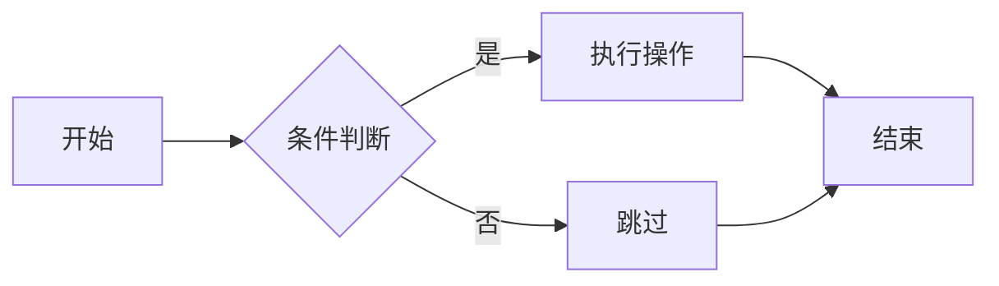
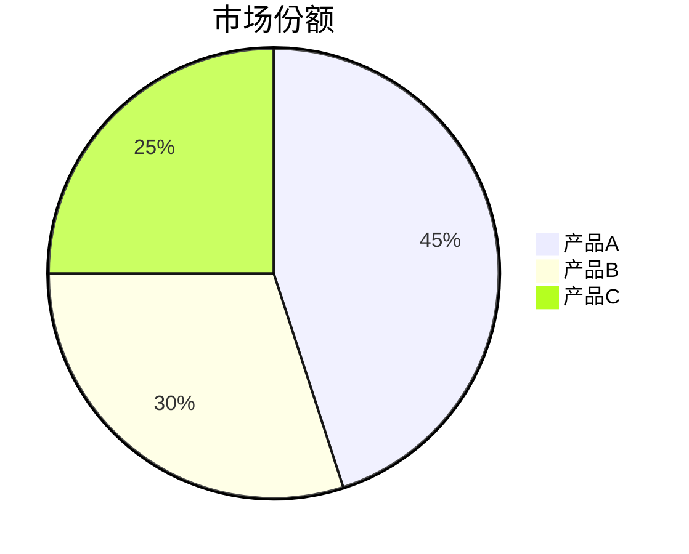

# ECharts 全面测试文档

本文档包含各种 ECharts 图表类型，用于测试渲染功能。

---

## 1. 基础柱状图

```echarts
{
  "title": {
    "text": "2024年销售数据",
    "subtext": "单位：万元"
  },
  "tooltip": {
    "trigger": "axis"
  },
  "xAxis": {
    "type": "category",
    "data": ["1月", "2月", "3月", "4月", "5月", "6月"]
  },
  "yAxis": {
    "type": "value"
  },
  "series": [{
    "name": "销售额",
    "type": "bar",
    "data": [120, 200, 150, 80, 70, 110],
    "itemStyle": {
      "color": "#5470c6"
    }
  }]
}
```

---

## 2. 多系列柱状图

```echarts
{
  "title": {
    "text": "产品对比"
  },
  "tooltip": {
    "trigger": "axis"
  },
  "legend": {
    "data": ["产品A", "产品B", "产品C"]
  },
  "xAxis": {
    "type": "category",
    "data": ["Q1", "Q2", "Q3", "Q4"]
  },
  "yAxis": {
    "type": "value"
  },
  "series": [
    {
      "name": "产品A",
      "type": "bar",
      "data": [320, 332, 301, 334]
    },
    {
      "name": "产品B",
      "type": "bar",
      "data": [220, 182, 191, 234]
    },
    {
      "name": "产品C",
      "type": "bar",
      "data": [150, 232, 201, 154]
    }
  ]
}
```

---

## 3. 基础折线图

```echarts
{
  "title": {
    "text": "网站访问量趋势"
  },
  "tooltip": {
    "trigger": "axis"
  },
  "xAxis": {
    "type": "category",
    "boundaryGap": false,
    "data": ["周一", "周二", "周三", "周四", "周五", "周六", "周日"]
  },
  "yAxis": {
    "type": "value"
  },
  "series": [{
    "name": "访问量",
    "type": "line",
    "data": [820, 932, 901, 934, 1290, 1330, 1320],
    "smooth": true,
    "areaStyle": {}
  }]
}
```

---

## 4. 多系列折线图

```echarts
{
  "title": {
    "text": "温度变化"
  },
  "tooltip": {
    "trigger": "axis"
  },
  "legend": {
    "data": ["最高温", "最低温"]
  },
  "xAxis": {
    "type": "category",
    "data": ["1月", "2月", "3月", "4月", "5月", "6月", "7月"]
  },
  "yAxis": {
    "type": "value",
    "axisLabel": {
      "formatter": "{value} °C"
    }
  },
  "series": [
    {
      "name": "最高温",
      "type": "line",
      "data": [10, 11, 13, 11, 12, 12, 9],
      "markPoint": {
        "data": [
          {"type": "max", "name": "最大值"},
          {"type": "min", "name": "最小值"}
        ]
      }
    },
    {
      "name": "最低温",
      "type": "line",
      "data": [1, -2, 2, 5, 3, 2, 0],
      "markLine": {
        "data": [{"type": "average", "name": "平均值"}]
      }
    }
  ]
}
```

---

## 5. 基础饼图

```echarts
{
  "title": {
    "text": "访问来源分布",
    "left": "center"
  },
  "tooltip": {
    "trigger": "item",
    "formatter": "{a} <br/>{b}: {c} ({d}%)"
  },
  "legend": {
    "orient": "vertical",
    "left": "left"
  },
  "series": [{
    "name": "访问来源",
    "type": "pie",
    "radius": "55%",
    "center": ["50%", "60%"],
    "data": [
      {"value": 335, "name": "直接访问"},
      {"value": 310, "name": "邮件营销"},
      {"value": 234, "name": "联盟广告"},
      {"value": 135, "name": "视频广告"},
      {"value": 1548, "name": "搜索引擎"}
    ]
  }]
}
```

---

## 6. 环形图

```echarts
{
  "title": {
    "text": "浏览器占比",
    "left": "center"
  },
  "tooltip": {
    "trigger": "item"
  },
  "legend": {
    "top": "bottom"
  },
  "series": [{
    "name": "浏览器",
    "type": "pie",
    "radius": ["40%", "70%"],
    "avoidLabelOverlap": false,
    "itemStyle": {
      "borderRadius": 10,
      "borderColor": "#fff",
      "borderWidth": 2
    },
    "label": {
      "show": false,
      "position": "center"
    },
    "emphasis": {
      "label": {
        "show": true,
        "fontSize": 20,
        "fontWeight": "bold"
      }
    },
    "labelLine": {
      "show": false
    },
    "data": [
      {"value": 1048, "name": "Chrome"},
      {"value": 735, "name": "Safari"},
      {"value": 580, "name": "Firefox"},
      {"value": 484, "name": "Edge"},
      {"value": 300, "name": "其他"}
    ]
  }]
}
```

---

## 7. 散点图

```echarts
{
  "title": {
    "text": "身高体重分布"
  },
  "xAxis": {
    "name": "身高(cm)",
    "type": "value",
    "min": 150,
    "max": 200
  },
  "yAxis": {
    "name": "体重(kg)",
    "type": "value",
    "min": 40,
    "max": 100
  },
  "tooltip": {
    "trigger": "item",
    "formatter": "身高: {c0}cm<br/>体重: {c1}kg"
  },
  "series": [{
    "name": "数据点",
    "type": "scatter",
    "symbolSize": 15,
    "data": [
      [161, 51], [167, 59], [159, 49], [157, 63], [155, 53],
      [170, 59], [159, 47], [166, 69], [176, 66], [160, 75],
      [172, 55], [170, 54], [165, 62], [173, 64], [159, 55],
      [180, 80], [175, 72], [168, 58], [182, 85], [177, 70]
    ]
  }]
}
```

---

## 8. 堆叠柱状图

```echarts
{
  "title": {
    "text": "各渠道销售额"
  },
  "tooltip": {
    "trigger": "axis",
    "axisPointer": {
      "type": "shadow"
    }
  },
  "legend": {
    "data": ["线上", "线下", "代理"]
  },
  "xAxis": {
    "type": "category",
    "data": ["北京", "上海", "广州", "深圳", "杭州"]
  },
  "yAxis": {
    "type": "value"
  },
  "series": [
    {
      "name": "线上",
      "type": "bar",
      "stack": "total",
      "data": [320, 302, 301, 334, 390]
    },
    {
      "name": "线下",
      "type": "bar",
      "stack": "total",
      "data": [120, 132, 101, 134, 90]
    },
    {
      "name": "代理",
      "type": "bar",
      "stack": "total",
      "data": [220, 182, 191, 234, 290]
    }
  ]
}
```

---

## 9. 横向柱状图

```echarts
{
  "title": {
    "text": "编程语言排行"
  },
  "tooltip": {
    "trigger": "axis",
    "axisPointer": {
      "type": "shadow"
    }
  },
  "xAxis": {
    "type": "value"
  },
  "yAxis": {
    "type": "category",
    "data": ["Python", "JavaScript", "Java", "C++", "Go", "Rust"]
  },
  "series": [{
    "name": "使用率",
    "type": "bar",
    "data": [28, 25, 18, 12, 10, 7],
    "itemStyle": {
      "color": {
        "type": "linear",
        "x": 0,
        "y": 0,
        "x2": 1,
        "y2": 0,
        "colorStops": [
          {"offset": 0, "color": "#83bff6"},
          {"offset": 1, "color": "#188df0"}
        ]
      }
    }
  }]
}
```

---

## 10. 面积图

```echarts
{
  "title": {
    "text": "用户增长趋势"
  },
  "tooltip": {
    "trigger": "axis",
    "axisPointer": {
      "type": "cross"
    }
  },
  "xAxis": {
    "type": "category",
    "boundaryGap": false,
    "data": ["2019", "2020", "2021", "2022", "2023", "2024"]
  },
  "yAxis": {
    "type": "value"
  },
  "series": [{
    "name": "用户数",
    "type": "line",
    "smooth": true,
    "lineStyle": {
      "width": 3
    },
    "areaStyle": {
      "color": {
        "type": "linear",
        "x": 0,
        "y": 0,
        "x2": 0,
        "y2": 1,
        "colorStops": [
          {"offset": 0, "color": "rgba(80, 141, 255, 0.8)"},
          {"offset": 1, "color": "rgba(80, 141, 255, 0.1)"}
        ]
      }
    },
    "data": [1200, 2800, 5600, 12000, 28000, 45000]
  }]
}
```

---

## 11. 混合图表（柱状图 + 折线图）

```echarts
{
  "title": {
    "text": "销售与利润分析"
  },
  "tooltip": {
    "trigger": "axis",
    "axisPointer": {
      "type": "cross"
    }
  },
  "legend": {
    "data": ["销售额", "利润率"]
  },
  "xAxis": {
    "type": "category",
    "data": ["1月", "2月", "3月", "4月", "5月", "6月"]
  },
  "yAxis": [
    {
      "type": "value",
      "name": "销售额",
      "axisLabel": {
        "formatter": "{value} 万"
      }
    },
    {
      "type": "value",
      "name": "利润率",
      "axisLabel": {
        "formatter": "{value} %"
      }
    }
  ],
  "series": [
    {
      "name": "销售额",
      "type": "bar",
      "data": [200, 180, 220, 250, 280, 300]
    },
    {
      "name": "利润率",
      "type": "line",
      "yAxisIndex": 1,
      "data": [15, 12, 18, 22, 25, 28]
    }
  ]
}
```

---

## 12. 仪表盘

```echarts
{
  "tooltip": {
    "formatter": "{a} <br/>{b} : {c}%"
  },
  "series": [{
    "name": "业务指标",
    "type": "gauge",
    "detail": {
      "formatter": "{value}%"
    },
    "data": [{
      "value": 72,
      "name": "完成率"
    }],
    "axisLine": {
      "lineStyle": {
        "width": 15,
        "color": [
          [0.3, "#fd666d"],
          [0.7, "#37a2da"],
          [1, "#67e0e3"]
        ]
      }
    }
  }]
}
```

---

## 13. 雷达图

```echarts
{
  "title": {
    "text": "技能评估"
  },
  "tooltip": {},
  "radar": {
    "indicator": [
      {"name": "编程能力", "max": 100},
      {"name": "沟通能力", "max": 100},
      {"name": "团队协作", "max": 100},
      {"name": "学习能力", "max": 100},
      {"name": "解决问题", "max": 100},
      {"name": "创新思维", "max": 100}
    ]
  },
  "series": [{
    "name": "候选人对比",
    "type": "radar",
    "data": [
      {
        "value": [85, 70, 80, 90, 85, 75],
        "name": "候选人A",
        "areaStyle": {"color": "rgba(255, 0, 0, 0.3)"}
      },
      {
        "value": [75, 90, 85, 70, 80, 90],
        "name": "候选人B",
        "areaStyle": {"color": "rgba(0, 0, 255, 0.3)"}
      }
    ]
  }]
}
```

---

## 14. 漏斗图

```echarts
{
  "title": {
    "text": "转化漏斗"
  },
  "tooltip": {
    "trigger": "item",
    "formatter": "{a} <br/>{b} : {c}%"
  },
  "series": [{
    "name": "转化率",
    "type": "funnel",
    "left": "10%",
    "width": "80%",
    "label": {
      "formatter": "{b}: {c}%"
    },
    "data": [
      {"value": 100, "name": "访问"},
      {"value": 80, "name": "咨询"},
      {"value": 60, "name": "意向"},
      {"value": 40, "name": "下单"},
      {"value": 20, "name": "成交"}
    ]
  }]
}
```

---

## 15. 带数据缩放的图表

```echarts
{
  "title": {
    "text": "大数据量展示"
  },
  "tooltip": {
    "trigger": "axis"
  },
  "dataZoom": [
    {
      "type": "slider",
      "start": 0,
      "end": 50
    },
    {
      "type": "inside",
      "start": 0,
      "end": 50
    }
  ],
  "xAxis": {
    "type": "category",
    "data": ["1日", "2日", "3日", "4日", "5日", "6日", "7日", "8日", "9日", "10日", "11日", "12日", "13日", "14日", "15日", "16日", "17日", "18日", "19日", "20日", "21日", "22日", "23日", "24日", "25日", "26日", "27日", "28日", "29日", "30日"]
  },
  "yAxis": {
    "type": "value"
  },
  "series": [{
    "name": "数据",
    "type": "line",
    "data": [150, 230, 224, 218, 135, 147, 260, 200, 180, 220, 250, 280, 300, 270, 240, 210, 190, 220, 250, 280, 310, 290, 260, 230, 200, 180, 210, 240, 270, 300]
  }]
}
```

---

## 错误测试

### 无效 JSON

```echarts
{
  "title": "这是无效的 JSON，缺少引号
}
```

### 空配置

```echarts
{}
```

---

## 与 Mermaid 对比

### Mermaid 流程图



### Mermaid 饼图



---

## 总结

本文档测试了以下 ECharts 图表类型：

1. ✅ 基础柱状图
2. ✅ 多系列柱状图
3. ✅ 基础折线图
4. ✅ 多系列折线图
5. ✅ 基础饼图
6. ✅ 环形图
7. ✅ 散点图
8. ✅ 堆叠柱状图
9. ✅ 横向柱状图
10. ✅ 面积图
11. ✅ 混合图表
12. ✅ 仪表盘
13. ✅ 雷达图
14. ✅ 漏斗图
15. ✅ 带数据缩放的图表
