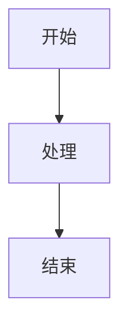

# Excalidraw 渲染测试

本文档集中覆盖 Excalidraw 渲染器的正常路径、架构图样式、复杂布局、边界条件和错误降级。
用例参考了 Excalidraw 官方 JSON 结构、Excalidraw Architect MCP 的图拓扑建议、mermaid-to-excalidraw 的转换覆盖，以及本项目已有 Mermaid / Graphviz / DrawIO fixture 的组织方式。

## 1. 基础代码块

```excalidraw
{
  "type": "excalidraw",
  "version": 2,
  "source": "md-viewer-excalidraw-fixture",
  "elements": [
    {
      "id": "code-card",
      "type": "rectangle",
      "x": 0,
      "y": 0,
      "width": 420,
      "height": 160,
      "angle": 0,
      "strokeColor": "#1e1e1e",
      "backgroundColor": "#e8f4ff",
      "fillStyle": "solid",
      "strokeWidth": 2,
      "strokeStyle": "solid",
      "roughness": 1,
      "opacity": 100,
      "groupIds": [],
      "frameId": null,
      "roundness": {
        "type": 3
      },
      "seed": 2079,
      "version": 1,
      "versionNonce": 2079,
      "isDeleted": false,
      "boundElements": null,
      "updated": 1,
      "link": null,
      "locked": false
    },
    {
      "id": "code-title",
      "type": "text",
      "x": 86,
      "y": 38,
      "width": 248,
      "height": 45,
      "angle": 0,
      "strokeColor": "#1e1e1e",
      "backgroundColor": "transparent",
      "fillStyle": "solid",
      "strokeWidth": 1,
      "strokeStyle": "solid",
      "roughness": 1,
      "opacity": 100,
      "groupIds": [],
      "frameId": null,
      "roundness": null,
      "seed": 2080,
      "version": 1,
      "versionNonce": 2080,
      "isDeleted": false,
      "boundElements": null,
      "updated": 1,
      "link": null,
      "locked": false,
      "fontSize": 36,
      "fontFamily": 5,
      "text": "代码块渲染",
      "originalText": "代码块渲染",
      "textAlign": "center",
      "verticalAlign": "middle",
      "containerId": null,
      "lineHeight": 1.25,
      "autoResize": true
    },
    {
      "id": "code-note",
      "type": "text",
      "x": 103,
      "y": 100,
      "width": 214,
      "height": 25,
      "angle": 0,
      "strokeColor": "#4b5563",
      "backgroundColor": "transparent",
      "fillStyle": "solid",
      "strokeWidth": 1,
      "strokeStyle": "solid",
      "roughness": 1,
      "opacity": 100,
      "groupIds": [],
      "frameId": null,
      "roundness": null,
      "seed": 2081,
      "version": 1,
      "versionNonce": 2081,
      "isDeleted": false,
      "boundElements": null,
      "updated": 1,
      "link": null,
      "locked": false,
      "fontSize": 20,
      "fontFamily": 5,
      "text": "Markdown fenced block",
      "originalText": "Markdown fenced block",
      "textAlign": "center",
      "verticalAlign": "middle",
      "containerId": null,
      "lineHeight": 1.25,
      "autoResize": true
    }
  ],
  "appState": {
    "viewBackgroundColor": "#ffffff"
  },
  "files": {}
}
```

## 2. 基础文件引用


## 3. 带查询参数的文件引用


## 4. 内嵌图片资源


## 5. 缺失图片资源警告


## 6. 空画布警告


## 7. MCP 风格：网关扇出


## 8. MCP 风格：电商平台架构


## 9. 支付决策流程


## 10. 数据管道


## 11. 分层架构


## 12. Hub 扇出


## 13. 断开子图


## 14. 状态机


## 15. 决策树


## 16. 形状库


## 17. 样式库


## 18. Unicode 与长文本


## 19. 负坐标


## 20. 旋转元素


## 21. 删除元素


## 22. 较大但均衡的架构图


## 23. 深色背景


## 24. 兼容模式警告


## 25. 绑定文本容器


## 26. 箭头绑定


## 27. Frame 元素


## 28. 自由绘制线条


## 29. 多段箭头


## 30. 箭头头部集合


## 31. Mermaid flowchart 形状


## 32. Sequence 生命线


## 33. Class Diagram


## 34. ER Diagram


## 35. 复合状态图


## 36. Subgraph 集群


## 37. 泳道流程


## 38. 时间线


## 39. 网络拓扑


## 40. 思维导图


## 41. 看板布局


## 42. 数据库复制


## 43. 事件溯源


## 44. 密集注释


## 45. 小元素网格


## 46. 纵向长流程


## 47. 横向宽画布


## 48. 分组元素


## 49. PlantUML 迁移：高级序列图


## 50. PlantUML 迁移：渲染器类图


## 51. PlantUML 迁移：用例图


## 52. PlantUML 迁移：组件图


## 53. PlantUML 迁移：对象图


## 54. PlantUML 迁移：部署图


## 55. PlantUML 迁移：Timing Diagram


## 56. PlantUML 迁移：甘特图


## 57. PlantUML 迁移：WBS


## 58. PlantUML 迁移：JSON/YAML 数据


## 59. PlantUML 迁移：Salt 线框


## 60. PlantUML 迁移：Creole 富文本


## 61. PlantUML 迁移：链接类图


## 62. PlantUML 迁移：Stereotypes


## 63. PlantUML 迁移：颜色分层图


## 64. PlantUML 迁移：复杂导出序列


## 65. 错误文件：JSON 格式错误


## 66. 错误文件：缺少 elements


## 67. 错误文件：根节点是数组


## 68. 错误文件：元素数量超限


## 69. 错误文件：文件不存在


## 70. 与 Mermaid 对比


