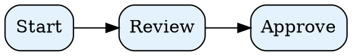
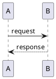

# Export Alias Renderers



```dio
<mxfile host="app.diagrams.net">
  <diagram id="alias-drawio" name="Page-1">
    <mxGraphModel dx="1200" dy="800" grid="1" gridSize="10">
      <root>
        <mxCell id="0" />
        <mxCell id="1" parent="0" />
        <mxCell id="2" value="Alias DrawIO" style="rounded=1;whiteSpace=wrap;html=1;fillColor=#dae8fc;strokeColor=#6c8ebf;" vertex="1" parent="1">
          <mxGeometry x="40" y="40" width="160" height="60" as="geometry" />
        </mxCell>
      </root>
    </mxGraphModel>
  </diagram>
</mxfile>
```



```c4
@startuml
Person(user, "User")
System(app, "MD Viewer")
Rel(user, app, "uses")
@enduml
```

```nomnoml
[User]->[Service]->[DB]
```
