# Graphviz DOT 图测试

## 1. 简单有向图

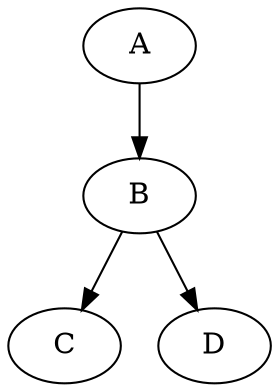

## 2. MD Viewer 渲染管线

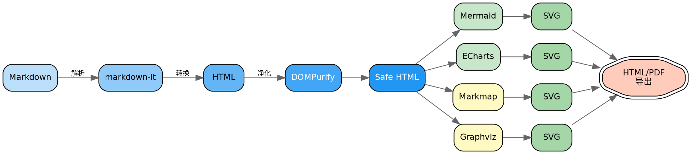

## 3. 无向图（neato 布局）

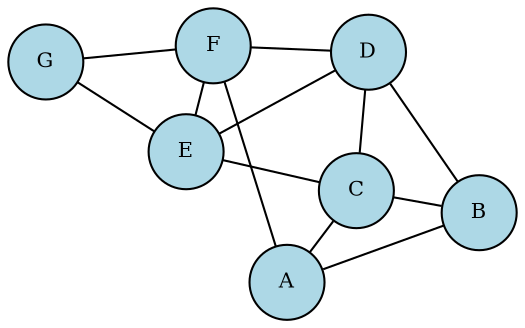

## 4. 有限状态机（graphviz 语言标识）

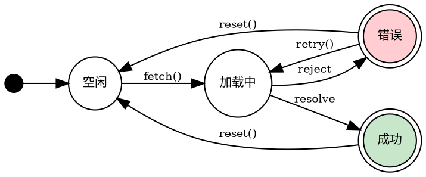

## 5. 类继承关系（UML 风格）

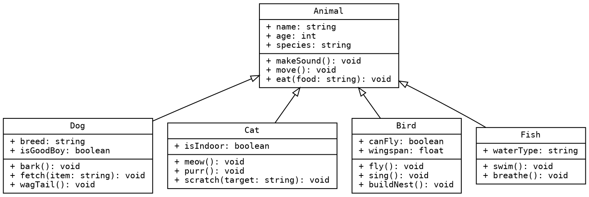

## 6. 子图（集群架构）

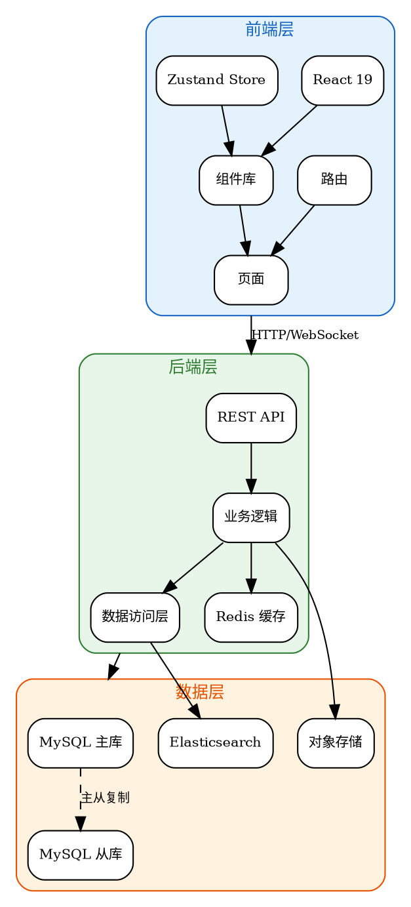

## 7. 复杂审批流程

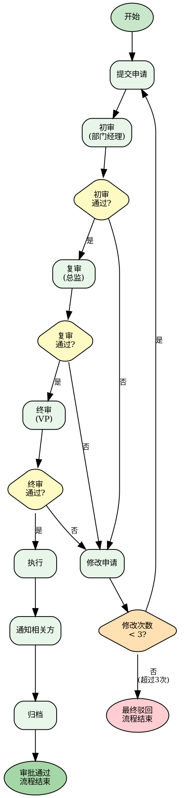

## 8. 网络拓扑图

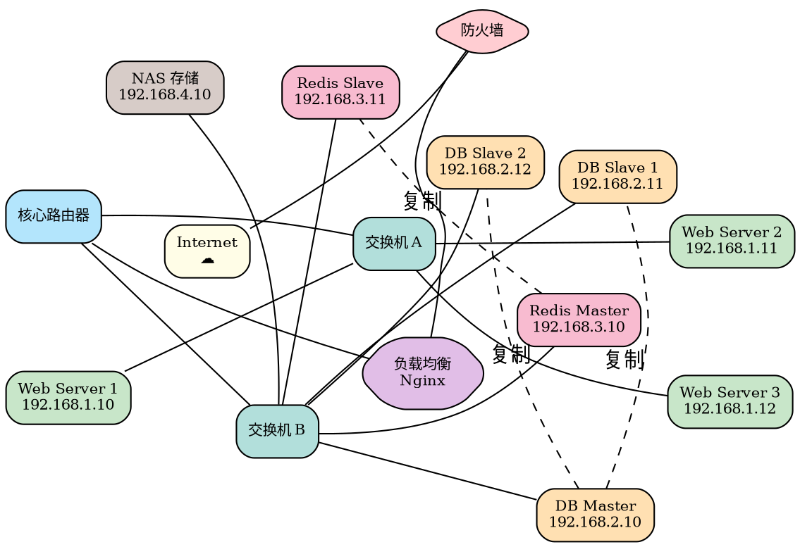

## 9. strict 关键字（去重边）

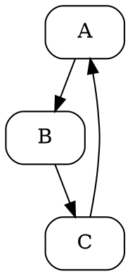

## 10. 最小图

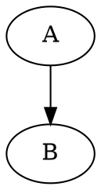

## 11. 数据库 ER 图

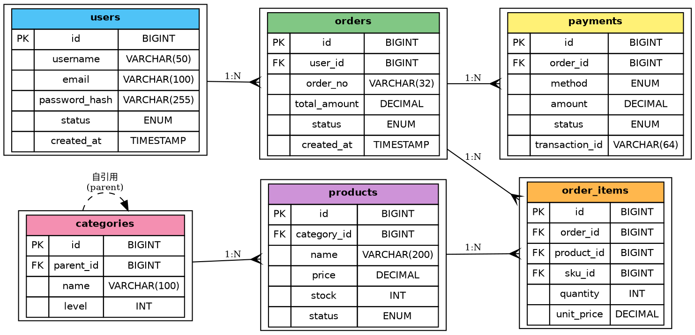

## 12. 编译器流水线

```graphviz
digraph Compiler {
    rankdir=LR
    node [fontsize=10]
    edge [fontsize=8]

    src [label="源代码\n(.ts/.js)", shape=note, style=filled, fillcolor="#E3F2FD"]
    lexer [label="词法分析器\nLexer", shape=box, style="rounded,filled", fillcolor="#BBDEFB"]
    tokens [label="Token 流", shape=ellipse, style=filled, fillcolor="#E8EAF6"]
    parser [label="语法分析器\nParser", shape=box, style="rounded,filled", fillcolor="#90CAF9"]
    ast [label="AST\n抽象语法树", shape=ellipse, style=filled, fillcolor="#E8EAF6"]
    semantic [label="语义分析器\nType Checker", shape=box, style="rounded,filled", fillcolor="#64B5F6"]
    annotated [label="带类型 AST", shape=ellipse, style=filled, fillcolor="#E8EAF6"]
    irgen [label="IR 生成器", shape=box, style="rounded,filled", fillcolor="#42A5F5", fontcolor=white]
    ir [label="中间表示\nIR", shape=ellipse, style=filled, fillcolor="#E8EAF6"]
    optimizer [label="优化器\nOptimizer", shape=box, style="rounded,filled", fillcolor="#1E88E5", fontcolor=white]
    optir [label="优化后 IR", shape=ellipse, style=filled, fillcolor="#E8EAF6"]
    codegen [label="代码生成器\nCode Generator", shape=box, style="rounded,filled", fillcolor="#1565C0", fontcolor=white]
    output [label="目标代码\n(.js/.wasm)", shape=note, style=filled, fillcolor="#C8E6C9"]

    src -> lexer [label="字符流"]
    lexer -> tokens [label="扫描"]
    tokens -> parser [label="消费"]
    parser -> ast [label="构建"]
    ast -> semantic [label="遍历"]
    semantic -> annotated [label="标注"]
    annotated -> irgen [label="转换"]
    irgen -> ir [label="生成"]
    ir -> optimizer [label="分析"]
    optimizer -> optir [label="变换"]
    optir -> codegen [label="映射"]
    codegen -> output [label="输出"]

    // 错误反馈
    lexer -> errors [style=dashed, color=red, label="词法错误"]
    parser -> errors [style=dashed, color=red, label="语法错误"]
    semantic -> errors [style=dashed, color=red, label="类型错误"]
    errors [label="错误报告", shape=octagon, style=filled, fillcolor="#FFCDD2"]
}
```

## 13. Kubernetes 集群架构

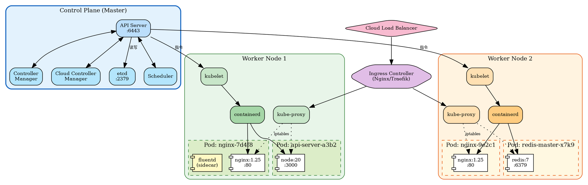

## 14. Git 分支模型

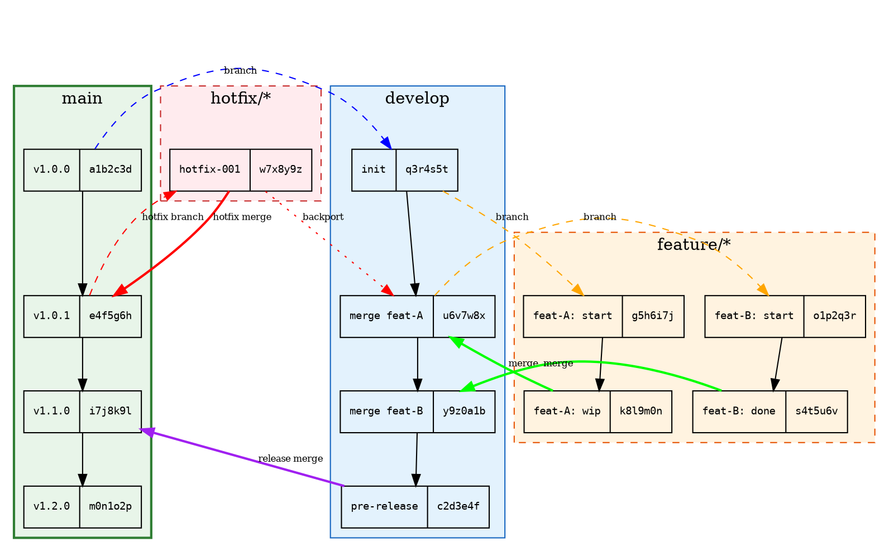

## 15. 微服务架构

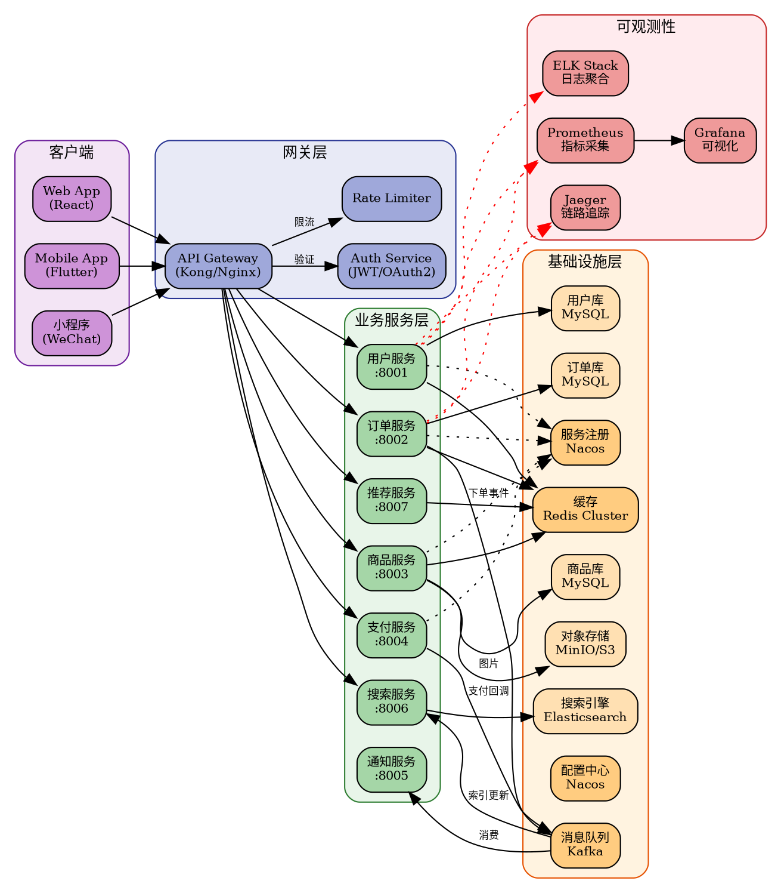

## 16. TCP 状态机

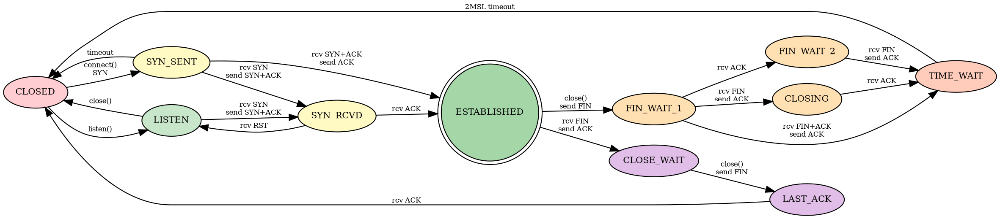

## 17. HTML-like 标签（复杂表格节点）

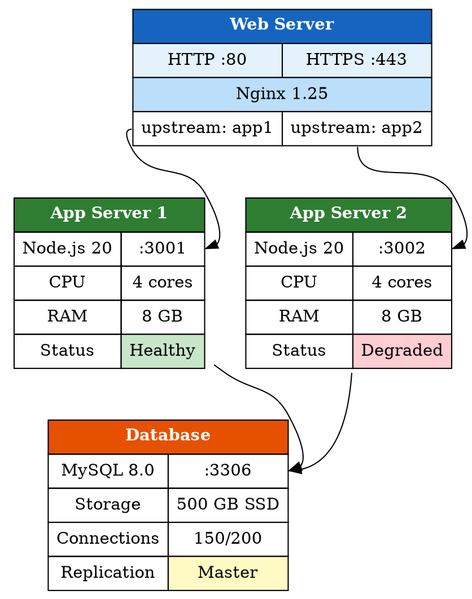

## 18. 多种节点形状展示

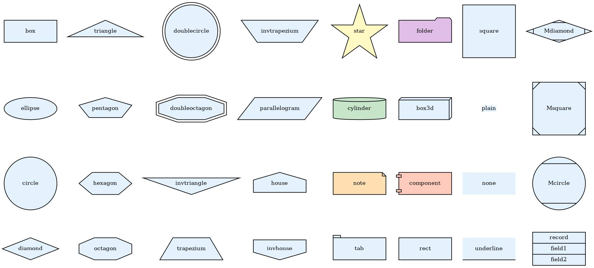

## 19. 颜色和边样式展示

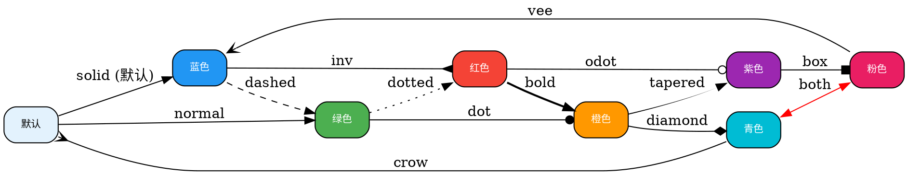

## 20. 大型依赖图（npm 包依赖树）

```dot
digraph Dependencies {
    rankdir=TB
    node [shape=box, style="rounded,filled", fontsize=8, fillcolor="#E3F2FD"]
    edge [fontsize=7, color="#999"]

    // 根项目
    root [label="md-viewer\nv1.5.4", fillcolor="#1565C0", fontcolor=white, fontsize=10]

    // 核心依赖
    react [label="react\n19.2.3", fillcolor="#61DAFB"]
    react_dom [label="react-dom\n19.2.3", fillcolor="#61DAFB"]
    electron [label="electron\n39.2.7", fillcolor="#47848F", fontcolor=white]
    typescript [label="typescript\n5.9.3", fillcolor="#3178C6", fontcolor=white]
    vite [label="vite\n7.3.0", fillcolor="#646CFF", fontcolor=white]

    // Markdown 相关
    markdown_it [label="markdown-it\n14.1.0", fillcolor="#C8E6C9"]
    dompurify [label="dompurify\n3.3.1", fillcolor="#C8E6C9"]
    prismjs [label="prismjs\n1.30.0", fillcolor="#C8E6C9"]
    katex [label="katex\n0.16.27", fillcolor="#C8E6C9"]

    // 图表渲染
    mermaid [label="mermaid\n11.12.2", fillcolor="#FFE0B2"]
    echarts [label="echarts\n6.0.0", fillcolor="#FFE0B2"]
    antv [label="@antv/infographic\n0.2.13", fillcolor="#FFE0B2"]
    markmap_lib [label="markmap-lib\n(new)", fillcolor="#FFF9C4"]
    markmap_view [label="markmap-view\n(new)", fillcolor="#FFF9C4"]
    graphviz_wasm [label="@hpcc-js/\nwasm-graphviz\n(new)", fillcolor="#FFF9C4"]

    // 状态管理
    zustand [label="zustand\n5.0.9", fillcolor="#E1BEE7"]

    // 工具库
    chokidar [label="chokidar\n5.0.0", fillcolor="#F5F5F5"]
    fuse [label="fuse.js\n7.1.0", fillcolor="#F5F5F5"]
    markjs [label="mark.js\n8.11.1", fillcolor="#F5F5F5"]
    zod [label="zod\n4.3.5", fillcolor="#F5F5F5"]

    // 测试
    vitest [label="vitest\n4.0.16", fillcolor="#FFCDD2"]
    playwright [label="playwright\n1.57.0", fillcolor="#FFCDD2"]
    testing_lib [label="@testing-library\n/react 16.3.1", fillcolor="#FFCDD2"]

    // mermaid 子依赖
    d3 [label="d3\n7.x", fillcolor="#F5F5F5"]
    dagre [label="dagre-d3\n0.6.x", fillcolor="#F5F5F5"]
    dompurify2 [label="dompurify\n(内置)", fillcolor="#F5F5F5"]

    // markmap 子依赖
    d3_markmap [label="d3 (子集)", fillcolor="#F5F5F5"]

    // 连接
    root -> react
    root -> react_dom
    root -> electron
    root -> typescript
    root -> vite
    root -> markdown_it
    root -> dompurify
    root -> prismjs
    root -> katex
    root -> mermaid
    root -> echarts
    root -> antv
    root -> markmap_lib
    root -> markmap_view
    root -> graphviz_wasm
    root -> zustand
    root -> chokidar
    root -> fuse
    root -> markjs
    root -> zod
    root -> vitest
    root -> playwright
    root -> testing_lib

    react_dom -> react [label="peer"]
    mermaid -> d3
    mermaid -> dagre
    mermaid -> dompurify2
    markmap_lib -> d3_markmap
    markmap_view -> d3_markmap
    testing_lib -> react [label="peer"]
}
```

## 21. 中文内容和特殊字符

```dot
digraph Chinese {
    rankdir=TB
    node [shape=box, style="rounded,filled", fontsize=11, fillcolor="#E3F2FD"]
    edge [fontsize=9]

    root [label="中文测试 🇨🇳", fillcolor="#F44336", fontcolor=white]

    // 标点符号
    punct [label="标点符号\n逗号，句号。\n问号？感叹号！\n引号"双引号"\n括号（圆括号）\n破折号——\n省略号……"]

    // Emoji
    emoji [label="Emoji 表情\n🎉🚀⚡🔥\n✅❌⚠️💡\n🎯🏆📊🗺️"]

    // 数学符号
    math [label="数学符号\nα β γ δ ε\n∑ ∏ ∫ ∂\n≈ ≠ ≤ ≥\n∞ √ π"]

    // 多语言
    lang [label="多语言\nEnglish 英文\n日本語 にほんご\n한국어 韩语\nDeutsch 德语\nFrançais 法语"]

    // 长中文
    long_text [label="这是一段很长很长很长很长很长\n很长很长很长很长很长很长很长\n的中文文本用来测试换行效果"]

    root -> punct
    root -> emoji
    root -> math
    root -> lang
    root -> long_text

    punct -> p1 [label="测试：冒号"]
    punct -> p2 [label="测试、顿号"]
    p1 [label="子节点 A\n（带括号）"]
    p2 [label="子节点 B\n【带方括号】"]
}
```

## 22. 与普通 Markdown 内容混排

这是一段普通的 Markdown 文本。下面是第一个 Graphviz 图：

```dot
digraph First {
    rankdir=LR
    A [label="第一个图", shape=box, style="rounded,filled", fillcolor="#C8E6C9"]
    B [label="混排测试", shape=box, style="rounded,filled", fillcolor="#BBDEFB"]
    A -> B [label="上面有文字"]
}
```

这是两个图之间的文字。下面是一个 **JavaScript 代码块**，不应该被 Graphviz 渲染：

```javascript
const graph = {
  nodes: ['A', 'B', 'C'],
  edges: [
    { from: 'A', to: 'B', label: 'connects' },
    { from: 'B', to: 'C', label: 'links' }
  ]
}
console.log('digraph G { A -> B }') // 这不是 DOT 代码
```

再来一个 Graphviz 图，使用 `graphviz` 语言标识：

```graphviz
digraph Second {
    rankdir=LR
    C [label="第二个图", shape=box, style="rounded,filled", fillcolor="#FFE0B2"]
    D [label="验证共存", shape=box, style="rounded,filled", fillcolor="#E1BEE7"]
    C -> D [label="下面也有文字"]
}
```

这是最后一段文字。两个 Graphviz 图应该都能正常渲染，JS 代码块保持原样。

## 23. 设计模式关系图

```dot
digraph DesignPatterns {
    rankdir=TB
    node [shape=box, style="rounded,filled", fontsize=9]
    edge [fontsize=8]

    // 创建型
    subgraph cluster_creational {
        label="创建型模式"
        style="filled,rounded"
        fillcolor="#E8F5E9"
        color="#2E7D32"
        singleton [label="单例模式\nSingleton", fillcolor="#C8E6C9"]
        factory [label="工厂方法\nFactory Method", fillcolor="#C8E6C9"]
        abstract_factory [label="抽象工厂\nAbstract Factory", fillcolor="#C8E6C9"]
        builder [label="建造者\nBuilder", fillcolor="#C8E6C9"]
        prototype [label="原型\nPrototype", fillcolor="#C8E6C9"]
    }

    // 结构型
    subgraph cluster_structural {
        label="结构型模式"
        style="filled,rounded"
        fillcolor="#E3F2FD"
        color="#1565C0"
        adapter [label="适配器\nAdapter", fillcolor="#BBDEFB"]
        bridge [label="桥接\nBridge", fillcolor="#BBDEFB"]
        composite [label="组合\nComposite", fillcolor="#BBDEFB"]
        decorator [label="装饰器\nDecorator", fillcolor="#BBDEFB"]
        facade [label="外观\nFacade", fillcolor="#BBDEFB"]
        flyweight [label="享元\nFlyweight", fillcolor="#BBDEFB"]
        proxy [label="代理\nProxy", fillcolor="#BBDEFB"]
    }

    // 行为型
    subgraph cluster_behavioral {
        label="行为型模式"
        style="filled,rounded"
        fillcolor="#FFF3E0"
        color="#E65100"
        observer [label="观察者\nObserver", fillcolor="#FFE0B2"]
        strategy [label="策略\nStrategy", fillcolor="#FFE0B2"]
        command [label="命令\nCommand", fillcolor="#FFE0B2"]
        state [label="状态\nState", fillcolor="#FFE0B2"]
        template [label="模板方法\nTemplate Method", fillcolor="#FFE0B2"]
        iterator [label="迭代器\nIterator", fillcolor="#FFE0B2"]
        mediator [label="中介者\nMediator", fillcolor="#FFE0B2"]
        chain [label="责任链\nChain of Resp.", fillcolor="#FFE0B2"]
        visitor [label="访问者\nVisitor", fillcolor="#FFE0B2"]
        memento [label="备忘录\nMemento", fillcolor="#FFE0B2"]
        interpreter [label="解释器\nInterpreter", fillcolor="#FFE0B2"]
    }

    // 常见组合关系
    factory -> abstract_factory [label="演进", style=dashed]
    abstract_factory -> singleton [label="常结合"]
    builder -> composite [label="构建", style=dashed]
    adapter -> facade [label="类似"]
    decorator -> proxy [label="类似"]
    observer -> mediator [label="常结合"]
    strategy -> state [label="类似"]
    command -> memento [label="常结合"]
    iterator -> composite [label="遍历"]
    template -> strategy [label="对比"]
    chain -> command [label="常结合"]
}
```

## 24. 错误语法测试

以下是无效的 DOT 语法，应该显示错误提示：

```dot
这不是有效的 DOT 语法
应该显示错误而不是崩溃
```

## 25. 普通代码块（不应被渲染）

以下是普通代码块，不应被 Graphviz 渲染：

```javascript
// 这是 JavaScript 代码，不是 DOT
const graphConfig = {
  type: 'digraph',
  nodes: ['A', 'B', 'C'],
  edges: [
    { from: 'A', to: 'B' },
    { from: 'B', to: 'C' }
  ]
}

function renderGraph(config) {
  const dot = `digraph G { ${config.edges.map(e => `${e.from} -> ${e.to}`).join('; ')} }`
  return dot
}
```

```python
# 这是 Python 代码，也不是 DOT
import graphviz

dot = graphviz.Digraph(comment='Test')
dot.node('A', 'Node A')
dot.node('B', 'Node B')
dot.edge('A', 'B')
dot.render('output', format='svg')
```

## 26. 所有布局引擎测试

### dot 布局（默认，层次化）

```dot
digraph DotLayout {
    layout=dot
    label="layout=dot (默认层次化)"
    labelloc=t
    node [shape=box, style="rounded,filled", fillcolor="#E3F2FD", fontsize=9]
    A -> B -> C -> D -> E
    A -> C
    B -> D
    C -> E
    F -> B
    F -> D
}
```

### neato 布局（弹簧模型）

```dot
graph NeatoLayout {
    layout=neato
    label="layout=neato (弹簧模型)"
    labelloc=t
    node [shape=circle, style=filled, fillcolor="#C8E6C9", fontsize=9]
    A -- B -- C -- D -- E -- A
    A -- C
    B -- D
    C -- E
    B -- E
}
```

### fdp 布局（力导向）

```dot
graph FdpLayout {
    layout=fdp
    label="layout=fdp (力导向)"
    labelloc=t
    node [shape=circle, style=filled, fillcolor="#FFE0B2", fontsize=9]
    edge [len=1.2]
    center -- a1
    center -- a2
    center -- a3
    center -- a4
    center -- a5
    a1 -- b1
    a1 -- b2
    a2 -- b3
    a2 -- b4
    a3 -- b5
    a3 -- b6
    a4 -- b7
    a5 -- b8
    a5 -- b9
}
```

### sfdp 布局（大规模力导向）

```dot
graph SfdpLayout {
    layout=sfdp
    label="layout=sfdp (大规模力导向)"
    labelloc=t
    overlap=prism
    node [shape=point, width=0.15]
    n1 -- n2 -- n3 -- n4 -- n5
    n2 -- n6 -- n7 -- n8
    n3 -- n9 -- n10
    n4 -- n11 -- n12 -- n13
    n5 -- n14
    n6 -- n15 -- n16
    n7 -- n17 -- n18 -- n19
    n8 -- n20
    n9 -- n21 -- n22
    n10 -- n23 -- n24 -- n25
    n1 -- n15
    n5 -- n20
    n13 -- n25
}
```

### circo 布局（环形）

```dot
digraph CircoLayout {
    layout=circo
    label="layout=circo (环形)"
    labelloc=t
    node [shape=box, style="rounded,filled", fillcolor="#E1BEE7", fontsize=9]
    A -> B -> C -> D -> E -> F -> G -> H -> A
    A -> D
    B -> F
    C -> G
}
```

### twopi 布局（径向）

```dot
graph TwopiLayout {
    layout=twopi
    label="layout=twopi (径向)"
    labelloc=t
    root=center
    node [shape=circle, style=filled, fontsize=8]
    center [fillcolor="#F44336", fontcolor=white, fontsize=10]
    l1a [fillcolor="#FF9800"]
    l1b [fillcolor="#FF9800"]
    l1c [fillcolor="#FF9800"]
    l1d [fillcolor="#FF9800"]
    l2a [fillcolor="#FFC107"]
    l2b [fillcolor="#FFC107"]
    l2c [fillcolor="#FFC107"]
    l2d [fillcolor="#FFC107"]
    l2e [fillcolor="#FFC107"]
    l2f [fillcolor="#FFC107"]
    l2g [fillcolor="#FFC107"]
    l2h [fillcolor="#FFC107"]
    l3a [fillcolor="#CDDC39"]
    l3b [fillcolor="#CDDC39"]
    l3c [fillcolor="#CDDC39"]
    l3d [fillcolor="#CDDC39"]

    center -- l1a
    center -- l1b
    center -- l1c
    center -- l1d
    l1a -- l2a
    l1a -- l2b
    l1b -- l2c
    l1b -- l2d
    l1c -- l2e
    l1c -- l2f
    l1d -- l2g
    l1d -- l2h
    l2a -- l3a
    l2c -- l3b
    l2e -- l3c
    l2g -- l3d
}
```

### osage 布局（树图/打包）

```dot
digraph OsageLayout {
    layout=osage
    label="layout=osage (打包)"
    labelloc=t
    node [shape=box, style="filled,rounded", fontsize=9]

    subgraph cluster_a {
        label="Group A"
        fillcolor="#E3F2FD"
        style=filled
        a1 [fillcolor="#BBDEFB"]
        a2 [fillcolor="#BBDEFB"]
        a3 [fillcolor="#BBDEFB"]
    }
    subgraph cluster_b {
        label="Group B"
        fillcolor="#E8F5E9"
        style=filled
        b1 [fillcolor="#C8E6C9"]
        b2 [fillcolor="#C8E6C9"]
    }
    subgraph cluster_c {
        label="Group C"
        fillcolor="#FFF3E0"
        style=filled
        c1 [fillcolor="#FFE0B2"]
        c2 [fillcolor="#FFE0B2"]
        c3 [fillcolor="#FFE0B2"]
        c4 [fillcolor="#FFE0B2"]
    }
}
```

## 27. 边的高级特性

```dot
digraph EdgeFeatures {
    rankdir=LR
    node [shape=circle, style=filled, fillcolor="#E3F2FD", width=0.5, fontsize=9]

    // 多重边标签
    A -> B [label="label 1\nsecond line", fontsize=8]

    // 头尾标签
    C -> D [headlabel="head", taillabel="tail", labeldistance=2.5, fontsize=8]

    // 约束边
    E -> F [constraint=false, style=dashed, color=red, label="no constraint"]
    E -> G [label="normal"]

    // 权重
    H -> I [weight=10, label="weight=10", penwidth=3]
    H -> J [weight=1, label="weight=1", penwidth=1]

    // 颜色列表（多色边）
    K -> L [color="red:blue", penwidth=3]

    // 端口连接
    M [shape=record, label="<p1>port1|<p2>port2|<p3>port3"]
    N [shape=record, label="<q1>port1|<q2>port2"]
    M:p1 -> N:q1
    M:p2 -> N:q2
    M:p3 -> N:q1

    // 自环
    O -> O [label="self loop"]

    // 反向边
    P -> Q [dir=back, label="dir=back"]

    // 无箭头
    R -> S [arrowhead=none, arrowtail=none, label="no arrows"]
}
```

## 28. rank 控制和对齐

```dot
digraph RankControl {
    rankdir=TB
    node [shape=box, style="rounded,filled", fontsize=9, fillcolor="#E3F2FD"]

    // 强制同一层级
    { rank=same; B; C; D }
    { rank=same; E; F }
    { rank=min; A }
    { rank=max; G }

    A [label="Start\n(rank=min)", fillcolor="#C8E6C9"]
    B [label="Step B"]
    C [label="Step C"]
    D [label="Step D"]
    E [label="Step E"]
    F [label="Step F"]
    G [label="End\n(rank=max)", fillcolor="#FFCDD2"]

    A -> B
    A -> C
    A -> D
    B -> E
    C -> E
    C -> F
    D -> F
    E -> G
    F -> G
}
```

## 29. 图属性全面测试

```dot
digraph GraphAttrs {
    // 图级属性
    label="图属性全面测试\nGraph Attributes Test"
    labelloc=t
    labeljust=c
    fontname="Helvetica"
    fontsize=14
    fontcolor="#1565C0"
    bgcolor="#FAFAFA"
    pad=0.5
    nodesep=0.8
    ranksep=1.0
    splines=ortho
    concentrate=true

    // 默认节点属性
    node [
        shape=box
        style="rounded,filled"
        fillcolor="#E3F2FD"
        fontname="Helvetica"
        fontsize=10
        margin="0.2,0.1"
        penwidth=1.5
    ]

    // 默认边属性
    edge [
        fontname="Helvetica"
        fontsize=8
        color="#666666"
        penwidth=1.2
    ]

    A [label="splines=ortho\n正交连线"]
    B [label="concentrate=true\n合并边"]
    C [label="nodesep=0.8"]
    D [label="ranksep=1.0"]
    E [label="pad=0.5"]

    A -> C
    A -> D
    B -> C
    B -> D
    C -> E
    D -> E
}
```

## 30. 超大节点数量（压力测试）

```dot
digraph StressTest {
    rankdir=LR
    node [shape=point, width=0.1]
    edge [arrowsize=0.5]

    // 50 个节点的链
    n0->n1->n2->n3->n4->n5->n6->n7->n8->n9
    n10->n11->n12->n13->n14->n15->n16->n17->n18->n19
    n20->n21->n22->n23->n24->n25->n26->n27->n28->n29
    n30->n31->n32->n33->n34->n35->n36->n37->n38->n39
    n40->n41->n42->n43->n44->n45->n46->n47->n48->n49

    // 跨链连接
    n0->n10->n20->n30->n40
    n9->n19->n29->n39->n49
    n5->n15->n25->n35->n45
    n3->n23->n43
    n7->n27->n47
    n1->n31
    n11->n41
    n2->n22->n42
    n8->n28->n48
    n4->n14->n24->n34->n44
    n6->n16->n26->n36->n46
}
```

## 31. 空图（边界测试）

```dot
digraph Empty {
}
```

## 32. 只有节点没有边

```dot
digraph NodesOnly {
    rankdir=LR
    node [shape=box, style="rounded,filled", fontsize=10]
    A [label="孤立节点 A", fillcolor="#FFCDD2"]
    B [label="孤立节点 B", fillcolor="#C8E6C9"]
    C [label="孤立节点 C", fillcolor="#BBDEFB"]
    D [label="孤立节点 D", fillcolor="#FFE0B2"]
    E [label="孤立节点 E", fillcolor="#E1BEE7"]
}
```

## 33. 只有一个节点

```dot
digraph SingleNode {
    A [label="唯一节点", shape=doublecircle, style=filled, fillcolor="#FFF9C4", fontsize=14]
}
```

## 34. 超长标签文本

```dot
digraph LongLabels {
    rankdir=TB
    node [shape=box, style="rounded,filled", fillcolor="#E3F2FD", fontsize=9]

    a [label="这是一个非常非常非常非常非常非常非常非常非常非常非常非常非常非常非常非常非常非常非常非常非常非常非常非常非常非常非常非常非常非常非常非常长的节点标签"]
    b [label="Short"]
    c [label="Another very very very very very very very very very very very very very very very very very very very very very very very very very very very very long label text for testing purposes"]

    a -> b -> c
}
```

## 35. 完全图 K6（每个节点都连接其他所有节点）

```dot
graph K6 {
    layout=circo
    label="完全图 K6"
    labelloc=t
    node [shape=circle, style=filled, fillcolor="#E1BEE7", width=0.4, fontsize=9]

    A -- B -- C -- D -- E -- F -- A
    A -- C -- E -- A
    A -- D
    B -- D -- F -- B
    B -- E
    C -- F
}
```

## 36. 二部图

```dot
graph Bipartite {
    rankdir=LR
    node [shape=circle, style=filled, fontsize=9]

    // 左侧集合
    { rank=same
      L1 [fillcolor="#BBDEFB"]
      L2 [fillcolor="#BBDEFB"]
      L3 [fillcolor="#BBDEFB"]
      L4 [fillcolor="#BBDEFB"]
    }

    // 右侧集合
    { rank=same
      R1 [fillcolor="#FFCDD2"]
      R2 [fillcolor="#FFCDD2"]
      R3 [fillcolor="#FFCDD2"]
    }

    L1 -- R1
    L1 -- R2
    L2 -- R1
    L2 -- R3
    L3 -- R2
    L3 -- R3
    L4 -- R1
    L4 -- R2
    L4 -- R3
}
```

## 37. 有向无环图 DAG（拓扑排序）

```dot
digraph DAG {
    rankdir=TB
    node [shape=box, style="rounded,filled", fillcolor="#E3F2FD", fontsize=9]
    edge [fontsize=8]

    // 课程先修关系
    math101 [label="数学基础\nMATH101"]
    cs101 [label="计算机导论\nCS101"]
    cs201 [label="数据结构\nCS201"]
    cs202 [label="算法设计\nCS202"]
    cs301 [label="操作系统\nCS301"]
    cs302 [label="计算机网络\nCS302"]
    cs303 [label="数据库系统\nCS303"]
    cs401 [label="编译原理\nCS401"]
    cs402 [label="分布式系统\nCS402"]
    cs403 [label="机器学习\nCS403"]
    math201 [label="线性代数\nMATH201"]
    math202 [label="概率统计\nMATH202"]

    math101 -> cs101
    math101 -> math201
    math101 -> math202
    cs101 -> cs201
    cs201 -> cs202
    cs201 -> cs301
    cs201 -> cs303
    cs202 -> cs401
    cs301 -> cs302
    cs301 -> cs402
    cs302 -> cs402
    cs303 -> cs402
    math201 -> cs403
    math202 -> cs403
    cs202 -> cs403
}
```

## 38. 多重子图嵌套（4 层）

```dot
digraph NestedClusters {
    node [shape=box, style="rounded,filled", fontsize=9]

    subgraph cluster_level1 {
        label="Level 1 - 公司"
        style="filled,rounded,bold"
        fillcolor="#ECEFF1"
        color="#455A64"
        fontsize=12

        subgraph cluster_level2a {
            label="Level 2 - 技术部"
            style="filled,rounded"
            fillcolor="#E3F2FD"
            color="#1565C0"

            subgraph cluster_level3a {
                label="Level 3 - 前端组"
                style="filled,rounded"
                fillcolor="#BBDEFB"
                color="#1976D2"

                subgraph cluster_level4a {
                    label="Level 4 - React 小队"
                    style="filled,dashed"
                    fillcolor="#90CAF9"
                    fe1 [label="张三", fillcolor="#64B5F6"]
                    fe2 [label="李四", fillcolor="#64B5F6"]
                }

                subgraph cluster_level4b {
                    label="Level 4 - Vue 小队"
                    style="filled,dashed"
                    fillcolor="#90CAF9"
                    fe3 [label="王五", fillcolor="#64B5F6"]
                }
            }

            subgraph cluster_level3b {
                label="Level 3 - 后端组"
                style="filled,rounded"
                fillcolor="#C8E6C9"
                color="#2E7D32"
                be1 [label="赵六", fillcolor="#A5D6A7"]
                be2 [label="孙七", fillcolor="#A5D6A7"]
                be3 [label="周八", fillcolor="#A5D6A7"]
            }
        }

        subgraph cluster_level2b {
            label="Level 2 - 产品部"
            style="filled,rounded"
            fillcolor="#FFF3E0"
            color="#E65100"
            pm1 [label="产品经理 A", fillcolor="#FFE0B2"]
            pm2 [label="产品经理 B", fillcolor="#FFE0B2"]
            designer [label="UI 设计师", fillcolor="#FFCCBC"]
        }
    }

    // 跨组协作
    pm1 -> fe1 [label="需求", style=dashed]
    pm1 -> be1 [label="需求", style=dashed]
    pm2 -> fe3 [label="需求", style=dashed]
    designer -> fe1 [label="设计稿", style=dotted, color=purple]
    designer -> fe2 [label="设计稿", style=dotted, color=purple]
    fe1 -> be1 [label="API 调用"]
    fe2 -> be2 [label="API 调用"]
    fe3 -> be3 [label="API 调用"]
    be1 -> be2 [label="RPC", style=dashed]
}
```

## 39. 同一节点多次引用（不同属性覆盖）

```dot
digraph NodeOverride {
    rankdir=LR
    // 第一次定义
    A [shape=box, label="初始定义", fillcolor=white, style="filled"]
    B [shape=circle, label="B"]
    C [shape=diamond, label="C"]

    A -> B -> C

    // 第二次引用覆盖属性
    A [fillcolor="#F44336", fontcolor=white, label="被覆盖了!"]
    B [fillcolor="#4CAF50", fontcolor=white, style=filled]

    C -> A [label="回环"]
}
```

## 40. 边的 compass point（精确端口方向）

```dot
digraph CompassPoints {
    node [shape=box, style="rounded,filled", fillcolor="#E3F2FD", width=1.5, height=0.8, fontsize=10]

    A [label="Node A"]
    B [label="Node B"]
    C [label="Node C"]
    D [label="Node D"]

    // 使用 compass points 控制边的连接方向
    A:n -> B:s [label="A:n → B:s"]
    A:e -> C:w [label="A:e → C:w"]
    A:se -> D:nw [label="A:se → D:nw"]
    B:e -> C:n [label="B:e → C:n"]
    C:s -> D:n [label="C:s → D:n"]
    B:sw -> D:ne [label="B:sw → D:ne", style=dashed, color=red]
}
```

## 41. 子图间的边（跨集群连接）

```dot
digraph CrossCluster {
    compound=true
    node [shape=box, style="rounded,filled", fontsize=9, fillcolor=white]

    subgraph cluster_0 {
        label="Cluster 0"
        style="filled,rounded"
        fillcolor="#E3F2FD"
        a0 [fillcolor="#BBDEFB"]
        a1 [fillcolor="#BBDEFB"]
        a2 [fillcolor="#BBDEFB"]
        a0 -> a1 -> a2
    }

    subgraph cluster_1 {
        label="Cluster 1"
        style="filled,rounded"
        fillcolor="#E8F5E9"
        b0 [fillcolor="#C8E6C9"]
        b1 [fillcolor="#C8E6C9"]
        b2 [fillcolor="#C8E6C9"]
        b0 -> b1 -> b2
    }

    subgraph cluster_2 {
        label="Cluster 2"
        style="filled,rounded"
        fillcolor="#FFF3E0"
        c0 [fillcolor="#FFE0B2"]
        c1 [fillcolor="#FFE0B2"]
        c0 -> c1
    }

    // 跨集群边（使用 lhead/ltail）
    a2 -> b0 [ltail=cluster_0, lhead=cluster_1, label="0→1"]
    b2 -> c0 [ltail=cluster_1, lhead=cluster_2, label="1→2"]
    a1 -> c0 [ltail=cluster_0, lhead=cluster_2, label="0→2", style=dashed]
}
```

## 42. 透明度和渐变

```dot
digraph Transparency {
    rankdir=LR
    node [shape=box, style="rounded,filled", fontsize=10]

    a [label="不透明", fillcolor="#2196F3", fontcolor=white]
    b [label="半透明", fillcolor="#2196F380", fontcolor=white]
    c [label="更透明", fillcolor="#2196F340"]
    d [label="几乎透明", fillcolor="#2196F320"]

    e [label="红色", fillcolor="#F4433680", fontcolor=white]
    f [label="绿色", fillcolor="#4CAF5080", fontcolor=white]
    g [label="紫色", fillcolor="#9C27B080", fontcolor=white]

    a -> b -> c -> d
    e -> f -> g
    a -> e [style=dashed, color="#FF000080"]
    b -> f [style=dashed, color="#00FF0080"]
    c -> g [style=dashed, color="#0000FF80"]
}
```

## 43. 换行和转义字符

```dot
digraph Escaping {
    node [shape=box, style="rounded,filled", fillcolor="#E3F2FD", fontsize=10]

    a [label="第一行\n第二行\n第三行"]
    b [label="左对齐\l第二行\l第三行\l"]
    c [label="右对齐\r第二行\r第三行\r"]
    d [label="包含\"引号\""]
    e [label="包含\\反斜杠"]
    f [label="Tab\t分隔"]
    g [label="{record|with|pipes}", shape=record]

    a -> b -> c
    d -> e -> f -> g
}
```

## 44. 边的 label 位置控制

```dot
digraph LabelPlacement {
    rankdir=TB
    node [shape=circle, style=filled, fillcolor="#E3F2FD", width=0.5, fontsize=10]

    A -> B [label="居中标签", fontsize=9]
    A -> C [xlabel="外部标签\n(xlabel)", fontsize=8, fontcolor=red]
    B -> D [headlabel="头标签", taillabel="尾标签", fontsize=8]
    C -> D [label="带距离", labeldistance=3, labelangle=30, fontsize=8]
    D -> E [label="加粗边", style=bold, penwidth=3, fontsize=9]
    D -> F [label="弯曲", style=dashed, fontsize=9]

    { rank=same; B; C }
    { rank=same; E; F }
}
```

## 45. 连续多个 DOT 图（渲染器并发测试）

第一个：

```dot
digraph Concurrent1 {
    rankdir=LR
    node [shape=box, style="rounded,filled", fillcolor="#FFCDD2"]
    A1 -> B1 -> C1
}
```

第二个紧跟着：

```dot
digraph Concurrent2 {
    rankdir=LR
    node [shape=box, style="rounded,filled", fillcolor="#C8E6C9"]
    A2 -> B2 -> C2
}
```

第三个紧跟着：

```dot
digraph Concurrent3 {
    rankdir=LR
    node [shape=box, style="rounded,filled", fillcolor="#BBDEFB"]
    A3 -> B3 -> C3
}
```

第四个紧跟着：

```graphviz
digraph Concurrent4 {
    rankdir=LR
    node [shape=box, style="rounded,filled", fillcolor="#FFE0B2"]
    A4 -> B4 -> C4
}
```

第五个紧跟着：

```graphviz
digraph Concurrent5 {
    rankdir=LR
    node [shape=box, style="rounded,filled", fillcolor="#E1BEE7"]
    A5 -> B5 -> C5
}
```

以上 5 个图应该全部正常渲染，测试 WASM 实例复用和并发安全。

## 46. 超宽图（横向大量节点）

```dot
digraph WideGraph {
    rankdir=LR
    node [shape=box, style="rounded,filled", fillcolor="#E3F2FD", fontsize=8, width=0.6]

    S -> A1 -> A2 -> A3 -> A4 -> A5 -> A6 -> A7 -> A8 -> A9 -> A10 -> A11 -> A12 -> A13 -> A14 -> A15 -> E
    S [label="Start", fillcolor="#C8E6C9"]
    E [label="End", fillcolor="#FFCDD2"]
}
```

## 47. 超深图（纵向大量层级）

```dot
digraph DeepGraph {
    rankdir=TB
    node [shape=ellipse, style=filled, fillcolor="#E3F2FD", fontsize=8]

    L0 [label="Level 0", fillcolor="#F44336", fontcolor=white]
    L1 [label="Level 1"]
    L2 [label="Level 2"]
    L3 [label="Level 3"]
    L4 [label="Level 4"]
    L5 [label="Level 5"]
    L6 [label="Level 6"]
    L7 [label="Level 7"]
    L8 [label="Level 8"]
    L9 [label="Level 9"]
    L10 [label="Level 10"]
    L11 [label="Level 11"]
    L12 [label="Level 12"]
    L13 [label="Level 13"]
    L14 [label="Level 14"]
    L15 [label="Level 15", fillcolor="#4CAF50", fontcolor=white]

    L0->L1->L2->L3->L4->L5->L6->L7->L8->L9->L10->L11->L12->L13->L14->L15
}
```

## 48. 注释测试

```dot
// 这是 C++ 风格注释
/* 这是 C 风格注释 */
# 这是 shell 风格注释
digraph Comments {
    // 节点定义
    A [label="注释不影响渲染"]
    B [label="各种注释风格"]
    /* 边定义 */
    A -> B // 行尾注释
    # 最后一行注释
}
```

## 49. Unicode 和特殊 ID

```dot
digraph UnicodeIDs {
    rankdir=LR
    node [shape=box, style="rounded,filled", fillcolor="#E3F2FD", fontsize=10]

    "节点-甲" -> "节点-乙" [label="中文 ID"]
    "node with spaces" -> "another node" [label="空格 ID"]
    "123numeric" -> "456start" [label="数字开头"]
    "_underscore" -> "__double" [label="下划线"]
    "special!@#" -> "chars$%^" [label="特殊字符"]
    "very-long-node-identifier-name-for-testing" -> "short" [label="长 ID"]
}
```

## 50. 混合有向图和属性继承

```dot
digraph Inheritance {
    // 全局默认
    node [shape=box, style="rounded,filled", fillcolor="#E3F2FD", fontsize=10]
    edge [color="#666", fontsize=8]

    // 子图覆盖默认
    subgraph cluster_override {
        label="覆盖默认属性"
        style="filled,rounded"
        fillcolor="#FFF3E0"
        node [fillcolor="#FFE0B2", shape=ellipse]  // 子图内覆盖
        edge [color=red, style=dashed]

        x1 [label="椭圆+橙色"]
        x2 [label="继承子图属性"]
        x1 -> x2
    }

    // 子图外恢复全局默认
    y1 [label="方框+蓝色"]
    y2 [label="恢复全局默认"]
    y1 -> y2

    // 单节点覆盖
    z1 [label="单独覆盖", shape=diamond, fillcolor="#F44336", fontcolor=white]

    x2 -> y1 [label="跨子图"]
    y2 -> z1
}
```

---

## MD Viewer 系统专属补充测试

> 以下用例进一步围绕 MD Viewer 内部架构展开。

## 51. IPC 通信全景图

```dot
digraph IPC {
    rankdir=LR
    node [shape=box, style="rounded,filled", fontsize=9, fillcolor=white]
    edge [fontsize=8]

    subgraph cluster_renderer {
        label="Renderer Process"
        style="filled,rounded"
        fillcolor="#E3F2FD"
        color="#1565C0"
        fontsize=11

        App [label="App.tsx", fillcolor="#BBDEFB"]
        FileTree [label="FileTree.tsx", fillcolor="#BBDEFB"]
        VM [label="VirtualizedMarkdown", fillcolor="#BBDEFB"]
        Nav [label="NavigationBar", fillcolor="#BBDEFB"]
        Settings [label="SettingsPanel", fillcolor="#BBDEFB"]
    }

    subgraph cluster_preload {
        label="Preload (contextBridge)"
        style="filled,rounded"
        fillcolor="#FFF9C4"
        color="#F9A825"
        fontsize=11

        api [label="window.api", fillcolor="#FFF59D"]
    }

    subgraph cluster_main {
        label="Main Process"
        style="filled,rounded"
        fillcolor="#E8F5E9"
        color="#2E7D32"
        fontsize=11

        index [label="index.ts\nipcMain.handle", fillcolor="#C8E6C9"]
        appData [label="appDataManager.ts", fillcolor="#C8E6C9"]
        shortcuts [label="shortcuts.ts", fillcolor="#C8E6C9"]
        ctxMenu [label="contextMenuHandler.ts", fillcolor="#C8E6C9"]
        clipboard [label="clipboardManager.ts", fillcolor="#C8E6C9"]
        pandoc [label="pandocExporter.ts", fillcolor="#C8E6C9"]
    }

    subgraph cluster_fs {
        label="系统资源"
        style="filled,rounded"
        fillcolor="#FFF3E0"
        color="#E65100"
        fontsize=11

        files [label="文件系统\n.md 文件", fillcolor="#FFE0B2"]
        store [label="electron-store\n持久化", fillcolor="#FFE0B2"]
        shell [label="shell\nopenExternal", fillcolor="#FFE0B2"]
    }

    // Renderer -> Preload
    App -> api [label="readFile\nwriteFile"]
    FileTree -> api [label="readDir\ngetFileInfo"]
    VM -> api [label="openExternal"]
    Nav -> api [label="toggleAlwaysOnTop"]
    Settings -> api [label="getSettings\nsaveSettings"]

    // Preload -> Main
    api -> index [label="ipcRenderer.invoke"]

    // Main -> 系统
    index -> files [label="fs.readFile"]
    index -> appData [label="书签/标签"]
    appData -> store [label="读写"]
    index -> shell [label="打开链接"]
    shortcuts -> index [label="注册快捷键"]
    ctxMenu -> index [label="右键菜单"]
    clipboard -> index [label="剪贴板"]
    pandoc -> files [label="导出 DOCX"]
}
```

## 52. 图表工具栏悬停显示架构

```dot
digraph ChartToolbar {
    rankdir=TB
    node [shape=box, style="rounded,filled", fontsize=9, fillcolor="#E3F2FD"]
    edge [fontsize=8]

    container [label="图表容器\n.chart-container", fillcolor="#BBDEFB"]
    toolbar [label="工具栏\n.chart-toolbar\n(opacity: 0)", fillcolor="#FFF9C4"]
    hover [label="mouseenter 事件", shape=ellipse, fillcolor="#C8E6C9"]
    leave [label="mouseleave 事件", shape=ellipse, fillcolor="#FFCDD2"]

    subgraph cluster_buttons {
        label="工具栏按钮"
        style="filled,rounded"
        fillcolor="#F5F5F5"
        btn_fullscreen [label="全屏查看"]
        btn_copy [label="复制代码"]
        btn_download [label="下载 SVG"]
        btn_zoom_in [label="放大"]
        btn_zoom_out [label="缩小"]
        btn_reset [label="重置"]
    }

    subgraph cluster_charts {
        label="支持的图表类型"
        style="filled,rounded"
        fillcolor="#E8F5E9"
        mermaid [label="Mermaid", fillcolor="#C8E6C9"]
        echarts [label="ECharts", fillcolor="#C8E6C9"]
        plantuml [label="PlantUML", fillcolor="#C8E6C9"]
        graphviz [label="Graphviz", fillcolor="#C8E6C9"]
        markmap [label="Markmap", fillcolor="#C8E6C9"]
        drawio [label="DrawIO", fillcolor="#C8E6C9"]
    }

    container -> hover [label="鼠标进入"]
    hover -> toolbar [label="opacity: 1\ntransition 0.2s"]
    container -> leave [label="鼠标离开"]
    leave -> toolbar [label="opacity: 0\ntransition 0.2s"]

    toolbar -> btn_fullscreen
    toolbar -> btn_copy
    toolbar -> btn_download
    toolbar -> btn_zoom_in
    toolbar -> btn_zoom_out
    toolbar -> btn_reset

    mermaid -> container
    echarts -> container
    plantuml -> container
    graphviz -> container
    markmap -> container
    drawio -> container
}
```

## 53. 导出 HTML 所见即所得流程

```graphviz
digraph ExportHTML {
    rankdir=TB
    node [shape=box, style="rounded,filled", fontsize=9, fillcolor="#E3F2FD"]
    edge [fontsize=8]

    start [label="用户点击\n导出 HTML", shape=ellipse, fillcolor="#C8E6C9"]

    clone [label="1. 克隆当前 DOM\ndocument.cloneNode(true)"]
    css [label="2. 内联所有 CSS\ngetComputedStyle → inline"]
    mermaid [label="3. Mermaid SVG\n已渲染，直接保留"]
    echarts [label="4. ECharts\ngetDataURL() → img"]
    plantuml [label="5. PlantUML SVG\n已渲染，直接保留"]
    graphviz [label="6. Graphviz SVG\n已渲染，直接保留"]
    markmap [label="7. Markmap SVG\n已渲染，直接保留"]
    drawio [label="8. DrawIO SVG\n已渲染，直接保留"]
    katex [label="9. KaTeX CSS\n内联 + CDN 降级"]
    prism [label="10. 代码高亮\n内联 Prism 样式"]
    assemble [label="11. 组装完整 HTML\n<!DOCTYPE html>..."]
    write [label="12. 写入文件\nfs.writeFile()"]
    done [label="导出完成\nToast 通知", shape=ellipse, fillcolor="#C8E6C9"]

    start -> clone -> css
    css -> mermaid
    css -> echarts
    css -> plantuml
    css -> graphviz
    css -> markmap
    css -> drawio
    mermaid -> katex
    echarts -> katex
    plantuml -> katex
    graphviz -> katex
    markmap -> katex
    drawio -> katex
    katex -> prism -> assemble -> write -> done
}
```

## 54. 安全边界检查决策树

```dot
digraph SecurityCheck {
    rankdir=TB
    node [shape=box, style="rounded,filled", fontsize=9, fillcolor="#E3F2FD"]
    edge [fontsize=8]

    input [label="用户输入/操作", shape=ellipse, fillcolor="#FFF9C4"]

    check_path [label="路径检查\nallowedBasePath", shape=diamond, fillcolor="#FFE0B2"]
    check_protocol [label="协议检查\nhttp/https only", shape=diamond, fillcolor="#FFE0B2"]
    check_navigate [label="导航检查\nwill-navigate", shape=diamond, fillcolor="#FFE0B2"]
    check_dom [label="DOM 净化\nDOMPurify", shape=diamond, fillcolor="#FFE0B2"]

    allow [label="✅ 允许操作", fillcolor="#C8E6C9"]
    block [label="❌ 阻止操作", fillcolor="#FFCDD2"]
    sanitize [label="🧹 净化后输出", fillcolor="#B3E5FC"]

    input -> check_path [label="文件操作"]
    input -> check_protocol [label="链接点击"]
    input -> check_navigate [label="页面导航"]
    input -> check_dom [label="HTML 渲染"]

    check_path -> allow [label="在允许范围内"]
    check_path -> block [label="路径遍历"]

    check_protocol -> allow [label="http/https"]
    check_protocol -> block [label="file://\njavascript:"]

    check_navigate -> allow [label="同源"]
    check_navigate -> block [label="非同源"]

    check_dom -> sanitize [label="移除危险标签"]
}
```

## 55. 窗口生命周期状态机

```graphviz
digraph WindowLifecycle {
    rankdir=LR
    node [shape=ellipse, style=filled, fillcolor="#E3F2FD", fontsize=9]
    edge [fontsize=8]

    created [label="窗口创建\nnew BrowserWindow", fillcolor="#C8E6C9"]
    loading [label="加载中\nloadURL", fillcolor="#FFF9C4"]
    ready [label="就绪\nready-to-show", fillcolor="#A5D6A7", shape=doublecircle]
    focused [label="获得焦点\nfocus", fillcolor="#81C784"]
    blurred [label="失去焦点\nblur", fillcolor="#E0E0E0"]
    minimized [label="最小化\nminimize", fillcolor="#BDBDBD"]
    maximized [label="最大化\nmaximize", fillcolor="#90CAF9"]
    fullscreen [label="全屏\nenter-full-screen", fillcolor="#64B5F6"]
    closing [label="关闭中\nclose", fillcolor="#FFCDD2"]
    destroyed [label="已销毁\nclosed", fillcolor="#EF9A9A"]

    created -> loading [label="loadURL()"]
    loading -> ready [label="did-finish-load"]
    ready -> focused [label="show()"]
    focused -> blurred [label="blur"]
    blurred -> focused [label="focus"]
    focused -> minimized [label="minimize()"]
    minimized -> focused [label="restore()"]
    focused -> maximized [label="maximize()"]
    maximized -> focused [label="unmaximize()"]
    focused -> fullscreen [label="setFullScreen(true)"]
    fullscreen -> focused [label="setFullScreen(false)"]
    focused -> closing [label="close()"]
    blurred -> closing [label="close()"]
    closing -> destroyed [label="destroy()"]
}
```
