# Mermaid 图表测试

## 流程图

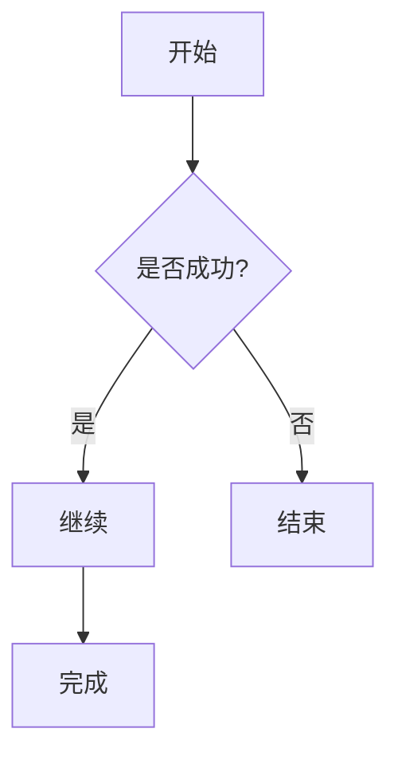

## 时序图

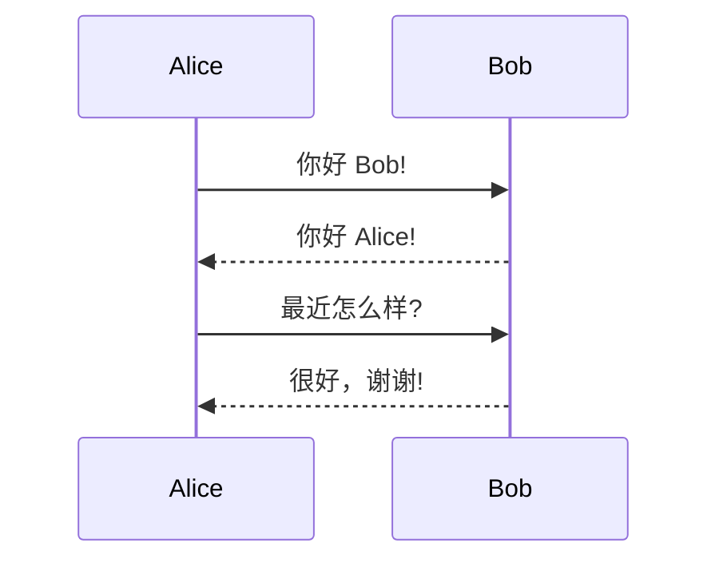

## 类图

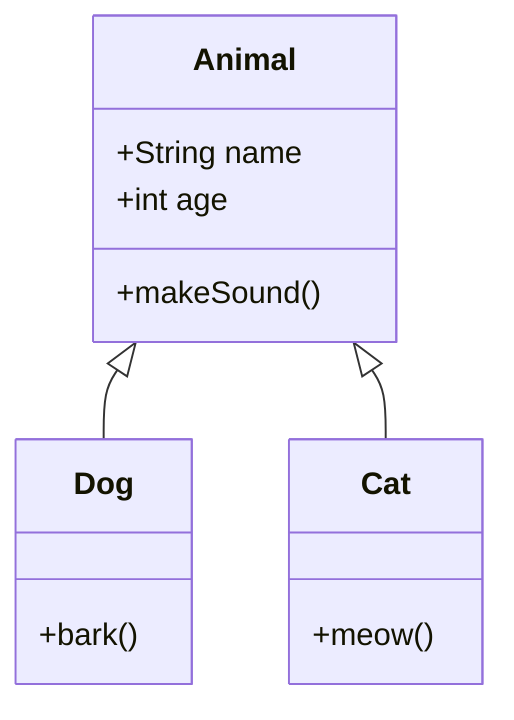

## 状态图

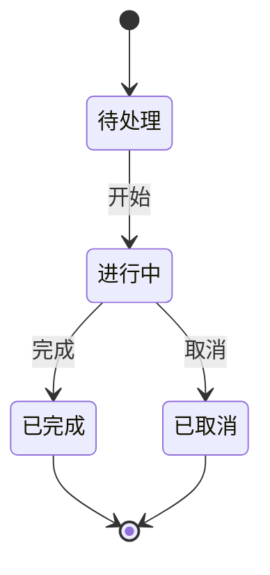

## 甘特图

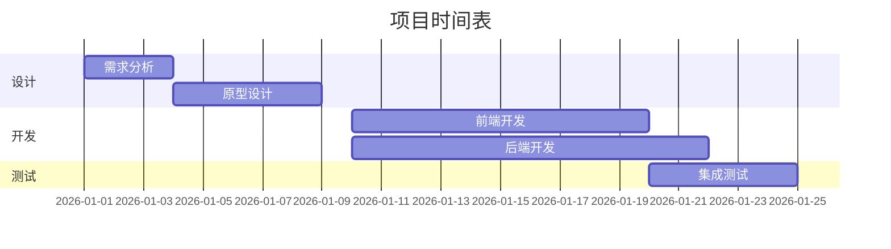

## 饼图

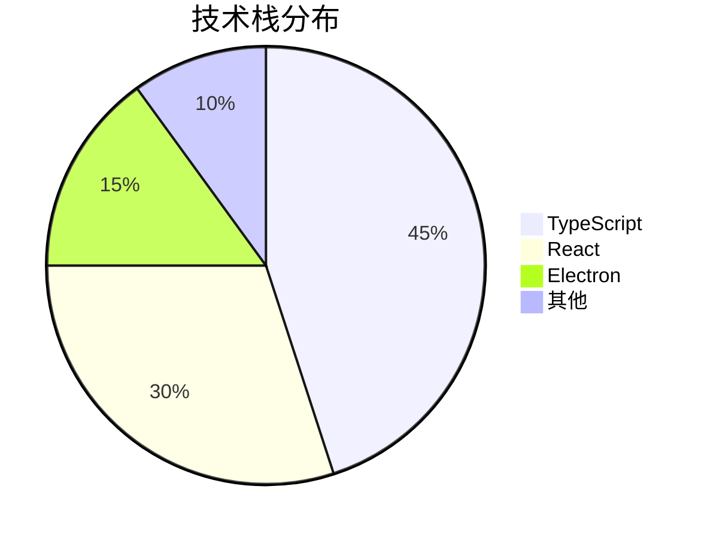

## ER 图（实体关系图）

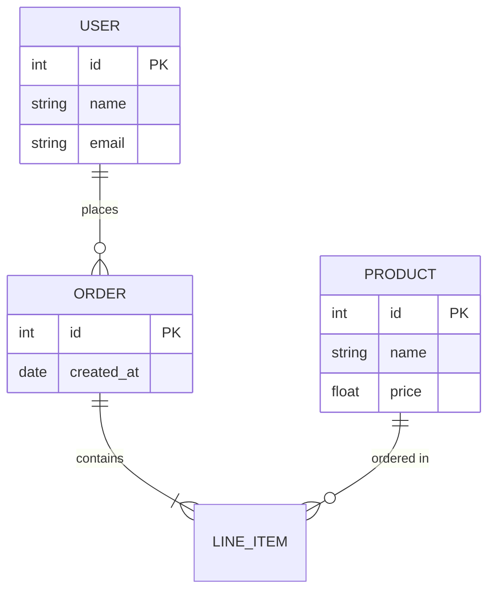

## 用户旅程图

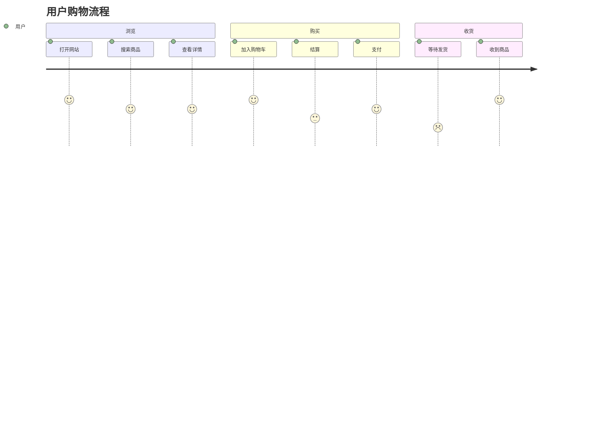

## Git 图

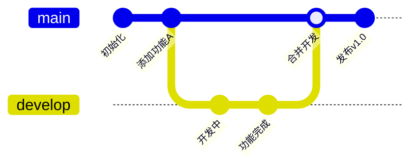

## 思维导图

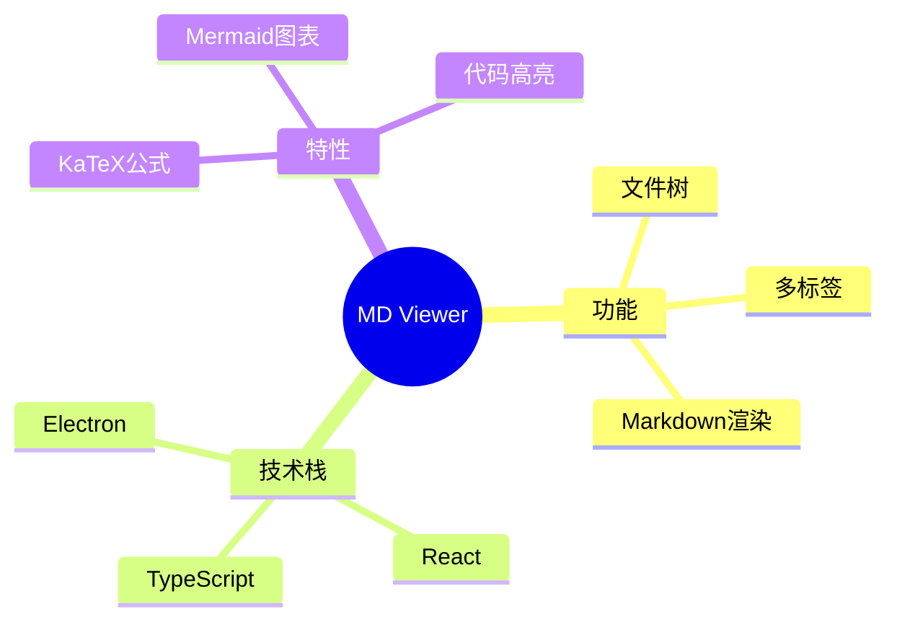

## 流程图（左右方向）


## 流程图（带子图）

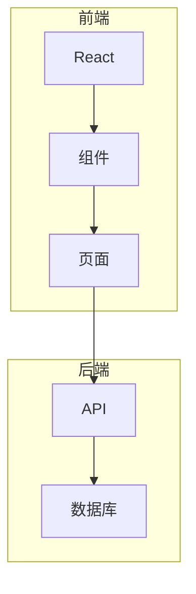

## C4 架构图

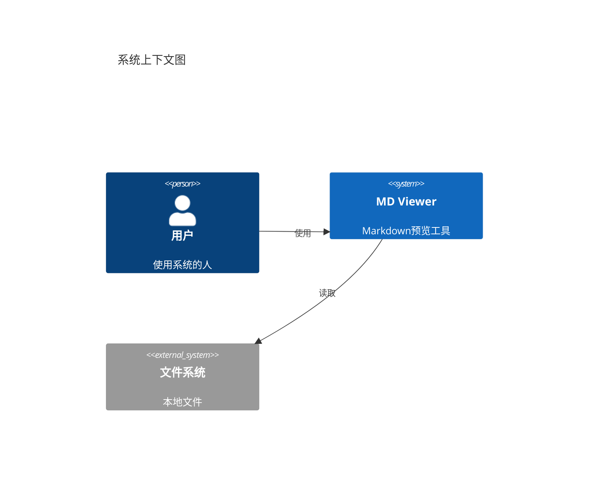

## 时间线

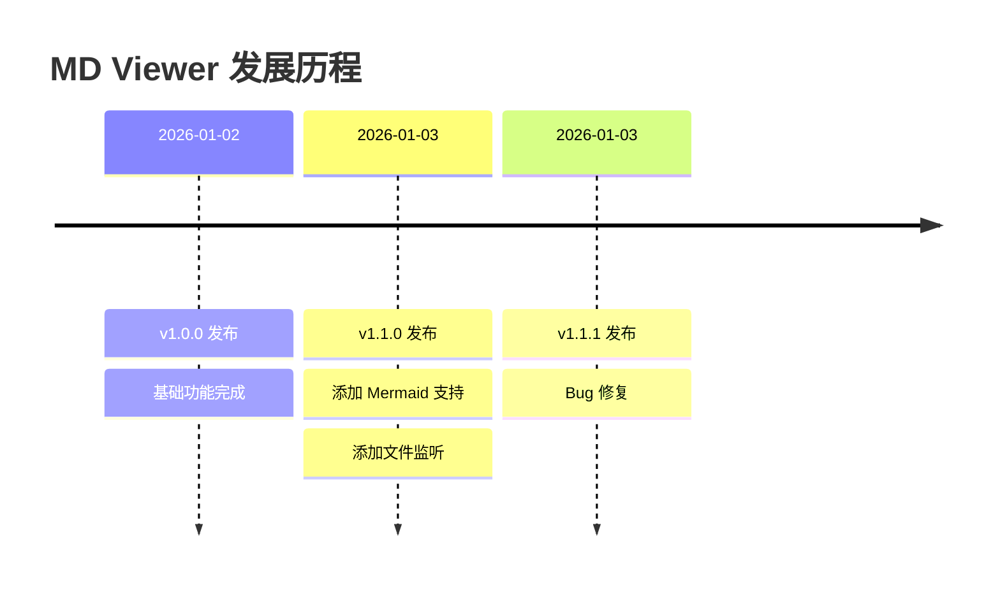

## 错误语法测试

以下是故意的错误语法，应该保留原始代码显示：

```mermaid
这是无效的 Mermaid 语法
应该显示原始代码而不是崩溃
```

---

## MD Viewer 系统专属测试

> 以下用例围绕 MD Viewer 自身的架构、功能和流程展开，增强代入感。

## MD-1. MD Viewer 渲染管线流程图

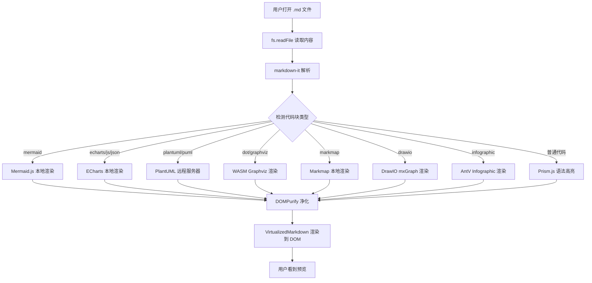

## MD-2. Electron 主进程与渲染进程通信

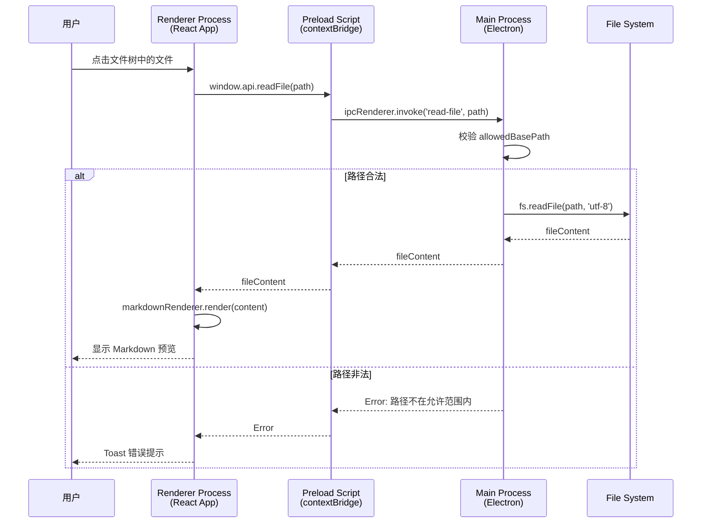

## MD-3. 文件监听与自动刷新

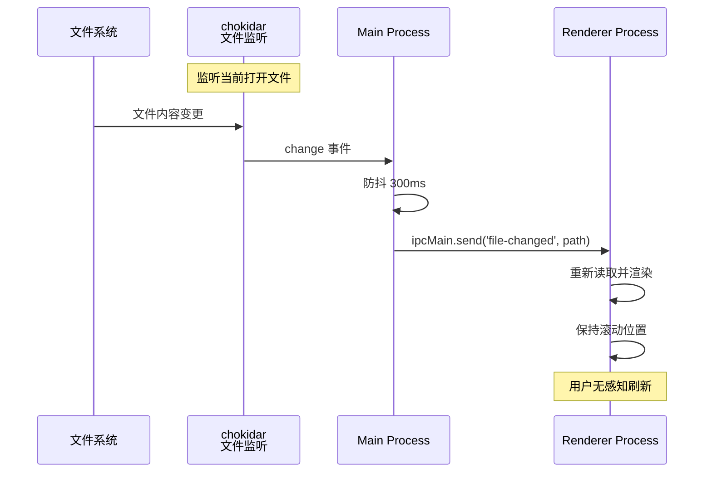

## MD-4. 导出功能状态图

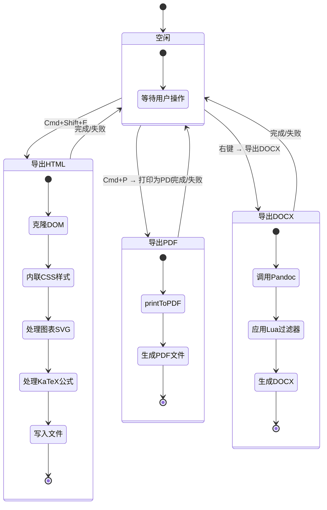

## MD-5. 书签系统 ER 图

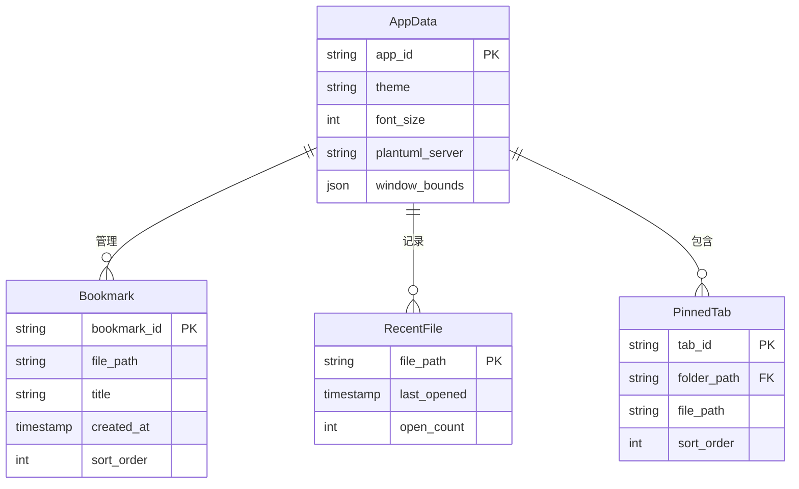

## MD-6. MD Viewer 版本发布甘特图

```mermaid
gantt
    title MD Viewer 版本发布时间线
    dateFormat YYYY-MM-DD
    axisFormat %m/%d

    section v1.3.x
    v1.3.5 基础功能          :done, v135, 2026-01-08, 1d
    v1.3.6 混合方案+书签     :done, v136, 2026-01-09, 1d
    v1.3.7 书签增强          :done, v137, 2026-01-09, 1d

    section v1.4.x
    v1.4.0 页面内搜索        :done, v140, 2026-01-10, 1d
    v1.4.2 置顶+字体+打印   :done, v142, 2026-01-10, 1d
    v1.4.3 全屏查看          :done, v143, 2026-01-10, 1d
    v1.4.4 目录自动滚动      :done, v144, 2026-01-11, 1d
    v1.4.7 导出HTML所见即所得 :done, v147, 2026-01-30, 1d

    section v1.5.x
    v1.5.0 ECharts+跨平台    :done, v150, 2026-02-07, 1d
    v1.5.1 递归分屏+Lightbox :done, v151, 2026-02-09, 1d
    v1.5.2 Infographic+多窗口 :done, v152, 2026-02-10, 1d
    v1.5.3 书签菜单+串行渲染 :done, v153, 2026-02-11, 1d
    v1.5.4 Markmap+Graphviz  :done, v154, 2026-02-13, 2d
    v1.5.5 DrawIO+工具栏     :active, v155, 2026-02-15, 3d
```

## MD-7. 技术栈饼图

```mermaid
pie title MD Viewer 技术栈组成
    "TypeScript" : 55
    "React/JSX" : 20
    "CSS" : 10
    "Electron API" : 10
    "Shell/Config" : 5
```

## MD-8. 图表渲染器类图

```mermaid
classDiagram
    class MarkdownRenderer {
        -md: MarkdownIt
        +render(content: string): string
        +configure(): void
    }

    class MermaidRenderer {
        +renderAll(container: HTMLElement): Promise~void~
        -initMermaid(): void
    }

    class EChartsRenderer {
        -instances: Map~string, ECharts~
        +render(el: HTMLElement, config: object): void
        +dispose(el: HTMLElement): void
    }

    class PlantUMLRenderer {
        -serverUrl: string
        -cache: Map~string, string~
        +render(code: string): Promise~string~
        -encode(code: string): string
    }

    class GraphvizRenderer {
        -wasmInstance: Graphviz
        +render(code: string): Promise~string~
        +init(): Promise~void~
    }

    class MarkmapRenderer {
        +render(el: HTMLElement, code: string): void
        -transformer: Transformer
    }

    class DrawIORenderer {
        +render(el: HTMLElement, xml: string): void
        -parseXML(xml: string): Document
    }

    MarkdownRenderer --> MermaidRenderer : 检测 mermaid 块
    MarkdownRenderer --> EChartsRenderer : 检测 echarts 块
    MarkdownRenderer --> PlantUMLRenderer : 检测 plantuml 块
    MarkdownRenderer --> GraphvizRenderer : 检测 dot 块
    MarkdownRenderer --> MarkmapRenderer : 检测 markmap 块
    MarkdownRenderer --> DrawIORenderer : 检测 drawio 块
```

## MD-9. 用户操作旅程图

```mermaid
journey
    title 用户使用 MD Viewer 的典型旅程
    section 启动
      打开 MD Viewer: 5: 用户
      选择文件夹: 4: 用户
      浏览文件树: 4: 用户
    section 预览
      点击 .md 文件: 5: 用户
      查看渲染效果: 5: 用户
      调整字体大小: 3: 用户
      切换亮暗主题: 4: 用户
    section 图表
      查看 Mermaid 图: 5: 用户
      查看 ECharts 图: 5: 用户
      全屏查看图表: 4: 用户
    section 导出
      导出为 HTML: 4: 用户
      导出为 PDF: 3: 用户
      分享给同事: 5: 用户
```

## MD-10. Git 分支管理

```mermaid
gitGraph
    commit id: "v1.5.3 release"
    branch feature/drawio
    commit id: "feat: drawio renderer"
    commit id: "feat: drawio toolbar"
    commit id: "test: drawio e2e"
    checkout main
    branch feature/plantuml
    commit id: "feat: plantuml support"
    commit id: "feat: plantuml cache"
    checkout main
    merge feature/drawio id: "merge drawio"
    merge feature/plantuml id: "merge plantuml"
    commit id: "v1.5.5 release"
```

## MD-11. Zustand 状态管理架构

```mermaid
graph LR
    subgraph Stores
        WS[windowStore<br/>isAlwaysOnTop]
        US[uiStore<br/>fontSize, theme]
        CS[clipboardStore<br/>clipboard data]
    end

    subgraph Components
        App[App.tsx]
        Nav[NavigationBar]
        VM[VirtualizedMarkdown]
        TB[TabBar]
        BB[BookmarkBar]
    end

    WS -->|useWindowStore| Nav
    US -->|useUIStore| App
    US -->|useUIStore| VM
    CS -->|useClipboardStore| App

    App -->|initWindowStore| WS
    App -->|applyCSSVariable| US
    Nav -->|toggleAlwaysOnTop| WS
    Nav -->|increaseFontSize| US
```

## MD-12. 安全防护流程

```mermaid
flowchart TD
    A[用户点击链接] --> B{链接类型判断}
    B -->|锚点 #xxx| C[页内滚动跳转]
    B -->|http/https| D[shell.openExternal<br/>系统浏览器打开]
    B -->|.md 文件链接| E[IPC 跳转到对应文件]
    B -->|file:// 协议| F[❌ 阻止]
    B -->|javascript:| G[❌ 阻止]
    B -->|其他协议| H[❌ 阻止默认行为]

    I[will-navigate 事件] --> J{目标 URL 检查}
    J -->|同源| K[允许导航]
    J -->|非同源| L[❌ 拦截<br/>防止 BrowserWindow 被劫持]

    M[DOMPurify] --> N[净化 HTML 输出]
    N --> O[移除 script/iframe/on* 事件]
```

## MD-13. 快捷键系统思维导图

```mermaid
mindmap
  root((MD Viewer 快捷键))
    文件操作
      Cmd+N 新建窗口
      Cmd+O 打开文件
      Cmd+W 关闭标签
    视图控制
      Cmd+加号 放大字体
      Cmd+减号 缩小字体
      Cmd+0 重置字体
      Cmd+Option+T 窗口置顶
      Cmd+F11 全屏查看
    搜索
      Cmd+Shift+F 页面搜索
      Cmd+G 下一个匹配
      Cmd+Shift+G 上一个匹配
    导出
      Cmd+P 打印/PDF
      Cmd+Shift+E 导出HTML
```

## MD-14. 多窗口架构 C4 图

```mermaid
C4Context
    title MD Viewer 多窗口架构
    Person(user, "用户", "使用 MD Viewer 的开发者")
    System(mainWindow, "主窗口", "BrowserWindow #1")
    System(subWindow, "子窗口", "BrowserWindow #2 (Cmd+N)")
    System(mainProcess, "Main Process", "Electron 主进程")
    SystemDb(appData, "AppData", "书签/设置/最近文件")
    System_Ext(fs, "文件系统", "本地 .md 文件")
    System_Ext(plantuml, "PlantUML Server", "远程渲染服务")

    Rel(user, mainWindow, "操作")
    Rel(user, subWindow, "操作")
    Rel(mainWindow, mainProcess, "IPC")
    Rel(subWindow, mainProcess, "IPC")
    Rel(mainProcess, appData, "读写")
    Rel(mainProcess, fs, "读取文件")
    Rel(mainWindow, plantuml, "HTTP")
    Rel(subWindow, plantuml, "HTTP")
```

## MD-15. 右键菜单系统流程

```mermaid
flowchart LR
    subgraph 预览区右键
        A1[📑 添加书签]
        A2[🔍 搜索]
        A3[📤 导出 HTML]
        A4[🖨️ 打印]
        A5[🔠 字体大小]
        A6[📋 复制]
    end

    subgraph 文件树右键
        B1[📂 在 Finder 中显示]
        B2[📑 添加到书签]
        B3[📋 复制路径]
        B4[📤 导出]
        B5[✏️ 重命名]
        B6[🗑️ 删除]
    end

    subgraph 书签右键
        C1[📂 在 Finder 中显示]
        C2[🗑️ 从书签移除]
        C3[📋 复制路径]
    end

    subgraph 最近文件右键
        D1[↔️ 分屏打开]
        D2[🗑️ 从历史移除]
    end
```
