# Mermaid 图表测试

## 流程图

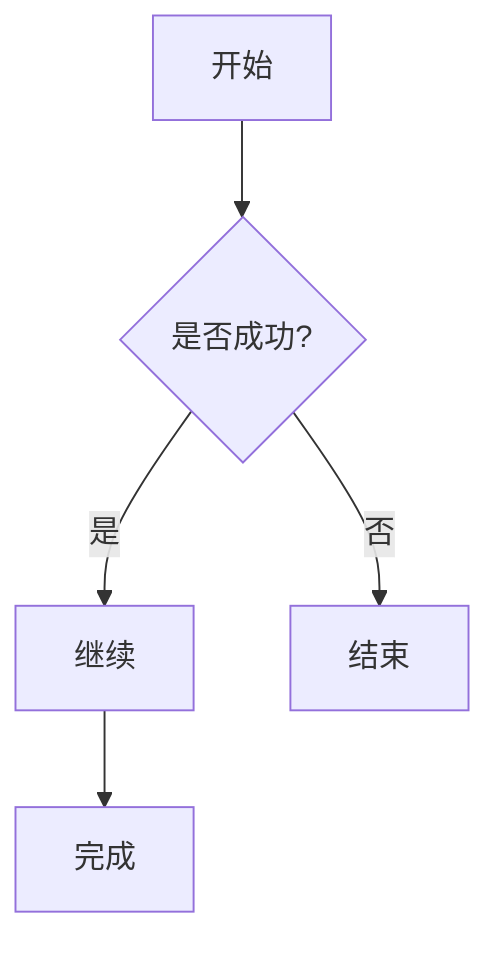

## 时序图

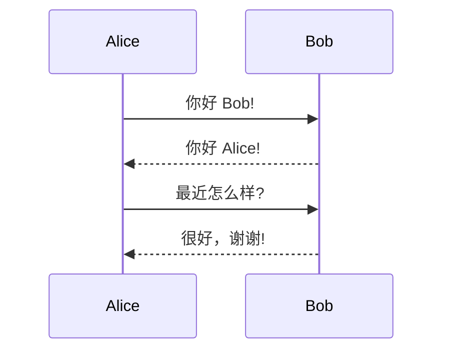

## 类图

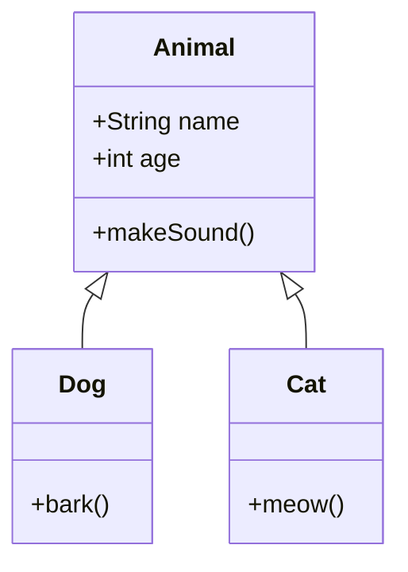

## 状态图

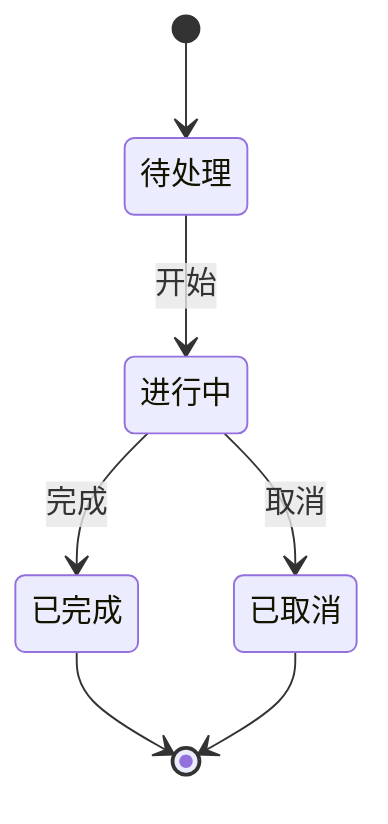

## 甘特图

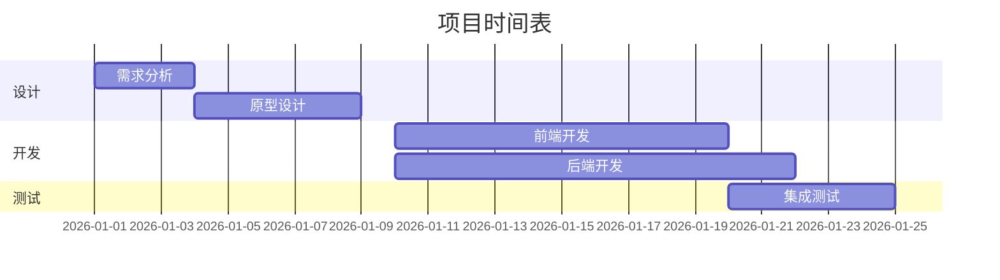

## 饼图

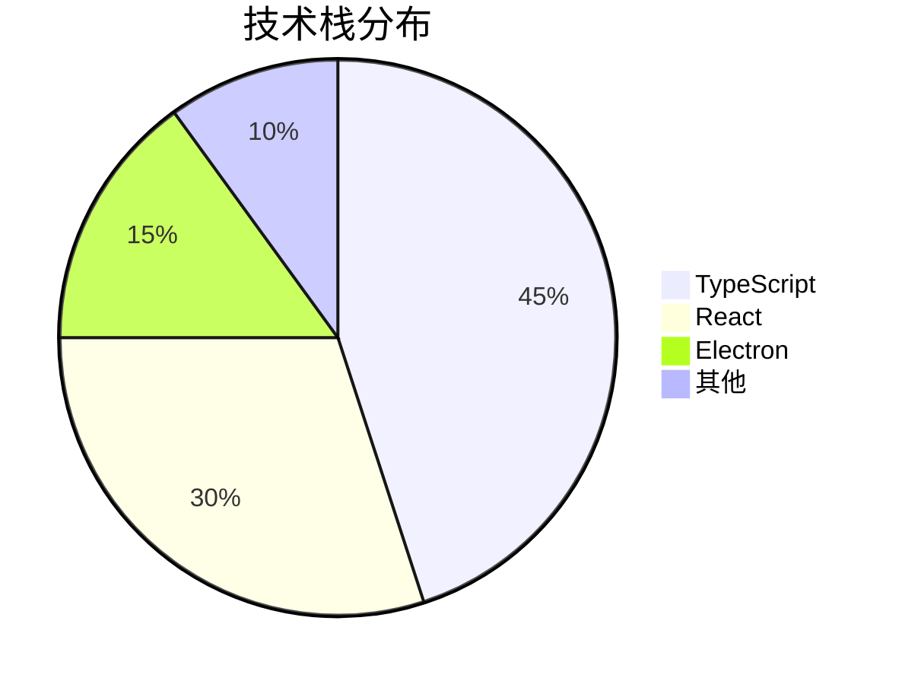

## ER 图（实体关系图）

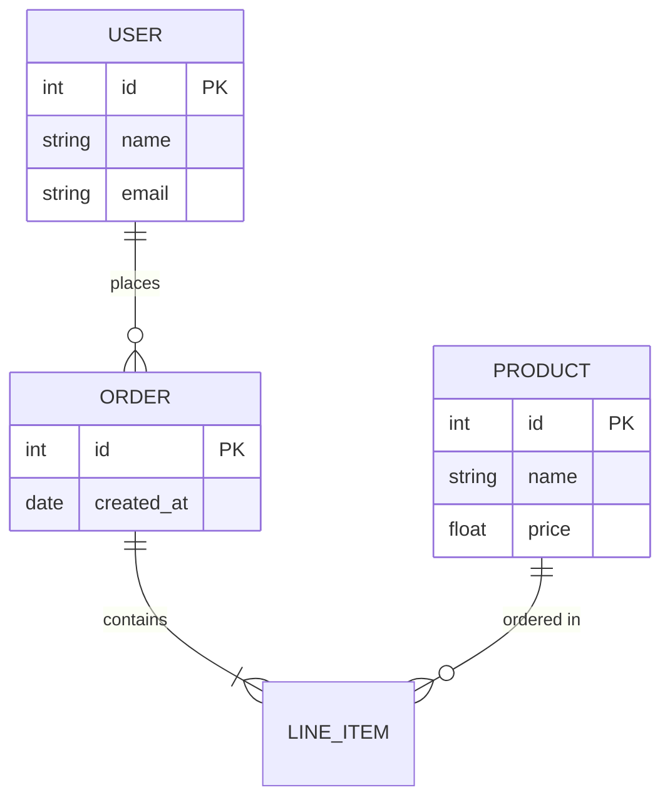

## 用户旅程图

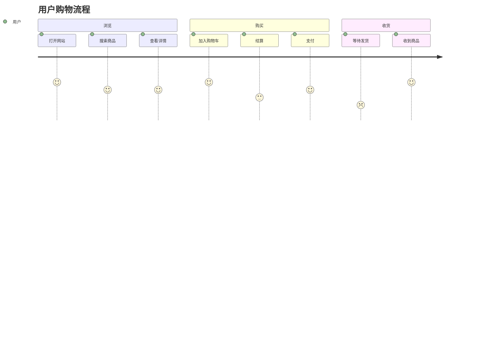

## Git 图

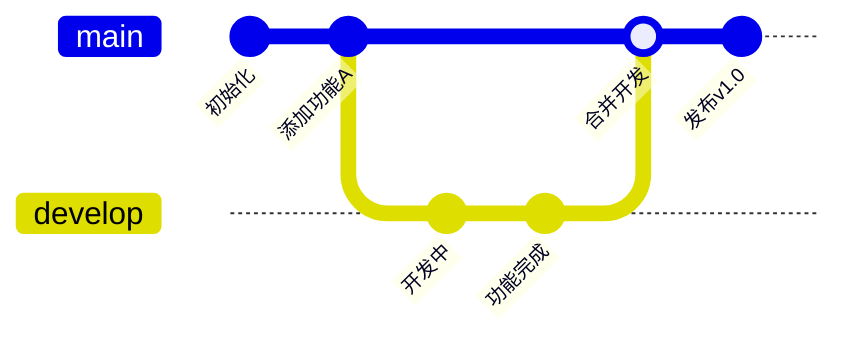

## 思维导图

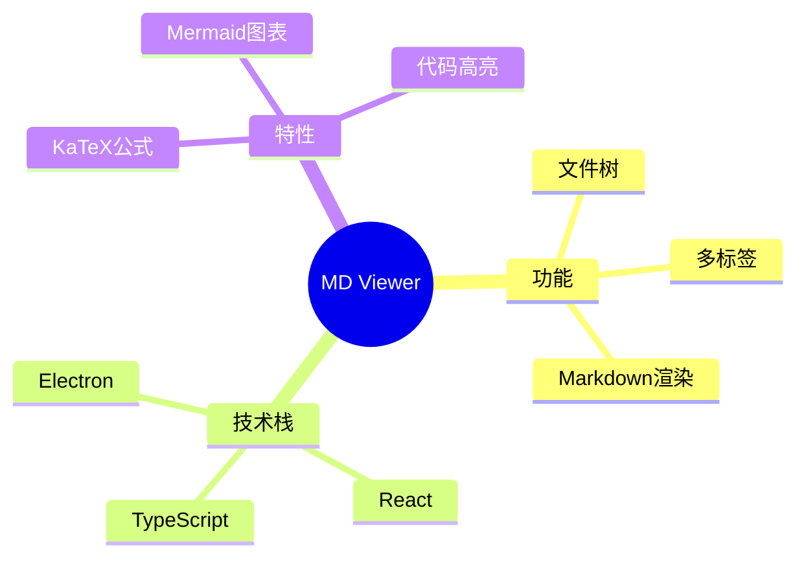

## 流程图（左右方向）

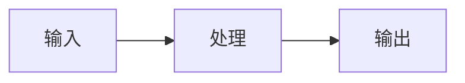

## 流程图（带子图）

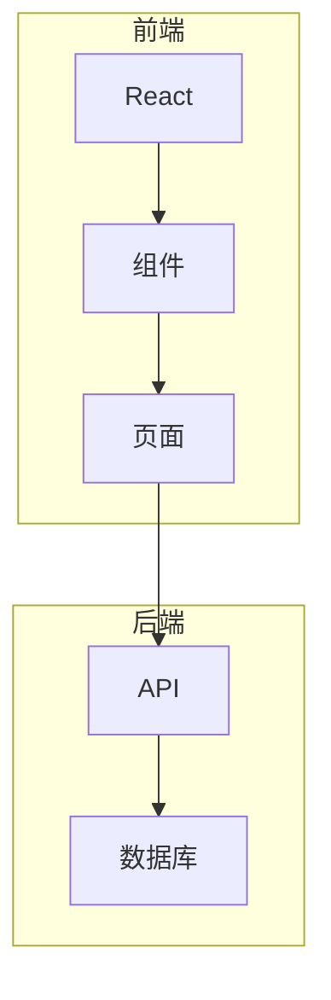

## 需求图

```mermaid
requirementDiagram
    requirement 用户登录 {
        id: REQ-001
        text: 用户必须能够登录系统
        risk: low
        verifymethod: test
    }
    element 登录页面 {
        type: ui
    }
    登录页面 - satisfies -> 用户登录
```

## C4 架构图

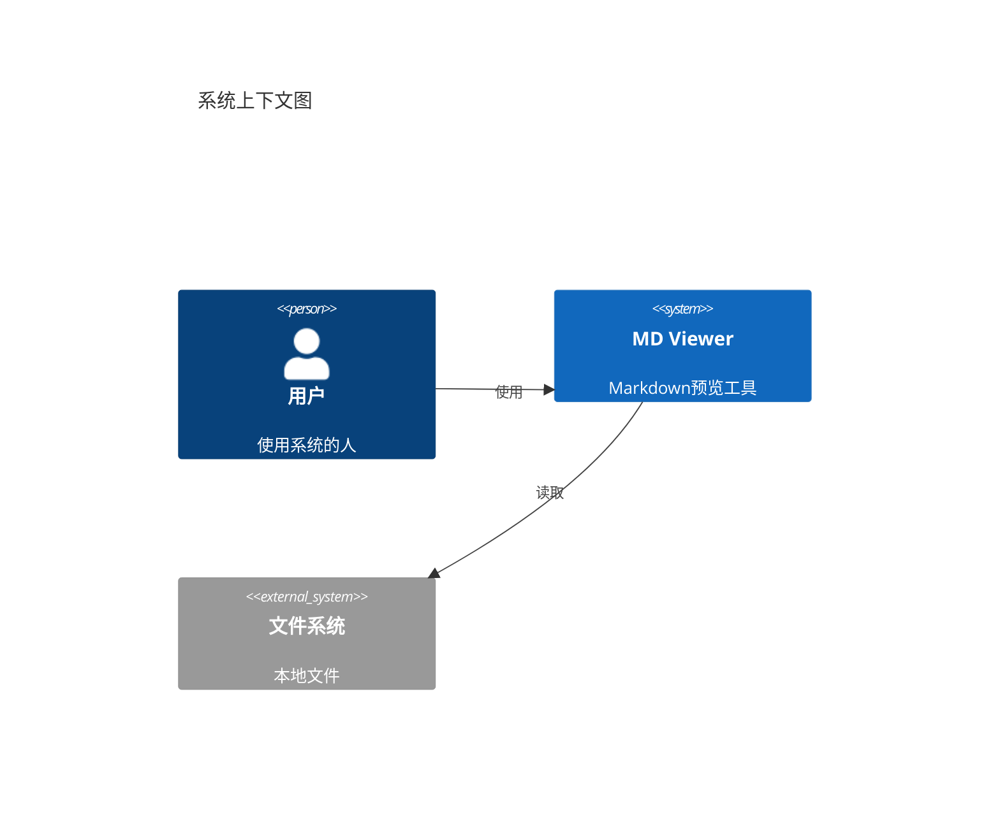

## 时间线

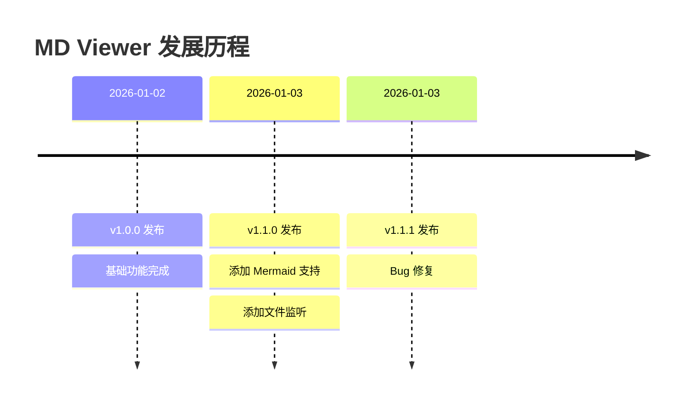

## 象限图

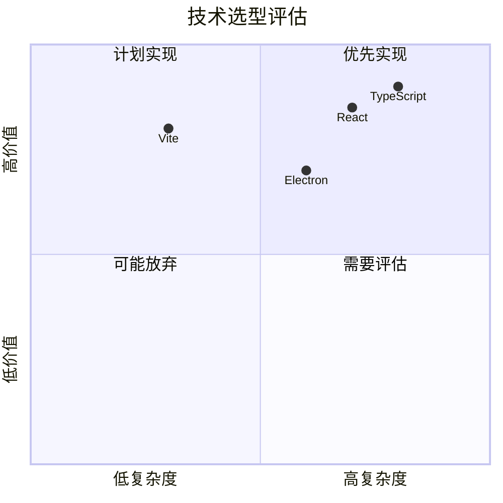

## XY 图表

```mermaid
xychart-beta
    title "月度销售额"
    x-axis [一月, 二月, 三月, 四月, 五月, 六月]
    y-axis "销售额(万)" 0 --> 100
    bar [30, 45, 60, 55, 70, 85]
    line [30, 45, 60, 55, 70, 85]
```

## Sankey 图

```mermaid
sankey-beta
    源A,目标X,5
    源A,目标Y,3
    源B,目标X,2
    源B,目标Y,4
    目标X,最终,7
    目标Y,最终,7
```

## 框图（Block）

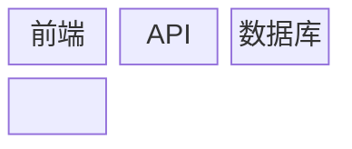

## 错误语法测试

以下是故意的错误语法，应该保留原始代码显示：

```mermaid
这是无效的 Mermaid 语法
应该显示原始代码而不是崩溃
```
