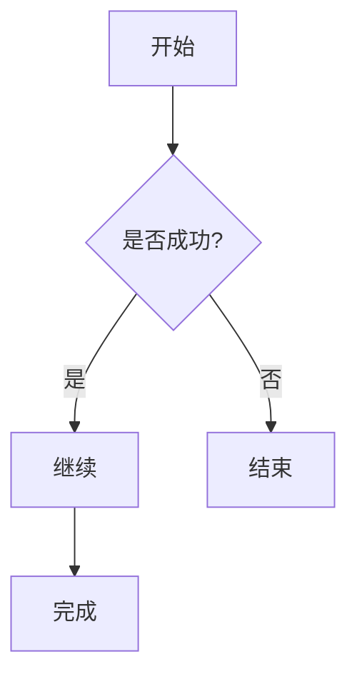
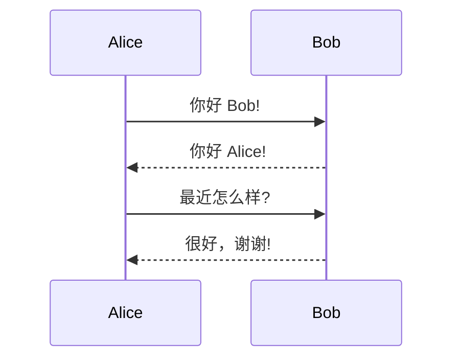
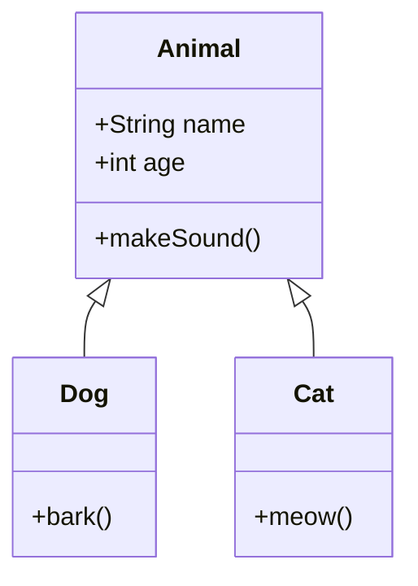
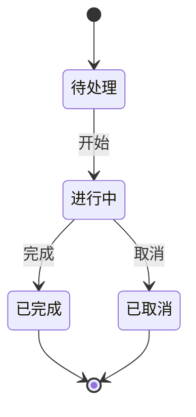
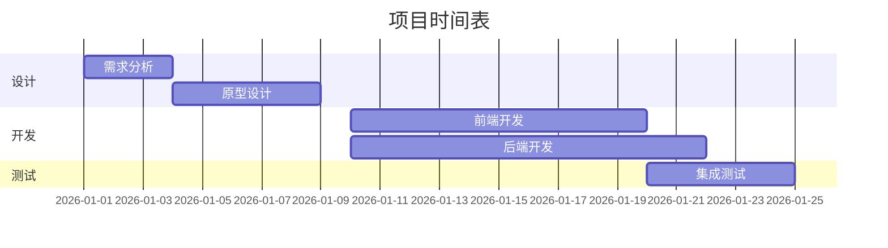

# Mermaid 图表测试

## 流程图

```mermaid
graph TD
    A[开始] --> B{是否成功?}
    B -->|是| C[继续]
    B -->|否| D[结束]
    C --> E[完成]
```

## 时序图

```mermaid
sequenceDiagram
    participant Alice
    participant Bob
    Alice->>Bob: 你好 Bob!
    Bob-->>Alice: 你好 Alice!
    Alice->>Bob: 最近怎么样?
    Bob-->>Alice: 很好，谢谢!
```

## 类图

```mermaid
classDiagram
    class Animal {
        +String name
        +int age
        +makeSound()
    }
    class Dog {
        +bark()
    }
    class Cat {
        +meow()
    }
    Animal <|-- Dog
    Animal <|-- Cat
```

## 状态图

```mermaid
stateDiagram-v2
    [*] --> 待处理
    待处理 --> 进行中: 开始
    进行中 --> 已完成: 完成
    进行中 --> 已取消: 取消
    已完成 --> [*]
    已取消 --> [*]
```

## 甘特图

```mermaid
gantt
    title 项目时间表
    dateFormat  YYYY-MM-DD
    section 设计
    需求分析           :a1, 2026-01-01, 3d
    原型设计           :after a1  , 5d
    section 开发
    前端开发           :2026-01-10  , 10d
    后端开发           :2026-01-10  , 12d
    section 测试
    集成测试           :2026-01-20  , 5d
```
