# PlantUML 综合测试文档

> 覆盖 PlantUML 主要图表类型、语法特性、边界条件和错误处理
> 共 40+ 测试用例

---

## 1. 序列图（基础）

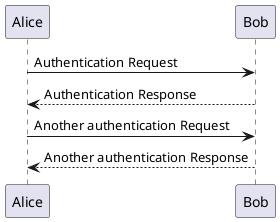

## 2. 序列图（高级 - 分组/注释/颜色）

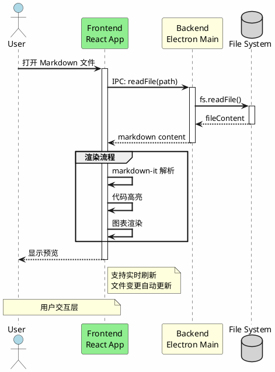

## 3. 类图

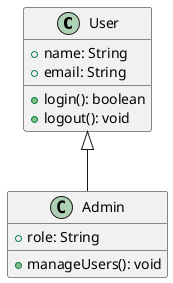

## 4. 类图（高级 - 接口/抽象/泛型）

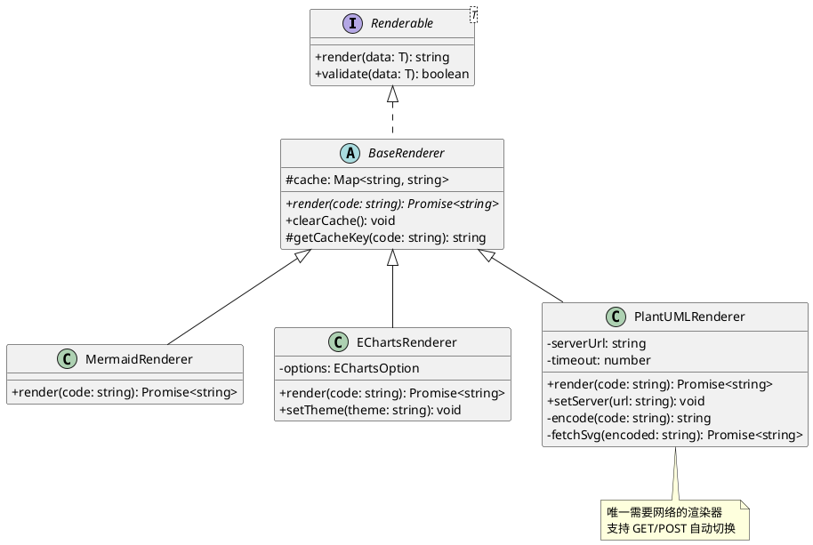

## 5. 活动图

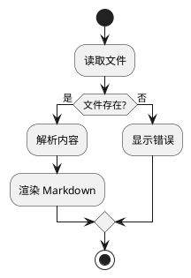

## 6. 活动图（高级 - 并行/循环/泳道）

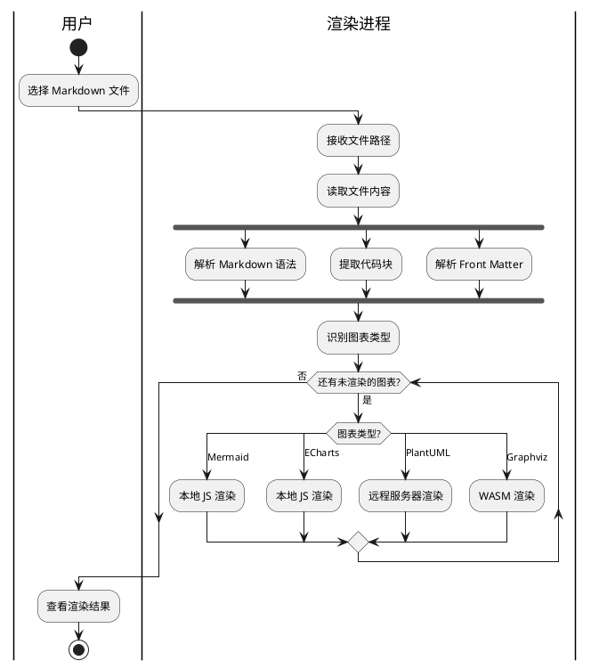

## 7. 用例图

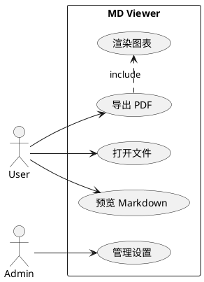

## 8. 组件图

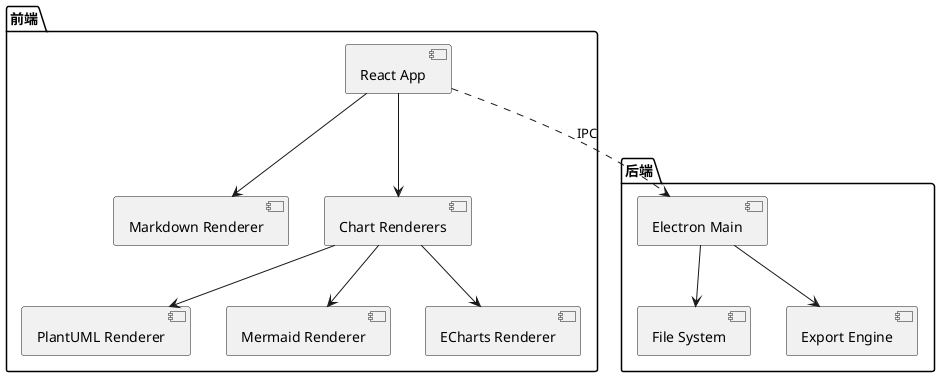

## 9. 状态图

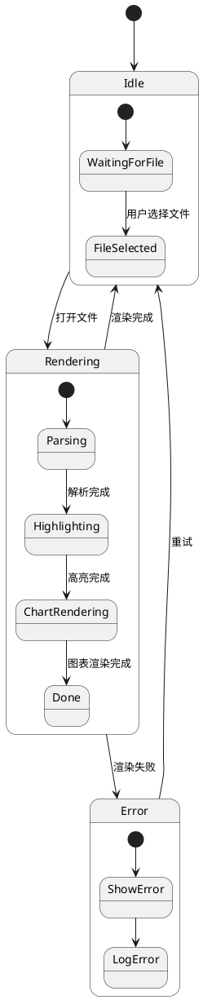

## 10. 状态图（并发状态）

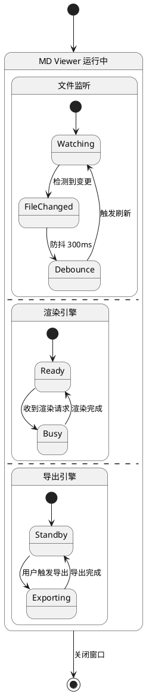

## 11. 对象图

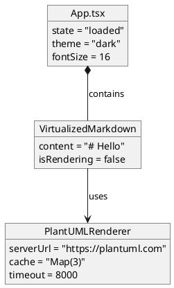

## 12. 部署图

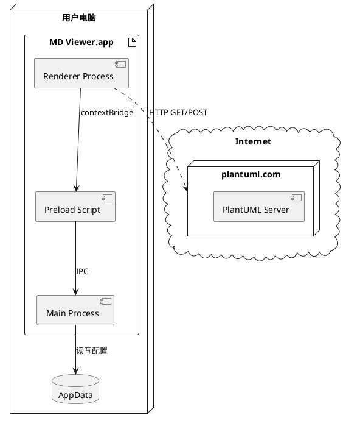

## 13. 时序图（Timing Diagram）

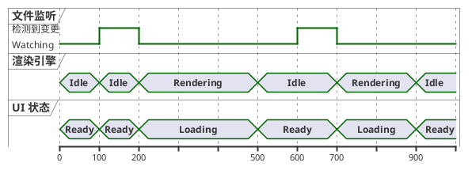

## 14. 甘特图

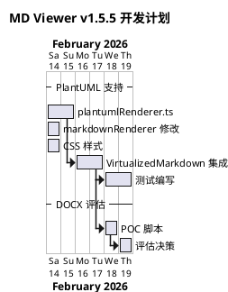

## 15. 思维导图（MindMap）

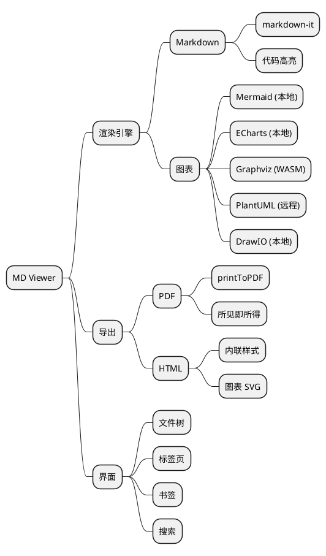

## 16. WBS 图（Work Breakdown Structure）

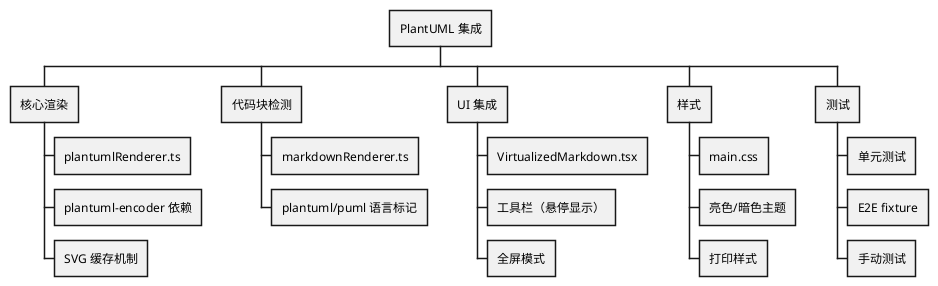

## 17. JSON 数据可视化

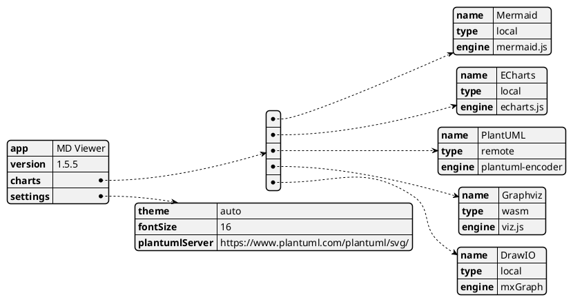

## 18. YAML 数据可视化

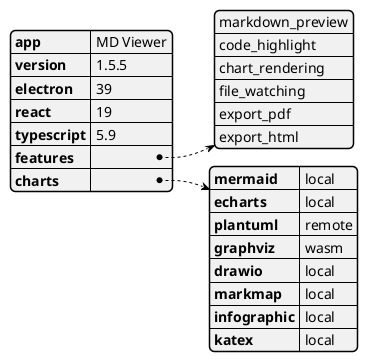

## 19. 网络图（nwdiag）

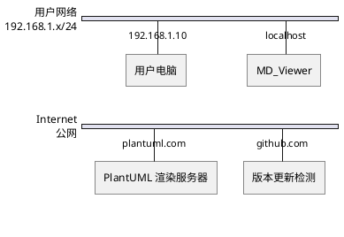

## 20. ER 图（Entity Relationship）

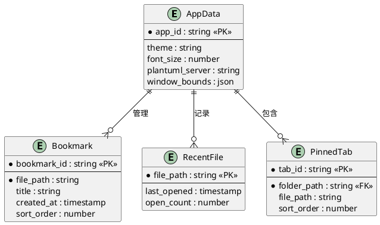

## 21. puml 语言标记测试

```puml
@startuml
Bob -> Alice : hello
Alice -> Bob : world
Bob -> Alice : 你好世界
@enduml
```

## 22. Salt 线框图（UI Wireframe）

```plantuml
@startsalt
{+
  {/ <b>通用 | 关于 }
  {
    主题: | ^自动^
    字体大小: | "16"
    PlantUML 服务器: | "https://plantuml.com/plantuml/svg/"
    [测试连接]
    ---
    [x] 启用文件监听
    [] 启用自动保存
    [x] 显示行号
  }
  {
    [  确定  ] | [  取消  ]
  }
}
@endsalt
```

## 23. Creole 富文本语法

```plantuml
@startuml
note as N
  = 标题级别 1
  == 标题级别 2
  === 标题级别 3

  **粗体文本** 和 //斜体文本// 和 __下划线__
  ~~删除线~~ 和 ""等宽字体""

  * 无序列表项 1
  * 无序列表项 2
    ** 嵌套项 2.1
    ** 嵌套项 2.2

  # 有序列表项 1
  # 有序列表项 2

  |= 表头1 |= 表头2 |= 表头3 |
  | 单元格1 | 单元格2 | 单元格3 |
  | A | B | C |

  <color:red>红色文本</color>
  <back:yellow>黄色背景</back>
  <size:20>大号文本</size>
end note
@enduml
```

## 24. skinparam 深度定制

```plantuml
@startuml
skinparam backgroundColor #2D2D2D
skinparam defaultFontColor #E0E0E0
skinparam defaultFontName "Courier New"
skinparam defaultFontSize 14

skinparam class {
  BackgroundColor #3C3F41
  BorderColor #5E6366
  ArrowColor #A9B7C6
  FontColor #E0E0E0
  AttributeFontColor #CC7832
  StereotypeFontColor #6A8759
}

skinparam note {
  BackgroundColor #2B2B2B
  BorderColor #5E6366
  FontColor #A9B7C6
}

class DarkThemeDemo {
  -privateField: string
  #protectedField: number
  +publicMethod(): void
  ~packageMethod(): boolean
}

note right of DarkThemeDemo
  暗色主题 skinparam 测试
  模拟 IDE 暗色风格
end note
@enduml
```

## 25. 包图（Package Diagram）

```plantuml
@startuml
package "src" {
  package "main" #LightYellow {
    [index.ts] as main_index
    [appDataManager.ts]
    [pandocExporter.ts]
  }

  package "renderer" #LightBlue {
    package "components" {
      [App.tsx]
      [VirtualizedMarkdown.tsx]
      [FileTree.tsx]
    }
    package "utils" {
      [markdownRenderer.ts]
      [plantumlRenderer.ts]
      [echartsRenderer.ts]
      [graphvizRenderer.ts]
    }
    package "stores" {
      [windowStore.ts]
      [uiStore.ts]
    }
  }

  package "preload" #LightGreen {
    [index.ts] as preload_index
  }
}

[App.tsx] --> [markdownRenderer.ts]
[VirtualizedMarkdown.tsx] --> [plantumlRenderer.ts]
[VirtualizedMarkdown.tsx] --> [echartsRenderer.ts]
preload_index ..> main_index : IPC Bridge
@enduml
```

## 26. 带图标的图表（Sprites）

```plantuml
@startuml
!define ICONURL https://raw.githubusercontent.com/tupadr3/plantuml-icon-font-sprites/v3.0.0/icons
!includeurl ICONURL/common.puml
!includeurl ICONURL/font-awesome-5/server.puml
!includeurl ICONURL/font-awesome-5/desktop.puml

title MD Viewer 架构（带图标）

rectangle "<$desktop>\nElectron App" as app
rectangle "<$server>\nPlantUML Server" as server

app --> server : HTTP Request
server --> app : SVG Response
@enduml
```

## 27. 正则表达式图（Regex）

```plantuml
@startuml
title Markdown 代码块正则匹配

robust "状态机" as SM

@0
SM is "初始"

@1
SM is "匹配 ```"

@2
SM is "读取语言"

@3
SM is "读取代码"

@4
SM is "匹配 ```"

@5
SM is "完成"
@enduml
```

## 28. 多图合一（多个 @startuml）

```plantuml
@startuml
title 图 A：简单序列
Alice -> Bob: 请求
Bob --> Alice: 响应
@enduml
```

```plantuml
@startuml
title 图 B：简单类
class Foo {
  +bar(): void
}
class Baz {
  +qux(): string
}
Foo --> Baz
@enduml
```

## 29. 超长标识符测试

```plantuml
@startuml
participant "这是一个非常非常非常非常非常非常非常非常长的参与者名称用来测试渲染器对长文本的处理能力" as LongName
participant "Short" as S

LongName -> S: 短消息
S --> LongName: 这也是一条非常非常非常非常非常非常非常非常长的消息文本用来测试消息标签的换行和截断行为
@enduml
```

## 30. 中文和特殊字符

```plantuml
@startuml
actor 用户
actor 管理员
participant "数据库\n(PostgreSQL)" as DB
participant "缓存\n(Redis)" as Cache

用户 -> DB: 查询数据 SELECT * FROM 表
DB --> 用户: 返回结果集

管理员 -> Cache: FLUSHDB
Cache --> 管理员: OK ✓

note over DB
  支持 UTF-8 编码
  包括：中文、日本語、한국어
  特殊符号：© ® ™ € £ ¥
  数学符号：∑ ∏ ∫ √ ∞
end note
@enduml
```

---

## 边界条件与错误处理

## 31. 空代码块

```plantuml
```

## 32. 只有 @startuml/@enduml

```plantuml
@startuml
@enduml
```

## 33. 缺少 @enduml

```plantuml
@startuml
Alice -> Bob: 这个图缺少 @enduml 结束标记
Bob --> Alice: 看看渲染器如何处理
```

## 34. 缺少 @startuml

```plantuml
Alice -> Bob: 这个图缺少 @startuml 开始标记
Bob --> Alice: 看看渲染器如何处理
@enduml
```

## 35. 语法错误的 PlantUML

```plantuml
@startuml
这不是有效的 PlantUML 语法
随便写一些文字看看会怎样
!@#$%^&*()
@enduml
```

## 36. 非常小的图

```plantuml
@startuml
A -> B
@enduml
```

## 37. 包含 HTML 标签的代码（XSS 测试）

```plantuml
@startuml
participant "<script>alert('xss')</script>" as XSS
participant "Normal" as N

XSS -> N: 
N --> XSS: <b>safe</b> response
note right: <iframe src="evil.com"></iframe>
@enduml
```

## 38. 大量节点的类图（性能测试）

```plantuml
@startuml
class A01 { +method(): void }
class A02 { +method(): void }
class A03 { +method(): void }
class A04 { +method(): void }
class A05 { +method(): void }
class A06 { +method(): void }
class A07 { +method(): void }
class A08 { +method(): void }
class A09 { +method(): void }
class A10 { +method(): void }
class A11 { +method(): void }
class A12 { +method(): void }
class A13 { +method(): void }
class A14 { +method(): void }
class A15 { +method(): void }

A01 --> A02
A02 --> A03
A03 --> A04
A04 --> A05
A05 --> A06
A06 --> A07
A07 --> A08
A08 --> A09
A09 --> A10
A10 --> A11
A11 --> A12
A12 --> A13
A13 --> A14
A14 --> A15
A15 --> A01

A01 ..> A08 : dependency
A05 ..> A12 : dependency
A03 ..> A10 : dependency
@enduml
```

## 39. 条件编译 / 预处理器指令

```plantuml
@startuml
!define SHOW_DETAILS
!define APP_NAME "MD Viewer"

title APP_NAME 架构

class MainProcess {
  +start(): void
}

!ifdef SHOW_DETAILS
class DetailedInfo {
  +debug: boolean
  +logLevel: string
  +getInfo(): string
}
MainProcess --> DetailedInfo
!endif

!ifndef HIDE_EXPORT
class ExportEngine {
  +exportPDF(): void
  +exportHTML(): void
}
MainProcess --> ExportEngine
!endif
@enduml
```

## 40. 包含链接和超链接

```plantuml
@startuml
class Controller [[https://example.com/docs/controller]] {
  +handle(): void
}

class Service [[https://example.com/docs/service]] {
  +process(): Result
}

class Repository [[https://example.com/docs/repo]] {
  +find(): Entity
  +save(entity: Entity): void
}

Controller --> Service
Service --> Repository

note right of Controller
  点击类名可跳转到文档
  [[https://example.com 查看更多]]
end note
@enduml
```

---

## 高级特性与混合测试

## 41. 主题切换测试

```plantuml
@startuml
!theme cerulean

title 使用 cerulean 主题

actor 用户
participant "前端" as FE
participant "后端" as BE
database "数据库" as DB

用户 -> FE: 请求
FE -> BE: API 调用
BE -> DB: 查询
DB --> BE: 结果
BE --> FE: JSON
FE --> 用户: 渲染页面
@enduml
```

## 42. 复杂序列图（ref/loop/alt/opt/break）

```plantuml
@startuml
title 文件导出完整流程

actor User
participant "App.tsx" as App
participant "ExportEngine" as EE
participant "PlantUMLRenderer" as PR
participant "FileSystem" as FS

User -> App: 点击导出 HTML

activate App

App -> App: 克隆 DOM

ref over App, PR
  图表渲染流程
  处理所有 PlantUML 代码块
end ref

loop 每个 PlantUML 代码块
  App -> PR: processPlantUMLInHtml(html)
  activate PR

  alt 缓存命中
    PR --> App: 返回缓存 SVG
  else 缓存未命中
    PR -> PR: encode(code)

    opt 编码长度 > 4000
      PR -> PR: 切换为 POST 请求
    end

    PR -> PR: fetch(serverUrl)

    alt 请求成功
      PR --> App: SVG 内容
    else 超时 (8s)
      PR --> App: 错误提示 HTML
    else 网络错误
      PR --> App: 降级显示代码块
    end
  end

  deactivate PR
end

App -> EE: generateHTML(content)
activate EE

EE -> FS: writeFile(path, html)
activate FS
FS --> EE: success
deactivate FS

EE --> App: filePath
deactivate EE

App --> User: 导出完成通知
deactivate App

break 用户取消
  User -> App: 取消导出
  App --> User: 已取消
end
@enduml
```

## 43. 混合 Markdown 内容

这是一段普通的 Markdown 文本，中间穿插 PlantUML 图表。

### 系统架构

下面是系统的简化架构图：

```plantuml
@startuml
component [Frontend] as FE
component [Backend] as BE
FE --> BE : REST API
@enduml
```

上面的图展示了前后端的基本关系。接下来看数据流：

| 步骤 | 操作 | 说明 |
|------|------|------|
| 1 | 用户打开文件 | 通过文件树或拖拽 |
| 2 | 解析 Markdown | markdown-it 处理 |
| 3 | 渲染图表 | 各渲染器并行处理 |

```plantuml
@startuml
start
:步骤 1: 打开文件;
:步骤 2: 解析 Markdown;
:步骤 3: 渲染图表;
stop
@enduml
```

> 注意：PlantUML 是唯一需要网络连接的图表类型。

代码示例（非 PlantUML，不应被渲染）：

```javascript
// 这不是 PlantUML，不应该被渲染为图表
const renderer = new PlantUMLRenderer();
await renderer.render('@startuml\nA->B\n@enduml');
```

```python
# 这也不是 PlantUML
print("@startuml")
print("A -> B: hello")
print("@enduml")
```

## 44. 带立体声明的图（Stereotypes）

```plantuml
@startuml
class UserController <<Controller>> <<REST>> {
  +getUser(id: string): User
  +createUser(data: UserDTO): User
  +deleteUser(id: string): void
}

class UserService <<Service>> {
  +findById(id: string): User
  +create(data: UserDTO): User
  +delete(id: string): void
}

class UserRepository <<Repository>> <<JPA>> {
  +findById(id: string): Optional<User>
  +save(user: User): User
  +deleteById(id: string): void
}

UserController --> UserService
UserService --> UserRepository
@enduml
```

## 45. 带颜色和渐变的图

```plantuml
@startuml
skinparam roundcorner 15

rectangle "输入层" #LightBlue/LightCyan {
  (Markdown 文件) as input
}

rectangle "处理层" #LightGreen/PaleGreen {
  (markdown-it 解析) as parse
  (代码高亮) as highlight
  (图表检测) as detect
}

rectangle "渲染层" #LightYellow/LemonChiffon {
  (Mermaid) as m1
  (ECharts) as m2
  (PlantUML) as m3 #Pink
  (Graphviz) as m4
  (DrawIO) as m5
}

rectangle "输出层" #LightCoral/MistyRose {
  (HTML 预览) as out1
  (PDF 导出) as out2
  (HTML 导出) as out3
}

input --> parse
parse --> highlight
parse --> detect
detect --> m1
detect --> m2
detect --> m3
detect --> m4
detect --> m5
m1 --> out1
m2 --> out1
m3 --> out1
m4 --> out1
m5 --> out1
out1 --> out2
out1 --> out3

legend right
  | 颜色 | 含义 |
  |<#Pink>| 需要网络 |
  |<#LightGreen>| 本地处理 |
endlegend
@enduml
```

---

## 统计

| 类别 | 数量 | 编号 |
|------|------|------|
| 序列图 | 3 | 1, 2, 42 |
| 类图 | 3 | 3, 4, 44 |
| 活动图 | 2 | 5, 6 |
| 用例图 | 1 | 7 |
| 组件图 | 1 | 8 |
| 状态图 | 2 | 9, 10 |
| 对象图 | 1 | 11 |
| 部署图 | 1 | 12 |
| 时序图 | 2 | 13, 27 |
| 甘特图 | 1 | 14 |
| 思维导图 | 1 | 15 |
| WBS 图 | 1 | 16 |
| JSON 可视化 | 1 | 17 |
| YAML 可视化 | 1 | 18 |
| 网络图 | 1 | 19 |
| ER 图 | 1 | 20 |
| puml 标记 | 1 | 21 |
| Salt 线框图 | 1 | 22 |
| Creole 语法 | 1 | 23 |
| skinparam 定制 | 1 | 24 |
| 包图 | 1 | 25 |
| Sprites 图标 | 1 | 26 |
| 多图合一 | 1 | 28 |
| 长文本测试 | 1 | 29 |
| 中文/特殊字符 | 1 | 30 |
| 边界条件 | 5 | 31-35 |
| 性能测试 | 2 | 36, 38 |
| XSS 安全测试 | 1 | 37 |
| 预处理器 | 1 | 39 |
| 超链接 | 1 | 40 |
| 主题 | 1 | 41 |
| 混合内容 | 1 | 43 |
| 颜色/渐变 | 1 | 45 |
| **合计** | **45** | |
